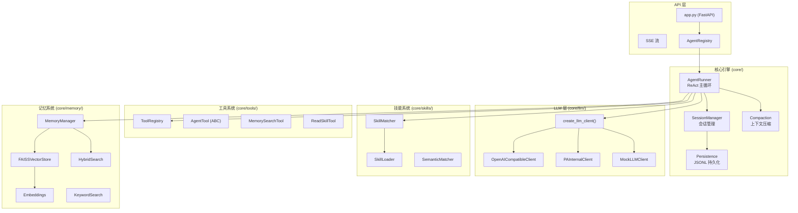
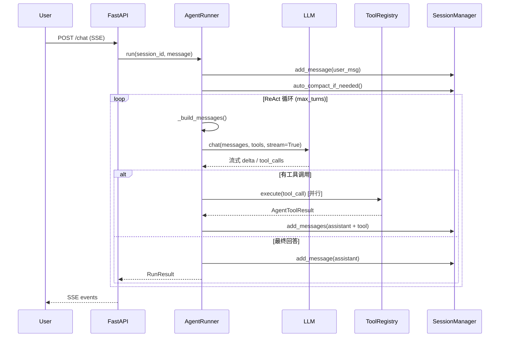
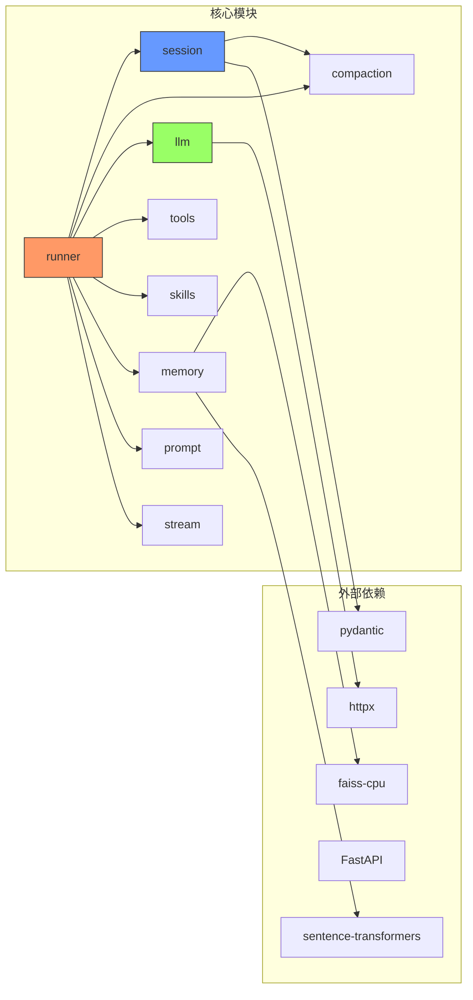

# ark-agentic 架构文档

> 生成日期: 2026-02-17 | 版本: 0.1.0 | 状态: 初始版本

## 1. 项目概览

**ark-agentic** 是一个轻量级 Python ReAct Agent 框架，面向金融保险行业，提供工具调用、技能系统、会话管理、流式输出和向量记忆能力。

```
技术栈: Python 3.10+ / FastAPI / httpx / FAISS / Sentence-Transformers
包管理: uv (PEP 723)
协议:  OpenAI Chat Completions 兼容
```

---

## 2. 系统架构

### 2.1 整体分层



### 2.2 核心数据流



---

## 3. 模块详解

### 3.1 智能体 (AgentRunner)

| 属性 | 说明 |
|------|------|
| 文件 | `core/runner.py` (865 行) |
| 模式 | ReAct (Reason → Act → Observe) |
| 并发 | `asyncio.gather()` 并行工具调用 |
| 输出 | 支持流式 (SSE) 和非流式 |

**关键设计:**
- `RunnerConfig`: 控制 model/temperature/max_turns/max_tool_calls_per_turn 等
- `RunOptions` (Pydantic): 每次请求级别覆盖 model/temperature
- `_run_loop()`: 核心 ReAct 循环，包含 LLM 调用、工具执行、结果聚合
- `_build_system_prompt()`: 动态拼接系统提示 + 技能 + 工具描述
- 回调: `on_step` / `on_content` 用于 SSE 推送

### 3.2 会话管理 (SessionManager)

| 属性 | 说明 |
|------|------|
| 文件 | `core/session.py` (454 行) + `core/persistence.py` (约 700 行) |
| 存储 | 内存 `dict` + JSONL 文件持久化 |
| 压缩 | LLM 摘要 + 自适应分块 |

**关键设计:**
- `SessionEntry`: 内存中的会话状态（消息列表 + token 统计 + 元数据）
- 持久化策略: 增量追加 JSONL，定期同步元数据
- `auto_compact_if_needed()`: 自动检测 token 超限并触发压缩
- 压缩前回调: 将即将丢弃的消息摘要写入 `MEMORY.md`

### 3.3 LLM 客户端

| 属性 | 说明 |
|------|------|
| 文件 | `core/llm/` (7 文件) |
| 协议 | `LLMClientProtocol` (typing.Protocol) |
| 提供商 | deepseek / pa / mock |

**关键设计:**
- `LLMClientProtocol`: 定义 `chat()` 接口，返回 `dict | AsyncIterator`
- `BaseLLMClient` (ABC): 基类，持有 `LLMConfig`
- `LLMConfig`: provider/api_key/base_url/model/temperature/extra_headers/extra_body
- `DynamicValues`: 动态值生成器 (`uuid()` / `timestamp()` / `from_kwargs()`)
- `create_llm_client()`: 工厂函数，一行代码创建客户端
- `LLMResponse` / `LLMUsage`: 统一响应类型，支持 OpenAI 格式互转

### 3.4 技能系统 (Skills)

| 属性 | 说明 |
|------|------|
| 文件 | `core/skills/` (5 文件) |
| 格式 | SKILL.md (YAML frontmatter + Markdown) |
| 加载模式 | full / dynamic / semantic |

**关键设计:**
- `SkillLoader`: 从目录加载 SKILL.md，解析 frontmatter 元数据
- `SkillConfig`: agent_id / skill_directories / default_load_mode
- ID 命名空间: `{agent_id}.{skill_name}` 全局唯一
- `SkillMatcher`: 资格检查 (OS/binaries/env/tools) + 策略过滤 (auto/manual/always)
- `build_skill_prompt()`: 全量注入系统提示
- `format_skills_metadata_for_prompt()`: 仅元数据模式 (XML 格式 `<available_skills>`)
- `ReadSkillTool`: LLM 按需加载技能正文

### 3.5 记忆系统 (Memory)

| 属性 | 说明 |
|------|------|
| 文件 | `core/memory/` (8 文件) |
| 存储 | FAISS 向量索引 + 本地文件 |
| 搜索 | 向量 / 关键词 / 混合 (RRF) |

**关键设计:**
- `MemoryManager`: 统一接口（sync / search / add_document / status）
- `FAISSVectorStore`: FAISS IndexFlatIP + Sentence-Transformers 嵌入
- `HybridSearch`: Reciprocal Rank Fusion (RRF) 合并向量 + 关键词结果
- `MemoryConfig`: workspace_dir / memory_paths / auto_sync / chunk 配置
- 文件同步: 监控 `MEMORY.md` 和 `memory/` 目录变化，增量更新索引
- 会话压缩联动: 压缩前将丢弃消息摘要写入 MEMORY.md

### 3.6 工具系统 (Tools)

| 属性 | 说明 |
|------|------|
| 文件 | `core/tools/` (5 文件) |
| 基类 | `AgentTool` (ABC) |
| 协议 | OpenAI function calling JSON Schema |

**关键设计:**
- `AgentTool`: name/description/parameters/execute() 抽象
- `ToolRegistry`: 注册/查找/分组/过滤/schema 生成
- `ToolParameter`: 类型安全参数定义 → `to_json_schema()`
- 参数读取辅助: `read_string_param()` / `read_int_param()` 等

### 3.7 API 层

| 属性 | 说明 |
|------|------|
| 文件 | `app.py` (434 行) |
| 框架 | FastAPI + SSE |
| 端点 | `/chat` / `/sessions` |

**关键设计:**
- `AgentRegistry`: 多 Agent 注册表 (agent_id → AgentRunner)
- `SSEEvent`: 对齐 OpenAI Responses API 事件格式
- 自定义 Headers: `x-ark-session-key` / `x-ark-user-id` / `x-ark-trace-id`
- 幂等键: `idempotency_key` 防止重复请求

---

## 4. 目录结构

```
src/ark_agentic/
├── core/
│   ├── runner.py              # AgentRunner (ReAct 主循环)
│   ├── session.py             # SessionManager (会话管理)
│   ├── compaction.py          # 上下文压缩 (token 估算 + LLM 摘要)
│   ├── persistence.py         # JSONL 持久化
│   ├── types.py               # 核心类型定义
│   ├── validation.py          # 输入校验
│   ├── llm/
│   │   ├── base.py            # LLMClientProtocol + LLMConfig
│   │   ├── factory.py         # create_llm_client()
│   │   ├── openai_compat.py   # OpenAI 兼容客户端
│   │   ├── pa_internal_llm.py # PA 内部 LLM
│   │   ├── mock.py            # Mock 客户端
│   │   └── errors.py          # LLM 错误处理
│   ├── tools/
│   │   ├── base.py            # AgentTool 基类
│   │   ├── registry.py        # ToolRegistry
│   │   ├── memory.py          # Memory 工具
│   │   └── read_skill.py      # ReadSkill 工具
│   ├── skills/
│   │   ├── base.py            # SkillConfig + 资格检查
│   │   ├── loader.py          # SkillLoader (frontmatter 解析)
│   │   ├── matcher.py         # SkillMatcher (策略过滤)
│   │   └── semantic_matcher.py # 语义匹配
│   ├── memory/
│   │   ├── manager.py         # MemoryManager
│   │   ├── vector_store.py    # FAISSVectorStore
│   │   ├── embeddings.py      # 嵌入模型
│   │   ├── hybrid.py          # 混合搜索
│   │   ├── keyword_search.py  # 关键词搜索
│   │   ├── chunker.py         # 文档分块
│   │   └── types.py           # Memory 类型
│   ├── stream/
│   │   └── assembler.py       # 流式输出组装
│   └── prompt/
│       └── builder.py         # 提示词构建
├── agents/
│   └── insurance/             # 保险智能体示例
│       ├── agent.py           # 入口
│       ├── api.py             # 工厂函数
│       ├── tools/             # 业务工具
│       └── skills/            # 业务技能
├── app.py                     # FastAPI 应用
└── static/                    # Web UI
```

---

## 5. ark-agentic vs openclaw-main 架构对比

### 5.1 总体差异

| 维度 | ark-agentic | openclaw-main |
|------|-------------|---------------|
| **语言** | Python 3.10+ | TypeScript (Node.js) |
| **规模** | ~5K 行核心代码 | ~50K+ 行核心代码 |
| **定位** | 轻量级 ReAct 框架 | 全功能 AI Coding Agent 平台 |
| **架构风格** | 单体 + 组合注入 | 模块化 + 事件驱动 + 插件体系 |
| **部署形态** | FastAPI 微服务 | CLI / IDE 嵌入 / 多渠道网关 |

### 5.2 智能体 (Agent) 对比

| 方面 | ark-agentic | openclaw-main |
|------|-------------|---------------|
| **核心类** | `AgentRunner` (单文件 865 行) | `runEmbeddedPiAgent` (入口) + 20+ 模块拆分 |
| **执行模式** | ReAct 循环 | 嵌入式 Pi Agent + 事件订阅 |
| **模型切换** | `RunOptions` 覆盖 | Auth Profile 轮换 + 自动 Failover |
| **错误处理** | 基础重试 + 友好消息 | 多层分类 (auth/billing/context overflow/failover) |
| **多 Agent** | `AgentRegistry` 简单注册 | `AgentScope` + Agent Config + 多渠道分发 |
| **Identity** | 无 | `identity.ts` (头像 + 文件 + Agent 标识) |

**关键差异:**
- openclaw 的 `runEmbeddedPiAgent` 支持 Auth Profile 轮换、自动 failover、Google Gemini 专用处理、Anthropic 安全过滤等复杂场景
- ark-agentic 采用单一 `AgentRunner` 类，职责集中但代码可追踪性好
- openclaw 将 runner 拆分为 `run/` (attempt/payloads), `compact.ts`, `history.ts`, `model.ts` 等 20+ 文件

### 5.3 会话管理 (Session) 对比

| 方面 | ark-agentic | openclaw-main |
|------|-------------|---------------|
| **数据模型** | `SessionEntry` (内存 dict) | Session Store (JSONL 文件) + Session Key 体系 |
| **持久化** | JSONL 增量追加 | JSONL + 修复工具 (`session-file-repair.ts`) |
| **标识** | UUID session_id | 结构化 `session-key` (含 agent/channel 上下文) |
| **压缩** | `LLMSummarizer` + 自适应分块 | 多阶段分块 + fallback + 上下文共享裁剪 |
| **写锁** | 无 | `session-write-lock.ts` (并发安全) |
| **历史裁剪** | token 阈值触发压缩 | DM 历史限制 + 上下文窗口守卫 |

**关键差异:**
- openclaw 有 `session-write-lock.ts` 防止并发写入冲突，ark-agentic 暂无
- openclaw 的压缩策略更复杂: `summarizeInStages()` 多阶段摘要 + `summarizeWithFallback()` 渐进式降级 + `pruneHistoryForContextShare()` 上下文裁剪
- openclaw 的 Session Key 体系更复杂，包含渠道、Agent ID、用户等上下文信息

### 5.4 LLM 客户端对比

| 方面 | ark-agentic | openclaw-main |
|------|-------------|---------------|
| **抽象** | `LLMClientProtocol` (Protocol) | 直接调用 `pi-coding-agent` SDK |
| **提供商** | deepseek / pa / mock (3 种) | Anthropic / OpenAI / Google / Bedrock / Ollama / 20+ 种 |
| **认证** | 环境变量 API Key | Auth Profile 系统 (多 Key 轮换 + OAuth) |
| **Failover** | 无 | `model-fallback.ts` (自动模型降级) |
| **模型发现** | 硬编码 | `model-scan.ts` + `model-catalog.ts` (动态扫描) |
| **动态值** | `DynamicValues` 类 | 配置文件 + Provider 适配 |

**关键差异:**
- openclaw 有完整的 Auth Profile Management: 多 API Key 轮换、冷却策略、OAuth 集成
- openclaw 支持 `models-config.providers.ts` 动态提供商配置，ark-agentic 的 3-provider 工厂模式更简单
- openclaw 有 `model-fallback.ts` 自动降级策略，当主模型失败时切换备选模型

### 5.5 技能系统 (Skill) 对比

| 方面 | ark-agentic | openclaw-main |
|------|-------------|---------------|
| **格式** | `SKILL.md` (frontmatter + Markdown) | `SKILL.md` (同格式，来自 pi-coding-agent) |
| **加载** | `SkillLoader` 自实现 | `loadSkillsFromDir()` (pi-coding-agent SDK) |
| **匹配** | `SkillMatcher` (资格 + 策略) | `filterSkillEntries()` + 平台适配 |
| **命名空间** | `{agent_id}.{skill_name}` | 无命名空间，按目录区分 |
| **来源** | agent 级目录列表 | workspace / managed / bundled / plugin 4 级 |
| **安装** | 手动放置 | `skills-install.ts` (brew/node/go/uv/download 自动安装) |
| **命令集成** | 无 | `SkillCommandSpec` (slash command 映射) |
| **动态加载** | `ReadSkillTool` (按需) | 无 (全量注入 prompt) |
| **快照** | 无 | `SkillSnapshot` (版本化快照) |
| **环境覆盖** | 无 | `applySkillEnvOverrides()` |

**关键差异:**
- openclaw 支持 4 级技能来源和自动安装能力，包含 `brew` / `node` / `go` / `uv` / `download` 五种安装方式
- ark-agentic 独有按需加载模式 (`ReadSkillTool`)，openclaw 总是全量注入
- openclaw 有 `SkillSnapshot` 版本化机制和 `SkillCommandSpec` slash command 集成
- ark-agentic 有 `SemanticMatcher` 语义匹配能力 (基于 Sentence-Transformers)

### 5.6 记忆系统 (Memory) 对比

| 方面 | ark-agentic | openclaw-main |
|------|-------------|---------------|
| **核心类** | `MemoryManager` (418 行) | `MemoryIndexManager` (2356 行) |
| **向量存储** | FAISS (IndexFlatIP) | SQLite + sqlite-vec 扩展 |
| **嵌入** | Sentence-Transformers (本地) | OpenAI / Gemini / 本地 (多 provider) |
| **搜索模式** | 向量 / 关键词 / 混合 | 向量 / 关键词 / 混合 |
| **混合策略** | RRF (Reciprocal Rank Fusion) | 加权融合 (vector_weight + text_weight) |
| **文件监控** | 配置项预留 | chokidar 实时监控 |
| **会话记忆** | 压缩回调写入 MEMORY.md | `sync-session-files.ts` (会话文件同步) |
| **批量嵌入** | 无 | OpenAI/Gemini Batch API 批量处理 |
| **缓存** | 无 | `embedding_cache` 表 + 去重 |
| **持久化** | FAISS 二进制 + metadata JSON | SQLite 数据库 |

**关键差异:**
- openclaw 使用 SQLite + sqlite-vec，支持持久化和事务，ark-agentic 使用 FAISS 二进制文件
- openclaw 支持远程嵌入 (OpenAI/Gemini API) + 批量处理 + 嵌入缓存，ark-agentic 只支持本地嵌入
- openclaw 有完整的 `chokidar` 文件监控和 `QmdManager` (文档管理)
- openclaw 的状态管理更完善: 向量可用性探测、嵌入可用性探测、全局缓存

### 5.7 子智能体 (SubAgent) 对比

| 方面 | ark-agentic | openclaw-main |
|------|-------------|---------------|
| **支持状态** | ❌ 未实现 | ✅ 完整实现 |
| **注册中心** | — | `subagent-registry.ts` (内存 Map + 磁盘持久化) |
| **生命周期** | — | 注册 → 启动 → 等待 → 完成/超时 → 清理 → 通知 |
| **通知机制** | — | `subagent-announce.ts` (结果公告 + 队列) |
| **跨 Agent** | — | 允许跨 Agent 生成子任务 |
| **会话隔离** | — | 子 Agent 独立 session + 结果回传父 session |
| **超时/清理** | — | `sweepSubagentRuns()` 定时清理 + archive |
| **持久化恢复** | — | `restoreSubagentRunsOnce()` 重启后恢复运行中任务 |

**关键差异:**
- ark-agentic 尚未实现 SubAgent，这是最大的功能差距
- openclaw 有完整的 SubAgent 生命周期管理，包括:
  - `SubagentRunRecord`: 完整的运行记录 (runId / childSessionKey / task / outcome)
  - `registerSubagentRun()` → `waitForSubagentCompletion()` → `beginSubagentCleanup()`
  - `runSubagentAnnounceFlow()`: 结果公告，支持队列化和多渠道
  - 持久化: 磁盘存储 + 启动时恢复
  - 系统提示注入: `buildSubagentSystemPrompt()` 为子 Agent 注入上下文

---

## 6. 架构优势与改进方向

### 6.1 ark-agentic 的优势

1. **简单可追踪**: 单一 `AgentRunner` 类，代码路径清晰
2. **Python 生态**: 直接利用 FAISS、Sentence-Transformers 等 ML 库
3. **按需加载技能**: `ReadSkillTool` 动态加载，节省 token
4. **语义匹配**: `SemanticMatcher` 基于嵌入的技能匹配
5. **Protocol 设计**: 依赖倒置，便于测试和扩展

### 6.2 可借鉴的 openclaw 设计

| 优先级 | 改进方向 | openclaw 参考 |
|--------|---------|--------------|
| P0 | **SubAgent 支持** | `subagent-registry.ts` + `subagent-announce.ts` |
| P0 | **存储层解耦** | SQLite 持久化替代 JSONL |
| P1 | **Auth Profile / Failover** | `model-auth.ts` + `model-fallback.ts` |
| P1 | **会话写锁** | `session-write-lock.ts` |
| P1 | **远程嵌入支持** | `embeddings-openai.ts` + `embeddings-gemini.ts` |
| P2 | **技能自动安装** | `skills-install.ts` |
| P2 | **文件实时监控** | chokidar 集成 |
| P2 | **多渠道支持** | `channels/` + gateway |

---

## 7. 依赖关系图


