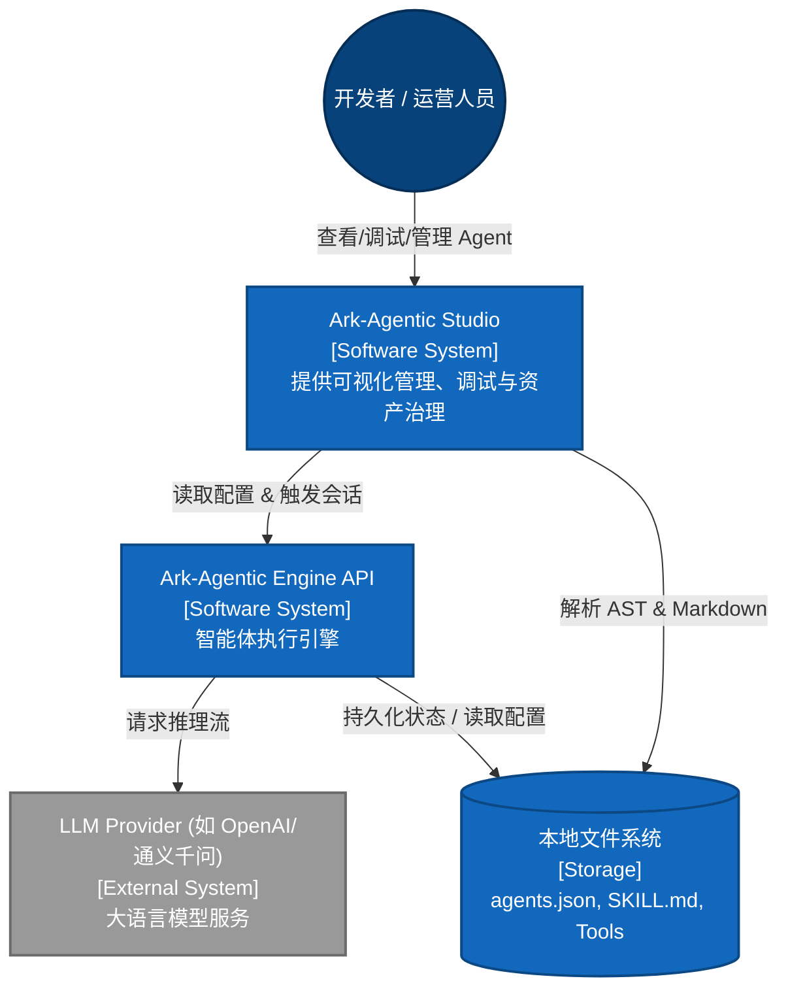
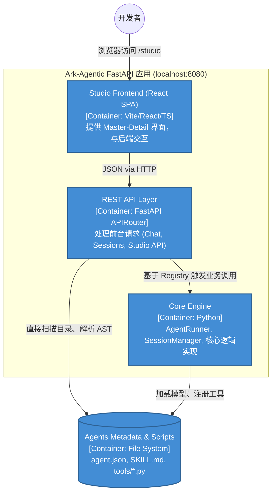
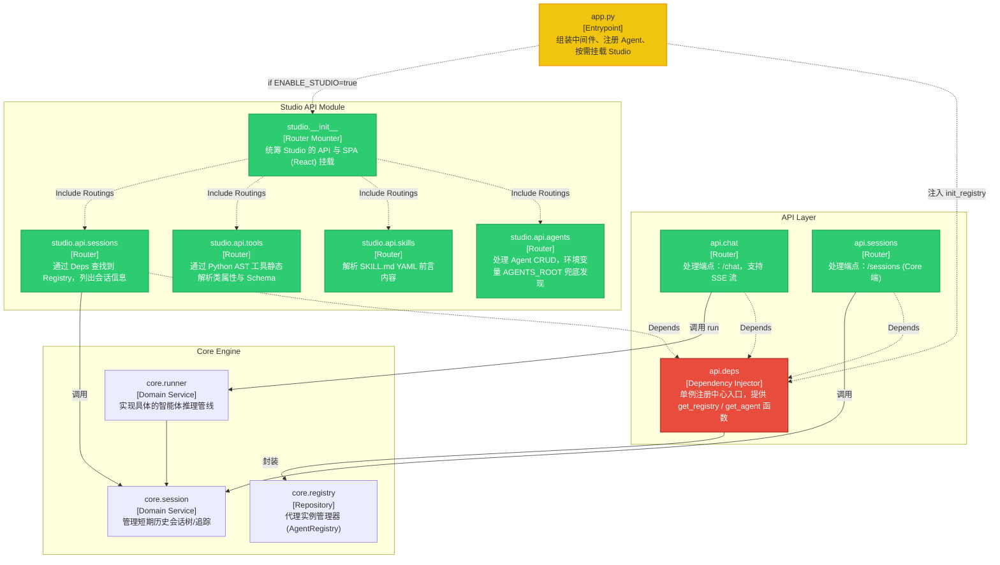
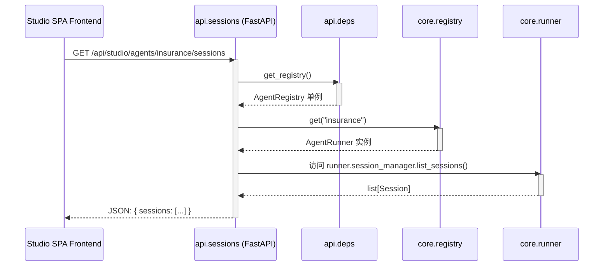
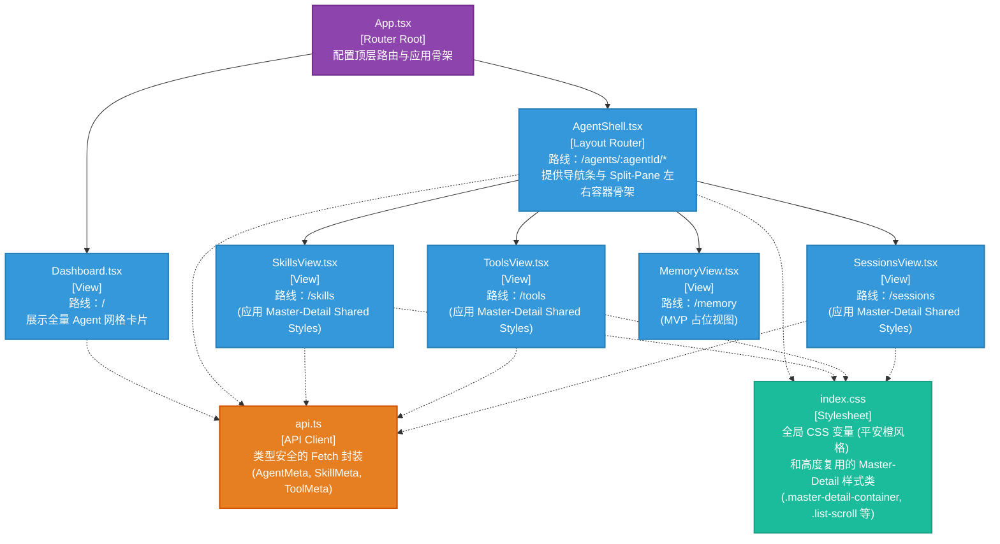

# Ark-Agentic Studio — 架构设计文档

> 本文档基于 **C4 Model** 和 **Mermaid 图表** 描述 `ark-agentic-studio` 的系统架构，涵盖上下文、容器化视图、组件依赖以及核心数据流向。
> 遵循 Pragmatic Design 哲学：清晰定义边界、显式注入依赖、分离关注点。

---

## 1. System Context Diagram (系统上下文视图)

描述 Ark-Agentic 框架是如何与开发者（用户）、目标应用（Agent 模型）进行相互作用的。

---

## 2. Container Diagram (容器视图)

展示前端应用、FastAPI 后端、核心业务逻辑以及存储层之间的关系。

---

## 3. Component Diagram: Backend Architecture (后端组件视图)

展示 FastAPI 应用内部的模块划分、SRP (单一职责) 边界以及依赖方向 (DIP 原则)。

### 【设计亮点】
- **依赖倒置 (DIP)**: `app.py` 作为顶层组装者，注入 `AgentRegistry` 到 `api.deps` 组件。各个业务路由 (如 `chat`, `sessions`, `studio.sessions`) 不再各自维护模块级全局状态，而是通过 `api.deps.get_agent` 取得运行时业务对象。
- **静态安全 (AST 解析)**: `studio.api.tools` 直接以 `ast` 抽象语法树解析 `tools/*.py` 代码提取 schema 格式，严格校验 `AgentTool` 继承类。无需将不可信工具代码导入 Python 内存中，提升了安全性和容错率。

---

## 4. Sequence Diagram: Data Flow Execution (会话数据流时序)

展示客户端是如何通过 API 触发一个 Agent 执行流并访问 Session 管理器的。

---

## 5. Component Diagram: Frontend Architecture (前端组件视图)

展示 Studio React 前端项目的目录映射、样式封装与路由设计。

### 【设计亮点】
- **纯粹且解耦 (KISS + DRY)**: React 层面没有采用过重的 `Redux`/`Zustand` 集中管理。以 `AgentShell` 为 Router Controller 控制当前上下文，子页面根据 `agentId` 各自采用独立的 `useEffect` 数据请求并完成自身页面的渲染。
- **Master-Detail 视图一致性**: `SkillsView`、`ToolsView`、`SessionsView` 及 `MemoryView` 使用高度统一的 DOM 结构，通过 `index.css` 抽取的公共样式类（如 `.list-header`, `.detail-body`）避免了 `inline-style` 泛滥代码。
