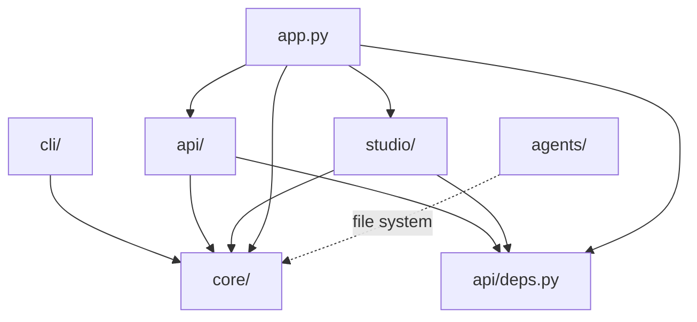
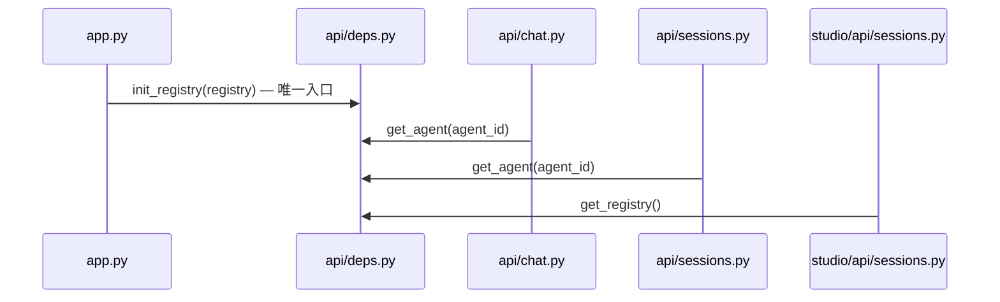

# Ark-Agentic Studio — 实施方案

> 本文档记录 Studio 模块的整体架构设计、分阶段实施计划及当前进展。
> 最后更新: 2026-03-01

## 设计约束

| 约束 | 决策 |
|---|---|
| 前端技术栈 | **React + Vite** (编译后静态资源由 FastAPI 托管) |
| 持久化 | **文件系统** (agent.json, SKILL.md, tool Python 文件, JSONL sessions) |
| Memory | **MVP 阶段占位，不实施**。留接口，后续迭代 |
| 部署模型 | **CLI 生成项目骨架，部署在用户机器上**，非 SaaS |
| Studio 启用 | 环境变量 `ENABLE_STUDIO=true` 控制 |
| Agents 目录 | 环境变量 `AGENTS_ROOT` 指定，或自动探测 `pyproject.toml` 定位 |

---

## 目标架构

```
src/ark_agentic/
├── core/                   # 核心引擎（不依赖 FastAPI，纯逻辑）
│   ├── runner.py
│   ├── session.py
│   ├── registry.py         # AgentRegistry (从 app.py 提取)
│   ├── types.py
│   ├── llm/
│   ├── skills/
│   ├── tools/
│   ├── memory/
│   └── stream/
│
├── api/                    # FastAPI 路由层 (从 app.py 拆分)
│   ├── __init__.py
│   ├── deps.py             # 共享依赖注入 (init_registry, get_agent)
│   ├── models.py           # Pydantic Request/Response Models
│   ├── chat.py             # /chat 路由 (APIRouter)
│   └── sessions.py         # /sessions 路由 (APIRouter)
│
├── studio/                 # Studio 模块 (条件挂载)
│   ├── __init__.py         # setup_studio(app) 入口 + SPA catch-all
│   ├── api/
│   │   ├── agents.py       # Agent CRUD 路由
│   │   ├── skills.py       # Skill 读取路由 (YAML frontmatter 解析)
│   │   ├── tools.py        # Tool 读取路由 (AST 安全解析)
│   │   ├── sessions.py     # Session 查看路由 (复用 core)
│   │   └── memory.py       # 占位 (501 Not Implemented)
│   └── frontend/           # Vite 项目根目录
│       ├── src/
│       │   ├── index.css   # 平安橙设计系统 + Master-Detail 共享样式
│       │   ├── api.ts      # 统一 API 客户端
│       │   └── pages/
│       │       ├── Dashboard.tsx
│       │       ├── AgentShell.tsx
│       │       ├── SkillsView.tsx
│       │       ├── ToolsView.tsx
│       │       ├── SessionsView.tsx
│       │       └── MemoryView.tsx
│       └── dist/           # build 产物 (被 FastAPI mount)
│
├── app.py                  # 瘦身后的 FastAPI 组装器 (~125 行)
└── agents/                 # 用户的 Agent 实例
    ├── insurance/
    │   ├── agent.json
    │   ├── skills/
    │   └── tools/
    └── securities/
        ├── agent.json
        ├── skills/
        └── tools/
```

### 依赖方向



> **规则**: `core/` 不依赖 `api/`, `studio/`, `cli/`。所有路由模块通过 `api/deps.py` 获取共享 `AgentRegistry`（单一入口注入）。`app.py` 是组装入口。

---

## 依赖注入架构



---

## 分阶段实施计划

### Phase 0: 架构整理 ✅ 已完成

**目标**: 拆分 `app.py`，清理模块边界。

| 操作 | 文件 | 说明 |
|---|---|---|
| **[NEW]** | `core/registry.py` | 从 app.py 提取 `AgentRegistry` |
| **[NEW]** | `api/deps.py` | 共享依赖注入 (`init_registry`, `get_agent`) |
| **[NEW]** | `api/models.py` | 7 个 Pydantic 模型 |
| **[NEW]** | `api/chat.py` | `/chat` 路由 (APIRouter) |
| **[NEW]** | `api/sessions.py` | `/sessions` 路由 (APIRouter) |
| **[MODIFY]** | `app.py` | 413 → ~125 行 |

### Phase 1: Studio 骨架 + Agent Dashboard ✅ 已完成

**目标**: 搭建 React + Vite 前端项目，实现 Agent Dashboard 页面。

| 操作 | 文件 | 说明 |
|---|---|---|
| **[NEW]** | `studio/__init__.py` | `setup_studio(app)` 入口 + SPA 路由 |
| **[NEW]** | `studio/api/agents.py` | Agent CRUD (文件系统扫描) |
| **[NEW]** | `insurance/agent.json` | 保险理赔助手元数据 |
| **[NEW]** | `securities/agent.json` | 证券助手元数据 |
| **[NEW]** | `studio/frontend/` | Vite + React + TypeScript 项目 |

### Phase 2: Core UI 页面 ✅ 已完成

**目标**: 实现完整的核心 UI 页面，连接真实后端 API。

**后端 API**:

| 文件 | 路由 | 实现方式 |
|---|---|---|
| `skills.py` | `GET /api/studio/agents/{id}/skills` | 扫描 `skills/` 目录, 解析 YAML frontmatter |
| `tools.py` | `GET /api/studio/agents/{id}/tools` | AST 静态解析, AgentTool 继承过滤 |
| `sessions.py` | `GET /api/studio/agents/{id}/sessions` | 复用 core `AgentRunner.session_manager` |
| `memory.py` | `GET /api/studio/agents/{id}/memory` | 501 Not Implemented 占位 |

**前端页面**: 统一 Master-Detail (Split-Pane) 布局，使用共享 CSS 类：

| 文件 | 说明 |
|---|---|
| `index.css` | 设计系统 + 7 个共享 Master-Detail 样式类 |
| `Dashboard.tsx` | Agent 卡片网格 |
| `AgentShell.tsx` | 上下文标签, Tab 导航 |
| `SkillsView.tsx` | 左侧技能列表 + 右侧 SKILL.md 内容查看 |
| `ToolsView.tsx` | 左侧工具列表 + 右侧 Parameters Schema |
| `SessionsView.tsx` | 左侧会话列表 + 右侧会话详情 |
| `MemoryView.tsx` | Master-Detail 布局占位 |

### Phase 2.5: 代码评审整改 ✅ 已完成

**目标**: 修复评审报告中的 P0/P1/P2 问题。

| 操作 | 文件 | 说明 |
|---|---|---|
| **[NEW]** | `api/deps.py` | 消除 4x `global _registry` 重复 |
| **[MODIFY]** | `api/chat.py` | 移除 `init()` / `_get_agent()`, 使用 `deps.get_agent()` |
| **[MODIFY]** | `api/sessions.py` | 同上 |
| **[MODIFY]** | `studio/api/agents.py` | 移除 `init()`, 修复 `_agents_root()` 路径发现 |
| **[MODIFY]** | `studio/api/sessions.py` | 使用 `deps.get_registry()` |
| **[MODIFY]** | `studio/__init__.py` | 简化为 `setup_studio(app)`, 去重 `FileResponse` 导入 |
| **[MODIFY]** | `app.py` | 单一入口: `api_deps.init_registry(_registry)` |
| **[MODIFY]** | `studio/api/tools.py` | `Field(default_factory=dict)` |
| **[MODIFY]** | `index.css` | 新增 7 个共享 CSS 类 |
| **[MODIFY]** | 全部 4 个 View 组件 | 内联 style → CSS 类 |

### Phase 3: CRUD + 前后端联调 📋 待实施

**目标**: 实现 Skill 的创建/编辑/删除，Tool 模板生成，前后端完全联调。

### Phase 4: Meta-Agent (远期) 🔮 规划中

**目标**: 实现 AI 原生的对话式操作体验。

---

## 关键技术决策

### 1. 共享依赖注入 (api/deps.py)

消除了 4 个模块中重复的 `global _registry` + `init()` 模式，采用单一模块 `deps.py` 统一管理：
- `app.py` 中 `lifespan` 内调用 `deps.init_registry(registry)` **一次**
- 所有路由模块通过 `deps.get_agent(agent_id)` 或 `deps.get_registry()` 获取依赖
- 错误处理统一：找不到 Agent 时返回 404

### 2. 弹性路径发现 (_agents_root)

替换了脆弱的 `Path(__file__).parents[N]` 硬编码，支持三级回退：
1. 环境变量 `AGENTS_ROOT`（CLI 部署场景优先）
2. 向上查找 `pyproject.toml` 定位项目根
3. 最终回退到相对路径

### 3. AST 安全解析 (tools.py)

选择 AST 而非 `importlib` 解析工具文件，确保零代码执行。增加了 `AgentTool` 继承检查。

### 4. SPA 路由 (studio/__init__.py)

`FileResponse` 统一导入到文件顶部，使用 catch-all 路由支持 React Router 深层链接。

---

## 风险与回退

| 风险 | 等级 | 缓解措施 |
|---|---|---|
| Phase 0 拆分 `app.py` 引入回归 | 中 | 拆分前后均跑 `pytest` 确保全绿 |
| 前端 build 产物体积过大 | 低 | Vite 默认 tree-shaking，当前 gzip 76KB |
| agent.json 并发写冲突 | 低 | 本地部署单用户场景，无并发风险 |
| Memory 占位影响用户预期 | 中 | UI 上显示 "Coming Soon" 标记 |
| CLI 缺少 Studio 脚手架 | 高 | Phase 3 优先补充 |
