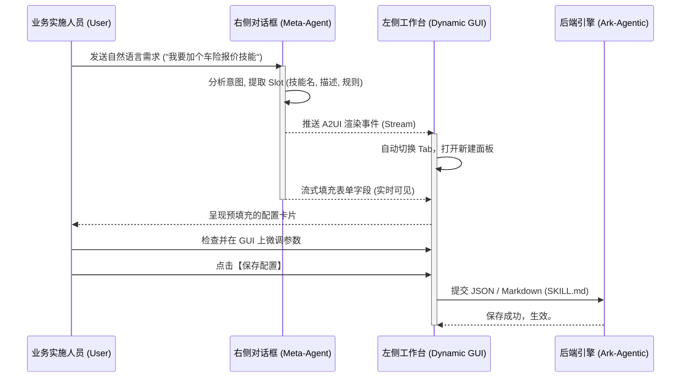
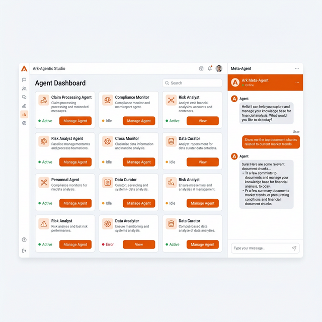
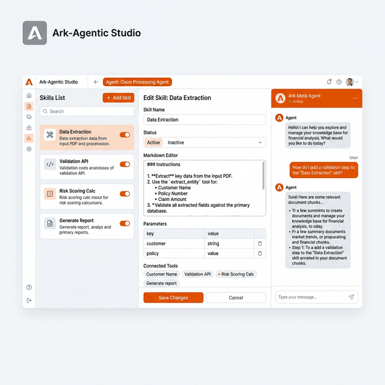
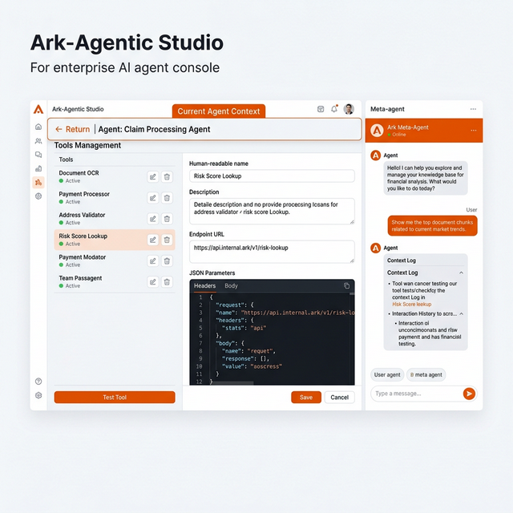
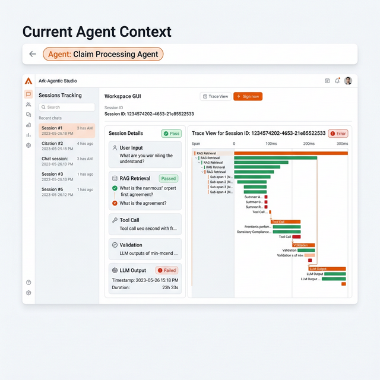
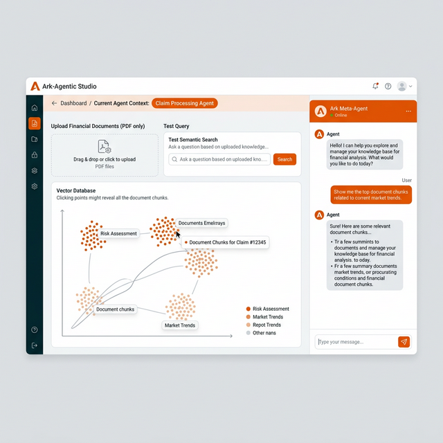

# Ark-Agentic UI 设计方案与用户指南 (金融版)

## 1. 设计理念 (Design Philosophy)
针对金融保险领域，UI 需要兼顾**「强合规/严谨性」**与**「AI 原生的高效感」**。
摒弃满屏表单的传统后端系统（如老旧的 CMS/CRM），采用 **LUI (Language UI) + GUI (Graphic UI)** 的融合模式，打造真正的**「Agent for Agent」**元控制台。

* **信任感**: 数据流动必须白盒化（Session 和 Memory 每一步追踪）。
* **沉浸感**: 左右分栏布局（Split-Pane），无需频繁跳转页面。
* **掌控感**: AI **提议 (Propose)** 配置，最终必须由人来 **确认 (Commit)**。

---

## 2. 视觉交互架构 (Wireframe & Layout)

整个系统分为三大核心区域：**全局导航**、**左侧动态工作区 (GUI)**、**右侧元智能体对话区 (LUI)**。


```mermaid
graph TD
    subgraph UI_Layout [Ark-Agentic Meta Console 屏幕布局]
        direction LR
        
        subgraph TopBar [顶部导航栏 8%]
            A1[项目切换: 保险智能体] --> A2[全局环境: Dev/Prod]
        end
        
        subgraph LeftPanel [左侧动态工作区 65%]
            direction TB
            B1[Tab: 🤖 Agents | 🛠️ Tools | 🧠 Skills | 💬 Sessions | 📚 Memory]
            B2[工作区卡片面板: <br>渲染由 Meta-Agent 实时生成的表单或代码]
            B3[操作栏: '放弃更改' | '保存并测试' | '一键部署']
            B1 --> B2
            B2 --> B3
        end
        
        subgraph RightPanel [右侧元智能体对话区 27%]
            C1[Meta-Agent 状态指示灯: 🟢 Ready / 🔵 Thinking]
            C2[对话历史流]
            C3[自然语言输入框]
            C1 --> C2
            C2 --> C3
        end
        
        RightPanel -. "驱动渲染" .-> LeftPanel
    end
```

### 交互时序 (Interaction Flow)
当用户想要创建一个新的**技能(Skill)**时，交互不再是“点击新建 -> 填表”，而是：

1. **用户 (右侧)**: "我们现在的理赔智能体缺一个根据车损照片估价的技能，帮我建一个。"
2. **Meta-Agent (右侧)**: "收到。我将为您创建一个名为 `vehicle_damage_assessment` 的技能，并关联相关的图片处理 Tool。"
3. **工作区 (左侧)**: 焦点自动切换到 `#Skills` 选项卡，界面平滑弹出一张卡片。
4. **实时渲染 (左侧)**: 卡片上的 `Name`, `Trigger Intent`, `Guidelines (Markdown)` 等字段，随着 AI 的思考像“打字机”一样**自动填充**。
5. **用户 (左侧)**: 审核左侧填好的逻辑，发现有一条规则太宽泛，手动修改该 Rule。
6. **用户 (左侧)**: 点击 `[保存并应用]`。



---

## 3. 核心功能模块设计

### 3.0 🤖 Agents (智能体大盘)

- **展示方式**: 左侧为网格卡片分布的主控面板。**去除了繁杂的 Categories 侧边栏，采用全宽网格布局**，每个卡片代表一个独立的 Agent（例如：车险理赔助手、投保指引助手）。
- **核心交互**:
  - 用户必须在 Agent 大盘中点击某个智能体的 **[View / 管理]** 按钮。
  - **点击后将下钻进入该智能体的独立工作台环境**（即进入 Skills、Tools、Sessions、Memory 等子页面）。
  - 在进入子页面后，界面的最上方会**常驻一个醒目的 "当前智能体上下文 (Current Agent Context)" 标签**（例如：`Agent: 理赔助手` 伴随返回大盘的按钮），确保用户时刻知道当前的配置属于哪个 Agent，实现配置与运行环境的硬隔离。

### 3.1 🧠 Skills (技能编排)

- **展示方式**: 左侧为网格卡片瀑布流，展示所有生效的 SKILL。
- **配置页内**: 
  - 上半部: 基础元数据 (Name, Load Mode - Full/Dynamic/Semantic)。
  - 下半部: 分屏展示 Markdown 规则。在这个区域，如果发现逻辑冲突，可以直接在右侧对 Meta-Agent 说：“我觉得第三条规则和之前那条矛盾了，帮我优化一下表达。” 左侧的 Markdown 随后自动刷新。

### 3.2 🛠️ Tools (工具集成)

- **展示方式**: 类似 Postman 的接口管理界面。
- **痛点解决**: 过去工具定义需要手写 Python `AgentTool` 及 `ToolParameter`。现在只需由 Meta-Agent 基于自然语言或直接贴入 Swagger JSON 生成配置。
- **内联测试**: 工具配置面板下方自带 **"Sandbox Mock"** 按钮，一键发送假数据模拟调用，展示 JSON/A2UI 返回结果。

### 3.3 💬 Sessions (会话与合规审计)
- **痛点**: 金融机构必须要求“模型每次给客户说了什么，依据是什么”完全可查。

- **展示方式**:
  - 左侧会话列表，支持按关键词、会话 ID 搜索。
  - **白盒链路图 (Trace View)**: 选中某条会话，主界面不仅出现聊天记录，还会像 APM 系统 (如 Jaeger) 一样，拉出一条链路：
    `User Input -> RAG 检索 (耗时, 引用的 chunks) -> Tool Call (入参, 出参) -> Validation 校验层拦截 -> LLM Output`
  - 如果被幻觉检测器 (Validation) 拦截，这里会高亮显示红色 **⚠️ Hallucination Blocked** 标记。

### 3.4 📚 Memory (知识与长程记忆)

- **展示方式**: 向量库可视面板。
- 可直接将企业的 PDF (如《XX保险条款2026版》) 拖拽到界面，Meta-Agent 会汇报分块和入库进度。
- 支持语义检索的“试搜 (Test Query)”，帮助运营人员判断知识是否命中准确。

---

## 4. UI 视觉规范设计方案 (UI Component Style)

* **主要配色体系（平安橙主题）**
  * **背景底色**: `#F7F9FC`（极具质感的冷灰白，不刺眼）。
  * **右侧 Meta-Agent 区底色**: `#FFFFFF` + 微弱边框阴影，独立悬浮。
  * **品牌主色**: `#EA5504`（中国平安品牌橙，代表活力、温暖与服务创新）。
  * **点缀色 / AI 活跃态**: `#10B981` (翠绿，代表通过验证/合规)、`#4A5568` (深灰色，用于文字和副背景，中和橙色的跳跃感以维持金融界面的严谨性)。

* **组件风格 (A2UI Design Language)**
  * **去线型化**: 减少表格的边框线，用大圆角卡片（`border-radius: 12px`）和灰色背景色块区分信息的层级。
  * **玻璃拟物感 (Glassmorphism)**: 当左侧弹窗或发生覆盖修改时，使用 `backdrop-filter: blur(10px)` 处理，强化空间感。
  * **Typography**: 数字必须等宽字体 (e.g., `JetBrains Mono`) 以防金融数据错位，文本采用 `Inter`。

---

## 5. 快速用户指南 (User Guide)

**欢迎使用 Ark-Agentic Meta Console**。您只需动嘴，我们负责动手。

### 场景 1：创建一个处理退保的智能体技能
1. **唤醒 AI**: 在右侧对话框输入：*“帮我上架一个退保评估技能，需要先查实客户是否有未结清贷款，然后再进行核算。”*
2. **审查配置**: 左侧 `Skills` 选项卡将自动打开【退保评估】的技能草稿。请核对 AI 填写的“触发词”与“业务规则 (Guidelines)”。
3. **绑定工具**: 右侧 AI 会提示：*“发现该技能需要查询系统，但我找不到对应的工具。是否帮您生成一个？”* 回复 *“是”*。
4. **测试并上线**: UI 将切换至 Tool 面板。在填完接口地址后，点击大蓝按钮 **[保存并激活]** 即可生效。

### 场景 2：审计一起客户投诉
1. **前往 Sessions**: 客户投诉下午 2 点的对话回答不准。点击左侧 `#Sessions`。
2. **过滤查找**: 在搜索框输入客户 User ID，找到该时段会话。
3. **查看链路**: 点击展开会话背后的 **[执行链路 Trace]**，发现知识库检索匹配到了旧版条文，导致回答错误。
4. **一键修复**: 您可以直接在右侧对话框输入：*“这句回答引用的知识库段落过期了，帮我把那条 Memory 删掉，并传授给它正确的规则。”* 

这就是 **AI-Native** 操作系统的未来形态：它不是一套死板的 ERP 系统，而是一位可以管理底层 Agent 的“超级数字员工”。
