# Architecture — C4 Diagrams

Renders on GitHub (Mermaid is built in). Audit focus: **layers, interfaces, cache design**.

The diagrams reflect the storage refactor branch state — every claim here is grep-verifiable in `src/`.

---

## C1 · System Context

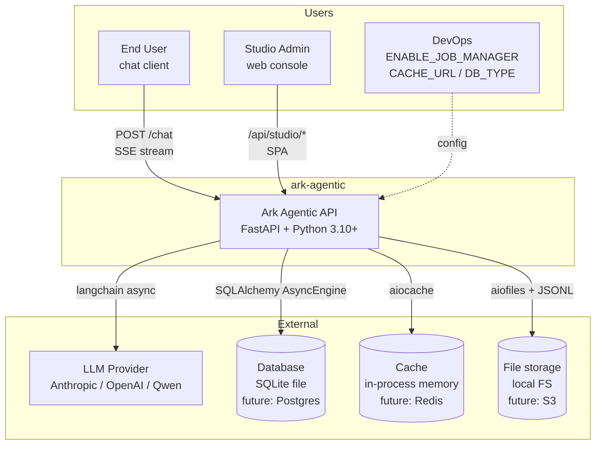

**审核要点**

- 4 个外部依赖都通过 Protocol，可独立替换。
- Cache 在 C1 已经是显式的外部 dependency，跟 DB / FS 同级 = 一等基础设施。

---

## C2 · Containers

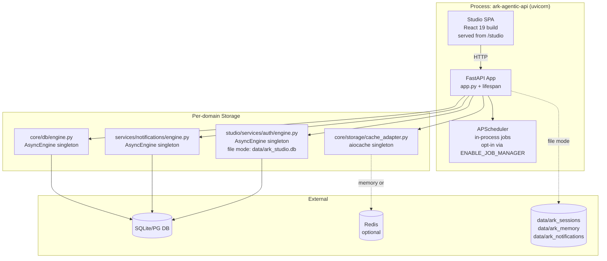

**审核要点**

- 三个 engine 模块同结构 (`get_engine` / `init_schema` / `set_for_testing`)。
- `AsyncEngine` 永远不出 engine.py。
- Cache 是单独 module，跟 engine 平级。

---

## C3 · Storage 子系统分层（审核重点）

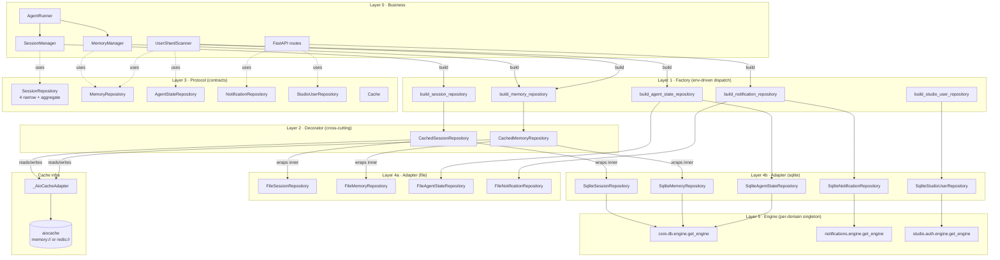

**每层职责**

| Layer | 责任 | 业务可见？ | 数量 |
|---|---|---|---|
| 0 Business | runner / 各 manager / routes | — | ~5 |
| 1 Factory | 选 backend + 装 decorator | ✅ | 5 个 build_* |
| 2 Decorator | 缓存（横切） | ❌ 透明 | 2 |
| 3 Protocol | 契约 | ✅ | 6 |
| 4a/4b Adapter | 真实 I/O | ❌ | 4 + 5 |
| 5 Engine | 持有 AsyncEngine | ❌ | 3 |
| Cache infra | aiocache 包装 | ❌ | 1 adapter |

**审核要点**

- 严格"上层只依赖下层"。
- Decorator 是 Layer 2，Cache infra 是 Layer 0 的横向依赖 = 关注点分离。
- 业务代码只接触 Layer 1 (factory) + Layer 3 (Protocol)，**其他层全都看不见**。

---

## C3 · Independent Features 边界

```mermaid
graph LR
    subgraph "Core (agent runtime)"
        CoreSt[core/storage/<br/>3 protocols + adapters]
        CoreDb[core/db/<br/>Base + engine + 4 ORM tables]
    end

    subgraph "Feature: notifications"
        NP[protocol.py]
        NF[factory.py]
        NE[engine.py]
        NS[storage/<br/>file + sqlite + models]
        NSetup[setup.py<br/>NotificationsContext +<br/>route mount]
        ND[delivery.py<br/>SSE pub/sub]
    end

    subgraph "Feature: studio.auth"
        SP[protocol.py]
        SF[factory.py]
        SE[engine.py]
        SS[storage/<br/>sqlite + models]
        ST[tokens.py]
        SPr[principal.py +<br/>FastAPI deps]
        SR[repo_singleton.py]
    end

    subgraph "Feature: jobs"
        JM[manager.py +<br/>scanner.py]
        JB[bindings.py<br/>warmup hooks]
    end

    subgraph "App assembly"
        AppPy[app.py + lifespan]
        Ctx[api/context.py<br/>AppContext]
    end

    AppPy --> CoreSt
    AppPy --> CoreDb
    AppPy --> NSetup
    AppPy --> SR
    AppPy --> JM
    NS -.shares Base.metadata.-> CoreDb
    SS -.shares Base.metadata.-> CoreDb
    NE -.shares engine.-> CoreDb
    SE -.shares engine sqlite-mode.-> CoreDb
```

**审核要点**

- 每个 feature 自带 protocol + adapter + factory + engine + setup ——  core 不知道它们存在，**只在 `app.py` 装配**。
- ORM 表通过 import 副作用注册到 shared `Base.metadata`（SQLAlchemy 单 metadata 的硬性要求）。
- `app.py` 是唯一感知所有 feature 的位置。

---

## C3 · App lifespan (linear assembly)

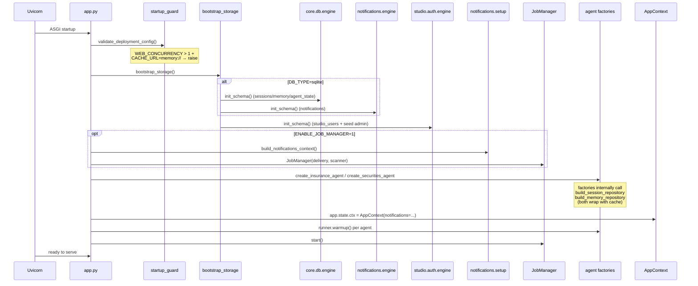

**审核要点**

- lifespan 严格线性：validate → bootstrap → setup features → register agents → publish ctx → warmup → start jobs。
- Engine 永远不被传递，每个 feature 自己问自己的 `engine.get_engine()`。
- `AppContext` 是唯一 publish 出去的运行时状态。

---

## C4 · Cache 类层次（审核重点）

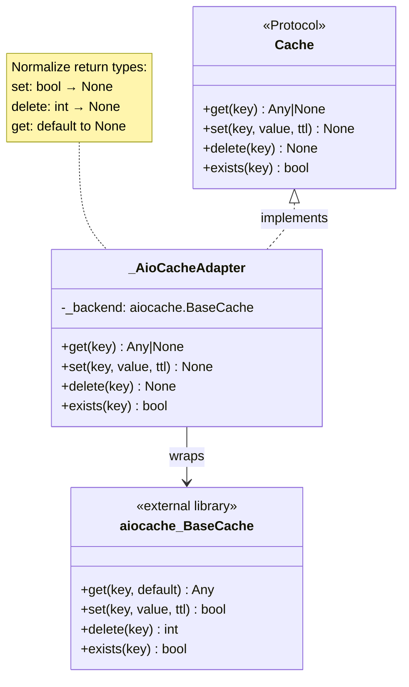

**审核要点**

- `Cache` Protocol 4 个方法 = 业务唯一可见的接口；签名跟 aiocache 对齐 (`ttl` not `ttl_seconds`)。
- `_AioCacheAdapter` 下划线开头 = module-private，外部禁止 import。
- aiocache 本身**不被业务代码 import**，整个项目只在 `cache_adapter.py` 一个文件出现（grep 验证）。

---

## C4 · Cache singleton + 测试注入

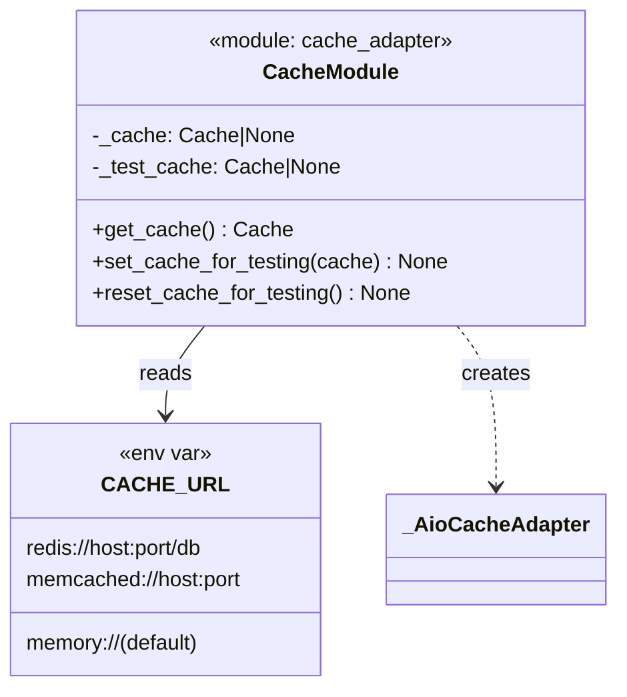

**审核要点**

- `_test_cache` 优先级高于 `_cache` —— 测试随时 swap，不影响生产代码路径。
- `reset_cache_for_testing()` 在 `tests/conftest.py` autouse fixture 调用，跨测试隔离。

---

## C4 · Decorator 模式

### Session

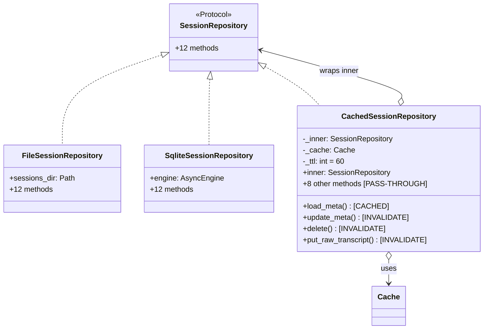

### Memory

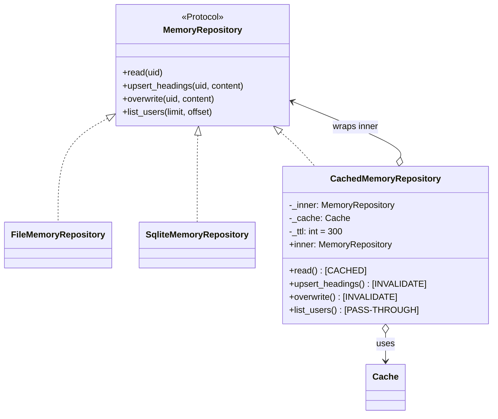

**审核要点**

- Decorator 实现 Protocol —— 跟 Adapter 一样满足 `runtime_checkable`，对消费者完全透明。
- `inner` property 公开 —— 测试 / 工厂内省允许；生产业务代码不应该用。
- 三种方法明确分类：CACHED / INVALIDATE / PASS-THROUGH，docstring 写明哪些没缓存以及为什么。

---

## C4 · Cache 时序

### Read miss → populate

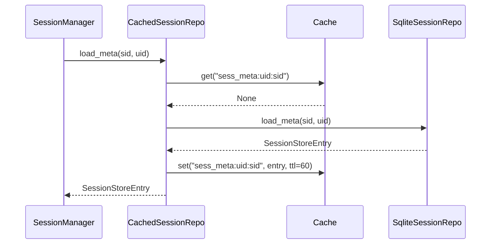

### Read hit (no DB)

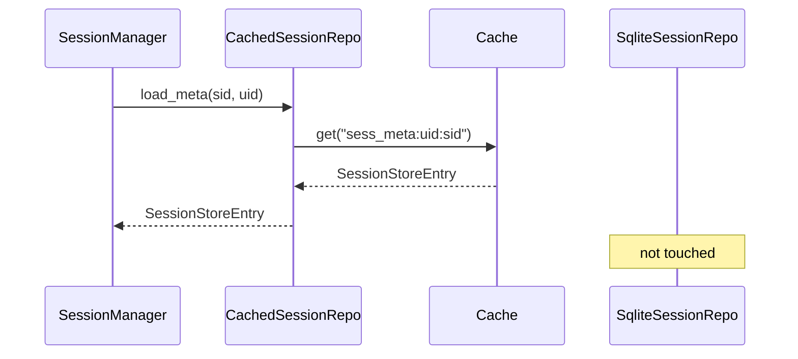

### Write → invalidate

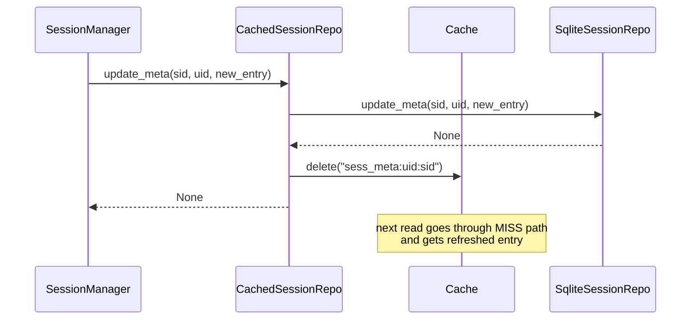

---

## C4 · Cache 契约表

| Repository.method | cached? | TTL | key pattern | invalidated by |
|---|---|---|---|---|
| `SessionRepo.load_meta` | ✅ | 60s | `sess_meta:{uid}:{sid}` | `update_meta`, `delete`, `put_raw_transcript` |
| `SessionRepo.load_messages` | ❌ | — | — | (大、`append_message` 频繁变) |
| `SessionRepo.list_session_ids` | ❌ | — | — | (paged，跨 limit/offset 失效复杂) |
| `SessionRepo.list_session_metas` | ❌ | — | — | 同上 |
| `SessionRepo.list_all_sessions` | ❌ | — | — | (admin 极冷) |
| `SessionRepo.get_raw_transcript` | ❌ | — | — | (admin 极冷) |
| `MemoryRepo.read` | ✅ | 300s | `mem:{uid}` | `upsert_headings`, `overwrite` |
| `MemoryRepo.list_users` | ❌ | — | — | (proactive scan 一天一次) |

---

## C4 · Cache 装配流程

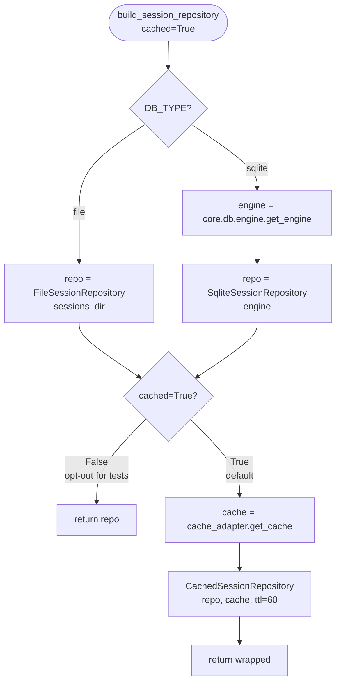

**审核要点**

- 装配路径始终一致：env → backend → optional cache → return Protocol。
- `cached=False` opt-out 用于：(1) 装饰器自身的单元测试需要 inner repo；(2) 历史 `isinstance(_, FileSessionRepository)` 断言。

---

## 业务代码可见 / 不可见 清单

```mermaid
graph LR
    subgraph "✅ Business code may import"
        I1[Cache Protocol]
        I2[SessionRepository Protocol]
        I3[MemoryRepository Protocol]
        I4[AgentStateRepository Protocol]
        I5[NotificationRepository Protocol]
        I6[StudioUserRepository Protocol]
        F1[get_cache]
        F2[build_session_repository]
        F3[build_memory_repository]
        F4[build_agent_state_repository]
        F5[build_notification_repository]
        F6[build_studio_user_repository]
        M1[SessionManager]
        M2[MemoryManager]
        M3[AgentRunner.add_warmup_hook]
    end

    subgraph "❌ Business code MUST NOT import"
        X1[AsyncEngine]
        X2[aiocache.* directly]
        X3[FileXxxRepository]
        X4[SqliteXxxRepository]
        X5[NotificationRow / StudioUserRow ORM]
        X6[CachedSessionRepository / CachedMemoryRepository]
        X7[app.state.X 直接读]
    end
```

**Static enforcement (grep gates, all 0 hits today)**

```bash
grep -rn "AsyncEngine"           src/ark_agentic | excl engine.py + sqlite adapter + scripts → ∅
grep -rn "from aiocache"         src/ark_agentic                                              → only cache_adapter.py
grep -rn "_warmup_tasks"         src/ark_agentic                                              → ∅
grep -rn "core.storage.*notif"   src/ark_agentic                                              → ∅
grep -rn "core.storage.*studio"  src/ark_agentic                                              → ∅
grep -rn "session_manager.repository" src/ark_agentic                                         → ∅
grep -rn "getattr.*app.state"    src/ark_agentic | excl context.py typed accessor              → ∅
```

---

## Cache 设计 5 个值得 challenge 的决定

| # | 决定 | 当前 | 替代 | 理由 |
|---|---|---|---|---|
| 1 | Decorator vs 内嵌 if-else | Decorator | repo 内 if-else | SRP；缓存可单独测/禁；narrow Protocol 配合得很好 |
| 2 | 保留 Cache Protocol | 4 方法 Protocol + adapter | 直接用 `aiocache.BaseCache` | decoupling 边界；签名里没有 aiocache 类型 |
| 3 | list_* 不缓存 | 不缓存 | 缓存 + per-user version-counter | (limit, offset) 组合爆炸；list 不算热路径 |
| 4 | Cache singleton | process-wide | per-request | aiocache 自身已连接复用；Redis 多 worker 天然分布式 |
| 5 | 空字符串缓存 (`mem:{uid}`) | 缓存 | 跳过 | 冷用户的 "no memory" 状态本身值得记住 |

---

## 还想优化的点（待拍板）

1. **TTL 硬编码 60 / 300** —— 改 env (`CACHE_SESSION_META_TTL`, `CACHE_MEMORY_TTL`)？
2. **Studio user_grants 也接 cache**？`get_user(uid)` 每个 studio 请求都打 DB。
3. **`load_messages` 加 LRU cache**？SessionManager 冷启动重建会话时全量读。
4. **Redis 上线前换 `JsonSerializer`** —— 现在 Pickle 跨版本升级会炸。
