# Architecture — C4 Diagrams

Renders on GitHub (Mermaid is built in). Audit focus: **layers, interfaces, per-feature isolation**.

The diagrams reflect the storage refactor branch state — every claim here is grep-verifiable in `src/`.

---

## What's NOT in this version (vs earlier draft)

- **No process cache layer.** The aiocache-backed `Cache` Protocol, decorators (`CachedSessionRepository`, `CachedMemoryRepository`), `cache_adapter`, and `validate_deployment_config` were removed. In single-worker mode, `SessionManager._sessions` already serves as the active-session mirror (~100% hit rate), and `MemoryManager` now carries the same `_memory: dict[str, str]` mirror for active users. Cross-process / Redis caching is deferred to the **PG/Redis/S3 milestone**, where serializer choice + invalidation + deployment story are designed together.
- **No shared `Base.metadata`.** Each feature owns its own `DeclarativeBase`; `init_schema()` per domain creates only that domain's tables.

---

## C1 · System Context

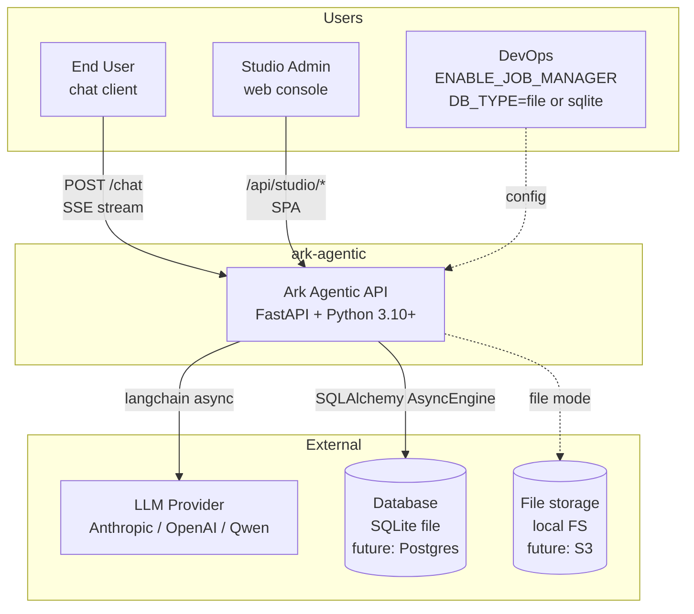

**审核要点**

- 3 个外部依赖都通过 Protocol，可独立替换。
- Cache 不在 C1 —— 现阶段是进程内 dict（`SessionManager._sessions`、`MemoryManager._memory`），不是外部基础设施。下个里程碑再加 Redis 时回到 C1。

---

## C2 · Containers

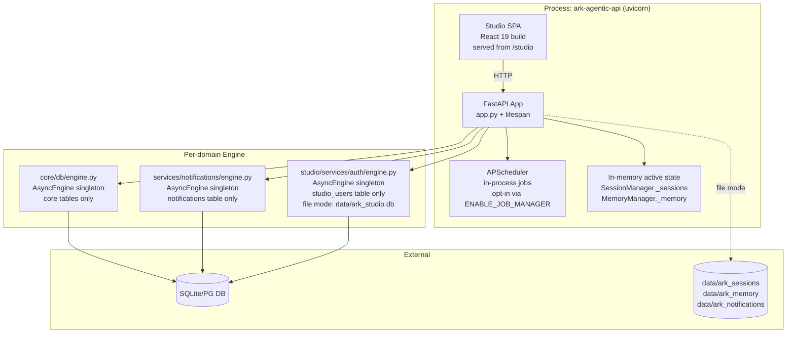

**审核要点**

- 三个 engine 模块同结构 (`get_engine` / `init_schema` / `set_engine_for_testing`)，每个只 own 自己 feature 的 `DeclarativeBase`。
- `AsyncEngine` 永远不出 engine.py。
- 进程内活跃状态：`SessionManager._sessions` + `MemoryManager._memory` —— 单 worker 下命中率近 100%，重启清空。

---

## C3 · Storage 子系统分层（核心审核重点）

```mermaid
graph TB
    subgraph L0["Layer 0 · Business"]
        Runner[AgentRunner]
        SessionMgr[SessionManager<br/>_sessions: dict in-memory]
        MemoryMgr[MemoryManager<br/>_memory: dict in-memory]
        Scanner[UserShardScanner]
        Routes[FastAPI routes]
    end

    subgraph L1["Layer 1 · Factory (env-driven dispatch)"]
        F1[build_session_repository]
        F2[build_memory_repository]
        F3[build_agent_state_repository]
        F4[build_notification_repository]
        F5[build_studio_user_repository]
    end

    subgraph L2["Layer 2 · Protocol (contracts)"]
        P1[SessionRepository<br/>4 narrow + aggregate]
        P2[MemoryRepository]
        P3[AgentStateRepository]
        P4[NotificationRepository]
        P5[StudioUserRepository]
    end

    subgraph L3a["Layer 3a · Adapter (file)"]
        A1[FileSessionRepository]
        A2[FileMemoryRepository]
        A3[FileAgentStateRepository]
        A4[FileNotificationRepository]
    end

    subgraph L3b["Layer 3b · Adapter (sqlite)"]
        B1[SqliteSessionRepository]
        B2[SqliteMemoryRepository]
        B3[SqliteAgentStateRepository]
        B4[SqliteNotificationRepository]
        B5[SqliteStudioUserRepository]
    end

    subgraph L4["Layer 4 · Engine (per-domain singleton)"]
        E1[core.db.engine.get_engine<br/>+ init_schema for Base]
        E2[notifications.engine.get_engine<br/>+ init_schema for NotificationsBase]
        E3[studio.auth.engine.get_engine<br/>+ init_schema for AuthBase]
    end

    Runner --> SessionMgr
    Runner --> MemoryMgr
    SessionMgr -.uses.-> P1
    MemoryMgr -.uses.-> P2
    Scanner -.uses.-> P2
    Scanner -.uses.-> P3
    Routes -.uses.-> P4
    Routes -.uses.-> P5

    SessionMgr -->|build| F1
    MemoryMgr -->|build| F2
    Scanner -->|build| F2
    Scanner -->|build| F3
    Routes -->|build| F4

    F1 --> A1
    F1 --> B1
    F2 --> A2
    F2 --> B2
    F3 --> A3
    F3 --> B3
    F4 --> A4
    F4 --> B4
    F5 --> B5

    B1 --> E1
    B2 --> E1
    B3 --> E1
    B4 --> E2
    B5 --> E3
```

**每层职责**

| Layer | 责任 | 业务可见？ | 数量 |
|---|---|---|---|
| 0 Business | runner / 各 manager (含内存镜像) / routes | — | ~5 |
| 1 Factory | env-driven 选 backend | ✅ | 5 个 build_* |
| 2 Protocol | 契约 | ✅ | 5 |
| 3a/3b Adapter | 真实 I/O | ❌ | 4 + 5 |
| 4 Engine | 持有 AsyncEngine + 自己 feature 的 init_schema | ❌ | 3 |

**审核要点**

- 严格"上层只依赖下层"，无跨层跳读。
- 业务代码只接触 Layer 1 (factory) + Layer 2 (Protocol)。
- 比之前少了一层（之前的 Layer 2 Decorator 整层删除）。

---

## C3 · Independent Features 边界

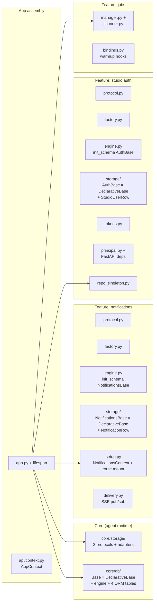

**审核要点（重点变化）**

- 之前画的 `NS -.shares Base.metadata.-> CoreDb` 已经消失 —— **每个 feature 自己的 `DeclarativeBase`**。
- 删除 notifications / studio 整个目录，core 不会留 dangling table。
- core 和 feature 之间唯一耦合点：**`engine.py` 共享同一个 `AsyncEngine` 实例**（连接复用）；元数据/schema 完全独立。

---

## C3 · Per-domain DeclarativeBase 详细图

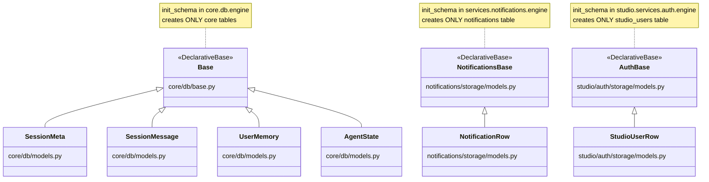

**审核要点**

- 3 个 `DeclarativeBase` × 3 个独立 metadata × 3 个独立 `init_schema()` —— 真解耦
- Grep 验证：0 个跨 feature 的 `core.db.base` import (`grep -rn "from .*core.db.base" src/ark_agentic | grep -v core/db/` → ∅)

---

## C3 · App lifespan (linear assembly)

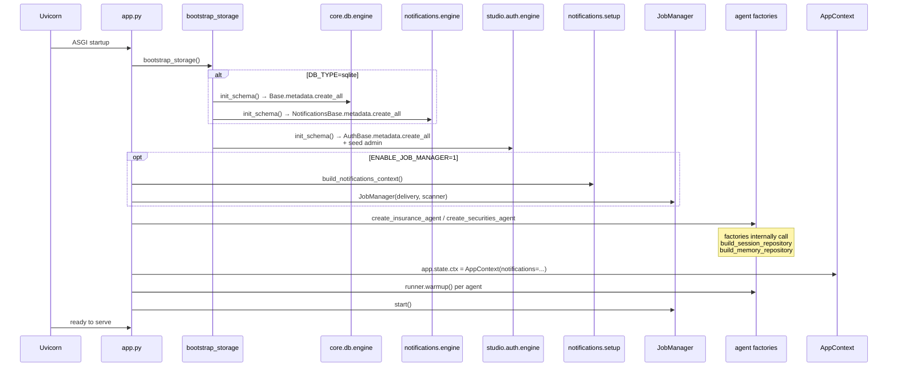

**审核要点**

- lifespan 严格线性：bootstrap (3 个独立 init_schema) → setup features → register agents → publish ctx → warmup → start jobs
- 不再有 `validate_deployment_config()`（cache 删了，没什么可校验的）
- `bootstrap_storage()` 真的调三次 `init_schema()`，每次只建自己的表

---

## C4 · 活跃状态内存镜像（替代 cache）

`SessionManager` 一直就有 `_sessions: dict[str, SessionEntry]`。`MemoryManager` 现在也加了相同模式的 `_memory: dict[str, str]`。

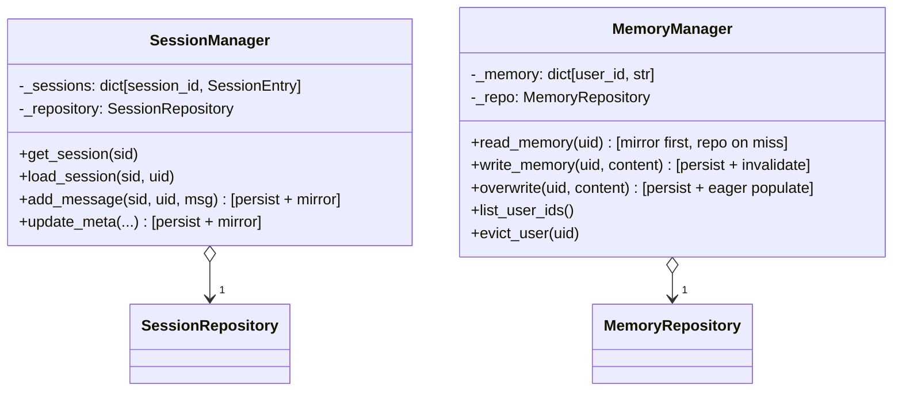

**对称设计**

| 行为 | SessionManager._sessions | MemoryManager._memory |
|---|---|---|
| 持有什么 | 活跃 SessionEntry | 活跃用户的 memory 字符串 |
| 何时填充 | 创建 / 加载会话 | `read_memory` 首次 miss |
| 何时清空 | `delete_session` | `write_memory` 后 invalidate |
| 持久化路径 | append_message / update_meta 直接写 repo | upsert_headings / overwrite 直接写 repo |
| TTL | 无（进程生命周期） | 无（进程生命周期） |
| 重启后 | 清空，下次访问从 repo 重建 | 同 |

**为什么不用 aiocache** —— 单 worker 下，业务对象在 Python 内存里命中率近 100%。引入 aiocache 等于多一层 hash + 序列化，毫无收益。多 worker / Redis 共享缓存留给 PG/Redis 里程碑。

---

## C4 · Cache hit / persist 时序

### Memory: 命中

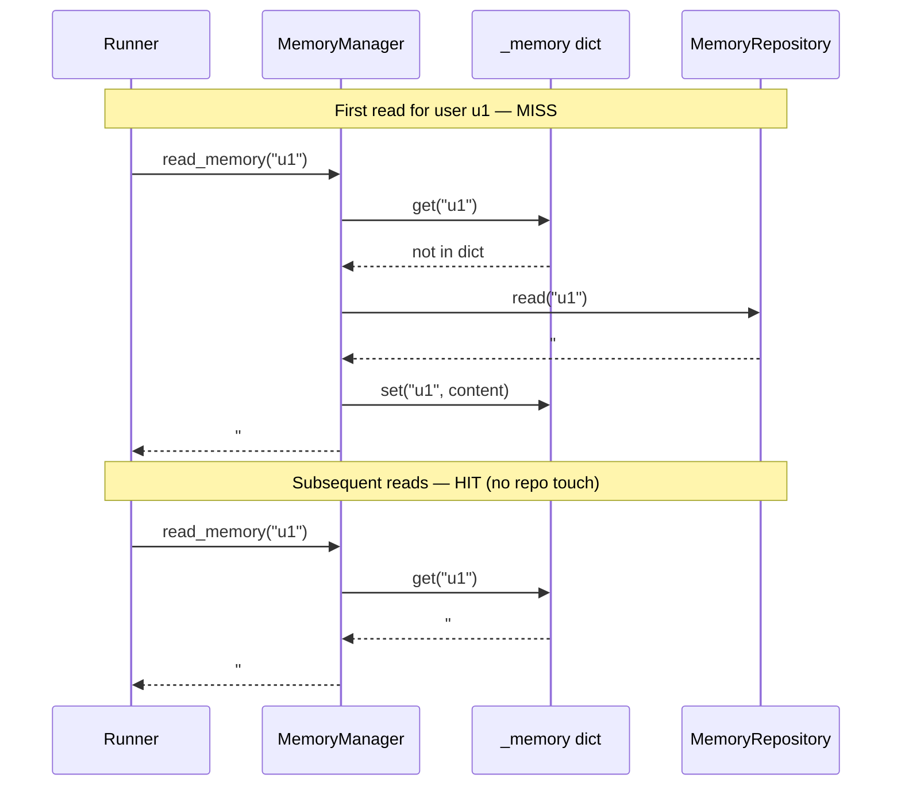

### Memory: 写入 → invalidate

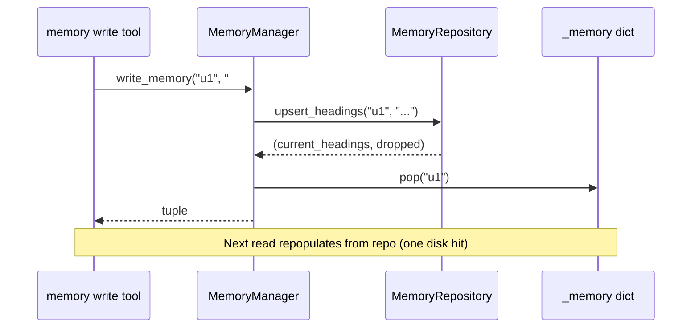

### Memory: overwrite → eager populate

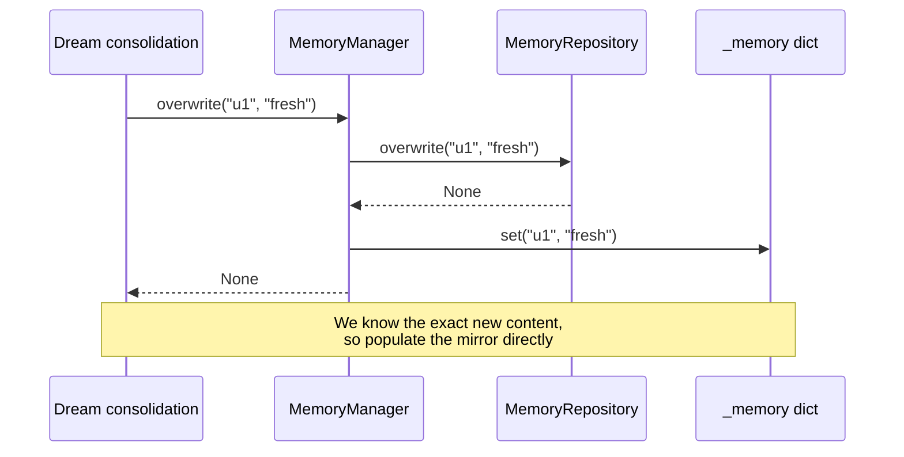

---

## C4 · 装配流程

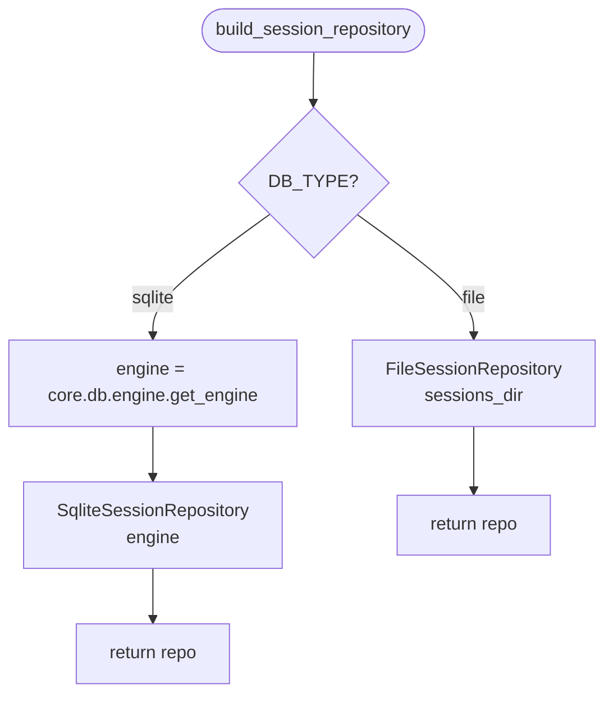

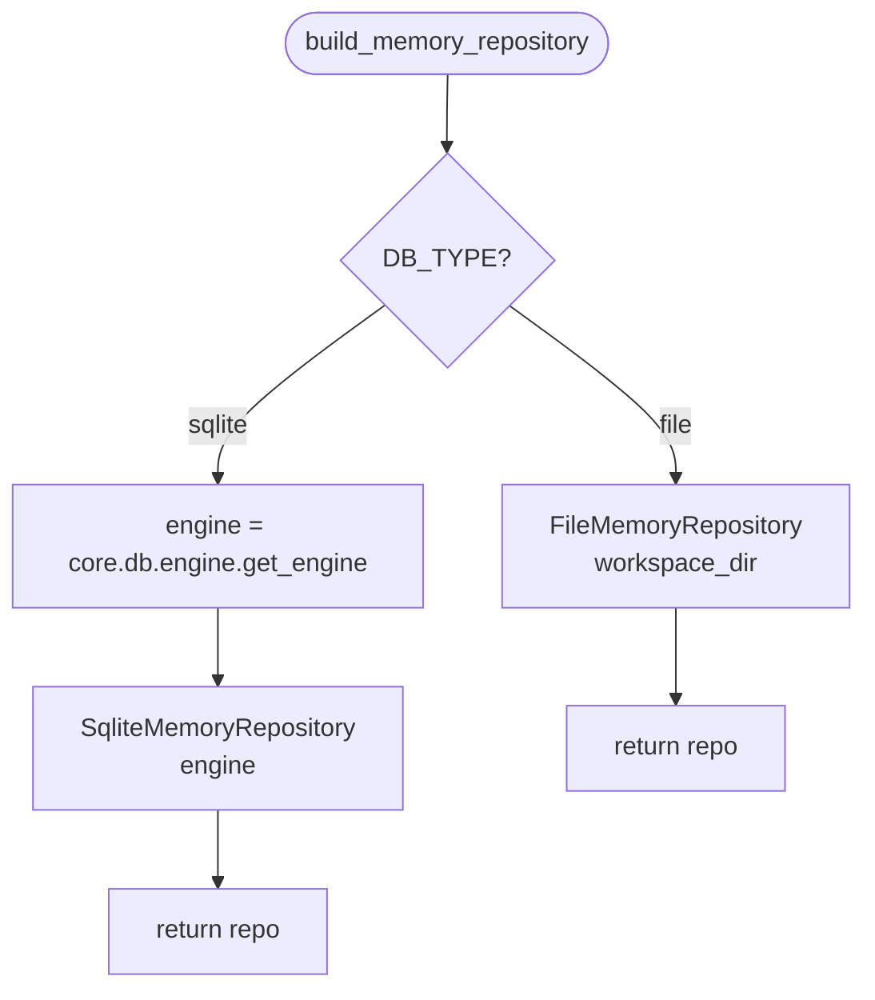

**审核要点**

- 装配路径是 env → backend → return，没有 `cached=` 参数，没有装饰器层。
- MemoryManager 自己负责活跃用户镜像；repo 永远是直通的 file / sqlite 实例。

---

## 业务代码可见 / 不可见 清单

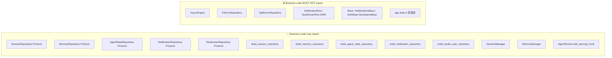

**Static enforcement (grep gates, all 0 hits today)**

```bash
grep -rn "AsyncEngine"             src/ark_agentic | excl engine.py + sqlite adapter + scripts → ∅
grep -rn "_warmup_tasks"           src/ark_agentic                                              → ∅
grep -rn "core.storage.*notif"     src/ark_agentic                                              → ∅
grep -rn "core.storage.*studio"    src/ark_agentic                                              → ∅
grep -rn "from .*core.db.base"     src/ark_agentic | excl core/db/                              → ∅
grep -rn "session_manager.repository" src/ark_agentic                                           → ∅
grep -rn "getattr.*app.state"      src/ark_agentic | excl context.py typed accessor              → ∅
grep -rn "from aiocache"           src/ark_agentic                                              → ∅ (deleted)
grep -rn "CachedSessionRepository\|CachedMemoryRepository" src/ark_agentic                       → ∅ (deleted)
```

---

## 推迟到 PG/Redis/S3 里程碑的事

| 项 | 现状 | 那时再做 |
|---|---|---|
| 跨进程 cache | 进程内 dict mirror | aiocache + Redis adapter，重新引入 cache_adapter / decorator 层 |
| Cache 序列化 | n/a | `JsonSerializer` for Redis（pickle 跨版本风险） |
| 多 worker 部署 | 单 worker 默认 | `WEB_CONCURRENCY>1` 校验 + 强制 Redis cache |
| Postgres backend | repo/sqlite 已经是正确抽象，加 repo/postgres 即可 | Alembic 取代 `init_schema(create_all)` |
| S3 archival | `SessionRepository.finalize` 钩子已留 | 实现 S3 后端 |

---

## Cache 设计的"反思"

之前我引入了 aiocache + 装饰器层，结果发现：

1. 单 worker 下 `SessionManager._sessions` 命中率近 100% → `CachedSessionRepository` 几乎是 dead code
2. `CachedMemoryRepository` 有真实价值，但 `MemoryManager._memory` 内存镜像更直接、更省 (无序列化 / 无 hash / 无 lock)
3. Studio 的 QPS 不足以让缓存值得，它的请求慢点没关系

**结论**：在我们真正需要跨进程共享之前，Python dict 就够了。把 cache 推迟到下个里程碑跟 Redis 一起设计，是少做、做对。
