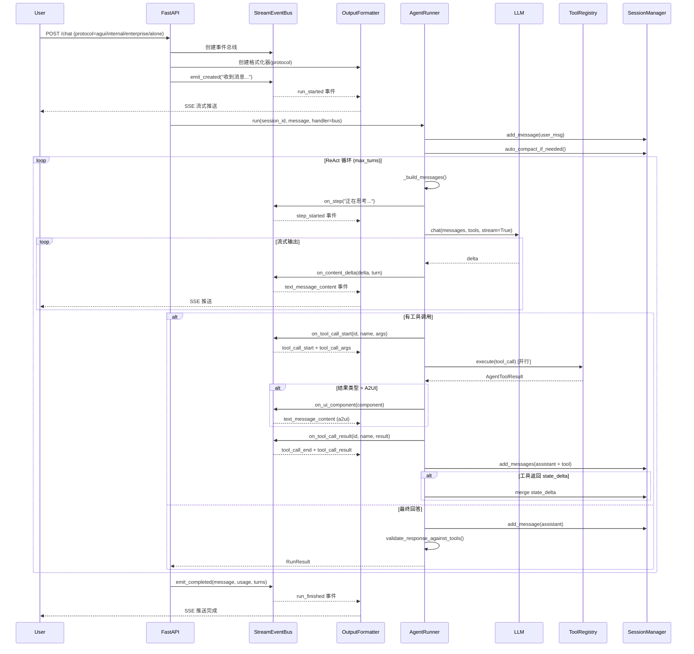
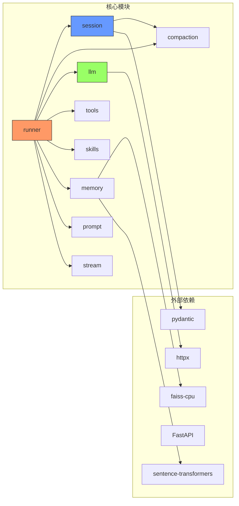

# ark-agentic 架构文档

> 生成日期: 2026-02-26 | 版本: 0.3.0 | 状态: 已更新（完整 AG-UI 协议 + A2UI 组件 + Session State）

## 1. 项目概览

**ark-agentic** 是一个轻量级 Python ReAct Agent 框架，面向金融保险行业，提供工具调用、技能系统、会话管理、AG-UI 流式协议和向量记忆能力。

```
技术栈: Python 3.10+ / FastAPI / httpx / FAISS / Sentence-Transformers / LangChain
包管理: uv (PEP 723)
代码规模: ~24K 行（53 个 Python 文件）
流式协议: AG-UI 标准（17 种事件类型 + 4 种输出格式）
```

---

## 2. 系统架构

### 2.1 整体分层

```mermaid
graph TD
    subgraph API["API 层"]
        APP["app.py (FastAPI)"]
        SSE["SSE 流"]
        REGISTRY["AgentRegistry"]
    end

    subgraph Core["核心引擎 (core/)"]
        RUNNER["AgentRunner<br/>ReAct 主循环 (877行)"]
        SESSION["SessionManager<br/>会话管理 (452行)"]
        COMPACT["Compaction<br/>上下文压缩 (714行)"]
        PERSIST["Persistence<br/>JSONL 持久化 (711行)"]
        VALID["Validation<br/>输出验证 (169行)"]
    end

    subgraph LLM["LLM 层 (core/llm/)"]
        FACTORY["create_chat_model()"]
        FROM_ENV["create_chat_model_from_env()"]
        ERRORS["LLM 错误分类"]
    end

    subgraph Tools["工具系统 (core/tools/)"]
        TOOL_REG["ToolRegistry"]
        TOOL_BASE["AgentTool (ABC) (282行)"]
        MEM_TOOL["MemorySearchTool (377行)"]
        SKILL_TOOL["ReadSkillTool"]
        PA_KN["PAKnowledgeAPITool (230行)"]
        A2UI_DEMO["DemoA2UITool"]
        STATE_DEMO["State Demo Tools"]
    end

    subgraph Skills["技能系统 (core/skills/)"]
        LOADER["SkillLoader"]
        MATCHER["SkillMatcher"]
        SEMANTIC["SemanticMatcher"]
    end

    subgraph Memory["记忆系统 (core/memory/)"]
        MEM_MGR["MemoryManager (416行)"]
        VEC_STORE["FAISSVectorStore (318行)"]
        EMBED["Embeddings"]
        HYBRID["HybridSearch (RRF)"]
        KEYWORD["KeywordSearch (251行)"]
        CHUNKER["Chunker (345行)"]
    end

    subgraph Stream["AG-UI 流式协议 (core/stream/)"]
        EVENT_BUS["StreamEventBus (208行)"]
        EVENTS["AgentStreamEvent<br/>17种事件类型"]
        FORMATTER["OutputFormatter (300行)<br/>4种协议"]
        AGUI_MODEL["AGUIEnvelope<br/>企业信封"]
    end

    APP --> REGISTRY
    REGISTRY --> RUNNER
    RUNNER --> SESSION
    RUNNER --> COMPACT
    RUNNER --> FACTORY
    RUNNER --> VALID
    RUNNER --> EVENT_BUS
    SESSION --> PERSIST
    RUNNER --> TOOL_REG
    RUNNER --> MATCHER
    RUNNER --> MEM_MGR
    EVENT_BUS --> EVENTS
    EVENT_BUS --> FORMATTER
    FORMATTER --> AGUI_MODEL
    FACTORY --> ERRORS
    MATCHER --> LOADER
    MEM_MGR --> VEC_STORE
    MEM_MGR --> HYBRID
    MEM_MGR --> CHUNKER
    VEC_STORE --> EMBED
```



### 2.2 核心数据流（含 AG-UI 流式协议）



---

## 3. 模块详解

### 3.1 智能体 (AgentRunner)

| 属性 | 说明 |
|------|------|
| 文件 | `core/runner.py` (877 行) |
| 模式 | ReAct (Reason → Act → Observe) |
| 并发 | `asyncio.gather()` 并行工具调用 |
| 输出 | 支持流式 (AG-UI 协议) 和非流式 |
| 验证 | 自动检测 LLM 输出与工具结果的数值一致性 |

**关键设计:**
- `RunnerConfig`: 控制 model/temperature/max_turns/max_tool_calls_per_turn/enable_output_validation 等
- `RunOptions` (Pydantic): 每次请求级别覆盖 model/temperature
- `_run_loop()`: 核心 ReAct 循环，包含 LLM 调用、工具执行、结果聚合、state_delta 合并
- `_build_system_prompt()`: 动态拼接系统提示 + 技能 + 工具描述
- **AG-UI 回调**: `on_step` / `on_content_delta` / `on_tool_call_start` / `on_tool_call_result` / `on_ui_component`
- **Session State**: 工具通过 `metadata.state_delta` 写入，Runner 自动合并到 `session.state`
- **A2UI 支持**: 工具返回 `ToolResultType.A2UI` 时，通过 `on_ui_component()` 流式推送组件

### 3.2 会话管理 (SessionManager)

| 属性 | 说明 |
|------|------|
| 文件 | `core/session.py` (452 行) + `core/persistence.py` (711 行) + `core/compaction.py` (714 行) |
| 存储 | 内存 `dict` + JSONL 文件持久化 |
| 压缩 | LLM 摘要（LangChain HumanMessage）+ 自适应分块 |
| 状态 | Session State 跨工具调用状态管理 |

**关键设计:**
- `SessionEntry`: 内存中的会话状态（消息列表 + token 统计 + 元数据 + **state 字典**）
- **Session State**: 工具通过 `metadata.state_delta` 写入，Runner 合并到 `session.state`，后续工具通过 `context` 读取
- 持久化策略: 增量追加 JSONL，定期同步元数据
- `auto_compact_if_needed()`: 自动检测 token 超限并触发压缩
- 压缩前回调: 将即将丢弃的消息摘要写入 `MEMORY.md`

### 3.3 LLM 客户端

| 属性 | 说明 |
|------|------|
| 文件 | `core/llm/` (3 主要文件) |
| 架构 | LangChain BaseChatModel |
| 提供商 | deepseek-chat / PA-SX / PA-JT |

**关键设计:**
- 基于 LangChain 的 `BaseChatModel` 抽象
- `create_chat_model()`: 工厂函数，返回 ChatOpenAI 或 PA 自定义实例
- `create_chat_model_from_env()`: 从环境变量创建 LLM（读取 LLM_PROVIDER、MODEL_NAME、API_KEY、LLM_BASE_URL），统一 OpenAI 兼容与 PA 两套配置
- 支持 DeepSeek、PA-SX-80B/235B、PA-JT-80B 等模型
- PA-JT 系列：RSA 签名 + HMAC 认证
- PA-SX 系列：Trace headers + body 注入
- 标准 LangChain 消息格式（HumanMessage/AIMessage）

### 3.4 技能系统 (Skills)

| 属性 | 说明 |
|------|------|
| 文件 | `core/skills/` (5 文件) |
| 格式 | SKILL.md (YAML frontmatter + Markdown) |
| 加载模式 | full / dynamic / semantic |

**关键设计:**
- `SkillLoader`: 从目录加载 SKILL.md，解析 frontmatter 元数据
- `SkillConfig`: agent_id / skill_directories / default_load_mode
- ID 命名空间: `{agent_id}.{skill_name}` 全局唯一
- `SkillMatcher`: 资格检查 (OS/binaries/env/tools) + 策略过滤 (auto/manual/always)
- `build_skill_prompt()`: 全量注入系统提示
- `format_skills_metadata_for_prompt()`: 仅元数据模式 (XML 格式 `<available_skills>`)
- `ReadSkillTool`: LLM 按需加载技能正文

### 3.5 记忆系统 (Memory)

| 属性 | 说明 |
|------|------|
| 文件 | `core/memory/` (8 文件) |
| 存储 | FAISS 向量索引 + 本地文件 |
| 搜索 | 向量 / 关键词 / 混合 (RRF) |

**关键设计:**
- `MemoryManager`: 统一接口（sync / search / add_document / status）
- `FAISSVectorStore`: FAISS IndexFlatIP + Sentence-Transformers 嵌入
- `HybridSearch`: Reciprocal Rank Fusion (RRF) 合并向量 + 关键词结果
- `MemoryConfig`: workspace_dir / memory_paths / auto_sync / chunk 配置
- 文件同步: 监控 `MEMORY.md` 和 `memory/` 目录变化，增量更新索引
- 会话压缩联动: 压缩前将丢弃消息摘要写入 MEMORY.md

### 3.6 工具系统 (Tools)

| 属性 | 说明 |
|------|------|
| 文件 | `core/tools/` (9 文件) |
| 基类 | `AgentTool` (ABC, 282 行) |
| 协议 | OpenAI function calling JSON Schema |
| 结果类型 | JSON / TEXT / IMAGE / **A2UI** / ERROR |

**关键设计:**
- `AgentTool`: name/description/parameters/execute() 抽象
- `ToolRegistry`: 注册/查找/分组/过滤/schema 生成
- `ToolParameter`: 类型安全参数定义 → `to_json_schema()`
- 参数读取辅助: `read_string_param()` / `read_int_param()` 等
- **A2UI 支持**: `AgentToolResult.a2ui_result()` 返回前端组件描述
- **State Delta**: 工具通过 `metadata.state_delta` 写入 session state

**内置工具**:
- `MemorySearchTool` / `MemoryGetTool`: 向量记忆检索 (377 行)
- `ReadSkillTool`: 动态加载技能正文
- `PAKnowledgeAPITool`: PA 内部 RAG 知识库 API (230 行，可选)
- `DemoA2UITool`: A2UI 组件演示
- `SetStateDemoTool` / `GetStateDemoTool`: Session State 演示

### 3.7 AG-UI 流式协议 (Stream)

| 属性 | 说明 |
|------|------|
| 文件 | `core/stream/` (5 文件) |
| 事件类型 | 17 种 AG-UI 标准事件 |
| 输出协议 | 4 种格式（agui/internal/enterprise/alone）|

**关键设计:**
- **StreamEventBus** (208 行): 实现 `AgentEventHandler` 协议，将 Runner 回调转为 AG-UI 事件
  - 自动配对 `step_started` / `step_finished`
  - 自动配对 `text_message_start` / `text_message_end`
  - 终结事件自动关闭所有活跃状态
- **AgentStreamEvent**: 17 种事件类型统一模型
  - 生命周期: `run_started`, `run_finished`, `run_error`
  - 步骤: `step_started`, `step_finished`
  - 文本流: `text_message_start`, `text_message_content`, `text_message_end`
  - 工具调用: `tool_call_start`, `tool_call_args`, `tool_call_end`, `tool_call_result`
  - 状态同步: `state_snapshot`, `state_delta`, `messages_snapshot`
  - 自定义: `custom`, `raw`
- **OutputFormatter** (300 行): 4 种协议适配器
  - `BareAGUIFormatter`: 裸 AG-UI 事件
  - `LegacyInternalFormatter`: 旧版 response.* 格式（向后兼容）
  - `EnterpriseAGUIFormatter`: 企业 AGUI 信封（AGUIEnvelope）
  - `AloneFormatter`: ALONE 协议（sa_* 事件）
- **AGUIEnvelope**: 企业级信封格式，包含 source_bu_type/app_type/data

### 3.8 输出验证 (Validation)

| 属性 | 说明 |
|------|------|
| 文件 | `core/validation.py` (169 行) |
| 功能 | 检测 LLM 输出与工具结果的数值一致性 |

**关键设计:**
- `validate_response_against_tools()`: 主验证函数
- `extract_numbers_from_text()`: 从文本提取数字（支持千分位、百分比）
- `extract_numbers_from_tool_results()`: 递归扫描工具结果中的数值
- **幻觉检测**: LLM 输出的大数字（>100）如果在工具结果中找不到匹配，记录警告
- **容差配置**: 默认 1% 相对误差

### 3.9 API 层

| 属性 | 说明 |
|------|------|
| 文件 | `app.py` (372 行) |
| 框架 | FastAPI + SSE |
| 端点 | `/chat` / `/sessions` |
| 协议 | 支持 4 种流式输出格式 |

**关键设计:**
- `AgentRegistry`: 多 Agent 注册表 (agent_id → AgentRunner)
- **协议选择**: 通过 `protocol` 参数选择输出格式（agui/internal/enterprise/alone）
- **StreamEventBus 集成**: 创建事件总线，连接 Runner 和 OutputFormatter
- 自定义 Headers: `x-ark-session-key` / `x-ark-user-id` / `x-ark-trace-id`
- 幂等键: `idempotency_key` 防止重复请求

---

## 4. 目录结构

```
src/ark_agentic/
├── core/
│   ├── runner.py              # AgentRunner (ReAct 主循环, 877 行)
│   ├── session.py             # SessionManager (会话管理, 452 行)
│   ├── compaction.py          # 上下文压缩 (714 行, LLM 摘要)
│   ├── persistence.py         # JSONL 持久化 (711 行)
│   ├── types.py               # 核心类型定义 (358 行)
│   ├── validation.py          # 输出验证（幻觉检测, 169 行)
│   ├── llm/
│   │   ├── factory.py         # create_chat_model(), create_chat_model_from_env() (LangChain)
│   │   ├── pa_jt_llm.py       # PA-JT 系列 (RSA 签名)
│   │   ├── pa_sx_llm.py       # PA-SX 系列 (Trace headers)
│   │   ├── base.py            # LLM 基类 (289 行)
│   │   └── errors.py          # LLM 错误分类 (146 行)
│   ├── tools/
│   │   ├── base.py            # AgentTool 基类 (282 行)
│   │   ├── registry.py        # ToolRegistry
│   │   ├── memory.py          # Memory 工具 (377 行)
│   │   ├── read_skill.py      # ReadSkill 工具
│   │   ├── demo_a2ui.py       # A2UI 演示工具 (73 行)
│   │   ├── demo_state.py      # State 演示工具 (111 行)
│   │   └── pa_knowledge_api.py  # PA 知识库 API (230 行)
│   ├── skills/
│   │   ├── base.py            # SkillConfig + 资格检查
│   │   ├── loader.py          # SkillLoader (frontmatter 解析)
│   │   ├── matcher.py         # SkillMatcher (策略过滤)
│   │   └── semantic_matcher.py # 语义匹配
│   ├── memory/
│   │   ├── manager.py         # MemoryManager (416 行)
│   │   ├── vector_store.py    # FAISSVectorStore (318 行)
│   │   ├── embeddings.py      # 嵌入模型
│   │   ├── hybrid.py          # 混合搜索 (RRF)
│   │   ├── keyword_search.py  # 关键词搜索 (251 行)
│   │   ├── chunker.py         # 文档分块 (345 行)
│   │   └── types.py           # Memory 类型
│   ├── stream/                # AG-UI 流式协议
│   │   ├── events.py          # 17 种 AG-UI 事件类型 (112 行)
│   │   ├── event_bus.py       # StreamEventBus (208 行)
│   │   ├── output_formatter.py  # 4 种输出协议 (300 行)
│   │   ├── agui_models.py     # 企业 AGUI 信封 (50 行)
│   │   └── assembler.py       # 流式组装器 (397 行)
│   └── prompt/
│       └── builder.py         # SystemPromptBuilder (300 行)
├── agents/
│   └── insurance/             # 保险智能体示例
│       ├── agent.py           # 入口 (428 行)
│       ├── api.py             # 工厂函数 (93 行)
│       ├── tools/             # 业务工具
│       │   ├── policy_query.py
│       │   ├── customer_info.py
│       │   ├── data_service.py  # 模拟数据服务 (617 行)
│       │   └── rule_engine.py   # 规则引擎 (399 行)
│       └── skills/            # 业务技能
│           ├── withdraw_money/
│           ├── clarify_need/
│           └── rewrite_plan/
├── app.py                     # FastAPI 应用 (372 行)
└── static/                    # Web UI

总计: ~24K 行代码（53 个 Python 文件）
```

---

## 5. ark-agentic vs openclaw-main 架构对比

### 5.1 总体差异

| 维度 | ark-agentic | openclaw-main |
|------|-------------|---------------|
| **语言** | Python 3.10+ | TypeScript (Node.js) |
| **规模** | ~5K 行核心代码 | ~50K+ 行核心代码 |
| **定位** | 轻量级 ReAct 框架 | 全功能 AI Coding Agent 平台 |
| **架构风格** | 单体 + 组合注入 | 模块化 + 事件驱动 + 插件体系 |
| **部署形态** | FastAPI 微服务 | CLI / IDE 嵌入 / 多渠道网关 |

### 5.2 智能体 (Agent) 对比

| 方面 | ark-agentic | openclaw-main |
|------|-------------|---------------|
| **核心类** | `AgentRunner` (单文件 865 行) | `runEmbeddedPiAgent` (入口) + 20+ 模块拆分 |
| **执行模式** | ReAct 循环 | 嵌入式 Pi Agent + 事件订阅 |
| **模型切换** | `RunOptions` 覆盖 | Auth Profile 轮换 + 自动 Failover |
| **错误处理** | 基础重试 + 友好消息 | 多层分类 (auth/billing/context overflow/failover) |
| **多 Agent** | `AgentRegistry` 简单注册 | `AgentScope` + Agent Config + 多渠道分发 |
| **Identity** | 无 | `identity.ts` (头像 + 文件 + Agent 标识) |

**关键差异:**
- openclaw 的 `runEmbeddedPiAgent` 支持 Auth Profile 轮换、自动 failover、Google Gemini 专用处理、Anthropic 安全过滤等复杂场景
- ark-agentic 采用单一 `AgentRunner` 类，职责集中但代码可追踪性好
- openclaw 将 runner 拆分为 `run/` (attempt/payloads), `compact.ts`, `history.ts`, `model.ts` 等 20+ 文件

### 5.3 会话管理 (Session) 对比

| 方面 | ark-agentic | openclaw-main |
|------|-------------|---------------|
| **数据模型** | `SessionEntry` (内存 dict) | Session Store (JSONL 文件) + Session Key 体系 |
| **持久化** | JSONL 增量追加 | JSONL + 修复工具 (`session-file-repair.ts`) |
| **标识** | UUID session_id | 结构化 `session-key` (含 agent/channel 上下文) |
| **压缩** | `LLMSummarizer` + 自适应分块 | 多阶段分块 + fallback + 上下文共享裁剪 |
| **写锁** | 无 | `session-write-lock.ts` (并发安全) |
| **历史裁剪** | token 阈值触发压缩 | DM 历史限制 + 上下文窗口守卫 |

**关键差异:**
- openclaw 有 `session-write-lock.ts` 防止并发写入冲突，ark-agentic 暂无
- openclaw 的压缩策略更复杂: `summarizeInStages()` 多阶段摘要 + `summarizeWithFallback()` 渐进式降级 + `pruneHistoryForContextShare()` 上下文裁剪
- openclaw 的 Session Key 体系更复杂，包含渠道、Agent ID、用户等上下文信息

### 5.4 LLM 客户端对比

| 方面 | ark-agentic | openclaw-main |
|------|-------------|---------------|
| **抽象** | LangChain `BaseChatModel` | 直接调用 `pi-coding-agent` SDK |
| **提供商** | deepseek-chat / PA-SX / PA-JT (3 种) | Anthropic / OpenAI / Google / Bedrock / Ollama / 20+ 种 |
| **认证** | 环境变量 API Key | Auth Profile 系统 (多 Key 轮换 + OAuth) |
| **Failover** | 无 | `model-fallback.ts` (自动模型降级) |
| **模型发现** | 硬编码 | `model-scan.ts` + `model-catalog.ts` (动态扫描) |
| **消息格式** | LangChain 标准 (HumanMessage/AIMessage) | 配置文件 + Provider 适配 |

**关键差异:**
- openclaw 有完整的 Auth Profile Management: 多 API Key 轮换、冷却策略、OAuth 集成
- openclaw 支持 `models-config.providers.ts` 动态提供商配置，ark-agentic 的 3-provider 工厂模式更简单
- openclaw 有 `model-fallback.ts` 自动降级策略，当主模型失败时切换备选模型

### 5.5 技能系统 (Skill) 对比

| 方面 | ark-agentic | openclaw-main |
|------|-------------|---------------|
| **格式** | `SKILL.md` (frontmatter + Markdown) | `SKILL.md` (同格式，来自 pi-coding-agent) |
| **加载** | `SkillLoader` 自实现 | `loadSkillsFromDir()` (pi-coding-agent SDK) |
| **匹配** | `SkillMatcher` (资格 + 策略) | `filterSkillEntries()` + 平台适配 |
| **命名空间** | `{agent_id}.{skill_name}` | 无命名空间，按目录区分 |
| **来源** | agent 级目录列表 | workspace / managed / bundled / plugin 4 级 |
| **安装** | 手动放置 | `skills-install.ts` (brew/node/go/uv/download 自动安装) |
| **命令集成** | 无 | `SkillCommandSpec` (slash command 映射) |
| **动态加载** | `ReadSkillTool` (按需) | 无 (全量注入 prompt) |
| **快照** | 无 | `SkillSnapshot` (版本化快照) |
| **环境覆盖** | 无 | `applySkillEnvOverrides()` |

**关键差异:**
- openclaw 支持 4 级技能来源和自动安装能力，包含 `brew` / `node` / `go` / `uv` / `download` 五种安装方式
- ark-agentic 独有按需加载模式 (`ReadSkillTool`)，openclaw 总是全量注入
- openclaw 有 `SkillSnapshot` 版本化机制和 `SkillCommandSpec` slash command 集成
- ark-agentic 有 `SemanticMatcher` 语义匹配能力 (基于 Sentence-Transformers)

### 5.6 记忆系统 (Memory) 对比

| 方面 | ark-agentic | openclaw-main |
|------|-------------|---------------|
| **核心类** | `MemoryManager` (418 行) | `MemoryIndexManager` (2356 行) |
| **向量存储** | FAISS (IndexFlatIP) | SQLite + sqlite-vec 扩展 |
| **嵌入** | Sentence-Transformers (本地) | OpenAI / Gemini / 本地 (多 provider) |
| **搜索模式** | 向量 / 关键词 / 混合 | 向量 / 关键词 / 混合 |
| **混合策略** | RRF (Reciprocal Rank Fusion) | 加权融合 (vector_weight + text_weight) |
| **文件监控** | 配置项预留 | chokidar 实时监控 |
| **会话记忆** | 压缩回调写入 MEMORY.md | `sync-session-files.ts` (会话文件同步) |
| **批量嵌入** | 无 | OpenAI/Gemini Batch API 批量处理 |
| **缓存** | 无 | `embedding_cache` 表 + 去重 |
| **持久化** | FAISS 二进制 + metadata JSON | SQLite 数据库 |

**关键差异:**
- openclaw 使用 SQLite + sqlite-vec，支持持久化和事务，ark-agentic 使用 FAISS 二进制文件
- openclaw 支持远程嵌入 (OpenAI/Gemini API) + 批量处理 + 嵌入缓存，ark-agentic 只支持本地嵌入
- openclaw 有完整的 `chokidar` 文件监控和 `QmdManager` (文档管理)
- openclaw 的状态管理更完善: 向量可用性探测、嵌入可用性探测、全局缓存
- ark-agentic 的 compaction 使用标准 LangChain 消息格式，已修复兼容性问题

### 5.7 子智能体 (SubAgent) 对比

| 方面 | ark-agentic | openclaw-main |
|------|-------------|---------------|
| **支持状态** | ❌ 未实现 | ✅ 完整实现 |
| **注册中心** | — | `subagent-registry.ts` (内存 Map + 磁盘持久化) |
| **生命周期** | — | 注册 → 启动 → 等待 → 完成/超时 → 清理 → 通知 |
| **通知机制** | — | `subagent-announce.ts` (结果公告 + 队列) |
| **跨 Agent** | — | 允许跨 Agent 生成子任务 |
| **会话隔离** | — | 子 Agent 独立 session + 结果回传父 session |
| **超时/清理** | — | `sweepSubagentRuns()` 定时清理 + archive |
| **持久化恢复** | — | `restoreSubagentRunsOnce()` 重启后恢复运行中任务 |

**关键差异:**
- ark-agentic 尚未实现 SubAgent，这是最大的功能差距
- openclaw 有完整的 SubAgent 生命周期管理，包括:
  - `SubagentRunRecord`: 完整的运行记录 (runId / childSessionKey / task / outcome)
  - `registerSubagentRun()` → `waitForSubagentCompletion()` → `beginSubagentCleanup()`
  - `runSubagentAnnounceFlow()`: 结果公告，支持队列化和多渠道
  - 持久化: 磁盘存储 + 启动时恢复
  - 系统提示注入: `buildSubagentSystemPrompt()` 为子 Agent 注入上下文

---

## 6. 架构优势与改进方向

### 6.1 ark-agentic 的优势

1. **简单可追踪**: 单一 `AgentRunner` 类，代码路径清晰
2. **Python 生态**: 直接利用 FAISS、Sentence-Transformers 等 ML 库
3. **按需加载技能**: `ReadSkillTool` 动态加载，节省 token
4. **语义匹配**: `SemanticMatcher` 基于嵌入的技能匹配
5. **LangChain 集成**: 标准化 LLM 接口，易于扩展新模型
6. **测试完善**: 包含真实 LLM 集成测试（29 个 compaction 测试）
7. **AG-UI 协议**: 完整实现 17 种事件类型，支持 4 种输出格式
8. **A2UI 组件**: 支持富交互前端组件渲染
9. **Session State**: 跨工具调用的状态管理
10. **输出验证**: 自动检测数值幻觉，提升可靠性

### 6.2 可借鉴的 openclaw 设计

| 优先级 | 改进方向 | openclaw 参考 | 当前状态 |
|--------|---------|--------------|---------|
| P0 | **SubAgent 支持** | `subagent-registry.ts` + `subagent-announce.ts` | ❌ 未实现 |
| P0 | **存储层解耦** | SQLite 持久化替代 JSONL | ❌ 未实现 |
| P1 | **Auth Profile / Failover** | `model-auth.ts` + `model-fallback.ts` | ❌ 未实现 |
| P1 | **会话写锁** | `session-write-lock.ts` | ❌ 未实现 |
| P1 | **远程嵌入支持** | `embeddings-openai.ts` + `embeddings-gemini.ts` | ❌ 未实现 |
| P2 | **技能自动安装** | `skills-install.ts` | ❌ 未实现 |
| P2 | **文件实时监控** | chokidar 集成 | ❌ 未实现 |
| P2 | **多渠道支持** | `channels/` + gateway | ❌ 未实现 |

### 6.3 ark-agentic 独有特性

| 特性 | 说明 | openclaw 对比 |
|------|------|--------------|
| **AG-UI 协议** | 17 种标准事件类型 + 4 种输出格式 | openclaw 无标准化流式协议 |
| **A2UI 组件** | 工具可返回富交互组件 | openclaw 无此能力 |
| **Session State** | 跨工具调用状态管理 | openclaw 无此机制 |
| **输出验证** | 自动检测数值幻觉 | openclaw 无此功能 |
| **PA Knowledge API** | 内置 PA 知识库集成 | openclaw 无此工具 |
| **语义技能匹配** | 基于嵌入的技能选择 | openclaw 无此能力 |

---

## 7. 依赖关系图


