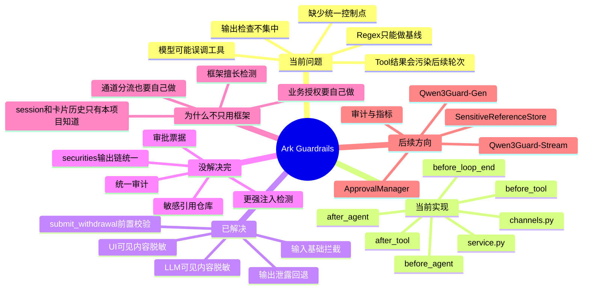
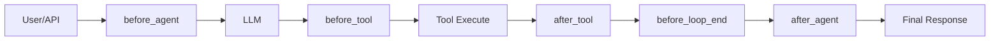

# Ark-Agentic Guardrails 方案说明

> Status: 当前基线已落地

## 1. 先说结论

这次 guardrails 方案解决的不是“模型会不会说错一句话”，而是“模型能不能在错误时机执行错误动作”。

当前方案已经把 guardrails 放进运行时主链路，而不是只放在 prompt 里。

当前已经生效的能力：

- 输入拦截
- `insurance.submit_withdrawal` 前置条件校验
- tool result 脱敏与双通道分流
- 输出泄露检测

## 2. 思维导图

## 3. 当前项目有哪些问题

### 3.1 安全逻辑分散

项目有 callback、tool、session、state、skill 等机制，但这些点尚未形成统一的运行时控制面。

直接后果：

- 输入拦截分散
- 工具授权不足
- 输出检查零散
- agent 之间行为不一致

### 3.2 真正的风险在工具调用，不只是文本输出

对 agent 系统来说，最危险的情况通常不是“模型答错一句话”，而是：

- 用户只是查询，模型却触发提交类工具
- 历史条件不完整，模型却直接推进业务动作
- 外部 tool output 被污染，模型继续把它当执行指令

### 3.3 Tool result 会持续影响后续轮次

只要工具结果被写回会话，它就可能：

- 向 LLM 继续暴露敏感信息
- 向 UI / handler 继续暴露原始值
- 污染下一轮规划

## 4. 当前方案是怎么解决的

### 4.1 把 guardrails 放进运行时

当前 guardrails 已经进入主执行链路：

### 4.2 输入阶段

`before_agent` 当前负责：

- prompt override
- prompt leakage
- secret exfiltration
- 安全讨论降级为 `read_only`

### 4.3 工具阶段

`before_tool` 当前负责：

- 校验 `insurance.submit_withdrawal` 的前置条件

规则很明确：

- 没有 `_plan_allocations`，不允许继续
- 没展示过 `WithdrawPlanCard`，不允许继续

### 4.4 工具结果阶段

`after_tool` 当前负责：

- 对工具结果打码
- 生成：
  - `llm_visible_content`
  - `ui_visible_content`

于是：

- 模型后续看到的是脱敏内容
- UI/handler 拿到的也是脱敏内容
- 原始结果仍保留给执行层

### 4.5 最终输出阶段

`before_loop_end` 和 `after_agent` 当前负责：

- 检查最终回复里是否出现内部提示或内部推理泄露
- 先 retry
- 再 fallback

## 5. 如何理解当前实现

优先看两个文件：

- `src/ark_agentic/core/guardrails/service.py`
- `src/ark_agentic/core/guardrails/channels.py`

可以把它理解成两层：

- `service.py`
  - 负责输入检查、工具前置条件检查、结果脱敏、输出泄露回退
- `channels.py`
  - 负责 `llm_visible_content` 和 `ui_visible_content` 这两个通道

这已经足够覆盖当前项目里最关键的 guardrails 行为。

## 6. 为什么不直接使用成熟 guardrails 框架

这不是因为成熟框架不好，而是因为它们不能替代当前项目最关键的运行时逻辑。

### 6.1 框架擅长“检测”

成熟框架通常擅长：

- prompt attack 检测
- 内容安全分类
- PII 检测
- 输出审核

### 6.2 但当前项目最缺的是“授权”

当前项目真正关键的东西包括：

- session state 判断
- A2UI 历史判断
- 哪个工具什么时候能调
- tool result 应该如何回灌给模型
- tool result 应该如何展示给 UI

这些都必须由当前项目自己的 runtime 来控制。

### 6.3 所以正确顺序不是“先选框架”

而是：

1. 先把自己的运行时控制面搭起来
2. 再把成熟框架当成检测能力接进来

## 7. 为什么推荐用 Qwen3Guard

当前结论是：

- `Qwen3Guard-Gen` 更适合当前项目要的文本级输入/输出检测
- `Qwen3Guard-Stream` 更适合流式输出审核，但不是当前第一优先级

更重要的是：

- 即便接入这些模型，也只能增强“检测”
- 当前项目的工具授权、状态判断、通道分流，仍然必须由我们自己的代码负责

所以推荐路线是：

- 当前运行时 guardrails 保留
- regex 继续作为 fast-path 和 fallback
- 后续优先接 `Qwen3Guard-Gen`
- 如果未来确实需要逐 token 安全审核，再评估 `Qwen3Guard-Stream`
- 托管 provider 仍然可以作为备选

### 7.1 为什么当前优先 `Qwen3Guard-Gen`

原因很现实：

- 当前 guardrails 的主要接点都是文本级：
  - `before_agent`
  - `after_tool`
  - `before_loop_end`
- 当前项目主模型并不是 Qwen tokenizer 体系
- 因此先做文本级分类/审核更稳，也更容易接入

推荐映射：

- `before_agent`
  - 检查用户输入中的 prompt injection / jailbreak / prompt leakage / secret exfiltration
- `after_tool`
  - 检查 tool output 是否包含间接注入或高风险文本
- `before_loop_end`
  - 复核最终答复是否需要阻断或重试

### 7.2 为什么 `Qwen3Guard-Stream` 暂时不是第一优先级

`Qwen3Guard-Stream` 更适合：

- 流式逐 token 审核
- 与 Qwen tokenizer 更容易协同的场景

而当前 Ark-Agentic 的首要需求是：

- 文本级输入检测
- 文本级 tool result 检测
- 最终答复检测

因此当前优先上 `Gen` 版，而不是 `Stream` 版。

## 8. 当前已经解决了什么

当前已生效：

- 输入侧基础拦截
- `insurance.submit_withdrawal` 前置条件校验
- tool result 双通道脱敏
- 输出泄露重试与回退

当前明确不做 runtime 拦截：

- `meta_builder.manage_agents`
- `meta_builder.manage_tools`
- `meta_builder.manage_skills`

它们目前被视为内部构建工具。

## 9. 当前还没有解决完什么

当前还没做或没做完：

- 更强的 prompt injection 检测模型
- `ApprovalManager`
- `approval_ticket`
- `SensitiveReferenceStore`
- 统一审计日志
- 统一 metrics
- `securities` grounding 完整并入统一输出链

## 10. 推荐的后续方向

建议下一步按这个顺序推进：

1. 稳定当前基线
2. 准备中文 prompt injection 样本集
3. 在 `before_agent` 和 `after_tool` 接 `Qwen3Guard-Gen`
4. 如果确实需要流式审核，再评估 `Qwen3Guard-Stream`
5. 补 `ApprovalManager`
6. 补 `SensitiveReferenceStore`
7. 补统一审计和指标

## 11. 配套文档

- [实现说明](./guardrails-control-plane-design.md)
