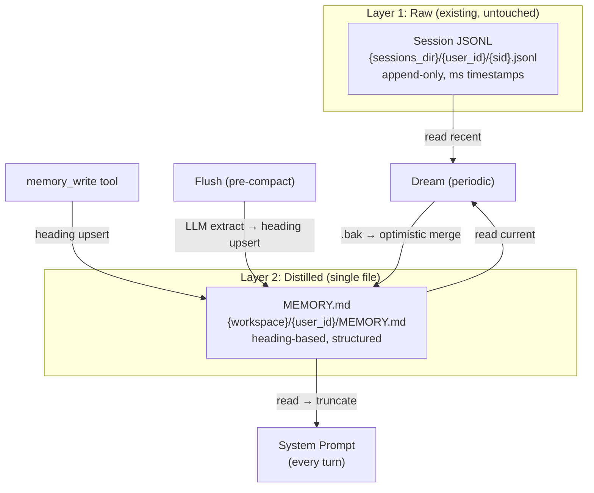

# Memory 系统

## 设计理念

从"存储组件"到"生命周期模型"：**Session JSONL (raw) → MEMORY.md (distilled) → System Prompt (consumption)**。

零 DB 依赖：无 SQLite、无向量库、无 embedding 模型。纯文件存储 + LLM 蒸馏。

## 模块结构

```
core/memory/
├── manager.py         # MemoryManager（路径管理 + read/write）
├── user_profile.py    # heading-based upsert / parse / format / preamble 保护
├── extractor.py       # MemoryFlusher（压缩前 LLM 提取）+ parse_llm_json
├── dream.py           # MemoryDreamer（session reader + 周期蒸馏 + optimistic merge）
└── types.py           # 类型定义

core/tools/memory.py   # memory_write Agent 工具
```

## 架构



## 存储结构

```
{workspace_dir}/
└── {user_id}/
    ├── MEMORY.md      # 蒸馏后的用户记忆（heading-based markdown）
    │   ## 沟通偏好
    │   简洁直接，不要废话
    │
    │   ## 渠道偏好
    │   不要保单贷款渠道
    │
    │   ## 潜在需求
    │   可能考虑子女教育金规划
    └── .last_dream    # Dream 最后执行时间戳
```

## 记忆生命周期

### Write（对话中）
Agent 调用 `memory_write(content)` → `upsert_profile_by_heading` → MEMORY.md

### Flush（上下文压缩前）
`MemoryFlusher` 用 LLM 从完整对话提取新增/变更记忆 → heading upsert → MEMORY.md

### Read（每轮对话）
`runner._build_system_prompt` 读取 MEMORY.md → 截断到 token 限制 → 注入 system prompt

### Dream（后台周期触发）

Dream 是 session 到 memory 的桥梁：

1. **Gate check**：距上次 dream ≥ 24h 且新增 ≥ 3 个 session
2. **Read**：近期 session JSONL（user + assistant 消息，skip tool noise，token budget 6000）+ 当前 MEMORY.md
3. **Distill**：单次 LLM 调用，合并重复、删除过时、提取新信息和潜在需求
4. **Apply**：Optimistic merge — 保留 dream 期间 memory_write 新增的标题，`.bak` 备份
5. **Update**：写入 `.last_dream` 时间戳

## 写入格式

`MEMORY.md` 使用 `## 标题 + 内容` 的 heading-based markdown：

```markdown
# 用户记忆

## 身份信息
姓名: 张经理
所在公司: 平安保险

## 风险偏好
保守型，不接受本金亏损

## 回复风格
简洁直接，不要废话

## 潜在需求
多次询问子女保障，可能考虑教育金规划
```

- **同名标题自动合并**（最新内容覆盖旧内容）
- **`# Title` 行（preamble）永远保留**，不被覆盖
- **标题规范**：使用简短、通用的一级分类（如 `## 风险偏好`），避免过于具体的标题

## Agent 工具

| 工具 | 参数 | 用途 |
|------|------|------|
| `memory_write` | `content` (heading-based markdown) | 保存/更新记忆，heading upsert |

MEMORY.md 全文已注入 system prompt，Agent 无需 search/get 工具即可读取全部记忆。

**写入时机规则**（注入 system prompt）：
- 用户身份信息（姓名、职业、家庭结构）
- 明确偏好（风险偏好、投资风格、回复风格）
- 重要决策（买入、卖出、配置调整及理由）
- 对你的批评或纠正（批评 = 偏好的反面表达）
- 用户主动要求记住的事项

**不记录**：临时查询、公开市场数据、已记住的信息、寒暄闲聊。

## Concurrency Model

`AgentRunner` 是共享 singleton。Dream per-user 独立，需处理两种并发场景：

**不同用户**：无冲突，文件按 user_id 隔离。

**同一用户（dream + memory_write race）**：

```
Dream (background)    Agent Turn N+1       MEMORY.md
───────────────────   ──────────────────   ─────────
read (snapshot)                            v1
     │
  LLM distill (~5-10s)
     │                memory_write(新偏好)  v2 (v1 + 新偏好)
     │
  apply() ─── re-read ────────────────────→ v2
  detect: "新偏好" is new since snapshot
  merge: distilled + "新偏好"
  write ──────────────────────────────────→ v3 (distilled + 新偏好)
```

Solution: **Optimistic merge in `apply()`** + `_dream_tasks: dict[str, asyncio.Task]` 防重复。

## 配置

```python
from ark_agentic.core.memory.manager import build_memory_manager

memory_manager = build_memory_manager("./data/memory")

agent = AgentRunner(
    llm=llm,
    session_manager=session_manager,
    memory_manager=memory_manager,
)
```

## 多用户支持

单个 `MemoryManager` 实例通过 `user_id` 分区支持多用户：

```python
# 文件路径：{workspace_dir}/{user_id}/MEMORY.md
memory_manager.read_memory("U001")    # 读取用户记忆
memory_manager.write_memory("U001", "## 偏好\n简洁")  # heading upsert
```

## Migration

- 现有 `MEMORY.md` 文件：无需迁移，直接兼容
- 旧版 `.memory/` SQLite 目录：已废弃，启动时打印 warning，可安全删除
