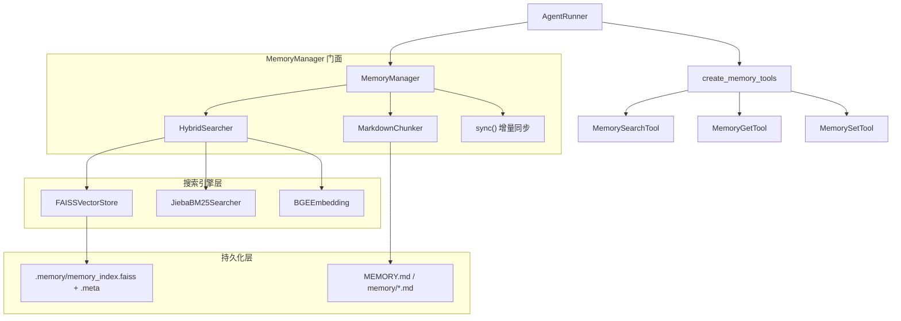
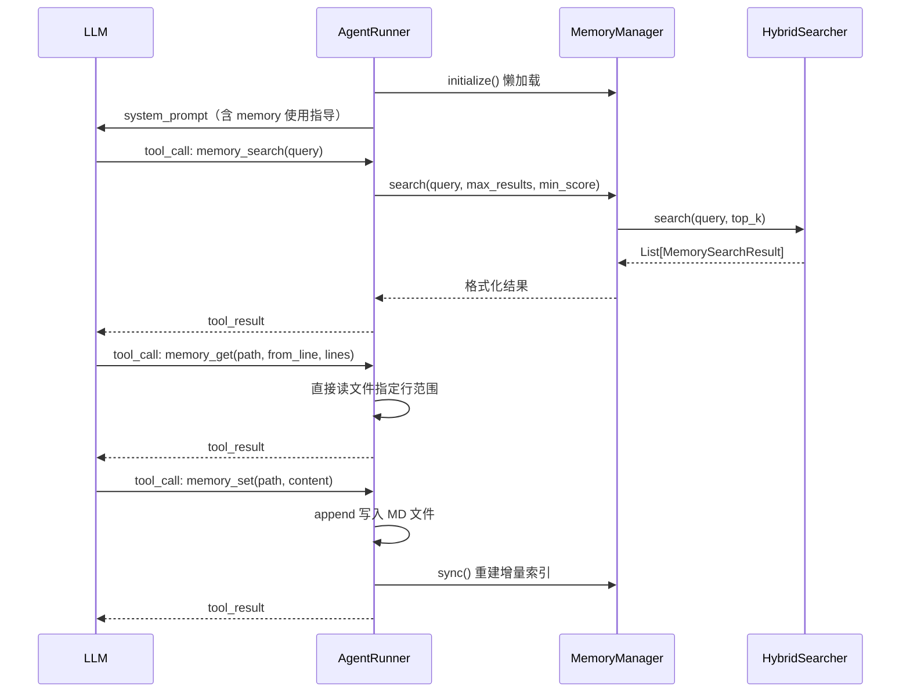

# Memory 系统设计文档

## 架构总览

Memory 系统是项目的长期记忆层，以 Markdown 文件为存储介质，通过双引擎混合检索（向量 + 关键词）为 Agent 提供语义搜索能力。`MemoryManager` 作为门面统一对外暴露接口，三个 Agent 工具（`memory_search` / `memory_get` / `memory_set`）是 LLM 与记忆层交互的唯一入口。

```
src/ark_agentic/core/
├── memory/
│   ├── types.py          # 核心数据结构与协议定义
│   ├── manager.py        # MemoryManager 门面，MemoryConfig 配置
│   ├── chunker.py        # MarkdownChunker 文档分块
│   ├── embeddings.py     # BGEEmbedding 向量化
│   ├── vector_store.py   # FAISSVectorStore 向量索引
│   ├── keyword_search.py # JiebaBM25Searcher 关键词索引
│   └── hybrid.py         # HybridSearcher 混合检索
└── tools/
    └── memory.py         # MemorySearchTool / MemoryGetTool / MemorySetTool
```



---

## 核心数据结构

定义于 [`src/ark_agentic/core/memory/types.py`](../../src/ark_agentic/core/memory/types.py)。

### MemorySource（来源枚举）

```python
class MemorySource(str, Enum):
    MEMORY   = "memory"    # 长期记忆文件 MEMORY.md / memory/*.md（当前激活）
    SESSIONS = "sessions"  # 会话转录（预留）
    KNOWLEDGE = "knowledge" # 知识库（预留）
```

### MemoryChunk（记忆片段）

索引的最小单元，由 `MarkdownChunker` 切割产生：

| 字段 | 类型 | 说明 |
|------|------|------|
| `id` | `str` | `path:start_line:content_hash[:8]` |
| `path` | `str` | 相对于 `workspace_dir` 的文件路径 |
| `start_line` | `int` | 在源文件中的起始行（1-indexed）|
| `end_line` | `int` | 结束行 |
| `text` | `str` | 原文内容 |
| `source` | `MemorySource` | 来源类型 |
| `embedding` | `list[float] \| None` | 向量表示，同步后填充 |
| `metadata` | `dict` | 扩展元数据 |

`content_hash` property 基于 `text` 的 MD5，用于增量同步去重。

### MemorySearchResult（搜索结果）

| 字段 | 类型 | 说明 |
|------|------|------|
| `path` | `str` | 来源文件路径 |
| `start_line` | `int` | 片段起始行 |
| `end_line` | `int` | 片段结束行 |
| `score` | `float` | 混合综合分 (0–1) |
| `snippet` | `str` | 截断至 500 字符的内容预览 |
| `citation` | `str` | `path#start_line` 格式引用 |
| `vector_score` | `float` | 分项向量得分（调试用）|
| `keyword_score` | `float` | 分项关键词得分（调试用）|

### 协议接口

`types.py` 中定义了三个 Protocol：`EmbeddingProvider`、`VectorStore`、`KeywordSearcher`，以及聚合协议 `MemorySearchManager`。各具体实现通过满足这些协议实现依赖反转（DIP）。

---

## 各层组件

### BGEEmbedding（向量化）

[`src/ark_agentic/core/memory/embeddings.py`](../../src/ark_agentic/core/memory/embeddings.py)

```python
@dataclass
class BGEConfig:
    model_name: str = ""          # 优先读 EMBEDDING_MODEL_PATH 环境变量
    device: str = "cpu"           # "cpu" | "cuda" | "mps"
    normalize_embeddings: bool = True
    max_length: int = 512
    batch_size: int = 32
    query_instruction: str = "为这个句子生成表示以用于检索相关文章："
```

支持的模型：

| 模型 | 维度 | 适用场景 |
|------|------|----------|
| `BAAI/bge-base-zh-v1.5`（默认）| 768 | 平衡效果与速度 |
| `BAAI/bge-large-zh-v1.5` | 1024 | 效果最佳，较慢 |

查询时自动添加 `query_instruction` 前缀，索引时不加，符合 BGE 官方使用规范。

### FAISSVectorStore（向量索引）

[`src/ark_agentic/core/memory/vector_store.py`](../../src/ark_agentic/core/memory/vector_store.py)

```python
@dataclass
class FAISSConfig:
    index_type: str = "flat"       # "flat" | "ivf" | "hnsw"
    use_inner_product: bool = True  # True=内积（归一化向量等价余弦）
```

持久化为两个文件：`.faiss`（向量索引）+ `.meta`（pickle，chunk 元数据）。加载时从 FAISS 文件恢复向量，从 `.meta` 恢复 `MemoryChunk` 对象，再重建关键词索引。

### JiebaBM25Searcher（关键词索引）

[`src/ark_agentic/core/memory/keyword_search.py`](../../src/ark_agentic/core/memory/keyword_search.py)

```python
@dataclass
class BM25Config:
    k1: float = 1.5
    b: float = 0.75
    epsilon: float = 0.25
```

使用 `jieba` 分词后建 BM25 倒排索引，得分归一化公式：`score / (score + 1)`，使结果落在 (0, 1) 区间，与向量分数量纲一致。

### MarkdownChunker（文档分块）

[`src/ark_agentic/core/memory/chunker.py`](../../src/ark_agentic/core/memory/chunker.py)

```python
@dataclass
class ChunkConfig:
    chunk_size: int = 500        # 字符数上限
    chunk_overlap: int = 50      # 相邻块重叠字符数
    min_chunk_size: int = 50     # 过短的块被丢弃
    split_by_heading: bool = True
    split_by_paragraph: bool = True
    paragraph_separator: str = "\n\n"
```

**分块策略优先级（从高到低）：**

1. 按 Markdown 标题（`#` ~ `######`）边界切割
2. 若标题块超过 `chunk_size * 2`，再按大小子切，携带标题作为上下文前缀
3. 若无标题，按段落（`\n\n`）切割
4. 若无段落，按固定大小切割（带 `chunk_overlap` 重叠）

每个 chunk 记录 `start_line`/`end_line`，用于 `memory_get` 的精确回读。

### HybridSearcher（混合检索）

[`src/ark_agentic/core/memory/hybrid.py`](../../src/ark_agentic/core/memory/hybrid.py)

```python
@dataclass
class HybridConfig:
    vector_weight: float = 0.7    # 向量分权重
    keyword_weight: float = 0.3   # 关键词分权重
    vector_top_k: int = 20        # 向量检索取 top_k
    keyword_top_k: int = 20       # 关键词检索取 top_k
    min_score: float = 0.1        # 融合后最低分阈值
    dedupe_by_content: bool = True # 按 content_hash 去重
```

**融合公式：**

```
final_score = 0.7 × vector_score + 0.3 × keyword_score
```

两路独立检索后，以 `chunk.id` 为键合并，缺席一路则该路得分为 0。融合后按 `final_score` 降序，再截取 `top_k`。

---

## 初始化与配置

[`src/ark_agentic/core/memory/manager.py`](../../src/ark_agentic/core/memory/manager.py)

### MemoryConfig 完整字段

| 字段 | 类型 | 默认值 | 说明 |
|------|------|--------|------|
| `workspace_dir` | `str` | `""` | MEMORY.md 所在根目录 |
| `index_dir` | `str` | `""` | FAISS 索引存储目录，空则用 `workspace_dir/.memory` |
| `memory_paths` | `list[str]` | `["MEMORY.md", "memory/"]` | 扫描路径，支持文件和目录（递归 `*.md`） |
| `embedding` | `BGEConfig` | 默认实例 | Embedding 模型配置 |
| `vector` | `FAISSConfig` | 默认实例 | FAISS 索引配置 |
| `keyword` | `BM25Config` | 默认实例 | BM25 参数 |
| `hybrid` | `HybridConfig` | 默认实例 | 混合检索权重 |
| `chunk` | `ChunkConfig` | 默认实例 | 分块策略 |
| `auto_sync` | `bool` | `True` | 启用自动同步 |
| `sync_on_init` | `bool` | `True` | 初始化时立即同步 |
| `watch_files` | `bool` | `False` | 文件变化监控（预留）|

### 典型初始化（Securities Agent）

```python
memory_config = MemoryConfig(
    workspace_dir=str(memory_dir),
    index_dir=str(index_sub),     # 独立子目录避免污染工作区
)
memory_manager = MemoryManager(memory_config)
# 此时仅完成 Python 对象初始化，不做任何 IO
```

### 懒初始化机制

`MemoryManager.__init__` 仅设置属性，不加载模型或索引。真正的初始化（`initialize()`）在 `AgentRunner.run()` 首次调用时触发，防止导入阶段的冷启动开销：

```python
# runner.py
if self._memory_manager and not self._memory_manager._initialized:
    await self._memory_manager.initialize()
```

`initialize()` 执行顺序：
1. 创建 `BGEEmbedding` → 发送测试请求以确定向量维度
2. 创建 `FAISSVectorStore(dimensions)`
3. 创建 `JiebaBM25Searcher`
4. 创建 `HybridSearcher`（组合以上三者）
5. 创建 `MarkdownChunker`
6. 尝试从磁盘加载已有 FAISS 索引，并重建关键词索引
7. 若 `sync_on_init=True`，执行首次 `sync()`

### sync() 增量同步

```
扫描 memory_paths 中所有 .md 文件
  → 对每个文件计算 MD5
  → 与 _file_hashes 缓存比对
  → 仅对变化文件执行：chunk_text → embed_batch → 添加到 FAISS + BM25
  → 保存 .faiss + .meta 到 index_dir
```

`force=True` 时先清空全部索引再重建（用于修复索引损坏）。

---

## Agent 调用链



工具注册发生在 `AgentRunner.__init__` 中：

```python
if memory_manager is not None:
    memory_tools = create_memory_tools(memory_manager)
    # 注入 ToolRegistry，LLM 可见
```

`system_prompt` 中注入 memory 使用指导（`include_memory_instructions=True`），告知 LLM 何时调用这三个工具。

---

## 工具接口

工具由 [`src/ark_agentic/core/tools/memory.py`](../../src/ark_agentic/core/tools/memory.py) 中的 `create_memory_tools(memory_manager)` 工厂函数统一创建。

### memory_search

语义搜索 MEMORY.md 和 memory/*.md 文件中的相关内容。

| 参数 | 类型 | 必填 | 默认值 | 说明 |
|------|------|------|--------|------|
| `query` | string | 是 | — | 搜索描述文本 |
| `max_results` | integer | 否 | 6 | 最多返回结果数 |
| `min_score` | number | 否 | 0.35 | 最低相关度阈值 (0–1) |

**返回：**
```json
{
  "query": "...",
  "results": [
    {
      "path": "MEMORY.md",
      "start_line": 10,
      "end_line": 25,
      "score": 0.823,
      "snippet": "...",
      "citation": "MEMORY.md#10"
    }
  ],
  "total": 3
}
```

**使用时机：** 在回答任何涉及历史决策、日期、用户偏好、已完成工作等问题前，应先调用此工具。

### memory_get

读取 memory 文件的指定行范围，配合 `memory_search` 获取更完整的上下文。

| 参数 | 类型 | 必填 | 默认值 | 说明 |
|------|------|------|--------|------|
| `path` | string | 是 | — | 相对路径，如 `MEMORY.md` |
| `from_line` | integer | 否 | 1 | 起始行（1-indexed）|
| `lines` | integer | 否 | 50 | 读取行数（上限 200）|

**返回：**
```json
{
  "path": "MEMORY.md",
  "from_line": 10,
  "to_line": 35,
  "total_lines": 120,
  "text": "..."
}
```

路径安全检查：`file_path` 必须在 `workspace_dir` 范围内，防止路径遍历攻击。

### memory_set

将重要信息持久化写入 memory 文件，写入后立即触发 `sync()` 使内容可被检索。

| 参数 | 类型 | 必填 | 默认值 | 说明 |
|------|------|------|--------|------|
| `path` | string | 是 | — | 目标文件，不存在时自动创建 |
| `content` | string | 是 | — | 要追加的内容（推荐 Markdown 格式）|
| `section` | string | 否 | — | 追加到指定标题下，如 `## Decisions` |

**返回：**
```json
{
  "path": "memory/decisions.md",
  "status": "written",
  "bytes_written": 256
}
```

**使用时机：** 保存关键决策、用户偏好、待办事项，或任何在对话压缩后需要保留的信息。

---

## Auto-Compact 机制

当对话上下文即将触发 compaction 时，`AgentRunner` 通过 `_make_pre_compact_callback()` 将即将被丢弃的消息内容自动沉淀到 `MEMORY.md`，防止记忆丢失。

**执行流程：**

```
auto_compact_if_needed() 触发
  → _flush_to_memory(session_id, messages)
      → 遍历待压缩消息（排除 SYSTEM 消息）
      → 每条消息截取前 300 字符，格式化为 "ROLE: text [tools: ...]"
      → 最多取 20 条摘要行
      → 写入 MEMORY.md：
          ## Session Snapshot (2026-03-10 14:30)
          USER: ...
          ASSISTANT: ...
      → 调用 memory_manager.sync() 重建增量索引
```

这使得长对话中产生的上下文在压缩后依然可通过 `memory_search` 被检索到，形成"工作记忆 → 长期记忆"的自动沉淀闭环。

---

## 已知设计缺陷

### 缺陷一：无用户隔离（严重性：高）

**现状：** `MemoryManager` 在服务启动时单例化，整个进程共享同一个 `MEMORY.md` 文件和 FAISS 索引。

```
app 启动
  └── create_securities_agent_from_env()
        └── MemoryManager(workspace_dir="data/ark_securities_memory")
              └── MEMORY.md  ← 全局唯一，无用户隔离
```

**影响：**

- 用户 A 的偏好、决策被 `memory_set` 写入后，用户 B 的对话通过 `memory_search` 可以检索到
- Auto-compact 触发时，任何用户的会话快照都写入同一个文件，内容相互污染
- 如果 MEMORY.md 中存有真实用户数据（账号、持仓偏好等），构成**数据隐私泄露风险**

**严重性评估：高**

在 Mock 测试环境下暂时可接受（所有用户数据均为虚构），但一旦接入真实用户数据，此问题升级为**安全合规级缺陷**，必须在上线前修复。

---

### 缺陷二：长对话的记忆污染（严重性：中）

**现状：** Auto-compact 的 `_flush_to_memory` 将整个会话的消息摘要（每条截取 300 字符）不加区分地 append 到 `MEMORY.md`，无过期机制，无清理机制。

**影响：**

- 多轮 compaction 后，MEMORY.md 中会积累大量低价值的"Session Snapshot"条目
- LLM 检索时会被噪声干扰，搜索相关性下降
- 文件无限增长，向量重建时间线性增加

**严重性评估：中**

不影响功能正确性，但会随使用时间推移导致检索质量退化，需要周期性清理或引入 TTL 机制。

---

### 修复方向

**用户隔离（修复缺陷一）：**

`MemoryManager` 改为**按 `user_id` 懒创建 + LRU 缓存**的模式，将 `workspace_dir` 参数化：

```
data/ark_securities_memory/
  {user_id}/
    MEMORY.md
    .index/
```

这要求 `AgentRunner` 在 `run()` 时根据 `input_context["user:id"]` 动态选择或创建对应的 `MemoryManager`，无法继续在启动时单例注入，需要较大架构改动。

**长对话噪声（修复缺陷二）：**

在 `_flush_to_memory` 中引入质量过滤：只保留包含用户明确偏好/决策的消息，而非全量 dump。或对 `## Session Snapshot` 条目设置数量上限（如最多保留最近 10 条），超出时自动删除旧条目。
