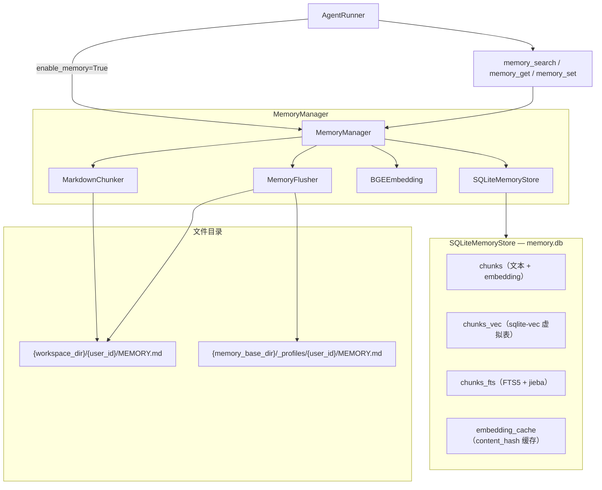

# Memory 系统

## 模块结构

```
core/memory/
├── types.py          # MemoryChunk / MemorySearchResult / 协议定义
├── manager.py        # MemoryManager 门面 + MemoryConfig
├── sqlite_store.py   # SQLiteMemoryStore：vec + FTS5 + cache + 文件追踪
├── embeddings.py     # BGEEmbedding（BGE 系列，支持 cpu/cuda/mps）
├── chunker.py        # MarkdownChunker（标题边界优先分块）
├── extractor.py      # MemoryFlusher（LLM 驱动结构化提取）
├── user_profile.py   # 用户画像 heading-based upsert
└── tools/memory.py   # memory_search / memory_get / memory_set
```

## 架构



## 核心技术

- **存储**：单 `memory.db` 文件，四张表（`chunks` / `chunks_vec` / `chunks_fts` / `embedding_cache`），WAL 模式。
- **向量检索**：sqlite-vec 扩展余弦搜索；扩展不可用时自动降级为 numpy cosine 全扫描。
- **关键词检索**：FTS5 虚拟表 + jieba 分词；BM25 打分归一化为 `score / (1 + score)`。
- **混合检索**：`final = 0.7 × vector_score + 0.3 × keyword_score`，按 `content_hash` 去重。
- **增量同步**：MD5 文件 hash 比对，未变化文件跳过；embedding 按 `content_hash` 写入 `embedding_cache`，重建时直接命中，不重复计算。
- **原子重建**：`safe_reindex()` 写临时 `.db` 再文件级 swap，防止重建中断导致索引损坏。
- **用户隔离**：所有表含 `user_id` 列，`sync()` / `search()` 全部接收 `user_id`；文件目录分区到 `{workspace_dir}/{user_id}/`。
- **记忆提取**：compaction 前 `MemoryFlusher` 调用 LLM 结构化提取，分流写入全局 user profile（heading-based upsert）和 agent memory。

## 工具接口

由 `create_memory_tools(get_memory_fn)` 工厂创建，注入 `ToolRegistry`。

| 工具 | 参数 | 用途 |
|------|------|------|
| `memory_search` | `query`, `max_results`, `min_score`, `search_mode` | 混合/向量/关键词检索 |
| `memory_get` | `path`, `from_line`, `lines` | 按文件路径和行号读取原文 |
| `memory_set` | `path`, `content`, `section` | 追加写入，写后触发 `sync()` |

`search_mode` 可选 `hybrid`（默认）/ `vector` / `keyword`。
