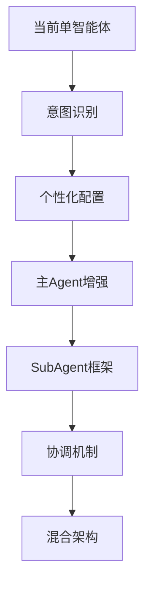

# 多智能体 vs 单智能体架构对比分析

> 生成日期: 2026-02-23 | 版本: 1.0.0 | 状态: 架构改造计划

## 1. 执行摘要

本文档对比分析多智能体架构与单智能体架构在金融服务场景下的适用性，基于ark-agentic现有架构和openclaw-main的多智能体实现经验，为架构改造提供决策依据。

**核心结论：**
- **推荐采用混合架构**：单智能体为主 + 多智能体协调能力
- **分阶段实施**：Phase 1保持单智能体，Phase 2增加多智能体支持
- **面向金融服务**：重点支持"查问办"业务流程和"千人千面"个性化需求

## 2. 架构模式对比

### 2.1 单智能体架构（ark-agentic 当前）

**核心特征：**
```
单一AgentRunner → 统一会话管理 → 共享工具和技能
```

**优势：**
- ✅ **简单可控**：单一执行路径，易于调试和监控
- ✅ **资源高效**：共享内存、模型连接和向量索引
- ✅ **一致性强**：统一的会话状态和上下文管理
- ✅ **部署简单**：单进程部署，运维成本低
- ✅ **延迟最低**：无跨Agent通信开销

**劣势：**
- ❌ **扩展性限制**：难以支持并发多任务处理
- ❌ **专业化不足**：无法针对不同业务场景优化
- ❌ **隔离性差**：用户间缺乏数据和会话隔离
- ❌ **个性化受限**：难以实现"千人千面"定制

### 2.2 多智能体架构（openclaw-main 模式）

**核心特征：**
```
多个AgentRunner → 独立会话存储 → 路由绑定机制
```

**优势：**
- ✅ **专业化强**：每个Agent可针对特定场景优化
- ✅ **隔离性好**：独立的工作空间、认证和会话
- ✅ **并发能力**：支持多用户并发和多任务处理
- ✅ **个性化**：支持"千人千面"的Agent配置
- ✅ **可扩展**：水平扩展和负载分布

**劣势：**
- ❌ **复杂度高**：路由、绑定、协调机制复杂
- ❌ **资源开销**：多实例运行，内存和计算成本高
- ❌ **一致性挑战**：跨Agent状态同步困难
- ❌ **运维复杂**：多Agent监控、日志聚合复杂

## 3. 金融服务场景适配分析

### 3.1 "查问办"业务流程需求

| 业务类型 | 单智能体适配 | 多智能体适配 | 推荐方案 |
|---------|-------------|-------------|----------|
| **查询类** | ✅ 简单高效 | ⚠️ 过度设计 | 单智能体 |
| **咨询类** | ⚠️ 专业性不足 | ✅ 专业Agent | 多智能体 |
| **办理类** | ❌ 流程复杂 | ✅ 工作流协调 | 多智能体 |

**分析：**
- **查询类**：账户余额、交易记录等简单查询，单智能体足够
- **咨询类**：投资建议、保险规划等需要专业知识，多智能体更适合
- **办理类**：开户、理赔等复杂流程，需要多Agent协调

### 3.2 "千人千面"个性化需求

**单智能体局限性：**
```python
# 当前ark-agentic模式
class AgentRunner:
    def __init__(self, config: RunnerConfig):
        self.config = config  # 全局配置，难以个性化
        self.tools = create_tools()  # 共享工具集
        self.skills = load_skills()  # 共享技能
```

**多智能体优势：**
```python
# openclaw-main模式
agents = {
    "conservative_investor": {
        "workspace": "~/.ark/workspace-conservative",
        "model": "claude-sonnet-4-5",
        "tools": ["portfolio_analysis", "risk_assessment"],
        "personality": "谨慎保守，注重风险控制"
    },
    "aggressive_trader": {
        "workspace": "~/.ark/workspace-aggressive",
        "model": "claude-opus-4-5",
        "tools": ["market_analysis", "trading_signals"],
        "personality": "积极进取，追求高收益"
    }
}
```

### 3.3 嵌入式部署场景考虑

**资源约束：**
- CPU: 4-8核心
- 内存: 8-16GB
- 存储: 100-500GB SSD

**单智能体优势：**
- 内存占用: ~2-4GB
- 启动时间: ~10-30秒
- 并发处理: 10-50用户

**多智能体挑战：**
- 内存占用: ~1-2GB per Agent
- 启动时间: ~30-60秒
- 资源竞争: 模型加载冲突

## 4. 技术实现对比

### 4.1 会话管理

**单智能体（ark-agentic）：**
```python
class SessionManager:
    def __init__(self):
        self.sessions: Dict[str, SessionEntry] = {}  # 内存共享
        self.persistence = JSONLPersistence()

    def get_session(self, session_id: str) -> SessionEntry:
        return self.sessions.get(session_id)  # 简单直接
```

**多智能体（openclaw-main）：**
```typescript
// 每个Agent独立会话存储
const sessionPath = `~/.openclaw/agents/${agentId}/sessions`
const sessionKey = `agent:${agentId}:${mainKey}`

// 路由绑定机制
const binding = findBinding(channel, accountId, peer)
const targetAgent = binding.agentId
```

### 4.2 工具和技能管理

**单智能体：**
```python
# 全局工具注册
tool_registry = ToolRegistry()
tool_registry.register_all([
    MemorySearchTool(),
    ReadSkillTool(),
    InsuranceQueryTool(),
    # ... 所有工具共享
])
```

**多智能体：**
```python
# 每个Agent独立工具集
agents_config = {
    "insurance_agent": {
        "tools": ["insurance_query", "policy_analysis"],
        "skills": ["insurance_consultation", "claim_processing"]
    },
    "investment_agent": {
        "tools": ["market_data", "portfolio_analysis"],
        "skills": ["investment_advice", "risk_assessment"]
    }
}
```

### 4.3 LLM客户端管理

**单智能体：**
```python
# 共享LLM连接池
llm_client = create_llm_client("deepseek")
# 所有请求复用连接
```

**多智能体：**
```python
# 每个Agent独立LLM配置
agent_configs = {
    "fast_agent": {"model": "claude-sonnet-4-5"},
    "deep_agent": {"model": "claude-opus-4-5"}
}
```

## 5. 架构选择建议

### 5.1 推荐方案：混合架构

**Phase 1: 增强单智能体（3个月）**
```
当前ark-agentic + 个性化配置 + 意图路由
```

**核心改进：**
- 意图识别系统：自动识别"查问办"类型
- 个性化配置：用户级别的工具和技能配置
- 上下文路由：根据意图选择不同的处理策略

**Phase 2: 混合多智能体（6个月）**
```
主Agent + 专业SubAgent + 协调机制
```

**架构设计：**
```python
class HybridAgentRunner:
    def __init__(self):
        self.main_agent = AgentRunner()  # 主Agent处理路由
        self.sub_agents = {
            "insurance": InsuranceAgent(),
            "investment": InvestmentAgent(),
            "banking": BankingAgent()
        }

    async def process_request(self, request):
        intent = await self.classify_intent(request)

        if intent.complexity == "simple":
            return await self.main_agent.process(request)
        else:
            sub_agent = self.sub_agents[intent.domain]
            return await sub_agent.process(request)
```

### 5.2 实施策略

**优先级排序：**
1. **P0**: 意图识别系统（支持"查问办"分类）
2. **P1**: 个性化配置框架（支持"千人千面"）
3. **P1**: 主Agent增强（处理复杂查询）
4. **P2**: SubAgent框架（专业领域处理）
5. **P2**: Agent协调机制（跨领域任务）

**技术路径：**


## 6. 风险评估

### 6.1 技术风险

| 风险项 | 影响程度 | 发生概率 | 缓解措施 |
|--------|---------|---------|----------|
| 多Agent协调复杂 | 高 | 中 | 分阶段实施，先单后多 |
| 资源消耗增加 | 中 | 高 | 智能调度，按需启动 |
| 一致性问题 | 高 | 中 | 共享状态存储 |
| 性能下降 | 中 | 中 | 缓存优化，连接池 |

### 6.2 业务风险

| 风险项 | 影响程度 | 发生概率 | 缓解措施 |
|--------|---------|---------|----------|
| 用户体验不一致 | 高 | 中 | 统一交互规范 |
| 响应时间增加 | 中 | 中 | 性能监控，SLA保证 |
| 运维复杂度 | 中 | 高 | 自动化部署，监控告警 |

## 7. 成功指标

### 7.1 技术指标

- **响应时间**: P95 < 2秒（查询类），P95 < 5秒（咨询类）
- **并发能力**: 支持100+并发用户
- **准确率**: 意图识别 > 95%，业务处理 > 90%
- **可用性**: 99.9%服务可用性

### 7.2 业务指标

- **用户满意度**: > 4.5/5.0
- **任务完成率**: > 85%（端到端业务流程）
- **个性化效果**: 用户留存率提升 > 20%
- **运营效率**: 人工干预率 < 10%

## 8. 结论

**推荐采用混合架构方案**，分两个阶段实施：

1. **Phase 1（3个月）**：在现有单智能体基础上增加意图识别和个性化配置能力
2. **Phase 2（6个月）**：引入专业SubAgent和协调机制，形成混合多智能体架构

这种渐进式演进既保持了ark-agentic的简洁性优势，又逐步获得多智能体的专业化和个性化能力，最适合金融服务的嵌入式部署场景。