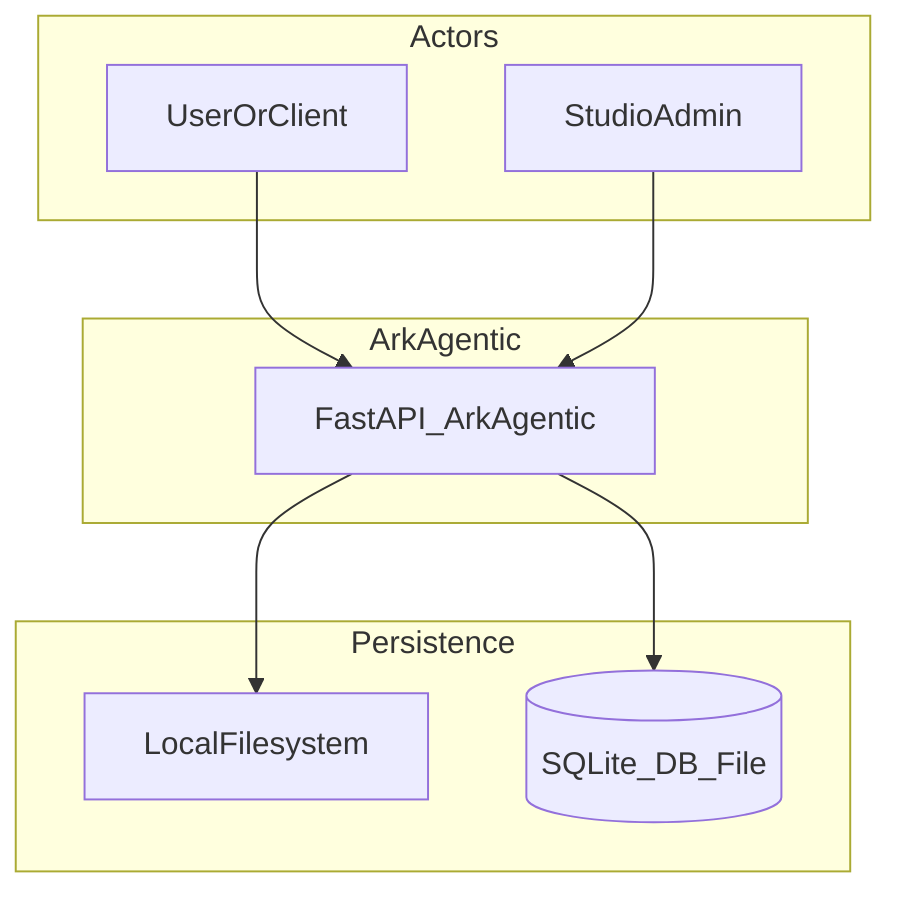
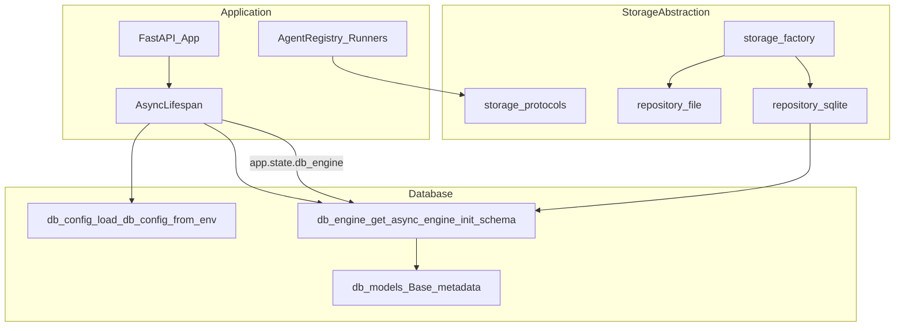
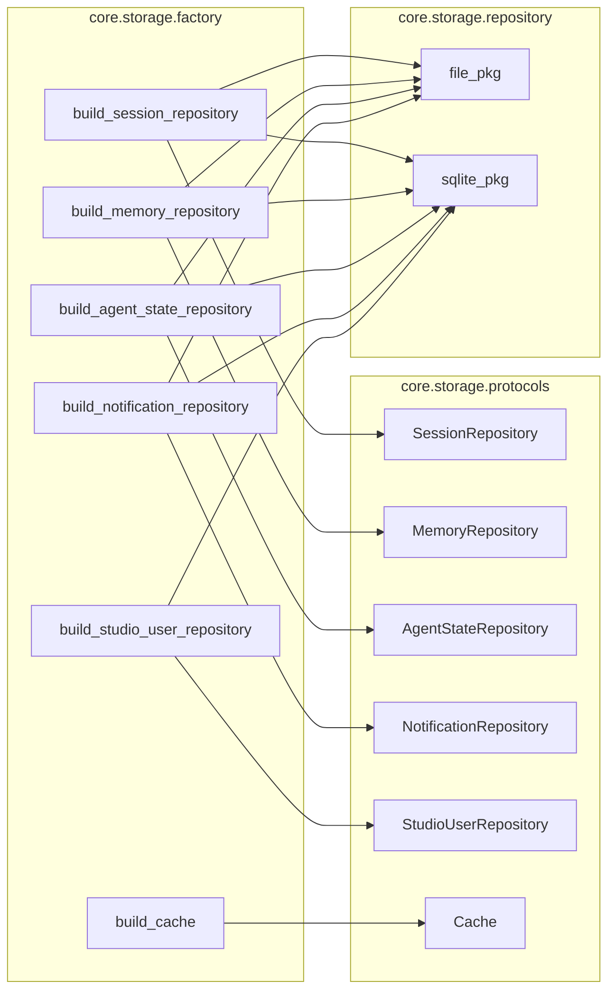
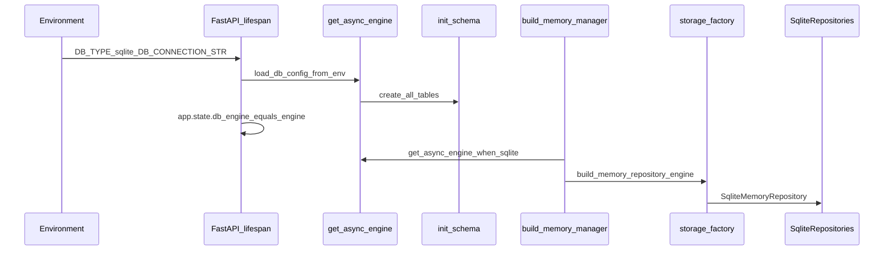

# 数据库与持久化抽象（当前分支）

本文总结 `ark-agentic` 中与 **数据库引擎**、**存储六边形抽象**（Protocols + Factory + Repository 实现）相关的设计与装配关系，并说明如何启用 SQLite。

---

## 1. 设计目标

| 层次 | 职责 |
|------|------|
| **业务 / Runner** | 只依赖 `SessionManager`、`MemoryManager` 等门面与 `core.storage.protocols` 中的 **Protocol**，不 import `repository/file` 或 `repository/sqlite`。 |
| **工厂** [`core/storage/factory.py`](../src/ark_agentic/core/storage/factory.py) | 读取环境变量 `DB_TYPE`，返回 **file** 或 **sqlite** 的具体 Repository；SQLite 分支要求调用方注入共享的 `AsyncEngine`。 |
| **引擎** [`core/db/engine.py`](../src/ark_agentic/core/db/engine.py) | 在 `DB_TYPE=sqlite` 时基于 `DBConfig` 创建进程内缓存的 `AsyncEngine`，执行 `init_schema` 建表；`DB_TYPE=file` 时不创建引擎。 |
| **配置** [`core/db/config.py`](../src/ark_agentic/core/db/config.py) | 从环境解析 `DB_TYPE`、`DB_CONNECTION_STR`、`DB_POOL_SIZE`。 |

**数据与错误边界**：DTO（如 `SessionStoreEntry`）放在 [`core/storage/entries.py`](../src/ark_agentic/core/storage/entries.py)，与具体介质无关；各 Repository 负责与文件或 ORM 表之间的序列化。

---

## 2. C4 视图

以下使用 Mermaid 表达 C4 的 **上下文 / 容器 / 组件** 三层（语义对齐 C4，语法为通用 flowchart，便于在 GitHub 与多数 Markdown 预览中渲染）。

### 2.1 Level 1 — 系统上下文（System Context）



- `DB_TYPE=file` 时，会话 / Memory / AgentState 等主要落在 **本地目录**（约定路径如 `data/ark_sessions`、`data/ark_memory`）。
- `DB_TYPE=sqlite` 时，业务表与 Studio 用户等落在 **同一 SQLite 文件**（由 `DB_CONNECTION_STR` 指定，默认 `data/ark.db`），由 `AsyncEngine` 访问。

---

### 2.2 Level 2 — 容器（Containers）



- **FastAPI**：启动时在 `lifespan` 中根据 `DB_TYPE` 决定是否创建 `AsyncEngine` 并 `init_schema`，将引擎挂到 `app.state.db_engine`（见 [`app.py`](../src/ark_agentic/app.py)）。
- **工厂**：各 `build_*_repository(...)` 根据 `DB_TYPE` 选择 file/sqlite 实现类；SQLite 路径必须传入 `engine`（由 `get_async_engine` 得到）。

---

### 2.3 Level 3 — 组件（Components，存储包内）



- **Studio**：`StudioUserRepository` **仅存在 SQLite 实现**（[`build_studio_user_repository`](../src/ark_agentic/core/storage/factory.py)）；`DB_TYPE=file` 时 Studio 使用独立 SQLite 文件引擎（见 [`studio/services/authz_service.py`](../src/ark_agentic/studio/services/authz_service.py) 中 `get_studio_user_repo` 的分支）。
- **Cache**：当前始终为进程内 [`MemoryCache`](../src/ark_agentic/core/storage/inproc_cache.py)，与 `DB_TYPE` 无关。

---

## 3. 关键数据流（SQLite）



- **Memory**：[`build_memory_manager`](../src/ark_agentic/core/memory/manager.py) 在 `DB_TYPE=sqlite` 时调用 `get_async_engine` 并交给 `build_memory_repository`。
- **Session**：[`SessionManager`](../src/ark_agentic/core/session.py) 在未传入自定义 `repository` 时，内部调用 `build_session_repository(sessions_dir, engine=db_engine)`。FastAPI `lifespan` 在 `DB_TYPE=sqlite` 时把 `get_async_engine` 的结果放在 `app.state.db_engine`，创建 Agent 时通过 [`build_standard_agent(..., db_engine=...)`](../src/ark_agentic/core/agent_factory.py) 传入 **`SessionManager`**。集成测试见 [`tests/integration/test_factory_backend_switching.py`](../tests/integration/test_factory_backend_switching.py)。

---

## 4. 如何启用 SQLite

### 4.1 环境变量

| 变量 | 含义 | 默认 / 说明 |
|------|------|-------------|
| `DB_TYPE` | 存储档位 | 未设置或 `file` → 文件后端；设为 **`sqlite`** 启用 SQLite 分支。 |
| `DB_CONNECTION_STR` | SQLAlchemy 异步连接串 | 未设置时使用 **`sqlite+aiosqlite:///data/ark.db`**（见 [`DBConfig`](../src/ark_agentic/core/db/config.py)）。也可使用 `sqlite:///...`（引擎层会自动升级为 `sqlite+aiosqlite`）。 |
| `DB_POOL_SIZE` | 连接池大小 | 默认 `5`，仅对非 SQLite 类 URL 的池化有意义；SQLite 仍接受该配置字段。 |

**最小示例（本机 shell）：**

```bash
export DB_TYPE=sqlite
# 可选：自定义库文件路径
export DB_CONNECTION_STR="sqlite+aiosqlite:///data/ark.db"
```

Windows PowerShell：

```powershell
$env:DB_TYPE = "sqlite"
$env:DB_CONNECTION_STR = "sqlite+aiosqlite:///data/ark.db"
```

### 4.2 应用启动时发生什么

1. [`load_db_config_from_env()`](../src/ark_agentic/core/db/config.py) 解析配置。  
2. 若 `db_type == "sqlite"`：[`get_async_engine`](../src/ark_agentic/core/db/engine.py) → [`init_schema`](../src/ark_agentic/core/db/engine.py) 创建/迁移 ORM 表；`app.state.db_engine` 供通知 API、Job 扫描、`create_insurance_agent` / `create_securities_agent` 的 `db_engine` 参数（进而注入 `SessionManager`）与 `build_notification_repository(..., engine=...)` 使用。  
3. 若 `db_type == "file"`：`app.state.db_engine = None`，业务持久化走目录，不打开 SQLAlchemy 引擎。

### 4.3 从文件存储迁移到 SQLite

使用脚本 [`ark_agentic.scripts.migrate_file_to_sqlite`](../src/ark_agentic/scripts/migrate_file_to_sqlite.py)（参见其模块文档字符串中的命令行示例）；集成测试见 `tests/integration/test_migrate_file_to_sqlite.py`。

### 4.4 测试中使用内存 SQLite

```python
from ark_agentic.core.db.config import DBConfig
from ark_agentic.core.db.engine import get_async_engine, init_schema

cfg = DBConfig(db_type="sqlite", connection_str="sqlite+aiosqlite:///:memory:")
engine = get_async_engine(cfg)
await init_schema(engine)
```

---

## 5. 与「database-abstract」相关的源码索引

| 路径 | 说明 |
|------|------|
| `src/ark_agentic/core/db/config.py` | `DBConfig`、`load_db_config_from_env` |
| `src/ark_agentic/core/db/engine.py` | `get_async_engine`、`init_schema`、SQLite PRAGMA |
| `src/ark_agentic/core/db/models.py` | SQLAlchemy 模型（`Base.metadata`） |
| `src/ark_agentic/core/storage/protocols/` | Repository / Cache 的 Protocol |
| `src/ark_agentic/core/storage/factory.py` | 环境驱动的 `build_*` 工厂 |
| `src/ark_agentic/core/storage/repository/file/` | 文件实现 |
| `src/ark_agentic/core/storage/repository/sqlite/` | SQLite 实现 |
| `src/ark_agentic/app.py` | `lifespan` 中引擎与 schema 初始化 |
| `src/ark_agentic/core/memory/manager.py` | Memory 与 `DB_TYPE` 的接合 |
| `src/ark_agentic/core/agent_factory.py` | `build_standard_agent` 的 `db_engine` 与 `SessionManager` 装配 |
| `src/ark_agentic/core/session.py` | Session 与 `build_session_repository` 的接合 |

---

## 6. 术语对照

- **Backend（泛指）**：tracing、notifications 文档中「多种后端」与本文 **storage 包下的 repository** 不是同一概念；存储实现目录名为 **`repository/`**（原 `backends/`）。  
- **Repository**：Python 中具体类名多为 `*Repository`（如 `SqliteSessionRepository`），与 DDD 中的仓储含义一致，介质由 `DB_TYPE` 切换。

如需将 C4 图同步到架构幻灯，可参考仓库内 [`docs/architect-viewer/`](./architect-viewer/) 工具链自行导出。
