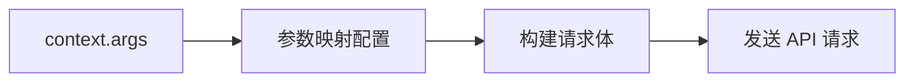
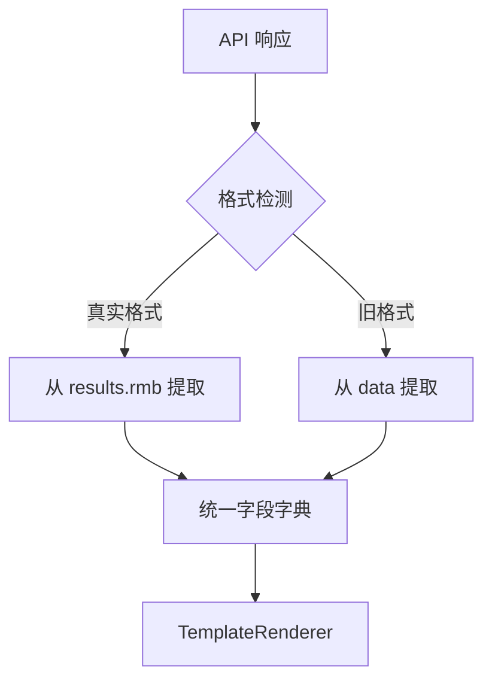

# Account Overview API 集成计划

## 概述

本计划旨在将真实的账户总资产 API 集成到证券智能体中，包括：
1. 更新 mock 数据格式为真实 API 格式
2. 实现从 `context.args` 获取参数的映射机制
3. 创建灵活的字段提取配置用于 `display_card`

## 确认的设计决策

- **token_id 来源**: `context.args.token_id`
- **范围**: 仅聚焦 `account_overview`，其他服务后续处理
- **兼容性**: 保持对旧格式的向后兼容

---

## 问题分析与改进

### 1. API 请求格式冲突 ⚠️

**当前代码** ([`service_client.py:84-100`](src/ark_agentic/agents/securities/tools/service_client.py:84)):
```python
def _build_request(self, account_type, user_id, params):
    body = {"user_id": user_id, "account_type": account_type, **params}
```

**真实 API 需要的格式**:
```json
{
    "channel": "native",
    "appName": "AYLCAPP",
    "tokenId": "N_4ABD52CE...",
    "body": {
        "accountType": "1"
    }
}
```

**问题**: 当前请求体结构与真实 API 完全不匹配！

**解决方案**: 需要重新设计 `_build_request()` 方法，支持嵌套 body 结构和自定义字段映射。

### 2. 响应格式解析冲突 ⚠️

**当前代码** ([`service_client.py:129`](src/ark_agentic/agents/securities/tools/service_client.py:129)):
```python
data = raw_data.get("data", {})  # 期望 {"data": {...}}
```

**真实 API 响应格式**:
```json
{
    "status": 1,
    "results": {
        "accountType": "1",
        "rmb": {...}
    }
}
```

**问题**: 真实 API 没有 `data` 字段，而是 `results` 字段！

**解决方案**: 需要在 `_normalize_response()` 中同时支持两种格式。

### 3. Context 参数传递问题

**当前代码** ([`account_overview.py:42-46`](src/ark_agentic/agents/securities/tools/account_overview.py:42)):
```python
context_account_type = context.get("account_type") if context else None
user_id = context.get("user_id", "U001") if context else "U001"
```

**问题**: 
- 缺少 `token_id` 的获取（真实 API 必需）
- `account_type` 在 context 的位置不明确（是顶层还是 `args` 下）

**解决方案**: 统一从 `context.args` 获取业务参数，定义清晰的 context 结构。

### 4. 设计改进建议

#### 4.1 简化参数映射设计

原设计的 `ParamSource` 和 `APIParamConfig` 过于复杂，建议简化为配置字典：

```python
# 参数映射配置（简化版）
ACCOUNT_OVERVIEW_PARAM_CONFIG = {
    # API 字段 -> (来源类型, 来源键, 可选转换)
    "channel": ("static", "native"),
    "appName": ("static", "AYLCAPP"),
    "tokenId": ("context", "args.token_id"),
    "body.accountType": ("transform", "args.account_type", lambda x: "2" if x == "margin" else "1"),
}
```

#### 4.2 统一字段提取与 Schema

将字段提取逻辑整合到 Schema 类中，避免重复定义：

```python
class AccountOverviewSchema(BaseModel):
    # ... 字段定义 ...
    
    @classmethod
    def from_api_response(cls, data: dict) -> AccountOverviewSchema:
        """从 API 响应创建（自动检测格式）"""
        # 检测真实 API 格式
        if "results" in data and "rmb" in data.get("results", {}):
            return cls._from_real_format(data)
        # 兼容旧格式
        return cls.from_raw_data(data.get("data", data))
```

---

## 改进后的设计

### Context 结构规范

```python
context = {
    # 业务参数（来自 request.context.args）
    "args": {
        "token_id": "N_4ABD52CE...",
        "account_type": "normal",  # 或 "margin"
    },
    # 系统参数
    "user_id": "U001",
    "session_id": "xxx",
    # ... 其他上下文
}
```

### 请求构建流程



### 响应处理流程



---

## 详细实现步骤

### 步骤 1: 创建参数映射工具

**新建文件**: `tools/param_mapping.py`

```python
"""API 参数映射工具"""

from typing import Any, Callable

def build_api_request(
    config: dict[str, tuple],
    context: dict[str, Any],
) -> dict[str, Any]:
    """根据配置构建 API 请求体
    
    Args:
        config: 参数映射配置
            {"api_field": ("source_type", "source_key", transform?), ...}
        context: 上下文字典
    
    Returns:
        API 请求体字典
    """
    result = {}
    
    for api_field, source_def in config.items():
        source_type = source_def[0]
        
        if source_type == "static":
            value = source_def[1]
        elif source_type == "context":
            key = source_def[1]
            value = _get_by_path(context, key)
        elif source_type == "transform":
            key = source_def[1]
            transform = source_def[2]
            value = transform(_get_by_path(context, key))
        else:
            continue
        
        # 支持嵌套字段 (如 "body.accountType")
        _set_by_path(result, api_field, value)
    
    return result

def _get_by_path(data: dict, path: str) -> Any:
    """通过点号路径获取嵌套值"""
    keys = path.split(".")
    value = data
    for key in keys:
        if isinstance(value, dict) and key in value:
            value = value[key]
        else:
            return None
    return value

def _set_by_path(data: dict, path: str, value: Any) -> None:
    """通过点号路径设置嵌套值"""
    keys = path.split(".")
    current = data
    for key in keys[:-1]:
        if key not in current:
            current[key] = {}
        current = current[key]
    current[keys[-1]] = value


# 服务参数配置
SERVICE_PARAM_CONFIGS = {
    "account_overview": {
        "channel": ("static", "native"),
        "appName": ("static", "AYLCAPP"),
        "tokenId": ("context", "args.token_id"),
        "body.accountType": ("transform", "args.account_type", 
                             lambda x: "2" if x == "margin" else "1"),
    },
}
```

### 步骤 2: 创建字段提取工具

**新建文件**: `tools/field_extraction.py`

```python
"""API 响应字段提取工具"""

from typing import Any

# 字段映射配置: 显示字段名 -> API 响应路径
ACCOUNT_OVERVIEW_FIELD_MAPPING = {
    "total_assets": "results.rmb.totalAssetVal",
    "cash_balance": "results.rmb.cashGainAssetsInfo.cashBalance",
    "stock_market_value": "results.rmb.mktAssetsInfo.totalMktVal",
    "fund_market_value": "results.rmb.fundMktAssetsInfo.fundMktVal",
    "today_profit": "results.rmb.mktAssetsInfo.totalMktProfitToday",
    "today_return_rate": "results.rmb.mktAssetsInfo.totalMktYieldToday",
    # 两融账户特有字段
    "net_assets": "results.rmb.rzrqAssetsInfo.netWorth",
    "total_liabilities": "results.rmb.rzrqAssetsInfo.totalLiabilities",
    "maintenance_margin_ratio": "results.rmb.rzrqAssetsInfo.mainRatio",
}

# 旧格式字段映射（向后兼容）
ACCOUNT_OVERVIEW_LEGACY_MAPPING = {
    "total_assets": "data.totalAssets",
    "cash_balance": "data.cashBalance",
    "stock_market_value": "data.stockValue",
    "today_profit": "data.todayProfit",
    "total_profit": "data.totalProfit",
    "profit_rate": "data.profitRate",
    # 两融字段
    "margin_ratio": "data.marginRatio",
    "risk_level": "data.riskLevel",
}


def extract_fields(data: dict, field_mapping: dict[str, str]) -> dict[str, Any]:
    """从 API 响应提取指定字段
    
    Args:
        data: API 响应数据
        field_mapping: 字段映射配置
    
    Returns:
        提取后的字段字典
    """
    result = {}
    for display_name, api_path in field_mapping.items():
        value = _get_by_path(data, api_path)
        if value is not None:
            result[display_name] = value
    return result


def extract_account_overview(data: dict) -> dict[str, Any]:
    """提取账户总览字段（自动检测格式）"""
    # 检测真实 API 格式
    if "results" in data and "rmb" in data.get("results", {}):
        return extract_fields(data, ACCOUNT_OVERVIEW_FIELD_MAPPING)
    # 使用旧格式
    return extract_fields(data, ACCOUNT_OVERVIEW_LEGACY_MAPPING)


def _get_by_path(data: dict, path: str) -> Any:
    """通过点号路径获取嵌套值"""
    keys = path.split(".")
    value = data
    for key in keys:
        if isinstance(value, dict) and key in value:
            value = value[key]
        else:
            return None
    return value
```

### 步骤 3: 更新 Mock 数据

**修改文件**: `mock_data/account_overview/normal_user.json`

```json
{
    "status": 1,
    "errmsg": null,
    "requestId": "MOCK_normal_001",
    "results": {
        "accountType": "1",
        "rmb": {
            "totalAssetVal": "390664059.82",
            "positions": "23.16%",
            "cashGainAssetsInfo": {
                "cashBalance": "1227455354.88",
                "drawBalance": "3067362.75"
            },
            "mktAssetsInfo": {
                "totalMktVal": "267887813.40",
                "totalMktProfitToday": "-54638.28",
                "totalMktYieldToday": "-0.01"
            },
            "fundMktAssetsInfo": {
                "fundMktVal": "1323481.54"
            },
            "rzrqAssetsInfo": null
        }
    }
}
```

**修改文件**: `mock_data/account_overview/margin_user.json`

```json
{
    "status": 1,
    "errmsg": null,
    "requestId": "MOCK_margin_001",
    "results": {
        "accountType": "2",
        "rmb": {
            "totalAssetVal": "333678978.13",
            "positions": "70.03%",
            "cashGainAssetsInfo": {
                "cashBalance": "100815068.13"
            },
            "mktAssetsInfo": {
                "totalMktVal": "233663910.00",
                "totalMktProfitToday": "-1420880.00",
                "totalMktYieldToday": "-0.42"
            },
            "fundMktAssetsInfo": null,
            "rzrqAssetsInfo": {
                "netWorth": "332733488.56",
                "totalLiabilities": "945497.57",
                "mainRatio": "35291.35"
            }
        }
    }
}
```

### 步骤 4: 更新 Service Client

**修改文件**: `tools/service_client.py`

主要改动：
1. `AccountOverviewAdapter._build_request()` - 使用参数映射配置构建请求
2. `AccountOverviewAdapter._normalize_response()` - 返回原始数据，不做标准化
3. `MockServiceAdapter.call()` - 直接返回原始 JSON 数据

```python
class AccountOverviewAdapter(BaseServiceAdapter):
    """账户总资产服务适配器"""
    
    def _build_request(
        self,
        account_type: str,
        user_id: str,
        params: dict[str, Any],
    ) -> tuple[dict[str, str], dict[str, Any]]:
        """构建请求（使用参数映射配置）"""
        from .param_mapping import build_api_request, SERVICE_PARAM_CONFIGS
        
        context = params.get("_context", {})
        context.setdefault("args", {})["account_type"] = account_type
        
        headers = {"Content-Type": "application/json"}
        body = build_api_request(SERVICE_PARAM_CONFIGS["account_overview"], context)
        
        # 添加认证
        if self.config.auth_type == "header":
            headers[self.config.auth_key] = self.config.auth_value or ""
        
        return headers, body
    
    def _normalize_response(
        self,
        raw_data: dict[str, Any],
        account_type: str,
    ) -> dict[str, Any]:
        """返回原始数据，不做标准化（由 display_card 处理）"""
        return raw_data
```

### 步骤 5: 更新 Account Overview Tool

**修改文件**: `tools/account_overview.py`

```python
class AccountOverviewTool(AgentTool):
    async def execute(
        self,
        tool_call: ToolCall,
        context: dict[str, Any] | None = None,
    ) -> AgentToolResult:
        args = tool_call.arguments
        context = context or {}
        
        # 从 context.args 获取参数
        context_args = context.get("args", {})
        account_type = args.get("account_type") or context_args.get("account_type", "normal")
        token_id = context_args.get("token_id")
        
        # 传递完整 context 给 adapter
        try:
            data = await self._adapter.call(
                account_type=account_type,
                user_id=context.get("user_id", "U001"),
                _context=context,  # 传递完整上下文
            )
            
            return AgentToolResult.json_result(
                tool_call_id=tool_call.id,
                data=data,
            )
        except Exception as e:
            return AgentToolResult.error_result(
                tool_call_id=tool_call.id,
                error=str(e),
            )
```

### 步骤 6: 更新 Display Card Tool

**修改文件**: `tools/display_card.py`

```python
from .field_extraction import extract_account_overview

class DisplayCardTool(AgentTool):
    async def execute(self, tool_call: ToolCall, context: dict[str, Any] | None = None):
        # ... 现有逻辑 ...
        
        if source_tool == "account_overview":
            # 使用字段提取工具
            extracted_data = extract_account_overview(data)
            template = TemplateRenderer.render_account_overview_card(extracted_data)
        
        # ... 其他工具处理 ...
```

### 步骤 7: 更新 Schema

**修改文件**: `schemas.py`

```python
class AccountOverviewSchema(BaseModel):
    """账户总资产标准模型"""
    
    total_assets: str | None = Field(None, description="总资产")
    cash_balance: str | None = Field(None, description="现金余额")
    stock_market_value: str | None = Field(None, description="股票市值")
    today_profit: str | None = Field(None, description="今日收益")
    today_return_rate: str | None = Field(None, description="今日收益率")
    # 两融字段
    net_assets: str | None = Field(None, description="净资产")
    total_liabilities: str | None = Field(None, description="总负债")
    maintenance_margin_ratio: str | None = Field(None, description="维持担保比例")
    
    @classmethod
    def from_api_response(cls, data: dict) -> AccountOverviewSchema:
        """从 API 响应创建（自动检测格式）"""
        from .tools.field_extraction import extract_account_overview
        extracted = extract_account_overview(data)
        return cls(**extracted)
```

### 步骤 8: 更新 Template Renderer

**修改文件**: `template_renderer.py`

```python
@staticmethod
def render_account_overview_card(data: dict[str, Any]) -> dict[str, Any]:
    """渲染账户总览卡片"""
    return {
        "template_type": "account_overview_card",
        "data": {
            "total_assets": data.get("total_assets"),
            "cash_balance": data.get("cash_balance"),
            "stock_market_value": data.get("stock_market_value"),
            "today_profit": data.get("today_profit"),
            "today_return_rate": data.get("today_return_rate"),
            # 两融字段
            "net_assets": data.get("net_assets"),
            "total_liabilities": data.get("total_liabilities"),
            "maintenance_margin_ratio": data.get("maintenance_margin_ratio"),
        }
    }
```

---

## 文件变更清单

| 文件 | 变更类型 | 说明 |
|------|----------|------|
| `tools/param_mapping.py` | 新建 | API 参数映射工具 |
| `tools/field_extraction.py` | 新建 | 响应字段提取工具 |
| `mock_data/account_overview/normal_user.json` | 修改 | 更新为真实 API 格式 |
| `mock_data/account_overview/margin_user.json` | 修改 | 更新为真实 API 格式 |
| `tools/service_client.py` | 修改 | 使用参数映射，返回原始数据 |
| `tools/account_overview.py` | 修改 | 从 `context.args` 获取参数 |
| `tools/display_card.py` | 修改 | 使用字段提取工具 |
| `schemas.py` | 修改 | 添加 `from_api_response()` 方法 |
| `template_renderer.py` | 修改 | 适配新字段结构 |

---

## 测试计划

1. **单元测试**
   - `test_param_mapping.py` - 参数映射构建测试
   - `test_field_extraction.py` - 字段提取测试（两种格式）

2. **集成测试**
   - Mock 模式下完整流程测试
   - 真实 API 格式兼容性测试

3. **回归测试**
   - 确保旧格式 mock 数据仍可正常工作

---

## 实施顺序

1. ✅ 创建 `param_mapping.py` 和 `field_extraction.py`
2. ✅ 更新 mock 数据文件
3. ✅ 修改 `service_client.py`
4. ✅ 修改 `account_overview.py`
5. ✅ 修改 `display_card.py`
6. ✅ 更新 `schemas.py` 和 `template_renderer.py`
7. ✅ 编写测试用例
8. ✅ 运行测试验证

---

## 准备就绪

本计划已完成设计，可以切换到 **Code** 模式开始实施代码修改。