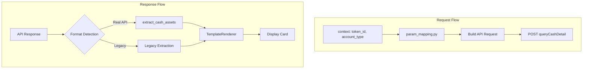

# Cash Assets API 集成计划

## 概述

本计划旨在将真实的现金资产 API 集成到证券智能体中，参照 account_overview 的重构模式，包括：
1. 更新 mock 数据格式为真实 API 格式
2. 实现参数映射配置
3. 创建字段提取配置用于 display_card
4. 更新 Schema 和 TemplateRenderer

## API 对比分析

### 请求格式对比

| 项目 | account_overview | cash_assets |
|------|------------------|-------------|
| URL | `getMyAllAssetsBy10` | `queryCashDetail` |
| channel | "native" | "native" |
| appName | "AYLCAPP" | "AYLCAPP" |
| tokenId | from context | from context |
| body.accountType | "1" or "2" | "1" or "2" |

**结论**: 请求格式完全一致，可复用参数映射模式。

### 响应格式对比

#### account_overview 响应结构:
```json
{
    "status": 1,
    "results": {
        "accountType": "2",
        "rmb": {
            "totalAssetVal": "333678978.13",
            "cashGainAssetsInfo": {...},
            "mktAssetsInfo": {...},
            "rzrqAssetsInfo": {...}
        }
    }
}
```

#### cash_assets 响应结构:
```json
{
    "status": 1,
    "results": {
        "accountType": "2",
        "rmb": {
            "cashBalance": "100015068.13",
            "available": "99846552.63",
            "avaliableDetail": {
                "drawBalance": "99846552.63",
                "hkStock": null,
                "cashBalanceDetail": {
                    "isSupportFastRedeem": "1",
                    "fundName": "现金宝",
                    "fundCode": "970172",
                    "dayProfit": "200.00",
                    "accuProfit": "10000.00"
                }
            },
            "frozenFundsTotal": "168415.50",
            "frozenFundsDetail": [
                {
                    "name": "stockFreeze",
                    "value": "168415.50",
                    "chineseDesc": "股票交易冻结"
                }
            ],
            "inTransitAssetTotal": null,
            "inTransitAssetDetail": null
        }
    }
}
```

### 字段映射配置

根据 [`docs/cash_holdings_analysis_api.md`](docs/cash_holdings_analysis_api.md:64) 的卡片字段映射:

```python
CASH_ASSETS_FIELD_MAPPING = {
    # 基础字段
    "cash_balance": "results.rmb.cashBalance",           # 现金总额
    "cash_available": "results.rmb.available",           # 可用资金
    "draw_balance": "results.rmb.avaliableDetail.drawBalance",  # 可取资金
    "today_profit": "results.rmb.avaliableDetail.cashBalanceDetail.dayProfit",  # 今日收益
    
    # 扩展字段（可选，用于详细信息展示）
    "account_type": "results.accountType",
    "accu_profit": "results.rmb.avaliableDetail.cashBalanceDetail.accuProfit",  # 累计收益
    "fund_name": "results.rmb.avaliableDetail.cashBalanceDetail.fundName",      # 理财产品名称
    "fund_code": "results.rmb.avaliableDetail.cashBalanceDetail.fundCode",      # 理财产品代码
    "frozen_funds_total": "results.rmb.frozenFundsTotal",   # 冻结资金总额
    "frozen_funds_detail": "results.rmb.frozenFundsDetail", # 冻结资金明细
    "in_transit_asset_total": "results.rmb.inTransitAssetTotal",  # 在途资产总额
    "in_transit_asset_detail": "results.rmb.inTransitAssetDetail", # 在途资产明细
}
```

---

## 问题分析

### 1. 当前 CashAssetsAdapter 问题

**当前代码** ([`service_client.py:237-256`](src/ark_agentic/agents/securities/tools/service_client.py:237)):
```python
class CashAssetsAdapter(BaseServiceAdapter):
    def _normalize_response(self, raw_data, account_type):
        data = raw_data.get("data", {})  # ❌ 错误：真实 API 没有 data 字段
        schema = CashAssetsSchema.from_raw_data(data)
        return schema.model_dump()
```

**问题**: 
- 使用旧格式 `data.get("data", {})` 而真实 API 返回 `results.rmb`
- 未复用 account_overview 的模式

### 2. 当前 CashAssetsSchema 问题

**当前代码** ([`schemas.py:283-299`](src/ark_agentic/agents/securities/schemas.py:283)):
```python
class CashAssetsSchema(BaseModel):
    available_cash: str = Field(..., description="可用资金")
    frozen_cash: str = Field(..., description="冻结资金")
    total_cash: str = Field(..., description="总资金")
```

**问题**: 
- 字段名与真实 API 不匹配
- 缺少 `today_profit`, `draw_balance`, `fund_name` 等字段

### 3. 当前 Mock 数据问题

**当前代码** ([`mock_data/cash_assets/default.json`](src/ark_agentic/agents/securities/mock_data/cash_assets/default.json)):
```json
{
    "code": "0",
    "data": {
        "availableCash": "50000.0",
        "frozenCash": "0.0"
    }
}
```

**问题**: 格式与真实 API 完全不同。

### 4. 当前 cash_assets.py Tool 问题

**当前代码** ([`cash_assets.py:45-49`](src/ark_agentic/agents/securities/tools/cash_assets.py:45)):
```python
data = await self._adapter.call(
    account_type=account_type,
    user_id=user_id,
    # ❌ 缺少 _context 参数传递
)
```

**问题**: 未传递 `_context` 给 adapter，导致无法获取 `token_id`。

### 5. 缺少字段提取配置

当前 [`field_extraction.py`](src/ark_agentic/agents/securities/tools/field_extraction.py) 只有 `account_overview` 的配置，缺少 `cash_assets`。

### 6. 缺少参数映射配置

当前 [`param_mapping.py`](src/ark_agentic/agents/securities/tools/param_mapping.py) 只有 `account_overview` 的配置。

---

## 实现方案

### 架构设计



### 文件变更清单

| 文件 | 变更类型 | 说明 |
|------|----------|------|
| `tools/param_mapping.py` | 修改 | 添加 `CASH_ASSETS_PARAM_CONFIG` |
| `tools/field_extraction.py` | 修改 | 添加 `CASH_ASSETS_FIELD_MAPPING` 和 `extract_cash_assets()` |
| `tools/service_client.py` | 修改 | 重构 `CashAssetsAdapter` |
| `tools/cash_assets.py` | 修改 | 传递 `_context` 参数 |
| `mock_data/cash_assets/default.json` | 修改 | 更新为真实 API 格式 |
| `mock_data/cash_assets/normal_user.json` | 新建 | 普通账户 mock 数据 |
| `mock_data/cash_assets/margin_user.json` | 新建 | 两融账户 mock 数据 |
| `schemas.py` | 修改 | 更新 `CashAssetsSchema` |
| `template_renderer.py` | 修改 | 更新 `render_cash_assets_card()` |
| `tools/display_card.py` | 修改 | 添加 `cash_assets` 字段提取调用 |

---

## 详细实现步骤

### 步骤 1: 更新 param_mapping.py

在 [`SERVICE_PARAM_CONFIGS`](src/ark_agentic/agents/securities/tools/param_mapping.py:139) 中添加:

```python
# 现金资产 API 参数配置
CASH_ASSETS_PARAM_CONFIG: dict[str, tuple] = {
    "channel": ("static", "native"),
    "appName": ("static", "AYLCAPP"),
    "tokenId": ("context", "token_id"),
    "body.accountType": (
        "transform",
        "account_type",
        lambda x: "2" if x == "margin" else "1",
    ),
}

SERVICE_PARAM_CONFIGS = {
    "account_overview": ACCOUNT_OVERVIEW_PARAM_CONFIG,
    "cash_assets": CASH_ASSETS_PARAM_CONFIG,  # 新增
}
```

### 步骤 2: 更新 field_extraction.py

添加现金资产字段映射和提取函数:

```python
# ============ 现金资产字段映射 ============

CASH_ASSETS_FIELD_MAPPING: dict[str, str] = {
    # 显示字段名 -> API 响应路径
    "account_type": "results.accountType",
    "cash_balance": "results.rmb.cashBalance",
    "cash_available": "results.rmb.available",
    "draw_balance": "results.rmb.avaliableDetail.drawBalance",
    "today_profit": "results.rmb.avaliableDetail.cashBalanceDetail.dayProfit",
    "accu_profit": "results.rmb.avaliableDetail.cashBalanceDetail.accuProfit",
    "fund_name": "results.rmb.avaliableDetail.cashBalanceDetail.fundName",
    "fund_code": "results.rmb.avaliableDetail.cashBalanceDetail.fundCode",
    "frozen_funds_total": "results.rmb.frozenFundsTotal",
    "frozen_funds_detail": "results.rmb.frozenFundsDetail",
    "in_transit_asset_total": "results.rmb.inTransitAssetTotal",
    "in_transit_asset_detail": "results.rmb.inTransitAssetDetail",
}

# 旧格式字段映射（向后兼容）
CASH_ASSETS_LEGACY_MAPPING: dict[str, str] = {
    "available_cash": "data.availableCash",
    "frozen_cash": "data.frozenCash",
    "total_cash": "data.totalCash",
    "update_time": "data.updateTime",
}


def extract_cash_assets(data: dict[str, Any]) -> dict[str, Any]:
    """提取现金资产字段（自动检测格式）"""
    # 检测真实 API 格式
    if "results" in data and isinstance(data.get("results"), dict):
        results = data["results"]
        if "rmb" in results and isinstance(results.get("rmb"), dict):
            return extract_fields(data, CASH_ASSETS_FIELD_MAPPING)
    
    # 使用旧格式
    return extract_fields(data, CASH_ASSETS_LEGACY_MAPPING)


def extract_service_fields(service_name: str, data: dict[str, Any]) -> dict[str, Any]:
    """提取指定服务的字段（自动检测格式）"""
    if service_name == "account_overview":
        return extract_account_overview(data)
    if service_name == "cash_assets":
        return extract_cash_assets(data)
    
    return data
```

### 步骤 3: 重构 CashAssetsAdapter

修改 [`service_client.py`](src/ark_agentic/agents/securities/tools/service_client.py:237):

```python
class CashAssetsAdapter(BaseServiceAdapter):
    """现金资产服务适配器
    
    使用真实 API 格式：
    - 请求体: {"channel": "native", "appName": "AYLCAPP", "tokenId": "xxx", "body": {"accountType": "1"}}
    - 响应体: {"status": 1, "results": {"rmb": {...}}}
    """
    
    def _build_request(
        self,
        account_type: str,
        user_id: str,
        params: dict[str, Any],
    ) -> tuple[dict[str, str], dict[str, Any]]:
        """构建请求（使用参数映射配置）"""
        from .param_mapping import build_api_request, SERVICE_PARAM_CONFIGS
        
        context = params.get("_context", {})
        if "account_type" not in context:
            context = {**context, "account_type": account_type}
        
        config = SERVICE_PARAM_CONFIGS.get("cash_assets", {})
        body = build_api_request(config, context)
        
        headers = {"Content-Type": "application/json"}
        
        if self.config.auth_type == "header" and self.config.auth_value:
            headers[self.config.auth_key] = self.config.auth_value
        
        return headers, body
    
    def _normalize_response(
        self,
        raw_data: dict[str, Any],
        account_type: str,
    ) -> dict[str, Any]:
        """返回原始数据，不做标准化（由 display_card 处理字段提取）"""
        if raw_data.get("status") != 1:
            error_msg = raw_data.get("errmsg") or "Unknown API error"
            raise ServiceError(f"API returned error: {error_msg}")
        
        return raw_data
```

### 步骤 4: 更新 cash_assets.py Tool

修改 [`cash_assets.py`](src/ark_agentic/agents/securities/tools/cash_assets.py):

```python
async def execute(
    self,
    tool_call: ToolCall,
    context: dict[str, Any] | None = None,
) -> AgentToolResult:
    args = tool_call.arguments
    context = context or {}
    
    # 上下文中的参数优先级高于 args
    args.update(context)
    
    # 从扁平 context 获取业务参数
    account_type = args.get("account_type") or context.get("account_type", "normal")
    user_id = context.get("user_id", "U001")
    
    try:
        # 传递完整 context 给 adapter（用于参数映射）
        data = await self._adapter.call(
            account_type=account_type,
            user_id=user_id,
            _context=context,  # 传递完整上下文
        )
        
        return AgentToolResult.json_result(
            tool_call_id=tool_call.id,
            data=data,
        )
    except Exception as e:
        return AgentToolResult.error_result(
            tool_call_id=tool_call.id,
            error=str(e),
        )
```

### 步骤 5: 更新 Mock 数据

#### 创建 `mock_data/cash_assets/normal_user.json`:

```json
{
    "actionAuth": null,
    "status": 1,
    "errmsg": null,
    "requestid": "MOCK_cash_normal_001",
    "results": {
        "accountType": "1",
        "rmb": {
            "cashBalance": "50000.00",
            "available": "48000.00",
            "avaliableDetail": {
                "drawBalance": "45000.00",
                "hkStock": null,
                "cashBalanceDetail": {
                    "isSupportFastRedeem": "1",
                    "fundName": "现金宝",
                    "fundCode": "970172",
                    "dayProfit": "15.50",
                    "accuProfit": "1250.00"
                }
            },
            "otdFundsTotal": null,
            "otdFundsDetail": null,
            "frozenFundsTotal": "2000.00",
            "frozenFundsDetail": [
                {
                    "name": "stockFreeze",
                    "value": "2000.00",
                    "chineseDesc": "股票交易冻结"
                }
            ],
            "inTransitAssetTotal": null,
            "inTransitAssetDetail": null
        }
    }
}
```

#### 创建 `mock_data/cash_assets/margin_user.json`:

```json
{
    "actionAuth": null,
    "status": 1,
    "errmsg": null,
    "requestid": "MOCK_cash_margin_001",
    "results": {
        "accountType": "2",
        "rmb": {
            "cashBalance": "100015068.13",
            "available": "99846552.63",
            "avaliableDetail": {
                "drawBalance": "99846552.63",
                "hkStock": null,
                "cashBalanceDetail": {
                    "isSupportFastRedeem": "1",
                    "fundName": "现金宝",
                    "fundCode": "970172",
                    "dayProfit": "200.00",
                    "accuProfit": "10000.00"
                }
            },
            "otdFundsTotal": null,
            "otdFundsDetail": null,
            "frozenFundsTotal": "168415.50",
            "frozenFundsDetail": [
                {
                    "name": "stockFreeze",
                    "value": "168415.50",
                    "chineseDesc": "股票交易冻结"
                }
            ],
            "inTransitAssetTotal": null,
            "inTransitAssetDetail": null
        }
    }
}
```

### 步骤 6: 更新 CashAssetsSchema

修改 [`schemas.py`](src/ark_agentic/agents/securities/schemas.py:283):

```python
class CashAssetsSchema(BaseModel):
    """现金资产标准模型
    
    支持两种数据来源：
    1. from_raw_data: 从旧格式/mock 数据创建
    2. from_api_response: 从真实 API 响应创建（通过字段提取后的数据）
    """
    
    # 基础字段
    cash_balance: str = Field(..., description="现金总额")
    cash_available: str = Field(..., description="可用资金")
    draw_balance: str | None = Field(None, description="可取资金")
    today_profit: str | None = Field(None, description="今日收益")
    
    # 扩展字段
    account_type: str | None = Field(None, description="账户类型")
    accu_profit: str | None = Field(None, description="累计收益")
    fund_name: str | None = Field(None, description="理财产品名称")
    fund_code: str | None = Field(None, description="理财产品代码")
    frozen_funds_total: str | None = Field(None, description="冻结资金总额")
    frozen_funds_detail: list[dict] | None = Field(None, description="冻结资金明细")
    in_transit_asset_total: str | None = Field(None, description="在途资产总额")
    in_transit_asset_detail: Any = Field(None, description="在途资产明细")
    
    # 兼容旧字段
    available_cash: str | None = Field(None, description="可用资金（兼容）")
    frozen_cash: str | None = Field(None, description="冻结资金（兼容）")
    total_cash: str | None = Field(None, description="总资金（兼容）")
    update_time: str | None = Field(None, description="更新时间")
    
    model_config = {"populate_by_name": True}
    
    @classmethod
    def from_raw_data(cls, data: dict) -> CashAssetsSchema:
        """从原始数据创建（支持多种字段名）"""
        return cls(
            cash_balance=get_val(data, "cashBalance", "cash_balance", "totalCash", "total_cash"),
            cash_available=get_val(data, "available", "cash_available", "availableCash"),
            draw_balance=get_val(data, "drawBalance", "draw_balance"),
            today_profit=get_val(data, "dayProfit", "today_profit"),
            available_cash=get_val(data, "availableCash", "available_cash"),
            frozen_cash=get_val(data, "frozenCash", "frozen_cash"),
            total_cash=get_val(data, "totalCash", "total_cash"),
            update_time=get_val(data, "updateTime", "update_time"),
        )
    
    @classmethod
    def from_api_response(cls, data: dict) -> CashAssetsSchema:
        """从真实 API 响应创建（通过字段提取后的数据）"""
        return cls(
            cash_balance=data.get("cash_balance", "0"),
            cash_available=data.get("cash_available", "0"),
            draw_balance=data.get("draw_balance"),
            today_profit=data.get("today_profit"),
            account_type=data.get("account_type"),
            accu_profit=data.get("accu_profit"),
            fund_name=data.get("fund_name"),
            fund_code=data.get("fund_code"),
            frozen_funds_total=data.get("frozen_funds_total"),
            frozen_funds_detail=data.get("frozen_funds_detail"),
            in_transit_asset_total=data.get("in_transit_asset_total"),
            in_transit_asset_detail=data.get("in_transit_asset_detail"),
        )
```

### 步骤 7: 更新 TemplateRenderer

修改 [`template_renderer.py`](src/ark_agentic/agents/securities/template_renderer.py:72):

```python
@staticmethod
def render_cash_assets_card(data: dict[str, Any]) -> dict[str, Any]:
    """渲染现金资产卡片
    
    支持的字段（来自真实 API 响应提取）：
    - cash_balance: 现金总额
    - cash_available: 可用资金
    - draw_balance: 可取资金
    - today_profit: 今日收益
    - accu_profit: 累计收益
    - fund_name: 理财产品名称
    - frozen_funds_total: 冻结资金总额
    - frozen_funds_detail: 冻结资金明细列表
    """
    return {
        "template_type": "cash_assets_card",
        "data": {
            # 基础字段
            "cash_balance": data.get("cash_balance"),
            "cash_available": data.get("cash_available"),
            "draw_balance": data.get("draw_balance"),
            "today_profit": data.get("today_profit"),
            # 扩展字段
            "accu_profit": data.get("accu_profit"),
            "fund_name": data.get("fund_name"),
            "fund_code": data.get("fund_code"),
            "frozen_funds_total": data.get("frozen_funds_total"),
            "frozen_funds_detail": data.get("frozen_funds_detail"),
            "in_transit_asset_total": data.get("in_transit_asset_total"),
            # 兼容旧字段
            "available_cash": data.get("available_cash") or data.get("cash_available"),
            "frozen_cash": data.get("frozen_cash") or data.get("frozen_funds_total"),
            "total_cash": data.get("total_cash") or data.get("cash_balance"),
            "update_time": data.get("update_time"),
        }
    }
```

### 步骤 8: 更新 display_card.py

修改 [`display_card.py`](src/ark_agentic/agents/securities/tools/display_card.py:114):

```python
from .field_extraction import extract_account_overview, extract_cash_assets

# ... 在 execute 方法中 ...

elif render_type == "cash_assets":
    # 使用字段提取工具从 API 响应中提取显示字段
    extracted_data = extract_cash_assets(data)
    template = TemplateRenderer.render_cash_assets_card(extracted_data)
```

### 步骤 9: 更新 MockServiceAdapter

修改 [`service_client.py`](src/ark_agentic/agents/securities/tools/service_client.py:298) 中的场景选择逻辑:

```python
async def call(self, account_type: str, user_id: str, **params) -> dict[str, Any]:
    """从文件加载 Mock 数据"""
    
    # 根据账户类型选择场景
    scenario = "default"
    if self.service_name == "account_overview":
        scenario = "margin_user" if account_type == "margin" else "normal_user"
    elif self.service_name == "cash_assets":
        scenario = "margin_user" if account_type == "margin" else "normal_user"
    
    # 加载数据
    raw_data = self._loader.load(
        service_name=self.service_name,
        scenario=scenario,
        **params,
    )
    
    return self._normalize_response(raw_data, account_type)
```

---

## 测试计划

### 单元测试

1. **test_param_mapping.py**
   - 测试 `CASH_ASSETS_PARAM_CONFIG` 构建正确的请求体
   - 测试 account_type 转换 (normal -> "1", margin -> "2")

2. **test_field_extraction.py**
   - 测试真实 API 格式的字段提取
   - 测试旧格式的字段提取
   - 测试格式自动检测

### 集成测试

1. **Mock 模式测试**
   - 普通账户 cash_assets 查询
   - 两融账户 cash_assets 查询
   - display_card 渲染正确

2. **完整流程测试**
   - 从 context 获取 token_id
   - 请求构建
   - 响应解析
   - 卡片渲染

---

## 实施顺序

1. [ ] 更新 `param_mapping.py` - 添加参数映射配置
2. [ ] 更新 `field_extraction.py` - 添加字段提取配置
3. [ ] 更新 `schemas.py` - 重构 CashAssetsSchema
4. [ ] 更新 `service_client.py` - 重构 CashAssetsAdapter
5. [ ] 更新 `cash_assets.py` - 传递 _context 参数
6. [ ] 创建 mock 数据文件 - normal_user.json, margin_user.json
7. [ ] 更新 `template_renderer.py` - 更新渲染方法
8. [ ] 更新 `display_card.py` - 添加字段提取调用
9. [ ] 编写测试用例
10. [ ] 运行测试验证

---

## 准备就绪

本计划已完成设计，与 account_overview 的重构模式保持一致。确认后可切换到 **Code** 模式开始实施代码修改。