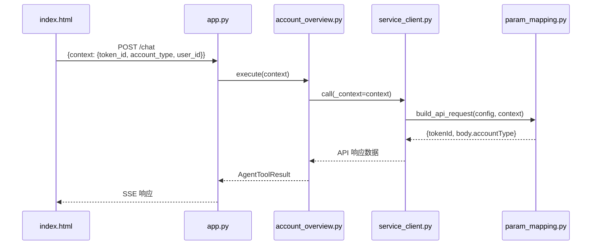

# Context 扁平结构修复计划

## 问题背景

### 当前问题
1. `param_mapping.py` 期望 context 结构为 `{"args": {"token_id": "xxx", ...}}`
2. 前端和后端实际传递的是扁平结构 `{"token_id": "xxx", "account_type": "normal"}`
3. 前端没有传入 `token_id`，但真实 API 需要此参数

### 解决方案
- 保持 context 扁平结构
- 修改 param_mapping.py 去掉 args 层
- 前端添加 token_id 传入

---

## 修改计划

### 1. 前端 index.html 修改

**文件**: `src/ark_agentic/static/index.html`

**修改内容**:
1. 添加 token_id 存储（模拟登录后的 token）
2. 在请求 context 中添加 token_id

```javascript
// 状态变量（约第 1072 行附近）
let tokenId = sessionStorage.getItem('ark_token_id') || 'MOCK_TOKEN_001';  // 模拟 token

// 请求 payload 构建（约第 1235 行附近）
const payload = {
  message: text,
  stream: isStreaming,
  agent_id: selectedAgent,
  user_id: selectedUserId,
  context: {
    user_id: selectedUserId,
    token_id: tokenId,  // 添加 token_id
    ...(selectedAgent === 'securities' ? { account_type: selectedAccountType } : {})
  },
};
```

---

### 2. param_mapping.py 修改

**文件**: `src/ark_agentic/agents/securities/tools/param_mapping.py`

**修改内容**:
将 `"args.token_id"` 改为 `"token_id"`，去掉 args 前缀

```python
# 修改前
ACCOUNT_OVERVIEW_PARAM_CONFIG: dict[str, tuple] = {
    "channel": ("static", "native"),
    "appName": ("static", "AYLCAPP"),
    "tokenId": ("context", "args.token_id"),  # 旧格式
    "body.accountType": (
        "transform",
        "args.account_type",  # 旧格式
        lambda x: "2" if x == "margin" else "1",
    ),
}

# 修改后
ACCOUNT_OVERVIEW_PARAM_CONFIG: dict[str, tuple] = {
    "channel": ("static", "native"),
    "appName": ("static", "AYLCAPP"),
    "tokenId": ("context", "token_id"),  # 扁平结构
    "body.accountType": (
        "transform",
        "account_type",  # 扁平结构
        lambda x: "2" if x == "margin" else "1",
    ),
}
```

---

### 3. service_client.py 修改

**文件**: `src/ark_agentic/agents/securities/tools/service_client.py`

**修改内容**:
`AccountOverviewAdapter._build_request()` 方法中移除 args 层处理逻辑

```python
# 修改前（约第 134-141 行）
context = params.get("_context", {})

# 确保 context.args 中有 account_type
if "args" not in context:
    context["args"] = {}
if "account_type" not in context["args"]:
    context["args"]["account_type"] = account_type

# 修改后
context = params.get("_context", {})

# 确保扁平结构中有 account_type
if "account_type" not in context:
    context["account_type"] = account_type
```

---

### 4. account_overview.py 修改

**文件**: `src/ark_agentic/agents/securities/tools/account_overview.py`

**修改内容**:
从扁平 context 获取参数

```python
# 修改前（约第 47-51 行）
context_args = context.get("args", {})
account_type = args.get("account_type") or context_args.get("account_type", "normal")

# 修改后
account_type = args.get("account_type") or context.get("account_type", "normal")
```

---

### 5. 测试用例修改

**文件**: `tests/agents/securities/test_param_mapping.py`

**修改内容**:
更新测试数据为扁平结构

```python
# 修改前
context = {"args": {"token_id": "test_token", "account_type": "normal"}}

# 修改后
context = {"token_id": "test_token", "account_type": "normal"}
```

---

### 6. README.md 更新

更新文档说明 context 的扁平结构设计

---

## Context 结构规范

### 最终设计

```json
{
  "user_id": "U001",
  "token_id": "N_4ABD52CE290DD385...",
  "account_type": "normal",
  "trace_id": "xxx"
}
```

### 字段说明

| 字段 | 类型 | 来源 | 说明 |
|------|------|------|------|
| user_id | string | 前端/后端 | 用户 ID |
| token_id | string | 前端 | 登录令牌（调用真实 API 必需） |
| account_type | string | 前端 | 账户类型：normal/margin |
| trace_id | string | 后端 | 链路追踪 ID |

---

## 数据流程图



---

## 验证检查清单

- [ ] 前端请求包含 token_id
- [ ] param_mapping.py 使用扁平路径
- [ ] service_client.py 适配扁平结构
- [ ] account_overview.py 从扁平 context 获取参数
- [ ] 测试用例通过
- [ ] Mock 模式正常工作
- [ ] 真实 API 调用正常（需要真实 token）