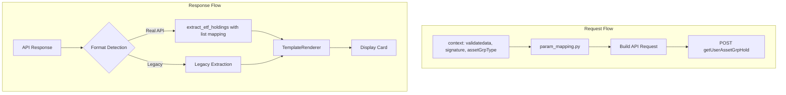

# ETF Holdings API 集成计划

## 概述

本计划旨在将真实的 ETF 持仓 API 集成到证券智能体中，参照 cash_assets 的重构模式，包括：
1. 更新 mock 数据格式为真实 API 格式
2. 实现参数映射配置
3. 创建字段提取配置用于 display_card（支持列表映射）
4. 更新 Schema 和 TemplateRenderer

## API 对比分析

### 请求格式

| 项目 | account_overview/cash_assets | etf_holdings |
|------|------------------------------|--------------|
| URL | `getMyAllAssetsBy10` / `queryCashDetail` | `getUserAssetGrpHold` |
| Body 参数 | `channel`, `appName`, `tokenId`, `body.accountType` | `assetGrpType`, `appName`, `limit` |
| Headers | `Content-Type` | `Content-Type`, `validatedata`, `signature` |
| account_type 区分 | 是（"1" 或 "2"） | 否（统一查询） |

**关键差异**:
- ETF API 使用不同的请求体结构（无 `tokenId`，使用 `assetGrpType`）
- ETF API 需要特殊的 headers：`validatedata` 和 `signature`
- ETF API 不区分普通账户和两融账户

### 请求示例

```python
url = "http://100.25.123.123/ais/userasset/acct/service/getUserAssetGrpHold"

payload = json.dumps({
    "assetGrpType": 7,      # configurable value
    "appName": "AYLCAPP",   # fixed value
    "limit": 20             # configurable value
})

headers = {
    'Content-Type': 'application/json',
    'validatedata': 'channel=REST&usercode=150573383&userid=12977997&account=3310123&branchno=3310&loginflag=3&mobileNo=137123123',
    'signature': '/bzp123='
}
```

### 响应格式

```json
{
    "results": {
        "total": 3,
        "dayTotalMktVal": 514.90,
        "dayTotalPft": "-27.80",
        "stockList": [
            {
                "statDate": 20260213,
                "secuCode": "159958",
                "secuName": "创业板ETF工银",
                "marketType": "SZ",
                "price": "1.918",
                "holdCnt": "100",
                "mktVal": "191.80",
                "costPrice": "1.8850",
                "dayPft": "-8.80",
                "dayPftRate": "-0.0439",
                "holdPositionPft": "3.30",
                "holdPositionPftRate": "0.0175",
                "secuAcc": "0276525016",
                "exchangeType": "2",
                "position": 0.0000
            }
        ],
        "accountType": 1,
        "dayTotalPftRate": -0.0512
    },
    "err": 0,
    "msg": "getUserAssetPftFromNtc_success",
    "status": 1
}
```

### 卡片字段映射

根据 API 文档，ETF 卡片包含列表数据，映射关系如下：

```json
{
    "total_market_value": "results.dayTotalMktVal",
    "total_profit": "results.dayTotalPft",
    "stock_list": {
        "list_mapping": "results.stockList",
        "field_mapping": {
            "code": "secuCode",
            "name": "secuName",
            "hold_cnt": "holdCnt",
            "market_value": "mktVal",
            "day_profit": "dayPft",
            "day_profit_rate": "dayPftRate"
        }
    }
}
```

---

## 问题分析

### 1. 当前 ETFHoldingsAdapter 问题

**当前代码** ([`service_client.py:171-191`](src/ark_agentic/agents/securities/tools/service_client.py:171)):
```python
class ETFHoldingsAdapter(BaseServiceAdapter):
    def _normalize_response(self, raw_data, account_type):
        data = raw_data.get("data", {})  # ❌ 错误：真实 API 没有 data 字段
        schema = ETFHoldingsSchema.from_raw_data(data)
        return schema.model_dump()
```

**问题**: 
- 使用旧格式 `data.get("data", {})` 而真实 API 返回 `results.stockList`
- 未实现 `_build_request` 方法，无法构建正确的请求
- 未复用参数映射模式

### 2. 当前 ETFHoldingsSchema 问题

**当前代码** ([`schemas.py:192-207`](src/ark_agentic/agents/securities/schemas.py:192)):
```python
class ETFHoldingsSchema(BaseModel):
    holdings: list[HoldingItemSchema]
    summary: HoldingsSummarySchema
```

**问题**: 
- 字段结构与真实 API 不匹配（真实 API 使用 `stockList`，无 `summary`）
- 缺少 `dayTotalPftRate`、`total` 等字段
- `HoldingItemSchema` 字段名与真实 API 不匹配

### 3. 当前 Mock 数据问题

**当前代码** ([`mock_data/etf_holdings/default.json`](src/ark_agentic/agents/securities/mock_data/etf_holdings/default.json)):
```json
{
    "code": "0",
    "message": "success",
    "data": {
        "holdings": [...],
        "summary": {...}
    }
}
```

**问题**: 格式与真实 API 完全不同。

### 4. 当前 etf_holdings.py Tool 问题

**当前代码** ([`etf_holdings.py:45-49`](src/ark_agentic/agents/securities/tools/etf_holdings.py:45)):
```python
data = await self._adapter.call(
    account_type=account_type,
    user_id=user_id,
    # ❌ 缺少 _context 参数传递
)
```

**问题**: 未传递 `_context` 给 adapter，导致无法获取 `validatedata` 和 `signature`。

### 5. 缺少字段提取配置

当前 [`field_extraction.py`](src/ark_agentic/agents/securities/tools/field_extraction.py) 没有 `etf_holdings` 的配置，且需要支持**列表字段映射**。

### 6. 缺少参数映射配置

当前 [`param_mapping.py`](src/ark_agentic/agents/securities/tools/param_mapping.py) 没有 `etf_holdings` 的配置。

---

## 实现方案

### 架构设计



### 文件变更清单

| 文件 | 变更类型 | 说明 |
|------|----------|------|
| `tools/param_mapping.py` | 修改 | 添加 `ETF_HOLDINGS_PARAM_CONFIG` |
| `tools/field_extraction.py` | 修改 | 添加 `ETF_HOLDINGS_FIELD_MAPPING` 和 `extract_etf_holdings()`，支持列表映射 |
| `tools/service_client.py` | 修改 | 重构 `ETFHoldingsAdapter`，支持 header 认证 |
| `tools/etf_holdings.py` | 修改 | 传递 `_context` 参数 |
| `mock_data/etf_holdings/default.json` | 修改 | 更新为真实 API 格式 |
| `schemas.py` | 修改 | 更新 `ETFHoldingsSchema` 和 `ETFHoldingItemSchema` |
| `template_renderer.py` | 修改 | 更新 `render_holdings_list_card()` 支持 ETF 数据格式 |
| `tools/display_card.py` | 修改 | 添加 `etf_holdings` 字段提取调用 |

---

## 详细实现步骤

### 步骤 1: 更新 param_mapping.py

在 [`SERVICE_PARAM_CONFIGS`](src/ark_agentic/agents/securities/tools/param_mapping.py:153) 中添加:

```python
# ETF 持仓 API 参数配置
# 注意：ETF API 请求体结构与 account_overview 不同
ETF_HOLDINGS_PARAM_CONFIG: dict[str, tuple] = {
    # Body 参数
    "assetGrpType": ("context", "asset_grp_type", lambda x: x if x else 7),  # 默认 7 表示 ETF
    "appName": ("static", "AYLCAPP"),
    "limit": ("context", "limit", lambda x: x if x else 20),  # 默认 20 条
}

# Header 参数配置（ETF 专用）
ETF_HOLDINGS_HEADER_CONFIG: dict[str, tuple] = {
    "validatedata": ("context", "validatedata"),  # 从 context 获取
    "signature": ("context", "signature"),         # 从 context 获取
}

SERVICE_PARAM_CONFIGS = {
    "account_overview": ACCOUNT_OVERVIEW_PARAM_CONFIG,
    "cash_assets": CASH_ASSETS_PARAM_CONFIG,
    "etf_holdings": ETF_HOLDINGS_PARAM_CONFIG,  # 新增
}
```

### 步骤 2: 更新 field_extraction.py

添加 ETF 字段映射和提取函数，**支持列表映射**:

```python
# ============ ETF 持仓字段映射 ============

# 汇总字段映射
ETF_HOLDINGS_FIELD_MAPPING: dict[str, str] = {
    "total": "results.total",
    "total_market_value": "results.dayTotalMktVal",
    "total_profit": "results.dayTotalPft",
    "total_profit_rate": "results.dayTotalPftRate",
    "account_type": "results.accountType",
}

# 列表项字段映射
ETF_HOLDINGS_ITEM_MAPPING: dict[str, str] = {
    "code": "secuCode",
    "name": "secuName",
    "hold_cnt": "holdCnt",
    "market_value": "mktVal",
    "day_profit": "dayPft",
    "day_profit_rate": "dayPftRate",
    "price": "price",
    "cost_price": "costPrice",
    "market_type": "marketType",
    "hold_position_profit": "holdPositionPft",
    "hold_position_profit_rate": "holdPositionPftRate",
}

# 旧格式字段映射（向后兼容）
ETF_HOLDINGS_LEGACY_MAPPING: dict[str, str] = {
    "holdings": "data.holdings",
    "summary": "data.summary",
}


def extract_list_items(
    items: list[dict[str, Any]],
    field_mapping: dict[str, str],
) -> list[dict[str, Any]]:
    """提取列表项字段
    
    Args:
        items: 原始列表数据
        field_mapping: 字段映射 {显示名: API字段名}
    
    Returns:
        提取后的列表数据
    """
    result = []
    for item in items:
        extracted = {}
        for display_name, api_field in field_mapping.items():
            value = item.get(api_field)
            if value is not None:
                extracted[display_name] = value
        result.append(extracted)
    return result


def extract_etf_holdings(data: dict[str, Any]) -> dict[str, Any]:
    """提取 ETF 持仓字段（自动检测格式）
    
    支持列表字段映射。
    """
    # 检测真实 API 格式：有 results.stockList 结构
    if "results" in data and isinstance(data.get("results"), dict):
        results = data["results"]
        if "stockList" in results and isinstance(results.get("stockList"), list):
            # 提取汇总字段
            extracted = extract_fields(data, ETF_HOLDINGS_FIELD_MAPPING)
            # 提取列表字段
            stock_list = results["stockList"]
            extracted["stock_list"] = extract_list_items(stock_list, ETF_HOLDINGS_ITEM_MAPPING)
            return extracted
    
    # 使用旧格式
    return extract_fields(data, ETF_HOLDINGS_LEGACY_MAPPING)


def extract_service_fields(service_name: str, data: dict[str, Any]) -> dict[str, Any]:
    """提取指定服务的字段（自动检测格式）"""
    if service_name == "account_overview":
        return extract_account_overview(data)
    if service_name == "cash_assets":
        return extract_cash_assets(data)
    if service_name == "etf_holdings":
        return extract_etf_holdings(data)
    
    return data
```

### 步骤 3: 重构 ETFHoldingsAdapter

修改 [`service_client.py`](src/ark_agentic/agents/securities/tools/service_client.py:171):

```python
class ETFHoldingsAdapter(BaseServiceAdapter):
    """ETF 持仓服务适配器
    
    使用真实 API 格式：
    - 请求体: {"assetGrpType": 7, "appName": "AYLCAPP", "limit": 20}
    - Headers: {"Content-Type": "application/json", "validatedata": "...", "signature": "..."}
    - 响应体: {"status": 1, "results": {"stockList": [...]}}
    """
    
    def _build_request(
        self,
        account_type: str,
        user_id: str,
        params: dict[str, Any],
    ) -> tuple[dict[str, str], dict[str, Any]]:
        """构建请求（使用参数映射配置）"""
        from .param_mapping import build_api_request, SERVICE_PARAM_CONFIGS, ETF_HOLDINGS_HEADER_CONFIG
        
        context = params.get("_context", {})
        
        # 使用参数映射构建请求体
        config = SERVICE_PARAM_CONFIGS.get("etf_holdings", {})
        body = build_api_request(config, context)
        
        # 构建 headers（包含 validatedata 和 signature）
        headers = {"Content-Type": "application/json"}
        
        # 从 context 获取认证 headers
        if "validatedata" in context:
            headers["validatedata"] = context["validatedata"]
        if "signature" in context:
            headers["signature"] = context["signature"]
        
        # 添加配置的认证（如果有的话）
        if self.config.auth_type == "header" and self.config.auth_value:
            headers[self.config.auth_key] = self.config.auth_value
        
        return headers, body
    
    def _normalize_response(
        self,
        raw_data: dict[str, Any],
        account_type: str,
    ) -> dict[str, Any]:
        """返回原始数据，不做标准化（由 display_card 处理字段提取）"""
        # 检查 API 响应状态
        if raw_data.get("status") != 1:
            error_msg = raw_data.get("msg") or "Unknown API error"
            raise ServiceError(f"API returned error: {error_msg}")
        
        # 返回原始数据，字段提取由 display_card 工具完成
        return raw_data
```

### 步骤 4: 更新 etf_holdings.py Tool

修改 [`etf_holdings.py`](src/ark_agentic/agents/securities/tools/etf_holdings.py):

```python
async def execute(
    self,
    tool_call: ToolCall,
    context: dict[str, Any] | None = None,
) -> AgentToolResult:
    args = tool_call.arguments
    context = context or {}
    
    # 上下文中的参数优先级高于 args
    args.update(context)
    
    # ETF 不区分账户类型，但仍保留参数兼容
    account_type = args.get("account_type") or context.get("account_type", "normal")
    user_id = context.get("user_id", "U001")
    
    try:
        # 传递完整 context 给 adapter（用于参数映射和 header 认证）
        data = await self._adapter.call(
            account_type=account_type,
            user_id=user_id,
            _context=context,  # 传递完整上下文
        )
        
        return AgentToolResult.json_result(
            tool_call_id=tool_call.id,
            data=data,
        )
    except Exception as e:
        return AgentToolResult.error_result(
            tool_call_id=tool_call.id,
            error=str(e),
        )
```

### 步骤 5: 更新 Mock 数据

#### 更新 `mock_data/etf_holdings/default.json`:

```json
{
    "results": {
        "total": 3,
        "dayTotalMktVal": 514.90,
        "dayTotalPft": "-27.80",
        "stockList": [
            {
                "statDate": 20260213,
                "secuCode": "159958",
                "secuName": "创业板ETF工银",
                "marketType": "SZ",
                "price": "1.918",
                "holdCnt": "100",
                "mktVal": "191.80",
                "costPrice": "1.8850",
                "dayPft": "-8.80",
                "dayPftRate": "-0.0439",
                "holdPositionPft": "3.30",
                "holdPositionPftRate": "0.0175",
                "secuAcc": "0276525016",
                "exchangeType": "2",
                "position": 0.0000
            },
            {
                "statDate": 20260213,
                "secuCode": "158459",
                "secuName": "消费电子ETF",
                "marketType": "SZ",
                "price": "1.318",
                "holdCnt": "500",
                "mktVal": "42.80",
                "costPrice": "1.8850",
                "dayPft": "10.80",
                "dayPftRate": "0.0439",
                "holdPositionPft": "3.30",
                "holdPositionPftRate": "0.0175",
                "secuAcc": "0276525016",
                "exchangeType": "2",
                "position": 0.0000
            },
            {
                "statDate": 20260213,
                "secuCode": "159391",
                "secuName": "大盘价值ETF博时",
                "marketType": "SZ",
                "price": "1.012",
                "holdCnt": "300",
                "mktVal": "391.80",
                "costPrice": "1.8850",
                "dayPft": "11.80",
                "dayPftRate": "0.0439",
                "holdPositionPft": "3.30",
                "holdPositionPftRate": "0.0175",
                "secuAcc": "0276525016",
                "exchangeType": "2",
                "position": 0.0000
            }
        ],
        "accountType": 1,
        "dayTotalPftRate": -0.0512
    },
    "err": 0,
    "msg": "getUserAssetPftFromNtc_success",
    "status": 1
}
```

### 步骤 6: 更新 ETFHoldingsSchema

修改 [`schemas.py`](src/ark_agentic/agents/securities/schemas.py:192):

```python
# ============ ETF 持仓（真实 API 格式）============

class ETFHoldingItemSchema(BaseModel):
    """ETF 持仓项（真实 API 格式）"""
    
    code: str = Field(..., description="证券代码")
    name: str = Field(..., description="证券名称")
    hold_cnt: str = Field(..., description="持仓数量")
    market_value: str = Field(..., description="市值")
    day_profit: str | None = Field(None, description="今日收益")
    day_profit_rate: str | None = Field(None, description="今日收益率")
    price: str | None = Field(None, description="当前价格")
    cost_price: str | None = Field(None, description="成本价")
    market_type: str | None = Field(None, description="市场类型")
    hold_position_profit: str | None = Field(None, description="持仓盈亏")
    hold_position_profit_rate: str | None = Field(None, description="持仓盈亏率")
    
    model_config = {"populate_by_name": True}
    
    @classmethod
    def from_api_response(cls, data: dict) -> ETFHoldingItemSchema:
        """从字段提取后的数据创建"""
        return cls(
            code=data.get("code", ""),
            name=data.get("name", ""),
            hold_cnt=data.get("hold_cnt", "0"),
            market_value=data.get("market_value", "0"),
            day_profit=data.get("day_profit"),
            day_profit_rate=data.get("day_profit_rate"),
            price=data.get("price"),
            cost_price=data.get("cost_price"),
            market_type=data.get("market_type"),
            hold_position_profit=data.get("hold_position_profit"),
            hold_position_profit_rate=data.get("hold_position_profit_rate"),
        )


class ETFHoldingsSchema(BaseModel):
    """ETF 持仓完整模型（真实 API 格式）"""
    
    total: int = Field(..., description="持仓数量")
    total_market_value: str = Field(..., description="总市值")
    total_profit: str = Field(..., description="今日总收益")
    total_profit_rate: str | None = Field(None, description="今日收益率")
    account_type: int | None = Field(None, description="账户类型")
    stock_list: list[ETFHoldingItemSchema] = Field(default_factory=list, description="持仓列表")
    
    model_config = {"populate_by_name": True}
    
    @classmethod
    def from_api_response(cls, data: dict) -> ETFHoldingsSchema:
        """从字段提取后的数据创建"""
        stock_list_raw = data.get("stock_list", [])
        return cls(
            total=data.get("total", 0),
            total_market_value=data.get("total_market_value", "0"),
            total_profit=data.get("total_profit", "0"),
            total_profit_rate=data.get("total_profit_rate"),
            account_type=data.get("account_type"),
            stock_list=[ETFHoldingItemSchema.from_api_response(s) for s in stock_list_raw],
        )
    
    @classmethod
    def from_raw_data(cls, data: dict) -> ETFHoldingsSchema:
        """从旧格式数据创建（向后兼容）"""
        holdings_raw = data.get("holdings", [])
        summary_raw = data.get("summary", {})
        
        # 转换旧格式到新格式
        stock_list = []
        for h in holdings_raw:
            stock_list.append({
                "code": get_val(h, "securityCode", "code"),
                "name": get_val(h, "securityName", "name"),
                "hold_cnt": get_val(h, "quantity", "qty"),
                "market_value": get_val(h, "marketValue", "mv"),
                "day_profit": get_val(h, "todayProfit"),
                "price": get_val(h, "currentPrice", "price"),
                "cost_price": get_val(h, "costPrice", "cost"),
            })
        
        return cls(
            total=len(stock_list),
            total_market_value=get_val(summary_raw, "totalMarketValue", "total_mv") or "0",
            total_profit=get_val(summary_raw, "todayProfit", "today_profit") or "0",
            total_profit_rate=get_val(summary_raw, "totalProfitRate"),
            stock_list=[ETFHoldingItemSchema.from_api_response(s) for s in stock_list],
        )
```

### 步骤 7: 更新 TemplateRenderer

修改 [`template_renderer.py`](src/ark_agentic/agents/securities/template_renderer.py:57):

```python
@staticmethod
def render_holdings_list_card(
    asset_class: Literal["ETF", "HKSC", "Fund", "Cash"],
    data: dict[str, Any],
) -> dict[str, Any]:
    """渲染持仓列表卡片
    
    支持两种数据格式：
    1. 真实 API 格式（通过字段提取）: stock_list, total_market_value, total_profit
    2. 旧格式: holdings, summary
    """
    # 检测数据格式
    if "stock_list" in data:
        # 真实 API 格式
        return {
            "template_type": "holdings_list_card",
            "asset_class": asset_class,
            "data": {
                "holdings": data.get("stock_list", []),
                "summary": {
                    "total_market_value": data.get("total_market_value"),
                    "total_profit": data.get("total_profit"),
                    "total_profit_rate": data.get("total_profit_rate"),
                    "total": data.get("total"),
                },
            }
        }
    else:
        # 旧格式
        return {
            "template_type": "holdings_list_card",
            "asset_class": asset_class,
            "data": {
                "holdings": data.get("holdings", []),
                "summary": data.get("summary", {}),
            }
        }
```

### 步骤 8: 更新 display_card.py

修改 [`display_card.py`](src/ark_agentic/agents/securities/tools/display_card.py:107):

```python
from .field_extraction import extract_account_overview, extract_cash_assets, extract_etf_holdings

# ... 在 execute 方法中 ...

if render_type == "holdings_list":
    asset_class = _ASSET_CLASS_MAP[source_tool]
    
    # ETF 使用字段提取工具
    if source_tool == "etf_holdings":
        extracted_data = extract_etf_holdings(data)
        template = TemplateRenderer.render_holdings_list_card(asset_class, extracted_data)
    else:
        # HKSC 和 Fund 暂时使用旧格式
        template = TemplateRenderer.render_holdings_list_card(asset_class, data)
```

### 步骤 9: 更新 MockServiceAdapter

修改 [`service_client.py`](src/ark_agentic/agents/securities/tools/service_client.py:322) 中的场景选择逻辑:

```python
async def call(self, account_type: str, user_id: str, **params) -> dict[str, Any]:
    """从文件加载 Mock 数据"""
    
    # 根据账户类型选择场景
    scenario = "default"
    if self.service_name == "account_overview":
        scenario = "margin_user" if account_type == "margin" else "normal_user"
    elif self.service_name == "cash_assets":
        scenario = "margin_user" if account_type == "margin" else "normal_user"
    elif self.service_name == "etf_holdings":
        scenario = "default"  # ETF 不区分账户类型
    
    # 加载数据
    raw_data = self._loader.load(
        service_name=self.service_name,
        scenario=scenario,
        **params,
    )
    
    return self._normalize_response(raw_data, account_type)
```

---

## 测试计划

### 单元测试

1. **test_param_mapping.py**
   - 测试 `ETF_HOLDINGS_PARAM_CONFIG` 构建正确的请求体
   - 测试 `assetGrpType` 和 `limit` 默认值

2. **test_field_extraction.py**
   - 测试真实 API 格式的字段提取
   - 测试列表字段映射
   - 测试旧格式的字段提取
   - 测试格式自动检测

### 集成测试

1. **Mock 模式测试**
   - ETF 持仓查询
   - display_card 渲染正确
   - 列表数据正确展示

2. **完整流程测试**
   - 从 context 获取 validatedata 和 signature
   - 请求构建
   - 响应解析
   - 卡片渲染

---

## 实施顺序

1. [ ] 更新 `param_mapping.py` - 添加参数映射配置和 header 配置
2. [ ] 更新 `field_extraction.py` - 添加字段提取配置（支持列表映射）
3. [ ] 更新 `schemas.py` - 重构 ETFHoldingsSchema
4. [ ] 更新 `service_client.py` - 重构 ETFHoldingsAdapter
5. [ ] 更新 `etf_holdings.py` - 传递 _context 参数
6. [ ] 更新 mock 数据文件 - default.json
7. [ ] 更新 `template_renderer.py` - 更新渲染方法
8. [ ] 更新 `display_card.py` - 添加字段提取调用
9. [ ] 编写测试用例
10. [ ] 运行测试验证

---

## 关键差异点总结

与 cash_assets 重构相比，ETF 持仓重构有以下关键差异：

| 差异点 | cash_assets | etf_holdings |
|--------|-------------|--------------|
| 请求体结构 | `channel`, `tokenId`, `body.accountType` | `assetGrpType`, `appName`, `limit` |
| Header 认证 | 无特殊 header | `validatedata`, `signature` |
| 账户类型区分 | 区分 normal/margin | 不区分 |
| 响应数据结构 | 单层对象 | 包含列表 `stockList` |
| 字段提取 | 简单字段映射 | 需要列表字段映射 |

---

## 准备就绪

本计划已完成设计，与 cash_assets 的重构模式保持一致，同时处理了 ETF API 的特殊性（不同的请求结构、header 认证、列表数据映射）。确认后可切换到 **Code** 模式开始实施代码修改。