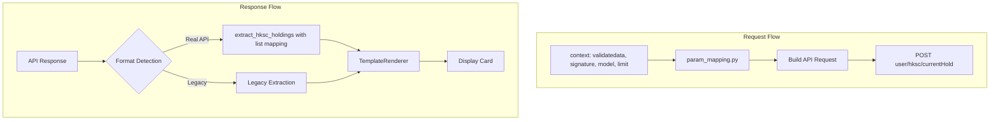

# HKSC Holdings API 集成计划

## 概述

本计划旨在将真实的港股通持仓 API 集成到证券智能体中，参照 ETF Holdings 的重构模式，包括：
1. 更新 mock 数据格式为真实 API 格式
2. 实现参数映射配置
3. 创建字段提取配置用于 display_card（支持列表映射）
4. 更新 Schema 和 TemplateRenderer

## API 对比分析

### 请求格式

| 项目 | account_overview/cash_assets | etf_holdings | hksc_holdings |
|------|------------------------------|--------------|---------------|
| URL | `getMyAllAssetsBy10` / `queryCashDetail` | `getUserAssetGrpHold` | `user/hksc/currentHold` |
| Body 参数 | `channel`, `appName`, `tokenId`, `body.accountType` | `assetGrpType`, `appName`, `limit` | `appName`, `model`, `limit` |
| Headers | `Content-Type` | `Content-Type`, `validatedata`, `signature` | `Content-Type`, `validatedata`, `signature` |
| account_type 区分 | 是（"1" 或 "2"） | 否（统一查询） | 否（统一查询） |

**关键特征**:
- HKSC API 与 ETF API 类似，需要特殊的 headers：`validatedata` 和 `signature`
- HKSC API 使用 `appName`, `model`, `limit` 作为请求体参数
- HKSC API 不区分普通账户和两融账户

### 请求示例

```python
url = "http://100.25.123.123/ais/v1/user/hksc/currentHold"

payload = json.dumps({
    "appName": "AYLCAPP",  # fixed value
    "model": 1,            # configurable value
    "limit": 20            # configurable value
})

headers = {
    'Content-Type': 'application/json',
    'validatedata': 'channel=REST&usercode=150573383&userid=12977997&account=3310123&branchno=3310&loginflag=3&mobileNo=137123123',
    'signature': '/bzp123='
}
```

### 响应格式

```json
{
    "err": 0,
    "errmsg": "success",
    "msg": "success",
    "status": 1,
    "results": {
        "progress": 0,
        "holdMktVal": 1000500.33,
        "holdPositionPft": 1000.22,
        "dayTotalPft": 100,
        "dayTotalPftRate": 0.03,
        "totalHkscShare": 10000,
        "availableHkscShare": 6000,
        "limitHkscShare": 4000,
        "preFrozenAsset": 6000.22,
        "stockList": [
            {
                "marketType": "HK",
                "mktVal": 0,
                "dayPft": 12.55,
                "dayPftRate": 0.1122,
                "holdPositionPft": 2.11,
                "holdPositionPftRate": 0.021,
                "position": "0.0000",
                "holdCnt": "2000",
                "shareBln": "1000",
                "price": "2.066",
                "costPrice": "1.9872",
                "secuCode": "10001",
                "secuName": "阿里巴巴",
                "secuAcc": "E022922565"
            }
        ],
        "preFrozenStockList": [
            {
                "secuName": "阿里巴巴",
                "secuCode": "10001",
                "preFrozenAsset": 6000.22
            }
        ]
    }
}
```

### 卡片字段映射

根据 API 文档，HKSC 卡片包含汇总数据和列表数据，映射关系如下：

**汇总字段映射**:
```json
{
    "hold_market_value": "results.holdMktVal",
    "hold_position_profit": "results.holdPositionPft",
    "day_total_profit": "results.dayTotalPft",
    "day_total_profit_rate": "results.dayTotalPftRate",
    "total_hksc_share": "results.totalHkscShare",
    "available_hksc_share": "results.availableHkscShare",
    "limit_hksc_share": "results.limitHkscShare",
    "pre_frozen_asset": "results.preFrozenAsset"
}
```

**列表项字段映射**:
```json
{
    "code": "secuCode",
    "name": "secuName",
    "hold_cnt": "holdCnt",
    "share_bln": "shareBln",
    "market_value": "mktVal",
    "day_profit": "dayPft",
    "day_profit_rate": "dayPftRate",
    "price": "price",
    "cost_price": "costPrice",
    "market_type": "marketType",
    "hold_position_profit": "holdPositionPft",
    "hold_position_profit_rate": "holdPositionPftRate",
    "position": "position",
    "secu_acc": "secuAcc"
}
```

---

## 问题分析

### 1. 当前 HKSCHoldingsAdapter 问题

**当前代码** ([`service_client.py:232-251`](src/ark_agentic/agents/securities/tools/service_client.py:232)):
```python
class HKSCHoldingsAdapter(BaseServiceAdapter):
    def _normalize_response(self, raw_data, account_type):
        data = raw_data.get("data", {})  # ❌ 错误：真实 API 没有 data 字段
        schema = HKSCHoldingsSchema.from_raw_data(data)
        return schema.model_dump()
```

**问题**: 
- 使用旧格式 `data.get("data", {})` 而真实 API 返回 `results.stockList`
- 未实现 `_build_request` 方法，无法构建正确的请求
- 未处理 header 认证（`validatedata` 和 `signature`）

### 2. 当前 HKSCHoldingsSchema 问题

**当前代码** ([`schemas.py:309-324`](src/ark_agentic/agents/securities/schemas.py:309)):
```python
class HKSCHoldingsSchema(BaseModel):
    holdings: list[HoldingItemSchema]
    summary: HoldingsSummarySchema
```

**问题**: 
- 字段结构与真实 API 不匹配（真实 API 使用 `stockList`，无 `summary`）
- 缺少港股通特有字段：`holdMktVal`, `totalHkscShare`, `availableHkscShare`, `limitHkscShare`, `preFrozenAsset`
- `HoldingItemSchema` 缺少港股通特有字段：`shareBln`, `position`, `secuAcc`

### 3. 当前 Mock 数据问题

**当前代码** ([`mock_data/hksc_holdings/default.json`](src/ark_agentic/agents/securities/mock_data/hksc_holdings/default.json)):
```json
{
    "code": "0",
    "message": "success",
    "data": {
        "holdings": [...],
        "summary": {...}
    }
}
```

**问题**: 格式与真实 API 完全不同。

### 4. 当前 hksc_holdings.py Tool 问题

**当前代码** ([`hksc_holdings.py:45-49`](src/ark_agentic/agents/securities/tools/hksc_holdings.py:45)):
```python
data = await self._adapter.call(
    account_type=account_type,
    user_id=user_id,
    # ❌ 缺少 _context 参数传递
)
```

**问题**: 未传递 `_context` 给 adapter，导致无法获取 `validatedata` 和 `signature`。

### 5. 缺少字段提取配置

当前 [`field_extraction.py`](src/ark_agentic/agents/securities/tools/field_extraction.py) 没有 `hksc_holdings` 的配置。

### 6. 缺少参数映射配置

当前 [`param_mapping.py`](src/ark_agentic/agents/securities/tools/param_mapping.py) 没有 `hksc_holdings` 的配置。

---

## 实现方案

### 架构设计



### 文件变更清单

| 文件 | 变更类型 | 说明 |
|------|----------|------|
| `tools/param_mapping.py` | 修改 | 添加 `HKSC_HOLDINGS_PARAM_CONFIG` 和 `HKSC_HOLDINGS_HEADER_CONFIG` |
| `tools/field_extraction.py` | 修改 | 添加 `HKSC_HOLDINGS_FIELD_MAPPING` 和 `extract_hksc_holdings()`，支持列表映射 |
| `tools/service_client.py` | 修改 | 重构 `HKSCHoldingsAdapter`，支持 header 认证 |
| `tools/hksc_holdings.py` | 修改 | 传递 `_context` 参数 |
| `mock_data/hksc_holdings/default.json` | 修改 | 更新为真实 API 格式 |
| `schemas.py` | 修改 | 更新 `HKSCHoldingsSchema` 和 `HKSCHoldingItemSchema` |
| `template_renderer.py` | 修改 | 更新 `render_holdings_list_card()` 支持 HKSC 数据格式 |
| `tools/display_card.py` | 修改 | 添加 `hksc_holdings` 字段提取调用 |

---

## 详细实现步骤

### 步骤 1: 更新 param_mapping.py

在 [`SERVICE_PARAM_CONFIGS`](src/ark_agentic/agents/securities/tools/param_mapping.py:169) 中添加:

```python
# 港股通持仓 API 参数配置
# 注意：HKSC API 请求体结构与 ETF 类似但略有不同
HKSC_HOLDINGS_PARAM_CONFIG: dict[str, tuple] = {
    # Body 参数
    "appName": ("static", "AYLCAPP"),
    "model": ("transform", "model", lambda x: x if x else 1),  # 默认 1
    "limit": ("transform", "limit", lambda x: x if x else 20),  # 默认 20 条
}

# Header 参数配置（HKSC 专用，与 ETF 相同）
HKSC_HOLDINGS_HEADER_CONFIG: dict[str, tuple] = {
    "validatedata": ("context", "validatedata"),  # 从 context 获取
    "signature": ("context", "signature"),         # 从 context 获取
}

SERVICE_PARAM_CONFIGS = {
    "account_overview": ACCOUNT_OVERVIEW_PARAM_CONFIG,
    "cash_assets": CASH_ASSETS_PARAM_CONFIG,
    "etf_holdings": ETF_HOLDINGS_PARAM_CONFIG,
    "hksc_holdings": HKSC_HOLDINGS_PARAM_CONFIG,  # 新增
}

SERVICE_HEADER_CONFIGS = {
    "etf_holdings": ETF_HOLDINGS_HEADER_CONFIG,
    "hksc_holdings": HKSC_HOLDINGS_HEADER_CONFIG,  # 新增
}
```

### 步骤 2: 更新 field_extraction.py

添加 HKSC 字段映射和提取函数，**支持列表映射**:

```python
# ============ 港股通持仓字段映射 ============

# 汇总字段映射
HKSC_HOLDINGS_FIELD_MAPPING: dict[str, str] = {
    "hold_market_value": "results.holdMktVal",
    "hold_position_profit": "results.holdPositionPft",
    "day_total_profit": "results.dayTotalPft",
    "day_total_profit_rate": "results.dayTotalPftRate",
    "total_hksc_share": "results.totalHkscShare",
    "available_hksc_share": "results.availableHkscShare",
    "limit_hksc_share": "results.limitHkscShare",
    "pre_frozen_asset": "results.preFrozenAsset",
    "progress": "results.progress",
}

# 列表项字段映射
HKSC_HOLDINGS_ITEM_MAPPING: dict[str, str] = {
    "code": "secuCode",
    "name": "secuName",
    "hold_cnt": "holdCnt",
    "share_bln": "shareBln",
    "market_value": "mktVal",
    "day_profit": "dayPft",
    "day_profit_rate": "dayPftRate",
    "price": "price",
    "cost_price": "costPrice",
    "market_type": "marketType",
    "hold_position_profit": "holdPositionPft",
    "hold_position_profit_rate": "holdPositionPftRate",
    "position": "position",
    "secu_acc": "secuAcc",
}

# 预冻结列表项字段映射
HKSC_PRE_FROZEN_ITEM_MAPPING: dict[str, str] = {
    "code": "secuCode",
    "name": "secuName",
    "pre_frozen_asset": "preFrozenAsset",
}

# 旧格式字段映射（向后兼容）
HKSC_HOLDINGS_LEGACY_MAPPING: dict[str, str] = {
    "holdings": "data.holdings",
    "summary": "data.summary",
}


def extract_hksc_holdings(data: dict[str, Any]) -> dict[str, Any]:
    """提取港股通持仓字段（自动检测格式）
    
    支持列表字段映射，包括持仓列表和预冻结列表。
    """
    # 检测真实 API 格式：有 results.stockList 结构
    if "results" in data and isinstance(data.get("results"), dict):
        results = data["results"]
        if "stockList" in results and isinstance(results.get("stockList"), list):
            # 提取汇总字段
            extracted = extract_fields(data, HKSC_HOLDINGS_FIELD_MAPPING)
            # 提取持仓列表字段
            stock_list = results["stockList"]
            extracted["stock_list"] = extract_list_items(stock_list, HKSC_HOLDINGS_ITEM_MAPPING)
            # 提取预冻结列表字段（可选）
            if "preFrozenStockList" in results and isinstance(results.get("preFrozenStockList"), list):
                pre_frozen_list = results["preFrozenStockList"]
                extracted["pre_frozen_list"] = extract_list_items(pre_frozen_list, HKSC_PRE_FROZEN_ITEM_MAPPING)
            return extracted
    
    # 使用旧格式
    return extract_fields(data, HKSC_HOLDINGS_LEGACY_MAPPING)


def extract_service_fields(service_name: str, data: dict[str, Any]) -> dict[str, Any]:
    """提取指定服务的字段（自动检测格式）"""
    if service_name == "account_overview":
        return extract_account_overview(data)
    if service_name == "cash_assets":
        return extract_cash_assets(data)
    if service_name == "etf_holdings":
        return extract_etf_holdings(data)
    if service_name == "hksc_holdings":
        return extract_hksc_holdings(data)
    
    return data
```

### 步骤 3: 重构 HKSCHoldingsAdapter

修改 [`service_client.py`](src/ark_agentic/agents/securities/tools/service_client.py:232):

```python
class HKSCHoldingsAdapter(BaseServiceAdapter):
    """港股通持仓服务适配器
    
    使用真实 API 格式：
    - 请求体: {"appName": "AYLCAPP", "model": 1, "limit": 20}
    - Headers: {"Content-Type": "application/json", "validatedata": "...", "signature": "..."}
    - 响应体: {"status": 1, "results": {"stockList": [...], "holdMktVal": ...}}
    """
    
    def _build_request(
        self,
        account_type: str,
        user_id: str,
        params: dict[str, Any],
    ) -> tuple[dict[str, str], dict[str, Any]]:
        """构建请求（使用参数映射配置）"""
        from .param_mapping import (
            build_api_request,
            SERVICE_PARAM_CONFIGS,
            SERVICE_HEADER_CONFIGS,
        )
        
        context = params.get("_context", {})
        
        # 使用参数映射构建请求体
        config = SERVICE_PARAM_CONFIGS.get("hksc_holdings", {})
        body = build_api_request(config, context)
        
        # 构建 headers（包含 validatedata 和 signature）
        headers = {"Content-Type": "application/json"}
        
        # 从 context 获取 HKSC 专用认证 headers
        header_config = SERVICE_HEADER_CONFIGS.get("hksc_holdings", {})
        for header_name, source_def in header_config.items():
            if source_def[0] == "context":
                key = source_def[1]
                value = context.get(key)
                if value:
                    headers[header_name] = value
        
        # 添加配置的认证（如果有的话）
        if self.config.auth_type == "header" and self.config.auth_value:
            headers[self.config.auth_key] = self.config.auth_value
        
        return headers, body
    
    def _normalize_response(
        self,
        raw_data: dict[str, Any],
        account_type: str,
    ) -> dict[str, Any]:
        """返回原始数据，不做标准化（由 display_card 处理字段提取）"""
        # 检查 API 响应状态
        if raw_data.get("status") != 1:
            error_msg = raw_data.get("errmsg") or raw_data.get("msg") or "Unknown API error"
            raise ServiceError(f"API returned error: {error_msg}")
        
        # 返回原始数据，字段提取由 display_card 工具完成
        return raw_data
```

### 步骤 4: 更新 hksc_holdings.py Tool

修改 [`hksc_holdings.py`](src/ark_agentic/agents/securities/tools/hksc_holdings.py):

```python
async def execute(
    self,
    tool_call: ToolCall,
    context: dict[str, Any] | None = None,
) -> AgentToolResult:
    args = tool_call.arguments
    context = context or {}
    
    # 上下文中的参数优先级高于 args
    args.update(context)
    
    # HKSC 不区分账户类型，但仍保留参数兼容
    account_type = args.get("account_type") or context.get("account_type", "normal")
    user_id = context.get("user_id", "U001")
    
    try:
        # 传递完整 context 给 adapter（用于参数映射和 header 认证）
        data = await self._adapter.call(
            account_type=account_type,
            user_id=user_id,
            _context=context,  # 传递完整上下文
        )
        
        return AgentToolResult.json_result(
            tool_call_id=tool_call.id,
            data=data,
        )
    except Exception as e:
        return AgentToolResult.error_result(
            tool_call_id=tool_call.id,
            error=str(e),
        )
```

### 步骤 5: 更新 Mock 数据

#### 更新 `mock_data/hksc_holdings/default.json`:

```json
{
    "err": 0,
    "errmsg": "success",
    "msg": "success",
    "status": 1,
    "results": {
        "progress": 0,
        "holdMktVal": 1000500.33,
        "holdPositionPft": 1000.22,
        "dayTotalPft": 100,
        "dayTotalPftRate": 0.03,
        "totalHkscShare": 10000,
        "availableHkscShare": 6000,
        "limitHkscShare": 4000,
        "preFrozenAsset": 6000.22,
        "stockList": [
            {
                "marketType": "HK",
                "mktVal": 500000.00,
                "dayPft": 50.55,
                "dayPftRate": 0.0522,
                "holdPositionPft": 500.11,
                "holdPositionPftRate": 0.011,
                "position": "0.0000",
                "holdCnt": "1000",
                "shareBln": "500",
                "price": "500.00",
                "costPrice": "499.50",
                "secuCode": "00700",
                "secuName": "腾讯控股",
                "secuAcc": "E022922565"
            },
            {
                "marketType": "HK",
                "mktVal": 500500.33,
                "dayPft": 49.45,
                "dayPftRate": 0.0488,
                "holdPositionPft": 500.11,
                "holdPositionPftRate": 0.031,
                "position": "0.0000",
                "holdCnt": "2000",
                "shareBln": "1000",
                "price": "250.25",
                "costPrice": "249.75",
                "secuCode": "09988",
                "secuName": "阿里巴巴-SW",
                "secuAcc": "E022922565"
            }
        ],
        "preFrozenStockList": [
            {
                "secuName": "阿里巴巴-SW",
                "secuCode": "09988",
                "preFrozenAsset": 6000.22
            }
        ]
    }
}
```

### 步骤 6: 更新 HKSCHoldingsSchema

修改 [`schemas.py`](src/ark_agentic/agents/securities/schemas.py:307):

```python
# ============ 港股通持仓（真实 API 格式）============

class HKSCHoldingItemSchema(BaseModel):
    """港股通持仓项（真实 API 格式）
    
    从 field_extraction.extract_hksc_holdings() 提取后的数据创建。
    """
    
    code: str = Field(..., description="证券代码")
    name: str = Field(..., description="证券名称")
    hold_cnt: str = Field(..., description="持仓数量")
    share_bln: str | None = Field(None, description="可用份额")
    market_value: str | None = Field(None, description="市值")
    day_profit: str | None = Field(None, description="今日收益")
    day_profit_rate: str | None = Field(None, description="今日收益率")
    price: str | None = Field(None, description="当前价格")
    cost_price: str | None = Field(None, description="成本价")
    market_type: str | None = Field(None, description="市场类型")
    hold_position_profit: str | None = Field(None, description="持仓盈亏")
    hold_position_profit_rate: str | None = Field(None, description="持仓盈亏率")
    position: str | None = Field(None, description="持仓位置")
    secu_acc: str | None = Field(None, description="证券账户")
    
    model_config = {"populate_by_name": True}
    
    @classmethod
    def from_api_response(cls, data: dict) -> HKSCHoldingItemSchema:
        """从字段提取后的数据创建"""
        return cls(
            code=data.get("code", ""),
            name=data.get("name", ""),
            hold_cnt=data.get("hold_cnt", "0"),
            share_bln=data.get("share_bln"),
            market_value=data.get("market_value"),
            day_profit=data.get("day_profit"),
            day_profit_rate=data.get("day_profit_rate"),
            price=data.get("price"),
            cost_price=data.get("cost_price"),
            market_type=data.get("market_type"),
            hold_position_profit=data.get("hold_position_profit"),
            hold_position_profit_rate=data.get("hold_position_profit_rate"),
            position=data.get("position"),
            secu_acc=data.get("secu_acc"),
        )


class HKSCPreFrozenItemSchema(BaseModel):
    """港股通预冻结项"""
    
    code: str = Field(..., description="证券代码")
    name: str = Field(..., description="证券名称")
    pre_frozen_asset: str | None = Field(None, description="预冻结资产")
    
    model_config = {"populate_by_name": True}


class HKSCHoldingsSchema(BaseModel):
    """港股通持仓完整模型
    
    支持两种数据来源：
    1. from_raw_data: 从旧格式/mock 数据创建
    2. from_api_response: 从真实 API 响应创建（通过字段提取后的数据）
    """
    
    # 真实 API 格式字段
    hold_market_value: str = Field(default="0", description="持仓市值")
    hold_position_profit: str | None = Field(None, description="持仓盈亏")
    day_total_profit: str = Field(default="0", description="今日总收益")
    day_total_profit_rate: str | None = Field(None, description="今日收益率")
    total_hksc_share: str | None = Field(None, description="港股通总额度")
    available_hksc_share: str | None = Field(None, description="港股通可用额度")
    limit_hksc_share: str | None = Field(None, description="港股通限额")
    pre_frozen_asset: str | None = Field(None, description="预冻结资产")
    progress: int | None = Field(None, description="进度")
    stock_list: list[HKSCHoldingItemSchema] = Field(default_factory=list, description="持仓列表")
    pre_frozen_list: list[HKSCPreFrozenItemSchema] | None = Field(None, description="预冻结列表")
    
    # 旧格式字段（向后兼容）
    holdings: list[HoldingItemSchema] = Field(default_factory=list, description="持仓列表（旧格式）")
    summary: HoldingsSummarySchema | None = Field(None, description="持仓汇总（旧格式）")
    
    model_config = {"populate_by_name": True}
    
    @classmethod
    def from_api_response(cls, data: dict) -> HKSCHoldingsSchema:
        """从真实 API 响应创建（通过字段提取后的数据）
        
        用于从 field_extraction.extract_hksc_holdings() 提取后的数据创建。
        字段已经是标准化的名称。
        
        Args:
            data: 从 extract_hksc_holdings() 返回的标准化数据
        
        Returns:
            HKSCHoldingsSchema 实例
        """
        stock_list_raw = data.get("stock_list", [])
        pre_frozen_raw = data.get("pre_frozen_list", [])
        
        return cls(
            hold_market_value=data.get("hold_market_value", "0"),
            hold_position_profit=data.get("hold_position_profit"),
            day_total_profit=data.get("day_total_profit", "0"),
            day_total_profit_rate=data.get("day_total_profit_rate"),
            total_hksc_share=data.get("total_hksc_share"),
            available_hksc_share=data.get("available_hksc_share"),
            limit_hksc_share=data.get("limit_hksc_share"),
            pre_frozen_asset=data.get("pre_frozen_asset"),
            progress=data.get("progress"),
            stock_list=[HKSCHoldingItemSchema.from_api_response(s) for s in stock_list_raw],
            pre_frozen_list=[HKSCPreFrozenItemSchema(**p) for p in pre_frozen_raw] if pre_frozen_raw else None,
        )
    
    @classmethod
    def from_raw_data(cls, data: dict) -> HKSCHoldingsSchema:
        """从旧格式数据创建（向后兼容）"""
        holdings_raw = data.get("holdings", [])
        summary_raw = data.get("summary", {})
        
        # 转换旧格式到新格式
        stock_list = []
        for h in holdings_raw:
            stock_list.append({
                "code": get_val(h, "securityCode", "code"),
                "name": get_val(h, "securityName", "name"),
                "hold_cnt": get_val(h, "quantity", "qty"),
                "market_value": get_val(h, "marketValue", "mv"),
                "day_profit": get_val(h, "todayProfit"),
                "price": get_val(h, "currentPrice", "price"),
                "cost_price": get_val(h, "costPrice", "cost"),
            })
        
        return cls(
            hold_market_value=get_val(summary_raw, "totalMarketValue", "total_mv") or "0",
            day_total_profit=get_val(summary_raw, "todayProfit", "today_profit") or "0",
            stock_list=[HKSCHoldingItemSchema.from_api_response(s) for s in stock_list],
            holdings=[HoldingItemSchema.from_raw_data(h) for h in holdings_raw],
            summary=HoldingsSummarySchema.from_raw_data(summary_raw) if summary_raw else None,
        )
```

### 步骤 7: 更新 TemplateRenderer

修改 [`template_renderer.py`](src/ark_agentic/agents/securities/template_renderer.py:57):

```python
@staticmethod
def render_holdings_list_card(
    asset_class: Literal["ETF", "HKSC", "Fund", "Cash"],
    data: dict[str, Any],
) -> dict[str, Any]:
    """渲染持仓列表卡片
    
    支持两种数据格式：
    1. 真实 API 格式（通过字段提取）: stock_list, total_market_value, total_profit
    2. 旧格式: holdings, summary
    
    HKSC 额外支持：
    - available_hksc_share: 港股通可用额度
    - pre_frozen_asset: 预冻结资产
    - pre_frozen_list: 预冻结列表
    """
    # 检测数据格式
    if "stock_list" in data:
        # 真实 API 格式
        summary = {
            "total_market_value": data.get("total_market_value") or data.get("hold_market_value"),
            "total_profit": data.get("total_profit") or data.get("day_total_profit"),
            "total_profit_rate": data.get("total_profit_rate") or data.get("day_total_profit_rate"),
            "total": data.get("total"),
        }
        
        # HKSC 特有字段
        if asset_class == "HKSC":
            summary["available_hksc_share"] = data.get("available_hksc_share")
            summary["limit_hksc_share"] = data.get("limit_hksc_share")
            summary["total_hksc_share"] = data.get("total_hksc_share")
            summary["pre_frozen_asset"] = data.get("pre_frozen_asset")
        
        result = {
            "template_type": "holdings_list_card",
            "asset_class": asset_class,
            "data": {
                "holdings": data.get("stock_list", []),
                "summary": summary,
            }
        }
        
        # HKSC 预冻结列表
        if asset_class == "HKSC" and data.get("pre_frozen_list"):
            result["data"]["pre_frozen_list"] = data.get("pre_frozen_list")
        
        return result
    else:
        # 旧格式
        return {
            "template_type": "holdings_list_card",
            "asset_class": asset_class,
            "data": {
                "holdings": data.get("holdings", []),
                "summary": data.get("summary", {}),
            }
        }
```

### 步骤 8: 更新 display_card.py

修改 [`display_card.py`](src/ark_agentic/agents/securities/tools/display_card.py:107):

```python
from .field_extraction import extract_account_overview, extract_cash_assets, extract_etf_holdings, extract_hksc_holdings

# ... 在 execute 方法中 ...

if render_type == "holdings_list":
    asset_class = _ASSET_CLASS_MAP[source_tool]
    
    # ETF 和 HKSC 使用字段提取工具
    if source_tool == "etf_holdings":
        extracted_data = extract_etf_holdings(data)
        template = TemplateRenderer.render_holdings_list_card(asset_class, extracted_data)
    elif source_tool == "hksc_holdings":
        extracted_data = extract_hksc_holdings(data)
        template = TemplateRenderer.render_holdings_list_card(asset_class, extracted_data)
    else:
        # Fund 暂时使用旧格式
        template = TemplateRenderer.render_holdings_list_card(asset_class, data)
```

### 步骤 9: 更新 MockServiceAdapter

修改 [`service_client.py`](src/ark_agentic/agents/securities/tools/service_client.py:361) 中的场景选择逻辑:

```python
async def call(self, account_type: str, user_id: str, **params) -> dict[str, Any]:
    """从文件加载 Mock 数据"""
    
    # 根据账户类型选择场景
    scenario = "default"
    if self.service_name == "account_overview":
        scenario = "margin_user" if account_type == "margin" else "normal_user"
    elif self.service_name == "cash_assets":
        scenario = "margin_user" if account_type == "margin" else "normal_user"
    elif self.service_name == "etf_holdings":
        scenario = "default"  # ETF 不区分账户类型
    elif self.service_name == "hksc_holdings":
        scenario = "default"  # HKSC 不区分账户类型
    
    # 加载数据
    raw_data = self._loader.load(
        service_name=self.service_name,
        scenario=scenario,
        **params,
    )
    
    return self._normalize_response(raw_data, account_type)
```

---

## 测试计划

### 单元测试

1. **test_param_mapping.py**
   - 测试 `HKSC_HOLDINGS_PARAM_CONFIG` 构建正确的请求体
   - 测试 `model` 和 `limit` 默认值

2. **test_field_extraction.py**
   - 测试真实 API 格式的字段提取
   - 测试列表字段映射（stockList 和 preFrozenStockList）
   - 测试旧格式的字段提取
   - 测试格式自动检测

### 集成测试

1. **Mock 模式测试**
   - HKSC 持仓查询
   - display_card 渲染正确
   - 列表数据正确展示
   - HKSC 特有字段展示

2. **完整流程测试**
   - 从 context 获取 validatedata 和 signature
   - 请求构建
   - 响应解析
   - 卡片渲染

---

## 实施顺序

1. [ ] 更新 `param_mapping.py` - 添加参数映射配置和 header 配置
2. [ ] 更新 `field_extraction.py` - 添加字段提取配置（支持列表映射）
3. [ ] 更新 `schemas.py` - 重构 HKSCHoldingsSchema
4. [ ] 更新 `service_client.py` - 重构 HKSCHoldingsAdapter
5. [ ] 更新 `hksc_holdings.py` - 传递 _context 参数
6. [ ] 更新 mock 数据文件 - default.json
7. [ ] 更新 `template_renderer.py` - 更新渲染方法
8. [ ] 更新 `display_card.py` - 添加字段提取调用
9. [ ] 编写测试用例
10. [ ] 运行测试验证

---

## 关键差异点总结

与 ETF 持仓重构相比，港股通持仓重构有以下关键差异：

| 差异点 | ETF | HKSC |
|--------|-----|------|
| 请求体参数 | `assetGrpType`, `appName`, `limit` | `appName`, `model`, `limit` |
| 汇总字段 | `dayTotalMktVal`, `dayTotalPft` | `holdMktVal`, `dayTotalPft`, `totalHkscShare` |
| 特有字段 | 无 | `availableHkscShare`, `limitHkscShare`, `preFrozenAsset` |
| 列表项特有字段 | 无 | `shareBln`, `position`, `secuAcc` |
| 预冻结列表 | 无 | `preFrozenStockList` |
| 响应状态检查 | `status` | `status` + `err` |

---

## 准备就绪

本计划已完成设计，与 ETF Holdings 的重构模式保持一致，同时处理了 HKSC API 的特殊性（不同的请求参数、港股通特有字段、预冻结列表）。确认后可切换到 **Code** 模式开始实施代码修改。