# A2UI System (Agent-to-User Interface)

<cite>
**Referenced Files in This Document**
- [__init__.py](file://src/ark_agentic/core/a2ui/__init__.py)
- [blocks.py](file://src/ark_agentic/core/a2ui/blocks.py)
- [composer.py](file://src/ark_agentic/core/a2ui/composer.py)
- [renderer.py](file://src/ark_agentic/core/a2ui/renderer.py)
- [theme.py](file://src/ark_agentic/core/a2ui/theme.py)
- [preset_registry.py](file://src/ark_agentic/core/a2ui/preset_registry.py)
- [validator.py](file://src/ark_agentic/core/a2ui/validator.py)
- [contract_models.py](file://src/ark_agentic/core/a2ui/contract_models.py)
- [guard.py](file://src/ark_agentic/core/a2ui/guard.py)
- [transforms.py](file://src/ark_agentic/core/a2ui/transforms.py)
- [render_a2ui.py](file://src/ark_agentic/core/tools/render_a2ui.py)
- [blocks.py](file://src/ark_agentic/agents/insurance/a2ui/blocks.py)
- [components.py](file://src/ark_agentic/agents/insurance/a2ui/components.py)
- [withdraw_a2ui_utils.py](file://src/ark_agentic/agents/insurance/a2ui/withdraw_a2ui_utils.py)
- [preset_extractors.py](file://src/ark_agentic/agents/securities/a2ui/preset_extractors.py)
- [a2ui-withdraw-ui-schema.json](file://docs/a2ui/a2ui-withdraw-ui-schema.json)
- [a2ui-withdraw-plan-ui-sample.json](file://docs/a2ui/a2ui-withdraw-plan-ui-sample.json)
</cite>

## Table of Contents
1. [Introduction](#introduction)
2. [Project Structure](#project-structure)
3. [Core Components](#core-components)
4. [Architecture Overview](#architecture-overview)
5. [Detailed Component Analysis](#detailed-component-analysis)
6. [Dependency Analysis](#dependency-analysis)
7. [Performance Considerations](#performance-considerations)
8. [Troubleshooting Guide](#troubleshooting-guide)
9. [Conclusion](#conclusion)
10. [Appendices](#appendices)

## Introduction
A2UI (Agent-to-User Interface) is a dynamic UI generation framework enabling agents to assemble rich, interactive user interfaces from reusable building blocks. It supports three complementary rendering modes:
- Blocks mode: dynamic composition of block descriptors into a full A2UI event payload.
- Template mode: load a predefined template and merge with extracted data to produce a full event payload.
- Preset mode: extract and return a lean, frontend-ready payload directly.

A2UI emphasizes separation of concerns:
- Blocks and components define UI structure and behavior.
- Themes unify visual design tokens.
- Transformers compute derived UI-ready values from raw business data.
- Validators and guards enforce UI contracts and detect missing data.
- The renderer composes and validates payloads for safe delivery to the frontend.

## Project Structure
The A2UI system is organized around a core set of modules under core/a2ui and agent-specific implementations under agents/<agent>/a2ui. The unified rendering tool integrates all paths.

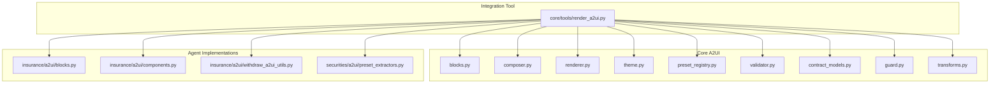

**Diagram sources**
- [blocks.py](file://src/ark_agentic/core/a2ui/blocks.py)
- [composer.py](file://src/ark_agentic/core/a2ui/composer.py)
- [renderer.py](file://src/ark_agentic/core/a2ui/renderer.py)
- [theme.py](file://src/ark_agentic/core/a2ui/theme.py)
- [preset_registry.py](file://src/ark_agentic/core/a2ui/preset_registry.py)
- [validator.py](file://src/ark_agentic/core/a2ui/validator.py)
- [contract_models.py](file://src/ark_agentic/core/a2ui/contract_models.py)
- [guard.py](file://src/ark_agentic/core/a2ui/guard.py)
- [transforms.py](file://src/ark_agentic/core/a2ui/transforms.py)
- [render_a2ui.py](file://src/ark_agentic/core/tools/render_a2ui.py)
- [blocks.py](file://src/ark_agentic/agents/insurance/a2ui/blocks.py)
- [components.py](file://src/ark_agentic/agents/insurance/a2ui/components.py)
- [withdraw_a2ui_utils.py](file://src/ark_agentic/agents/insurance/a2ui/withdraw_a2ui_utils.py)
- [preset_extractors.py](file://src/ark_agentic/agents/securities/a2ui/preset_extractors.py)

**Section sources**
- [__init__.py](file://src/ark_agentic/core/a2ui/__init__.py)
- [render_a2ui.py](file://src/ark_agentic/core/tools/render_a2ui.py)

## Core Components
- Block infrastructure and registry: defines block builders, registration, and binding helpers.
- Composer: orchestrates block composition into a standardized A2UI payload.
- Renderer: loads templates and merges data to produce payloads.
- Theme: centralizes visual design tokens.
- Preset registry: per-agent registry of card extractors for preset mode.
- Validator and contract models: validate component/binding structure and event contracts.
- Guard: unified validation entry point combining contract, component, and data coverage checks.
- Transforms: a declarative DSL to derive UI-ready values from raw data.

**Section sources**
- [blocks.py](file://src/ark_agentic/core/a2ui/blocks.py)
- [composer.py](file://src/ark_agentic/core/a2ui/composer.py)
- [renderer.py](file://src/ark_agentic/core/a2ui/renderer.py)
- [theme.py](file://src/ark_agentic/core/a2ui/theme.py)
- [preset_registry.py](file://src/ark_agentic/core/a2ui/preset_registry.py)
- [validator.py](file://src/ark_agentic/core/a2ui/validator.py)
- [contract_models.py](file://src/ark_agentic/core/a2ui/contract_models.py)
- [guard.py](file://src/ark_agentic/core/a2ui/guard.py)
- [transforms.py](file://src/ark_agentic/core/a2ui/transforms.py)

## Architecture Overview
A2UI’s rendering pipeline supports three mutually exclusive paths. The unified tool dynamically exposes parameters based on enabled configurations and routes outputs consistently.

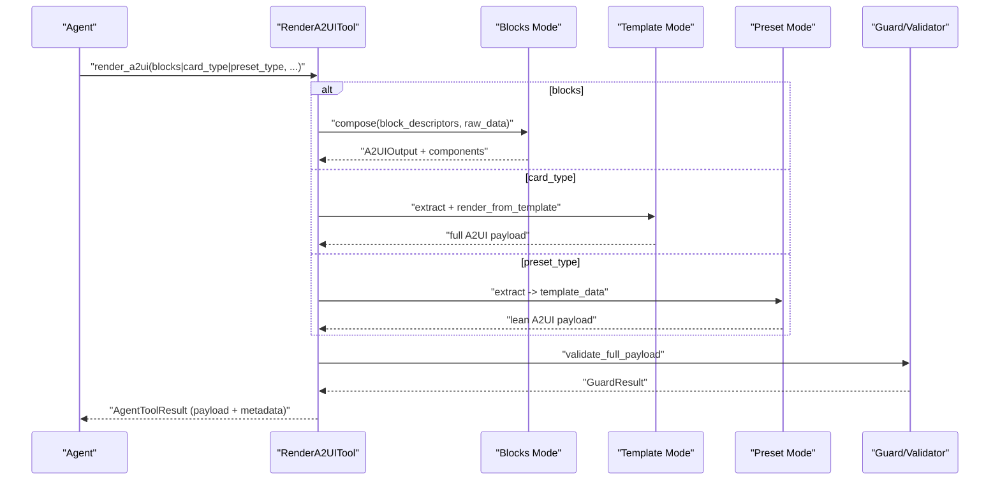

**Diagram sources**
- [render_a2ui.py](file://src/ark_agentic/core/tools/render_a2ui.py)
- [composer.py](file://src/ark_agentic/core/a2ui/composer.py)
- [renderer.py](file://src/ark_agentic/core/a2ui/renderer.py)
- [guard.py](file://src/ark_agentic/core/a2ui/guard.py)
- [validator.py](file://src/ark_agentic/core/a2ui/validator.py)

## Detailed Component Analysis

### Block Composition System
- Block registry: agents register block builders; core maintains an empty registry for extensibility.
- Block builders: pure functions mapping block data and an id generator to a list of component descriptors.
- Inline transforms: values can carry transform specs resolved at compose-time against raw data.
- Root composition: composer wraps all emitted components under a root Column using theme defaults.

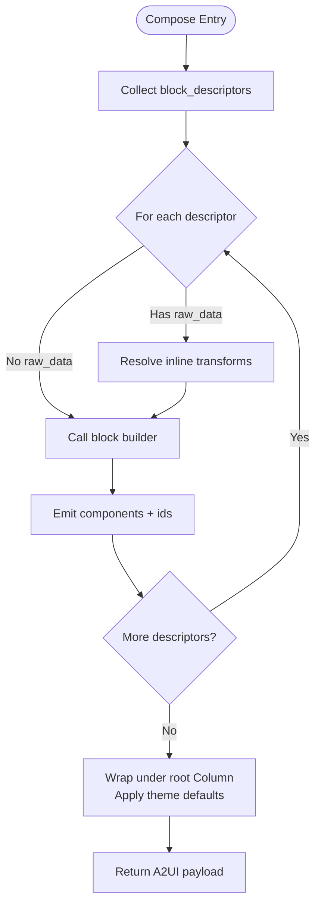

**Diagram sources**
- [composer.py](file://src/ark_agentic/core/a2ui/composer.py)
- [blocks.py](file://src/ark_agentic/core/a2ui/blocks.py)

**Section sources**
- [blocks.py](file://src/ark_agentic/core/a2ui/blocks.py)
- [composer.py](file://src/ark_agentic/core/a2ui/composer.py)

### Theme Customization Capabilities
- A2UITheme encapsulates immutable design tokens: colors, spacing, and density.
- Defaults are applied by composer and block builders to maintain consistent visuals.
- Agents can override theme per block factory to tailor styles while preserving consistency.

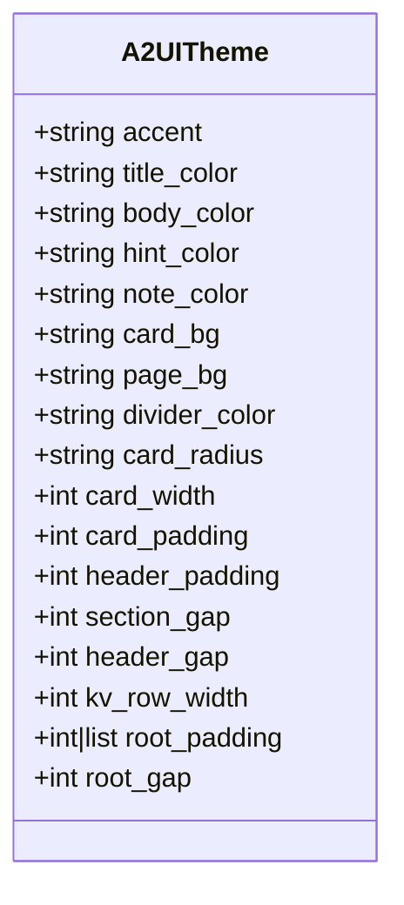

**Diagram sources**
- [theme.py](file://src/ark_agentic/core/a2ui/theme.py)

**Section sources**
- [theme.py](file://src/ark_agentic/core/a2ui/theme.py)
- [blocks.py](file://src/ark_agentic/core/a2ui/blocks.py)
- [composer.py](file://src/ark_agentic/core/a2ui/composer.py)

### Component Registry Architecture
- Insurance agent blocks and components demonstrate reusable block builders and higher-level components.
- Components encapsulate business logic, emit A2UIOutput with components, llm_digest, and state_delta.
- Utilities provide shared logic for allocation and presentation.

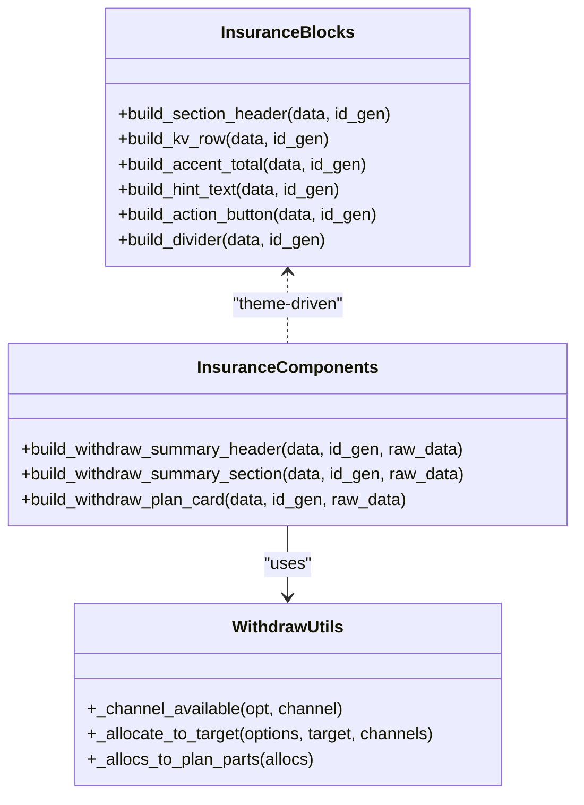

**Diagram sources**
- [blocks.py](file://src/ark_agentic/agents/insurance/a2ui/blocks.py)
- [components.py](file://src/ark_agentic/agents/insurance/a2ui/components.py)
- [withdraw_a2ui_utils.py](file://src/ark_agentic/agents/insurance/a2ui/withdraw_a2ui_utils.py)

**Section sources**
- [blocks.py](file://src/ark_agentic/agents/insurance/a2ui/blocks.py)
- [components.py](file://src/ark_agentic/agents/insurance/a2ui/components.py)
- [withdraw_a2ui_utils.py](file://src/ark_agentic/agents/insurance/a2ui/withdraw_a2ui_utils.py)

### A2UI Composer Orchestration
- Compose-time transform resolution ensures values are computed before block emission.
- Root Column is constructed with theme-derived spacing and background.
- SurfaceId and session scoping ensure idempotent updates or new surfaces.

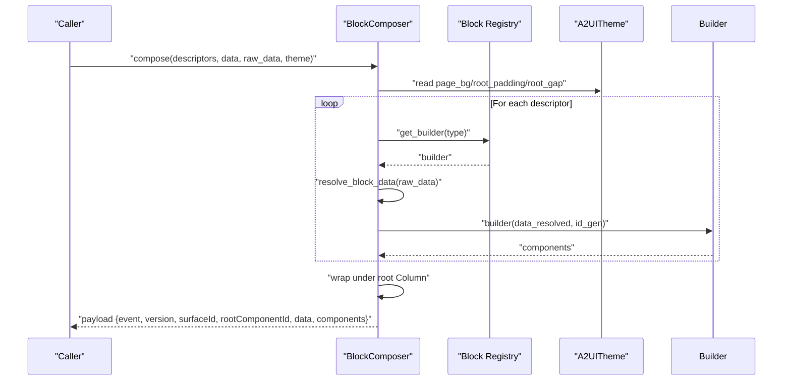

**Diagram sources**
- [composer.py](file://src/ark_agentic/core/a2ui/composer.py)
- [blocks.py](file://src/ark_agentic/core/a2ui/blocks.py)
- [theme.py](file://src/ark_agentic/core/a2ui/theme.py)

**Section sources**
- [composer.py](file://src/ark_agentic/core/a2ui/composer.py)

### Renderer and Template Integration
- Template renderer loads a card_type template and merges flattened data to produce a full A2UI payload.
- Preset extractors enrich context-derived data and return lean payloads for immediate rendering.

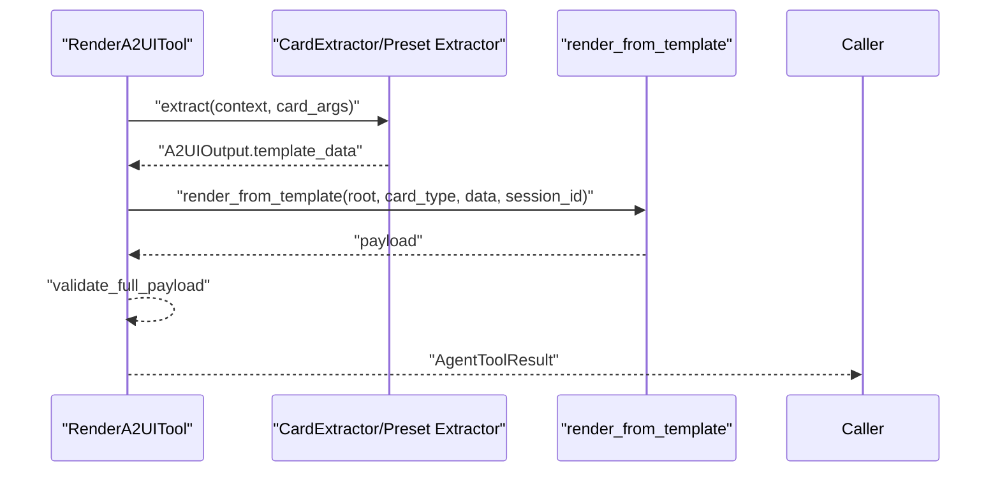

**Diagram sources**
- [render_a2ui.py](file://src/ark_agentic/core/tools/render_a2ui.py)
- [renderer.py](file://src/ark_agentic/core/a2ui/renderer.py)
- [preset_extractors.py](file://src/ark_agentic/agents/securities/a2ui/preset_extractors.py)

**Section sources**
- [renderer.py](file://src/ark_agentic/core/a2ui/renderer.py)
- [render_a2ui.py](file://src/ark_agentic/core/tools/render_a2ui.py)
- [preset_extractors.py](file://src/ark_agentic/agents/securities/a2ui/preset_extractors.py)

### Preset Registry System
- Per-agent preset registry maps card types to extractors returning template_data payloads.
- Extractors read upstream tool results from context, enrich with masked titles, and delegate to template renderers.

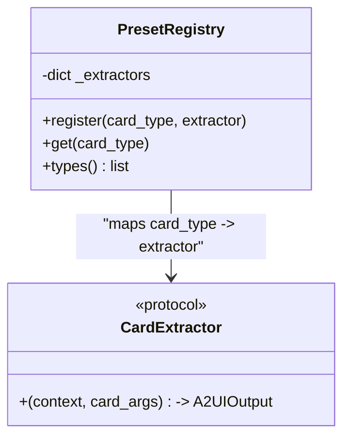

**Diagram sources**
- [preset_registry.py](file://src/ark_agentic/core/a2ui/preset_registry.py)
- [render_a2ui.py](file://src/ark_agentic/core/tools/render_a2ui.py)

**Section sources**
- [preset_registry.py](file://src/ark_agentic/core/a2ui/preset_registry.py)
- [preset_extractors.py](file://src/ark_agentic/agents/securities/a2ui/preset_extractors.py)

### Validation Mechanisms and Contracts
- Contract models validate top-level event payloads and allowed fields per event.
- Component validator enforces component types, props, binding XOR rules, and reference integrity.
- Guard combines contract, component, and data coverage checks into a single entry point.
- Strict vs. warning modes controlled by an environment flag.

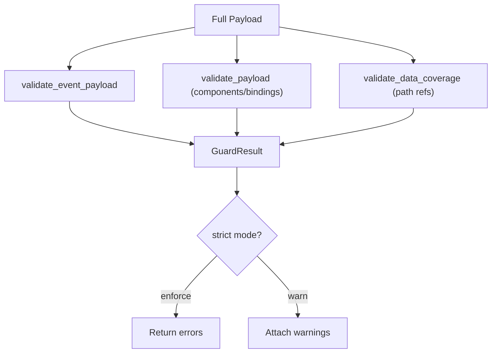

**Diagram sources**
- [contract_models.py](file://src/ark_agentic/core/a2ui/contract_models.py)
- [validator.py](file://src/ark_agentic/core/a2ui/validator.py)
- [guard.py](file://src/ark_agentic/core/a2ui/guard.py)

**Section sources**
- [contract_models.py](file://src/ark_agentic/core/a2ui/contract_models.py)
- [validator.py](file://src/ark_agentic/core/a2ui/validator.py)
- [guard.py](file://src/ark_agentic/core/a2ui/guard.py)

### Relationship Between Agent Logic and UI Generation
- Components encapsulate business logic and return structured outputs (components, llm_digest, state_delta).
- Blocks provide reusable UI primitives; components orchestrate blocks and higher-level cards.
- The unified tool collects raw data from context/state and routes outputs to the frontend consistently.

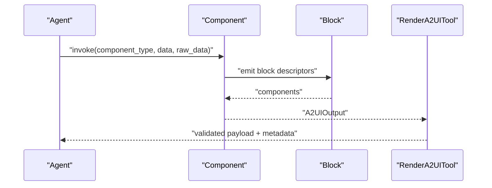

**Diagram sources**
- [components.py](file://src/ark_agentic/agents/insurance/a2ui/components.py)
- [blocks.py](file://src/ark_agentic/agents/insurance/a2ui/blocks.py)
- [render_a2ui.py](file://src/ark_agentic/core/tools/render_a2ui.py)

**Section sources**
- [components.py](file://src/ark_agentic/agents/insurance/a2ui/components.py)
- [blocks.py](file://src/ark_agentic/agents/insurance/a2ui/blocks.py)
- [render_a2ui.py](file://src/ark_agentic/core/tools/render_a2ui.py)

### Usage Examples and Patterns
- Forms: compose rows of labeled inputs using KVRow blocks and ActionButton to trigger actions.
- Cards: build summary headers and section cards with theme-consistent styling.
- Lists: leverage List components with dataSource bindings; transforms can precompute values.
- Interactive components: bind Button actions to tool calls; use inline transforms to compute values.

These patterns are demonstrated by the insurance components and blocks, which construct cards, headers, and action buttons with consistent theming and data binding.

**Section sources**
- [components.py](file://src/ark_agentic/agents/insurance/a2ui/components.py)
- [blocks.py](file://src/ark_agentic/agents/insurance/a2ui/blocks.py)

### Guidelines for Custom Block Development
- Define a block builder that accepts data and an id generator, returning a list of component descriptors.
- Use theme tokens for colors and spacing to ensure consistency.
- Keep block builders pure and free of side effects; defer business logic to components.
- Register blocks with the agent’s block registry.

**Section sources**
- [blocks.py](file://src/ark_agentic/core/a2ui/blocks.py)
- [blocks.py](file://src/ark_agentic/agents/insurance/a2ui/blocks.py)

### Theme Customization and UI Styling
- Override A2UITheme fields to change brand colors, spacing, and radii.
- Apply theme defaults in block factories to maintain visual coherence.
- Use theme-aware props in components for consistent padding, gaps, and typography.

**Section sources**
- [theme.py](file://src/ark_agentic/core/a2ui/theme.py)
- [blocks.py](file://src/ark_agentic/agents/insurance/a2ui/blocks.py)
- [components.py](file://src/ark_agentic/agents/insurance/a2ui/components.py)

### Accessibility and Responsive Design
- Bindings must specify either path or literalString for each field; avoid both or neither.
- Ensure component references (children/child/emptyChild) resolve to existing ids.
- Prefer semantic components (Text, Button, List) and consistent spacing for readability.
- Use theme-defined densities and widths to support responsive layouts.

**Section sources**
- [validator.py](file://src/ark_agentic/core/a2ui/validator.py)
- [theme.py](file://src/ark_agentic/core/a2ui/theme.py)

### Integration with Existing Web Applications
- The unified tool returns validated A2UI payloads suitable for frontend consumption.
- SurfaceId and session scoping enable incremental updates or new surfaces.
- Lean presets can be returned directly for fast rendering without full component trees.

**Section sources**
- [render_a2ui.py](file://src/ark_agentic/core/tools/render_a2ui.py)

### A2UI Contract Models and Validation Schemas
- Event-level contracts define supported events and allowed fields.
- Component-level validation enforces component types, props, and binding rules.
- Data coverage checks warn when path bindings reference missing keys.
- Environment variable controls strictness of validation.

**Section sources**
- [contract_models.py](file://src/ark_agentic/core/a2ui/contract_models.py)
- [validator.py](file://src/ark_agentic/core/a2ui/validator.py)
- [guard.py](file://src/ark_agentic/core/a2ui/guard.py)

## Dependency Analysis
A2UI modules exhibit low coupling and high cohesion:
- Core modules depend minimally on each other; responsibilities are clearly separated.
- Agent implementations depend on core blocks and theme.
- The unified tool aggregates all paths and delegates to core validators.

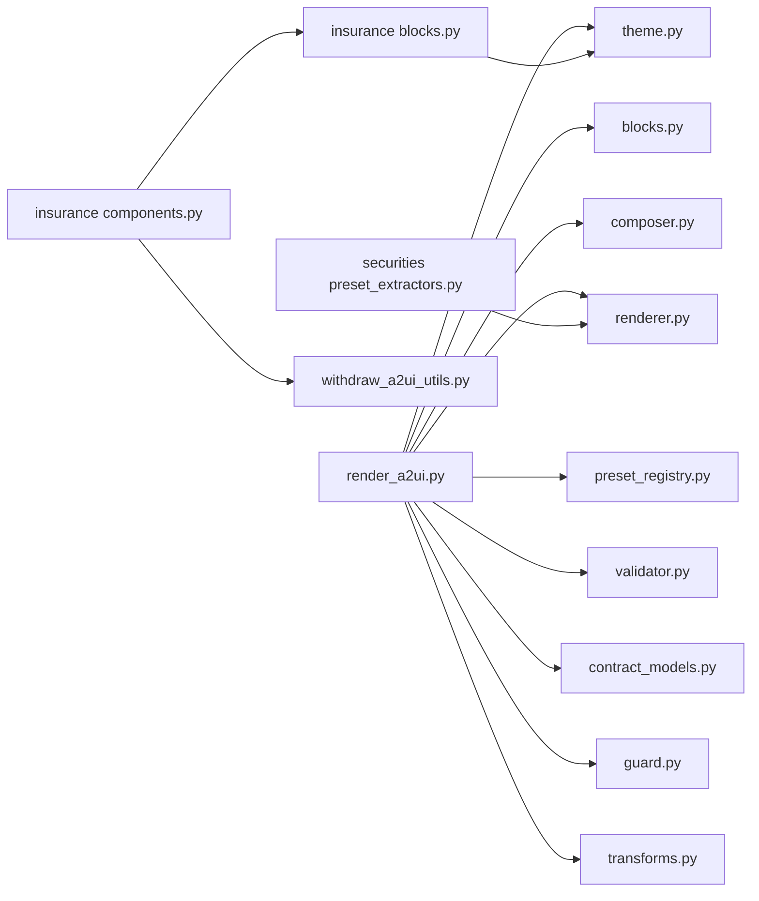

**Diagram sources**
- [render_a2ui.py](file://src/ark_agentic/core/tools/render_a2ui.py)
- [blocks.py](file://src/ark_agentic/core/a2ui/blocks.py)
- [composer.py](file://src/ark_agentic/core/a2ui/composer.py)
- [renderer.py](file://src/ark_agentic/core/a2ui/renderer.py)
- [theme.py](file://src/ark_agentic/core/a2ui/theme.py)
- [preset_registry.py](file://src/ark_agentic/core/a2ui/preset_registry.py)
- [validator.py](file://src/ark_agentic/core/a2ui/validator.py)
- [contract_models.py](file://src/ark_agentic/core/a2ui/contract_models.py)
- [guard.py](file://src/ark_agentic/core/a2ui/guard.py)
- [transforms.py](file://src/ark_agentic/core/a2ui/transforms.py)
- [blocks.py](file://src/ark_agentic/agents/insurance/a2ui/blocks.py)
- [components.py](file://src/ark_agentic/agents/insurance/a2ui/components.py)
- [withdraw_a2ui_utils.py](file://src/ark_agentic/agents/insurance/a2ui/withdraw_a2ui_utils.py)
- [preset_extractors.py](file://src/ark_agentic/agents/securities/a2ui/preset_extractors.py)

**Section sources**
- [__init__.py](file://src/ark_agentic/core/a2ui/__init__.py)
- [render_a2ui.py](file://src/ark_agentic/core/tools/render_a2ui.py)

## Performance Considerations
- Transform resolution occurs at compose-time; cache or memoize expensive computations in raw_data where appropriate.
- Prefer compact component trees and avoid deep nesting to reduce payload sizes.
- Use preset mode for rapid rendering when full component assembly is unnecessary.
- Validate early and fail fast to minimize retries and rework.

## Troubleshooting Guide
Common issues and resolutions:
- Unknown block type: ensure the block is registered in the agent’s registry.
- Binding errors: verify each binding specifies exactly one of path or literalString.
- Missing data coverage: ensure all path references exist in payload.data; ignore item.* wildcards resolved at render time.
- Template loading failures: confirm template.json exists and is valid JSON.
- Strict validation errors: adjust environment to warning mode for diagnostics or fix contract violations.

**Section sources**
- [blocks.py](file://src/ark_agentic/core/a2ui/blocks.py)
- [guard.py](file://src/ark_agentic/core/a2ui/guard.py)
- [validator.py](file://src/ark_agentic/core/a2ui/validator.py)
- [renderer.py](file://src/ark_agentic/core/a2ui/renderer.py)

## Conclusion
A2UI provides a robust, extensible framework for dynamic UI generation. By separating concerns across blocks, components, themes, transforms, and validators, it enables agents to produce consistent, reliable, and visually coherent user interfaces. The unified tool simplifies integration and supports flexible rendering modes tailored to different use cases.

## Appendices

### Example UI Templates and Schemas
- Withdraw UI schema and sample demonstrate structured UI contracts and example payloads.
- These artifacts guide consistent UI design and validation.

**Section sources**
- [a2ui-withdraw-ui-schema.json](file://docs/a2ui/a2ui-withdraw-ui-schema.json)
- [a2ui-withdraw-plan-ui-sample.json](file://docs/a2ui/a2ui-withdraw-plan-ui-sample.json)