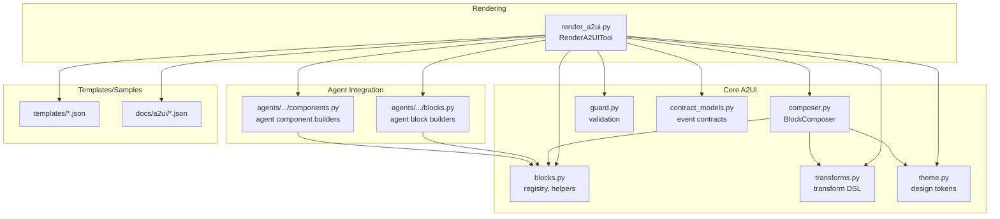
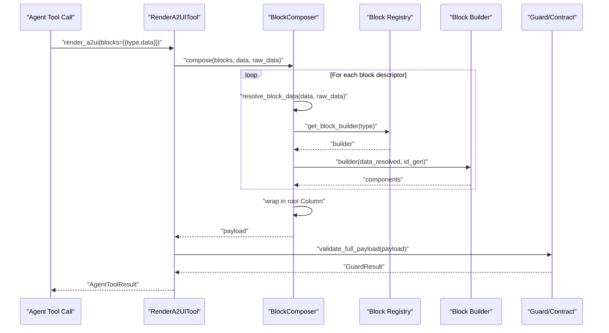
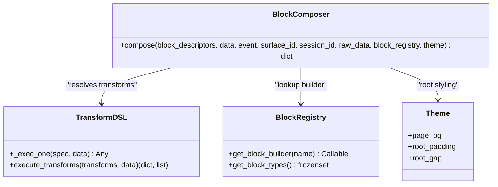
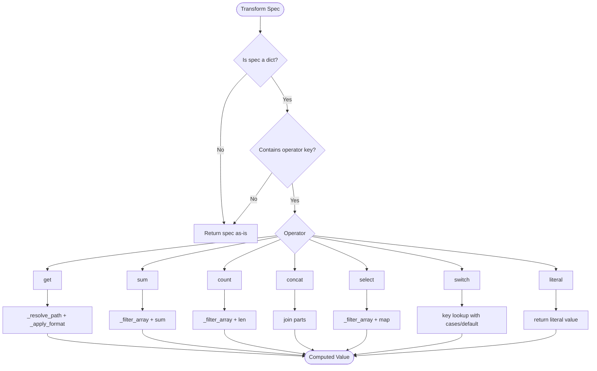
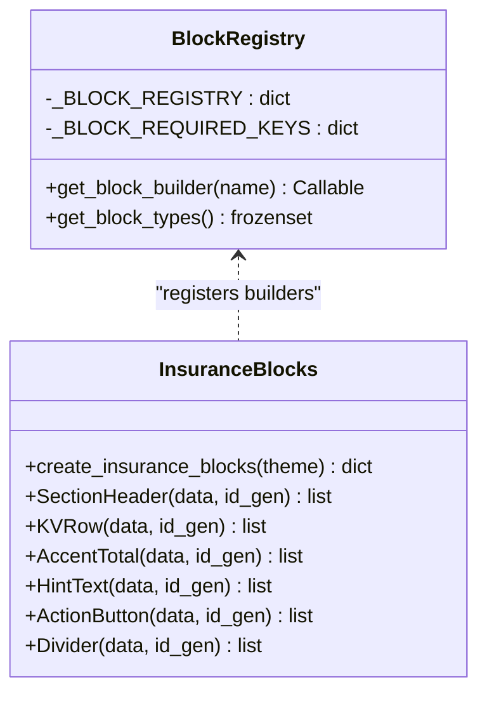
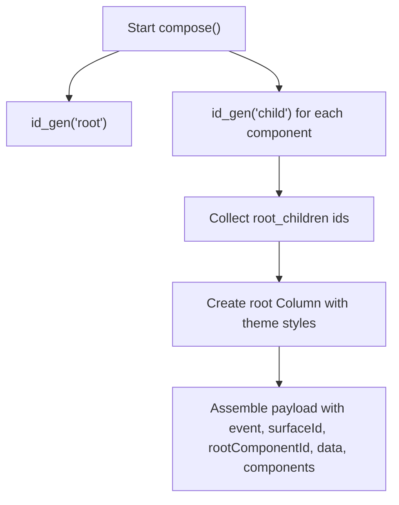
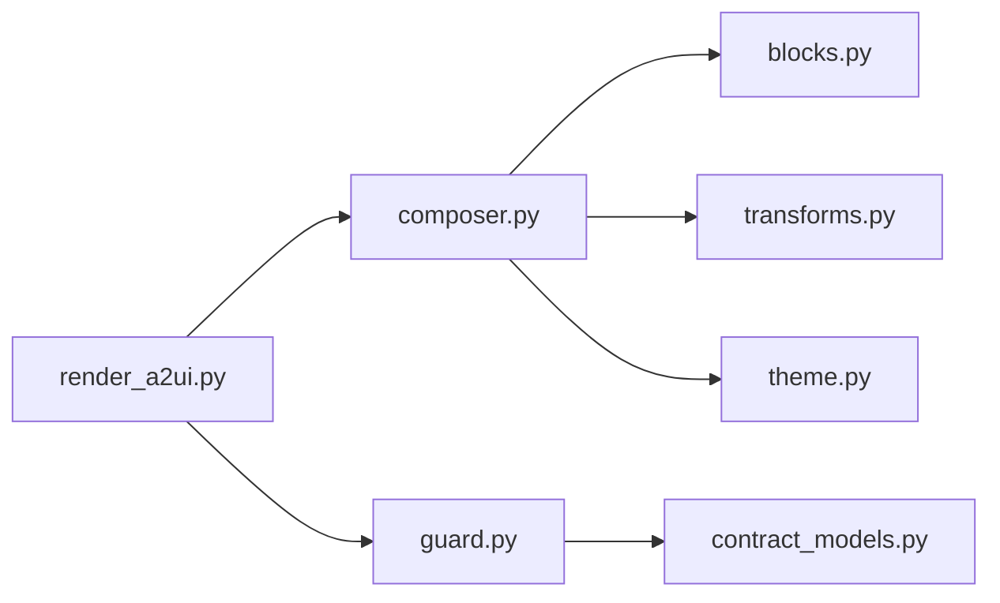

# Block Composition System

<cite>
**Referenced Files in This Document**
- [composer.py](file://src/ark_agentic/core/a2ui/composer.py)
- [blocks.py](file://src/ark_agentic/core/a2ui/blocks.py)
- [transforms.py](file://src/ark_agentic/core/a2ui/transforms.py)
- [theme.py](file://src/ark_agentic/core/a2ui/theme.py)
- [guard.py](file://src/ark_agentic/core/a2ui/guard.py)
- [contract_models.py](file://src/ark_agentic/core/a2ui/contract_models.py)
- [render_a2ui.py](file://src/ark_agentic/core/tools/render_a2ui.py)
- [blocks.py (insurance agent)](file://src/ark_agentic/agents/insurance/a2ui/blocks.py)
- [components.py (insurance agent)](file://src/ark_agentic/agents/insurance/a2ui/components.py)
- [test_block_composer.py](file://tests/unit/core/test_block_composer.py)
- [a2ui-withdraw-plan-ui-sample.json](file://docs/a2ui/a2ui-withdraw-plan-ui-sample.json)
- [template.json (policy_detail)](file://src/ark_agentic/agents/insurance/a2ui/templates/policy_detail/template.json)
- [template.json (withdraw_plan)](file://src/ark_agentic/agents/insurance/a2ui/templates/withdraw_plan/template.json)
</cite>

## Table of Contents
1. [Introduction](#introduction)
2. [Project Structure](#project-structure)
3. [Core Components](#core-components)
4. [Architecture Overview](#architecture-overview)
5. [Detailed Component Analysis](#detailed-component-analysis)
6. [Dependency Analysis](#dependency-analysis)
7. [Performance Considerations](#performance-considerations)
8. [Troubleshooting Guide](#troubleshooting-guide)
9. [Conclusion](#conclusion)
10. [Appendices](#appendices)

## Introduction
This document explains the A2UI block composition system with a focus on the BlockComposer class and block descriptor processing. It covers how block descriptors with "type" and "data" keys are transformed into complete UI components, the inline transform specification system (operators like get, sum, count, concat, select, switch, and literal), the block registry lookup mechanism, custom block builder integration, ID generation strategy, component assembly, and automatic root Column wrapping. Practical examples demonstrate creating block descriptors, applying transformations, and handling complex data binding scenarios. Error handling during transform resolution and debugging techniques are also included.

## Project Structure
The A2UI block composition system spans several modules:
- Core composition and transforms: composer.py, blocks.py, transforms.py, theme.py, guard.py, contract_models.py
- Rendering tool integration: render_a2ui.py
- Agent-specific blocks and components: agents/insurance/a2ui/blocks.py, agents/insurance/a2ui/components.py
- Templates and samples: agents/insurance/a2ui/templates/*, docs/a2ui/*.json
- Tests: tests/unit/core/test_block_composer.py

**Diagram sources**
- [composer.py:57-122](file://src/ark_agentic/core/a2ui/composer.py#L57-L122)
- [blocks.py:96-149](file://src/ark_agentic/core/a2ui/blocks.py#L96-L149)
- [transforms.py:186-316](file://src/ark_agentic/core/a2ui/transforms.py#L186-L316)
- [theme.py:12-39](file://src/ark_agentic/core/a2ui/theme.py#L12-L39)
- [guard.py:83-124](file://src/ark_agentic/core/a2ui/guard.py#L83-L124)
- [contract_models.py:97-123](file://src/ark_agentic/core/a2ui/contract_models.py#L97-L123)
- [render_a2ui.py:178-662](file://src/ark_agentic/core/tools/render_a2ui.py#L178-L662)
- [blocks.py (insurance agent):25-145](file://src/ark_agentic/agents/insurance/a2ui/blocks.py#L25-L145)
- [components.py (insurance agent):69-521](file://src/ark_agentic/agents/insurance/a2ui/components.py#L69-L521)

**Section sources**
- [composer.py:1-123](file://src/ark_agentic/core/a2ui/composer.py#L1-L123)
- [blocks.py:1-149](file://src/ark_agentic/core/a2ui/blocks.py#L1-L149)
- [transforms.py:1-396](file://src/ark_agentic/core/a2ui/transforms.py#L1-L396)
- [theme.py:1-39](file://src/ark_agentic/core/a2ui/theme.py#L1-L39)
- [guard.py:1-125](file://src/ark_agentic/core/a2ui/guard.py#L1-L125)
- [contract_models.py:1-123](file://src/ark_agentic/core/a2ui/contract_models.py#L1-L123)
- [render_a2ui.py:1-685](file://src/ark_agentic/core/tools/render_a2ui.py#L1-L685)
- [blocks.py (insurance agent):1-145](file://src/ark_agentic/agents/insurance/a2ui/blocks.py#L1-L145)
- [components.py (insurance agent):1-593](file://src/ark_agentic/agents/insurance/a2ui/components.py#L1-L593)

## Core Components
- BlockComposer: orchestrates block descriptors into a complete A2UI payload. It resolves inline transforms, looks up builders (agent blocks or core registry), collects components, and wraps them under a root Column.
- Block registry and helpers: maintains a registry of block builders, enforces required keys, and provides helper utilities for component construction and binding resolution.
- Transform DSL: executes inline transform specs (get, sum, count, concat, select, switch, literal) against raw business data.
- Theme: centralizes visual design tokens used by builders and composers.
- Validation: validates event contracts, component structure, and data coverage.

**Section sources**
- [composer.py:57-122](file://src/ark_agentic/core/a2ui/composer.py#L57-L122)
- [blocks.py:96-149](file://src/ark_agentic/core/a2ui/blocks.py#L96-L149)
- [transforms.py:186-316](file://src/ark_agentic/core/a2ui/transforms.py#L186-L316)
- [theme.py:12-39](file://src/ark_agentic/core/a2ui/theme.py#L12-L39)
- [guard.py:83-124](file://src/ark_agentic/core/a2ui/guard.py#L83-L124)

## Architecture Overview
The system supports three rendering modes via a unified tool. For the blocks mode (focus of this document), RenderA2UITool delegates to BlockComposer, which:
- Resolves inline transform specs in block data
- Looks up the block builder (agent blocks or core registry)
- Invokes the builder to produce components
- Assembles a root Column and returns a validated A2UI payload

**Diagram sources**
- [render_a2ui.py:328-458](file://src/ark_agentic/core/tools/render_a2ui.py#L328-L458)
- [composer.py:60-122](file://src/ark_agentic/core/a2ui/composer.py#L60-L122)
- [blocks.py:120-127](file://src/ark_agentic/core/a2ui/blocks.py#L120-L127)
- [guard.py:83-124](file://src/ark_agentic/core/a2ui/guard.py#L83-L124)

## Detailed Component Analysis

### BlockComposer: Descriptor to Payload
Responsibilities:
- Resolve inline transform specs in block data
- Lookup block builder (agent registry or core registry)
- Invoke builder and collect components
- Generate IDs and assemble root Column
- Build final A2UI payload with surfaceId, rootComponentId, and components

Key behaviors:
- Inline transform resolution: _resolve_value and resolve_block_data traverse dicts and lists, invoking _exec_one for transform specs.
- Builder lookup: prefers block_registry override, falls back to get_block_builder.
- Root Column: all child component ids are collected and wrapped in a Column with theme-driven padding/gap/background.
- Surface ID: uses provided surface_id or generates a dynamic one based on session_id.

**Diagram sources**
- [composer.py:57-122](file://src/ark_agentic/core/a2ui/composer.py#L57-L122)
- [transforms.py:186-316](file://src/ark_agentic/core/a2ui/transforms.py#L186-L316)
- [blocks.py:120-131](file://src/ark_agentic/core/a2ui/blocks.py#L120-L131)
- [theme.py:12-39](file://src/ark_agentic/core/a2ui/theme.py#L12-L39)

**Section sources**
- [composer.py:57-122](file://src/ark_agentic/core/a2ui/composer.py#L57-L122)

### Inline Transform Specification System
Operators supported:
- get: fetch a value by path with optional default and format
- sum: sum numeric fields across filtered arrays
- count: count items in filtered arrays
- concat: join strings from parts (strings, dicts, or literals)
- select: filter arrays and optionally map fields with formatting
- switch: map a key value to a label or literal
- literal: return a constant value

Execution flow:
- _exec_one dispatches to the appropriate operator
- _resolve_path handles dot-notation and array indexing/wildcards
- _eval_condition supports simple comparisons and logical combinations
- _apply_format applies currency, percent, integer, or raw formatting

**Diagram sources**
- [transforms.py:186-316](file://src/ark_agentic/core/a2ui/transforms.py#L186-L316)
- [transforms.py:62-114](file://src/ark_agentic/core/a2ui/transforms.py#L62-L114)
- [transforms.py:175-184](file://src/ark_agentic/core/a2ui/transforms.py#L175-L184)
- [transforms.py:117-173](file://src/ark_agentic/core/a2ui/transforms.py#L117-L173)

**Section sources**
- [transforms.py:186-316](file://src/ark_agentic/core/a2ui/transforms.py#L186-L316)

### Block Registry and Custom Builders
- Registry: _BLOCK_REGISTRY stores builder callables keyed by type; _BLOCK_REQUIRED_KEYS enforces required keys via a wrapper that raises BlockDataError when missing.
- Lookup: get_block_builder returns the builder or raises a ValueError with available types.
- Agent integration: agents/insurance/a2ui/blocks.py registers block builders (e.g., SectionHeader, KVRow, AccentTotal, HintText, ActionButton, Divider) via a factory that binds theme.

**Diagram sources**
- [blocks.py:96-131](file://src/ark_agentic/core/a2ui/blocks.py#L96-L131)
- [blocks.py (insurance agent):25-145](file://src/ark_agentic/agents/insurance/a2ui/blocks.py#L25-L145)

**Section sources**
- [blocks.py:96-131](file://src/ark_agentic/core/a2ui/blocks.py#L96-L131)
- [blocks.py (insurance agent):25-145](file://src/ark_agentic/agents/insurance/a2ui/blocks.py#L25-L145)

### ID Generation Strategy and Component Assembly
- ID generator: BlockComposer uses an internal id_gen(prefix) that yields unique ids like "prefix-001", "prefix-002", etc.
- Root Column: all child component ids are collected and wrapped in a Column with width=100, backgroundColor from theme.page_bg, padding from theme.root_padding, gap from theme.root_gap, and children as an explicitList.
- Surface ID: if surface_id is provided, it is used; otherwise a dynamic id is generated using session_id prefix and random hex.

**Diagram sources**
- [composer.py:74-122](file://src/ark_agentic/core/a2ui/composer.py#L74-L122)

**Section sources**
- [composer.py:74-122](file://src/ark_agentic/core/a2ui/composer.py#L74-L122)

### Practical Examples

#### Example 1: Creating a Block Descriptor with Inline Transforms
- Descriptor: {"type": "KVRow", "data": {"label": "Amount", "value": {"get": "$.summary.total", "format": "currency"}}}
- Behavior: The "value" field is an inline transform spec. During compose, resolve_block_data invokes _exec_one with the raw_data to compute the currency-formatted value.

**Section sources**
- [composer.py:45-54](file://src/ark_agentic/core/a2ui/composer.py#L45-L54)
- [transforms.py:300-313](file://src/ark_agentic/core/a2ui/transforms.py#L300-L313)

#### Example 2: Using select with map and formatting
- Descriptor: {"type": "SectionHeader", "data": {"title": {"select": "$.options", "where": {"field": ">= 100"}, "map": {"label": "$.name", "value": {"get": "$.amount", "format": "currency"}}}}}
- Behavior: select filters the array, then map computes label and value per item, applying formatting.

**Section sources**
- [transforms.py:200-231](file://src/ark_agentic/core/a2ui/transforms.py#L200-L231)

#### Example 3: Applying switch for label mapping
- Descriptor: {"type": "HintText", "data": {"text": {"switch": "$.risk_level", "cases": {"high": "High risk", "medium": "Medium risk"}, "default": "Unknown"}}}
- Behavior: switch maps the risk_level value to a human-readable label.

**Section sources**
- [transforms.py:281-298](file://src/ark_agentic/core/a2ui/transforms.py#L281-L298)

#### Example 4: Complex data binding with concat
- Descriptor: {"type": "AccentTotal", "data": {"label": "Total", "value": {"concat": ["¥", {"get": "$.summary.total", "format": "int"}]}}}
- Behavior: concat joins a literal and a computed value.

**Section sources**
- [transforms.py:262-276](file://src/ark_agentic/core/a2ui/transforms.py#L262-L276)

#### Example 5: Agent block builder integration
- Descriptor: {"type": "SectionHeader", "data": {"title": "Coverage Info", "tag": "Important"}}
- Behavior: get_block_builder("SectionHeader") returns the builder from the agent’s registry; the builder constructs a Row with Line, Text, and optional Tag.

**Section sources**
- [blocks.py (insurance agent):29-60](file://src/ark_agentic/agents/insurance/a2ui/blocks.py#L29-L60)

### Automatic Root Column Wrapping
- Every composed payload includes a root Column component that:
  - Sets width to 100
  - Uses theme.page_bg for backgroundColor
  - Applies theme.root_padding for padding
  - Applies theme.root_gap for gap
  - Contains all child component ids in children.explicitList

**Section sources**
- [composer.py:96-108](file://src/ark_agentic/core/a2ui/composer.py#L96-L108)
- [theme.py:37-39](file://src/ark_agentic/core/a2ui/theme.py#L37-L39)

### Validation and Contract Compliance
- Event-level validation: validate_event_payload ensures required fields per event type and allowed fields.
- Component-level validation: validate_payload checks component structure and bindings.
- Data coverage: validate_data_coverage warns for unresolved path bindings not present in payload.data.

**Section sources**
- [contract_models.py:97-123](file://src/ark_agentic/core/a2ui/contract_models.py#L97-L123)
- [guard.py:83-124](file://src/ark_agentic/core/a2ui/guard.py#L83-L124)

## Dependency Analysis
- BlockComposer depends on:
  - blocks.py for registry and helper utilities
  - transforms.py for inline transform execution
  - theme.py for root styling
- RenderA2UITool integrates BlockComposer and adds:
  - Grammar-guided schema generation for blocks
  - Optional agent components expansion
  - Full payload validation and enrichment

**Diagram sources**
- [render_a2ui.py:178-662](file://src/ark_agentic/core/tools/render_a2ui.py#L178-L662)
- [composer.py:57-122](file://src/ark_agentic/core/a2ui/composer.py#L57-L122)
- [blocks.py:96-149](file://src/ark_agentic/core/a2ui/blocks.py#L96-L149)
- [transforms.py:186-316](file://src/ark_agentic/core/a2ui/transforms.py#L186-L316)
- [theme.py:12-39](file://src/ark_agentic/core/a2ui/theme.py#L12-L39)
- [guard.py:83-124](file://src/ark_agentic/core/a2ui/guard.py#L83-L124)
- [contract_models.py:97-123](file://src/ark_agentic/core/a2ui/contract_models.py#L97-L123)

**Section sources**
- [render_a2ui.py:178-662](file://src/ark_agentic/core/tools/render_a2ui.py#L178-L662)
- [composer.py:57-122](file://src/ark_agentic/core/a2ui/composer.py#L57-L122)

## Performance Considerations
- Transform evaluation is deterministic and operates on raw data; avoid overly complex nested selects and excessive concatenations in hot paths.
- Prefer array wildcards judiciously; they iterate over arrays and can be expensive for large datasets.
- Reuse themes and builders to minimize repeated allocations.
- Keep block descriptors concise; unnecessary nesting increases traversal cost.

## Troubleshooting Guide
Common issues and resolutions:
- Unknown block type: Ensure the block type exists in the registry and is properly registered. The lookup raises a ValueError listing available types.
- Missing required keys: If a builder is wrapped with required keys, BlockDataError is raised with the missing keys.
- Transform resolution failures: Inline transform failures log a warning and fall back to passthrough values. Inspect logs for keys with warnings.
- Validation errors: validate_full_payload aggregates event contract, component, and data coverage issues. Review GuardResult.errors and warnings.

Debugging tips:
- Enable strict validation to turn contract violations into errors.
- Use test_block_composer to validate basic behaviors and surfaceId handling.
- Inspect the final payload structure against sample templates to confirm expected shapes.

**Section sources**
- [blocks.py:120-127](file://src/ark_agentic/core/a2ui/blocks.py#L120-L127)
- [composer.py:49-53](file://src/ark_agentic/core/a2ui/composer.py#L49-L53)
- [guard.py:83-124](file://src/ark_agentic/core/a2ui/guard.py#L83-L124)
- [test_block_composer.py:149-201](file://tests/unit/core/test_block_composer.py#L149-L201)

## Conclusion
The A2UI block composition system provides a robust, extensible pipeline for transforming block descriptors into validated UI payloads. Inline transforms enable dynamic data binding, while the registry and theme system support agent customization and consistent styling. The unified tool integrates composition with validation and optional template/preset modes, ensuring reliable rendering across diverse use cases.

## Appendices

### Appendix A: Sample Payload Reference
- Withdraw plan UI sample payload demonstrates a root Column containing cards and rows, with data-bound Text components and Button actions.

**Section sources**
- [a2ui-withdraw-plan-ui-sample.json:1-785](file://docs/a2ui/a2ui-withdraw-plan-ui-sample.json#L1-L785)

### Appendix B: Template-Based Rendering
- Policy detail and withdraw plan templates show how static templates define component hierarchies and data bindings, useful for understanding binding patterns and component composition.

**Section sources**
- [template.json (policy_detail):1-310](file://src/ark_agentic/agents/insurance/a2ui/templates/policy_detail/template.json#L1-L310)
- [template.json (withdraw_plan):1-608](file://src/ark_agentic/agents/insurance/a2ui/templates/withdraw_plan/template.json#L1-L608)