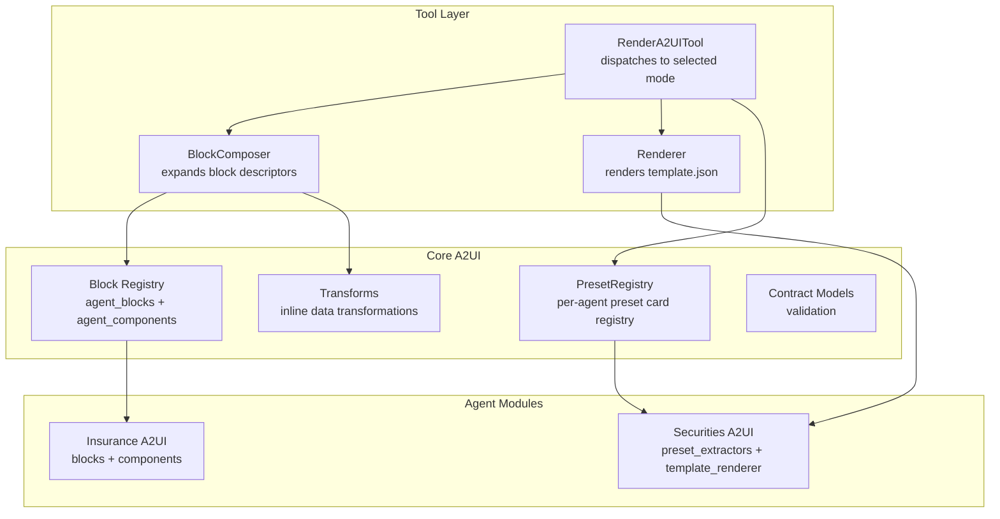
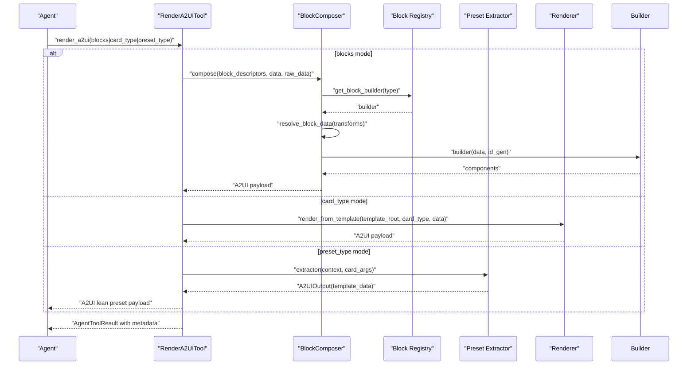
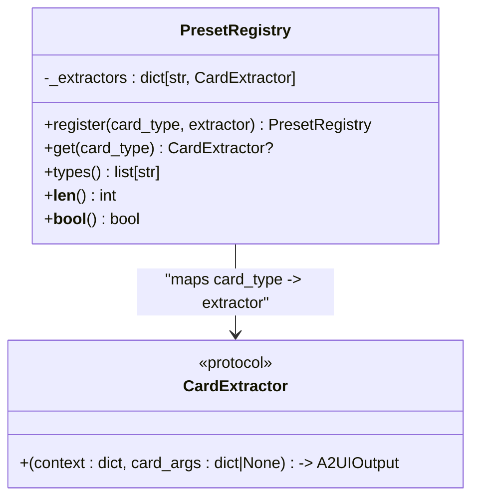
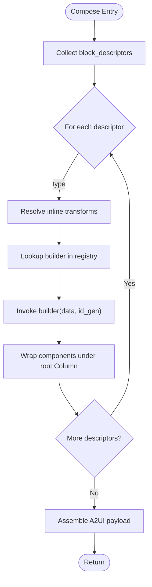
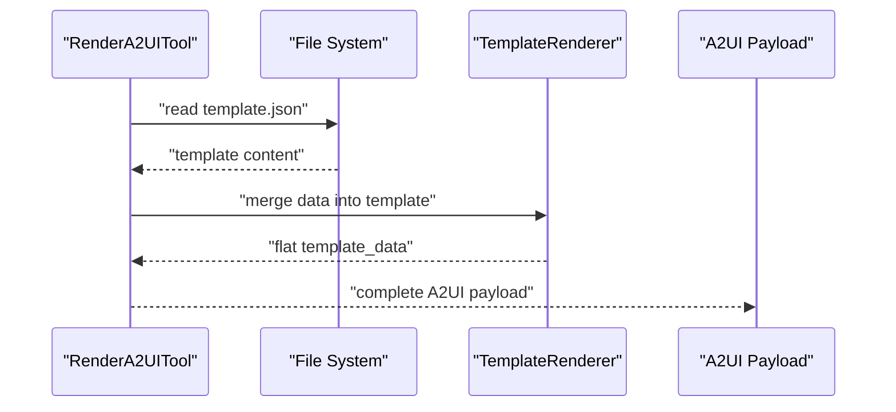
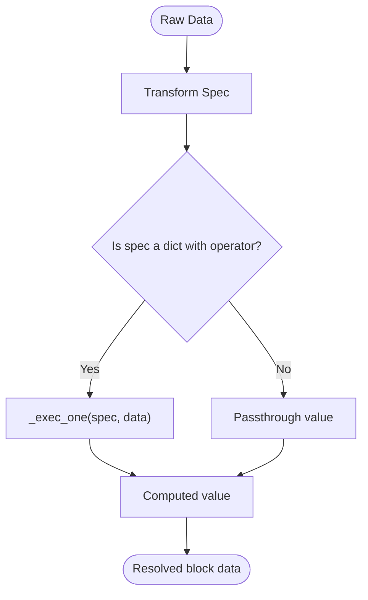
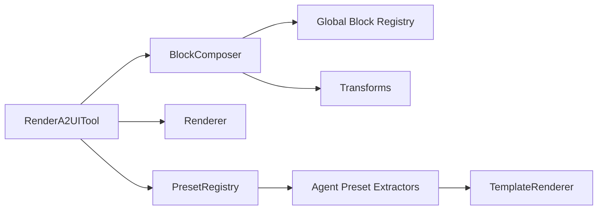

# Component Registry and Presets

<cite>
**Referenced Files in This Document**
- [preset_registry.py](file://src/ark_agentic/core/a2ui/preset_registry.py)
- [blocks.py](file://src/ark_agentic/core/a2ui/blocks.py)
- [composer.py](file://src/ark_agentic/core/a2ui/composer.py)
- [renderer.py](file://src/ark_agentic/core/a2ui/renderer.py)
- [transforms.py](file://src/ark_agentic/core/a2ui/transforms.py)
- [render_a2ui.py](file://src/ark_agentic/core/tools/render_a2ui.py)
- [contract_models.py](file://src/ark_agentic/core/a2ui/contract_models.py)
- [blocks.py (Insurance)](file://src/ark_agentic/agents/insurance/a2ui/blocks.py)
- [components.py (Insurance)](file://src/ark_agentic/agents/insurance/a2ui/components.py)
- [preset_extractors.py (Securities)](file://src/ark_agentic/agents/securities/a2ui/preset_extractors.py)
- [template_renderer.py (Securities)](file://src/ark_agentic/agents/securities/template_renderer.py)
- [template.json (Policy Detail)](file://src/ark_agentic/agents/insurance/a2ui/templates/policy_detail/template.json)
- [template.json (Withdraw Plan)](file://src/ark_agentic/agents/insurance/a2ui/templates/withdraw_plan/template.json)
- [template.json (Withdraw Summary)](file://src/ark_agentic/agents/insurance/a2ui/templates/withdraw_summary/template.json)
- [test_preset_registry.py](file://tests/unit/core/test_preset_registry.py)
- [test_a2ui_presets.py](file://tests/unit/agents/securities/test_a2ui_presets.py)
</cite>

## Table of Contents
1. [Introduction](#introduction)
2. [Project Structure](#project-structure)
3. [Core Components](#core-components)
4. [Architecture Overview](#architecture-overview)
5. [Detailed Component Analysis](#detailed-component-analysis)
6. [Dependency Analysis](#dependency-analysis)
7. [Performance Considerations](#performance-considerations)
8. [Troubleshooting Guide](#troubleshooting-guide)
9. [Conclusion](#conclusion)
10. [Appendices](#appendices)

## Introduction
This document explains the A2UI component registry system with a focus on the preset registry and block builder management. It describes how the system maintains mappings between block types and their builder functions, how presets provide standardized UI templates, and how agents can leverage reusable component patterns. It covers the block registration process, guidelines for developing custom blocks, the relationship between registry entries and component instantiation, preset discovery and resolution, and practical examples for extending the registry with domain-specific components. The goal is to help developers build scalable, maintainable UI generation systems that integrate seamlessly with agent workflows.

## Project Structure
The A2UI subsystem is organized around three primary pathways:
- Dynamic blocks: LLM-provided block descriptors are composed into a full A2UI payload.
- Template-based cards: Predefined template.json files are rendered with extracted data.
- Preset cards: Extractors return ready-to-consume payloads for lean, fast rendering.

**Diagram sources**
- [render_a2ui.py:178-685](file://src/ark_agentic/core/tools/render_a2ui.py#L178-L685)
- [composer.py:57-123](file://src/ark_agentic/core/a2ui/composer.py#L57-L123)
- [renderer.py:15-53](file://src/ark_agentic/core/a2ui/renderer.py#L15-L53)
- [preset_registry.py:25-53](file://src/ark_agentic/core/a2ui/preset_registry.py#L25-L53)
- [blocks.py:98-132](file://src/ark_agentic/core/a2ui/blocks.py#L98-L132)
- [blocks.py (Insurance):25-145](file://src/ark_agentic/agents/insurance/a2ui/blocks.py#L25-L145)
- [components.py (Insurance):69-521](file://src/ark_agentic/agents/insurance/a2ui/components.py#L69-L521)
- [preset_extractors.py (Securities):208-222](file://src/ark_agentic/agents/securities/a2ui/preset_extractors.py#L208-L222)
- [template_renderer.py (Securities):12-369](file://src/ark_agentic/agents/securities/template_renderer.py#L12-L369)

**Section sources**
- [render_a2ui.py:178-685](file://src/ark_agentic/core/tools/render_a2ui.py#L178-L685)
- [composer.py:57-123](file://src/ark_agentic/core/a2ui/composer.py#L57-L123)
- [renderer.py:15-53](file://src/ark_agentic/core/a2ui/renderer.py#L15-L53)
- [preset_registry.py:25-53](file://src/ark_agentic/core/a2ui/preset_registry.py#L25-L53)
- [blocks.py:98-132](file://src/ark_agentic/core/a2ui/blocks.py#L98-L132)

## Core Components
- PresetRegistry: A per-agent registry mapping card types to extractor functions. Extractors return A2UIOutput with template_data for direct frontend consumption.
- Block Registry: A global registry mapping block type names to builder functions. Builders accept typed data and an id generator, returning lists of component descriptors.
- BlockComposer: Expands block descriptors into a full A2UI payload by resolving transforms, invoking block builders, and wrapping components under a root Column.
- Renderer: Loads template.json from disk, merges data, injects surface identifiers, and returns a complete A2UI payload.
- Transforms: Executes inline transform specs (get/sum/count/select/switch/literal) to derive UI-ready values from raw business data.
- RenderA2UITool: Unified tool orchestrating the three rendering modes (blocks, card_type, preset_type), parameter generation, and validation.

**Section sources**
- [preset_registry.py:25-53](file://src/ark_agentic/core/a2ui/preset_registry.py#L25-L53)
- [blocks.py:98-132](file://src/ark_agentic/core/a2ui/blocks.py#L98-L132)
- [composer.py:57-123](file://src/ark_agentic/core/a2ui/composer.py#L57-L123)
- [renderer.py:15-53](file://src/ark_agentic/core/a2ui/renderer.py#L15-L53)
- [transforms.py:186-316](file://src/ark_agentic/core/a2ui/transforms.py#L186-L316)
- [render_a2ui.py:178-685](file://src/ark_agentic/core/tools/render_a2ui.py#L178-L685)

## Architecture Overview
The system supports three mutually exclusive rendering modes per tool invocation. The RenderA2UITool dynamically builds parameters based on which configurations are provided (BlocksConfig, TemplateConfig, PresetRegistry). It dispatches to the appropriate pathway and attaches LLM digest/state deltas to the result metadata.

**Diagram sources**
- [render_a2ui.py:328-631](file://src/ark_agentic/core/tools/render_a2ui.py#L328-L631)
- [composer.py:60-122](file://src/ark_agentic/core/a2ui/composer.py#L60-L122)
- [blocks.py:120-127](file://src/ark_agentic/core/a2ui/blocks.py#L120-L127)
- [renderer.py:15-53](file://src/ark_agentic/core/a2ui/renderer.py#L15-L53)
- [preset_registry.py:41-42](file://src/ark_agentic/core/a2ui/preset_registry.py#L41-L42)

## Detailed Component Analysis

### Preset Registry and Preset Cards
- Purpose: Provide predefined, frontend-ready payloads without composing block trees.
- Registration: Agents populate a PresetRegistry with card_type → extractor mappings.
- Resolution: RenderA2UITool retrieves the extractor by type and invokes it with context and optional card_args, returning template_data directly to the frontend.

**Diagram sources**
- [preset_registry.py:25-53](file://src/ark_agentic/core/a2ui/preset_registry.py#L25-L53)
- [render_a2ui.py:37-44](file://src/ark_agentic/core/tools/render_a2ui.py#L37-L44)

**Section sources**
- [preset_registry.py:25-53](file://src/ark_agentic/core/a2ui/preset_registry.py#L25-L53)
- [preset_extractors.py (Securities):208-222](file://src/ark_agentic/agents/securities/a2ui/preset_extractors.py#L208-L222)
- [render_a2ui.py:601-631](file://src/ark_agentic/core/tools/render_a2ui.py#L601-L631)

### Block Registry and Block Builders
- Purpose: Enable dynamic composition of UI components from LLM-provided block descriptors.
- Registration: Agents register block builders and component factories into BlocksConfig. The global registry stores block builders keyed by type.
- Resolution: BlockComposer resolves inline transforms, selects the appropriate builder (block or component), and generates component lists with stable IDs.

**Diagram sources**
- [composer.py:60-122](file://src/ark_agentic/core/a2ui/composer.py#L60-L122)
- [blocks.py:120-127](file://src/ark_agentic/core/a2ui/blocks.py#L120-L127)

**Section sources**
- [blocks.py:98-132](file://src/ark_agentic/core/a2ui/blocks.py#L98-L132)
- [composer.py:57-123](file://src/ark_agentic/core/a2ui/composer.py#L57-L123)
- [blocks.py (Insurance):25-145](file://src/ark_agentic/agents/insurance/a2ui/blocks.py#L25-L145)
- [components.py (Insurance):69-521](file://src/ark_agentic/agents/insurance/a2ui/components.py#L69-L521)

### Template-Based Cards
- Purpose: Render predefined UI structures from template.json files with data-driven bindings.
- Mechanism: RenderA2UITool loads template.json, merges flat data, injects surface identifiers, and returns a complete A2UI payload.

**Diagram sources**
- [render_a2ui.py:545-597](file://src/ark_agentic/core/tools/render_a2ui.py#L545-L597)
- [renderer.py:15-53](file://src/ark_agentic/core/a2ui/renderer.py#L15-L53)
- [template_renderer.py (Securities):12-369](file://src/ark_agentic/agents/securities/template_renderer.py#L12-L369)

**Section sources**
- [renderer.py:15-53](file://src/ark_agentic/core/a2ui/renderer.py#L15-L53)
- [template.json (Policy Detail):1-310](file://src/ark_agentic/agents/insurance/a2ui/templates/policy_detail/template.json#L1-L310)
- [template.json (Withdraw Plan):1-608](file://src/ark_agentic/agents/insurance/a2ui/templates/withdraw_plan/template.json#L1-L608)
- [template.json (Withdraw Summary):1-545](file://src/ark_agentic/agents/insurance/a2ui/templates/withdraw_summary/template.json#L1-L545)

### Transform Engine for Inline Data
- Purpose: Derive UI-ready values from raw business data using declarative transform specs.
- Operators: get, sum, count, concat, select, switch, literal. Paths support dot notation, array indices, and wildcards.
- Execution: resolve_block_data preprocesses block data; _exec_one executes individual specs; _resolve_item_spec handles per-item mapping in select.

**Diagram sources**
- [transforms.py:186-316](file://src/ark_agentic/core/a2ui/transforms.py#L186-L316)
- [composer.py:45-54](file://src/ark_agentic/core/a2ui/composer.py#L45-L54)

**Section sources**
- [transforms.py:186-316](file://src/ark_agentic/core/a2ui/transforms.py#L186-L316)
- [composer.py:45-54](file://src/ark_agentic/core/a2ui/composer.py#L45-L54)

### Contract Validation
- Purpose: Enforce strict A2UI event contracts and report warnings/errors.
- Coverage: beginRendering, surfaceUpdate, dataModelUpdate, deleteSurface with allowed fields and required constraints.

**Section sources**
- [contract_models.py:97-123](file://src/ark_agentic/core/a2ui/contract_models.py#L97-L123)

## Dependency Analysis
- RenderA2UITool depends on:
  - BlockComposer for dynamic composition
  - Renderer for template-based rendering
  - PresetRegistry for preset extraction
  - Contract validation for output correctness
- BlockComposer depends on:
  - Global block registry for builder lookup
  - Transform engine for data resolution
- Preset extractors depend on:
  - TemplateRenderer for structured payloads
  - Context/state for enrichment

**Diagram sources**
- [render_a2ui.py:178-685](file://src/ark_agentic/core/tools/render_a2ui.py#L178-L685)
- [composer.py:57-123](file://src/ark_agentic/core/a2ui/composer.py#L57-L123)
- [preset_registry.py:25-53](file://src/ark_agentic/core/a2ui/preset_registry.py#L25-L53)
- [template_renderer.py (Securities):12-369](file://src/ark_agentic/agents/securities/template_renderer.py#L12-L369)

**Section sources**
- [render_a2ui.py:178-685](file://src/ark_agentic/core/tools/render_a2ui.py#L178-L685)
- [composer.py:57-123](file://src/ark_agentic/core/a2ui/composer.py#L57-L123)
- [preset_registry.py:25-53](file://src/ark_agentic/core/a2ui/preset_registry.py#L25-L53)
- [template_renderer.py (Securities):12-369](file://src/ark_agentic/agents/securities/template_renderer.py#L12-L369)

## Performance Considerations
- Prefer preset cards for frequently reused UI patterns to minimize composition overhead.
- Use inline transforms judiciously; complex transforms increase per-descriptor compute time.
- Keep block descriptors shallow to avoid deep recursion in Card nesting.
- Validate payloads early to catch errors without sending malformed payloads to the frontend.
- Cache template rendering results when applicable to reduce IO overhead.

## Troubleshooting Guide
Common issues and resolutions:
- Unknown block type: Ensure the block type exists in the registry and matches the agent’s BlocksConfig.
- Missing required keys: Builders decorated with required keys raise BlockDataError; verify input data.
- Transform failures: Inline transform specs may fail on missing paths or invalid operators; check logs for warnings and adjust specs.
- Preset type not supported: Confirm the preset_type is registered in the PresetRegistry and matches the tool’s configuration.
- Contract violations: Review allowed fields and required fields for the current event; fix payload structure accordingly.

**Section sources**
- [blocks.py:102-117](file://src/ark_agentic/core/a2ui/blocks.py#L102-L117)
- [composer.py:45-54](file://src/ark_agentic/core/a2ui/composer.py#L45-L54)
- [render_a2ui.py:635-662](file://src/ark_agentic/core/tools/render_a2ui.py#L635-L662)
- [contract_models.py:97-123](file://src/ark_agentic/core/a2ui/contract_models.py#L97-L123)

## Conclusion
The A2UI component registry system provides a flexible, extensible foundation for generating UI content across domains. By separating concerns—block composition, template rendering, and preset extraction—the system enables agents to choose the most efficient rendering path for each scenario. The registry mechanisms ensure discoverability and maintainability, while the transform engine and validation layers guarantee correctness and robustness.

## Appendices

### How to Register Custom Blocks
- Define a block builder function that accepts typed data and an id generator, returning a list of component descriptors.
- Register the builder under a unique type name in the global block registry.
- Optionally, define required keys to enforce input validation.
- Use BlocksConfig to expose the block type to LLM-decoded block descriptors.

**Section sources**
- [blocks.py:102-117](file://src/ark_agentic/core/a2ui/blocks.py#L102-L117)
- [blocks.py (Insurance):25-145](file://src/ark_agentic/agents/insurance/a2ui/blocks.py#L25-L145)

### How to Develop Custom Components
- Build coarse-grained components that read raw_data, perform business logic, and return A2UIOutput with components, llm_digest, and state_delta.
- Expose component factories via a theme-bound dictionary for reuse across agents.
- Provide JSON Schemas for component data to guide LLM decoding.

**Section sources**
- [components.py (Insurance):69-521](file://src/ark_agentic/agents/insurance/a2ui/components.py#L69-L521)
- [render_a2ui.py:112-142](file://src/ark_agentic/core/tools/render_a2ui.py#L112-L142)

### Using Preset Templates
- Populate a PresetRegistry with card_type → extractor mappings.
- Implement extractors that enrich context-derived data and return A2UIOutput with template_data.
- Invoke RenderA2UITool with preset configuration to receive a lean, frontend-ready payload.

**Section sources**
- [preset_extractors.py (Securities):208-222](file://src/ark_agentic/agents/securities/a2ui/preset_extractors.py#L208-L222)
- [template_renderer.py (Securities):12-369](file://src/ark_agentic/agents/securities/template_renderer.py#L12-L369)
- [render_a2ui.py:601-631](file://src/ark_agentic/core/tools/render_a2ui.py#L601-L631)

### Extending the Registry with Domain-Specific Components
- Create domain-specific extractors and register them in a dedicated PresetRegistry instance.
- Provide a TemplateRenderer with domain-specific render_* methods to produce structured payloads.
- Wire the registry into RenderA2UITool via the preset configuration.

**Section sources**
- [preset_extractors.py (Securities):208-222](file://src/ark_agentic/agents/securities/a2ui/preset_extractors.py#L208-L222)
- [template_renderer.py (Securities):12-369](file://src/ark_agentic/agents/securities/template_renderer.py#L12-L369)

### Block Discovery and Resolution During Composition
- RenderA2UITool constructs parameters dynamically based on available modes.
- For blocks mode, it resolves transforms, selects builders from either agent_blocks or agent_components, and composes a full payload.
- For preset mode, it retrieves the extractor from the registry and returns template_data directly.

**Section sources**
- [render_a2ui.py:244-325](file://src/ark_agentic/core/tools/render_a2ui.py#L244-L325)
- [composer.py:60-122](file://src/ark_agentic/core/a2ui/composer.py#L60-L122)
- [blocks.py:120-127](file://src/ark_agentic/core/a2ui/blocks.py#L120-L127)

### Guidelines for Organizing and Maintaining a Scalable Registry
- Keep block/component factories theme-bound for consistent styling across agents.
- Provide JSON Schemas for block/component data to improve LLM decoding accuracy.
- Use required keys in block registrations to enforce input contracts.
- Centralize preset extractors per domain and expose them via a dedicated registry.
- Validate payloads against strict contracts to prevent runtime UI issues.

**Section sources**
- [blocks.py:102-117](file://src/ark_agentic/core/a2ui/blocks.py#L102-L117)
- [render_a2ui.py:112-142](file://src/ark_agentic/core/tools/render_a2ui.py#L112-L142)
- [contract_models.py:97-123](file://src/ark_agentic/core/a2ui/contract_models.py#L97-L123)