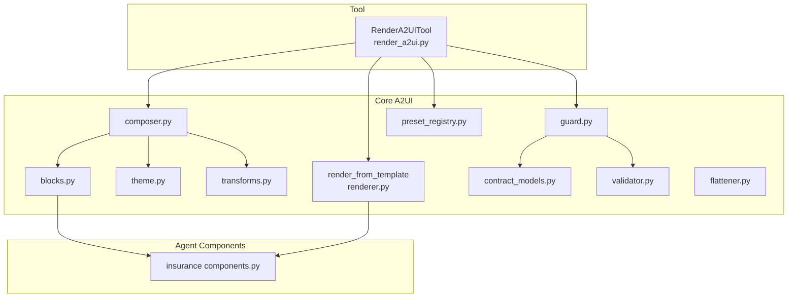
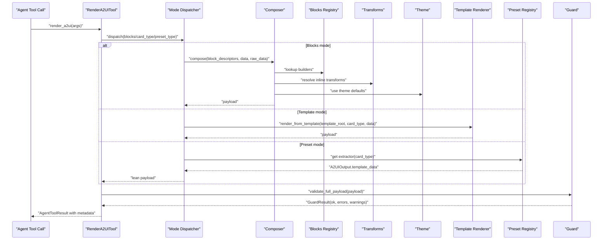
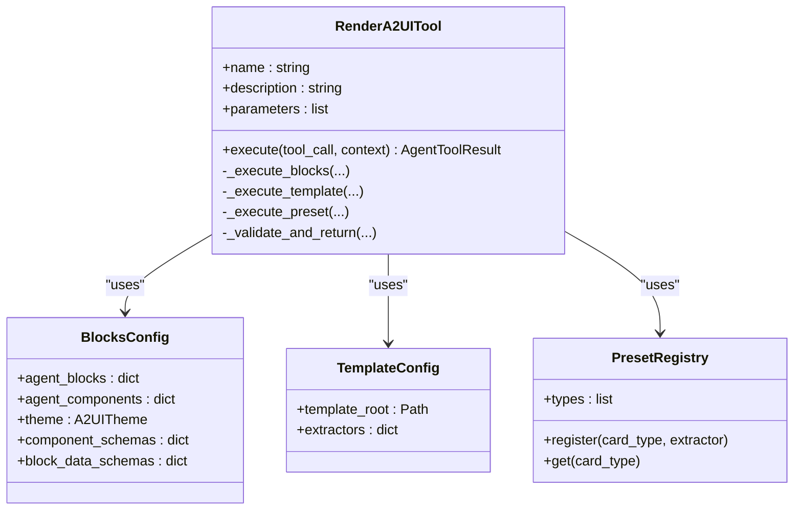
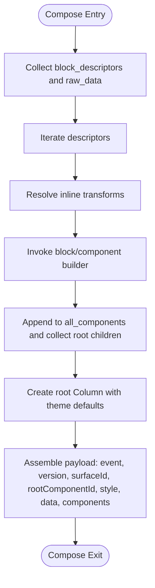
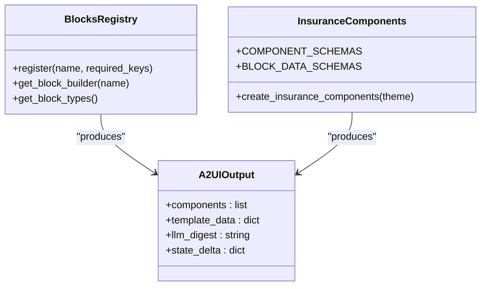
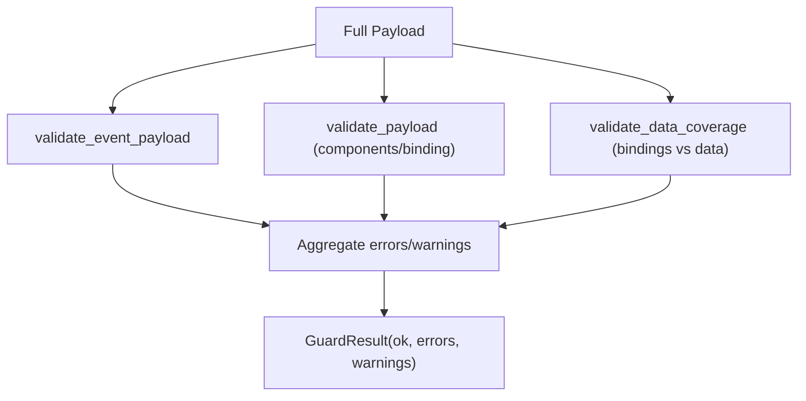
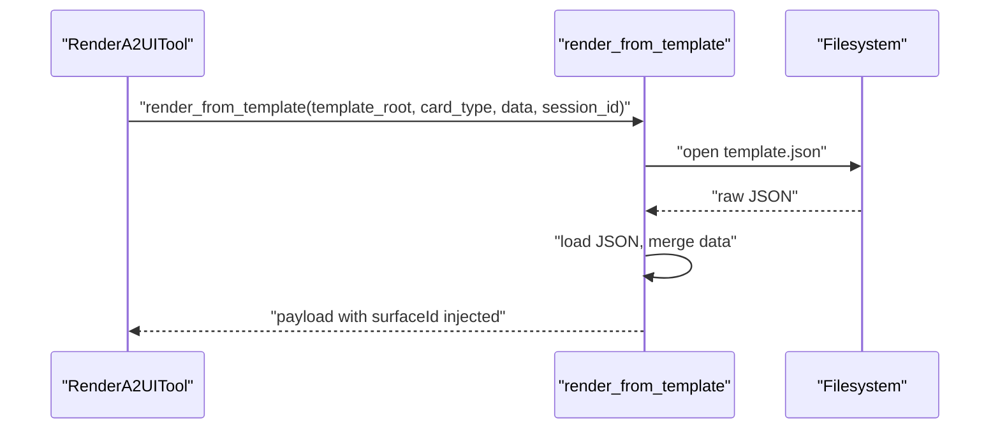
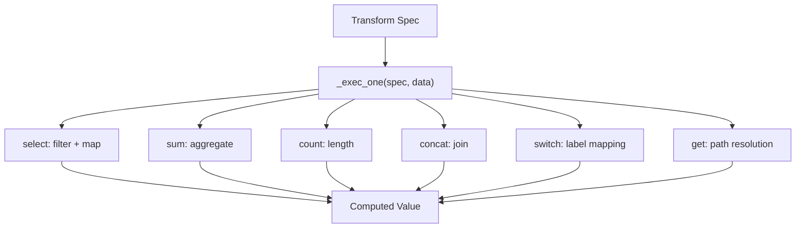
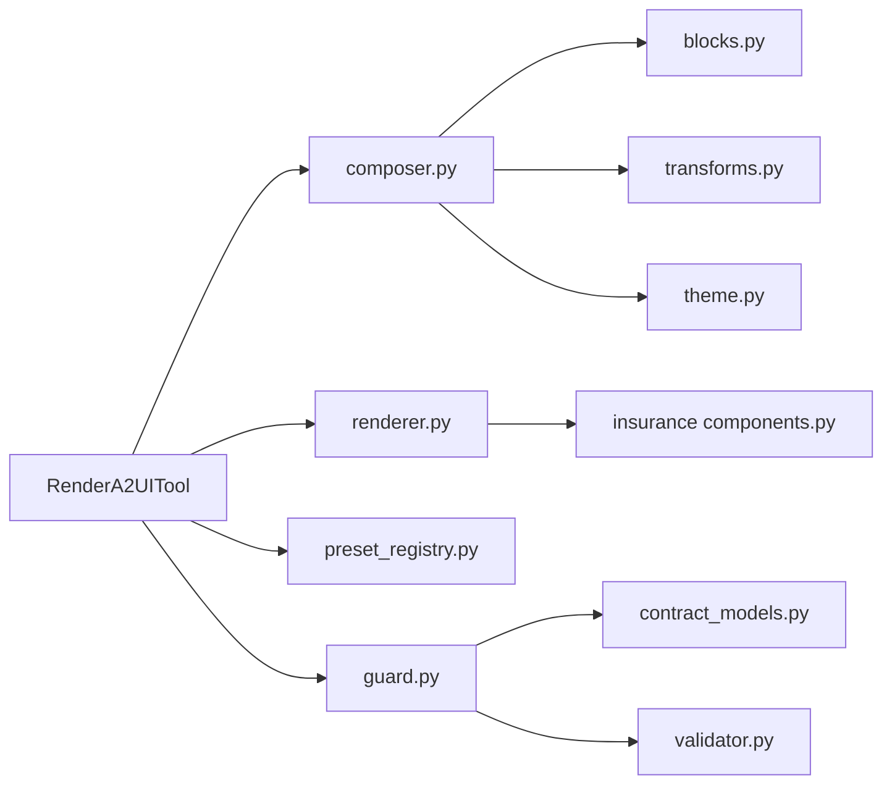

# Rendering Pipeline and Validation

<cite>
**Referenced Files in This Document**
- [renderer.py](file://src/ark_agentic/core/a2ui/renderer.py)
- [validator.py](file://src/ark_agentic/core/a2ui/validator.py)
- [contract_models.py](file://src/ark_agentic/core/a2ui/contract_models.py)
- [composer.py](file://src/ark_agentic/core/a2ui/composer.py)
- [blocks.py](file://src/ark_agentic/core/a2ui/blocks.py)
- [components.py](file://src/ark_agentic/agents/insurance/a2ui/components.py)
- [guard.py](file://src/ark_agentic/core/a2ui/guard.py)
- [transforms.py](file://src/ark_agentic/core/a2ui/transforms.py)
- [theme.py](file://src/ark_agentic/core/a2ui/theme.py)
- [flattener.py](file://src/ark_agentic/core/a2ui/flattener.py)
- [preset_registry.py](file://src/ark_agentic/core/a2ui/preset_registry.py)
- [render_a2ui.py](file://src/ark_agentic/core/tools/render_a2ui.py)
- [test_a2ui_renderer.py](file://tests/unit/core/test_a2ui_renderer.py)
- [test_a2ui_contract_validator.py](file://tests/unit/core/test_a2ui_contract_validator.py)
</cite>

## Table of Contents
1. [Introduction](#introduction)
2. [Project Structure](#project-structure)
3. [Core Components](#core-components)
4. [Architecture Overview](#architecture-overview)
5. [Detailed Component Analysis](#detailed-component-analysis)
6. [Dependency Analysis](#dependency-analysis)
7. [Performance Considerations](#performance-considerations)
8. [Troubleshooting Guide](#troubleshooting-guide)
9. [Conclusion](#conclusion)
10. [Appendices](#appendices)

## Introduction
This document explains the A2UI rendering pipeline and validation framework. It covers how composed block descriptors are transformed into renderable UI payloads, how validation ensures UI contracts are met, and how errors propagate through the system. It also documents the contract models, validation rules, integration points with external rendering systems, and practical debugging techniques for reliable UI generation.

## Project Structure
The A2UI rendering pipeline centers around a unified tool that supports three rendering modes:
- Blocks mode: dynamic composition of block descriptors into a full A2UI event payload.
- Template mode: loading a template.json and merging flat data to produce a full A2UI event payload.
- Preset mode: extracting a lean, frontend-ready payload directly from a card extractor.

**Diagram sources**
- [render_a2ui.py:178-662](file://src/ark_agentic/core/tools/render_a2ui.py#L178-L662)
- [composer.py:57-122](file://src/ark_agentic/core/a2ui/composer.py#L57-L122)
- [blocks.py:46-148](file://src/ark_agentic/core/a2ui/blocks.py#L46-L148)
- [components.py:69-517](file://src/ark_agentic/agents/insurance/a2ui/components.py#L69-L517)
- [validator.py:88-225](file://src/ark_agentic/core/a2ui/validator.py#L88-L225)
- [contract_models.py:97-122](file://src/ark_agentic/core/a2ui/contract_models.py#L97-L122)
- [guard.py:83-124](file://src/ark_agentic/core/a2ui/guard.py#L83-L124)
- [renderer.py:15-52](file://src/ark_agentic/core/a2ui/renderer.py#L15-L52)
- [transforms.py:366-395](file://src/ark_agentic/core/a2ui/transforms.py#L366-L395)
- [theme.py:12-39](file://src/ark_agentic/core/a2ui/theme.py#L12-L39)
- [preset_registry.py:25-52](file://src/ark_agentic/core/a2ui/preset_registry.py#L25-L52)

**Section sources**
- [render_a2ui.py:178-662](file://src/ark_agentic/core/tools/render_a2ui.py#L178-L662)
- [composer.py:57-122](file://src/ark_agentic/core/a2ui/composer.py#L57-L122)
- [blocks.py:46-148](file://src/ark_agentic/core/a2ui/blocks.py#L46-L148)
- [components.py:69-517](file://src/ark_agentic/agents/insurance/a2ui/components.py#L69-L517)
- [validator.py:88-225](file://src/ark_agentic/core/a2ui/validator.py#L88-L225)
- [contract_models.py:97-122](file://src/ark_agentic/core/a2ui/contract_models.py#L97-L122)
- [guard.py:83-124](file://src/ark_agentic/core/a2ui/guard.py#L83-L124)
- [renderer.py:15-52](file://src/ark_agentic/core/a2ui/renderer.py#L15-L52)
- [transforms.py:366-395](file://src/ark_agentic/core/a2ui/transforms.py#L366-L395)
- [theme.py:12-39](file://src/ark_agentic/core/a2ui/theme.py#L12-L39)
- [preset_registry.py:25-52](file://src/ark_agentic/core/a2ui/preset_registry.py#L25-L52)

## Core Components
- RenderA2UITool orchestrates rendering across the three modes, validates payloads, and returns structured results with metadata.
- Composer transforms block descriptors into a complete A2UI event payload, resolving inline transform specs and assembling a root Column.
- Blocks infrastructure defines the registry, required keys, and helpers for building components and resolving bindings.
- Validator enforces component-level and binding-level contracts.
- Contract models enforce strict event-level contracts for beginRendering, surfaceUpdate, dataModelUpdate, and deleteSurface.
- Guard composes event-level, component-level, and data-coverage validations into a single call.
- Renderer loads template.json and merges flat data to produce a full A2UI payload for template mode.
- Transforms engine executes declarative transform specs deterministically from raw business data.
- Theme provides immutable visual design tokens.
- Preset registry enables per-agent extraction of lean payloads for preset mode.

**Section sources**
- [render_a2ui.py:178-662](file://src/ark_agentic/core/tools/render_a2ui.py#L178-L662)
- [composer.py:57-122](file://src/ark_agentic/core/a2ui/composer.py#L57-L122)
- [blocks.py:46-148](file://src/ark_agentic/core/a2ui/blocks.py#L46-L148)
- [validator.py:88-225](file://src/ark_agentic/core/a2ui/validator.py#L88-L225)
- [contract_models.py:97-122](file://src/ark_agentic/core/a2ui/contract_models.py#L97-L122)
- [guard.py:83-124](file://src/ark_agentic/core/a2ui/guard.py#L83-L124)
- [renderer.py:15-52](file://src/ark_agentic/core/a2ui/renderer.py#L15-L52)
- [transforms.py:366-395](file://src/ark_agentic/core/a2ui/transforms.py#L366-L395)
- [theme.py:12-39](file://src/ark_agentic/core/a2ui/theme.py#L12-L39)
- [preset_registry.py:25-52](file://src/ark_agentic/core/a2ui/preset_registry.py#L25-L52)

## Architecture Overview
The rendering pipeline integrates three mutually exclusive paths, each validated by a unified guard that checks event contracts, component/binding validity, and data coverage.

**Diagram sources**
- [render_a2ui.py:328-662](file://src/ark_agentic/core/tools/render_a2ui.py#L328-L662)
- [composer.py:60-122](file://src/ark_agentic/core/a2ui/composer.py#L60-L122)
- [blocks.py:120-127](file://src/ark_agentic/core/a2ui/blocks.py#L120-L127)
- [transforms.py:366-395](file://src/ark_agentic/core/a2ui/transforms.py#L366-L395)
- [theme.py:12-39](file://src/ark_agentic/core/a2ui/theme.py#L12-L39)
- [renderer.py:15-52](file://src/ark_agentic/core/a2ui/renderer.py#L15-L52)
- [preset_registry.py:41-42](file://src/ark_agentic/core/a2ui/preset_registry.py#L41-L42)
- [guard.py:83-124](file://src/ark_agentic/core/a2ui/guard.py#L83-L124)

## Detailed Component Analysis

### RenderA2UITool (Unified Rendering)
- Modes: blocks, card_type, preset_type are mutually exclusive per call; parameters are generated dynamically based on provided configs.
- Execution paths:
  - Blocks: expands block descriptors into components, resolves transforms, builds a root Column, and attaches metadata.
  - Template: extracts flat data via extractor, renders template.json, injects surfaceId, merges data, and validates.
  - Preset: returns frontend-ready payload from extractor with attached metadata.
- Validation: runs validate_full_payload with configurable strictness via environment variable.

**Diagram sources**
- [render_a2ui.py:178-662](file://src/ark_agentic/core/tools/render_a2ui.py#L178-L662)
- [preset_registry.py:25-52](file://src/ark_agentic/core/a2ui/preset_registry.py#L25-L52)

**Section sources**
- [render_a2ui.py:178-662](file://src/ark_agentic/core/tools/render_a2ui.py#L178-L662)

### Composer (Dynamic Block Composition)
- Accepts block descriptors and raw data, resolves inline transform specs, and produces a complete A2UI event payload.
- Builds a root Column containing all emitted components and sets surfaceId/rootComponentId/data accordingly.
- Uses theme defaults for layout and spacing.

**Diagram sources**
- [composer.py:60-122](file://src/ark_agentic/core/a2ui/composer.py#L60-L122)
- [transforms.py:366-395](file://src/ark_agentic/core/a2ui/transforms.py#L366-L395)
- [theme.py:12-39](file://src/ark_agentic/core/a2ui/theme.py#L12-L39)

**Section sources**
- [composer.py:57-122](file://src/ark_agentic/core/a2ui/composer.py#L57-L122)
- [transforms.py:186-315](file://src/ark_agentic/core/a2ui/transforms.py#L186-L315)
- [theme.py:12-39](file://src/ark_agentic/core/a2ui/theme.py#L12-L39)

### Blocks Infrastructure and Component Builders
- Provides registry, required-keys enforcement, and helpers for building components and resolving bindings.
- Component builders (e.g., insurance components) emit A2UIOutput with components, template_data, llm_digest, and state_delta.

**Diagram sources**
- [blocks.py:46-148](file://src/ark_agentic/core/a2ui/blocks.py#L46-L148)
- [components.py:69-517](file://src/ark_agentic/agents/insurance/a2ui/components.py#L69-L517)

**Section sources**
- [blocks.py:46-148](file://src/ark_agentic/core/a2ui/blocks.py#L46-L148)
- [components.py:69-517](file://src/ark_agentic/agents/insurance/a2ui/components.py#L69-L517)

### Validation Framework
- Event-level contracts enforced by contract_models.
- Component-level and binding-level validation by validator.
- Data coverage validation by guard to detect missing data keys referenced by bindings.
- Unified guard aggregates errors and warnings.

**Diagram sources**
- [contract_models.py:97-122](file://src/ark_agentic/core/a2ui/contract_models.py#L97-L122)
- [validator.py:88-225](file://src/ark_agentic/core/a2ui/validator.py#L88-L225)
- [guard.py:83-124](file://src/ark_agentic/core/a2ui/guard.py#L83-L124)

**Section sources**
- [contract_models.py:97-122](file://src/ark_agentic/core/a2ui/contract_models.py#L97-L122)
- [validator.py:88-225](file://src/ark_agentic/core/a2ui/validator.py#L88-L225)
- [guard.py:83-124](file://src/ark_agentic/core/a2ui/guard.py#L83-L124)

### Template Rendering
- Loads template.json from disk, injects surfaceId, merges flat data into payload, and returns a full A2UI payload.
- Raises FileNotFoundError for missing templates and JSONDecodeError for malformed templates.

**Diagram sources**
- [renderer.py:15-52](file://src/ark_agentic/core/a2ui/renderer.py#L15-L52)
- [render_a2ui.py:545-597](file://src/ark_agentic/core/tools/render_a2ui.py#L545-L597)

**Section sources**
- [renderer.py:15-52](file://src/ark_agentic/core/a2ui/renderer.py#L15-L52)
- [render_a2ui.py:545-597](file://src/ark_agentic/core/tools/render_a2ui.py#L545-L597)

### Transform DSL Engine
- Executes declarative transform specs (get, sum, count, concat, select, switch, literal) deterministically.
- Resolves dot-notation paths, supports array indexing and wildcards, applies formatters, and handles conditions.
- Non-fatal failures produce warnings; fatal errors raise TransformError.

**Diagram sources**
- [transforms.py:186-315](file://src/ark_agentic/core/a2ui/transforms.py#L186-L315)

**Section sources**
- [transforms.py:186-315](file://src/ark_agentic/core/a2ui/transforms.py#L186-L315)

### Preset Registry
- Associates card types with extractors that return A2UIOutput.template_data directly to the frontend.
- Used in preset_type mode to bypass component assembly.

**Section sources**
- [preset_registry.py:25-52](file://src/ark_agentic/core/a2ui/preset_registry.py#L25-L52)
- [render_a2ui.py:599-631](file://src/ark_agentic/core/tools/render_a2ui.py#L599-L631)

## Dependency Analysis
- RenderA2UITool depends on composer, renderer, preset registry, and guard.
- Composer depends on blocks registry, theme, and transforms.
- Guard depends on contract_models and validator.
- Blocks infrastructure underpins both dynamic composition and template rendering via extractors.

**Diagram sources**
- [render_a2ui.py:178-662](file://src/ark_agentic/core/tools/render_a2ui.py#L178-L662)
- [composer.py:57-122](file://src/ark_agentic/core/a2ui/composer.py#L57-L122)
- [blocks.py:46-148](file://src/ark_agentic/core/a2ui/blocks.py#L46-L148)
- [validator.py:88-225](file://src/ark_agentic/core/a2ui/validator.py#L88-L225)
- [contract_models.py:97-122](file://src/ark_agentic/core/a2ui/contract_models.py#L97-L122)
- [guard.py:83-124](file://src/ark_agentic/core/a2ui/guard.py#L83-L124)
- [renderer.py:15-52](file://src/ark_agentic/core/a2ui/renderer.py#L15-L52)
- [components.py:69-517](file://src/ark_agentic/agents/insurance/a2ui/components.py#L69-L517)
- [preset_registry.py:25-52](file://src/ark_agentic/core/a2ui/preset_registry.py#L25-L52)

**Section sources**
- [render_a2ui.py:178-662](file://src/ark_agentic/core/tools/render_a2ui.py#L178-L662)
- [composer.py:57-122](file://src/ark_agentic/core/a2ui/composer.py#L57-L122)
- [blocks.py:46-148](file://src/ark_agentic/core/a2ui/blocks.py#L46-L148)
- [validator.py:88-225](file://src/ark_agentic/core/a2ui/validator.py#L88-L225)
- [contract_models.py:97-122](file://src/ark_agentic/core/a2ui/contract_models.py#L97-L122)
- [guard.py:83-124](file://src/ark_agentic/core/a2ui/guard.py#L83-L124)
- [renderer.py:15-52](file://src/ark_agentic/core/a2ui/renderer.py#L15-L52)
- [components.py:69-517](file://src/ark_agentic/agents/insurance/a2ui/components.py#L69-L517)
- [preset_registry.py:25-52](file://src/ark_agentic/core/a2ui/preset_registry.py#L25-L52)

## Performance Considerations
- Transform execution is deterministic and operates on raw data; avoid heavy computations in transform specs.
- Prefer precomputing expensive aggregations upstream to reduce repeated work during composition.
- Keep component trees shallow; excessive nesting increases traversal and validation overhead.
- Use theme defaults consistently to minimize property churn and improve rendering predictability.

## Troubleshooting Guide
Common validation and rendering issues:
- Missing template file or invalid JSON in template mode:
  - Symptoms: FileNotFoundError or JSONDecodeError raised during template rendering.
  - Action: Verify template_root and card_type; check template.json validity.
- Event contract violation:
  - Symptoms: GuardResult with EVENT_CONTRACT errors; strict mode returns error result.
  - Action: Ensure event, version, surfaceId, and required fields conform to supported events.
- Component-level validation failures:
  - Symptoms: Errors such as A2UI_COMPONENT_TYPE_INVALID, A2UI_COMPONENT_ID_DUPLICATE, A2UI_COMPONENT_REF_MISSING, A2UI_BINDING_XOR.
  - Action: Fix component types, ensure unique ids, reference existing component ids, and enforce XOR for binding fields.
- Data coverage warnings:
  - Symptoms: Warnings indicating missing data keys referenced by bindings.
  - Action: Provide required data keys in payload.data or adjust bindings to use literalString fallbacks.
- Transform failures:
  - Symptoms: TRANSFORM_WARN or TRANSFORM_ERROR warnings; partial computation.
  - Action: Correct path expressions, array indices, and conditions; ensure data shapes match expectations.

Debugging techniques:
- Enable strict validation via environment variable to fail fast on contract violations.
- Inspect AgentToolResult metadata for validation outcomes and warnings.
- Review test fixtures for expected payload structures and binding patterns.

**Section sources**
- [render_a2ui.py:635-662](file://src/ark_agentic/core/tools/render_a2ui.py#L635-L662)
- [guard.py:83-124](file://src/ark_agentic/core/a2ui/guard.py#L83-L124)
- [validator.py:88-225](file://src/ark_agentic/core/a2ui/validator.py#L88-L225)
- [contract_models.py:97-122](file://src/ark_agentic/core/a2ui/contract_models.py#L97-L122)
- [renderer.py:15-52](file://src/ark_agentic/core/a2ui/renderer.py#L15-L52)
- [test_a2ui_renderer.py:74-95](file://tests/unit/core/test_a2ui_renderer.py#L74-L95)
- [test_a2ui_contract_validator.py:65-200](file://tests/unit/core/test_a2ui_contract_validator.py#L65-L200)

## Conclusion
The A2UI rendering pipeline provides a robust, validated path from block descriptors to final UI output. By composing event-level contracts, component-level validations, and data coverage checks, it prevents rendering errors and ensures reliable UI generation. The modular design supports dynamic composition, template-driven rendering, and preset extraction, while the transform engine enables deterministic data shaping from raw business inputs.

## Appendices

### Rendering Workflows

- Blocks mode workflow:
  - Compose block descriptors into components, resolve transforms, assemble root Column, validate payload, and return result with metadata.

- Template mode workflow:
  - Extract flat data via extractor, load template.json, inject surfaceId, merge data, validate payload, and return result with metadata.

- Preset mode workflow:
  - Retrieve extractor from preset registry, compute template_data, return lean payload with attached metadata.

**Section sources**
- [render_a2ui.py:366-631](file://src/ark_agentic/core/tools/render_a2ui.py#L366-L631)
- [composer.py:60-122](file://src/ark_agentic/core/a2ui/composer.py#L60-L122)
- [renderer.py:15-52](file://src/ark_agentic/core/a2ui/renderer.py#L15-L52)
- [preset_registry.py:41-42](file://src/ark_agentic/core/a2ui/preset_registry.py#L41-L42)

### Validation Error Handling and Propagation
- Event-level: contract_models raises ValueError for unsupported events or illegal fields.
- Component-level: validator returns ValidationResult with error codes and messages.
- Data coverage: guard scans bindings and reports warnings for missing data keys.
- GuardResult aggregates errors and warnings; strict mode converts errors into tool errors.

**Section sources**
- [contract_models.py:97-122](file://src/ark_agentic/core/a2ui/contract_models.py#L97-L122)
- [validator.py:88-225](file://src/ark_agentic/core/a2ui/validator.py#L88-L225)
- [guard.py:83-124](file://src/ark_agentic/core/a2ui/guard.py#L83-L124)

### Best Practices for Reliable UI Generation
- Define clear block schemas and component schemas to guide grammar-guided decoding.
- Use theme consistently to maintain visual coherence.
- Prefer explicit binding XOR semantics and provide fallback literalString values where appropriate.
- Validate payloads early with strict mode during development; relax only in controlled environments.
- Keep transform specs simple and deterministic; log warnings for recoverable failures.