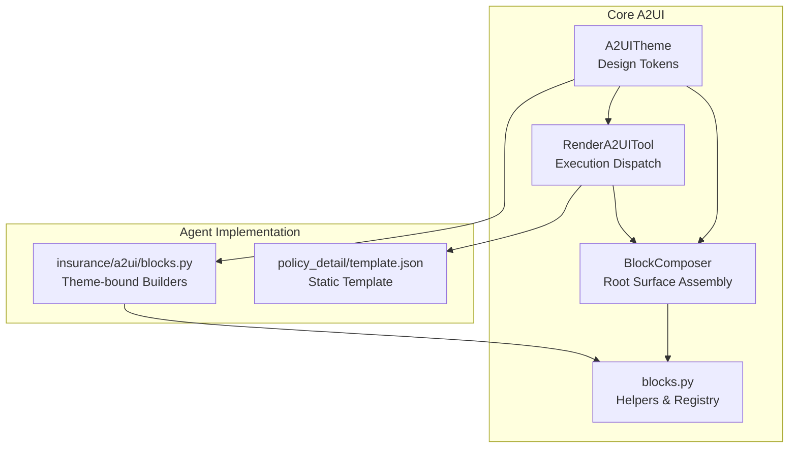
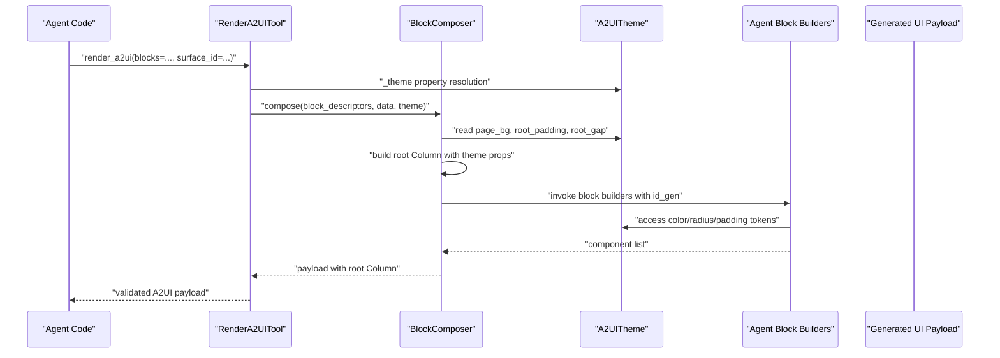
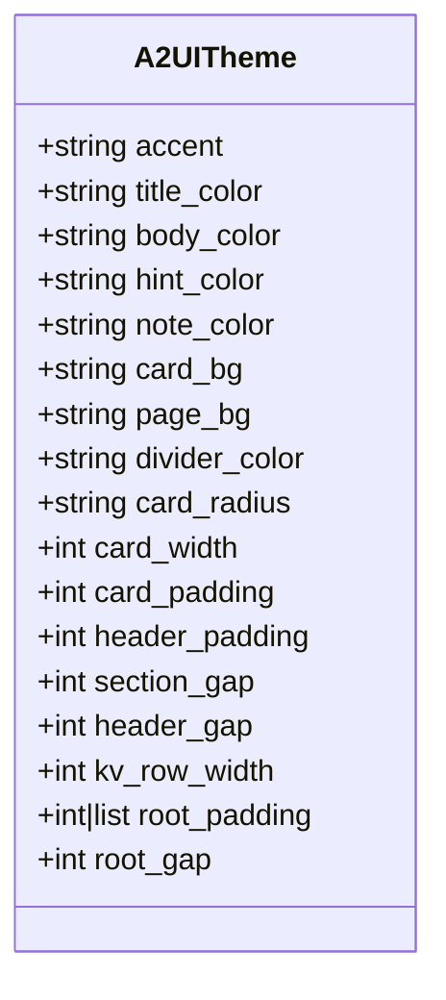
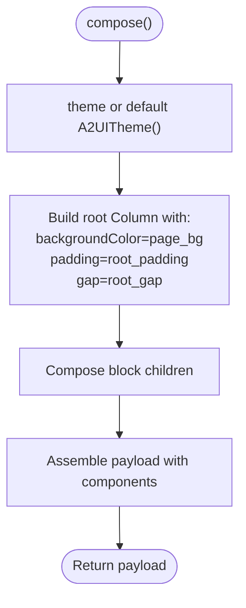
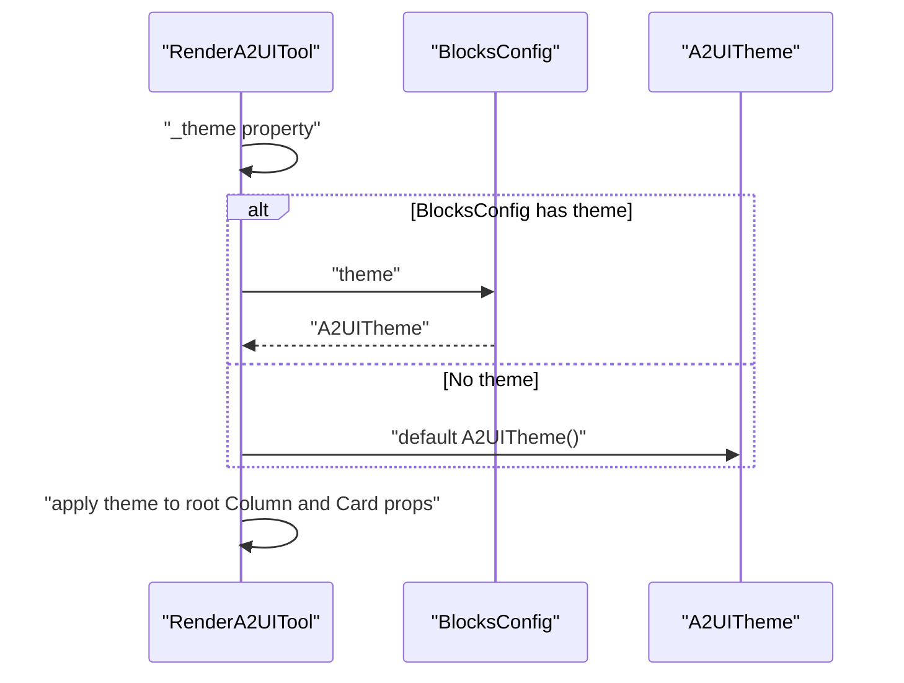
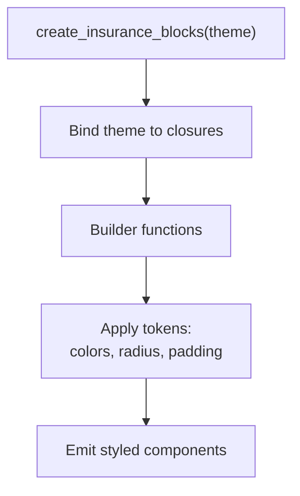
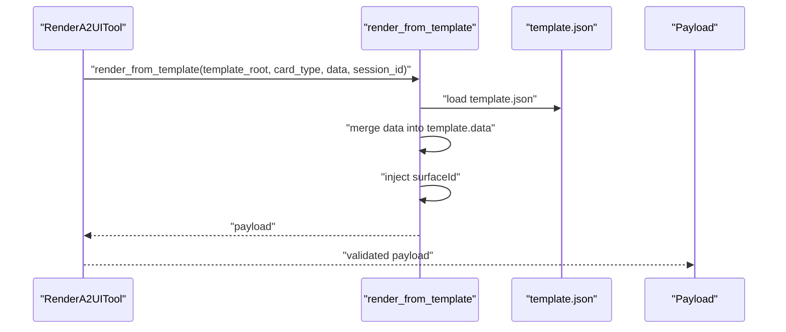
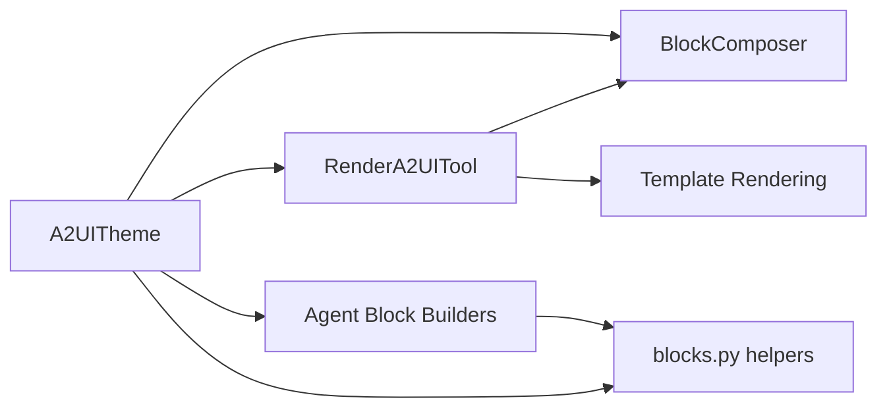

# Theme and Styling System

<cite>
**Referenced Files in This Document**
- [theme.py](file://src/ark_agentic/core/a2ui/theme.py)
- [composer.py](file://src/ark_agentic/core/a2ui/composer.py)
- [render_a2ui.py](file://src/ark_agentic/core/tools/render_a2ui.py)
- [blocks.py](file://src/ark_agentic/core/a2ui/blocks.py)
- [blocks.py](file://src/ark_agentic/agents/insurance/a2ui/blocks.py)
- [template.json](file://src/ark_agentic/agents/insurance/a2ui/templates/policy_detail/template.json)
- [test_a2ui_theme.py](file://tests/unit/core/test_a2ui_theme.py)
- [__init__.py](file://src/ark_agentic/core/a2ui/__init__.py)
</cite>

## Table of Contents
1. [Introduction](#introduction)
2. [Project Structure](#project-structure)
3. [Core Components](#core-components)
4. [Architecture Overview](#architecture-overview)
5. [Detailed Component Analysis](#detailed-component-analysis)
6. [Dependency Analysis](#dependency-analysis)
7. [Performance Considerations](#performance-considerations)
8. [Troubleshooting Guide](#troubleshooting-guide)
9. [Conclusion](#conclusion)

## Introduction
This document explains the A2UI theme system with a focus on the A2UITheme class and how styling is applied across the UI generation pipeline. It covers the theme configuration structure, how themes propagate to components, and how they integrate with the rendering pipeline. Practical examples demonstrate custom theme creation, inheritance patterns, and best practices for maintaining consistent visual design across agent interfaces.

## Project Structure
The theme system spans several modules:
- A2UITheme defines immutable design tokens
- BlockComposer and RenderA2UITool apply themes to generated UI surfaces
- Agent-specific block builders consume theme tokens for component styling
- Templates can embed theme colors for static rendering

**Diagram sources**
- [theme.py:12-39](file://src/ark_agentic/core/a2ui/theme.py#L12-L39)
- [composer.py:57-123](file://src/ark_agentic/core/a2ui/composer.py#L57-L123)
- [render_a2ui.py:178-685](file://src/ark_agentic/core/tools/render_a2ui.py#L178-L685)
- [blocks.py:1-149](file://src/ark_agentic/core/a2ui/blocks.py#L1-L149)
- [blocks.py:25-145](file://src/ark_agentic/agents/insurance/a2ui/blocks.py#L25-L145)
- [template.json:1-310](file://src/ark_agentic/agents/insurance/a2ui/templates/policy_detail/template.json#L1-L310)

**Section sources**
- [theme.py:12-39](file://src/ark_agentic/core/a2ui/theme.py#L12-L39)
- [composer.py:57-123](file://src/ark_agentic/core/a2ui/composer.py#L57-L123)
- [render_a2ui.py:178-685](file://src/ark_agentic/core/tools/render_a2ui.py#L178-L685)
- [blocks.py:1-149](file://src/ark_agentic/core/a2ui/blocks.py#L1-L149)
- [blocks.py:25-145](file://src/ark_agentic/agents/insurance/a2ui/blocks.py#L25-L145)
- [template.json:1-310](file://src/ark_agentic/agents/insurance/a2ui/templates/policy_detail/template.json#L1-L310)

## Core Components
- A2UITheme: Immutable Pydantic model defining visual tokens (colors, shapes, spacing)
- BlockComposer: Assembles root Column using theme tokens for page background, padding, and gap
- RenderA2UITool: Provides theme resolution and applies theme to dynamic composition and cards
- Agent block builders: Access theme tokens via a closure factory to style components consistently
- Templates: Can embed theme colors for static rendering paths

Key theme categories:
- Color palette: accent, title_color, body_color, hint_color, note_color, card_bg, page_bg, divider_color
- Shape & density: card_radius, card_width, card_padding, header_padding, section_gap, header_gap, kv_row_width
- Root surface spacing: root_padding (supports integer or 4-segment list), root_gap

**Section sources**
- [theme.py:12-39](file://src/ark_agentic/core/a2ui/theme.py#L12-L39)
- [composer.py:100-108](file://src/ark_agentic/core/a2ui/composer.py#L100-L108)
- [render_a2ui.py:203-208](file://src/ark_agentic/core/tools/render_a2ui.py#L203-L208)
- [blocks.py:27-37](file://src/ark_agentic/core/a2ui/blocks.py#L27-L37)
- [blocks.py:25-145](file://src/ark_agentic/agents/insurance/a2ui/blocks.py#L25-L145)

## Architecture Overview
The theme system integrates across three rendering paths:
- Dynamic blocks: BlockComposer and RenderA2UITool assemble a root Column using theme tokens
- Templates: Static templates define component properties; themes can be embedded or supplied via data
- Presets: Extractors produce frontend-ready payloads; theme tokens are not applied at this stage

**Diagram sources**
- [render_a2ui.py:366-458](file://src/ark_agentic/core/tools/render_a2ui.py#L366-L458)
- [composer.py:60-123](file://src/ark_agentic/core/a2ui/composer.py#L60-L123)
- [blocks.py:25-145](file://src/ark_agentic/agents/insurance/a2ui/blocks.py#L25-L145)

## Detailed Component Analysis

### A2UITheme Class
A2UITheme is a frozen Pydantic model that centralizes design tokens. It ensures immutability and provides sensible defaults for colors, shapes, and spacing. The model_config frozen=True guarantees that once instantiated, theme instances cannot be mutated.

**Diagram sources**
- [theme.py:12-39](file://src/ark_agentic/core/a2ui/theme.py#L12-L39)

**Section sources**
- [theme.py:12-39](file://src/ark_agentic/core/a2ui/theme.py#L12-L39)
- [test_a2ui_theme.py:17-45](file://tests/unit/core/test_a2ui_theme.py#L17-L45)
- [test_a2ui_theme.py:74-81](file://tests/unit/core/test_a2ui_theme.py#L74-L81)

### Theme Application in BlockComposer
BlockComposer reads theme tokens to construct the root Column:
- backgroundColor from page_bg
- padding from root_padding
- gap from root_gap

It defaults to a fresh A2UITheme instance if none is provided.

**Diagram sources**
- [composer.py:60-123](file://src/ark_agentic/core/a2ui/composer.py#L60-L123)

**Section sources**
- [composer.py:60-123](file://src/ark_agentic/core/a2ui/composer.py#L60-L123)
- [test_a2ui_theme.py:110-127](file://tests/unit/core/test_a2ui_theme.py#L110-L127)

### Theme Resolution in RenderA2UITool
RenderA2UITool exposes a _theme property that prioritizes:
- BlocksConfig.theme (if provided)
- Otherwise, a default A2UITheme()

It applies theme tokens when building:
- Root Column for dynamic composition
- Card containers and internal gaps
- Component-level properties in agent builders

**Diagram sources**
- [render_a2ui.py:203-208](file://src/ark_agentic/core/tools/render_a2ui.py#L203-L208)
- [render_a2ui.py:431-541](file://src/ark_agentic/core/tools/render_a2ui.py#L431-L541)

**Section sources**
- [render_a2ui.py:203-208](file://src/ark_agentic/core/tools/render_a2ui.py#L203-L208)
- [render_a2ui.py:431-541](file://src/ark_agentic/core/tools/render_a2ui.py#L431-L541)

### Agent Block Builders and Theme Propagation
Agent block builders are created via a closure factory that binds an A2UITheme instance. They access theme tokens to style components consistently:
- SectionHeader uses accent and title_color
- KVRow uses note_color and body_color for labels/values
- AccentTotal uses title_color and accent for emphasis
- Divider uses divider_color
- Buttons and other components can leverage theme tokens for consistent visuals

**Diagram sources**
- [blocks.py:25-145](file://src/ark_agentic/agents/insurance/a2ui/blocks.py#L25-L145)

**Section sources**
- [blocks.py:25-145](file://src/ark_agentic/agents/insurance/a2ui/blocks.py#L25-L145)
- [test_a2ui_theme.py:315-340](file://tests/unit/core/test_a2ui_theme.py#L315-L340)

### Templates and Theme Integration
Templates define component properties statically. While they can hardcode theme colors, the system supports supplying theme values via data merging. The template rendering path merges provided data into the template payload and injects a surfaceId.

**Diagram sources**
- [render_a2ui.py:545-597](file://src/ark_agentic/core/tools/render_a2ui.py#L545-L597)
- [template.json:1-310](file://src/ark_agentic/agents/insurance/a2ui/templates/policy_detail/template.json#L1-L310)

**Section sources**
- [render_a2ui.py:545-597](file://src/ark_agentic/core/tools/render_a2ui.py#L545-L597)
- [template.json:1-310](file://src/ark_agentic/agents/insurance/a2ui/templates/policy_detail/template.json#L1-L310)

## Dependency Analysis
The theme system exhibits clear separation of concerns:
- A2UITheme is consumed by BlockComposer and RenderA2UITool
- Agent block builders depend on A2UITheme via closure factories
- Templates remain independent of theme logic but can embed colors
- Backward-compatibility aliases in blocks.py derive from the default theme

**Diagram sources**
- [theme.py:12-39](file://src/ark_agentic/core/a2ui/theme.py#L12-L39)
- [composer.py:21-21](file://src/ark_agentic/core/a2ui/composer.py#L21-L21)
- [render_a2ui.py:27-28](file://src/ark_agentic/core/tools/render_a2ui.py#L27-L28)
- [blocks.py:19-19](file://src/ark_agentic/core/a2ui/blocks.py#L19-L19)
- [blocks.py:25-145](file://src/ark_agentic/agents/insurance/a2ui/blocks.py#L25-L145)

**Section sources**
- [__init__.py:17-17](file://src/ark_agentic/core/a2ui/__init__.py#L17-L17)
- [blocks.py:27-37](file://src/ark_agentic/core/a2ui/blocks.py#L27-L37)

## Performance Considerations
- Frozen models prevent accidental mutations and enable safe sharing across threads
- Theme instances are lightweight; prefer reusing a single theme instance per agent session
- Avoid excessive recomputation of theme-dependent component properties; compute once per theme change
- When using templates, minimize repeated data merges; supply only changed fields

## Troubleshooting Guide
Common issues and resolutions:
- Mutating a theme instance raises validation errors due to frozen configuration
- Unknown block types cause errors; ensure block registration aligns with available types
- Template loading failures indicate missing template.json or invalid JSON; verify paths and contents
- Theme tokens not applied: confirm theme is passed to BlockComposer or RenderA2UITool and that agent builders bind the theme via the factory

Validation and testing references:
- Theme immutability and defaults verified in unit tests
- Theme application to root Column validated in tests
- Agent builders consuming theme tokens validated in tests

**Section sources**
- [test_a2ui_theme.py:74-81](file://tests/unit/core/test_a2ui_theme.py#L74-L81)
- [test_a2ui_theme.py:110-127](file://tests/unit/core/test_a2ui_theme.py#L110-L127)
- [test_a2ui_theme.py:315-340](file://tests/unit/core/test_a2ui_theme.py#L315-L340)

## Conclusion
The A2UI theme system centers on A2UITheme as the single source of truth for visual design tokens. Themes are propagated through BlockComposer and RenderA2UITool to the root surface and components, while agent block builders bind themes via closure factories for consistent styling. Templates can embed theme colors, and the system maintains backward compatibility through module-level aliases. By following the patterns outlined here—creating reusable theme instances, binding themes to builders, and validating theme application—you can achieve consistent, maintainable visual design across diverse agent interfaces.