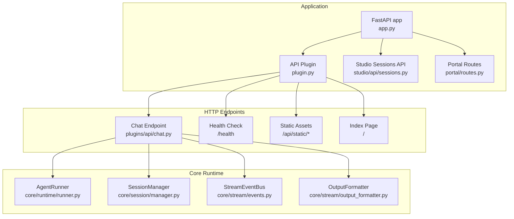
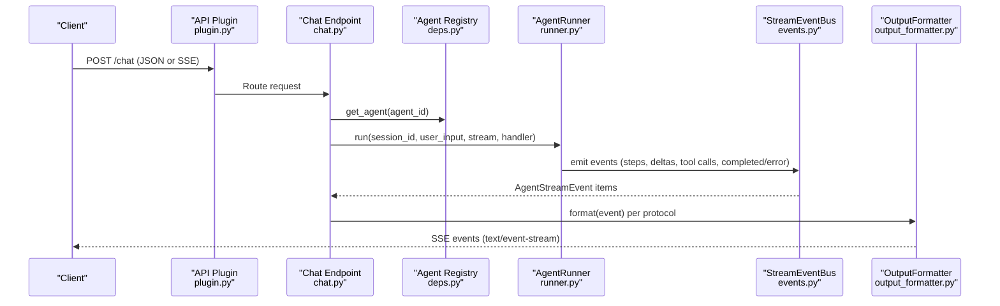
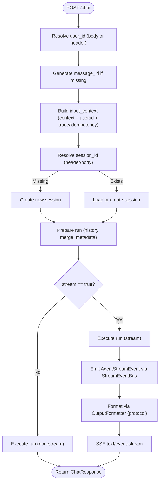
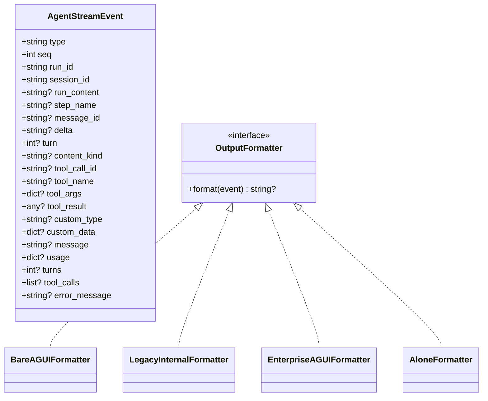
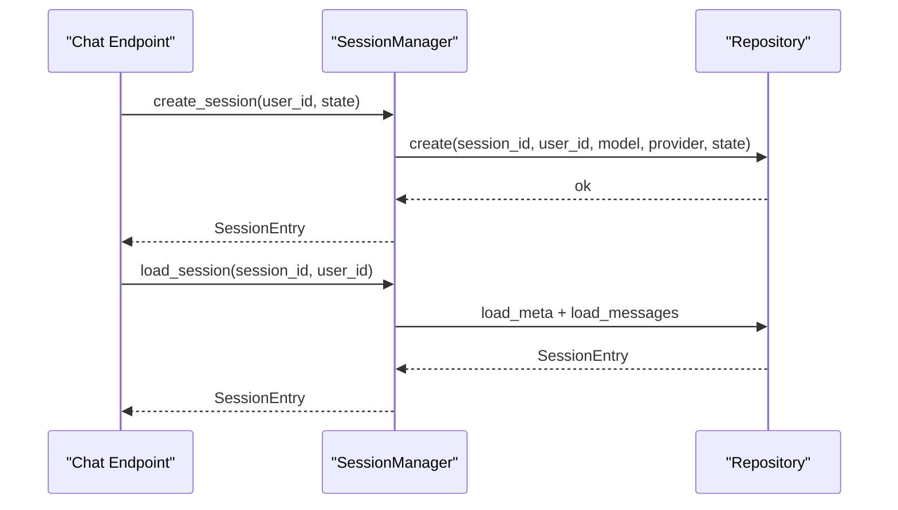
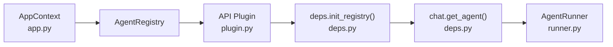
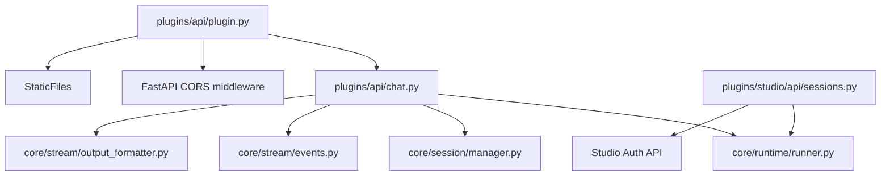

# API Reference

<cite>
**Referenced Files in This Document**
- [app.py](file://src/ark_agentic/app.py)
- [plugin.py](file://src/ark_agentic/plugins/api/plugin.py)
- [chat.py](file://src/ark_agentic/plugins/api/chat.py)
- [models.py](file://src/ark_agentic/plugins/api/models.py)
- [deps.py](file://src/ark_agentic/plugins/api/deps.py)
- [routes.py](file://src/ark_agentic/portal/routes.py)
- [events.py](file://src/ark_agentic/core/stream/events.py)
- [output_formatter.py](file://src/ark_agentic/core/stream/output_formatter.py)
- [runner.py](file://src/ark_agentic/core/runtime/runner.py)
- [manager.py](file://src/ark_agentic/core/session/manager.py)
- [types.py](file://src/ark_agentic/core/types.py)
- [sessions.py](file://src/ark_agentic/plugins/studio/api/sessions.py)
- [ark-agentic-api.postman_collection.json](file://docs/postman/ark-agentic-api.postman_collection.json)
</cite>

## Table of Contents
1. [Introduction](#introduction)
2. [Project Structure](#project-structure)
3. [Core Components](#core-components)
4. [Architecture Overview](#architecture-overview)
5. [Detailed Component Analysis](#detailed-component-analysis)
6. [Dependency Analysis](#dependency-analysis)
7. [Performance Considerations](#performance-considerations)
8. [Troubleshooting Guide](#troubleshooting-guide)
9. [Conclusion](#conclusion)
10. [Appendices](#appendices)

## Introduction
This document provides a comprehensive API reference for the Ark Agentic HTTP endpoints, focusing on the RESTful chat interface and related web services. It covers HTTP methods, URL patterns, request/response schemas, authentication, SSE streaming, session management, and the dependency injection system. It also includes practical examples, client implementation guidance, security best practices, and versioning/migration considerations.

## Project Structure
The API surface is implemented as a FastAPI application with modular plugins. The API plugin registers the chat endpoint, health check, and static assets. The portal plugin serves development-time landing pages. The core runtime orchestrates agent execution, streaming, and session management.

**Diagram sources**
- [app.py:71-78](file://src/ark_agentic/app.py#L71-L78)
- [plugin.py:42-87](file://src/ark_agentic/plugins/api/plugin.py#L42-L87)
- [chat.py:28-188](file://src/ark_agentic/plugins/api/chat.py#L28-L188)
- [runner.py:290-380](file://src/ark_agentic/core/runtime/runner.py#L290-L380)
- [manager.py:94-132](file://src/ark_agentic/core/session/manager.py#L94-L132)
- [events.py:67-116](file://src/ark_agentic/core/stream/events.py#L67-L116)
- [output_formatter.py:427-444](file://src/ark_agentic/core/stream/output_formatter.py#L427-L444)

**Section sources**
- [app.py:71-78](file://src/ark_agentic/app.py#L71-L78)
- [plugin.py:42-87](file://src/ark_agentic/plugins/api/plugin.py#L42-L87)

## Core Components
- Chat API: POST /chat supports both non-streaming and streaming responses via Server-Sent Events (SSE). It resolves user/session/context, invokes the agent runner, and formats outputs via pluggable formatters.
- Data Models: Pydantic models define ChatRequest, ChatResponse, SSEEvent, and HistoryMessage.
- Dependency Injection: A shared AgentRegistry is injected into the API plugin at startup and accessed via a dependency helper.
- Streaming: Agent events are emitted to a queue and formatted into SSE according to the selected protocol.
- Sessions: Session management supports creation, loading, merging external history, and persistence.
- Portal Routes: Serve development-time landing pages and documentation endpoints.

**Section sources**
- [chat.py:28-188](file://src/ark_agentic/plugins/api/chat.py#L28-L188)
- [models.py:27-104](file://src/ark_agentic/plugins/api/models.py#L27-L104)
- [deps.py:19-37](file://src/ark_agentic/plugins/api/deps.py#L19-L37)
- [events.py:67-116](file://src/ark_agentic/core/stream/events.py#L67-L116)
- [output_formatter.py:427-444](file://src/ark_agentic/core/stream/output_formatter.py#L427-L444)
- [manager.py:94-132](file://src/ark_agentic/core/session/manager.py#L94-L132)
- [routes.py:28-134](file://src/ark_agentic/portal/routes.py#L28-L134)

## Architecture Overview
The chat endpoint integrates with the AgentRunner to execute ReAct loops, emitting events consumed by the SSE formatter. The API plugin wires the registry and installs routes, while the portal routes provide developer experience endpoints.

**Diagram sources**
- [plugin.py:42-64](file://src/ark_agentic/plugins/api/plugin.py#L42-L64)
- [chat.py:39-187](file://src/ark_agentic/plugins/api/chat.py#L39-L187)
- [deps.py:31-37](file://src/ark_agentic/plugins/api/deps.py#L31-L37)
- [runner.py:290-380](file://src/ark_agentic/core/runtime/runner.py#L290-L380)
- [events.py:67-116](file://src/ark_agentic/core/stream/events.py#L67-L116)
- [output_formatter.py:427-444](file://src/ark_agentic/core/stream/output_formatter.py#L427-L444)

## Detailed Component Analysis

### Chat API
- Method: POST
- Path: /chat
- Purpose: Submit a user message to an agent; optionally stream responses via SSE.
- Headers:
  - Content-Type: application/json
  - Accept: text/event-stream (when streaming)
  - Optional x-ark-user-id: user identifier
  - Optional x-ark-session-id: session identifier
  - Optional x-ark-message-id: message identifier
  - Optional x-ark-trace-id: correlation identifier
- Request Body (ChatRequest):
  - agent_id: insurance or securities
  - message: user input string
  - session_id: optional; if omitted, a new session is created
  - stream: boolean; true enables SSE
  - run_options: overrides model/temperature
  - protocol: agui | internal | enterprise | alone
  - source_bu_type: enterprise mode
  - app_type: enterprise mode
  - user_id: required (body or x-ark-user-id)
  - message_id: optional; auto-generated if omitted
  - context: arbitrary key-value pairs
  - idempotency_key: prevents duplicate requests
  - history: external history messages (array or JSON string)
  - use_history: merge external history
- Non-streaming Response (ChatResponse):
  - session_id, message_id, response, tool_calls, turns, usage
- Streaming Response (SSE):
  - Events per protocol; see OutputFormatter mappings.

**Diagram sources**
- [chat.py:28-188](file://src/ark_agentic/plugins/api/chat.py#L28-L188)
- [events.py:67-116](file://src/ark_agentic/core/stream/events.py#L67-L116)
- [output_formatter.py:427-444](file://src/ark_agentic/core/stream/output_formatter.py#L427-L444)

**Section sources**
- [chat.py:28-188](file://src/ark_agentic/plugins/api/chat.py#L28-L188)
- [models.py:27-104](file://src/ark_agentic/plugins/api/models.py#L27-L104)

### Data Models
- ChatRequest: Defines all input fields and validation for history JSON acceptance.
- ChatResponse: Defines non-stream output shape.
- SSEEvent: Aligns with OpenAI-like response.* naming for legacy compatibility.
- HistoryMessage: External history message with role and content.

**Section sources**
- [models.py:27-104](file://src/ark_agentic/plugins/api/models.py#L27-L104)

### Streaming and SSE Implementation
- Agent emits structured AgentStreamEvent items.
- OutputFormatter adapts events to:
  - agui: raw AgentStreamEvent JSON
  - internal: legacy response.* events
  - enterprise: AGUIEnvelope with reasoning framing
  - alone: sa_* events
- The SSE stream yields formatted lines until completion or error.

**Diagram sources**
- [events.py:67-116](file://src/ark_agentic/core/stream/events.py#L67-L116)
- [output_formatter.py:48-444](file://src/ark_agentic/core/stream/output_formatter.py#L48-L444)

**Section sources**
- [events.py:67-116](file://src/ark_agentic/core/stream/events.py#L67-L116)
- [output_formatter.py:48-444](file://src/ark_agentic/core/stream/output_formatter.py#L48-L444)

### Session Management
- Creation: POST /chat without session_id creates a new session.
- Loading: If session_id is provided, the system loads or recreates if not found.
- External History: Optional history array or JSON string is merged into the session.
- Persistence: Session state and messages are persisted via the repository abstraction.

**Diagram sources**
- [chat.py:80-98](file://src/ark_agentic/plugins/api/chat.py#L80-L98)
- [manager.py:94-132](file://src/ark_agentic/core/session/manager.py#L94-L132)
- [manager.py:221-264](file://src/ark_agentic/core/session/manager.py#L221-L264)

**Section sources**
- [chat.py:80-98](file://src/ark_agentic/plugins/api/chat.py#L80-L98)
- [manager.py:94-132](file://src/ark_agentic/core/session/manager.py#L94-L132)
- [manager.py:221-264](file://src/ark_agentic/core/session/manager.py#L221-L264)

### Portal Routes (Static Content)
- /: serves home.html or redirects to /playground
- /securities: serves securities demo page
- /insurance-agui: serves insurance A2UI demo page
- /api/readme: returns README.md as plain text
- /api/wiki/tree: returns directory tree for zh/en wikis
- /api/wiki/{lang}/{path}: returns wiki page markdown
- /api/admin/securities-mock: returns mock mode status

**Section sources**
- [routes.py:28-134](file://src/ark_agentic/portal/routes.py#L28-L134)

### Authentication and Authorization
- API endpoints (/chat, /health, static) do not enforce authentication.
- Studio admin endpoints (/agents/{agent_id}/sessions*) require authenticated users and roles via dependency checks.
- Studio authentication API (/auth/login, /auth/logout) issues tokens and manages sessions.

Note: For production deployments, integrate your own authentication middleware or reverse proxy authentication before exposing the API.

**Section sources**
- [sessions.py:23-195](file://src/ark_agentic/plugins/studio/api/sessions.py#L23-L195)
- [auth.py:67-99](file://src/ark_agentic/plugins/studio/api/auth.py#L67-L99)

### Dependency Injection System
- The AgentRegistry is published to the application context by the Agents lifecycle and injected into the API plugin at startup.
- The API plugin initializes the shared registry for the API module.
- The chat endpoint retrieves the AgentRunner via a dependency helper.

**Diagram sources**
- [app.py:50-56](file://src/ark_agentic/app.py#L50-L56)
- [plugin.py:35-41](file://src/ark_agentic/plugins/api/plugin.py#L35-L41)
- [deps.py:19-37](file://src/ark_agentic/plugins/api/deps.py#L19-L37)
- [chat.py:39](file://src/ark_agentic/plugins/api/chat.py#L39)

**Section sources**
- [app.py:50-56](file://src/ark_agentic/app.py#L50-L56)
- [plugin.py:35-41](file://src/ark_agentic/plugins/api/plugin.py#L35-L41)
- [deps.py:19-37](file://src/ark_agentic/plugins/api/deps.py#L19-L37)

## Dependency Analysis
- Chat endpoint depends on:
  - Agent registry (dependency injection)
  - AgentRunner for execution
  - SessionManager for session lifecycle
  - StreamEventBus and OutputFormatter for SSE
- API plugin depends on FastAPI CORS middleware and static file serving.
- Studio sessions API depends on authentication and the Agent registry.

**Diagram sources**
- [chat.py:19-20](file://src/ark_agentic/plugins/api/chat.py#L19-L20)
- [runner.py:290-380](file://src/ark_agentic/core/runtime/runner.py#L290-L380)
- [manager.py:94-132](file://src/ark_agentic/core/session/manager.py#L94-L132)
- [events.py:67-116](file://src/ark_agentic/core/stream/events.py#L67-L116)
- [output_formatter.py:427-444](file://src/ark_agentic/core/stream/output_formatter.py#L427-L444)
- [plugin.py:42-87](file://src/ark_agentic/plugins/api/plugin.py#L42-L87)
- [sessions.py:17-23](file://src/ark_agentic/plugins/studio/api/sessions.py#L17-L23)

**Section sources**
- [chat.py:19-20](file://src/ark_agentic/plugins/api/chat.py#L19-L20)
- [plugin.py:42-87](file://src/ark_agentic/plugins/api/plugin.py#L42-L87)
- [sessions.py:17-23](file://src/ark_agentic/plugins/studio/api/sessions.py#L17-L23)

## Performance Considerations
- Streaming overhead: SSE introduces per-event serialization; choose protocol based on client support.
- Token usage: The agent tracks prompt/completion tokens; consider monitoring usage in responses.
- Session compaction: Long conversations trigger automatic compaction to reduce token usage.
- Concurrency: The chat endpoint uses asyncio queues and events; avoid blocking handlers.

[No sources needed since this section provides general guidance]

## Troubleshooting Guide
Common issues and resolutions:
- Missing user_id: The endpoint requires user_id either in the body or x-ark-user-id header; otherwise returns 400.
- Session not found: If session_id is provided but not found, the system creates a new session and logs a warning.
- Streaming errors: The SSE formatter emits a failed event; inspect error_message in the formatted payload.
- Authentication: Studio endpoints require authenticated users; unauthorized requests receive 401.

**Section sources**
- [chat.py:42-44](file://src/ark_agentic/plugins/api/chat.py#L42-L44)
- [chat.py:86-98](file://src/ark_agentic/plugins/api/chat.py#L86-L98)
- [output_formatter.py:146-148](file://src/ark_agentic/core/stream/output_formatter.py#L146-L148)
- [sessions.py:116-134](file://src/ark_agentic/plugins/studio/api/sessions.py#L116-L134)

## Conclusion
The Ark Agentic API provides a flexible, streaming-first chat interface with robust session management and extensible output protocols. By leveraging the dependency injection system and SSE formatters, clients can integrate seamlessly across environments. For production, pair the API with your authentication and rate-limiting infrastructure and monitor token usage and session compaction.

[No sources needed since this section summarizes without analyzing specific files]

## Appendices

### API Definitions

- Base URL
  - Default: http://localhost:8080
  - Adjust via environment variables for host/port.

- Health Check
  - GET /health
  - Response: {"status":"ok"}

- Chat (Non-streaming)
  - POST /chat
  - Headers: Content-Type: application/json
  - Request: ChatRequest
  - Response: ChatResponse

- Chat (Streaming)
  - POST /chat
  - Headers: Content-Type: application/json, Accept: text/event-stream
  - Request: ChatRequest with stream=true
  - Response: SSE text/event-stream with events per protocol

- Sessions (Studio)
  - GET /agents/{agent_id}/sessions
  - GET /agents/{agent_id}/sessions/{session_id}
  - GET /agents/{agent_id}/sessions/{session_id}/raw
  - PUT /agents/{agent_id}/sessions/{session_id}/raw

**Section sources**
- [ark-agentic-api.postman_collection.json:23-361](file://docs/postman/ark-agentic-api.postman_collection.json#L23-L361)

### Request/Response Examples

- Non-streaming chat
  - Request: POST /chat with body containing agent_id, message, user_id, context
  - Response: ChatResponse with session_id, message_id, response, tool_calls, turns

- Streaming chat (legacy internal)
  - Request: POST /chat with stream=true, protocol=internal
  - Response: SSE events including response.created, response.step, response.content.delta, response.completed, response.failed

- Streaming chat (AGUI native)
  - Request: POST /chat with protocol=agui
  - Response: SSE events including run_started, step_started/finished, text_message_start/content/end, tool_call_*, custom, run_finished/run_error

- Streaming chat (Enterprise AGUI)
  - Request: POST /chat with protocol=enterprise, source_bu_type, app_type
  - Response: SSE events framed as AGUIEnvelope with reasoning_start/message_content/end and data.ui_protocol/ui_data

- Session management
  - Create session: POST /chat without session_id
  - List sessions: GET /agents/{agent_id}/sessions
  - Get session detail: GET /agents/{agent_id}/sessions/{session_id}
  - Edit raw transcript: PUT /agents/{agent_id}/sessions/{session_id}/raw

**Section sources**
- [ark-agentic-api.postman_collection.json:38-361](file://docs/postman/ark-agentic-api.postman_collection.json#L38-L361)

### Client Implementation Guidance

- JavaScript (Fetch + SSE)
  - Use fetch with Accept: text/event-stream for streaming.
  - Parse event data and handle response.* or AGUI/native events accordingly.

- Python
  - Use requests with stream=True and iterate over response.iter_lines().
  - For SSE, consider aiohttp or sseclient.

- Go
  - Use net/http with a custom handler to process streamed events.
  - Map event types to your application’s UI components.

- Java/Kotlin
  - Use OkHttp with a custom interceptor to handle SSE.
  - Accumulate deltas and render incremental UI updates.

[No sources needed since this section provides general guidance]

### Authentication, Rate Limiting, and Security Best Practices
- Authentication
  - For production, integrate your identity provider or reverse proxy authentication before the API.
  - Studio endpoints require authenticated users; use the Studio auth APIs for token issuance.

- Rate Limiting
  - Implement at the gateway or reverse proxy level.
  - Consider per-user and per-agent limits to prevent abuse.

- Security
  - Validate and sanitize input context and history.
  - Use HTTPS/TLS in production.
  - Avoid exposing internal headers or sensitive fields in SSE payloads.

**Section sources**
- [auth.py:67-99](file://src/ark_agentic/plugins/studio/api/auth.py#L67-L99)

### API Versioning, Backward Compatibility, and Migration
- Versioning
  - The application exposes a version field; use it to track deployments.
- Backward Compatibility
  - The legacy internal protocol remains supported for existing clients.
  - Enterprise and AGUI native protocols offer richer event sets.
- Migration Strategies
  - Gradually migrate clients from response.* to AGUI native or Enterprise AGUI envelopes.
  - Maintain protocol selection via the protocol field to support mixed clients during transition.

**Section sources**
- [app.py:72-76](file://src/ark_agentic/app.py#L72-L76)
- [output_formatter.py:69-150](file://src/ark_agentic/core/stream/output_formatter.py#L69-L150)
- [output_formatter.py:419-444](file://src/ark_agentic/core/stream/output_formatter.py#L419-L444)