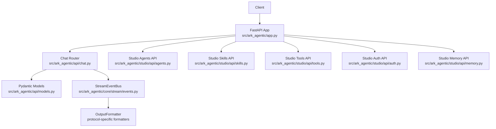
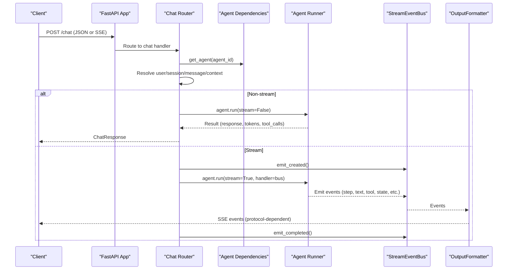
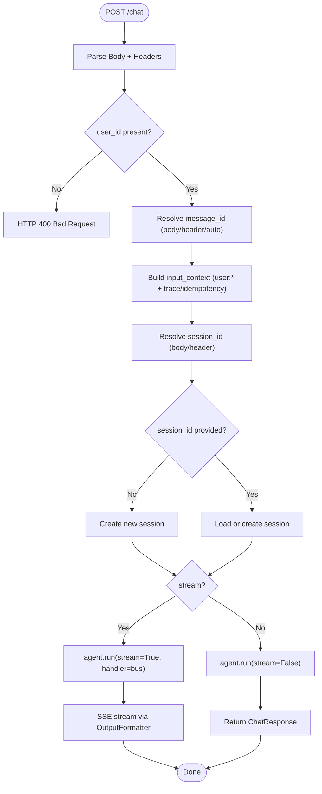
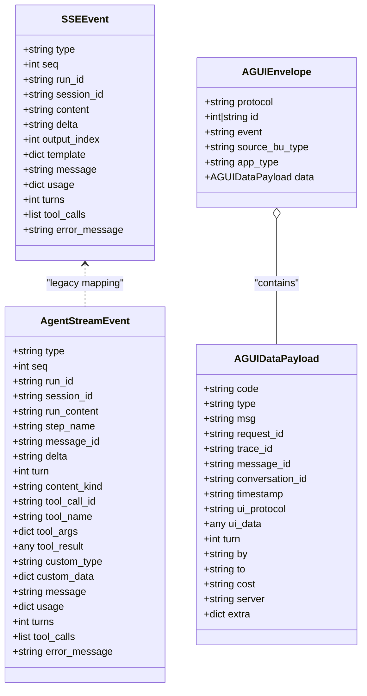
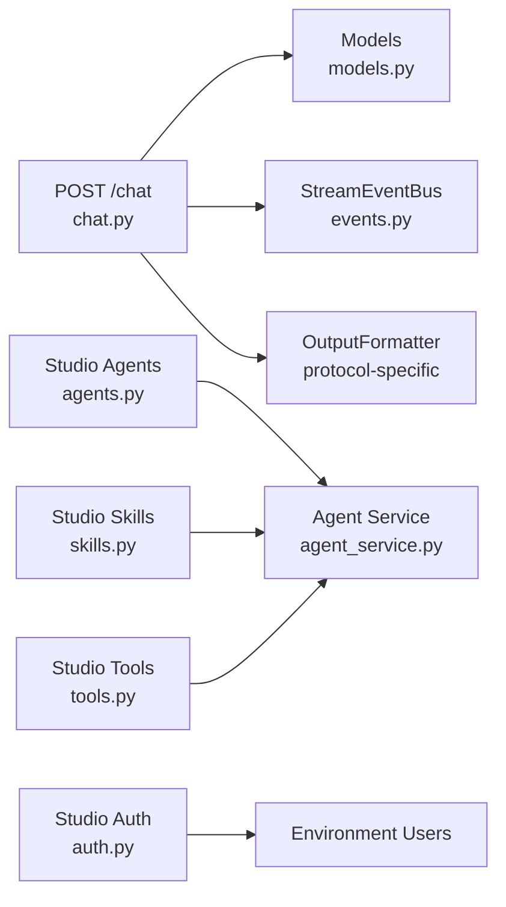

# API Reference

<cite>
**Referenced Files in This Document**
- [app.py](file://src/ark_agentic/app.py)
- [chat.py](file://src/ark_agentic/api/chat.py)
- [models.py](file://src/ark_agentic/api/models.py)
- [events.py](file://src/ark_agentic/core/stream/events.py)
- [agui_models.py](file://src/ark_agentic/core/stream/agui_models.py)
- [agents.py](file://src/ark_agentic/studio/api/agents.py)
- [skills.py](file://src/ark_agentic/studio/api/skills.py)
- [tools.py](file://src/ark_agentic/studio/api/tools.py)
- [auth.py](file://src/ark_agentic/studio/api/auth.py)
- [memory.py](file://src/ark_agentic/studio/api/memory.py)
- [agent_service.py](file://src/ark_agentic/studio/services/agent_service.py)
- [ark-agentic-api.postman_collection.json](file://postman/ark-agentic-api.postman_collection.json)
</cite>

## Table of Contents
1. [Introduction](#introduction)
2. [Project Structure](#project-structure)
3. [Core Components](#core-components)
4. [Architecture Overview](#architecture-overview)
5. [Detailed Component Analysis](#detailed-component-analysis)
6. [Dependency Analysis](#dependency-analysis)
7. [Performance Considerations](#performance-considerations)
8. [Troubleshooting Guide](#troubleshooting-guide)
9. [Conclusion](#conclusion)
10. [Appendices](#appendices)

## Introduction
This document provides comprehensive API documentation for the Ark Agentic Space platform. It covers:
- Unified FastAPI endpoints for chat interactions with streaming support via Server-Sent Events (SSE)
- Authentication for the Studio admin interface
- Studio endpoints for agent management, skill administration, and tool configuration
- Request/response schemas, headers, SSE event formats, error handling, and practical Postman examples

The platform supports multiple agents (insurance, securities) and multiple streaming protocols (agui, internal, enterprise, alone).

## Project Structure
The API surface is organized around:
- Unified chat endpoint under the main API router
- Studio admin endpoints for managing agents, skills, tools, and memory
- Streaming event bus and formatters for SSE delivery

**Diagram sources**
- [app.py:84-101](file://src/ark_agentic/app.py#L84-L101)
- [chat.py:27-176](file://src/ark_agentic/api/chat.py#L27-L176)
- [models.py:27-102](file://src/ark_agentic/api/models.py#L27-L102)
- [events.py:67-116](file://src/ark_agentic/core/stream/events.py#L67-L116)
- [agents.py:76-130](file://src/ark_agentic/studio/api/agents.py#L76-L130)
- [skills.py:57-112](file://src/ark_agentic/studio/api/skills.py#L57-L112)
- [tools.py:41-65](file://src/ark_agentic/studio/api/tools.py#L41-L65)
- [auth.py:94-114](file://src/ark_agentic/studio/api/auth.py#L94-L114)
- [memory.py:24-45](file://src/ark_agentic/studio/api/memory.py#L24-L45)

**Section sources**
- [app.py:84-101](file://src/ark_agentic/app.py#L84-L101)

## Core Components
- Unified Chat Endpoint: POST /chat supporting non-stream and SSE streaming with multiple protocol options
- SSE Event Formats: response.* (legacy internal), AG-UI native events, and enterprise AGUI envelope
- Studio Admin APIs: agent CRUD, skill CRUD, tool scaffolding, authentication, and memory management
- Request/Response Schemas: Pydantic models define request bodies, responses, and SSE event structures

**Section sources**
- [chat.py:27-176](file://src/ark_agentic/api/chat.py#L27-L176)
- [models.py:27-102](file://src/ark_agentic/api/models.py#L27-L102)
- [events.py:30-116](file://src/ark_agentic/core/stream/events.py#L30-L116)
- [agui_models.py:16-51](file://src/ark_agentic/core/stream/agui_models.py#L16-L51)

## Architecture Overview
The chat flow integrates request parsing, session resolution, agent execution, and streaming via an event bus and protocol-specific formatters.

**Diagram sources**
- [chat.py:27-176](file://src/ark_agentic/api/chat.py#L27-L176)
- [events.py:67-116](file://src/ark_agentic/core/stream/events.py#L67-L116)

## Detailed Component Analysis

### Unified Chat Endpoint: POST /chat
- Purpose: Send a message to an agent with optional streaming and context
- Headers:
  - x-ark-user-id (optional, fallback if user_id missing in body)
  - x-ark-session-id (optional, session continuity)
  - x-ark-message-id (optional, fallback if message_id missing in body)
  - x-ark-trace-id (optional, tracing context)
- Query parameters:
  - None
- Body (ChatRequest):
  - agent_id: string, default "insurance"
  - message: string, required
  - session_id: string, optional
  - stream: boolean, default false
  - run_options: object, optional (model overrides, temperature, etc.)
  - protocol: string, one of ["agui", "internal", "enterprise", "alone"], default "internal"
  - source_bu_type: string, enterprise mode
  - app_type: string, enterprise mode
  - user_id: string, optional (body or header)
  - message_id: string, optional (auto-generated if omitted)
  - context: dict, optional key-value business context
  - idempotency_key: string, optional
  - history: array of {role: "user"|"assistant", content: string} or JSON string, optional
  - use_history: boolean, default true
- Responses:
  - Non-stream: ChatResponse (session_id, message_id, response, tool_calls, turns, usage)
  - Stream: SSE stream with protocol-specific events
- Errors:
  - 400: Missing user_id (body or header)
  - 500: Agent runtime exceptions (mapped to SSE failure event)
- Rate limiting:
  - Not implemented at API layer; consider upstream rate limiting or middleware

**Diagram sources**
- [chat.py:27-176](file://src/ark_agentic/api/chat.py#L27-L176)
- [models.py:27-68](file://src/ark_agentic/api/models.py#L27-L68)

**Section sources**
- [chat.py:27-176](file://src/ark_agentic/api/chat.py#L27-L176)
- [models.py:27-68](file://src/ark_agentic/api/models.py#L27-L68)

### SSE Event Formats
The SSE stream emits events formatted according to the chosen protocol.

- Protocol: internal
  - Events: response.created, response.step, response.content.delta, response.completed, response.failed
  - SSEEvent fields: type, seq, run_id, session_id, content/delta/message/tool_calls/usage/turns/error_message
- Protocol: agui (bare AG-UI native)
  - Events: run_started, step_started, step_finished, text_message_start, text_message_content, text_message_end, tool_call_start, tool_call_args, tool_call_end, tool_call_result, custom, run_finished, run_error
  - AgentStreamEvent fields include type, seq, run_id, session_id, plus protocol-specific fields
- Protocol: enterprise (AGUI envelope)
  - Top-level: protocol=AGUI, event, id, source_bu_type, app_type, data
  - data: code, type, msg, request_id, trace_id, message_id, conversation_id, timestamp, ui_protocol, ui_data, turn, by, to, cost, server, extra
- Protocol: alone
  - No special framing; emits raw AgentStreamEvent JSON

**Diagram sources**
- [models.py:73-102](file://src/ark_agentic/api/models.py#L73-L102)
- [events.py:67-116](file://src/ark_agentic/core/stream/events.py#L67-L116)
- [agui_models.py:16-51](file://src/ark_agentic/core/stream/agui_models.py#L16-L51)

**Section sources**
- [models.py:73-102](file://src/ark_agentic/api/models.py#L73-L102)
- [events.py:30-116](file://src/ark_agentic/core/stream/events.py#L30-L116)
- [agui_models.py:16-51](file://src/ark_agentic/core/stream/agui_models.py#L16-L51)

### Studio Admin API: Authentication
- POST /api/studio/auth/login
  - Request: { username, password }
  - Response: { user_id, role, display_name }
  - Behavior: Validates against STUDIO_USERS environment (JSON object) or built-in defaults; uses bcrypt password hash
  - Errors: 401 Unauthorized for invalid credentials

**Section sources**
- [auth.py:94-114](file://src/ark_agentic/studio/api/auth.py#L94-L114)

### Studio Admin API: Agent Management
- GET /api/studio/agents
  - Response: { agents: [AgentMeta] }
  - Scans agents directory and reads agent.json if present
- GET /api/studio/agents/{agent_id}
  - Response: AgentMeta (fallback to minimal metadata if agent.json missing)
- POST /api/studio/agents
  - Request: { id, name, description }
  - Response: AgentMeta (201 Created)
  - Side effects: Creates directory structure with skills/ and tools/ subdirectories and writes agent.json

**Section sources**
- [agents.py:76-130](file://src/ark_agentic/studio/api/agents.py#L76-L130)
- [agent_service.py:60-137](file://src/ark_agentic/studio/services/agent_service.py#L60-L137)

### Studio Admin API: Skill Administration
- GET /api/studio/agents/{agent_id}/skills
  - Response: { skills: [SkillMeta] }
- POST /api/studio/agents/{agent_id}/skills
  - Request: { name, description, content }
  - Response: SkillMeta
  - Errors: 404 Agent not found, 409 Skill already exists, 400 Validation error
  - Side effect: Reloads agent’s skill cache
- PUT /api/studio/agents/{agent_id}/skills/{skill_id}
  - Request: { name?, description?, content? }
  - Response: SkillMeta
- DELETE /api/studio/agents/{agent_id}/skills/{skill_id}
  - Response: { status: "deleted", skill_id }

**Section sources**
- [skills.py:57-112](file://src/ark_agentic/studio/api/skills.py#L57-L112)

### Studio Admin API: Tool Configuration
- GET /api/studio/agents/{agent_id}/tools
  - Response: { tools: [ToolMeta] }
- POST /api/studio/agents/{agent_id}/tools
  - Request: { name, description, parameters: [{name, description, type, required}] }
  - Response: ToolMeta
  - Errors: 404 Agent not found, 409 Tool already exists, 400 Validation error

**Section sources**
- [tools.py:41-65](file://src/ark_agentic/studio/api/tools.py#L41-L65)

### Studio Admin API: Memory Management
- GET /api/studio/agents/{agent_id}/memory/files
  - Response: { files: [MemoryFileItem] }
- GET /api/studio/agents/{agent_id}/memory/content
  - Query: file_path, user_id
  - Response: text/plain
- PUT /api/studio/agents/{agent_id}/memory/content
  - Query: file_path, user_id
  - Content-Type: text/plain
  - Response: { status: "saved" }

**Section sources**
- [memory.py:24-45](file://src/ark_agentic/studio/api/memory.py#L24-L45)

## Dependency Analysis
- Chat endpoint depends on:
  - Agent registry and session manager
  - StreamEventBus and OutputFormatter for SSE
  - Pydantic models for request/response validation
- Studio endpoints depend on:
  - Agent/service layer abstractions (agent_service, skill_service, tool_service)
  - Environment utilities for locating agent directories

**Diagram sources**
- [chat.py:15-20](file://src/ark_agentic/api/chat.py#L15-L20)
- [models.py:14](file://src/ark_agentic/api/models.py#L14)
- [events.py:17-18](file://src/ark_agentic/core/stream/events.py#L17-L18)
- [agents.py:18](file://src/ark_agentic/studio/api/agents.py#L18)
- [skills.py:14-17](file://src/ark_agentic/studio/api/skills.py#L14-L17)
- [tools.py:15-17](file://src/ark_agentic/studio/api/tools.py#L15-L17)
- [auth.py:68-80](file://src/ark_agentic/studio/api/auth.py#L68-L80)

**Section sources**
- [chat.py:15-20](file://src/ark_agentic/api/chat.py#L15-L20)
- [agents.py:18](file://src/ark_agentic/studio/api/agents.py#L18)
- [skills.py:14-17](file://src/ark_agentic/studio/api/skills.py#L14-L17)
- [tools.py:15-17](file://src/ark_agentic/studio/api/tools.py#L15-L17)
- [auth.py:68-80](file://src/ark_agentic/studio/api/auth.py#L68-L80)

## Performance Considerations
- Streaming overhead: SSE introduces latency and bandwidth overhead; choose non-stream for latency-critical scenarios
- Protocol choice: enterprise AGUI adds envelope overhead; use internal or agui for lower overhead
- Idempotency: use idempotency_key to prevent duplicate processing on retries
- Session reuse: supply x-ark-session-id to avoid session creation overhead
- History merging: keep history minimal to reduce token usage and latency

## Troubleshooting Guide
- 400 Bad Request: Ensure user_id is provided either in body or x-ark-user-id header
- 401 Unauthorized: Verify Studio login credentials and STUDIO_USERS configuration
- 404 Not Found: Agent or skill not found; confirm IDs and directory structure
- 409 Conflict: Resource already exists (agent, skill, tool); choose a different identifier
- 500 Internal Server Error: Agent runtime exceptions are captured and emitted as SSE failure events; inspect logs for details
- SSE connection drops: Ensure Accept: text/event-stream and handle reconnect logic on client side

**Section sources**
- [chat.py:42-43](file://src/ark_agentic/api/chat.py#L42-L43)
- [auth.py:99-108](file://src/ark_agentic/studio/api/auth.py#L99-L108)
- [skills.py:63-81](file://src/ark_agentic/studio/api/skills.py#L63-L81)
- [tools.py:55-65](file://src/ark_agentic/studio/api/tools.py#L55-L65)

## Conclusion
The Ark Agentic Space provides a unified, extensible API for conversational agents with flexible streaming protocols and a comprehensive Studio admin suite for agent, skill, and tool management. Use the Postman collection to explore endpoints quickly and adopt the appropriate protocol for your client needs.

## Appendices

### HTTP Endpoints Summary
- POST /chat
  - Headers: x-ark-user-id, x-ark-session-id, x-ark-message-id, x-ark-trace-id
  - Body: ChatRequest
  - Responses: ChatResponse (non-stream) or SSE (stream)
- GET /health
  - Response: { status: "ok" }

**Section sources**
- [chat.py:27-176](file://src/ark_agentic/api/chat.py#L27-L176)
- [app.py:131-133](file://src/ark_agentic/app.py#L131-L133)

### Postman Collection Examples
- Health check
  - Method: GET
  - Path: {{baseUrl}}/health
- Chat (non-stream)
  - Method: POST
  - Path: {{baseUrl}}/chat
  - Headers: Content-Type: application/json
  - Body: ChatRequest (stream=false)
- Chat (non-stream with headers)
  - Method: POST
  - Path: {{baseUrl}}/chat
  - Headers: Content-Type: application/json, x-ark-user-id: {{user_id}}, x-ark-trace-id: trace-{{$randomUUID}}
  - Body: ChatRequest (stream=false)
- Chat (SSE stream - internal)
  - Method: POST
  - Path: {{baseUrl}}/chat
  - Headers: Content-Type: application/json, Accept: text/event-stream
  - Body: ChatRequest (protocol=internal)
- Chat (SSE stream - AGUI native)
  - Method: POST
  - Path: {{baseUrl}}/chat
  - Headers: Content-Type: application/json, Accept: text/event-stream
  - Body: ChatRequest (protocol=agui)
- Chat (SSE stream - Enterprise AGUI)
  - Method: POST
  - Path: {{baseUrl}}/chat
  - Headers: Content-Type: application/json, Accept: text/event-stream
  - Body: ChatRequest (protocol=enterprise, source_bu_type, app_type)
- Chat (with idempotency key)
  - Method: POST
  - Path: {{baseUrl}}/chat
  - Headers: Content-Type: application/json
  - Body: ChatRequest (idempotency_key)
- Chat (with session)
  - Method: POST
  - Path: {{baseUrl}}/chat
  - Headers: Content-Type: application/json, x-ark-session-key: {{session_id}}
  - Body: ChatRequest

**Section sources**
- [ark-agentic-api.postman_collection.json:21-361](file://postman/ark-agentic-api.postman_collection.json#L21-L361)

### Client Implementation Guidelines
- JavaScript (fetch + SSE)
  - Set Accept: text/event-stream
  - Use EventSource to consume SSE
  - Parse events based on selected protocol (internal vs. agui vs. enterprise)
- Python (requests + SSE)
  - Use requests with stream=True
  - Iterate over response.iter_lines() and parse event data
- Go (net/http + SSE)
  - Implement SSE reader loop
  - Map events to protocol-specific structures
- Java/Kotlin (OkHttp + SSE)
  - Use streaming response and parse lines
  - Maintain session_id across requests

[No sources needed since this section provides general guidance]