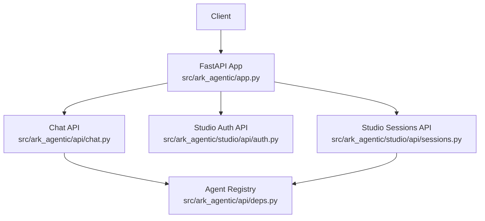
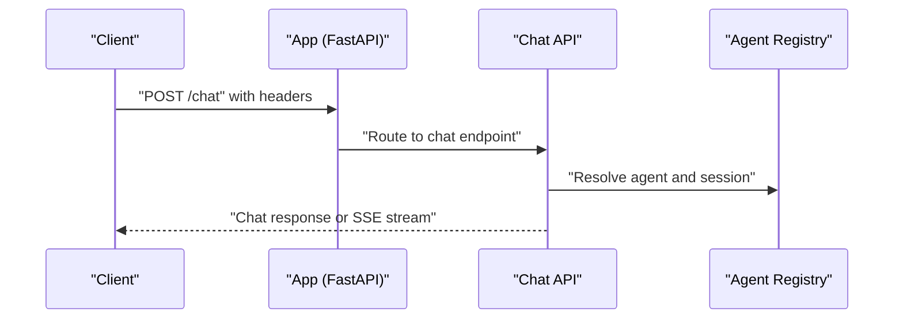
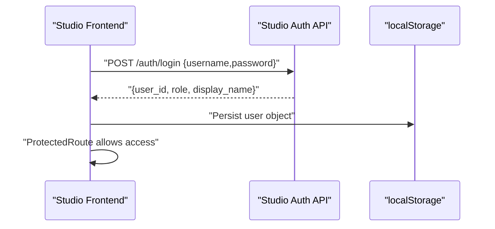
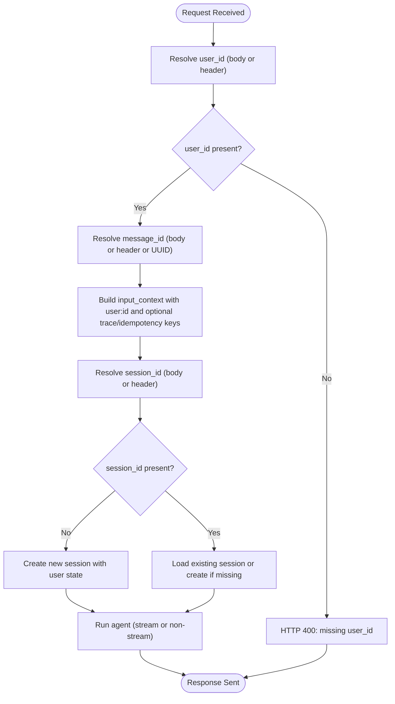
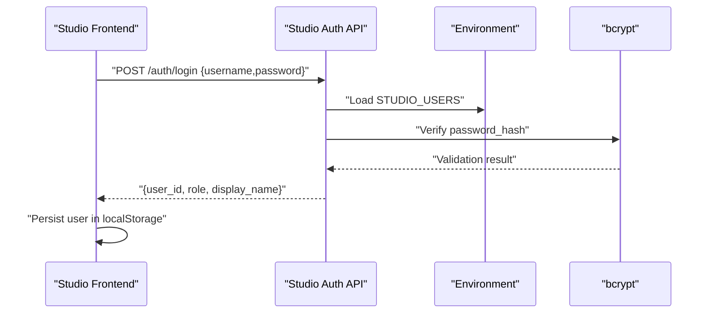
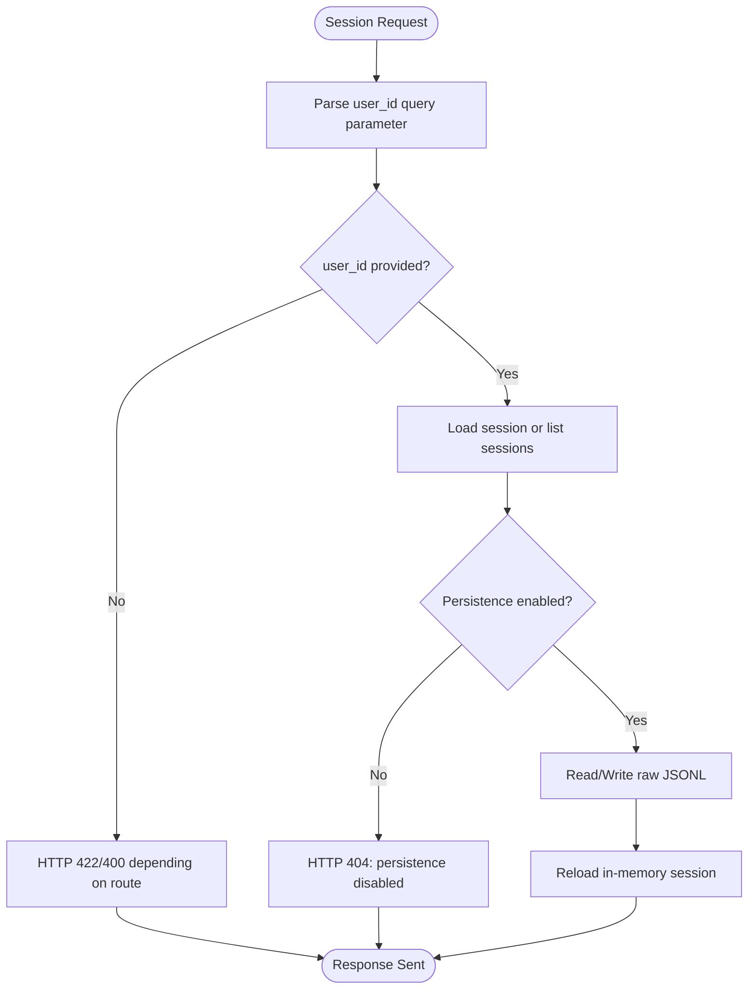
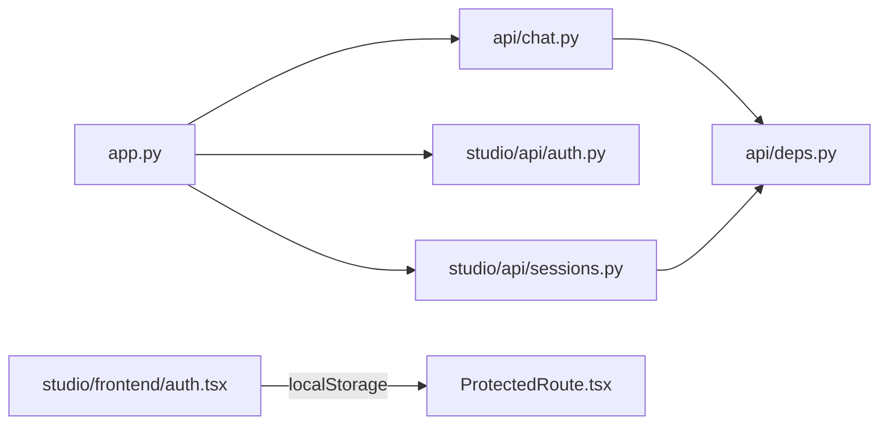

# Authentication & Authorization

<cite>
**Referenced Files in This Document**
- [README.md](file://README.md)
- [.env-sample](file://.env-sample)
- [src/ark_agentic/app.py](file://src/ark_agentic/app.py)
- [src/ark_agentic/api/chat.py](file://src/ark_agentic/api/chat.py)
- [src/ark_agentic/api/deps.py](file://src/ark_agentic/api/deps.py)
- [src/ark_agentic/studio/api/auth.py](file://src/ark_agentic/studio/api/auth.py)
- [src/ark_agentic/studio/api/sessions.py](file://src/ark_agentic/studio/api/sessions.py)
- [src/ark_agentic/studio/frontend/src/auth.tsx](file://src/ark_agentic/studio/frontend/src/auth.tsx)
- [src/ark_agentic/studio/frontend/src/components/ProtectedRoute.tsx](file://src/ark_agentic/studio/frontend/src/components/ProtectedRoute.tsx)
- [postman/ark-agentic-api.postman_collection.json](file://postman/ark-agentic-api.postman_collection.json)
- [tests/integration/test_chat_api.py](file://tests/integration/test_chat_api.py)
</cite>

## Table of Contents
1. [Introduction](#introduction)
2. [Project Structure](#project-structure)
3. [Core Components](#core-components)
4. [Architecture Overview](#architecture-overview)
5. [Detailed Component Analysis](#detailed-component-analysis)
6. [Dependency Analysis](#dependency-analysis)
7. [Performance Considerations](#performance-considerations)
8. [Troubleshooting Guide](#troubleshooting-guide)
9. [Conclusion](#conclusion)
10. [Appendices](#appendices)

## Introduction
This document explains the authentication and authorization mechanisms for the API system, covering:
- Header-based authentication for the core chat API
- Studio management API login and session-based access patterns
- Environment variable configuration for security settings
- API key management and access control patterns
- Practical authenticated request examples and common scenarios
- Security best practices and token handling guidelines

## Project Structure
The authentication surface spans:
- Core chat API with header-based identity resolution
- Studio login API with local storage-based session
- Shared agent registry and routing initialization
- Frontend protected routes leveraging local user state

**Diagram sources**
- [src/ark_agentic/app.py:100-101](file://src/ark_agentic/app.py#L100-L101)
- [src/ark_agentic/api/chat.py:27-34](file://src/ark_agentic/api/chat.py#L27-L34)
- [src/ark_agentic/studio/api/auth.py:94-115](file://src/ark_agentic/studio/api/auth.py#L94-L115)
- [src/ark_agentic/studio/api/sessions.py:84-143](file://src/ark_agentic/studio/api/sessions.py#L84-L143)
- [src/ark_agentic/api/deps.py:25-37](file://src/ark_agentic/api/deps.py#L25-L37)

**Section sources**
- [src/ark_agentic/app.py:100-101](file://src/ark_agentic/app.py#L100-L101)
- [src/ark_agentic/api/chat.py:27-34](file://src/ark_agentic/api/chat.py#L27-L34)
- [src/ark_agentic/studio/api/auth.py:94-115](file://src/ark_agentic/studio/api/auth.py#L94-L115)
- [src/ark_agentic/studio/api/sessions.py:84-143](file://src/ark_agentic/studio/api/sessions.py#L84-L143)
- [src/ark_agentic/api/deps.py:25-37](file://src/ark_agentic/api/deps.py#L25-L37)

## Core Components
- Header-based identity for chat API:
  - x-ark-user-id: mandatory user identity
  - x-ark-session-id: optional session identifier
  - x-ark-message-id: optional message identifier (auto-generated if absent)
  - x-ark-trace-id: optional tracing identifier
- Studio login API:
  - Accepts username/password, validates via bcrypt hash
  - Returns user_id, role, display_name
  - Stores user object in browser localStorage for session
- Environment variables:
  - API key for LLM provider
  - Studio enable flag and related paths
  - Optional service authentication headers for downstream integrations

**Section sources**
- [src/ark_agentic/api/chat.py:30-34](file://src/ark_agentic/api/chat.py#L30-L34)
- [src/ark_agentic/api/chat.py:40-58](file://src/ark_agentic/api/chat.py#L40-L58)
- [src/ark_agentic/studio/api/auth.py:94-115](file://src/ark_agentic/studio/api/auth.py#L94-L115)
- [.env-sample:16-20](file://.env-sample#L16-L20)
- [.env-sample:65-69](file://.env-sample#L65-L69)

## Architecture Overview
High-level authentication flows:

**Diagram sources**
- [src/ark_agentic/app.py:100](file://src/ark_agentic/app.py#L100)
- [src/ark_agentic/api/chat.py:27-34](file://src/ark_agentic/api/chat.py#L27-L34)
- [src/ark_agentic/api/deps.py:31-37](file://src/ark_agentic/api/deps.py#L31-L37)

Studio login flow:

**Diagram sources**
- [src/ark_agentic/studio/api/auth.py:94-115](file://src/ark_agentic/studio/api/auth.py#L94-L115)
- [src/ark_agentic/studio/frontend/src/auth.tsx:19-46](file://src/ark_agentic/studio/frontend/src/auth.tsx#L19-L46)
- [src/ark_agentic/studio/frontend/src/components/ProtectedRoute.tsx:1-8](file://src/ark_agentic/studio/frontend/src/components/ProtectedRoute.tsx#L1-L8)

## Detailed Component Analysis

### Core Chat API Authentication
- Identity resolution:
  - user_id is mandatory; taken from request body or x-ark-user-id header
  - message_id is optional; taken from request body or x-ark-message-id header; auto-generated if absent
  - trace_id is optional; taken from x-ark-trace-id header
- Session resolution:
  - session_id is optional; taken from request body or x-ark-session-id header
  - If absent, a new session is created with user state
- Context propagation:
  - input_context includes user:id, temp:trace_id, temp:idempotency_key, temp:message_id

**Diagram sources**
- [src/ark_agentic/api/chat.py:27-80](file://src/ark_agentic/api/chat.py#L27-L80)
- [src/ark_agentic/api/chat.py:87-113](file://src/ark_agentic/api/chat.py#L87-L113)
- [src/ark_agentic/api/chat.py:115-177](file://src/ark_agentic/api/chat.py#L115-L177)

**Section sources**
- [src/ark_agentic/api/chat.py:30-34](file://src/ark_agentic/api/chat.py#L30-L34)
- [src/ark_agentic/api/chat.py:40-58](file://src/ark_agentic/api/chat.py#L40-L58)
- [src/ark_agentic/api/chat.py:60-80](file://src/ark_agentic/api/chat.py#L60-L80)
- [tests/integration/test_chat_api.py:131-167](file://tests/integration/test_chat_api.py#L131-L167)
- [postman/ark-agentic-api.postman_collection.json:62-94](file://postman/ark-agentic-api.postman_collection.json#L62-L94)

### Studio Login API and Session-Based Access
- Login endpoint validates credentials against configured users:
  - Users can be provided via STUDIO_USERS environment variable (JSON object)
  - Defaults included for admin and viewer accounts
  - Passwords are bcrypt hashed; validation performed securely
- Successful login returns user profile fields suitable for frontend session
- Frontend stores the user object in localStorage under a fixed key
- ProtectedRoute enforces presence of user object to allow navigation

**Diagram sources**
- [src/ark_agentic/studio/api/auth.py:68-81](file://src/ark_agentic/studio/api/auth.py#L68-L81)
- [src/ark_agentic/studio/api/auth.py:83-92](file://src/ark_agentic/studio/api/auth.py#L83-L92)
- [src/ark_agentic/studio/api/auth.py:94-115](file://src/ark_agentic/studio/api/auth.py#L94-L115)
- [src/ark_agentic/studio/frontend/src/auth.tsx:19-46](file://src/ark_agentic/studio/frontend/src/auth.tsx#L19-L46)
- [src/ark_agentic/studio/frontend/src/components/ProtectedRoute.tsx:1-8](file://src/ark_agentic/studio/frontend/src/components/ProtectedRoute.tsx#L1-L8)

**Section sources**
- [src/ark_agentic/studio/api/auth.py:68-81](file://src/ark_agentic/studio/api/auth.py#L68-L81)
- [src/ark_agentic/studio/api/auth.py:83-92](file://src/ark_agentic/studio/api/auth.py#L83-L92)
- [src/ark_agentic/studio/api/auth.py:94-115](file://src/ark_agentic/studio/api/auth.py#L94-L115)
- [src/ark_agentic/studio/frontend/src/auth.tsx:19-46](file://src/ark_agentic/studio/frontend/src/auth.tsx#L19-L46)
- [src/ark_agentic/studio/frontend/src/components/ProtectedRoute.tsx:1-8](file://src/ark_agentic/studio/frontend/src/components/ProtectedRoute.tsx#L1-L8)

### Studio Sessions API Access Control
- Sessions endpoints require explicit user ownership verification via user_id query parameter
- Listing and retrieving sessions is supported; raw read/write operations are provided
- Persistence is file-based (JSONL), with validation and error handling for malformed content

**Diagram sources**
- [src/ark_agentic/studio/api/sessions.py:117-143](file://src/ark_agentic/studio/api/sessions.py#L117-L143)
- [src/ark_agentic/studio/api/sessions.py:146-166](file://src/ark_agentic/studio/api/sessions.py#L146-L166)
- [src/ark_agentic/studio/api/sessions.py:169-199](file://src/ark_agentic/studio/api/sessions.py#L169-L199)

**Section sources**
- [src/ark_agentic/studio/api/sessions.py:84-114](file://src/ark_agentic/studio/api/sessions.py#L84-L114)
- [src/ark_agentic/studio/api/sessions.py:117-143](file://src/ark_agentic/studio/api/sessions.py#L117-L143)
- [src/ark_agentic/studio/api/sessions.py:146-166](file://src/ark_agentic/studio/api/sessions.py#L146-L166)
- [src/ark_agentic/studio/api/sessions.py:169-199](file://src/ark_agentic/studio/api/sessions.py#L169-L199)

### Environment Variables and Security Settings
- LLM provider configuration:
  - LLM_PROVIDER, MODEL_NAME, API_KEY, LLM_BASE_URL
- Studio and runtime:
  - ENABLE_STUDIO, LOG_LEVEL, API_HOST, API_PORT
  - SESSIONS_DIR, MEMORY_DIR
- Downstream service authentication:
  - Optional header-based auth for securities services via dedicated variables

**Section sources**
- [.env-sample:6-20](file://.env-sample#L6-L20)
- [.env-sample:53-69](file://.env-sample#L53-L69)
- [README.md:676-729](file://README.md#L676-L729)

## Dependency Analysis
- Chat API depends on shared AgentRegistry initialized at startup
- Studio APIs depend on the same registry for session operations
- Frontend relies on local storage for session continuity

**Diagram sources**
- [src/ark_agentic/app.py:68](file://src/ark_agentic/app.py#L68)
- [src/ark_agentic/api/deps.py:19-28](file://src/ark_agentic/api/deps.py#L19-L28)
- [src/ark_agentic/studio/frontend/src/auth.tsx:19-46](file://src/ark_agentic/studio/frontend/src/auth.tsx#L19-L46)
- [src/ark_agentic/studio/frontend/src/components/ProtectedRoute.tsx:1-8](file://src/ark_agentic/studio/frontend/src/components/ProtectedRoute.tsx#L1-L8)

**Section sources**
- [src/ark_agentic/app.py:68](file://src/ark_agentic/app.py#L68)
- [src/ark_agentic/api/deps.py:19-28](file://src/ark_agentic/api/deps.py#L19-L28)
- [src/ark_agentic/studio/frontend/src/auth.tsx:19-46](file://src/ark_agentic/studio/frontend/src/auth.tsx#L19-L46)
- [src/ark_agentic/studio/frontend/src/components/ProtectedRoute.tsx:1-8](file://src/ark_agentic/studio/frontend/src/components/ProtectedRoute.tsx#L1-L8)

## Performance Considerations
- Header-based identity avoids extra round trips; ensure clients consistently supply x-ark-user-id and x-ark-session-id when appropriate
- Auto-generation of message_id reduces client-side overhead
- Streaming responses are efficient for long-running agent runs; ensure clients handle SSE gracefully
- Studio raw JSONL read/write operations validate content; avoid sending malformed NDJSON to prevent validation errors

[No sources needed since this section provides general guidance]

## Troubleshooting Guide
Common issues and resolutions:
- Missing user_id in chat requests:
  - Ensure either request.body.user_id or x-ark-user-id header is provided
- Invalid or missing session_id:
  - If omitted, a new session is created automatically; verify agent availability and session persistence
- Studio login failures:
  - Confirm STUDIO_USERS environment variable is valid JSON object
  - Ensure password_hash matches bcrypt hash for the given user
- Frontend route protection:
  - ProtectedRoute redirects unauthenticated users to login; confirm localStorage contains the expected user object

**Section sources**
- [src/ark_agentic/api/chat.py:40-43](file://src/ark_agentic/api/chat.py#L40-L43)
- [src/ark_agentic/studio/api/auth.py:96-108](file://src/ark_agentic/studio/api/auth.py#L96-L108)
- [src/ark_agentic/studio/frontend/src/components/ProtectedRoute.tsx:1-8](file://src/ark_agentic/studio/frontend/src/components/ProtectedRoute.tsx#L1-L8)

## Conclusion
The system employs straightforward, header-driven identity for the core chat API and a lightweight, localStorage-backed session for Studio. Security relies on:
- Strong password hashing for Studio users
- Explicit user ownership checks in Studio sessions
- Environment-controlled LLM and service authentication
Adhering to the recommended patterns ensures secure and predictable operation across both APIs.

[No sources needed since this section summarizes without analyzing specific files]

## Appendices

### Example Requests and Scenarios
- Non-stream chat with headers:
  - Headers include x-ark-user-id and x-ark-trace-id
  - Body includes agent_id, message, stream=false, optional context
- Stream chat with headers:
  - Same as above with stream=true
- Message ID precedence:
  - Body message_id overrides header x-ark-message-id
  - Absent message_id generates a UUID
- Studio login:
  - POST to /auth/login with username/password
  - Store returned user object in localStorage
  - ProtectedRoute enforces access

**Section sources**
- [postman/ark-agentic-api.postman_collection.json:62-94](file://postman/ark-agentic-api.postman_collection.json#L62-L94)
- [tests/integration/test_chat_api.py:131-167](file://tests/integration/test_chat_api.py#L131-L167)
- [src/ark_agentic/studio/api/auth.py:94-115](file://src/ark_agentic/studio/api/auth.py#L94-L115)
- [src/ark_agentic/studio/frontend/src/auth.tsx:19-46](file://src/ark_agentic/studio/frontend/src/auth.tsx#L19-L46)

### Security Best Practices
- Prefer x-ark-user-id header for server-side identity resolution
- Always supply x-ark-trace-id for observability and auditability
- Use STUDIO_USERS environment variable for production user management; avoid committing secrets
- Rotate API_KEY regularly and restrict its scope to the minimal required permissions
- Validate and sanitize any user-provided context passed to agents
- For downstream services requiring authentication, configure dedicated environment variables rather than hardcoding credentials

**Section sources**
- [src/ark_agentic/api/chat.py:40-58](file://src/ark_agentic/api/chat.py#L40-L58)
- [src/ark_agentic/studio/api/auth.py:68-81](file://src/ark_agentic/studio/api/auth.py#L68-L81)
- [.env-sample:16-20](file://.env-sample#L16-L20)
- [.env-sample:65-69](file://.env-sample#L65-L69)