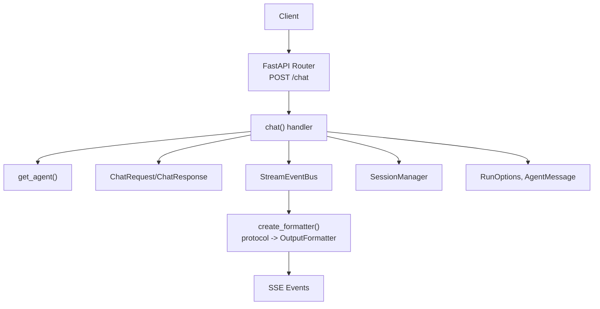
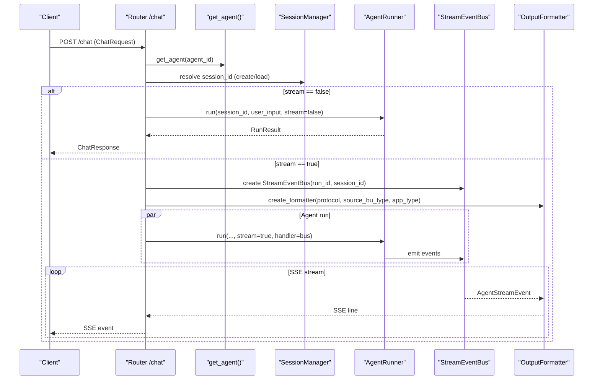
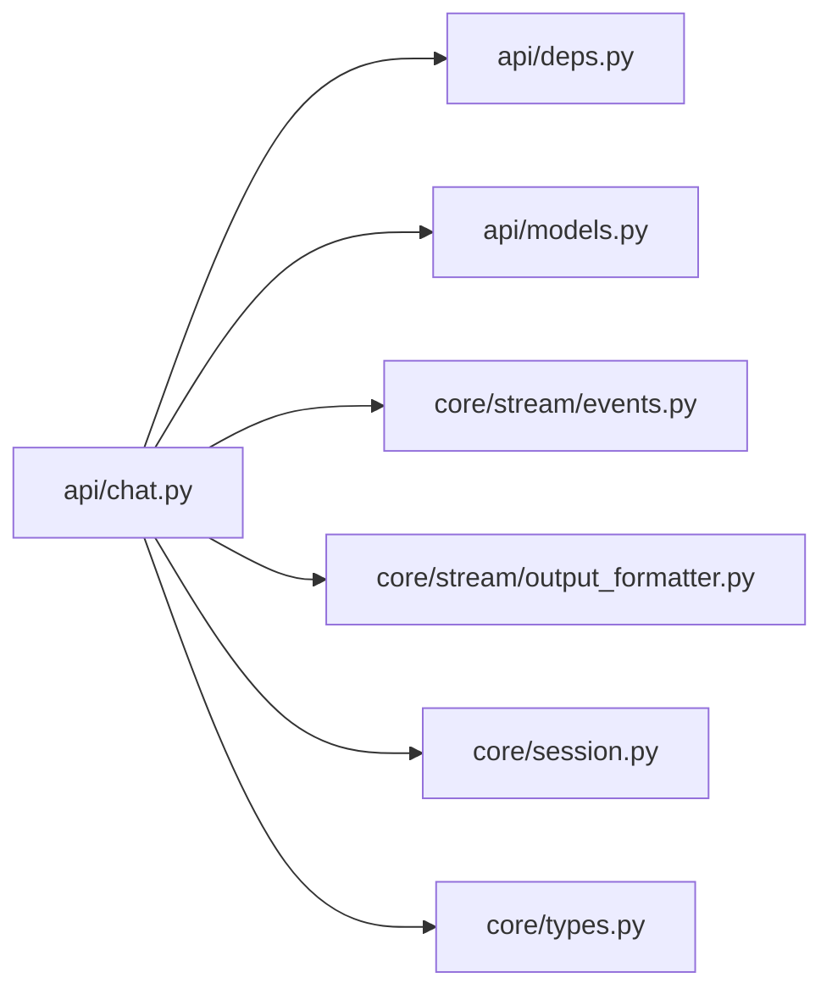

# Core Chat API

<cite>
**Referenced Files in This Document**
- [chat.py](file://src/ark_agentic/api/chat.py)
- [models.py](file://src/ark_agentic/api/models.py)
- [deps.py](file://src/ark_agentic/api/deps.py)
- [events.py](file://src/ark_agentic/core/stream/events.py)
- [output_formatter.py](file://src/ark_agentic/core/stream/output_formatter.py)
- [agui_models.py](file://src/ark_agentic/core/stream/agui_models.py)
- [session.py](file://src/ark_agentic/core/session.py)
- [types.py](file://src/ark_agentic/core/types.py)
- [test_chat_api.py](file://tests/integration/test_chat_api.py)
- [README.md](file://README.md)
</cite>

## Table of Contents
1. [Introduction](#introduction)
2. [Project Structure](#project-structure)
3. [Core Components](#core-components)
4. [Architecture Overview](#architecture-overview)
5. [Detailed Component Analysis](#detailed-component-analysis)
6. [Dependency Analysis](#dependency-analysis)
7. [Performance Considerations](#performance-considerations)
8. [Troubleshooting Guide](#troubleshooting-guide)
9. [Conclusion](#conclusion)

## Introduction
This document provides comprehensive API documentation for the core chat endpoint POST /chat. It covers request/response schemas, authentication headers, session management, idempotency handling, streaming protocols, and error handling. The endpoint supports both streaming (Server-Sent Events) and non-streaming responses, with protocol selection for SSE output.

## Project Structure
The chat API is implemented as a FastAPI route with Pydantic models for request/response validation. Streaming is handled via an event bus and protocol-specific formatters.

**Diagram sources**
- [chat.py:27-177](file://src/ark_agentic/api/chat.py#L27-L177)
- [models.py:27-104](file://src/ark_agentic/api/models.py#L27-L104)
- [deps.py:31-37](file://src/ark_agentic/api/deps.py#L31-L37)
- [output_formatter.py:417-444](file://src/ark_agentic/core/stream/output_formatter.py#L417-L444)
- [session.py:24-482](file://src/ark_agentic/core/session.py#L24-L482)
- [types.py:301-311](file://src/ark_agentic/core/types.py#L301-L311)

**Section sources**
- [chat.py:27-177](file://src/ark_agentic/api/chat.py#L27-L177)
- [models.py:27-104](file://src/ark_agentic/api/models.py#L27-L104)
- [deps.py:31-37](file://src/ark_agentic/api/deps.py#L31-L37)
- [output_formatter.py:417-444](file://src/ark_agentic/core/stream/output_formatter.py#L417-L444)
- [session.py:24-482](file://src/ark_agentic/core/session.py#L24-L482)
- [types.py:301-311](file://src/ark_agentic/core/types.py#L301-L311)

## Core Components
- Endpoint: POST /chat
- Request model: ChatRequest
- Response model: ChatResponse
- Streaming: Server-Sent Events (SSE) with configurable protocol
- Authentication: x-ark-* headers
- Idempotency: idempotency_key in request context
- Session management: automatic creation or retrieval via SessionManager

**Section sources**
- [chat.py:27-177](file://src/ark_agentic/api/chat.py#L27-L177)
- [models.py:27-104](file://src/ark_agentic/api/models.py#L27-L104)
- [README.md:71-134](file://README.md#L71-L134)

## Architecture Overview
The chat endpoint orchestrates user input, session resolution, agent execution, and streaming output. It supports two modes:
- Non-streaming: returns ChatResponse immediately
- Streaming: emits SSE events formatted per selected protocol

**Diagram sources**
- [chat.py:27-177](file://src/ark_agentic/api/chat.py#L27-L177)
- [deps.py:31-37](file://src/ark_agentic/api/deps.py#L31-L37)
- [session.py:184-227](file://src/ark_agentic/core/session.py#L184-L227)
- [output_formatter.py:417-444](file://src/ark_agentic/core/stream/output_formatter.py#L417-L444)

## Detailed Component Analysis

### Request Schema: ChatRequest
All fields are required unless marked optional. Validation ensures history can be provided as an array or a JSON string.

- agent_id: string (default: "insurance")
- message: string (required)
- session_id: string | null (optional; if absent, a new session is created)
- stream: boolean (default: false)
- run_options: RunOptions | null (optional overrides for model/temperature)
- protocol: string (default: "internal"; values: agui, internal, enterprise, alone)
- source_bu_type: string (enterprise mode)
- app_type: string (enterprise mode)
- user_id: string | null (required; either body or x-ark-user-id header)
- message_id: string | null (optional; auto-generated UUID if absent)
- context: dict | null (arbitrary key-value pairs; keys with ":" preserved, others prefixed with "user:")
- idempotency_key: string | null (prevents duplicate requests)
- history: list[HistoryMessage] | null (external history messages; supports JSON string)
- use_history: boolean (default: true)

Validation rules:
- history accepts JSON string and converts to list if provided as string
- user_id must be provided in either body or x-ark-user-id header

**Section sources**
- [models.py:27-58](file://src/ark_agentic/api/models.py#L27-L58)
- [chat.py:40-58](file://src/ark_agentic/api/chat.py#L40-L58)
- [test_chat_api.py:68-105](file://tests/integration/test_chat_api.py#L68-L105)

### Response Schema: ChatResponse (non-streaming)
- session_id: string
- message_id: string
- response: string
- tool_calls: list of dicts with keys "name" and "arguments"
- turns: integer
- usage: dict with "prompt_tokens" and "completion_tokens" (optional)

**Section sources**
- [models.py:61-69](file://src/ark_agentic/api/models.py#L61-L69)
- [chat.py:99-113](file://src/ark_agentic/api/chat.py#L99-L113)

### Streaming Response (SSE)
When stream is true, the endpoint returns Server-Sent Events. The protocol determines the event structure:
- agui: raw AgentStreamEvent JSON
- internal: legacy response.* events
- enterprise: AGUIEnvelope wrapper
- alone: ALONE sa_* events

Each emitted AgentStreamEvent is formatted into one or more SSE lines depending on the formatter.

**Section sources**
- [chat.py:115-177](file://src/ark_agentic/api/chat.py#L115-L177)
- [output_formatter.py:48-444](file://src/ark_agentic/core/stream/output_formatter.py#L48-L444)
- [events.py:67-116](file://src/ark_agentic/core/stream/events.py#L67-L116)

### Authentication and Idempotency Headers
- x-ark-user-id: user identifier (fallback if user_id missing in body)
- x-ark-session-id: session identifier (overrides request.session_id)
- x-ark-message-id: message identifier (overrides request.message_id)
- x-ark-trace-id: trace identifier (stored in input_context as temp:trace_id)
- idempotency_key: stored in input_context as temp:idempotency_key

Resolution order:
- user_id: body.user_id > header.x-ark-user-id
- message_id: body.message_id > header.x-ark-message-id > auto-generated UUID
- session_id: body.session_id > header.x-ark-session-id

**Section sources**
- [chat.py:30-46](file://src/ark_agentic/api/chat.py#L30-L46)
- [chat.py:60-79](file://src/ark_agentic/api/chat.py#L60-L79)
- [test_chat_api.py:162-175](file://tests/integration/test_chat_api.py#L162-L175)
- [README.md:127-133](file://README.md#L127-L133)

### Session Management
Behavior:
- If session_id is provided and exists, use it
- If not provided, create a new session with state {"user:id": user_id}
- If session_id provided but not found, attempt to load; if still not found, create a new session
- Session state includes temporary keys (prefixed with "temp:"), including trace_id, idempotency_key, and message_id

Persistence and state:
- Session entries include model/provider, messages, token usage, compaction stats, active skills, and state
- State updates are merged and persisted during sync

**Section sources**
- [chat.py:60-79](file://src/ark_agentic/api/chat.py#L60-L79)
- [session.py:40-67](file://src/ark_agentic/core/session.py#L40-L67)
- [session.py:184-227](file://src/ark_agentic/core/session.py#L184-L227)
- [session.py:445-452](file://src/ark_agentic/core/session.py#L445-L452)

### Protocol Types and SSE Event Structures
Supported protocols:
- agui: bare AG-UI events (AgentStreamEvent)
- internal: legacy response.* events
- enterprise: AGUIEnvelope wrapper with reasoning_start/reasoning_message_content/reasoning_end
- alone: ALONE sa_* events

Key event types (AG-UI):
- Lifecycle: run_started, run_finished, run_error
- Steps: step_started, step_finished
- Text: text_message_start, text_message_content, text_message_end
- Thinking: thinking_message_start, thinking_message_content, thinking_message_end
- Tools: tool_call_start, tool_call_args, tool_call_end, tool_call_result
- State: state_snapshot, state_delta, messages_snapshot
- Custom/Raw: custom, raw

Enterprise envelope fields:
- protocol: "AGUI"
- id: sequence number
- event: AG-UI event type
- source_bu_type, app_type: provided by request
- data: AGUIDataPayload with message_id, conversation_id, ui_protocol, ui_data, turn, etc.

**Section sources**
- [output_formatter.py:56-444](file://src/ark_agentic/core/stream/output_formatter.py#L56-L444)
- [events.py:30-116](file://src/ark_agentic/core/stream/events.py#L30-L116)
- [agui_models.py:16-51](file://src/ark_agentic/core/stream/agui_models.py#L16-L51)
- [README.md:105-126](file://README.md#L105-L126)

### Example Workflows

#### Non-streaming Request/Response
- Request: ChatRequest with stream=false
- Response: ChatResponse with response text, tool_calls, turns, usage

**Section sources**
- [chat.py:88-113](file://src/ark_agentic/api/chat.py#L88-L113)
- [models.py:61-69](file://src/ark_agentic/api/models.py#L61-L69)

#### Streaming Request/Response (protocol=internal)
- Request: ChatRequest with stream=true and protocol="internal"
- Response: SSE events including response.created, response.step, response.content.delta, response.completed, response.failed

**Section sources**
- [chat.py:115-177](file://src/ark_agentic/api/chat.py#L115-L177)
- [output_formatter.py:67-150](file://src/ark_agentic/core/stream/output_formatter.py#L67-L150)

#### Streaming Request/Response (protocol=enterprise)
- Request: ChatRequest with stream=true, protocol="enterprise", source_bu_type, app_type
- Response: SSE events including reasoning_start, reasoning_message_content, reasoning_end, plus wrapped AGUIEnvelope events

**Section sources**
- [output_formatter.py:152-339](file://src/ark_agentic/core/stream/output_formatter.py#L152-L339)
- [agui_models.py:39-51](file://src/ark_agentic/core/stream/agui_models.py#L39-L51)

### Error Handling
- Missing user_id: HTTP 400
- Agent not found: HTTP 404
- Agent runtime exceptions: SSE response.failed with error_message
- Session not found during load: fallback creates new session and logs warning

**Section sources**
- [chat.py:42-43](file://src/ark_agentic/api/chat.py#L42-L43)
- [deps.py:33-37](file://src/ark_agentic/api/deps.py#L33-L37)
- [chat.py:153-156](file://src/ark_agentic/api/chat.py#L153-L156)
- [chat.py:72-79](file://src/ark_agentic/api/chat.py#L72-L79)

## Dependency Analysis
The chat endpoint depends on:
- Agent registry via get_agent()
- SessionManager for session lifecycle
- StreamEventBus and OutputFormatter for streaming
- Pydantic models for validation

**Diagram sources**
- [chat.py:19-20](file://src/ark_agentic/api/chat.py#L19-L20)
- [deps.py:12-13](file://src/ark_agentic/api/deps.py#L12-L13)
- [models.py:14-14](file://src/ark_agentic/api/models.py#L14-L14)
- [events.py:16-17](file://src/ark_agentic/core/stream/events.py#L16-L17)
- [output_formatter.py:20-21](file://src/ark_agentic/core/stream/output_formatter.py#L20-L21)
- [session.py:18-19](file://src/ark_agentic/core/session.py#L18-L19)
- [types.py:13-15](file://src/ark_agentic/core/types.py#L13-L15)

**Section sources**
- [chat.py:19-20](file://src/ark_agentic/api/chat.py#L19-L20)
- [deps.py:12-13](file://src/ark_agentic/api/deps.py#L12-L13)
- [models.py:14-14](file://src/ark_agentic/api/models.py#L14-L14)
- [events.py:16-17](file://src/ark_agentic/core/stream/events.py#L16-L17)
- [output_formatter.py:20-21](file://src/ark_agentic/core/stream/output_formatter.py#L20-L21)
- [session.py:18-19](file://src/ark_agentic/core/session.py#L18-L19)
- [types.py:13-15](file://src/ark_agentic/core/types.py#L13-L15)

## Performance Considerations
- Streaming reduces perceived latency by emitting incremental events
- Session compaction helps maintain context window size; consider enabling for long conversations
- Tool parallelization can speed up multi-tool workflows
- Enterprise protocol adds envelope wrapping; choose protocol based on client compatibility

## Troubleshooting Guide
Common issues and resolutions:
- 400 Bad Request: Ensure user_id is provided (body or header)
- 404 Not Found: Verify agent_id exists in registry
- Unexpected session reuse: Provide explicit session_id or rely on automatic creation
- Streaming stops early: Check for response.failed SSE event and inspect error_message
- Enterprise events missing: Confirm protocol is set to "enterprise" and source_bu_type/app_type are provided

**Section sources**
- [test_chat_api.py:68-105](file://tests/integration/test_chat_api.py#L68-L105)
- [deps.py:33-37](file://src/ark_agentic/api/deps.py#L33-L37)
- [chat.py:153-156](file://src/ark_agentic/api/chat.py#L153-L156)

## Conclusion
The POST /chat endpoint provides a robust, extensible interface for conversational AI with flexible streaming protocols, comprehensive session management, and strong validation. By selecting appropriate protocols and headers, clients can integrate seamlessly with various frontends and backends while maintaining reliability and performance.