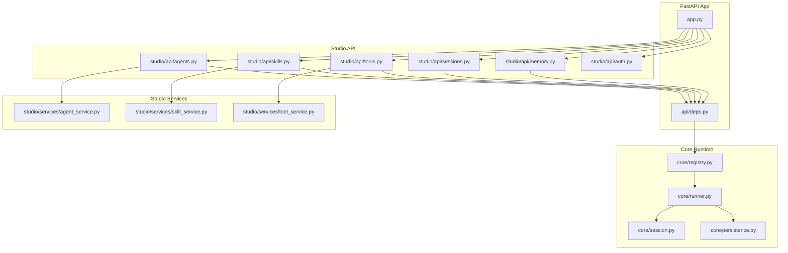
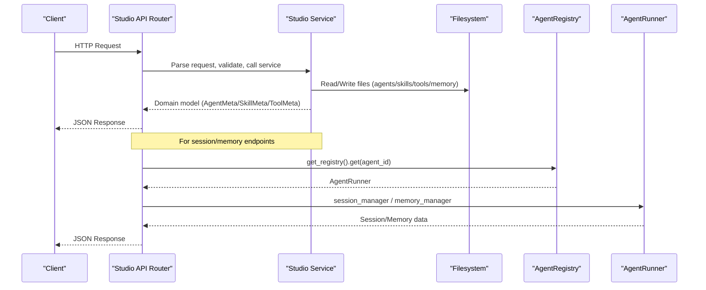
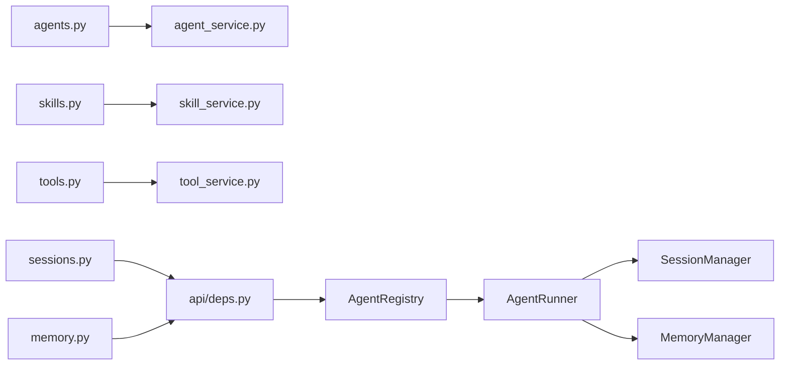

# Studio Management API

<cite>
**Referenced Files in This Document**
- [app.py](file://src/ark_agentic/app.py)
- [deps.py](file://src/ark_agentic/api/deps.py)
- [agents.py](file://src/ark_agentic/studio/api/agents.py)
- [skills.py](file://src/ark_agentic/studio/api/skills.py)
- [tools.py](file://src/ark_agentic/studio/api/tools.py)
- [sessions.py](file://src/ark_agentic/studio/api/sessions.py)
- [memory.py](file://src/ark_agentic/studio/api/memory.py)
- [auth.py](file://src/ark_agentic/studio/api/auth.py)
- [agent_service.py](file://src/ark_agentic/studio/services/agent_service.py)
- [skill_service.py](file://src/ark_agentic/studio/services/skill_service.py)
- [tool_service.py](file://src/ark_agentic/studio/services/tool_service.py)
- [README.md](file://README.md)
- [ark-agentic-api.postman_collection.json](file://postman/ark-agentic-api.postman_collection.json)
</cite>

## Table of Contents
1. [Introduction](#introduction)
2. [Project Structure](#project-structure)
3. [Core Components](#core-components)
4. [Architecture Overview](#architecture-overview)
5. [Detailed Component Analysis](#detailed-component-analysis)
6. [Dependency Analysis](#dependency-analysis)
7. [Performance Considerations](#performance-considerations)
8. [Troubleshooting Guide](#troubleshooting-guide)
9. [Conclusion](#conclusion)
10. [Appendices](#appendices)

## Introduction
This document provides comprehensive API documentation for the Studio management interface of the Ark-Agentic platform. Studio exposes administrative endpoints for managing agents, skills, tools, sessions, and memory. It integrates with the core agent runtime via a shared AgentRegistry, enabling real-time inspection and editing of agent workspaces and runtime state.

Key capabilities:
- Agent lifecycle management (list, create, inspect)
- Skill administration (list, create, update, delete)
- Tool scaffolding and discovery (list, scaffold)
- Session monitoring (list sessions, view details, raw JSONL read/write)
- Memory inspection (list memory files, read/write content)
- Lightweight authentication for internal admin use

Authentication and authorization are minimal for internal admin use; the Studio login returns a user object for client-side storage and role-based UI gating.

## Project Structure
Studio API modules live under src/ark_agentic/studio/api and are mounted into the unified FastAPI application. Business logic is separated into services under src/ark_agentic/studio/services. The core runtime is accessed via a shared AgentRegistry dependency.

**Diagram sources**
- [app.py:46-101](file://src/ark_agentic/app.py#L46-L101)
- [deps.py:19-37](file://src/ark_agentic/api/deps.py#L19-L37)
- [agents.py:15-22](file://src/ark_agentic/studio/api/agents.py#L15-L22)
- [skills.py:11-17](file://src/ark_agentic/studio/api/skills.py#L11-L17)
- [tools.py:12-17](file://src/ark_agentic/studio/api/tools.py#L12-L17)
- [sessions.py:13-18](file://src/ark_agentic/studio/api/sessions.py#L13-L18)
- [memory.py:13-18](file://src/ark_agentic/studio/api/memory.py#L13-L18)

**Section sources**
- [app.py:46-101](file://src/ark_agentic/app.py#L46-L101)
- [deps.py:19-37](file://src/ark_agentic/api/deps.py#L19-L37)

## Core Components
- Authentication API: Lightweight login validating against environment-provided user records with bcrypt password hashing.
- Agent CRUD API: Lists agents from the agents root directory, reads/writes agent.json metadata, and creates new agent scaffolds.
- Skill CRUD API: Lists skills from agent skills directories, parses SKILL.md frontmatter, and supports create/update/delete.
- Tool CRUD API: Discovers tools via AST parsing of Python files and scaffolds new tools from a template.
- Session Monitoring API: Lists sessions from disk, loads session details, and supports raw JSONL read/write with validation.
- Memory Inspection API: Scans memory workspace for MEMORY.md and knowledge files, lists files, and allows read/write content.

**Section sources**
- [auth.py:94-115](file://src/ark_agentic/studio/api/auth.py#L94-L115)
- [agents.py:76-131](file://src/ark_agentic/studio/api/agents.py#L76-L131)
- [skills.py:57-113](file://src/ark_agentic/studio/api/skills.py#L57-L113)
- [tools.py:41-66](file://src/ark_agentic/studio/api/tools.py#L41-L66)
- [sessions.py:84-200](file://src/ark_agentic/studio/api/sessions.py#L84-L200)
- [memory.py:105-160](file://src/ark_agentic/studio/api/memory.py#L105-L160)

## Architecture Overview
Studio endpoints are thin HTTP handlers that delegate to service-layer functions. Services operate on the filesystem and optionally trigger runtime caches to refresh after write operations. The shared AgentRegistry provides access to AgentRunner instances for session and memory operations.

**Diagram sources**
- [agents.py:76-131](file://src/ark_agentic/studio/api/agents.py#L76-L131)
- [skills.py:57-113](file://src/ark_agentic/studio/api/skills.py#L57-L113)
- [tools.py:41-66](file://src/ark_agentic/studio/api/tools.py#L41-L66)
- [sessions.py:84-200](file://src/ark_agentic/studio/api/sessions.py#L84-L200)
- [memory.py:105-160](file://src/ark_agentic/studio/api/memory.py#L105-L160)
- [deps.py:25-37](file://src/ark_agentic/api/deps.py#L25-L37)

## Detailed Component Analysis

### Authentication API
- Purpose: Internal admin login with bcrypt password validation.
- Endpoints:
  - POST /auth/login
    - Request: { username, password }
    - Response: { user_id, role, display_name }
- Behavior:
  - Loads users from STUDIO_USERS environment variable (JSON object) or falls back to defaults.
  - Validates password hash using bcrypt.
  - Returns user identity for client-side role checks.

Practical example:
- Use curl to authenticate and capture the returned user object for subsequent admin requests.

**Section sources**
- [auth.py:94-115](file://src/ark_agentic/studio/api/auth.py#L94-L115)

### Agent Management API
- Purpose: Manage agent scaffolds and metadata stored in agent.json.
- Endpoints:
  - GET /agents
    - Response: { agents: [AgentMeta] }
  - GET /agents/{agent_id}
    - Response: AgentMeta
  - POST /agents
    - Request: { id, name, description }
    - Response: AgentMeta (201)
- Data models:
  - AgentMeta: { id, name, description, status, created_at, updated_at }
  - AgentCreateRequest: { id, name, description }

Notes:
- Listing scans the agents root directory and reads agent.json; missing metadata is auto-generated.
- Creation sets up skills/ tools subdirectories and writes agent.json with timestamps.

**Section sources**
- [agents.py:27-47](file://src/ark_agentic/studio/api/agents.py#L27-L47)
- [agents.py:76-131](file://src/ark_agentic/studio/api/agents.py#L76-L131)

### Skill Administration API
- Purpose: CRUD for skills within an agent’s skills directory.
- Endpoints:
  - GET /agents/{agent_id}/skills
    - Response: { skills: [SkillMeta] }
  - POST /agents/{agent_id}/skills
    - Request: { name, description, content }
    - Response: SkillMeta
  - PUT /agents/{agent_id}/skills/{skill_id}
    - Request: { name?, description?, content? }
    - Response: SkillMeta
  - DELETE /agents/{agent_id}/skills/{skill_id}
    - Response: { status, skill_id }
- Data models:
  - SkillMeta: { id, name, description, file_path, content, version, invocation_policy, group, tags }
- Behavior:
  - Skills are parsed from SKILL.md frontmatter and body.
  - Updates merge frontmatter changes while preserving content when only metadata is changed.
  - After create/update/delete, skill cache is reloaded for the agent.

**Section sources**
- [skills.py:26-40](file://src/ark_agentic/studio/api/skills.py#L26-L40)
- [skills.py:57-113](file://src/ark_agentic/studio/api/skills.py#L57-L113)
- [skill_service.py:25-35](file://src/ark_agentic/studio/services/skill_service.py#L25-L35)
- [skill_service.py:42-183](file://src/ark_agentic/studio/services/skill_service.py#L42-L183)

### Tool Configuration API
- Purpose: Discover and scaffold tools for an agent.
- Endpoints:
  - GET /agents/{agent_id}/tools
    - Response: { tools: [ToolMeta] }
  - POST /agents/{agent_id}/tools
    - Request: { name, description, parameters: [{ name, description, type, required }] }
    - Response: ToolMeta
- Data models:
  - ToolMeta: { name, description, group, file_path, parameters }
  - ToolParameterSpec: { name, description, type, required }
- Behavior:
  - Tools are discovered by recursively scanning agent tools directory for Python files.
  - AST parsing extracts AgentTool subclasses, docstrings, class attributes, and ToolParameter definitions.
  - Scaffold generates a Python file implementing AgentTool with provided parameters.

**Section sources**
- [tools.py:26-37](file://src/ark_agentic/studio/api/tools.py#L26-L37)
- [tools.py:41-66](file://src/ark_agentic/studio/api/tools.py#L41-L66)
- [tool_service.py:23-36](file://src/ark_agentic/studio/services/tool_service.py#L23-L36)
- [tool_service.py:40-99](file://src/ark_agentic/studio/services/tool_service.py#L40-L99)
- [tool_service.py:101-177](file://src/ark_agentic/studio/services/tool_service.py#L101-L177)

### Session Monitoring API
- Purpose: View and edit session state and conversation history.
- Endpoints:
  - GET /agents/{agent_id}/sessions
    - Query: user_id? (optional)
    - Response: { sessions: [SessionItem] }
  - GET /agents/{agent_id}/sessions/{session_id}
    - Query: user_id (required)
    - Response: { session_id, message_count, state, messages: [MessageItem] }
  - GET /agents/{agent_id}/sessions/{session_id}/raw
    - Query: user_id (required)
    - Response: text/plain (NDJSON)
  - PUT /agents/{agent_id}/sessions/{session_id}/raw
    - Query: user_id (required)
    - Body: NDJSON (application/octet-stream)
    - Response: { status, session_id }
- Data models:
  - SessionItem: { session_id, user_id, message_count, state, created_at, updated_at, first_message }
  - MessageItem: { role, content?, tool_calls?, tool_results?, thinking?, metadata? }
- Behavior:
  - Sessions are loaded from disk via AgentRunner.session_manager.
  - Raw JSONL read/write validates content and reloads session into memory after write.

**Section sources**
- [sessions.py:27-55](file://src/ark_agentic/studio/api/sessions.py#L27-L55)
- [sessions.py:84-200](file://src/ark_agentic/studio/api/sessions.py#L84-L200)

### Memory Inspection API
- Purpose: Inspect and edit agent memory workspace files.
- Endpoints:
  - GET /agents/{agent_id}/memory/files
    - Response: { files: [MemoryFileItem] }
  - GET /agents/{agent_id}/memory/content
    - Query: file_path (relative within workspace), user_id (empty for global)
    - Response: text/plain
  - PUT /agents/{agent_id}/memory/content
    - Query: file_path (relative within workspace), user_id (empty for global)
    - Body: text/plain
    - Response: { status: "saved" }
- Data models:
  - MemoryFileItem: { user_id, file_path, file_type, size_bytes, modified_at }
- Behavior:
  - Scans workspace for MEMORY.md and knowledge files (*.md) under memory/.
  - Path traversal protection ensures file_path resolves within the agent’s memory workspace.
  - Memory manager must be enabled for the agent; otherwise returns empty or not found.

**Section sources**
- [memory.py:26-36](file://src/ark_agentic/studio/api/memory.py#L26-L36)
- [memory.py:105-160](file://src/ark_agentic/studio/api/memory.py#L105-L160)

## Dependency Analysis
Studio API relies on:
- Shared AgentRegistry via api/deps to access AgentRunner instances for session and memory operations.
- Service layers for filesystem operations and parsing.
- Core runtime components for session persistence and memory management.

**Diagram sources**
- [agents.py:15-22](file://src/ark_agentic/studio/api/agents.py#L15-L22)
- [skills.py:14-17](file://src/ark_agentic/studio/api/skills.py#L14-L17)
- [tools.py:15-17](file://src/ark_agentic/studio/api/tools.py#L15-L17)
- [sessions.py:17-18](file://src/ark_agentic/studio/api/sessions.py#L17-L18)
- [memory.py:17-18](file://src/ark_agentic/studio/api/memory.py#L17-L18)
- [deps.py:19-37](file://src/ark_agentic/api/deps.py#L19-L37)

**Section sources**
- [deps.py:19-37](file://src/ark_agentic/api/deps.py#L19-L37)

## Performance Considerations
- Filesystem operations: Agents, skills, and tools endpoints scan directories; avoid excessive polling by clients.
- Session raw JSONL write: Validation occurs per request; batch edits externally when possible.
- Memory workspace scanning: Large workspaces may incur I/O overhead; cache results at the client when listing files frequently.
- Registry access: get_registry() is a single global dependency; ensure it is initialized once during app startup.

## Troubleshooting Guide
Common issues and resolutions:
- Agent not found
  - Symptom: 404 when accessing /agents/{agent_id} or /agents/{agent_id}/...
  - Cause: agent_id does not exist or agents root misconfigured.
  - Resolution: Verify agent directory and agent.json presence.
- Skill not found
  - Symptom: 404 on skill update/delete.
  - Cause: skill_id incorrect or directory moved.
  - Resolution: List skills to confirm ID, ensure directory exists under skills/.
- Tool scaffold conflicts
  - Symptom: 409 when creating tool with existing name.
  - Cause: Python file already exists.
  - Resolution: Choose a unique tool name or delete the conflicting file.
- Session persistence disabled
  - Symptom: 404 on /raw endpoints.
  - Cause: Transcript manager not configured.
  - Resolution: Enable persistence configuration for the agent.
- Memory not enabled
  - Symptom: Empty files list or 404 for memory endpoints.
  - Cause: Memory manager not registered for the agent.
  - Resolution: Initialize memory manager when creating the agent runner.
- Path traversal denied
  - Symptom: 403 on memory content write/read.
  - Cause: file_path attempts to escape workspace.
  - Resolution: Use relative paths within the workspace.

**Section sources**
- [sessions.py:160-166](file://src/ark_agentic/studio/api/sessions.py#L160-L166)
- [memory.py:83-88](file://src/ark_agentic/studio/api/memory.py#L83-L88)
- [memory.py:91-100](file://src/ark_agentic/studio/api/memory.py#L91-L100)

## Conclusion
Studio Management API provides a cohesive administrative surface over the Ark-Agentic runtime. By separating HTTP handlers from services and leveraging the shared AgentRegistry, it enables safe and efficient inspection and modification of agents, skills, tools, sessions, and memory. Authentication is intentionally lightweight for internal admin use, while robust filesystem and runtime integrations ensure reliable operations.

## Appendices

### Relationship Between Studio API and Core Agent Runtime
- Studio API routes depend on AgentRegistry to access AgentRunner instances for session and memory operations.
- After write operations (skills/tools), caches are reloaded to reflect changes immediately.
- Memory endpoints require a configured MemoryManager; otherwise, operations return empty or not found.

**Section sources**
- [deps.py:25-37](file://src/ark_agentic/api/deps.py#L25-L37)
- [skills.py:44-53](file://src/ark_agentic/studio/api/skills.py#L44-L53)
- [tools.py:52-66](file://src/ark_agentic/studio/api/tools.py#L52-L66)
- [sessions.py:84-200](file://src/ark_agentic/studio/api/sessions.py#L84-L200)
- [memory.py:105-160](file://src/ark_agentic/studio/api/memory.py#L105-L160)

### Practical Examples (Postman)
- Health check and basic chat endpoints are available in the Postman collection for reference.
- Studio endpoints can be tested similarly by setting baseUrl to the running server and using the documented paths.

**Section sources**
- [ark-agentic-api.postman_collection.json:21-361](file://postman/ark-agentic-api.postman_collection.json#L21-L361)