# Agent Protocol

<cite>
**Referenced Files in This Document**
- [README.md](file://README.md)
- [src/ark_agentic/__init__.py](file://src/ark_agentic/__init__.py)
- [src/ark_agentic/app.py](file://src/ark_agentic/app.py)
- [src/ark_agentic/api/models.py](file://src/ark_agentic/api/models.py)
- [src/ark_agentic/api/chat.py](file://src/ark_agentic/api/chat.py)
- [src/ark_agentic/core/types.py](file://src/ark_agentic/core/types.py)
- [src/ark_agentic/core/runner.py](file://src/ark_agentic/core/runner.py)
- [src/ark_agentic/core/session.py](file://src/ark_agentic/core/session.py)
- [src/ark_agentic/core/tools/base.py](file://src/ark_agentic/core/tools/base.py)
- [src/ark_agentic/core/stream/events.py](file://src/ark_agentic/core/stream/events.py)
- [src/ark_agentic/core/memory/manager.py](file://src/ark_agentic/core/memory/manager.py)
- [src/ark_agentic/core/skills/base.py](file://src/ark_agentic/core/skills/base.py)
- [src/ark_agentic/agents/insurance/agent.py](file://src/ark_agentic/agents/insurance/agent.py)
- [src/ark_agentic/studio/api/agents.py](file://src/ark_agentic/studio/api/agents.py)
- [src/ark_agentic/cli/main.py](file://src/ark_agentic/cli/main.py)
</cite>

## Table of Contents
1. [Introduction](#introduction)
2. [Project Structure](#project-structure)
3. [Core Components](#core-components)
4. [Architecture Overview](#architecture-overview)
5. [Detailed Component Analysis](#detailed-component-analysis)
6. [Dependency Analysis](#dependency-analysis)
7. [Performance Considerations](#performance-considerations)
8. [Troubleshooting Guide](#troubleshooting-guide)
9. [Conclusion](#conclusion)

## Introduction
This document describes the Agent Protocol implemented by the ark-agentic framework. It provides a production-ready ReAct agent runtime supporting tool invocation, skill systems, session management, streaming output, and user memory. The system exposes a FastAPI service with SSE streaming and supports multiple LLM providers, including PA internal models and OpenAI-compatible endpoints. It also includes a management console (Studio) and a CLI for scaffolding projects and agents.

## Project Structure
The repository is organized around a modular core with domain-specific agents, streaming protocols, and utilities:
- Core runtime: AgentRunner, SessionManager, Tool system, Skill system, Memory, Streaming, LLM integration
- Domain agents: Insurance and Securities agents with tools and skills
- API service: FastAPI routes for chat and optional Studio admin APIs
- CLI: Project scaffolding and agent management
- Static UI: Example web pages for agents

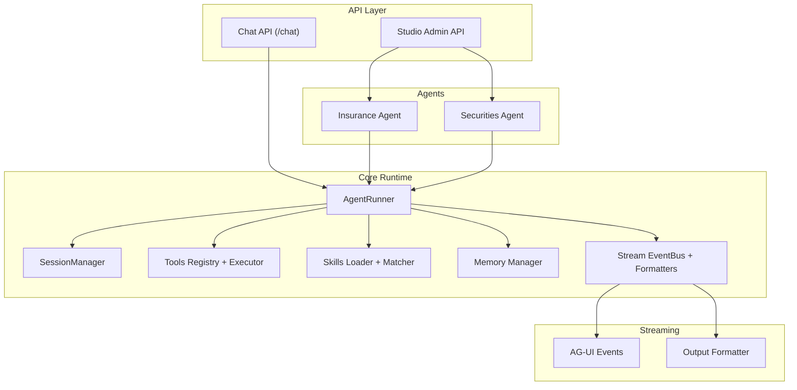

**Diagram sources**
- [src/ark_agentic/app.py:101-118](file://src/ark_agentic/app.py#L101-L118)
- [src/ark_agentic/api/chat.py:27-176](file://src/ark_agentic/api/chat.py#L27-L176)
- [src/ark_agentic/core/runner.py:193-200](file://src/ark_agentic/core/runner.py#L193-L200)
- [src/ark_agentic/core/session.py:24-36](file://src/ark_agentic/core/session.py#L24-L36)
- [src/ark_agentic/core/tools/base.py:46-113](file://src/ark_agentic/core/tools/base.py#L46-L113)
- [src/ark_agentic/core/skills/base.py:19-50](file://src/ark_agentic/core/skills/base.py#L19-L50)
- [src/ark_agentic/core/memory/manager.py:24-40](file://src/ark_agentic/core/memory/manager.py#L24-L40)
- [src/ark_agentic/core/stream/events.py:30-61](file://src/ark_agentic/core/stream/events.py#L30-L61)
- [src/ark_agentic/agents/insurance/agent.py:46-141](file://src/ark_agentic/agents/insurance/agent.py#L46-L141)

**Section sources**
- [README.md:584-689](file://README.md#L584-L689)
- [src/ark_agentic/app.py:101-118](file://src/ark_agentic/app.py#L101-L118)

## Core Components
- AgentRunner: Implements the ReAct loop, orchestrating LLM calls, tool execution, streaming events, and lifecycle hooks.
- SessionManager: Manages session creation, persistence, compression, and loading.
- Tool System: Defines AgentTool base class, parameter schemas, and execution semantics.
- Skill System: Loads and renders skills, with eligibility checks and invocation policies.
- Memory Manager: Provides lightweight file-based memory storage with heading-based upsert.
- Streaming: AG-UI event model and output formatters for multiple transport protocols.
- API: FastAPI chat endpoint with SSE streaming support and optional Studio admin endpoints.

**Section sources**
- [src/ark_agentic/core/runner.py:193-200](file://src/ark_agentic/core/runner.py#L193-L200)
- [src/ark_agentic/core/session.py:24-36](file://src/ark_agentic/core/session.py#L24-L36)
- [src/ark_agentic/core/tools/base.py:46-113](file://src/ark_agentic/core/tools/base.py#L46-L113)
- [src/ark_agentic/core/skills/base.py:19-50](file://src/ark_agentic/core/skills/base.py#L19-L50)
- [src/ark_agentic/core/memory/manager.py:24-40](file://src/ark_agentic/core/memory/manager.py#L24-L40)
- [src/ark_agentic/core/stream/events.py:30-61](file://src/ark_agentic/core/stream/events.py#L30-L61)
- [src/ark_agentic/api/chat.py:27-176](file://src/ark_agentic/api/chat.py#L27-L176)

## Architecture Overview
The Agent Protocol follows a layered architecture:
- API Layer: FastAPI routes handle requests, resolve contexts, and delegate to AgentRunner.
- Core Runtime: AgentRunner coordinates LLM inference, tool execution, and streaming.
- Domain Agents: Specialized agents configure tools, skills, memory, and prompts.
- Streaming: StreamEventBus emits AG-UI events; OutputFormatter adapts to protocols (agui/internal/enterprise/alone).
- Persistence: SessionManager persists transcripts and session metadata; MemoryManager writes MEMORY.md.

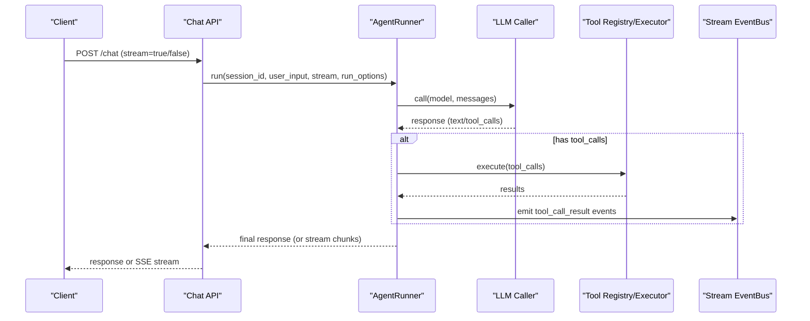

**Diagram sources**
- [src/ark_agentic/api/chat.py:87-157](file://src/ark_agentic/api/chat.py#L87-L157)
- [src/ark_agentic/core/runner.py:193-200](file://src/ark_agentic/core/runner.py#L193-L200)
- [src/ark_agentic/core/stream/events.py:67-115](file://src/ark_agentic/core/stream/events.py#L67-L115)

## Detailed Component Analysis

### AgentRunner
AgentRunner implements the ReAct loop with:
- Lifecycle hooks: before_agent, before_model, after_model, before_tool, after_tool, before_loop_end, after_agent
- Concurrency: parallel tool execution for multiple tool calls
- Streaming: emits AG-UI events via StreamEventBus
- Memory integration: optional memory writes and reads
- Subtasks: optional SpawnSubtasksTool for parallel subtasks

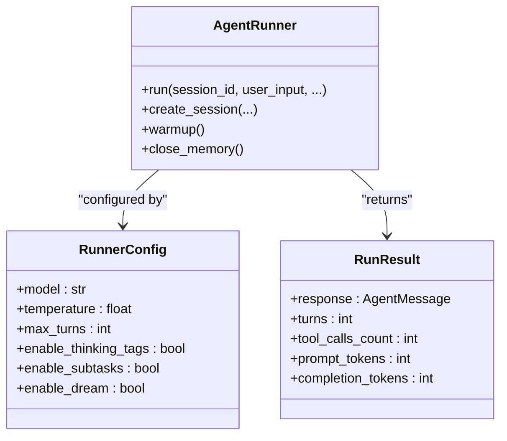

**Diagram sources**
- [src/ark_agentic/core/runner.py:91-129](file://src/ark_agentic/core/runner.py#L91-L129)
- [src/ark_agentic/core/runner.py:130-153](file://src/ark_agentic/core/runner.py#L130-L153)

**Section sources**
- [src/ark_agentic/core/runner.py:91-129](file://src/ark_agentic/core/runner.py#L91-L129)
- [src/ark_agentic/core/runner.py:130-153](file://src/ark_agentic/core/runner.py#L130-L153)

### Session Management
SessionManager handles:
- Creation and retrieval of sessions
- JSONL transcript persistence and session store
- Context compaction with LLM summarization
- Listing sessions and reloading from disk

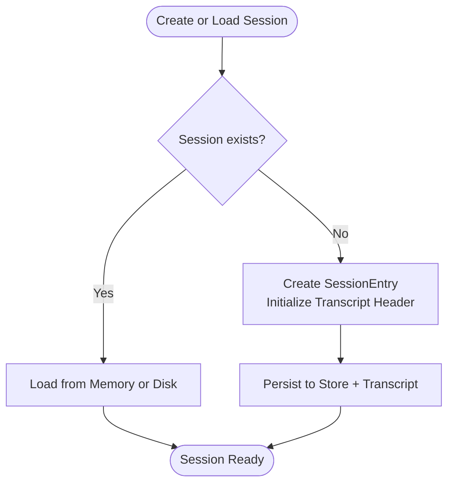

**Diagram sources**
- [src/ark_agentic/core/session.py:40-67](file://src/ark_agentic/core/session.py#L40-L67)
- [src/ark_agentic/core/session.py:184-203](file://src/ark_agentic/core/session.py#L184-L203)

**Section sources**
- [src/ark_agentic/core/session.py:24-36](file://src/ark_agentic/core/session.py#L24-L36)
- [src/ark_agentic/core/session.py:40-67](file://src/ark_agentic/core/session.py#L40-L67)
- [src/ark_agentic/core/session.py:184-203](file://src/ark_agentic/core/session.py#L184-L203)

### Tool System
AgentTool defines:
- JSON schema generation for function calling
- Parameter helpers for robust argument parsing
- Execution contract returning AgentToolResult with multiple result types (JSON, TEXT, IMAGE, A2UI, ERROR)

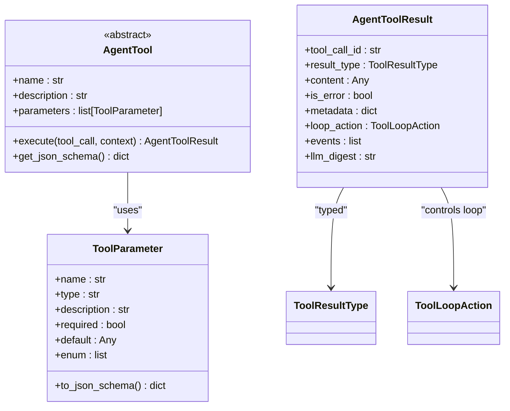

**Diagram sources**
- [src/ark_agentic/core/tools/base.py:46-113](file://src/ark_agentic/core/tools/base.py#L46-L113)
- [src/ark_agentic/core/tools/base.py:16-44](file://src/ark_agentic/core/tools/base.py#L16-L44)
- [src/ark_agentic/core/types.py:86-100](file://src/ark_agentic/core/types.py#L86-L100)

**Section sources**
- [src/ark_agentic/core/tools/base.py:46-113](file://src/ark_agentic/core/tools/base.py#L46-L113)
- [src/ark_agentic/core/types.py:27-42](file://src/ark_agentic/core/types.py#L27-L42)

### Skill System
SkillConfig governs:
- Skill directories and agent-scoped IDs
- Eligibility checks (OS, binaries, env vars, tools)
- Invocation policies (auto/manual/always)
- Rendering modes (flat vs grouped) with budget controls

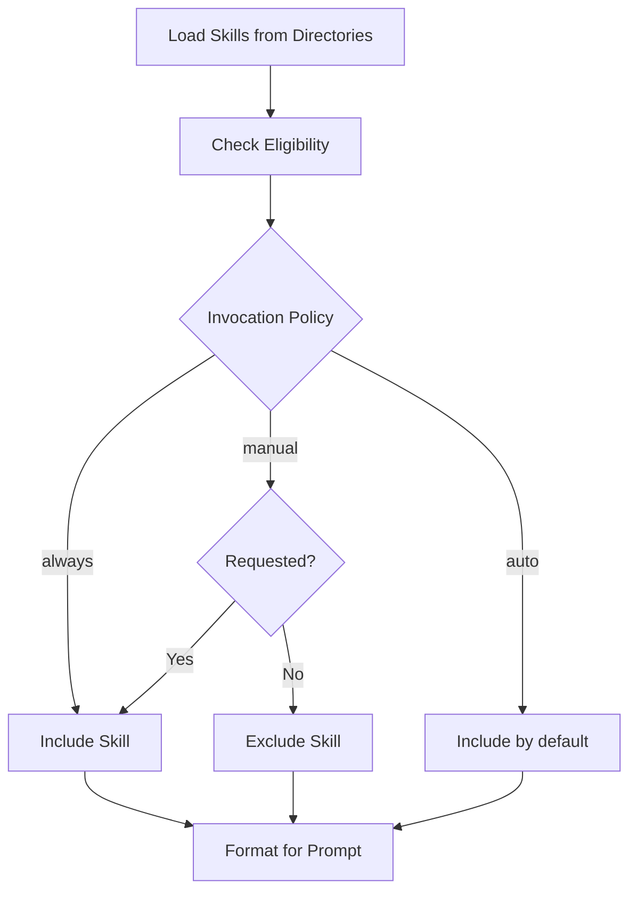

**Diagram sources**
- [src/ark_agentic/core/skills/base.py:51-101](file://src/ark_agentic/core/skills/base.py#L51-L101)
- [src/ark_agentic/core/skills/base.py:104-137](file://src/ark_agentic/core/skills/base.py#L104-L137)
- [src/ark_agentic/core/skills/base.py:242-262](file://src/ark_agentic/core/skills/base.py#L242-L262)

**Section sources**
- [src/ark_agentic/core/skills/base.py:19-50](file://src/ark_agentic/core/skills/base.py#L19-L50)
- [src/ark_agentic/core/skills/base.py:51-101](file://src/ark_agentic/core/skills/base.py#L51-L101)
- [src/ark_agentic/core/skills/base.py:104-137](file://src/ark_agentic/core/skills/base.py#L104-L137)
- [src/ark_agentic/core/skills/base.py:242-262](file://src/ark_agentic/core/skills/base.py#L242-L262)

### Memory System
MemoryManager provides:
- Workspace-aware file paths per user
- Heading-based upsert for MEMORY.md
- Read/write convenience methods

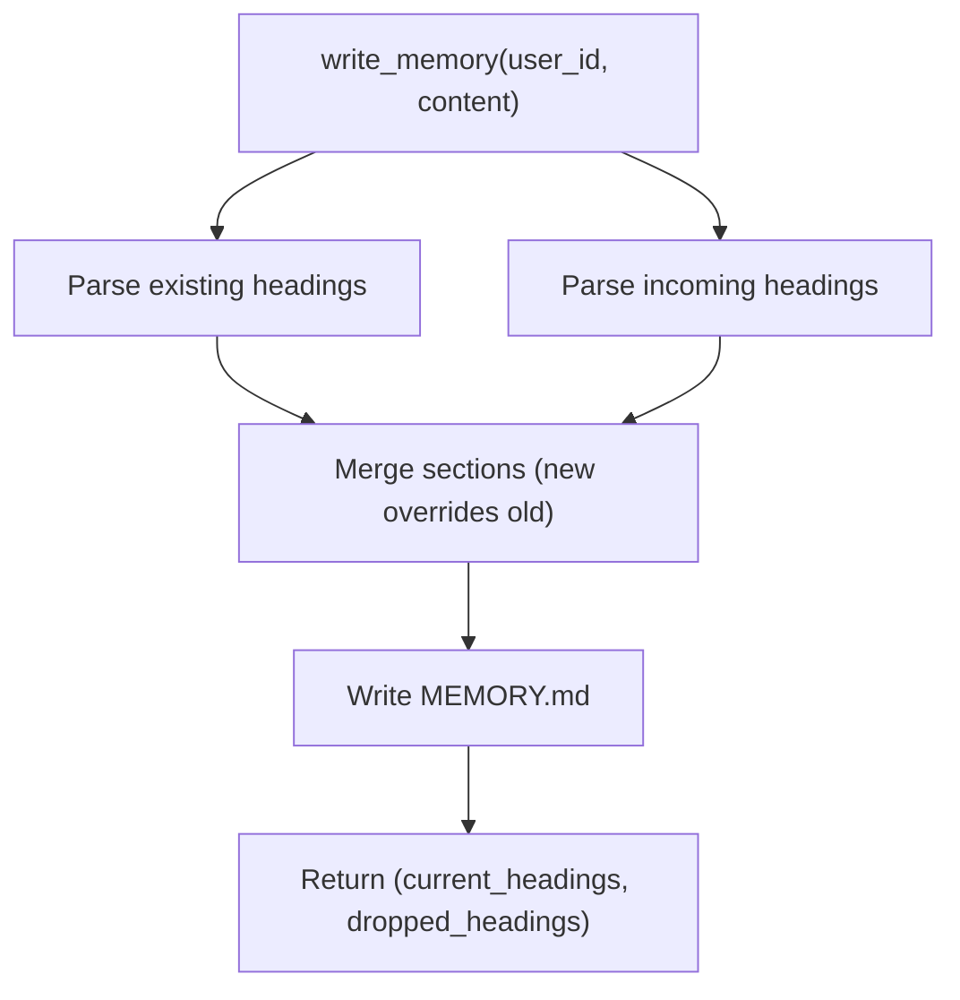

**Diagram sources**
- [src/ark_agentic/core/memory/manager.py:45-69](file://src/ark_agentic/core/memory/manager.py#L45-L69)

**Section sources**
- [src/ark_agentic/core/memory/manager.py:24-40](file://src/ark_agentic/core/memory/manager.py#L24-L40)
- [src/ark_agentic/core/memory/manager.py:45-69](file://src/ark_agentic/core/memory/manager.py#L45-L69)

### Streaming Protocol (AG-UI)
The streaming subsystem emits standardized AG-UI events covering lifecycle, steps, text, thinking, tool calls, state, and custom/raw payloads. OutputFormatters adapt these events to multiple transport protocols.

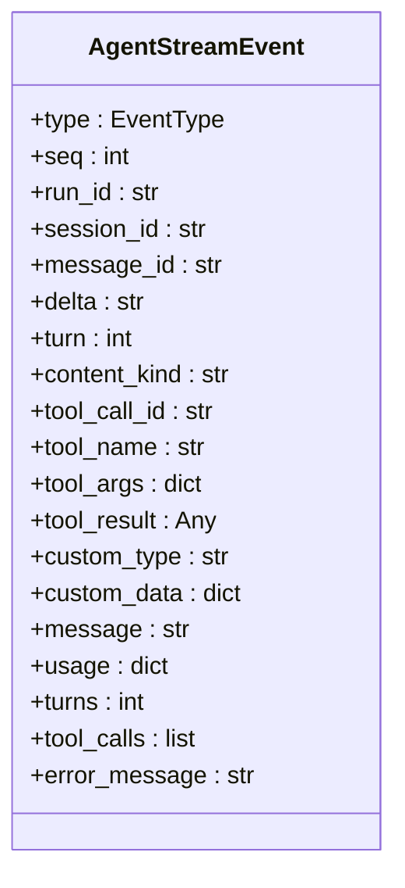

**Diagram sources**
- [src/ark_agentic/core/stream/events.py:67-115](file://src/ark_agentic/core/stream/events.py#L67-L115)

**Section sources**
- [src/ark_agentic/core/stream/events.py:30-61](file://src/ark_agentic/core/stream/events.py#L30-L61)
- [src/ark_agentic/core/stream/events.py:67-115](file://src/ark_agentic/core/stream/events.py#L67-L115)

### API and Protocol
The FastAPI chat endpoint supports:
- Non-stream and SSE streaming responses
- Multiple output protocols (agui/internal/enterprise/alone)
- Idempotency keys, external history, and user/message/session context headers

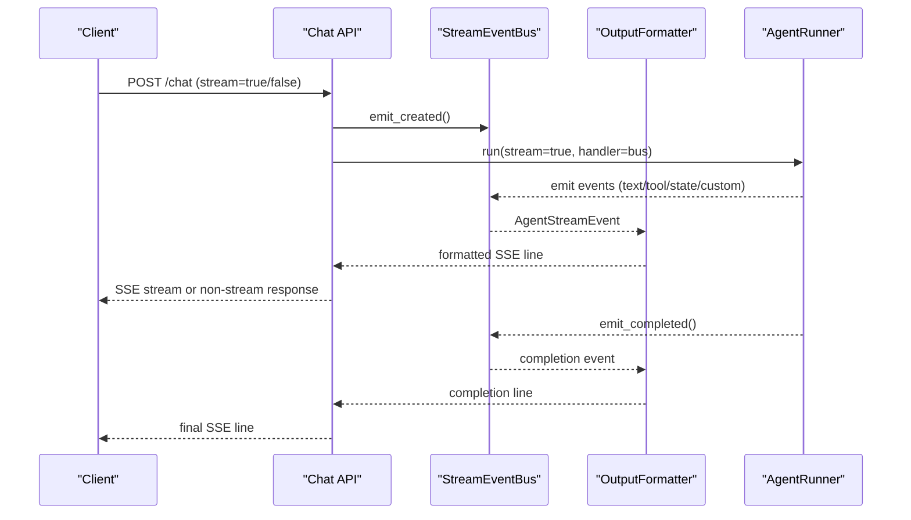

**Diagram sources**
- [src/ark_agentic/api/chat.py:115-176](file://src/ark_agentic/api/chat.py#L115-L176)
- [src/ark_agentic/core/stream/events.py:67-115](file://src/ark_agentic/core/stream/events.py#L67-L115)

**Section sources**
- [src/ark_agentic/api/chat.py:27-176](file://src/ark_agentic/api/chat.py#L27-L176)
- [src/ark_agentic/api/models.py:27-102](file://src/ark_agentic/api/models.py#L27-L102)

### Insurance Agent
The insurance agent demonstrates:
- Tool registration and skill loading
- Memory integration and Dream job scheduling
- Prompt configuration and thinking tag enabling

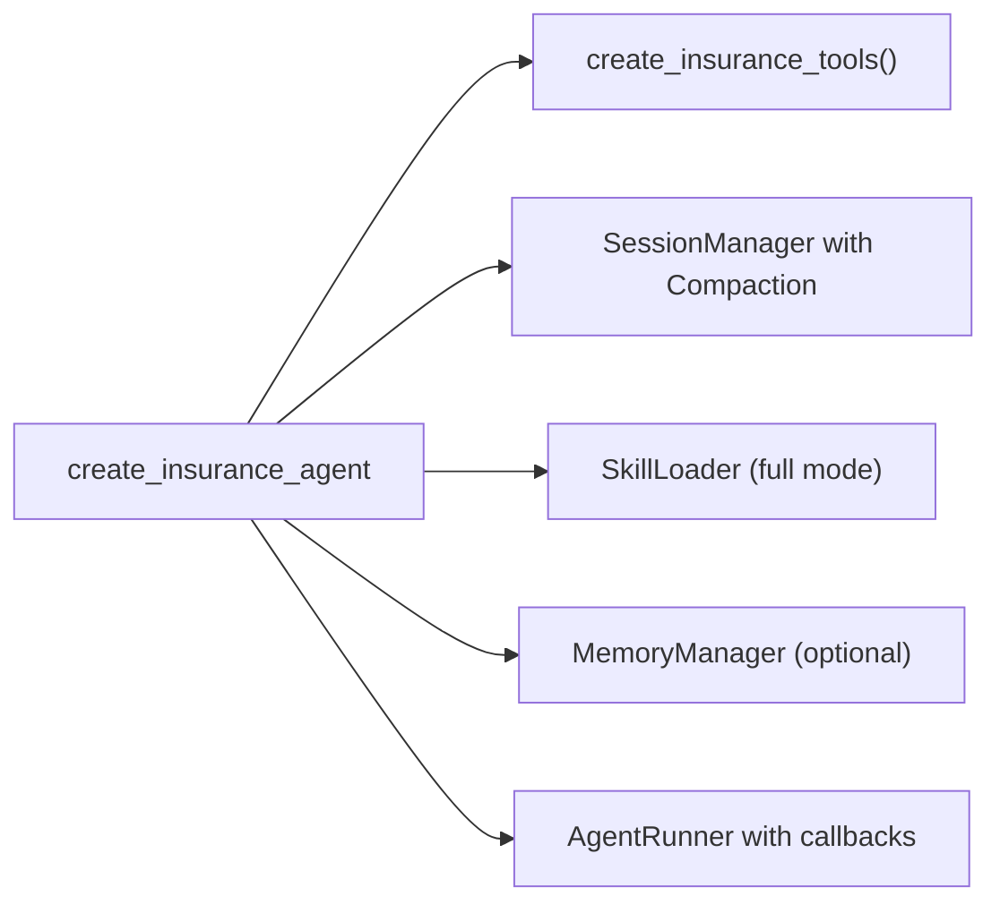

**Diagram sources**
- [src/ark_agentic/agents/insurance/agent.py:46-141](file://src/ark_agentic/agents/insurance/agent.py#L46-L141)

**Section sources**
- [src/ark_agentic/agents/insurance/agent.py:46-141](file://src/ark_agentic/agents/insurance/agent.py#L46-L141)

### Studio Admin API
Studio provides CRUD for agents via file system scanning of agents/ directory and agent.json metadata.

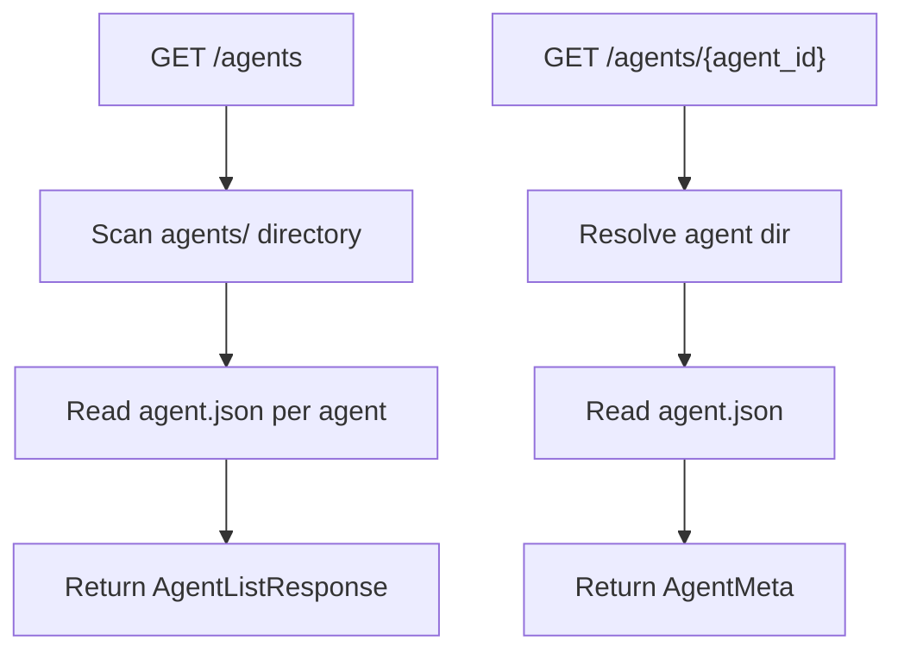

**Diagram sources**
- [src/ark_agentic/studio/api/agents.py:76-103](file://src/ark_agentic/studio/api/agents.py#L76-L103)

**Section sources**
- [src/ark_agentic/studio/api/agents.py:25-103](file://src/ark_agentic/studio/api/agents.py#L25-L103)

### CLI
The CLI scaffolds projects and adds agents with templates, including FastAPI app and memory configurations.

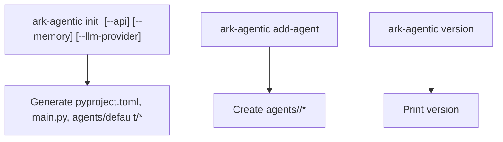

**Diagram sources**
- [src/ark_agentic/cli/main.py:84-154](file://src/ark_agentic/cli/main.py#L84-L154)
- [src/ark_agentic/cli/main.py:158-201](file://src/ark_agentic/cli/main.py#L158-L201)
- [src/ark_agentic/cli/main.py:206-207](file://src/ark_agentic/cli/main.py#L206-L207)

**Section sources**
- [src/ark_agentic/cli/main.py:84-154](file://src/ark_agentic/cli/main.py#L84-L154)
- [src/ark_agentic/cli/main.py:158-201](file://src/ark_agentic/cli/main.py#L158-L201)
- [src/ark_agentic/cli/main.py:206-207](file://src/ark_agentic/cli/main.py#L206-L207)

## Dependency Analysis
Key dependencies and relationships:
- API depends on AgentRunner and StreamEventBus
- AgentRunner depends on SessionManager, ToolRegistry, SkillLoader, MemoryManager, and LLMCaller
- Insurance agent composes tools, skills, memory, and prompts
- Studio admin API depends on file system scanning and agent.json metadata

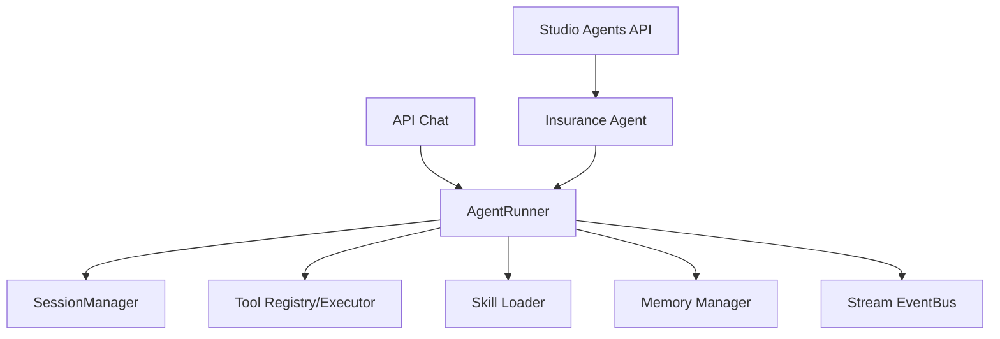

**Diagram sources**
- [src/ark_agentic/app.py:101-118](file://src/ark_agentic/app.py#L101-L118)
- [src/ark_agentic/api/chat.py:38-80](file://src/ark_agentic/api/chat.py#L38-L80)
- [src/ark_agentic/core/runner.py:193-200](file://src/ark_agentic/core/runner.py#L193-L200)

**Section sources**
- [src/ark_agentic/app.py:101-118](file://src/ark_agentic/app.py#L101-L118)
- [src/ark_agentic/api/chat.py:38-80](file://src/ark_agentic/api/chat.py#L38-L80)
- [src/ark_agentic/core/runner.py:193-200](file://src/ark_agentic/core/runner.py#L193-L200)

## Performance Considerations
- Parallel tool execution reduces latency when multiple tools are invoked
- Context compaction with LLM summarization keeps token budgets stable
- Streaming output minimizes client wait times
- Zero-dependency memory (file-based) avoids database overhead
- Optional Phoenix observability for tracing (disabled by default)

## Troubleshooting Guide
Common issues and resolutions:
- Missing user_id: The chat endpoint requires user_id either in the request body or x-ark-user-id header.
- Session not found: The system creates a new session if the provided session_id does not exist for the agent.
- SSE streaming stalls: Ensure the client maintains the connection and the formatter is configured for the chosen protocol.
- Memory writes: Verify MEMORY.md path resolution and heading-based upsert behavior.

**Section sources**
- [src/ark_agentic/api/chat.py:40-43](file://src/ark_agentic/api/chat.py#L40-L43)
- [src/ark_agentic/api/chat.py:61-79](file://src/ark_agentic/api/chat.py#L61-L79)
- [src/ark_agentic/core/memory/manager.py:37-39](file://src/ark_agentic/core/memory/manager.py#L37-L39)

## Conclusion
The Agent Protocol provides a robust, extensible framework for building intelligent agents with ReAct reasoning, structured tool invocation, skill orchestration, persistent sessions, and rich streaming outputs. The modular design enables domain-specific agents (e.g., insurance, securities) while maintaining a unified runtime and API surface. Optional Studio and CLI tooling streamline development and administration.