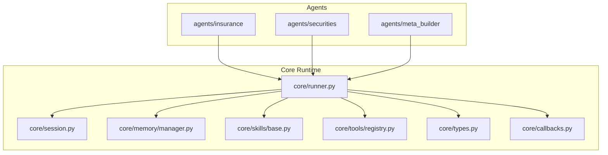
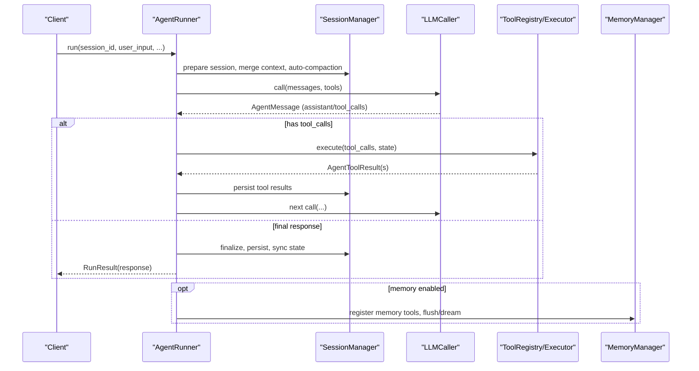
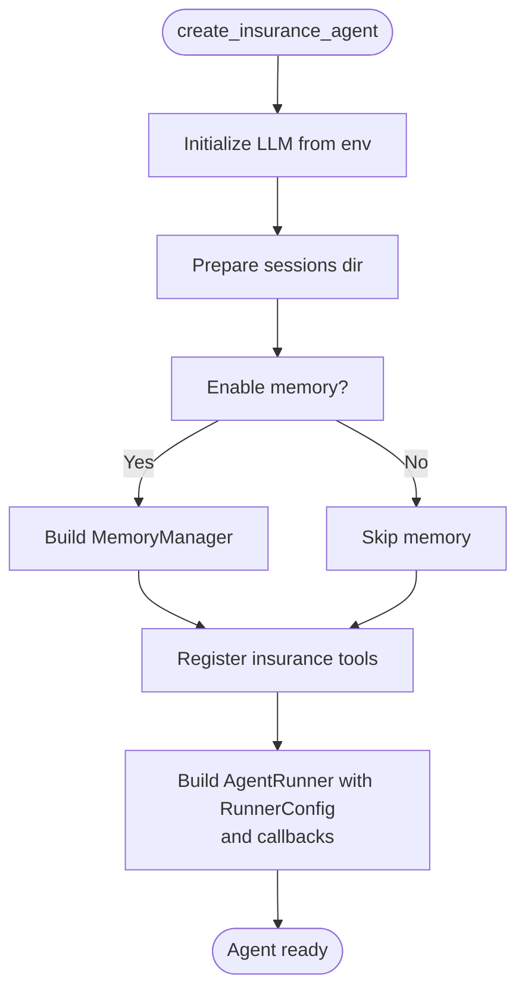
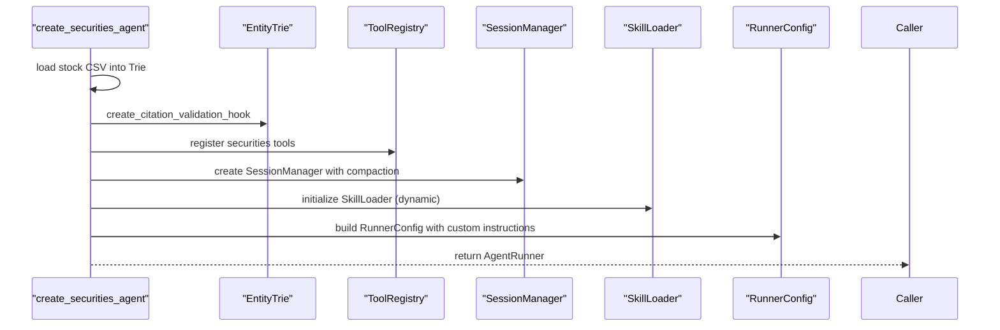
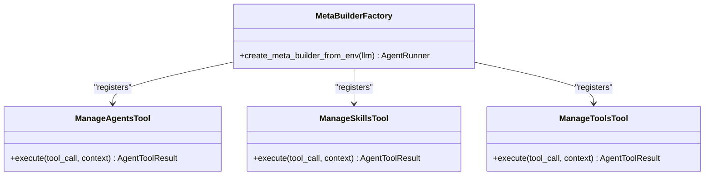
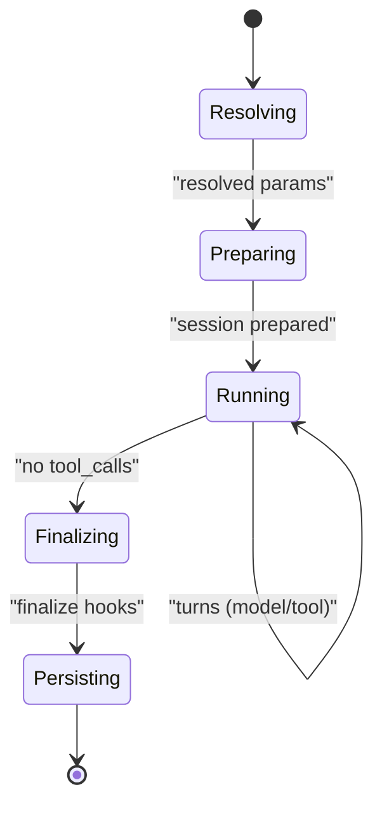
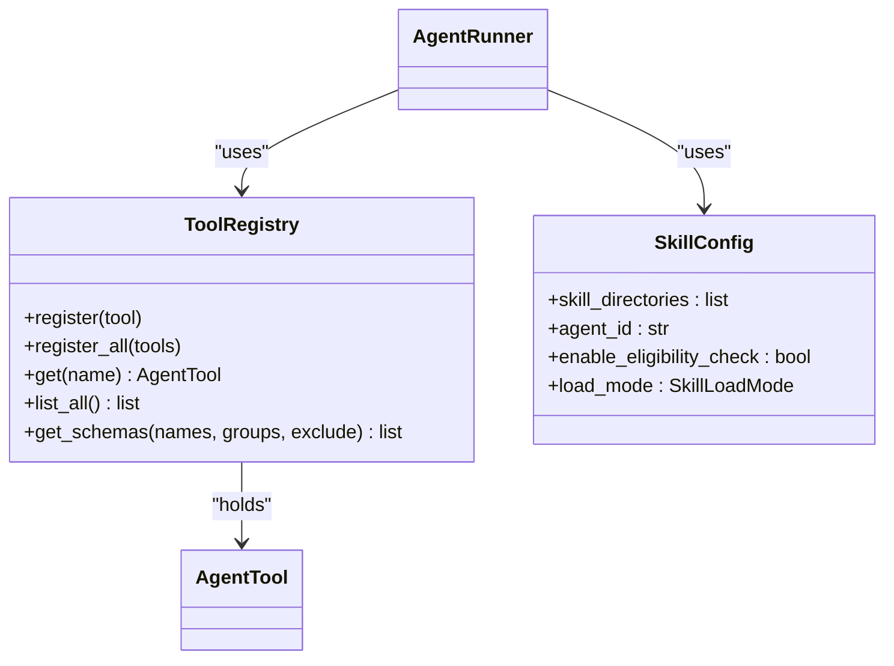
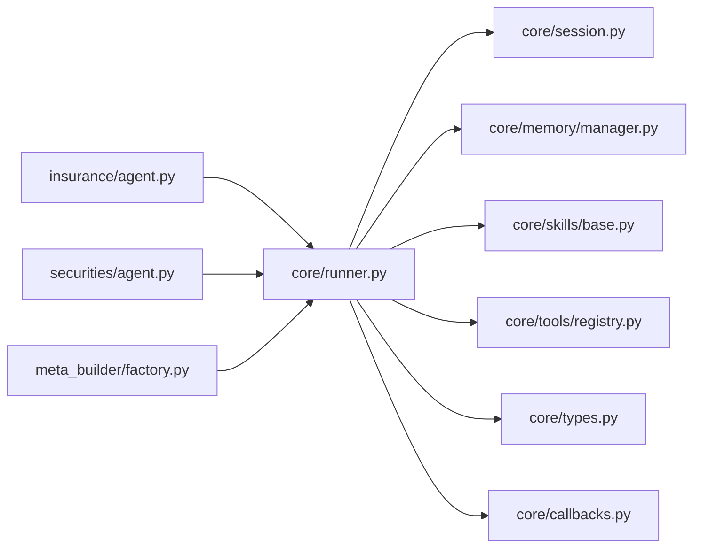

# Agents

<cite>
**Referenced Files in This Document**
- [insurance/agent.py](file://src/ark_agentic/agents/insurance/agent.py)
- [insurance/agent.json](file://src/ark_agentic/agents/insurance/agent.json)
- [insurance/tools/__init__.py](file://src/ark_agentic/agents/insurance/tools/__init__.py)
- [securities/agent.py](file://src/ark_agentic/agents/securities/agent.py)
- [securities/agent.json](file://src/ark_agentic/agents/securities/agent.json)
- [securities/tools/__init__.py](file://src/ark_agentic/agents/securities/tools/__init__.py)
- [meta_builder/factory.py](file://src/ark_agentic/agents/meta_builder/factory.py)
- [meta_builder/agent.json](file://src/ark_agentic/agents/meta_builder/agent.json)
- [meta_builder/tools/manage_agents.py](file://src/ark_agentic/agents/meta_builder/tools/manage_agents.py)
- [core/runner.py](file://src/ark_agentic/core/runner.py)
- [core/session.py](file://src/ark_agentic/core/session.py)
- [core/memory/manager.py](file://src/ark_agentic/core/memory/manager.py)
- [core/skills/base.py](file://src/ark_agentic/core/skills/base.py)
- [core/tools/registry.py](file://src/ark_agentic/core/tools/registry.py)
- [core/types.py](file://src/ark_agentic/core/types.py)
- [core/callbacks.py](file://src/ark_agentic/core/callbacks.py)
</cite>

## Table of Contents
1. [Introduction](#introduction)
2. [Project Structure](#project-structure)
3. [Core Components](#core-components)
4. [Architecture Overview](#architecture-overview)
5. [Detailed Component Analysis](#detailed-component-analysis)
6. [Dependency Analysis](#dependency-analysis)
7. [Performance Considerations](#performance-considerations)
8. [Troubleshooting Guide](#troubleshooting-guide)
9. [Conclusion](#conclusion)
10. [Appendices](#appendices)

## Introduction
This document explains the agent system architecture and implementation in the ark-agentic project. It covers three built-in agent types: insurance, securities, and meta-builder. It documents agent configuration, initialization patterns, integration with tools and skills, the agent lifecycle and state/session handling, and provides practical examples for creating custom agents and extending existing ones. It also describes the agent.json configuration format and how to customize agent behavior via configuration files.

## Project Structure
The agent system is organized by domain under src/ark_agentic/agents/, with shared runtime infrastructure under src/ark_agentic/core/. Each agent module provides:
- An agent factory function that constructs an AgentRunner with domain-specific tools, skills, prompts, and session/memory configuration.
- Optional domain-specific tools and skills.
- A small agent.json manifest describing identity and status.

**Diagram sources**
- [insurance/agent.py:45-123](file://src/ark_agentic/agents/insurance/agent.py#L45-L123)
- [securities/agent.py:38-128](file://src/ark_agentic/agents/securities/agent.py#L38-L128)
- [meta_builder/factory.py:35-101](file://src/ark_agentic/agents/meta_builder/factory.py#L35-L101)
- [core/runner.py:153-287](file://src/ark_agentic/core/runner.py#L153-L287)
- [core/session.py:24-92](file://src/ark_agentic/core/session.py#L24-L92)
- [core/memory/manager.py:24-82](file://src/ark_agentic/core/memory/manager.py#L24-L82)
- [core/skills/base.py:19-50](file://src/ark_agentic/core/skills/base.py#L19-L50)
- [core/tools/registry.py:14-93](file://src/ark_agentic/core/tools/registry.py#L14-L93)
- [core/types.py:341-413](file://src/ark_agentic/core/types.py#L341-L413)
- [core/callbacks.py:147-157](file://src/ark_agentic/core/callbacks.py#L147-L157)

**Section sources**
- [insurance/agent.py:1-123](file://src/ark_agentic/agents/insurance/agent.py#L1-L123)
- [securities/agent.py:1-128](file://src/ark_agentic/agents/securities/agent.py#L1-L128)
- [meta_builder/factory.py:1-101](file://src/ark_agentic/agents/meta_builder/factory.py#L1-L101)
- [core/runner.py:1-120](file://src/ark_agentic/core/runner.py#L1-L120)
- [core/session.py:1-60](file://src/ark_agentic/core/session.py#L1-L60)
- [core/memory/manager.py:1-40](file://src/ark_agentic/core/memory/manager.py#L1-L40)
- [core/skills/base.py:1-60](file://src/ark_agentic/core/skills/base.py#L1-L60)
- [core/tools/registry.py:1-60](file://src/ark_agentic/core/tools/registry.py#L1-L60)
- [core/types.py:1-60](file://src/ark_agentic/core/types.py#L1-L60)
- [core/callbacks.py:1-40](file://src/ark_agentic/core/callbacks.py#L1-L40)

## Core Components
- AgentRunner: The central executor implementing the ReAct loop, orchestrating LLM calls, tool execution, session persistence, memory integration, and lifecycle hooks.
- SessionManager: Manages session creation, message history, token usage, compaction, and persistence to disk.
- MemoryManager: Lightweight memory workspace for user profiles and MEMORY.md operations.
- ToolRegistry: Centralized tool registration and schema generation for function calling.
- SkillConfig and Skill rendering: Controls skill discovery, eligibility checks, and injection into prompts (full vs dynamic modes).
- Callbacks: Extensible hook system around agent lifecycle and loop phases.

Key responsibilities:
- Build and configure domain agents via factory functions.
- Compose tools and skills into the agent’s capability surface.
- Manage session state and history, including automatic compaction and persistence.
- Provide memory tools and optional memory integration.
- Enforce safety and validation via callbacks and domain-specific hooks.

**Section sources**
- [core/runner.py:153-287](file://src/ark_agentic/core/runner.py#L153-L287)
- [core/session.py:24-120](file://src/ark_agentic/core/session.py#L24-L120)
- [core/memory/manager.py:24-82](file://src/ark_agentic/core/memory/manager.py#L24-L82)
- [core/tools/registry.py:14-93](file://src/ark_agentic/core/tools/registry.py#L14-L93)
- [core/skills/base.py:19-50](file://src/ark_agentic/core/skills/base.py#L19-L50)
- [core/callbacks.py:147-157](file://src/ark_agentic/core/callbacks.py#L147-L157)

## Architecture Overview
The agent architecture follows a layered pattern:
- Domain agents define capabilities and configuration.
- Core runtime composes tools, skills, prompts, and session/memory.
- Lifecycle hooks allow cross-cutting concerns (validation, enrichment, error handling).
- Tools and skills are dynamically rendered into the system prompt and executed during ReAct turns.

**Diagram sources**
- [core/runner.py:240-287](file://src/ark_agentic/core/runner.py#L240-L287)
- [core/runner.py:517-595](file://src/ark_agentic/core/runner.py#L517-L595)
- [core/runner.py:624-734](file://src/ark_agentic/core/runner.py#L624-L734)
- [core/runner.py:736-800](file://src/ark_agentic/core/runner.py#L736-L800)
- [core/session.py:317-380](file://src/ark_agentic/core/session.py#L317-L380)
- [core/memory/manager.py:24-82](file://src/ark_agentic/core/memory/manager.py#L24-L82)

## Detailed Component Analysis

### Insurance Agent
The insurance agent provides a domain-specific ReAct agent for insurance-related tasks (policy queries, withdrawal planning, customer info, and A2UI rendering). It:
- Creates tools via a factory that registers policy, rule engine, customer info, submission, and A2UI rendering tools.
- Uses a protocol-driven system prompt and guards for risk-awareness.
- Supports memory and session compaction.
- Exposes a small agent.json manifest.

**Diagram sources**
- [insurance/agent.py:45-123](file://src/ark_agentic/agents/insurance/agent.py#L45-L123)

Key configuration highlights:
- Environment-controlled paths for sessions and memory.
- System protocol emphasizing tool-only calls and risk awareness.
- RunnerConfig with max turns/tokens, thinking tags, and subtasks toggle.
- Optional memory tools and session compaction.

Practical examples:
- To enable memory: pass enable_memory=True when constructing the agent.
- To add domain-specific validation or enrichment, attach callbacks to RunnerCallbacks.

**Section sources**
- [insurance/agent.py:45-123](file://src/ark_agentic/agents/insurance/agent.py#L45-L123)
- [insurance/agent.json:1-8](file://src/ark_agentic/agents/insurance/agent.json#L1-L8)
- [insurance/tools/__init__.py:86-110](file://src/ark_agentic/agents/insurance/tools/__init__.py#L86-L110)

### Securities Agent
The securities agent focuses on portfolio and market data queries, with:
- A trie-based entity validation hook to ensure citations and correctness.
- Dynamic skill loading mode for efficient prompt construction.
- A2UI presets for rendering structured cards.
- Context enrichment via a dedicated hook.

**Diagram sources**
- [securities/agent.py:38-128](file://src/ark_agentic/agents/securities/agent.py#L38-L128)

Highlights:
- Validation system instruction integrated into prompt config.
- Context enrichment hook enriches context before model calls.
- Memory manager optional; session compaction configured.

**Section sources**
- [securities/agent.py:38-128](file://src/ark_agentic/agents/securities/agent.py#L38-L128)
- [securities/agent.json:1-8](file://src/ark_agentic/agents/securities/agent.json#L1-L8)
- [securities/tools/__init__.py:48-66](file://src/ark_agentic/agents/securities/tools/__init__.py#L48-L66)

### Meta-Builder Agent
The meta-builder agent is a specialized builder that scaffolds new agents, skills, and tools via composite tools. It:
- Registers ManageAgentsTool, ManageSkillsTool, and ManageToolsTool.
- Uses a lower temperature and shorter max turns for precise, controlled operations.
- Loads built-in guide skills for scaffolding.

**Diagram sources**
- [meta_builder/factory.py:35-101](file://src/ark_agentic/agents/meta_builder/factory.py#L35-L101)
- [meta_builder/tools/manage_agents.py:108-201](file://src/ark_agentic/agents/meta_builder/tools/manage_agents.py#L108-L201)

**Section sources**
- [meta_builder/factory.py:35-101](file://src/ark_agentic/agents/meta_builder/factory.py#L35-L101)
- [meta_builder/agent.json:1-8](file://src/ark_agentic/agents/meta_builder/agent.json#L1-L8)
- [meta_builder/tools/manage_agents.py:108-201](file://src/ark_agentic/agents/meta_builder/tools/manage_agents.py#L108-L201)

### Agent Lifecycle, State, and Session Handling
The AgentRunner implements a robust lifecycle:
- Resolve run parameters (model, temperature, skill load mode).
- Prepare session: run before_agent hooks, merge input context, optionally merge external history, record user message, auto-compaction.
- ReAct loop: model phase → tool phase → state updates → persistence.
- Finalize: run before_loop_end hooks, apply overrides, strip temporary state, sync session state.

**Diagram sources**
- [core/runner.py:240-287](file://src/ark_agentic/core/runner.py#L240-L287)
- [core/runner.py:317-411](file://src/ark_agentic/core/runner.py#L317-L411)
- [core/runner.py:517-595](file://src/ark_agentic/core/runner.py#L517-L595)

Session and state management:
- SessionEntry holds messages, token usage, compaction stats, active skills, and a mutable state dict.
- SessionManager supports create/load/reload, add messages, inject external history, compaction, and persistence.
- MemoryManager integrates memory tools and provides lightweight workspace operations.

**Section sources**
- [core/types.py:341-413](file://src/ark_agentic/core/types.py#L341-L413)
- [core/session.py:24-120](file://src/ark_agentic/core/session.py#L24-L120)
- [core/session.py:317-414](file://src/ark_agentic/core/session.py#L317-L414)
- [core/memory/manager.py:24-82](file://src/ark_agentic/core/memory/manager.py#L24-L82)

### Tools and Skills Integration
- ToolRegistry manages tool registration, filtering, and schema generation for function calling.
- Skills are configured via SkillConfig and rendered into prompts either fully (full) or via metadata plus read_skill (dynamic).
- Eligibility checks and grouping/rendering are handled by skill utilities.

**Diagram sources**
- [core/tools/registry.py:14-93](file://src/ark_agentic/core/tools/registry.py#L14-L93)
- [core/skills/base.py:19-50](file://src/ark_agentic/core/skills/base.py#L19-L50)
- [core/runner.py:163-226](file://src/ark_agentic/core/runner.py#L163-L226)

**Section sources**
- [core/tools/registry.py:14-178](file://src/ark_agentic/core/tools/registry.py#L14-L178)
- [core/skills/base.py:19-325](file://src/ark_agentic/core/skills/base.py#L19-L325)
- [core/runner.py:163-226](file://src/ark_agentic/core/runner.py#L163-L226)

### Practical Examples

- Creating a custom insurance-like agent:
  - Define tools and skills in a new agent directory.
  - Use the insurance agent factory as a template to construct ToolRegistry, SessionManager, SkillLoader, and RunnerConfig.
  - Register tools via create_<domain>_tools and set agent_id accordingly.
  - Optionally enable memory and configure compaction.

  Reference paths:
  - [insurance/agent.py:45-123](file://src/ark_agentic/agents/insurance/agent.py#L45-L123)
  - [insurance/tools/__init__.py:86-110](file://src/ark_agentic/agents/insurance/tools/__init__.py#L86-L110)

- Extending the securities agent:
  - Add new tools to securities/tools/__init__.py and register them in the tool factory.
  - Integrate validation hooks or context enrichment similar to securities/agent.py.
  - Adjust RunnerConfig and prompt_config for domain-specific instructions.

  Reference paths:
  - [securities/agent.py:38-128](file://src/ark_agentic/agents/securities/agent.py#L38-L128)
  - [securities/tools/__init__.py:48-66](file://src/ark_agentic/agents/securities/tools/__init__.py#L48-L66)

- Building a meta-builder agent programmatically:
  - Use create_meta_builder_from_env to obtain an AgentRunner with composite management tools.
  - Configure temperature and max turns for controlled scaffolding.

  Reference paths:
  - [meta_builder/factory.py:35-101](file://src/ark_agentic/agents/meta_builder/factory.py#L35-L101)

- Customizing agent.json:
  - Update id, name, description, status, timestamps in agent.json to reflect your agent’s identity and lifecycle.
  - Keep id aligned with agent_id used in SkillConfig to ensure consistent skill naming.

  Reference paths:
  - [insurance/agent.json:1-8](file://src/ark_agentic/agents/insurance/agent.json#L1-L8)
  - [securities/agent.json:1-8](file://src/ark_agentic/agents/securities/agent.json#L1-L8)
  - [meta_builder/agent.json:1-8](file://src/ark_agentic/agents/meta_builder/agent.json#L1-L8)

## Dependency Analysis
The agent runtime exhibits low coupling and high cohesion:
- Agent factories depend on core components (runner, session, memory, skills, tools).
- Tools and skills are decoupled from agent identity and injected via registries and loaders.
- Callbacks provide a clean extension point for cross-cutting concerns.

**Diagram sources**
- [insurance/agent.py:45-123](file://src/ark_agentic/agents/insurance/agent.py#L45-L123)
- [securities/agent.py:38-128](file://src/ark_agentic/agents/securities/agent.py#L38-L128)
- [meta_builder/factory.py:35-101](file://src/ark_agentic/agents/meta_builder/factory.py#L35-L101)
- [core/runner.py:153-226](file://src/ark_agentic/core/runner.py#L153-L226)
- [core/session.py:24-92](file://src/ark_agentic/core/session.py#L24-L92)
- [core/memory/manager.py:24-82](file://src/ark_agentic/core/memory/manager.py#L24-L82)
- [core/skills/base.py:19-50](file://src/ark_agentic/core/skills/base.py#L19-L50)
- [core/tools/registry.py:14-93](file://src/ark_agentic/core/tools/registry.py#L14-L93)
- [core/types.py:341-413](file://src/ark_agentic/core/types.py#L341-L413)
- [core/callbacks.py:147-157](file://src/ark_agentic/core/callbacks.py#L147-L157)

**Section sources**
- [core/runner.py:153-226](file://src/ark_agentic/core/runner.py#L153-L226)
- [core/session.py:24-92](file://src/ark_agentic/core/session.py#L24-L92)
- [core/memory/manager.py:24-82](file://src/ark_agentic/core/memory/manager.py#L24-L82)
- [core/skills/base.py:19-50](file://src/ark_agentic/core/skills/base.py#L19-L50)
- [core/tools/registry.py:14-93](file://src/ark_agentic/core/tools/registry.py#L14-L93)
- [core/types.py:341-413](file://src/ark_agentic/core/types.py#L341-L413)
- [core/callbacks.py:147-157](file://src/ark_agentic/core/callbacks.py#L147-L157)

## Performance Considerations
- Context window and compaction: Configure CompactionConfig to reduce token usage and avoid overflow.
- Max turns and tokens: Tune max_turns and max_tokens to balance responsiveness and cost.
- Skill load mode: Use dynamic mode for large skill sets to minimize prompt size.
- Tool timeouts: Set tool_timeout appropriately to prevent long-running tools from blocking the loop.
- Memory integration: Enable memory only when needed; memory tools add overhead.

[No sources needed since this section provides general guidance]

## Troubleshooting Guide
Common issues and remedies:
- Authentication or quota errors: The runner translates LLMError reasons into user-friendly messages and persists error metadata for diagnostics.
- Context overflow: Automatic compaction reduces message size; consider increasing context window or reducing session length.
- Tool execution failures: Inspect tool results and loop actions; use before_tool/after_tool hooks to override or inject feedback.
- Session persistence anomalies: Verify session creation, message sync, and state updates; use reload_session_from_disk to reconcile memory and disk.

**Section sources**
- [core/runner.py:457-476](file://src/ark_agentic/core/runner.py#L457-L476)
- [core/runner.py:730-734](file://src/ark_agentic/core/runner.py#L730-L734)
- [core/runner.py:736-800](file://src/ark_agentic/core/runner.py#L736-L800)
- [core/session.py:146-182](file://src/ark_agentic/core/session.py#L146-L182)

## Conclusion
The agent system provides a modular, extensible framework for building domain-specific agents. Insurance, securities, and meta-builder agents demonstrate distinct configuration patterns, toolsets, and lifecycle hooks. By leveraging AgentRunner, SessionManager, MemoryManager, ToolRegistry, and SkillConfig, developers can quickly create custom agents, tailor behavior via configuration files, and integrate advanced capabilities such as memory and validation.

## Appendices

### Agent Configuration Formats
- agent.json: Identity and status manifest for each agent.
  - Fields: id, name, description, status, created_at, updated_at.
  - Align id with agent_id in SkillConfig to ensure consistent skill naming.

**Section sources**
- [insurance/agent.json:1-8](file://src/ark_agentic/agents/insurance/agent.json#L1-L8)
- [securities/agent.json:1-8](file://src/ark_agentic/agents/securities/agent.json#L1-L8)
- [meta_builder/agent.json:1-8](file://src/ark_agentic/agents/meta_builder/agent.json#L1-L8)

### Agent Initialization Patterns
- Insurance: Factory constructs tools, memory, session compaction, and RunnerConfig with system protocol and optional memory.
- Securities: Factory builds validation hooks, registers tools, configures dynamic skill loading, and adds context enrichment.
- Meta-builder: Factory registers composite management tools and configures a lower temperature for precise operations.

**Section sources**
- [insurance/agent.py:45-123](file://src/ark_agentic/agents/insurance/agent.py#L45-L123)
- [securities/agent.py:38-128](file://src/ark_agentic/agents/securities/agent.py#L38-L128)
- [meta_builder/factory.py:35-101](file://src/ark_agentic/agents/meta_builder/factory.py#L35-L101)