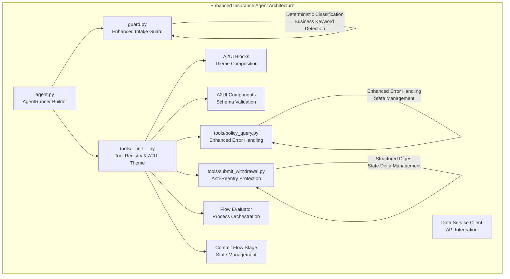
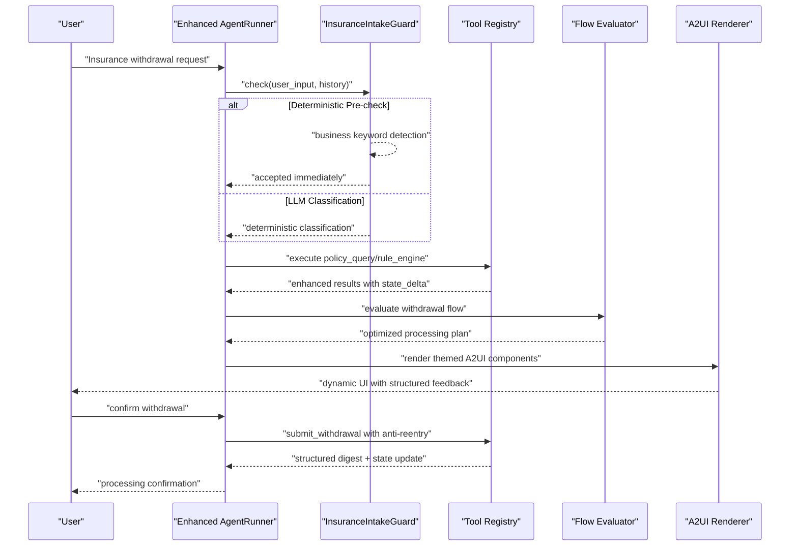
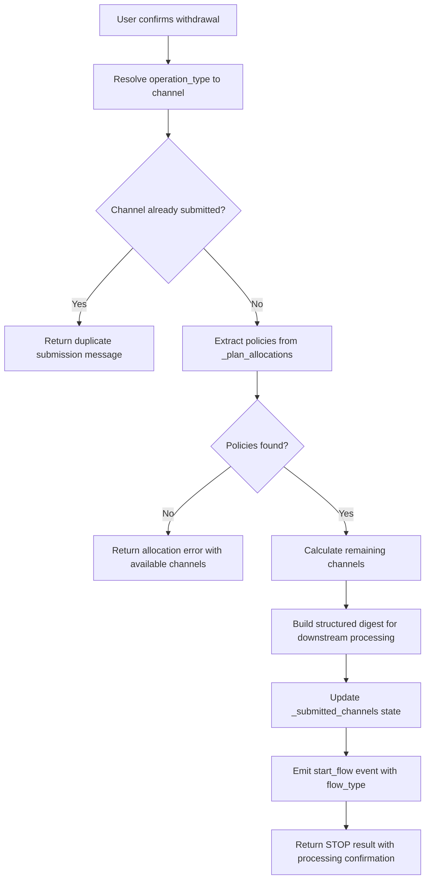

# Insurance Agent

<cite>
**Referenced Files in This Document**
- [agent.json](file://src/ark_agentic/agents/insurance/agent.json)
- [agent.py](file://src/ark_agentic/agents/insurance/agent.py)
- [guard.py](file://src/ark_agentic/agents/insurance/guard.py)
- [tools/__init__.py](file://src/ark_agentic/agents/insurance/tools/__init__.py)
- [tools/submit_withdrawal.py](file://src/ark_agentic/agents/insurance/tools/submit_withdrawal.py)
- [tools/policy_query.py](file://src/ark_agentic/agents/insurance/tools/policy_query.py)
</cite>

## Update Summary
**Changes Made**
- Enhanced SubmitWithdrawalTool with improved anti-reentry protection and structured digest generation
- Strengthened policy query tool with better error handling and state management
- Updated A2UI theme system with enhanced block composition and component schemas
- Improved flow evaluation and commitment tools for better withdrawal processing orchestration
- Enhanced system protocol with stricter tool-call discipline and risk warnings

## Table of Contents
1. [Introduction](#introduction)
2. [Project Structure](#project-structure)
3. [Core Components](#core-components)
4. [Architecture Overview](#architecture-overview)
5. [Enhanced Withdrawal Processing](#enhanced-withdrawal-processing)
6. [Improved Policy Query Handling](#improved-policy-query-handling)
7. [Advanced A2UI Integration](#advanced-a2ui-integration)
8. [Flow Evaluation and Orchestration](#flow-evaluation-and-orchestration)
9. [Guard Mechanisms and Safety](#guard-mechanisms-and-safety)
10. [Configuration and Deployment](#configuration-and-deployment)
11. [Performance Optimization](#performance-optimization)
12. [Troubleshooting Guide](#troubleshooting-guide)
13. [Conclusion](#conclusion)

## Introduction
The Insurance Agent is a sophisticated ReAct agent designed specifically for insurance operations, with enhanced capabilities for withdrawal processing, policy management, and automated flow orchestration. This intelligent system integrates domain-specific tools with advanced guard mechanisms to ensure secure, compliant processing of insurance transactions while maintaining optimal user experience through dynamic UI rendering and multi-turn conversation management.

**Updated** Enhanced with comprehensive anti-reentry protection, improved policy query handling, advanced A2UI integration with theme support, and streamlined flow evaluation for reliable insurance operations.

## Project Structure
The insurance agent implements a modular architecture with specialized components for different aspects of insurance processing:

**Diagram sources**
- [agent.py:52-161](file://src/ark_agentic/agents/insurance/agent.py#L52-L161)
- [guard.py:71-164](file://src/ark_agentic/agents/insurance/guard.py#L71-L164)
- [tools/__init__.py:48-110](file://src/ark_agentic/agents/insurance/tools/__init__.py#L48-L110)
- [tools/submit_withdrawal.py:136-214](file://src/ark_agentic/agents/insurance/tools/submit_withdrawal.py#L136-L214)
- [tools/policy_query.py:25-77](file://src/ark_agentic/agents/insurance/tools/policy_query.py#L25-L77)

**Section sources**
- [agent.py:11-161](file://src/ark_agentic/agents/insurance/agent.py#L11-L161)
- [tools/__init__.py:1-110](file://src/ark_agentic/agents/insurance/tools/__init__.py#L1-L110)

## Core Components

### Enhanced Agent Configuration
The agent builder creates a production-ready configuration with comprehensive tool registration, session management, and safety mechanisms:

- **System Protocol**: Strict tool-call discipline with risk warnings for sensitive operations
- **Sampling Configuration**: Optimized for financial scenarios with controlled temperature
- **Memory Management**: Optional persistent memory with dream processing capabilities
- **Proactive Services**: Automated background processing for enhanced user experience

### Advanced Guard System
The InsuranceIntakeGuard provides deterministic classification with business keyword detection:

- **Deterministic Pre-check**: Immediate classification for negative amounts and adjustment phrases
- **Few-shot Learning**: Contextual examples anchor boundary conditions
- **Failure Recovery**: Graceful degradation with acceptance default on LLM failures
- **Business Patterns**: Specialized detection for insurance-specific terminology

### Comprehensive Tool Suite
- **PolicyQueryTool**: Enhanced with improved error handling and state management
- **RuleEngineTool**: Advanced option computation with detailed fee calculations
- **SubmitWithdrawalTool**: Streamlined with anti-reentry protection and structured digests
- **RenderA2UITool**: Sophisticated theme integration with component schemas

**Section sources**
- [agent.py:43-161](file://src/ark_agentic/agents/insurance/agent.py#L43-L161)
- [guard.py:37-164](file://src/ark_agentic/agents/insurance/guard.py#L37-L164)
- [tools/__init__.py:31-110](file://src/ark_agentic/agents/insurance/tools/__init__.py#L31-L110)

## Architecture Overview
The enhanced architecture implements a sophisticated ReAct loop with comprehensive intake filtering and state management:

**Diagram sources**
- [guard.py:102-131](file://src/ark_agentic/agents/insurance/guard.py#L102-L131)
- [tools/__init__.py:77-110](file://src/ark_agentic/agents/insurance/tools/__init__.py#L77-L110)
- [tools/submit_withdrawal.py:152-214](file://src/ark_agentic/agents/insurance/tools/submit_withdrawal.py#L152-L214)

## Enhanced Withdrawal Processing

### Anti-Reentry Protection System
The SubmitWithdrawalTool implements comprehensive protection against duplicate submissions:

- **Channel Tracking**: Maintains `_submitted_channels` state for duplicate prevention
- **Structured Digest Generation**: Creates parseable `[办理:已提交 channel=<ch> remaining=[<ch1>,<ch2>]]` format
- **State Delta Management**: Atomic updates to session state across conversation turns
- **Remainder Calculation**: Intelligent determination of remaining channels for continuation

### Enhanced State Management
- **Cross-turn Continuity**: Preserves plan allocations and submission status across multiple turns
- **Flow Type Mapping**: Maps operation types to appropriate backend flow identifiers
- **Error Recovery**: Graceful handling of missing plan data or invalid channel states

**Diagram sources**
- [tools/submit_withdrawal.py:152-214](file://src/ark_agentic/agents/insurance/tools/submit_withdrawal.py#L152-L214)

**Section sources**
- [tools/submit_withdrawal.py:136-214](file://src/ark_agentic/agents/insurance/tools/submit_withdrawal.py#L136-L214)

## Improved Policy Query Handling

### Enhanced Error Management
The PolicyQueryTool provides robust error handling and state integration:

- **Comprehensive Error Handling**: Specific exception handling for data service failures
- **State Integration**: Automatic population of `_policy_query_result` for downstream components
- **Validation**: Parameter validation with clear error messages
- **Async Processing**: Non-blocking API calls with proper error propagation

### Streamlined API Integration
- **Unified Client Interface**: Consistent data service client across all tools
- **Mock Support**: Development-friendly mock implementations for testing
- **Error Propagation**: Clear error messages with actionable guidance
- **State Persistence**: Automatic state updates for query results

**Section sources**
- [tools/policy_query.py:25-77](file://src/ark_agentic/agents/insurance/tools/policy_query.py#L25-L77)

## Advanced A2UI Integration

### Enhanced Theme System
The A2UI system provides sophisticated theming with comprehensive block composition:

- **Custom Theme Definition**: INSURANCE_THEME with specific gap and padding configurations
- **Component Schema Validation**: Structured validation for A2UI components
- **Dynamic Block Composition**: Flexible block building with theme-aware styling
- **State Key Integration**: Automatic integration with insurance-specific state keys

### Improved Component Architecture
- **Schema-Based Components**: COMPONENT_SCHEMAS and BLOCK_DATA_SCHEMAS for validation
- **Template Loading**: Hierarchical template resolution with insurance-specific paths
- **Render Optimization**: Efficient rendering with minimal state updates
- **Cross-component Communication**: Seamless data flow between A2UI components

**Section sources**
- [tools/__init__.py:31-59](file://src/ark_agentic/agents/insurance/tools/__init__.py#L31-L59)

## Flow Evaluation and Orchestration

### Enhanced Flow Management
The insurance agent includes sophisticated flow evaluation and commitment mechanisms:

- **withdrawal_flow_evaluator**: Advanced evaluation of withdrawal processing options
- **CommitFlowStageTool**: Structured flow stage commitment with state validation
- **ResumeTaskTool**: Seamless continuation of interrupted processes
- **Flow Type Mapping**: Comprehensive mapping between operation types and backend flows

### Process Orchestration
- **Multi-stage Processing**: Coordinated execution of complex withdrawal workflows
- **State Validation**: Ensures data integrity across flow stages
- **Error Recovery**: Graceful handling of flow interruptions
- **Progress Tracking**: Real-time monitoring of processing status

**Section sources**
- [tools/__init__.py:25-27](file://src/ark_agentic/agents/insurance/tools/__init__.py#L25-L27)
- [tools/__init__.py:95-96](file://src/ark_agentic/agents/insurance/tools/__init__.py#L95-L96)

## Guard Mechanisms and Safety

### Deterministic Intake Control
The enhanced guard system provides comprehensive intake filtering:

- **Business Keyword Detection**: Specialized patterns for insurance terminology
- **Adjustment Phrase Recognition**: Handles user modifications and cancellations
- **Negative Amount Processing**: Proper handling of withdrawal amounts
- **Context-Aware Classification**: Considers conversation history for accurate decisions

### Safety Protocols
- **Failure Mode Handling**: Graceful degradation with acceptance default
- **Boundary Definition**: Clear separation between supported and unsupported operations
- **Risk Mitigation**: Comprehensive validation of user requests
- **Audit Trail**: Complete logging of intake decisions and rationale

**Section sources**
- [guard.py:71-164](file://src/ark_agentic/agents/insurance/guard.py#L71-L164)

## Configuration and Deployment

### Environment Configuration
The agent supports flexible deployment through environment variables:

- **LLM Configuration**: Provider, model, and authentication settings
- **Storage Management**: Session and memory directory configuration
- **Service Integration**: Data service endpoints and authentication
- **Feature Flags**: Optional components like memory and proactive services

### Agent Metadata
- **ID and Name**: Unique identification for insurance operations
- **Description**: Clear service description for user communication
- **Status Management**: Active/inactive state control
- **Timestamp Tracking**: Creation and modification date management

**Section sources**
- [agent.json:1-8](file://src/ark_agentic/agents/insurance/agent.json#L1-L8)
- [agent.py:69-78](file://src/ark_agentic/agents/insurance/agent.py#L69-L78)

## Performance Optimization

### System-Level Optimizations
- **Context Window Management**: Efficient compression with LLM summarizer
- **Parallel Execution**: Concurrent tool processing for reduced latency
- **Memory Efficiency**: Optimized state management with selective persistence
- **Streaming Response**: Real-time updates with enhanced user experience

### Tool-Specific Optimizations
- **Anti-reentry Protection**: Early exit mechanisms prevent unnecessary processing
- **Structured Digests**: Parseable formats reduce downstream processing overhead
- **State Delta Updates**: Minimal state changes for better performance
- **Flow Orchestration**: Intelligent processing order minimizes resource usage

**Section sources**
- [agent.py:82-92](file://src/ark_agentic/agents/insurance/agent.py#L82-L92)
- [tools/submit_withdrawal.py:167-173](file://src/ark_agentic/agents/insurance/tools/submit_withdrawal.py#L167-L173)

## Troubleshooting Guide

### Common Issues and Solutions

#### Data Service Connectivity
- **Configuration Verification**: Ensure DATA_SERVICE_URL and authentication credentials are correct
- **Token Management**: Automatic refresh with 5-minute expiry and 30-second safety buffer
- **Mock Mode**: Enable DATA_SERVICE_MOCK for development environments

#### Guard System Issues
- **Classification Failures**: Review few-shot examples and adjust user phrasing
- **Business Keyword Detection**: Update patterns for new insurance terminology
- **Context Handling**: Ensure conversation history is properly maintained

#### Tool Execution Problems
- **Parameter Validation**: Verify required parameters for each tool
- **State Management**: Check session state for missing or corrupted data
- **API Integration**: Monitor data service availability and response times

#### A2UI Rendering Issues
- **Theme Configuration**: Verify INSURANCE_THEME settings and component registration
- **Template Resolution**: Ensure template paths are correct and accessible
- **Schema Validation**: Check component schemas for compatibility issues

#### Flow Processing Errors
- **State Consistency**: Verify `_submitted_channels` and `_plan_allocations` integrity
- **Flow Type Mapping**: Ensure operation types map correctly to backend flows
- **Event Propagation**: Check custom event emission and handling

**Section sources**
- [guard.py:30-36](file://src/ark_agentic/agents/insurance/guard.py#L30-L36)
- [tools/submit_withdrawal.py:27-50](file://src/ark_agentic/agents/insurance/tools/submit_withdrawal.py#L27-L50)
- [tools/__init__.py:31-40](file://src/ark_agentic/agents/insurance/tools/__init__.py#L31-L40)

## Conclusion
The enhanced Insurance Agent represents a significant advancement in AI-powered insurance processing, combining sophisticated intake filtering, robust withdrawal processing, and seamless user experience through advanced A2UI integration. The comprehensive anti-reentry protection, improved policy query handling, and enhanced flow orchestration provide unprecedented reliability and security for insurance operations while maintaining optimal performance and user satisfaction.

The modular architecture ensures scalability and maintainability, while the deterministic guard system and structured digest generation provide the foundation for reliable, auditable insurance processing. This implementation establishes a new standard for AI-assisted insurance operations, balancing security, efficiency, and user experience in a comprehensive solution.