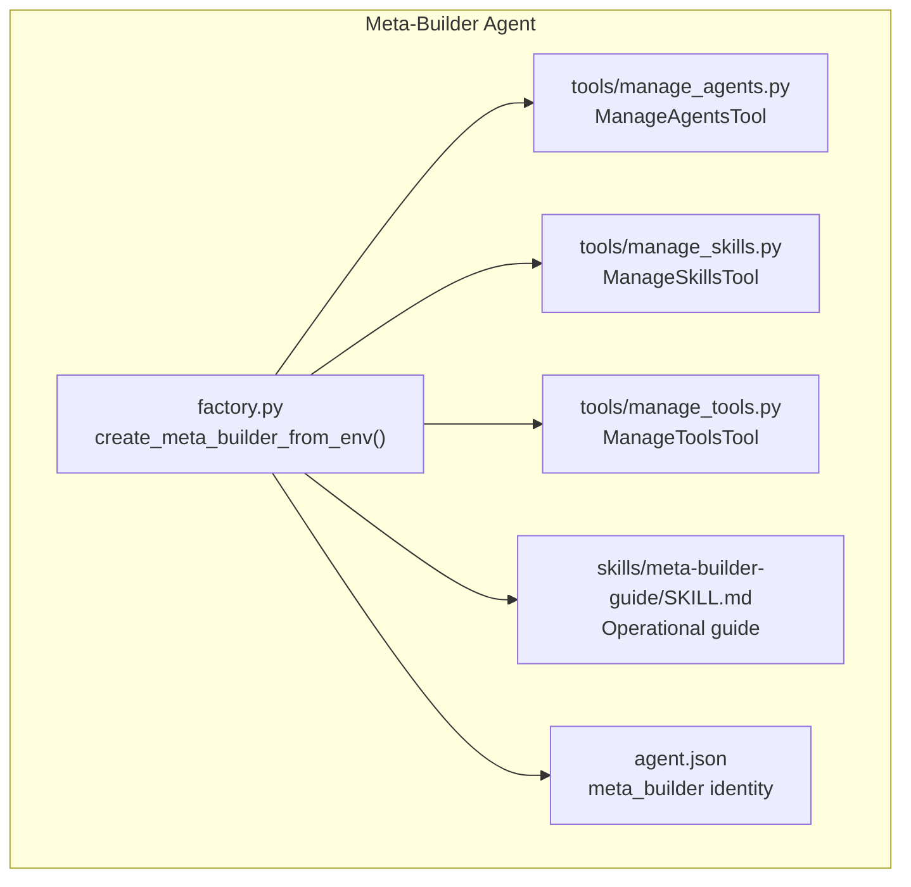
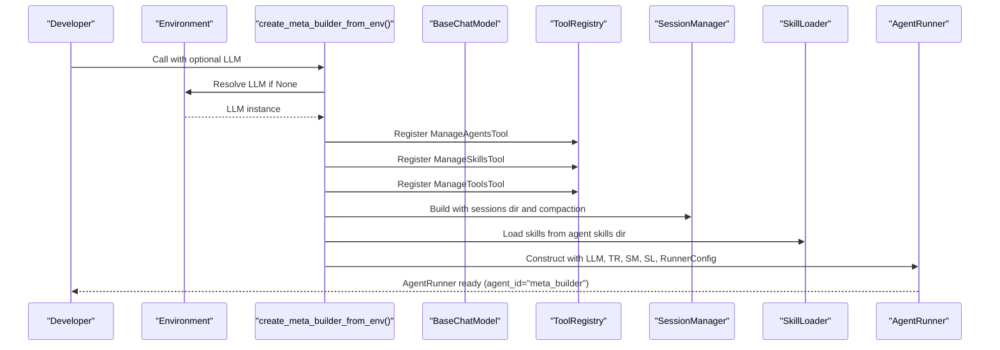
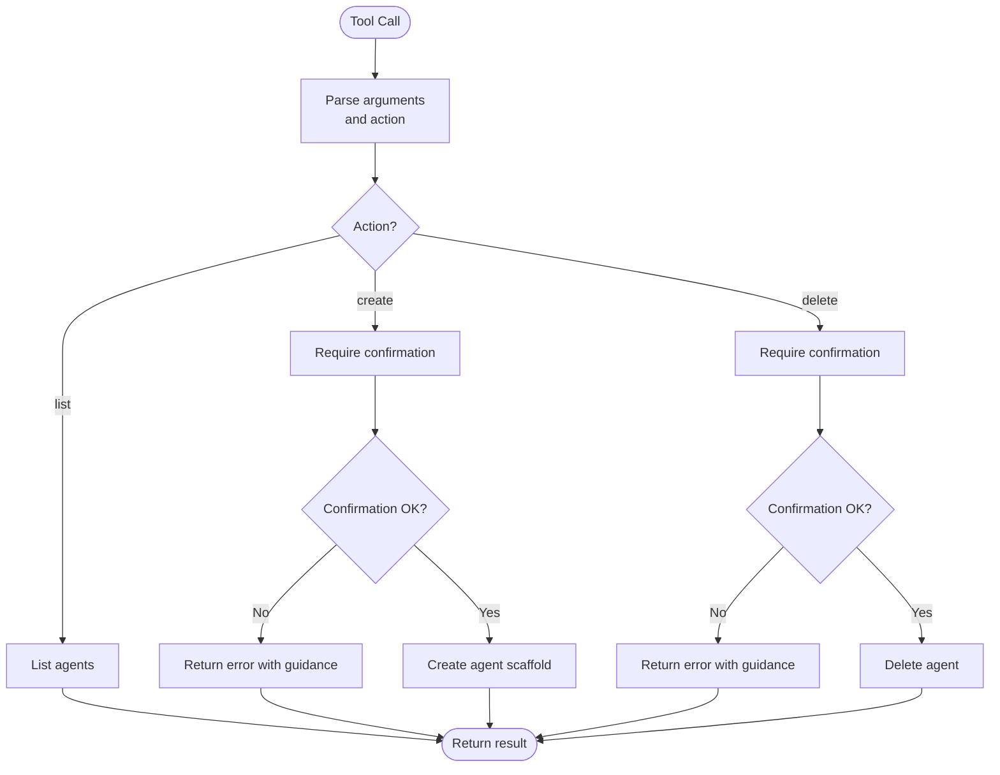
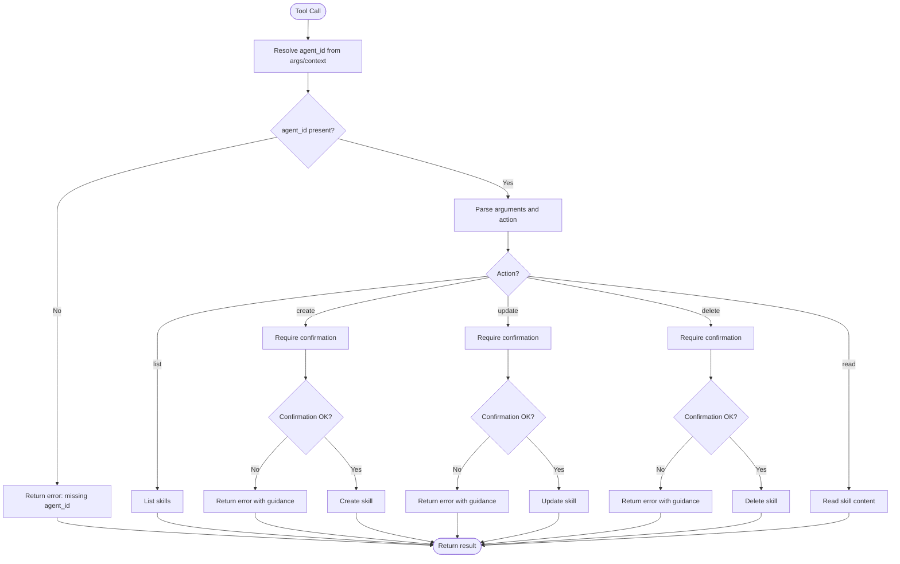
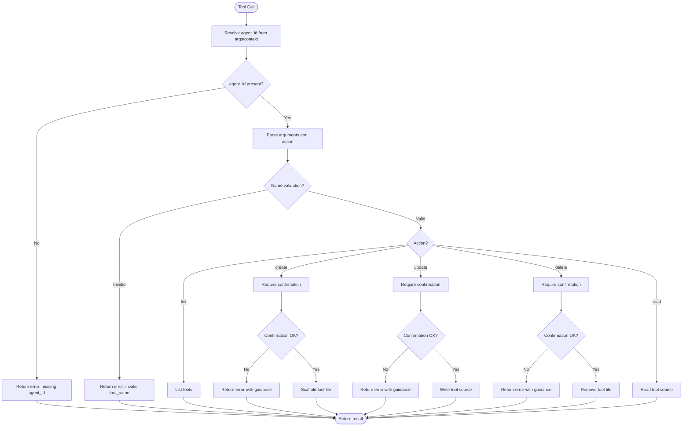
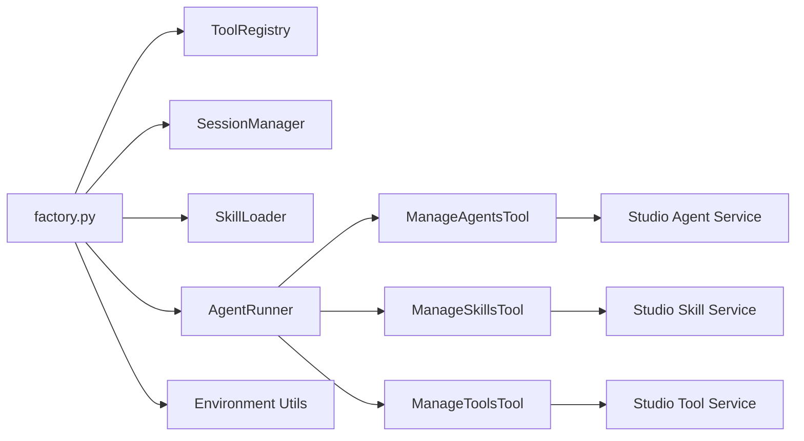

# Meta-Builder Agent

<cite>
**Referenced Files in This Document**
- [factory.py](file://src/ark_agentic/agents/meta_builder/factory.py)
- [__init__.py](file://src/ark_agentic/agents/meta_builder/__init__.py)
- [agent.json](file://src/ark_agentic/agents/meta_builder/agent.json)
- [manage_agents.py](file://src/ark_agentic/agents/meta_builder/tools/manage_agents.py)
- [manage_skills.py](file://src/ark_agentic/agents/meta_builder/tools/manage_skills.py)
- [manage_tools.py](file://src/ark_agentic/agents/meta_builder/tools/manage_tools.py)
- [SKILL.md](file://src/ark_agentic/agents/meta_builder/skills/meta-builder-guide/SKILL.md)
- [test_meta_builder_composite_tools.py](file://tests/unit/agents/meta_builder/test_meta_builder_composite_tools.py)
</cite>

## Table of Contents
1. [Introduction](#introduction)
2. [Project Structure](#project-structure)
3. [Core Components](#core-components)
4. [Architecture Overview](#architecture-overview)
5. [Detailed Component Analysis](#detailed-component-analysis)
6. [Dependency Analysis](#dependency-analysis)
7. [Performance Considerations](#performance-considerations)
8. [Troubleshooting Guide](#troubleshooting-guide)
9. [Conclusion](#conclusion)
10. [Appendices](#appendices)

## Introduction
This document explains the meta-builder agent system that enables dynamic, programmatic creation and management of agents, skills, and tools via natural language. It documents the factory pattern used to bootstrap the meta-builder, the orchestration of agent creation and management through composite tools, and the operational guide embedded as a skill. It also covers best practices for composing agents, configuring agent hierarchies, and implementing multi-agent workflows, and clarifies how meta-builders relate to the standard agent lifecycle.

## Project Structure
The meta-builder lives under the agents module and exposes:
- A factory that constructs an AgentRunner pre-configured with tools and skills for managing agents, skills, and tools.
- Three composite tools that encapsulate CRUD operations for agents, skills, and native tools.
- An embedded skill that documents the operational guide and safety confirmations for these tools.

**Diagram sources**
- [factory.py:35-101](file://src/ark_agentic/agents/meta_builder/factory.py#L35-L101)
- [agent.json:1-8](file://src/ark_agentic/agents/meta_builder/agent.json#L1-L8)
- [manage_agents.py:108-201](file://src/ark_agentic/agents/meta_builder/tools/manage_agents.py#L108-L201)
- [manage_skills.py:172-291](file://src/ark_agentic/agents/meta_builder/tools/manage_skills.py#L172-L291)
- [manage_tools.py:185-315](file://src/ark_agentic/agents/meta_builder/tools/manage_tools.py#L185-L315)
- [SKILL.md:1-56](file://src/ark_agentic/agents/meta_builder/skills/meta-builder-guide/SKILL.md#L1-L56)

**Section sources**
- [factory.py:35-101](file://src/ark_agentic/agents/meta_builder/factory.py#L35-L101)
- [__init__.py:1-7](file://src/ark_agentic/agents/meta_builder/__init__.py#L1-L7)
- [agent.json:1-8](file://src/ark_agentic/agents/meta_builder/agent.json#L1-L8)

## Core Components
- Factory: Creates a configured AgentRunner with:
  - ToolRegistry containing three composite tools.
  - SessionManager with compaction settings.
  - SkillLoader loading the embedded MetaBuilder guide.
  - RunnerConfig with temperature, token limits, turn limits, and prompt metadata.
- Composite Tools:
  - ManageAgentsTool: list/create/delete agents with mandatory user confirmation for destructive actions.
  - ManageSkillsTool: list/create/update/delete/read skills scoped to an agent, with mandatory confirmation for changes.
  - ManageToolsTool: list/create/update/delete/read native tools scoped to an agent, with mandatory confirmation for changes.
- Embedded Skill: MetaBuilder Guide defines the operational model, safety confirmations, and usage patterns.

Key characteristics:
- Safety-first design: All destructive actions require explicit user confirmation before execution.
- Context-aware targeting: Many actions can infer the target agent from conversation context.
- File-system persistence: Operations write to disk via service scaffolding and file utilities.

**Section sources**
- [factory.py:35-101](file://src/ark_agentic/agents/meta_builder/factory.py#L35-L101)
- [manage_agents.py:108-201](file://src/ark_agentic/agents/meta_builder/tools/manage_agents.py#L108-L201)
- [manage_skills.py:172-291](file://src/ark_agentic/agents/meta_builder/tools/manage_skills.py#L172-L291)
- [manage_tools.py:185-315](file://src/ark_agentic/agents/meta_builder/tools/manage_tools.py#L185-L315)
- [SKILL.md:16-56](file://src/ark_agentic/agents/meta_builder/skills/meta-builder-guide/SKILL.md#L16-L56)

## Architecture Overview
The meta-builder follows a factory pattern to assemble a runtime capable of orchestrating agent creation and management. The factory wires:
- LLM selection from environment.
- ToolRegistry with three composite tools.
- SessionManager for conversational persistence.
- SkillLoader for the embedded guide.
- AgentRunner with RunnerConfig.

**Diagram sources**
- [factory.py:35-101](file://src/ark_agentic/agents/meta_builder/factory.py#L35-L101)

**Section sources**
- [factory.py:35-101](file://src/ark_agentic/agents/meta_builder/factory.py#L35-L101)

## Detailed Component Analysis

### Factory Pattern and Runtime Assembly
- Purpose: Provide a single entry point to construct a fully configured AgentRunner for meta-building tasks.
- Responsibilities:
  - Optional LLM injection or environment-based initialization.
  - Registration of composite tools into ToolRegistry.
  - Setup of SessionManager with compaction configuration.
  - Loading of the embedded MetaBuilder guide skill.
  - Construction of AgentRunner with RunnerConfig tuned for precise tool use.

Best practices:
- Keep agent_id standardized as "meta_builder".
- Use low temperature and bounded tokens/turns to reduce hallucinations during construction tasks.
- Ensure sessions_dir is prepared per agent to persist conversations and decisions.

**Section sources**
- [factory.py:35-101](file://src/ark_agentic/agents/meta_builder/factory.py#L35-L101)

### ManageAgentsTool: Agent Lifecycle Orchestration
- Capabilities:
  - List all agents under the agents root.
  - Create an agent with a scaffold spec (name, description, initial skills).
  - Delete an agent by ID; meta_builder itself cannot be deleted.
- Safety:
  - All destructive actions require user confirmation via a specific phrase before execution.
- Context:
  - Uses environment-provided agents root and resolves paths safely.

Operational flow for create/delete:

**Diagram sources**
- [manage_agents.py:159-201](file://src/ark_agentic/agents/meta_builder/tools/manage_agents.py#L159-L201)

**Section sources**
- [manage_agents.py:108-201](file://src/ark_agentic/agents/meta_builder/tools/manage_agents.py#L108-L201)

### ManageSkillsTool: Skill Composition and Management
- Capabilities:
  - List skills for a given agent.
  - Create a new skill with name, description, and content (SKILL.md body).
  - Update a skill’s name/description/content.
  - Delete a skill by ID.
  - Read a skill’s content.
- Safety:
  - Create/update/delete require explicit user confirmation.
- Targeting:
  - agent_id resolved from arguments or conversation context (user:target_agent).
- Persistence:
  - Uses service APIs to scaffold and mutate skill directories.

Operational flow for create/update/delete:

**Diagram sources**
- [manage_skills.py:229-291](file://src/ark_agentic/agents/meta_builder/tools/manage_skills.py#L229-L291)

**Section sources**
- [manage_skills.py:172-291](file://src/ark_agentic/agents/meta_builder/tools/manage_skills.py#L172-L291)

### ManageToolsTool: Native Tool Scaffolding and Editing
- Capabilities:
  - List native tools for an agent.
  - Create a tool scaffold with a validated Python identifier name and parameter schema.
  - Update a tool by writing full Python source content to a file.
  - Delete a tool by removing its file.
  - Read a tool’s source code.
- Safety:
  - Create/update/delete require explicit user confirmation.
- Validation:
  - Enforces legal Python identifiers for tool names.
- Persistence:
  - Writes/reads files under the agent’s tools directory.

Operational flow for create/update/delete:

**Diagram sources**
- [manage_tools.py:248-315](file://src/ark_agentic/agents/meta_builder/tools/manage_tools.py#L248-L315)

**Section sources**
- [manage_tools.py:185-315](file://src/ark_agentic/agents/meta_builder/tools/manage_tools.py#L185-L315)

### MetaBuilder Guide: Operational Model and Best Practices
- Role: Embedded skill that instructs the meta-builder on how to interpret user intent and apply the composite tools.
- Highlights:
  - Core context: user:target_agent for inferring the current agent being managed.
  - Three composite tools overview and usage patterns.
  - Mandatory confirmation protocol for all destructive actions.
  - Interaction principles: explain first, confirm, then execute; prioritize meaningful content; concise feedback; transparent error handling.

Practical guidance:
- Always explain the planned change and its scope before invoking confirmation.
- For skill creation, produce complete, business-focused SKILL.md content.
- For tool creation, define a clear parameter schema aligned with downstream usage.

**Section sources**
- [SKILL.md:12-56](file://src/ark_agentic/agents/meta_builder/skills/meta-builder-guide/SKILL.md#L12-L56)

## Dependency Analysis
The meta-builder composes several subsystems and services:
- Core framework:
  - ToolRegistry for tool registration.
  - SessionManager for conversation persistence.
  - SkillLoader for skill discovery and loading.
  - AgentRunner for orchestration.
- Services:
  - Agent scaffolding and deletion.
  - Skill creation, update, deletion, listing, and parsing.
  - Tool scaffolding, listing, updating, deletion, and reading.
- Utilities:
  - Environment-resolved agents root and agent directory resolution.

**Diagram sources**
- [factory.py:35-101](file://src/ark_agentic/agents/meta_builder/factory.py#L35-L101)
- [manage_agents.py:17-22](file://src/ark_agentic/agents/meta_builder/tools/manage_agents.py#L17-L22)
- [manage_skills.py:16-23](file://src/ark_agentic/agents/meta_builder/tools/manage_skills.py#L16-L23)
- [manage_tools.py:17-21](file://src/ark_agentic/agents/meta_builder/tools/manage_tools.py#L17-L21)

**Section sources**
- [factory.py:35-101](file://src/ark_agentic/agents/meta_builder/factory.py#L35-L101)
- [manage_agents.py:17-22](file://src/ark_agentic/agents/meta_builder/tools/manage_agents.py#L17-L22)
- [manage_skills.py:16-23](file://src/ark_agentic/agents/meta_builder/tools/manage_skills.py#L16-L23)
- [manage_tools.py:17-21](file://src/ark_agentic/agents/meta_builder/tools/manage_tools.py#L17-L21)

## Performance Considerations
- Temperature tuning: The runner uses a relatively low temperature to improve precision during construction tasks.
- Token and turn limits: Bounded max_tokens and max_turns reduce long, meandering construction sessions.
- Session compaction: Recent conversational context is preserved while older context is compacted to fit within the context window.
- Tool safety overhead: Confirmation prompts add minimal latency but significantly reduce costly mistakes.

[No sources needed since this section provides general guidance]

## Troubleshooting Guide
Common issues and resolutions:
- Missing agent_id:
  - Symptom: Errors indicating missing agent_id when invoking skills/tools.
  - Resolution: Ensure either agent_id is passed explicitly or context includes user:target_agent.
- Confirmation not provided:
  - Symptom: Errors stating that destructive actions require confirmation.
  - Resolution: First explain the operation, wait for user confirmation, then re-invoke with confirmation set to the required phrase.
- Agent/tool/skill not found:
  - Symptom: Errors indicating resource not found.
  - Resolution: Verify IDs and paths; ensure the resource exists under the agents root.
- Invalid tool_name:
  - Symptom: Errors stating tool_name must be a valid Python identifier.
  - Resolution: Use snake_case identifiers without special characters or spaces.
- Permission or environment issues:
  - Symptom: Failures when writing files or scaffolding resources.
  - Resolution: Check permissions for the agents root directory and ensure environment variables are set correctly.

**Section sources**
- [manage_agents.py:38-47](file://src/ark_agentic/agents/meta_builder/tools/manage_agents.py#L38-L47)
- [manage_skills.py:39-47](file://src/ark_agentic/agents/meta_builder/tools/manage_skills.py#L39-L47)
- [manage_tools.py:37-45](file://src/ark_agentic/agents/meta_builder/tools/manage_tools.py#L37-L45)
- [manage_tools.py:57-62](file://src/ark_agentic/agents/meta_builder/tools/manage_tools.py#L57-L62)

## Conclusion
The meta-builder agent system demonstrates a robust meta-programming pattern for building agents, skills, and tools through a natural language interface. Its factory-driven assembly, composite tools, and embedded operational guide provide a safe, extensible foundation for agent composition and lifecycle management. By enforcing explicit user confirmations and leveraging context-aware targeting, it minimizes risk while enabling rapid prototyping and iteration.

[No sources needed since this section summarizes without analyzing specific files]

## Appendices

### Practical Examples

- Creating a specialized agent:
  - Use ManageAgentsTool with action=create, provide a name, optional description and initial skills, and follow the confirmation flow before execution.
  - Reference: [manage_agents.py:170-187](file://src/ark_agentic/agents/meta_builder/tools/manage_agents.py#L170-L187)

- Configuring agent hierarchies:
  - Create child agents under the same agents root and compose them by referencing their IDs in higher-level agents’ skills or workflows.
  - Reference: [manage_agents.py:49-60](file://src/ark_agentic/agents/meta_builder/tools/manage_agents.py#L49-L60)

- Implementing complex multi-agent workflows:
  - Compose skills that orchestrate cross-agent tool calls; ensure each destructive action follows the confirmation protocol.
  - Reference: [SKILL.md:22-31](file://src/ark_agentic/agents/meta_builder/skills/meta-builder-guide/SKILL.md#L22-L31)

- Managing skills and tools:
  - Use ManageSkillsTool and ManageToolsTool to iterate quickly on capabilities; leverage read operations to inspect current state.
  - Reference: [manage_skills.py:244-245](file://src/ark_agentic/agents/meta_builder/tools/manage_skills.py#L244-L245), [manage_tools.py:263-264](file://src/ark_agentic/agents/meta_builder/tools/manage_tools.py#L263-L264)

### Relationship to Standard Agent Lifecycle
- Bootstrapping: The factory creates an AgentRunner tailored for meta-building tasks.
- Execution: The runner invokes tools based on user intent, guided by the embedded MetaBuilder guide.
- Persistence: Sessions are compacted and stored for continuity across turns.
- Composition: Skills and tools created by the meta-builder integrate seamlessly into the broader agent ecosystem.

**Section sources**
- [factory.py:78-98](file://src/ark_agentic/agents/meta_builder/factory.py#L78-L98)
- [SKILL.md:10-16](file://src/ark_agentic/agents/meta_builder/skills/meta-builder-guide/SKILL.md#L10-L16)

### Unit Tests
- The repository includes unit tests validating the composite tools’ behavior and integration points.
- Reference: [test_meta_builder_composite_tools.py](file://tests/unit/agents/meta_builder/test_meta_builder_composite_tools.py)