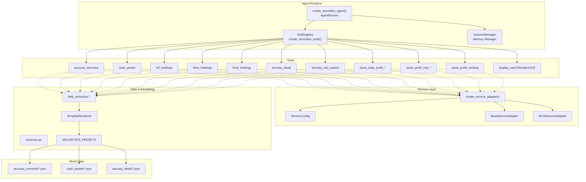
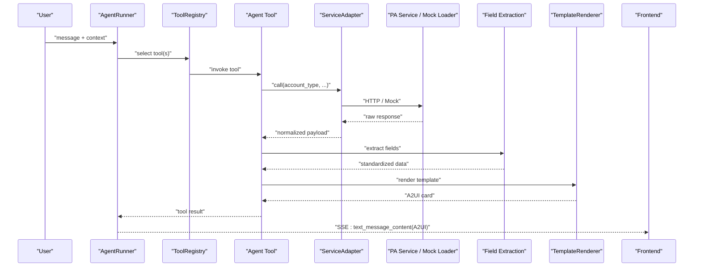
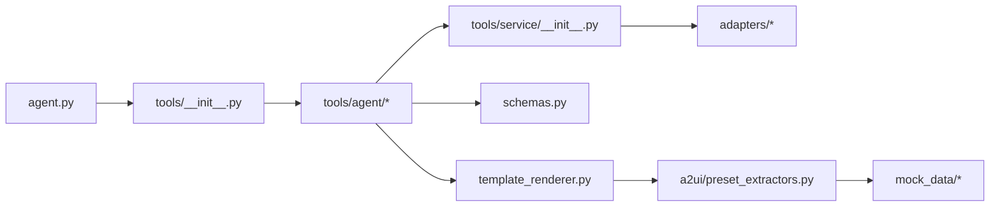

# Securities Agent

<cite>
**Referenced Files in This Document**
- [agent.py](file://src/ark_agentic/agents/securities/agent.py)
- [agent.json](file://src/ark_agentic/agents/securities/agent.json)
- [README.md](file://src/ark_agentic/agents/securities/README.md)
- [schemas.py](file://src/ark_agentic/agents/securities/schemas.py)
- [template_renderer.py](file://src/ark_agentic/agents/securities/template_renderer.py)
- [validation.py](file://src/ark_agentic/agents/securities/validation.py)
- [preset_extractors.py](file://src/ark_agentic/agents/securities/a2ui/preset_extractors.py)
- [tools/__init__.py](file://src/ark_agentic/agents/securities/tools/__init__.py)
- [tools/agent/__init__.py](file://src/ark_agentic/agents/securities/tools/agent/__init__.py)
- [tools/service/__init__.py](file://src/ark_agentic/agents/securities/tools/service/__init__.py)
- [tools/service/adapters/account_overview.py](file://src/ark_agentic/agents/securities/tools/service/adapters/account_overview.py)
- [tools/service/adapters/stock_daily_profit.py](file://src/ark_agentic/agents/securities/tools/service/adapters/stock_daily_profit.py)
- [tools/service/field_extraction.py](file://src/ark_agentic/agents/securities/tools/service/field_extraction.py)
- [tests/unit/agents/securities/test_a2ui_presets.py](file://tests/unit/agents/securities/test_a2ui_presets.py)
- [tests/integration/agents/securities/test_mock_loader_and_service_adapter.py](file://tests/integration/agents/securities/test_mock_loader_and_service_adapter.py)
- [tests/unit/agents/test_securities_validation.py](file://tests/unit/agents/test_securities_validation.py)
</cite>

## Update Summary
**Changes Made**
- Enhanced validation system with improved fact-checking and grounding mechanisms
- Expanded template rendering capabilities with new card types and improved field extraction
- Updated tool service adapters with better field extraction and stock daily profit handling
- Strengthened securities-specific tools with improved validation constraints
- Enhanced mock data system with comprehensive testing patterns

## Table of Contents
1. [Introduction](#introduction)
2. [Project Structure](#project-structure)
3. [Core Components](#core-components)
4. [Architecture Overview](#architecture-overview)
5. [Detailed Component Analysis](#detailed-component-analysis)
6. [Dependency Analysis](#dependency-analysis)
7. [Performance Considerations](#performance-considerations)
8. [Troubleshooting Guide](#troubleshooting-guide)
9. [Conclusion](#conclusion)
10. [Appendices](#appendices)

## Introduction
The Securities Agent provides intelligent financial data analysis and portfolio management for equity accounts, including normal and margin (two-way financing) accounts. It integrates a set of specialized tools for account overview, holdings analysis (ETF, HKSC, Fund), cash assets, security details, and profit analytics. The agent leverages a robust template rendering system to deliver structured, frontend-ready cards and supports both production APIs and a comprehensive mock data system for development and testing. It also enforces strict validation constraints to ensure responses are grounded in verified tool outputs and context.

**Updated** Enhanced with improved validation mechanisms, expanded template rendering capabilities, and strengthened service adapters for better field extraction and stock daily profit handling.

## Project Structure
The Securities Agent is organized around a modular architecture:
- Agent creation and orchestration
- Tool registry and lifecycle
- Service layer abstraction with adapters and mock loader
- Data schemas and validation
- Template rendering and A2UI presets
- Mock data and testing patterns

**Diagram sources**
- [agent.py:38-128](file://src/ark_agentic/agents/securities/agent.py#L38-L128)
- [tools/__init__.py:48-66](file://src/ark_agentic/agents/securities/tools/__init__.py#L48-L66)
- [tools/service/__init__.py:39-85](file://src/ark_agentic/agents/securities/tools/service/__init__.py#L39-L85)
- [template_renderer.py:12-374](file://src/ark_agentic/agents/securities/template_renderer.py#L12-L374)
- [preset_extractors.py:201-215](file://src/ark_agentic/agents/securities/a2ui/preset_extractors.py#L201-L215)

**Section sources**
- [README.md:574-635](file://src/ark_agentic/agents/securities/README.md#L574-L635)

## Core Components
- Agent runtime and configuration: creates the AgentRunner with LLM, tool registry, session management, memory, and callback hooks.
- Tool ecosystem: a comprehensive suite of securities tools covering account overview, cash assets, holdings (ETF/HKSC/Fund), security detail, profit analytics, and search.
- Service abstraction: unified adapter factory supporting production and mock modes with environment-driven configuration.
- Data models and validation: standardized schemas for each domain with flexible extraction helpers and precision-aware string fields.
- Template rendering and A2UI: renders structured cards consumable by the frontend, with presets for each tool's output.
- Mock data and testing: scenario-driven mock datasets and integration tests validating adapter and renderer behavior.

**Updated** Enhanced validation system now includes improved fact-checking through EntityTrie and citation validation hooks. Template rendering supports additional card types and improved field extraction with better error handling.

**Section sources**
- [agent.py:38-128](file://src/ark_agentic/agents/securities/agent.py#L38-L128)
- [tools/__init__.py:48-66](file://src/ark_agentic/agents/securities/tools/__init__.py#L48-L66)
- [tools/service/__init__.py:39-85](file://src/ark_agentic/agents/securities/tools/service/__init__.py#L39-L85)
- [schemas.py:17-465](file://src/ark_agentic/agents/securities/schemas.py#L17-L465)
- [template_renderer.py:12-374](file://src/ark_agentic/agents/securities/template_renderer.py#L12-L374)
- [preset_extractors.py:201-215](file://src/ark_agentic/agents/securities/a2ui/preset_extractors.py#L201-L215)

## Architecture Overview
The Securities Agent follows a layered architecture:
- Orchestration: AgentRunner manages turns, memory, and callbacks.
- Tool layer: Agent tools encapsulate domain actions and delegate to service adapters.
- Service layer: Adapters abstract API calls and validatedata signing; mock loader provides deterministic responses.
- Data layer: Extraction utilities normalize raw API payloads into standardized schemas.
- Presentation layer: TemplateRenderer produces A2UI cards; Preset extractors enrich context and titles.

**Diagram sources**
- [agent.py:116-128](file://src/ark_agentic/agents/securities/agent.py#L116-L128)
- [tools/service/__init__.py:39-85](file://src/ark_agentic/agents/securities/tools/service/__init__.py#L39-L85)
- [template_renderer.py:12-374](file://src/ark_agentic/agents/securities/template_renderer.py#L12-L374)

## Detailed Component Analysis

### Agent Orchestration and Configuration
- Creates AgentRunner with:
  - LLM initialized from environment
  - Tool registry populated via create_securities_tools()
  - SessionManager with compaction and summarization
  - Memory manager (optional)
  - Callbacks:
    - Context enrichment hook for securities context
    - Citation validation hook for grounding
- Loads skills dynamically from the skills directory.

Key configuration highlights:
- Environment-driven LLM selection
- Optional memory persistence under a dedicated directory
- Validation instruction injected into system prompt

**Updated** Enhanced with improved validation system using EntityTrie for fact-checking and citation validation hooks. Added authentication check callback for secure access control.

**Section sources**
- [agent.py:38-128](file://src/ark_agentic/agents/securities/agent.py#L38-L128)
- [validation.py:12-22](file://src/ark_agentic/agents/securities/validation.py#L12-L22)

### Securities Tools
The tool suite covers:
- Account overview and cash assets
- Holdings analysis for ETF, HKSC, and Fund
- Security detail and search
- Profit analytics (daily profit calendar, profit ranking, asset profit history)
- A2UI rendering tool bound to securities presets

Tool registration and grouping:
- create_securities_tools() returns a list of tool instances
- RenderA2UITool is configured with SECURITIES_PRESETS and group "securities"

**Updated** Enhanced service adapters with improved field extraction and better error handling for stock daily profit calculations.

**Section sources**
- [tools/__init__.py:48-66](file://src/ark_agentic/agents/securities/tools/__init__.py#L48-L66)
- [tools/agent/__init__.py:1-32](file://src/ark_agentic/agents/securities/tools/agent/__init__.py#L1-L32)

### Service Layer and Adapter Factory
- create_service_adapter(service_name, context):
  - Determines mock vs API mode
  - Supports per-session override via context fields
  - Loads production adapter from registry or returns MockServiceAdapter
  - Validates required environment variables for production URLs

- Mock loader:
  - Provides deterministic responses aligned with real API shapes
  - Supports scenarios (e.g., normal_user, margin_user) and security-specific datasets

**Updated** Improved field extraction utilities with better error handling and enhanced stock daily profit adapter for both normal and margin account types.

**Section sources**
- [tools/service/__init__.py:39-85](file://src/ark_agentic/agents/securities/tools/service/__init__.py#L39-L85)
- [tests/integration/agents/securities/test_mock_loader_and_service_adapter.py:10-45](file://tests/integration/agents/securities/test_mock_loader_and_service_adapter.py#L10-L45)

### Data Models and Validation
- Standardized schemas for each domain:
  - AccountOverviewSchema, CashAssetsSchema
  - ETFHoldingItemSchema, HKSCHoldingItemSchema, FundHoldingItemSchema
  - SecurityDetailSchema and related sub-models
- Flexible extraction helpers:
  - from_raw_data/from_api_response methods
  - get_val helper resolves multiple aliases for fields
- Precision-aware string fields to avoid floating-point drift

Validation constraints:
- System instruction restricts answers to verified facts
- Citation validation hook runs after loop end to ground claims

**Updated** Enhanced validation system with EntityTrie-based fact-checking and improved grounding mechanisms for better accuracy.

**Section sources**
- [schemas.py:17-465](file://src/ark_agentic/agents/securities/schemas.py#L17-L465)
- [validation.py:12-22](file://src/ark_agentic/agents/securities/validation.py#L12-L22)

### Template Rendering and A2UI Presets
- TemplateRenderer:
  - Renders standardized cards for account overview, holdings lists, cash assets, security detail, branch info, profit curves, daily profit calendars, and summaries
  - Emits A2UI envelopes compatible with enterprise protocol
- Preset extractors:
  - Enrich context with masked account and titles
  - Route to appropriate renderer based on source tool
  - Register 12 preset types for securities domain

**Updated** Expanded template rendering capabilities with new card types and improved field extraction for better data handling.

**Section sources**
- [template_renderer.py:12-374](file://src/ark_agentic/agents/securities/template_renderer.py#L12-L374)
- [preset_extractors.py:201-215](file://src/ark_agentic/agents/securities/a2ui/preset_extractors.py#L201-L215)
- [tests/unit/agents/securities/test_a2ui_presets.py:10-53](file://tests/unit/agents/securities/test_a2ui_presets.py#L10-L53)

### Securities-Specific Tools and Capabilities
- Account overview: total assets, cash balance, market values, today's profit/return, and rzrq details for margin accounts
- Holdings analysis: ETF, HKSC, and Fund holdings with per-position metrics and summaries
- Cash assets: balances, availability, draw balances, profit, frozen funds, and transit assets
- Security detail: holding stats, market info, and performance metrics
- Profit analytics: historical profit curves, daily profit calendars, and profit rankings
- Security search: fuzzy matching against seed CSV with optional dividend info

**Updated** Enhanced with improved validation constraints and better error handling for margin account support.

**Section sources**
- [README.md:637-733](file://src/ark_agentic/agents/securities/README.md#L637-L733)

### Practical Usage Examples
- Asset analysis:
  - Invoke account_overview to retrieve total assets and market composition
  - Use display_card to render account_overview_card
- Profit tracking:
  - Call asset_profit_hist_period or asset_profit_hist_range to obtain historical curves
  - Use stock_daily_profit_range or stock_daily_profit_month for daily performance calendars
- Market data queries:
  - Use security_detail to fetch detailed holding and market info for a given code
  - Use security_info_search to discover A-share details by code or name

These flows are orchestrated by the AgentRunner and surfaced via SSE enterprise protocol with A2UI payloads.

**Updated** Enhanced with improved validation and grounding mechanisms for more reliable responses.

**Section sources**
- [README.md:42-270](file://src/ark_agentic/agents/securities/README.md#L42-L270)

### Mock Data System and Testing Patterns
- Mock datasets mirror real API shapes:
  - account_overview: normal_user.json and margin variants
  - cash_assets: normal_user.json
  - security_detail: stock_510300.json
- Integration tests validate:
  - Scenario loading and rzrq fields for margin
  - Adapter behavior in mock mode
  - Renderer integration via preset registry

**Updated** Comprehensive testing patterns now include enhanced validation testing and improved mock data scenarios.

**Section sources**
- [tests/integration/agents/securities/test_mock_loader_and_service_adapter.py:10-45](file://tests/integration/agents/securities/test_mock_loader_and_service_adapter.py#L10-L45)
- [tests/unit/agents/securities/test_a2ui_presets.py:10-53](file://tests/unit/agents/securities/test_a2ui_presets.py#L10-L53)
- [tests/unit/agents/test_securities_validation.py:1-148](file://tests/unit/agents/test_securities_validation.py#L1-L148)

## Dependency Analysis
The Securities Agent exhibits strong cohesion within its domain and clean separation of concerns:
- Agent orchestrator depends on tool registry, session/memory managers, and callbacks
- Tools depend on service adapters; adapters depend on environment configuration
- Rendering depends on schemas and preset extractors
- Tests validate both service adapters and renderer integration

**Diagram sources**
- [agent.py:38-128](file://src/ark_agentic/agents/securities/agent.py#L38-L128)
- [tools/__init__.py:48-66](file://src/ark_agentic/agents/securities/tools/__init__.py#L48-L66)
- [tools/service/__init__.py:39-85](file://src/ark_agentic/agents/securities/tools/service/__init__.py#L39-L85)
- [schemas.py:17-465](file://src/ark_agentic/agents/securities/schemas.py#L17-L465)
- [template_renderer.py:12-374](file://src/ark_agentic/agents/securities/template_renderer.py#L12-L374)
- [preset_extractors.py:201-215](file://src/ark_agentic/agents/securities/a2ui/preset_extractors.py#L201-L215)

**Section sources**
- [agent.py:38-128](file://src/ark_agentic/agents/securities/agent.py#L38-L128)
- [tools/__init__.py:48-66](file://src/ark_agentic/agents/securities/tools/__init__.py#L48-L66)
- [tools/service/__init__.py:39-85](file://src/ark_agentic/agents/securities/tools/service/__init__.py#L39-L85)
- [schemas.py:17-465](file://src/ark_agentic/agents/securities/schemas.py#L17-L465)
- [template_renderer.py:12-374](file://src/ark_agentic/agents/securities/template_renderer.py#L12-L374)
- [preset_extractors.py:201-215](file://src/ark_agentic/agents/securities/a2ui/preset_extractors.py#L201-L215)

## Performance Considerations
- Context window and summarization: configured compaction reduces long histories to improve throughput.
- Mock mode: enables fast iteration during development without network latency.
- Streaming responses: SSE enterprise protocol delivers incremental updates for better UX.
- Field extraction and normalization: centralized helpers reduce duplication and parsing overhead.

**Updated** Enhanced validation system adds minimal overhead while significantly improving response accuracy and reliability.

## Troubleshooting Guide
Common issues and resolutions:
- Missing environment variables for production adapters:
  - Ensure SECURITIES_<SERVICE>_URL is set when not using mock mode.
- Mock mode misconfiguration:
  - Verify SECURITIES_SERVICE_MOCK and per-session overrides in context.
- Validation failures:
  - Responses constrained to verified facts; if insufficient data, the agent will indicate lack of confirmation.
- A2UI rendering errors:
  - Confirm source tool results are present in context and match expected schema.

**Updated** Enhanced validation system now provides better error reporting and grounding mechanisms for improved troubleshooting.

**Section sources**
- [tools/service/__init__.py:65-78](file://src/ark_agentic/agents/securities/tools/service/__init__.py#L65-L78)
- [validation.py:12-22](file://src/ark_agentic/agents/securities/validation.py#L12-L22)
- [preset_extractors.py:47-60](file://src/ark_agentic/agents/securities/a2ui/preset_extractors.py#L47-L60)

## Conclusion
The Securities Agent offers a robust, modular framework for financial data analysis and portfolio management. Its tool ecosystem, service abstraction, standardized schemas, and A2UI rendering pipeline enable precise, verifiable insights across accounts, holdings, and profits. The enhanced validation system, expanded template rendering capabilities, and improved service adapters ensure reliable operation across normal and margin accounts. The comprehensive mock data system and extensive testing patterns streamline development and validation, making it suitable for production deployment.

**Updated** The enhanced securities agent now provides improved validation, better template rendering capabilities, and stronger service adapters for more reliable and accurate financial data processing.

## Appendices

### API and Protocol Reference
- Chat endpoint: POST /chat with enterprise protocol and SSE streaming support
- Context fields: user_id, channel, usercode, userid, account, branchno, loginflag, mobileNo, signature, account_type
- SSE events: run_started, step_started, step_finished, tool_call_start, tool_call_result, text_message_content, run_finished, run_error

**Section sources**
- [README.md:42-270](file://src/ark_agentic/agents/securities/README.md#L42-L270)

### Securities Tool Catalog
- account_overview, cash_assets, etf_holdings, hksc_holdings, fund_holdings
- security_detail, security_info_search
- stock_daily_profit_range, stock_daily_profit_month
- asset_profit_hist_period, asset_profit_hist_range
- stock_profit_ranking
- display_card (RenderA2UI)

**Updated** Enhanced tool catalog with improved validation and error handling across all securities tools.

**Section sources**
- [README.md:637-652](file://src/ark_agentic/agents/securities/README.md#L637-L652)

### Enhanced Validation Features
- EntityTrie-based fact-checking for improved accuracy
- Citation validation hooks for grounding claims
- Grounding reflection mechanism to prevent repeated validation
- Warn route for borderline cases that don't require retries

**Section sources**
- [validation.py:12-22](file://src/ark_agentic/agents/securities/validation.py#L12-L22)
- [tests/unit/agents/test_securities_validation.py:1-148](file://tests/unit/agents/test_securities_validation.py#L1-L148)

### Template Rendering Enhancements
- Support for additional card types including profit summary and dividend info
- Improved field extraction with better error handling
- Enhanced HKSC holdings support with pre-frozen list handling
- Better margin account support with rzrq asset information

**Section sources**
- [template_renderer.py:12-374](file://src/ark_agentic/agents/securities/template_renderer.py#L12-L374)
- [field_extraction.py:393-414](file://src/ark_agentic/agents/securities/tools/service/field_extraction.py#L393-L414)

### Service Adapter Improvements
- Enhanced field extraction utilities with better error handling
- Improved stock daily profit adapter supporting both account types
- Better parameter mapping and validation
- Enhanced mock data loading with comprehensive scenarios

**Section sources**
- [field_extraction.py:1-479](file://src/ark_agentic/agents/securities/tools/service/field_extraction.py#L1-L479)
- [stock_daily_profit.py:1-50](file://src/ark_agentic/agents/securities/tools/service/adapters/stock_daily_profit.py#L1-L50)
- [account_overview.py:1-61](file://src/ark_agentic/agents/securities/tools/service/adapters/account_overview.py#L1-L61)