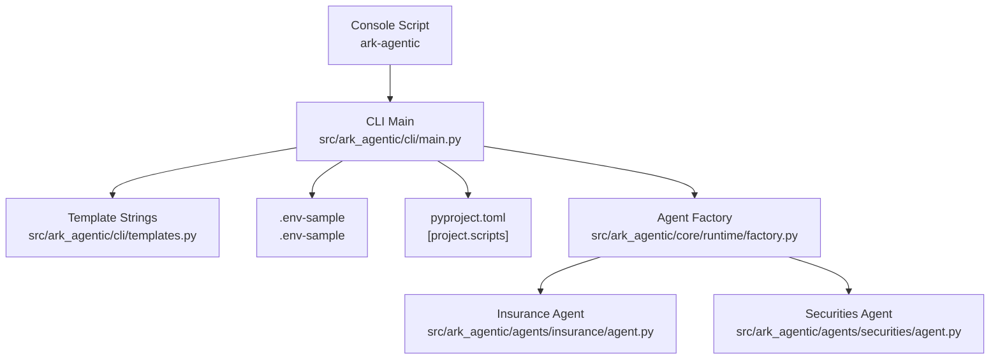
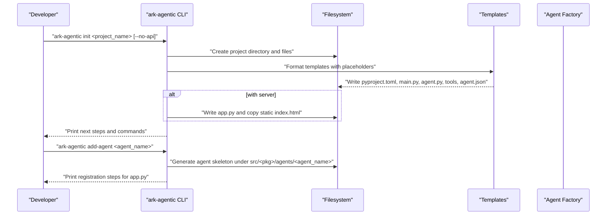
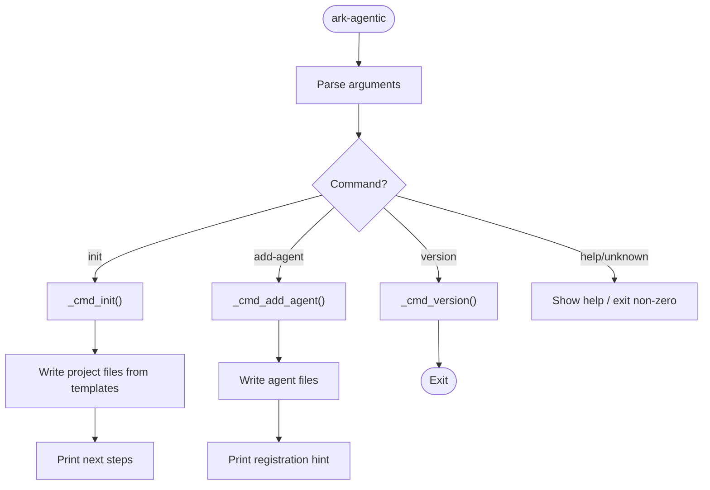
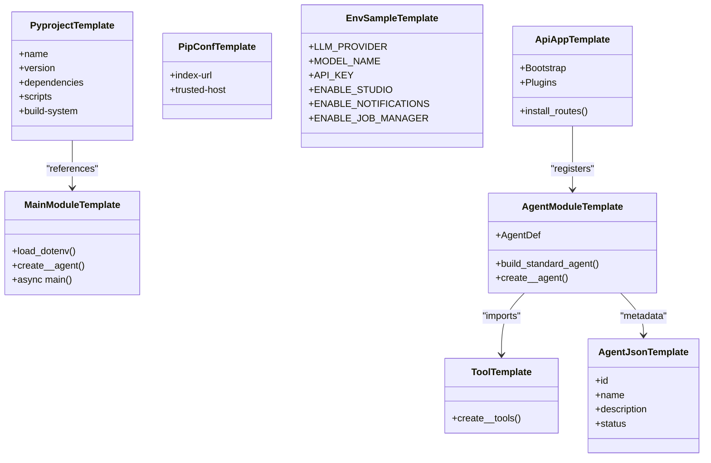
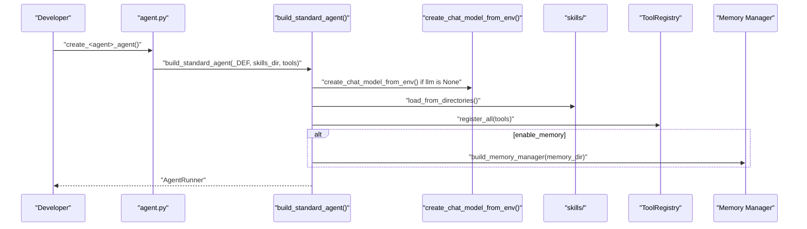
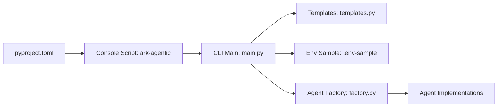

# CLI Tooling

<cite>
**Referenced Files in This Document**
- [pyproject.toml](file://pyproject.toml)
- [main.py](file://src/ark_agentic/cli/main.py)
- [templates.py](file://src/ark_agentic/cli/templates.py)
- [__init__.py](file://src/ark_agentic/cli/__init__.py)
- [.env-sample](file://.env-sample)
- [env.py](file://src/ark_agentic/core/utils/env.py)
- [factory.py](file://src/ark_agentic/core/runtime/factory.py)
- [agent.py (insurance)](file://src/ark_agentic/agents/insurance/agent.py)
- [agent.py (securities)](file://src/ark_agentic/agents/securities/agent.py)
- [account_overview.py](file://src/ark_agentic/agents/securities/tools/agent/account_overview.py)
- [customer_info.py](file://src/ark_agentic/agents/insurance/tools/customer_info.py)
- [test_cli.py](file://tests/integration/cli/test_cli.py)
</cite>

## Table of Contents
1. [Introduction](#introduction)
2. [Project Structure](#project-structure)
3. [Core Components](#core-components)
4. [Architecture Overview](#architecture-overview)
5. [Detailed Component Analysis](#detailed-component-analysis)
6. [Dependency Analysis](#dependency-analysis)
7. [Performance Considerations](#performance-considerations)
8. [Troubleshooting Guide](#troubleshooting-guide)
9. [Conclusion](#conclusion)
10. [Appendices](#appendices)

## Introduction
This document explains the Ark Agentic CLI tooling for project scaffolding, agent creation, and development workflow automation. It covers the command-line interface, the template system that generates boilerplate code, the project structure produced by scaffolding, and environment configuration. Practical workflows demonstrate creating a new agent project, adding domain-specific agents, and preparing deployments. Guidance is included for extending the CLI with custom commands, integrating with CI/CD pipelines, and automating repetitive tasks. Configuration options, debugging tips, and best practices for team collaboration are also provided.

## Project Structure
The CLI lives under the Ark Agentic package and is installed as a console script. The CLI orchestrates project scaffolding and agent addition, rendering templates into a new project layout and environment configuration.

**Diagram sources**
- [pyproject.toml:40-41](file://pyproject.toml#L40-L41)
- [main.py:178-222](file://src/ark_agentic/cli/main.py#L178-L222)
- [templates.py:9-33](file://src/ark_agentic/cli/templates.py#L9-L33)
- [.env-sample:1-97](file://.env-sample#L1-L97)
- [factory.py:59-183](file://src/ark_agentic/core/runtime/factory.py#L59-L183)
- [agent.py (insurance):47-75](file://src/ark_agentic/agents/insurance/agent.py#L47-L75)
- [agent.py (securities):72-100](file://src/ark_agentic/agents/securities/agent.py#L72-L100)

**Section sources**
- [pyproject.toml:40-41](file://pyproject.toml#L40-L41)
- [main.py:178-222](file://src/ark_agentic/cli/main.py#L178-L222)
- [templates.py:9-33](file://src/ark_agentic/cli/templates.py#L9-L33)
- [.env-sample:1-97](file://.env-sample#L1-L97)

## Core Components
- Console script entry point: The CLI is exposed as a console script named “ark-agentic” and invokes the main entry function.
- Command dispatcher: Subcommands include initialization, adding agents, and printing the version.
- Template engine: Predefined template strings are formatted with placeholders to generate project files.
- Environment configuration: A minimal .env-sample is scaffolded to guide environment variable usage.
- Agent factory: The scaffolding uses the framework’s agent factory to wire agents consistently.

Key behaviors:
- Initialization creates a project with a default agent, optional API server, and environment configuration.
- Adding an agent injects a new agent module skeleton into an existing project.
- Version prints the framework version.

**Section sources**
- [pyproject.toml:40-41](file://pyproject.toml#L40-L41)
- [main.py:178-222](file://src/ark_agentic/cli/main.py#L178-L222)
- [templates.py:9-33](file://src/ark_agentic/cli/templates.py#L9-L33)
- [templates.py:161-179](file://src/ark_agentic/cli/templates.py#L161-L179)
- [factory.py:59-183](file://src/ark_agentic/core/runtime/factory.py#L59-L183)

## Architecture Overview
The CLI orchestrates file generation and guides developers through a consistent project layout. The API server and Studio are optional and controlled by environment variables. The agent factory centralizes agent creation and configuration.

**Diagram sources**
- [main.py:53-113](file://src/ark_agentic/cli/main.py#L53-L113)
- [main.py:117-168](file://src/ark_agentic/cli/main.py#L117-L168)
- [templates.py:9-33](file://src/ark_agentic/cli/templates.py#L9-L33)
- [templates.py:181-273](file://src/ark_agentic/cli/templates.py#L181-L273)
- [factory.py:59-183](file://src/ark_agentic/core/runtime/factory.py#L59-L183)

## Detailed Component Analysis

### CLI Commands and Control Flow
- init: Creates a new project with a default agent and optional API server. Writes pyproject.toml, .env-sample, main.py, agent skeleton, and optionally app.py and static assets. Prints actionable next steps.
- add-agent: Adds a new agent module to an existing project under src/<pkg>/agents/<agent_name>. Writes skeleton files and prints registration instructions.
- version: Prints the framework version.

**Diagram sources**
- [main.py:178-222](file://src/ark_agentic/cli/main.py#L178-L222)
- [main.py:53-113](file://src/ark_agentic/cli/main.py#L53-L113)
- [main.py:117-168](file://src/ark_agentic/cli/main.py#L117-L168)

**Section sources**
- [main.py:53-113](file://src/ark_agentic/cli/main.py#L53-L113)
- [main.py:117-168](file://src/ark_agentic/cli/main.py#L117-L168)
- [main.py:172-174](file://src/ark_agentic/cli/main.py#L172-L174)

### Template System and Project Generation
The CLI uses predefined template strings to generate:
- pyproject.toml: Sets project metadata, dependencies, and console script entry.
- pip.conf: Configures a private index for package installation.
- .env-sample: Minimal environment variables for LLM and optional plugins.
- main.py: A CLI entry module for headless projects.
- agent.py: A standardized agent module using AgentDef and build_standard_agent.
- tools/__init__.py: A placeholder for tools.
- agent.json: Agent metadata for discovery and Studio.
- app.py: Optional API server assembly with plugins and environment-driven toggles.

**Diagram sources**
- [templates.py:9-33](file://src/ark_agentic/cli/templates.py#L9-L33)
- [templates.py:275-279](file://src/ark_agentic/cli/templates.py#L275-L279)
- [templates.py:161-179](file://src/ark_agentic/cli/templates.py#L161-L179)
- [templates.py:35-74](file://src/ark_agentic/cli/templates.py#L35-L74)
- [templates.py:76-129](file://src/ark_agentic/cli/templates.py#L76-L129)
- [templates.py:141-159](file://src/ark_agentic/cli/templates.py#L141-L159)
- [templates.py:281-288](file://src/ark_agentic/cli/templates.py#L281-L288)
- [templates.py:181-273](file://src/ark_agentic/cli/templates.py#L181-L273)

**Section sources**
- [templates.py:9-33](file://src/ark_agentic/cli/templates.py#L9-L33)
- [templates.py:35-74](file://src/ark_agentic/cli/templates.py#L35-L74)
- [templates.py:76-129](file://src/ark_agentic/cli/templates.py#L76-L129)
- [templates.py:141-159](file://src/ark_agentic/cli/templates.py#L141-L159)
- [templates.py:161-179](file://src/ark_agentic/cli/templates.py#L161-L179)
- [templates.py:181-273](file://src/ark_agentic/cli/templates.py#L181-L273)
- [templates.py:281-288](file://src/ark_agentic/cli/templates.py#L281-L288)

### Environment Configuration and Plugin Toggles
Environment variables control server behavior and optional plugins:
- LLM_PROVIDER, MODEL_NAME, API_KEY: Required for LLM access.
- API_HOST, API_PORT: API server binding.
- ENABLE_STUDIO, ENABLE_NOTIFICATIONS, ENABLE_JOB_MANAGER: Optional plugins.
- LOG_LEVEL: Logging verbosity.
- TRACING: Observability providers selection.

The CLI scaffolds a clean .env-sample with commented plugin toggles and minimal required variables.

**Section sources**
- [.env-sample:1-97](file://.env-sample#L1-L97)
- [templates.py:161-179](file://src/ark_agentic/cli/templates.py#L161-L179)

### Agent Factory and Standard Agent Wiring
The agent factory encapsulates conventional wiring:
- AgentDef defines identity, name, description, and optional prompt customization.
- build_standard_agent wires skills, tools, LLM, memory, and callbacks.
- Sessions and memory directories are derived by convention.

**Diagram sources**
- [factory.py:59-183](file://src/ark_agentic/core/runtime/factory.py#L59-L183)
- [agent.py (insurance):47-75](file://src/ark_agentic/agents/insurance/agent.py#L47-L75)
- [agent.py (securities):72-100](file://src/ark_agentic/agents/securities/agent.py#L72-L100)

**Section sources**
- [factory.py:59-183](file://src/ark_agentic/core/runtime/factory.py#L59-L183)
- [agent.py (insurance):47-75](file://src/ark_agentic/agents/insurance/agent.py#L47-L75)
- [agent.py (securities):72-100](file://src/ark_agentic/agents/securities/agent.py#L72-L100)

### Practical Workflows

#### Creating a New Agent Project
- Initialize a project with the default agent and API server:
  - Command: ark-agentic init <project_name>
  - Outcome: pyproject.toml, .env-sample, main.py, default agent skeleton, app.py, and optional static assets.
  - Next steps: Install dependencies and run either the CLI entry (headless) or the API server (with Studio).
- Initialize a headless project:
  - Command: ark-agentic init <project_name> --no-api
  - Outcome: pyproject.toml, .env-sample, main.py, default agent skeleton, no app.py.

**Section sources**
- [main.py:53-113](file://src/ark_agentic/cli/main.py#L53-L113)
- [templates.py:9-33](file://src/ark_agentic/cli/templates.py#L9-L33)
- [templates.py:181-273](file://src/ark_agentic/cli/templates.py#L181-L273)

#### Adding a Domain-Specific Agent
- Add a new agent module to an existing project:
  - Command: ark-agentic add-agent <agent_name>
  - Outcome: agent skeleton under src/<pkg>/agents/<agent_name>.
  - Next steps: Implement tools, update agent description, and register the agent in app.py.

**Section sources**
- [main.py:117-168](file://src/ark_agentic/cli/main.py#L117-L168)
- [templates.py:76-129](file://src/ark_agentic/cli/templates.py#L76-L129)
- [templates.py:141-159](file://src/ark_agentic/cli/templates.py#L141-L159)
- [templates.py:281-288](file://src/ark_agentic/cli/templates.py#L281-L288)

#### Preparing Deployments
- Use environment variables to toggle plugins and configure the server:
  - ENABLE_STUDIO, ENABLE_NOTIFICATIONS, ENABLE_JOB_MANAGER
  - API_HOST, API_PORT
  - LLM_PROVIDER, MODEL_NAME, API_KEY
- The API server loads plugins based on environment variables and registers agents via the bootstrap mechanism.

**Section sources**
- [.env-sample:1-97](file://.env-sample#L1-L97)
- [templates.py:181-273](file://src/ark_agentic/cli/templates.py#L181-L273)

### Extending the CLI with Custom Commands
- Add a new subcommand in the CLI argument parser and handler mapping.
- Implement a dedicated function to handle the command, similar to _cmd_init and _cmd_add_agent.
- Use the template system to generate files or orchestrate external tool invocations.
- Keep error handling consistent and print actionable next steps.

**Section sources**
- [main.py:178-222](file://src/ark_agentic/cli/main.py#L178-L222)

### Integrating with CI/CD Pipelines
- Use the console script to scaffold and validate projects in CI:
  - Install dependencies and run ark-agentic init with --no-api for headless jobs.
  - Verify generated files and basic imports.
- Configure environment variables in CI to enable optional plugins and tracing.
- Automate repetitive tasks by scripting CLI commands in pipeline stages.

**Section sources**
- [pyproject.toml:40-41](file://pyproject.toml#L40-L41)
- [.env-sample:1-97](file://.env-sample#L1-L97)

### Best Practices for Team Collaboration
- Use the default agent scaffolding to maintain consistent structure across team projects.
- Define shared environment variables in .env-sample and document plugin toggles.
- Encourage adding agent.json metadata for discoverability in Studio.
- Keep agent descriptions concise and update them as capabilities evolve.

**Section sources**
- [templates.py:281-288](file://src/ark_agentic/cli/templates.py#L281-L288)
- [.env-sample:1-97](file://.env-sample#L1-L97)

## Dependency Analysis
The CLI depends on:
- The console script entry point defined in pyproject.toml.
- Template strings for scaffolding.
- The agent factory for consistent agent wiring.

**Diagram sources**
- [pyproject.toml:40-41](file://pyproject.toml#L40-L41)
- [main.py:178-222](file://src/ark_agentic/cli/main.py#L178-L222)
- [templates.py:9-33](file://src/ark_agentic/cli/templates.py#L9-L33)
- [factory.py:59-183](file://src/ark_agentic/core/runtime/factory.py#L59-L183)

**Section sources**
- [pyproject.toml:40-41](file://pyproject.toml#L40-L41)
- [main.py:178-222](file://src/ark_agentic/cli/main.py#L178-L222)
- [templates.py:9-33](file://src/ark_agentic/cli/templates.py#L9-L33)
- [factory.py:59-183](file://src/ark_agentic/core/runtime/factory.py#L59-L183)

## Performance Considerations
- Use headless mode (--no-api) for CLI-only workloads to avoid loading server dependencies.
- Keep agent tools lightweight and lazy-load heavy resources.
- Limit skills directory size and scope to reduce load overhead.
- Tune environment variables for logging and tracing to minimize overhead in production.

## Troubleshooting Guide
Common issues and resolutions:
- Directory already exists when initializing: Ensure the target project directory does not exist before running init.
- Missing pyproject.toml or src/: The add-agent command requires an existing project structure.
- Unknown subcommand: The CLI prints help and exits with a non-zero code; verify the subcommand spelling.
- Environment variables: Confirm LLM variables and plugin toggles are set appropriately for the desired behavior.

Validation references:
- Initialization tests confirm project structure and template content.
- Add-agent tests confirm agent skeleton generation.
- Version tests confirm output correctness.

**Section sources**
- [main.py:59-61](file://src/ark_agentic/cli/main.py#L59-L61)
- [main.py:123-138](file://src/ark_agentic/cli/main.py#L123-L138)
- [test_cli.py:172-196](file://tests/integration/cli/test_cli.py#L172-L196)
- [test_cli.py:238-256](file://tests/integration/cli/test_cli.py#L238-L256)
- [test_cli.py:260-264](file://tests/integration/cli/test_cli.py#L260-L264)
- [test_cli.py:275-282](file://tests/integration/cli/test_cli.py#L275-L282)

## Conclusion
The Ark Agentic CLI provides a streamlined developer experience for scaffolding projects, generating agent templates, and configuring development environments. By leveraging standardized templates and the agent factory, teams can maintain consistency and accelerate development. Optional server and plugin configurations enable flexible deployment scenarios, while environment-driven toggles simplify CI/CD integration.

## Appendices

### Environment Variable Reference
- LLM_PROVIDER, MODEL_NAME, API_KEY: LLM configuration.
- API_HOST, API_PORT: API server binding.
- ENABLE_STUDIO, ENABLE_NOTIFICATIONS, ENABLE_JOB_MANAGER: Optional plugins.
- LOG_LEVEL: Logging verbosity.
- TRACING: Observability providers selection.

**Section sources**
- [.env-sample:1-97](file://.env-sample#L1-L97)

### Example Agent Implementations
- Insurance agent demonstrates protocol customization and callback hooks.
- Securities agent demonstrates context enrichment and validation hooks.

**Section sources**
- [agent.py (insurance):47-75](file://src/ark_agentic/agents/insurance/agent.py#L47-L75)
- [agent.py (securities):72-100](file://src/ark_agentic/agents/securities/agent.py#L72-L100)

### Tool Parameter Utilities
- Parameter reading helpers support robust tool argument parsing.

**Section sources**
- [customer_info.py:69-94](file://src/ark_agentic/agents/insurance/tools/customer_info.py#L69-L94)
- [account_overview.py:32-54](file://src/ark_agentic/agents/securities/tools/agent/account_overview.py#L32-L54)