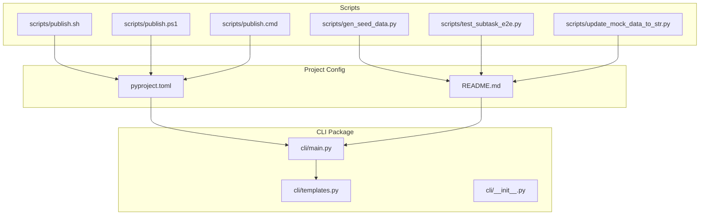
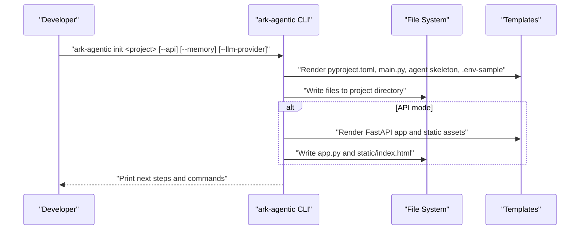
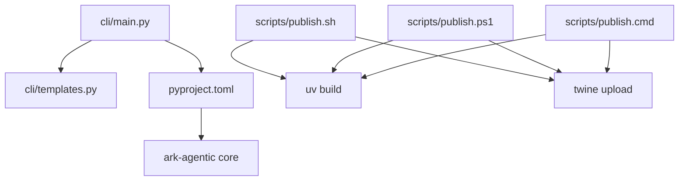

# CLI and Utilities

<cite>
**Referenced Files in This Document**
- [main.py](file://src/ark_agentic/cli/main.py)
- [templates.py](file://src/ark_agentic/cli/templates.py)
- [__init__.py](file://src/ark_agentic/cli/__init__.py)
- [pyproject.toml](file://pyproject.toml)
- [README.md](file://README.md)
- [test_cli.py](file://tests/integration/cli/test_cli.py)
- [publish.sh](file://scripts/publish.sh)
- [publish.ps1](file://scripts/publish.ps1)
- [publish.cmd](file://scripts/publish.cmd)
- [gen_seed_data.py](file://scripts/gen_seed_data.py)
- [test_subtask_e2e.py](file://scripts/test_subtask_e2e.py)
- [update_mock_data_to_str.py](file://scripts/update_mock_data_to_str.py)
</cite>

## Table of Contents
1. [Introduction](#introduction)
2. [Project Structure](#project-structure)
3. [Core Components](#core-components)
4. [Architecture Overview](#architecture-overview)
5. [Detailed Component Analysis](#detailed-component-analysis)
6. [Dependency Analysis](#dependency-analysis)
7. [Performance Considerations](#performance-considerations)
8. [Troubleshooting Guide](#troubleshooting-guide)
9. [Conclusion](#conclusion)
10. [Appendices](#appendices)

## Introduction
This document explains the CLI utilities and command-line tools for the ark-agentic project. It covers the main ark-agentic CLI commands for project initialization, agent scaffolding, and development utilities. It documents the template system used to generate project skeletons and agent configurations, and provides practical examples for rapid prototyping, testing, and deployment preparation. Utility scripts for data generation, publishing, and maintenance tasks are included, along with troubleshooting guidance and best practices for CLI-driven development workflows.

## Project Structure
The CLI is implemented under the src/ark_agentic/cli package and integrates with the broader project via pyproject.toml entry points. The CLI generates project scaffolds using embedded templates and supports adding new agents to existing projects. Additional scripts under scripts/ support publishing and maintenance tasks.

**Diagram sources**
- [main.py:1-256](file://src/ark_agentic/cli/main.py#L1-L256)
- [templates.py:1-277](file://src/ark_agentic/cli/templates.py#L1-L277)
- [pyproject.toml:1-95](file://pyproject.toml#L1-L95)
- [README.md:1-790](file://README.md#L1-L790)
- [publish.sh:1-75](file://scripts/publish.sh#L1-L75)
- [publish.ps1:1-62](file://scripts/publish.ps1#L1-L62)
- [publish.cmd:1-73](file://scripts/publish.cmd#L1-L73)
- [gen_seed_data.py:1-1149](file://scripts/gen_seed_data.py#L1-L1149)
- [test_subtask_e2e.py:1-93](file://scripts/test_subtask_e2e.py#L1-L93)
- [update_mock_data_to_str.py:1-35](file://scripts/update_mock_data_to_str.py#L1-L35)

**Section sources**
- [main.py:1-256](file://src/ark_agentic/cli/main.py#L1-L256)
- [templates.py:1-277](file://src/ark_agentic/cli/templates.py#L1-L277)
- [pyproject.toml:1-95](file://pyproject.toml#L1-L95)
- [README.md:1-790](file://README.md#L1-L790)

## Core Components
- CLI entry point and subcommands:
  - init: Creates a new agent project skeleton with optional FastAPI server and memory support.
  - add-agent: Adds a new agent module to an existing project.
  - version: Prints the framework version.
- Template system:
  - pyproject.toml, main.py, agent skeleton, tools, agent.json, .env-sample, and optional FastAPI app and static assets.
- Scripts:
  - Publishing automation for building and uploading wheels.
  - Data generation and maintenance utilities for mock datasets and testing.

Key behaviors:
- Project scaffolding respects LLM provider selection and optional API/memory features.
- Generated projects include a console entry point and optional FastAPI app with Studio integration.
- Tests validate template content and CLI behavior.

**Section sources**
- [main.py:84-256](file://src/ark_agentic/cli/main.py#L84-L256)
- [templates.py:9-277](file://src/ark_agentic/cli/templates.py#L9-L277)
- [test_cli.py:1-236](file://tests/integration/cli/test_cli.py#L1-L236)

## Architecture Overview
The CLI orchestrates file generation and project setup. It renders templates with formatted placeholders and writes files to disk. Optional API mode injects FastAPI app and static assets. The pyproject.toml entry point exposes the CLI globally.

**Diagram sources**
- [main.py:84-154](file://src/ark_agentic/cli/main.py#L84-L154)
- [templates.py:9-277](file://src/ark_agentic/cli/templates.py#L9-L277)
- [pyproject.toml:42-43](file://pyproject.toml#L42-L43)

**Section sources**
- [main.py:212-256](file://src/ark_agentic/cli/main.py#L212-L256)
- [templates.py:9-277](file://src/ark_agentic/cli/templates.py#L9-L277)
- [pyproject.toml:42-43](file://pyproject.toml#L42-L43)

## Detailed Component Analysis

### CLI Commands and Subcommands
- init
  - Creates project directory, pyproject.toml, .env-sample, main module, default agent skeleton, and optional API app.
  - Supports flags:
    - --api: Include FastAPI server and Studio support.
    - --memory: Adjust dependencies for memory-enabled runs.
    - --llm-provider: Choose among openai, pa-sx, pa-jt.
  - Generates package name from project name and writes files accordingly.
- add-agent
  - Validates project context (pyproject.toml, src layout).
  - Detects package name from src structure.
  - Creates a new agent module under src/<package>/agents/<agent_name>.
- version
  - Prints the installed framework version.

Operational notes:
- Uses argparse subparsers and a handler map for dispatch.
- Writes files atomically and prints helpful next steps after creation.

**Section sources**
- [main.py:84-207](file://src/ark_agentic/cli/main.py#L84-L207)
- [test_cli.py:151-217](file://tests/integration/cli/test_cli.py#L151-L217)

### Template System
The CLI embeds template strings for:
- pyproject.toml: Project metadata, dependencies, scripts, and build targets.
- main.py: Interactive entry point that loads environment and starts a default agent.
- agent module: Skeleton for creating an agent runner with tool registry and session manager.
- tools module: Placeholder for tool definitions.
- agent.json: Agent identity and status.
- .env-sample: Provider-specific environment variable placeholders.
- FastAPI app (optional): Full server with router wiring and Studio setup.

Template rendering:
- Uses str.format() with a formatter dictionary containing project and agent placeholders.
- Environment sample rendering adapts to selected LLM provider.

**Section sources**
- [templates.py:9-277](file://src/ark_agentic/cli/templates.py#L9-L277)
- [test_cli.py:76-149](file://tests/integration/cli/test_cli.py#L76-L149)

### Publishing Utilities
The scripts directory contains platform-specific publishing automation:
- publish.sh: Builds Studio frontend (if present), then builds and optionally uploads the wheel to an internal PyPI repository.
- publish.ps1: PowerShell equivalent with similar behavior.
- publish.cmd: Windows Command Prompt equivalent.

Behavior highlights:
- Reads version from pyproject.toml.
- Skips upload when --dry-run is used.
- Uploads artifacts produced by uv build.

**Section sources**
- [publish.sh:1-75](file://scripts/publish.sh#L1-L75)
- [publish.ps1:1-62](file://scripts/publish.ps1#L1-L62)
- [publish.cmd:1-73](file://scripts/publish.cmd#L1-L73)
- [pyproject.toml:35-58](file://pyproject.toml#L35-L58)

### Data Generation and Maintenance Scripts
- gen_seed_data.py: Generates representative A-share seed data CSV for securities-related demos and tests.
- update_mock_data_to_str.py: Recursively converts numeric values in mock JSON data to strings for compatibility.
- test_subtask_e2e.py: End-to-end test for spawn_subtasks tool, bypassing LLM decisions and directly invoking the tool to spawn subtasks.

Usage examples:
- Run gen_seed_data.py to produce CSV files for local testing.
- Use update_mock_data_to_str.py to normalize mock data types.
- Execute test_subtask_e2e.py to validate subtask spawning behavior.

**Section sources**
- [gen_seed_data.py:1-1149](file://scripts/gen_seed_data.py#L1-L1149)
- [update_mock_data_to_str.py:1-35](file://scripts/update_mock_data_to_str.py#L1-L35)
- [test_subtask_e2e.py:1-93](file://scripts/test_subtask_e2e.py#L1-L93)

### Practical Examples

- Rapid prototyping with CLI
  - Initialize a new project with a chosen LLM provider and optional API server:
    - Example: ark-agentic init my-insurance-agent --llm-provider openai --api
  - Add a new agent module to an existing project:
    - Example: ark-agentic add-agent risk-assessment
  - Run the interactive agent:
    - Example: python -m <package>.main

- Testing and validation
  - Use test_subtask_e2e.py to validate subtask spawning without LLM calls.
  - Generate seed data for securities domain to populate mock datasets.

- Deployment preparation
  - Build and publish a wheel using the provided scripts:
    - Example: ./scripts/publish.sh
    - Dry run: ./scripts/publish.sh --dry-run

**Section sources**
- [README.md:164-186](file://README.md#L164-L186)
- [test_subtask_e2e.py:1-93](file://scripts/test_subtask_e2e.py#L1-L93)
- [publish.sh:1-75](file://scripts/publish.sh#L1-L75)

## Dependency Analysis
The CLI depends on the ark-agentic core for runtime features (when generating agent code) and uses templates to scaffold projects. Publishing scripts depend on uv and twine for building and uploading distributions.

**Diagram sources**
- [main.py:1-256](file://src/ark_agentic/cli/main.py#L1-L256)
- [templates.py:1-277](file://src/ark_agentic/cli/templates.py#L1-L277)
- [pyproject.toml:1-95](file://pyproject.toml#L1-L95)
- [publish.sh:1-75](file://scripts/publish.sh#L1-L75)
- [publish.ps1:1-62](file://scripts/publish.ps1#L1-L62)
- [publish.cmd:1-73](file://scripts/publish.cmd#L1-L73)

**Section sources**
- [main.py:1-256](file://src/ark_agentic/cli/main.py#L1-L256)
- [pyproject.toml:1-95](file://pyproject.toml#L1-L95)

## Performance Considerations
- CLI generation is file I/O bound; templates are small and rendered once per project creation.
- Publishing scripts rely on uv build and twine; ensure network connectivity and credentials are configured for efficient uploads.
- Using --dry-run during development avoids unnecessary uploads and speeds up feedback loops.

## Troubleshooting Guide
Common CLI issues and resolutions:
- Directory already exists when initializing a project:
  - Symptom: Error indicating the project directory already exists.
  - Resolution: Choose a different project name or remove the existing directory.
- Missing pyproject.toml or src layout when adding an agent:
  - Symptom: Error instructing to run the command in the project root.
  - Resolution: Ensure you are in the project root and that pyproject.toml and src layout exist.
- Unknown subcommand:
  - Symptom: argparse prints help and exits with non-zero status.
  - Resolution: Verify subcommand spelling or run ark-agentic --help.

Environment and provider-specific issues:
- Incorrect LLM provider configuration in .env-sample:
  - Symptom: Unexpected model or authentication failures.
  - Resolution: Regenerate project with the correct --llm-provider flag or edit .env-sample accordingly.

Template contract regressions:
- Tests validate that generated templates avoid dead imports and use the correct APIs. If generation fails, consult the test suite for expected content.

**Section sources**
- [main.py:92-94](file://src/ark_agentic/cli/main.py#L92-L94)
- [main.py:164-180](file://src/ark_agentic/cli/main.py#L164-L180)
- [test_cli.py:194-235](file://tests/integration/cli/test_cli.py#L194-L235)

## Conclusion
The ark-agentic CLI provides a streamlined developer experience for scaffolding projects, adding agents, and preparing deployments. The template system ensures consistent project structure and configuration across environments. Combined with publishing and maintenance scripts, developers can rapidly prototype, test, and deploy agent-based applications with minimal friction.

## Appendices

### CLI Command Reference
- ark-agentic init <project_name> [--api] [--memory] [--llm-provider openai|pa-sx|pa-jt]
- ark-agentic add-agent <agent_name>
- ark-agentic version

**Section sources**
- [main.py:212-256](file://src/ark_agentic/cli/main.py#L212-L256)
- [README.md:164-186](file://README.md#L164-L186)