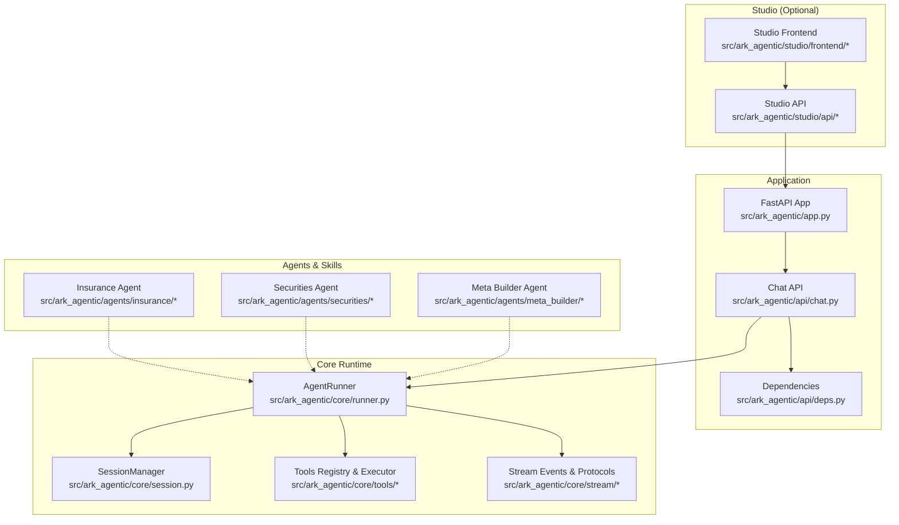
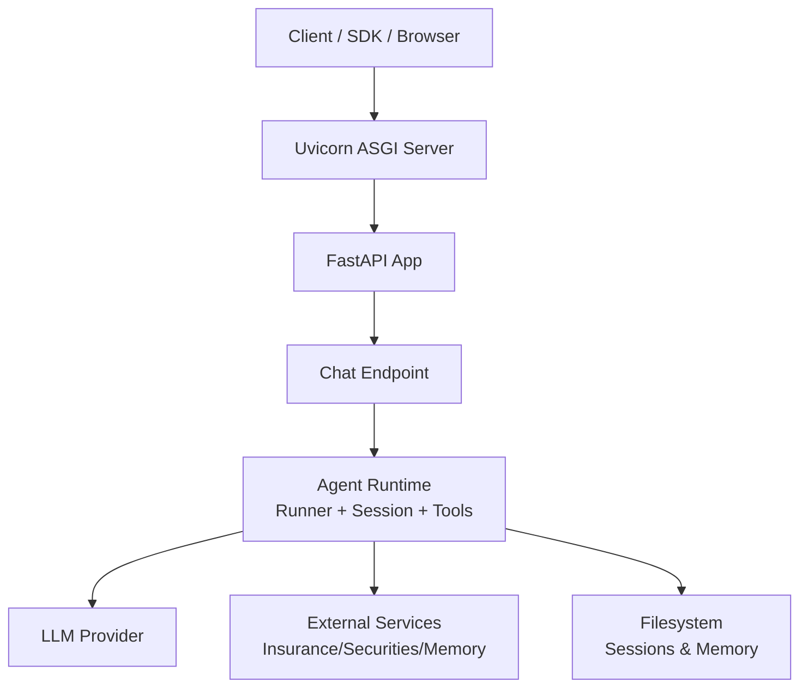
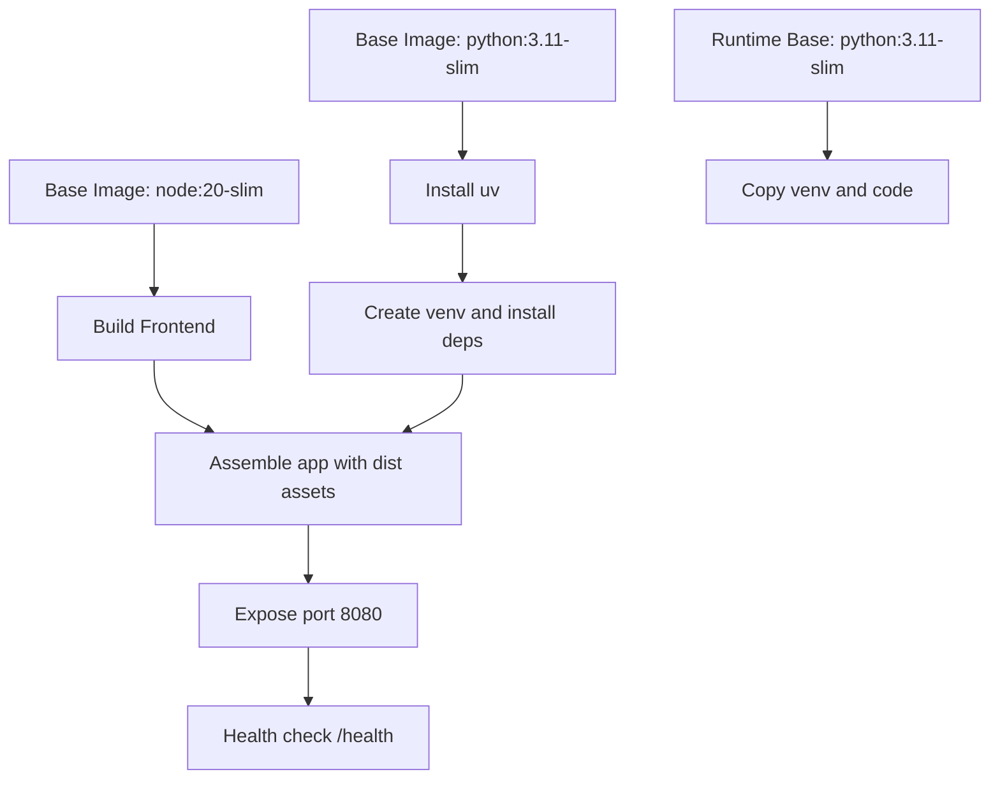
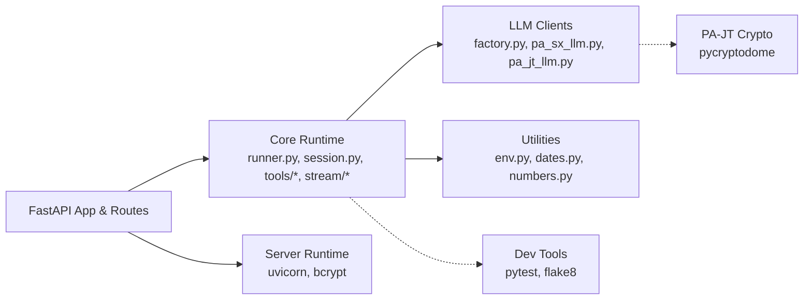

# Configuration and Deployment

<cite>
**Referenced Files in This Document**
- [.env-sample](file://.env-sample)
- [Dockerfile](file://Dockerfile)
- [pyproject.toml](file://pyproject.toml)
- [uv.lock](file://uv.lock)
- [README.md](file://README.md)
- [src/ark_agentic/core/utils/env.py](file://src/ark_agentic/core/utils/env.py)
</cite>

## Table of Contents
1. [Introduction](#introduction)
2. [Project Structure](#project-structure)
3. [Core Components](#core-components)
4. [Architecture Overview](#architecture-overview)
5. [Detailed Component Analysis](#detailed-component-analysis)
6. [Dependency Analysis](#dependency-analysis)
7. [Performance Considerations](#performance-considerations)
8. [Troubleshooting Guide](#troubleshooting-guide)
9. [Conclusion](#conclusion)
10. [Appendices](#appendices)

## Introduction
This document provides comprehensive guidance for configuration management and deployment of the ark-agentic project. It covers environment variable configuration, dependency management with uv, production deployment options, containerization with Docker, cloud-native deployment patterns, configuration examples across environments, security considerations for API keys and credentials, monitoring setup, and CI/CD integration patterns.

## Project Structure
The project is organized around a FastAPI application with optional Studio UI, a CLI, and modular agent/tool systems. Configuration is primarily driven by environment variables, with optional persistent storage for sessions and memory. The repository includes:
- Application entrypoint and API routes
- Core runtime for agents, tools, and streaming
- Optional Studio management console
- CLI for scaffolding and interactive runs
- Tests and documentation

**Diagram sources**
- [README.md:563-669](file://README.md#L563-L669)

**Section sources**
- [README.md:563-669](file://README.md#L563-L669)

## Core Components
- Environment variables define runtime behavior, LLM provider configuration, storage locations, and feature toggles.
- Dependency management uses uv with a lock file for reproducible builds.
- Containerization is supported via a multi-stage Dockerfile with a prebuilt frontend and optimized runtime.
- CLI supports initialization and scaffolding of new projects.

Key configuration surfaces:
- Environment variables: see [Environment variables:671-725](file://README.md#L671-L725) and [Full environment variables:1-69](file://.env-sample#L1-L69)
- Dependencies: [pyproject.toml:1-95](file://pyproject.toml#L1-L95) and [uv.lock:1-200](file://uv.lock#L1-L200)
- Containerization: [Dockerfile:1-75](file://Dockerfile#L1-L75)
- CLI: [README.md:164-186](file://README.md#L164-L186)

**Section sources**
- [README.md:671-725](file://README.md#L671-L725)
- [.env-sample:1-69](file://.env-sample#L1-L69)
- [pyproject.toml:1-95](file://pyproject.toml#L1-L95)
- [uv.lock:1-200](file://uv.lock#L1-L200)
- [Dockerfile:1-75](file://Dockerfile#L1-L75)
- [README.md:164-186](file://README.md#L164-L186)

## Architecture Overview
The system exposes a FastAPI HTTP API with streaming support. The runtime orchestrates agents, tools, and memory while supporting multiple output protocols. Persistence is file-based for sessions and memory.

**Diagram sources**
- [README.md:64-134](file://README.md#L64-L134)
- [Dockerfile:58-75](file://Dockerfile#L58-L75)

**Section sources**
- [README.md:64-134](file://README.md#L64-L134)
- [Dockerfile:58-75](file://Dockerfile#L58-L75)

## Detailed Component Analysis

### Environment Variable Configuration
Environment variables drive application behavior, including:
- Application host/port, logging level, Studio enablement, and agent root
- LLM provider selection, model name, API key, and base URL
- Default temperature and optional thinking tags
- Embedding model path
- Insurance and securities service endpoints and authentication
- Session and memory directories

Examples and defaults are documented in:
- [Environment variables:671-725](file://README.md#L671-L725)
- [Full environment variables:1-69](file://.env-sample#L1-L69)

Operational notes:
- Agents root resolution prefers explicit environment variable, then project discovery, then fallback path.
- Storage directories default to mounted volumes in containers.

**Section sources**
- [README.md:671-725](file://README.md#L671-L725)
- [.env-sample:1-69](file://.env-sample#L1-L69)
- [src/ark_agentic/core/utils/env.py:9-36](file://src/ark_agentic/core/utils/env.py#L9-L36)

### Dependency Management with uv
The project uses uv for fast dependency resolution and installation:
- pyproject.toml defines core and optional dependencies, extras, and scripts
- uv.lock pins exact versions for reproducibility
- Optional groups include dev, pa-jt, and server extras

Key aspects:
- Extras: [pyproject.toml:23-41](file://pyproject.toml#L23-L41)
- Lockfile: [uv.lock:1-200](file://uv.lock#L1-L200)
- CLI usage: [README.md:741-755](file://README.md#L741-L755)

Best practices:
- Use uv groups to isolate dev and optional features
- Keep uv.lock committed for deterministic deployments
- Prefer extras for optional integrations (e.g., PA-JT cryptography)

**Section sources**
- [pyproject.toml:1-95](file://pyproject.toml#L1-L95)
- [uv.lock:1-200](file://uv.lock#L1-L200)
- [README.md:741-755](file://README.md#L741-L755)

### Production Deployment Options
Options include:
- Direct container deployment via Docker
- Bare-metal deployment with uv and FastAPI
- Cloud-native deployment with Kubernetes

Containerization highlights:
- Multi-stage build: frontend build, Python builder with uv, runtime stage
- Prebuilt frontend assets included in the image
- Virtual environment isolation and runtime dependencies
- Persistent directories for sessions and memory
- Health checks via HTTP GET to /health

See:
- [Dockerfile:1-75](file://Dockerfile#L1-L75)
- [README.md:135-147](file://README.md#L135-L147)

**Section sources**
- [Dockerfile:1-75](file://Dockerfile#L1-L75)
- [README.md:135-147](file://README.md#L135-L147)

### Docker Containerization
The Dockerfile implements:
- Node.js stage to build the Studio frontend
- Python builder stage installing uv and dependencies into a virtual environment
- Runtime stage copying the virtual environment and built assets
- Environment variables set at image build time
- Exposed port and health check
- Persistent volume mount guidance for sessions and memory

**Diagram sources**
- [Dockerfile:1-75](file://Dockerfile#L1-L75)

**Section sources**
- [Dockerfile:1-75](file://Dockerfile#L1-L75)

### Kubernetes Deployment Patterns
Recommended patterns:
- Use a Deployment with a single replica for simplicity, or scale horizontally behind a LoadBalancer
- Mount persistent volumes for sessions and memory directories
- Configure environment variables via ConfigMap and secrets
- Define readiness/liveness probes using the health endpoint
- Use resource requests/limits appropriate for model sizes

Example Kubernetes resources outline:
- ConfigMap for environment variables (excluding secrets)
- Secret for API keys and sensitive credentials
- PersistentVolumeClaim for sessions and memory
- Deployment with PodSpec referencing the image and mounts
- Service exposing port 8080

Note: This section provides conceptual guidance. Adapt to your cluster’s storage and networking policies.

[No sources needed since this section doesn't analyze specific files]

### Cloud-Native Deployment Strategies
- Platform-agnostic: container images deployed to any orchestrator or cloud provider
- Sidecar patterns: separate memory/indexing sidecars if scaling beyond file-based memory
- Observability: integrate metrics and logs via sidecars or platform-native solutions
- Blue/green or canary rollouts using rollout strategies

[No sources needed since this section doesn't analyze specific files]

### Configuration Examples Across Environments
Development:
- Local uv run with .env-sample values
- Mock services enabled for insurance/securities
- Minimal dependencies via extras

Staging:
- Use staging-specific ConfigMap/Secrets
- Enable Studio optionally
- Point to staging LLM endpoints

Production:
- Immutable container images
- Secrets mounted as files or via platform secret managers
- Persistent volumes for sessions and memory
- Health checks and readiness gates

Reference:
- [Environment variables:671-725](file://README.md#L671-L725)
- [Full environment variables:1-69](file://.env-sample#L1-L69)

**Section sources**
- [README.md:671-725](file://README.md#L671-L725)
- [.env-sample:1-69](file://.env-sample#L1-L69)

### Security Considerations for API Keys and Credentials
- Store API keys and secrets in platform secrets or encrypted ConfigMaps
- Avoid committing secrets to source control
- Restrict filesystem permissions for mounted secrets
- Use distinct credentials per environment
- For PA-JT models, ensure cryptographic libraries are present only when needed

References:
- [pyproject.toml extras:35-40](file://pyproject.toml#L35-L40)
- [README.md testing note:39-39](file://README.md#L39-L39)

**Section sources**
- [pyproject.toml:35-40](file://pyproject.toml#L35-L40)
- [README.md:39-39](file://README.md#L39-L39)

### Monitoring Setup
- Health endpoint: use the /health path for liveness/readiness checks
- Logging: configure LOG_LEVEL via environment variables
- Metrics: instrument FastAPI endpoints and expose Prometheus metrics via a sidecar or platform exporter
- Tracing: propagate trace IDs via x-ark-* headers

References:
- [Dockerfile health check:69-72](file://Dockerfile#L69-L72)
- [Environment variables:671-725](file://README.md#L671-L725)
- [Headers for tracing:127-134](file://README.md#L127-L134)

**Section sources**
- [Dockerfile:69-72](file://Dockerfile#L69-L72)
- [README.md:671-725](file://README.md#L671-L725)
- [README.md:127-134](file://README.md#L127-L134)

### CI/CD Integration Patterns and Automated Deployments
Recommended pipeline stages:
- Install uv and build dependencies
- Run tests and linting
- Build Docker image
- Push image to registry
- Deploy to target environment (Kubernetes, VMs, or cloud platform)
- Post-deploy verification using health checks

References:
- [pyproject.toml dev group:29-35](file://pyproject.toml#L29-L35)
- [uv usage:741-755](file://README.md#L741-L755)
- [Docker build/run:135-147](file://README.md#L135-L147)

**Section sources**
- [pyproject.toml:29-35](file://pyproject.toml#L29-L35)
- [README.md:741-755](file://README.md#L741-L755)
- [README.md:135-147](file://README.md#L135-L147)

## Dependency Analysis
The dependency graph emphasizes core runtime and optional extras.

**Diagram sources**
- [pyproject.toml:1-95](file://pyproject.toml#L1-L95)
- [uv.lock:1-200](file://uv.lock#L1-L200)

**Section sources**
- [pyproject.toml:1-95](file://pyproject.toml#L1-L95)
- [uv.lock:1-200](file://uv.lock#L1-L200)

## Performance Considerations
- Parallel tool execution reduces latency for multi-tool workflows
- Streaming AG-UI events minimize client wait times
- Session compression keeps context windows manageable
- File-based memory avoids database overhead for small to medium workloads

[No sources needed since this section provides general guidance]

## Troubleshooting Guide
Common operational issues and remedies:
- Missing API keys or incorrect LLM provider configuration cause runtime failures; verify environment variables
- Health check failures indicate unready pods; confirm port exposure and startup order
- Persistent volume issues (WAL mode) require named volumes instead of bind mounts for memory data
- Memory growth: enable session compression and monitor disk usage

References:
- [Dockerfile health check:69-72](file://Dockerfile#L69-L72)
- [Environment variables:671-725](file://README.md#L671-L725)
- [README.md memory note:484-520](file://README.md#L484-L520)

**Section sources**
- [Dockerfile:69-72](file://Dockerfile#L69-L72)
- [README.md:671-725](file://README.md#L671-L725)
- [README.md:484-520](file://README.md#L484-L520)

## Conclusion
The project provides a robust foundation for agent-driven applications with clear configuration surfaces, reproducible dependency management via uv, and production-ready containerization. By leveraging environment variables, secure secret management, and standardized deployment patterns, teams can operate reliably across development, staging, and production environments.

[No sources needed since this section summarizes without analyzing specific files]

## Appendices

### Appendix A: Environment Variables Reference
- Application: LOG_LEVEL, API_HOST, API_PORT, ENABLE_STUDIO, AGENTS_ROOT
- LLM: LLM_PROVIDER, MODEL_NAME, API_KEY, LLM_BASE_URL, DEFAULT_TEMPERATURE, ENABLE_THINKING_TAGS
- Embeddings: EMBEDDING_MODEL_PATH
- Insurance services: DATA_SERVICE_MOCK, DATA_SERVICE_URL, DATA_SERVICE_AUTH_URL, DATA_SERVICE_APP_ID, DATA_SERVICE_CLIENT_ID, DATA_SERVICE_CLIENT_SECRET
- Securities services: SECURITIES_SERVICE_MOCK, SECURITIES_ACCOUNT_TYPE, SECURITIES_*_URL
- Persistence: SESSIONS_DIR, MEMORY_DIR

**Section sources**
- [README.md:671-725](file://README.md#L671-L725)
- [.env-sample:1-69](file://.env-sample#L1-L69)

### Appendix B: Docker Build and Run Commands
- Build: docker build -t ark-agentic .
- Run with volumes and environment variables
- Health check endpoint: /health

**Section sources**
- [README.md:135-147](file://README.md#L135-L147)
- [Dockerfile:69-72](file://Dockerfile#L69-L72)