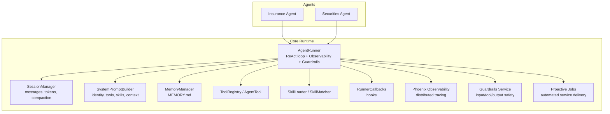
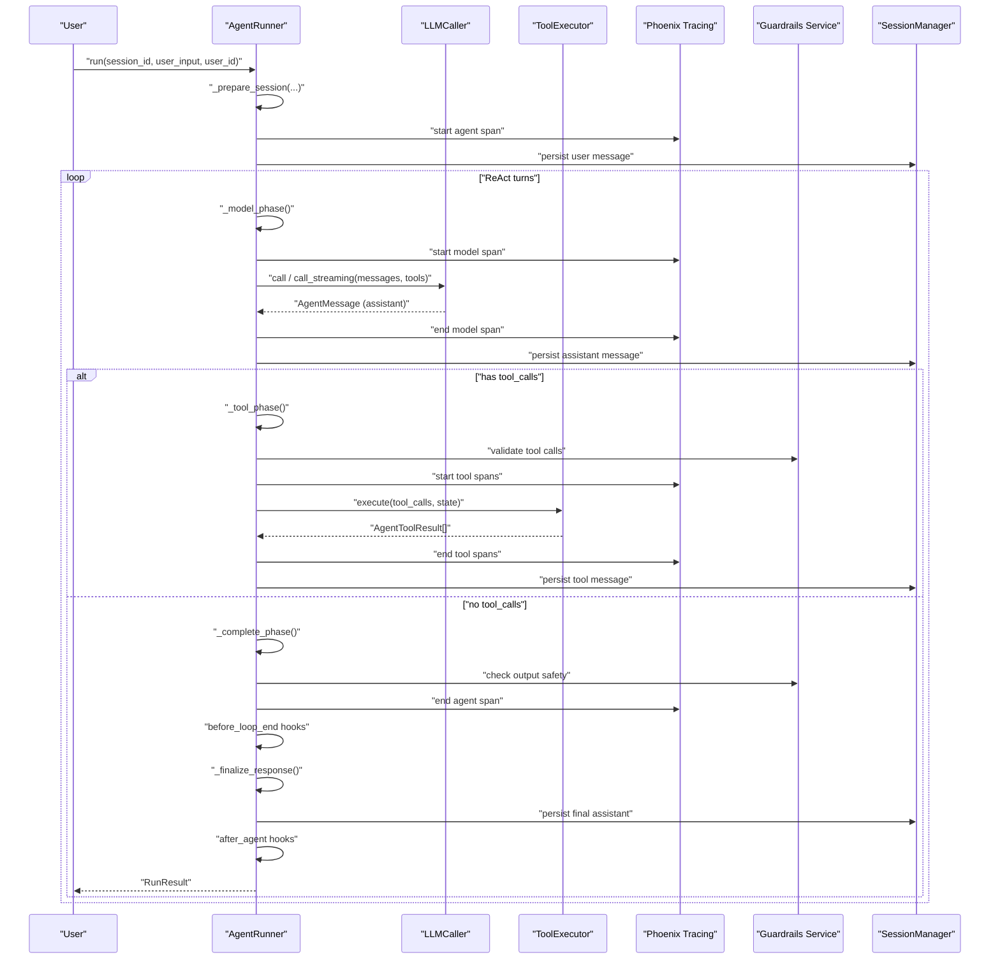
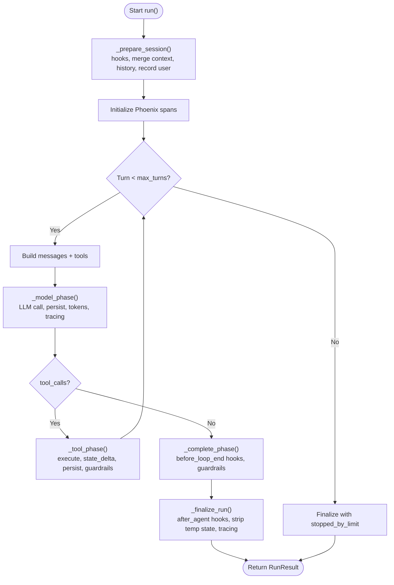
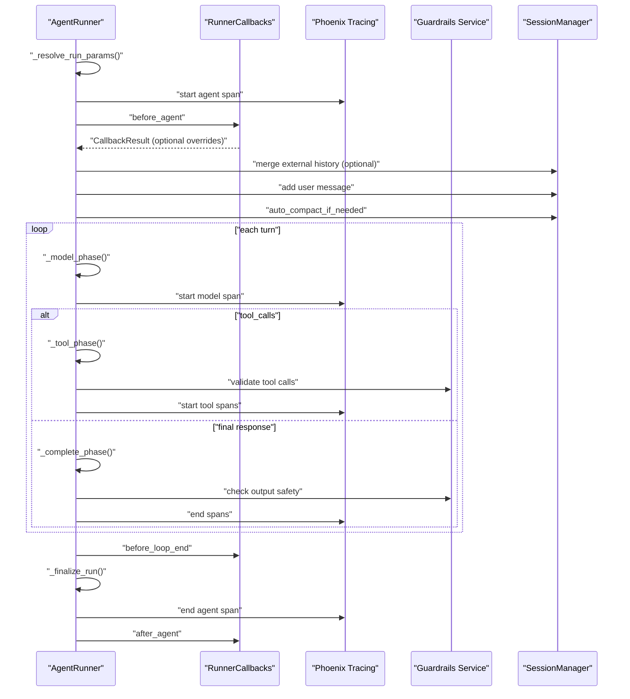
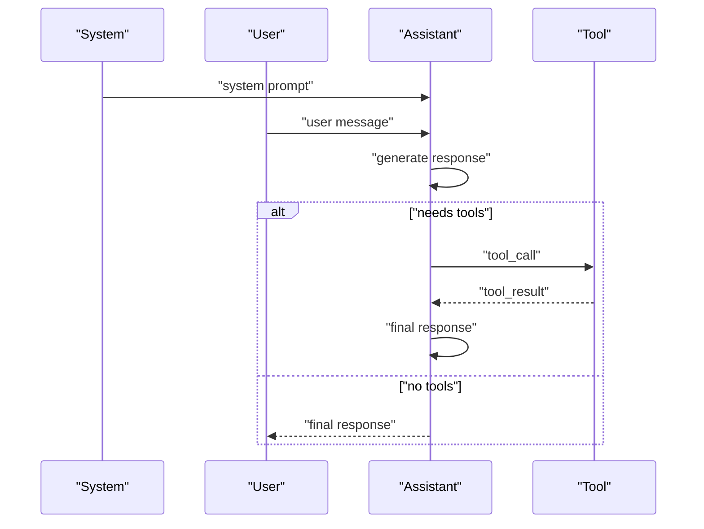
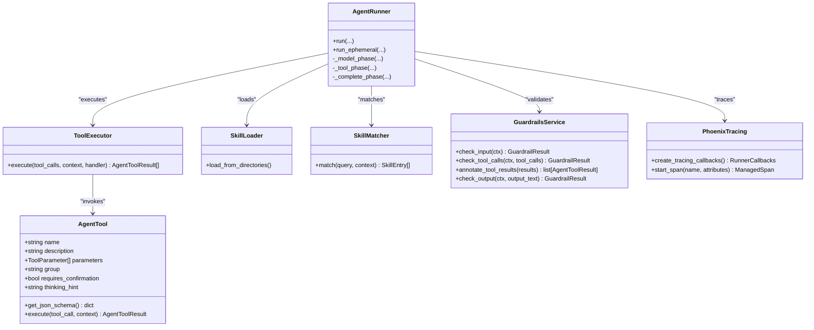
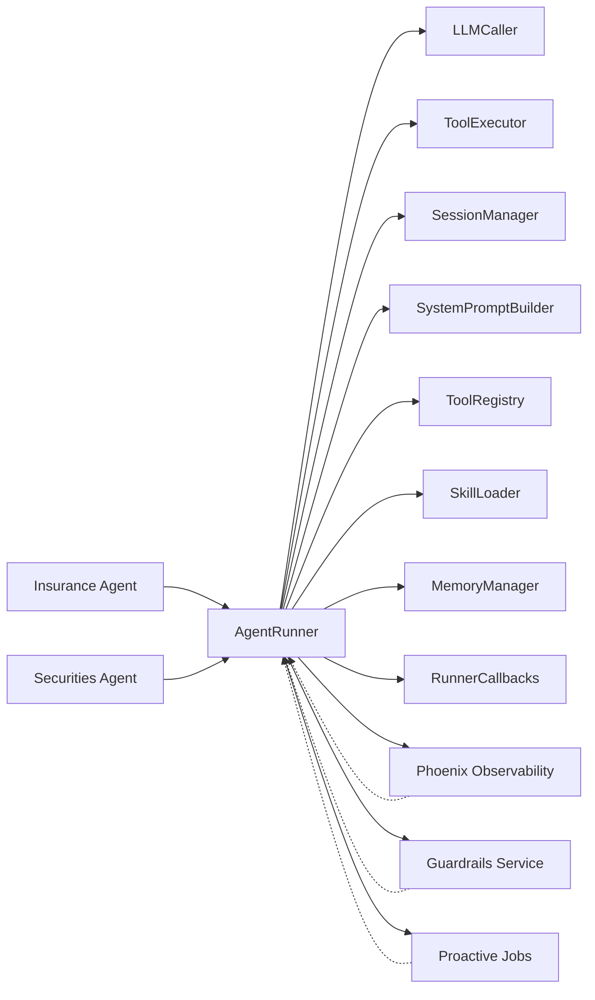

# Agent Architecture

<cite>
**Referenced Files in This Document**
- [runner.py](file://src/ark_agentic/core/runner.py)
- [types.py](file://src/ark_agentic/core/types.py)
- [callbacks.py](file://src/ark_agentic/core/callbacks.py)
- [session.py](file://src/ark_agentic/core/session.py)
- [prompt/builder.py](file://src/ark_agentic/core/prompt/builder.py)
- [memory/manager.py](file://src/ark_agentic/core/memory/manager.py)
- [tools/base.py](file://src/ark_agentic/core/tools/base.py)
- [skills/base.py](file://src/ark_agentic/core/skills/base.py)
- [agents/insurance/agent.py](file://src/ark_agentic/agents/insurance/agent.py)
- [agents/securities/agent.py](file://src/ark_agentic/agents/securities/agent.py)
- [agents/insurance/tools/__init__.py](file://src/ark_agentic/agents/insurance/tools/__init__.py)
- [agents/securities/tools/__init__.py](file://src/ark_agentic/agents/securities/tools/__init__.py)
- [agents/insurance/skills/execute_withdrawal/SKILL.md](file://src/ark_agentic/agents/insurance/skills/execute_withdrawal/SKILL.md)
- [agents/securities/skills/asset_overview/SKILL.md](file://src/ark_agentic/agents/securities/skills/asset_overview/SKILL.md)
- [observability/phoenix.py](file://src/ark_agentic/core/observability/phoenix.py)
- [guardrails/service.py](file://src/ark_agentic/core/guardrails/service.py)
- [jobs/proactive_service.py](file://src/ark_agentic/core/jobs/proactive_service.py)
</cite>

## Update Summary
**Changes Made**
- Enhanced AgentRunner with Phoenix observability integration for distributed tracing
- Integrated runtime guardrails service with input interception, tool validation, and output safety checks
- Added proactive job management capabilities for automated service delivery
- Updated lifecycle hooks to include observability and safety monitoring

## Table of Contents
1. [Introduction](#introduction)
2. [Project Structure](#project-structure)
3. [Core Components](#core-components)
4. [Architecture Overview](#architecture-overview)
5. [Detailed Component Analysis](#detailed-component-analysis)
6. [Enhanced Observability with Phoenix](#enhanced-observability-with-phoenix)
7. [Runtime Guardrails Integration](#runtime-guardrails-integration)
8. [Proactive Job Management](#proactive-job-management)
9. [Dependency Analysis](#dependency-analysis)
10. [Performance Considerations](#performance-considerations)
11. [Troubleshooting Guide](#troubleshooting-guide)
12. [Conclusion](#conclusion)
13. [Appendices](#appendices)

## Introduction
This document explains the agent architecture in ark-agentic with a focus on the ReAct execution loop, the AgentRunner lifecycle, and how agents orchestrate tools and skills. The architecture now includes enhanced observability through Phoenix integration, runtime guardrails for safety and compliance, and proactive job management for automated service delivery. It documents the message flow across system, user, assistant, and tool roles, and covers the execution cycle including planning, tool selection, execution, and result processing. Practical examples illustrate how agents handle complex workflows, manage state, and coordinate multiple operations. Finally, it highlights the separation of concerns between agent types (insurance and securities) while pointing out shared architectural patterns.

## Project Structure
The agent runtime centers around a reusable core that composes:
- AgentRunner: orchestrates ReAct loops, integrates LLM calls, tool execution, session/memory persistence, and observability
- SessionManager: manages message history, token accounting, and automatic context compaction
- PromptBuilder: constructs system prompts from identity, runtime info, tools, skills, and custom instructions
- MemoryManager: lightweight persistent memory backed by a single markdown file per user
- ToolRegistry and AgentTool: standardized tool abstraction and JSON schema generation
- SkillLoader and SkillMatcher: dynamic or full-mode skill injection into prompts
- Callbacks: lifecycle hooks for pre/post model/tool/loop actions
- **New**: Phoenix observability: distributed tracing and metrics collection
- **New**: Runtime guardrails: input interception, tool validation, and output safety
- **New**: Proactive job management: automated service delivery and notification systems

Agent-specific packages under agents/ implement domain logic:
- Insurance agent: policy queries, rule engine, customer info, A2UI rendering, and withdrawal submission
- Securities agent: account overview, holdings, profits, and A2UI presets

**Diagram sources**
- [runner.py:153-230](file://src/ark_agentic/core/runner.py#L153-L230)
- [session.py:24-37](file://src/ark_agentic/core/session.py#L24-L37)
- [prompt/builder.py:55-74](file://src/ark_agentic/core/prompt/builder.py#L55-L74)
- [memory/manager.py:24-36](file://src/ark_agentic/core/memory/manager.py#L24-L36)
- [tools/base.py:46-75](file://src/ark_agentic/core/tools/base.py#L46-L75)
- [skills/base.py:19-50](file://src/ark_agentic/core/skills/base.py#L19-L50)
- [callbacks.py:147-157](file://src/ark_agentic/core/callbacks.py#L147-L157)
- [observability/phoenix.py:299-521](file://src/ark_agentic/core/observability/phoenix.py#L299-L521)
- [guardrails/service.py:316-393](file://src/ark_agentic/core/guardrails/service.py#L316-L393)
- [jobs/proactive_service.py:49-221](file://src/ark_agentic/core/jobs/proactive_service.py#L49-L221)
- [agents/insurance/agent.py:45-122](file://src/ark_agentic/agents/insurance/agent.py#L45-L122)
- [agents/securities/agent.py:38-128](file://src/ark_agentic/agents/securities/agent.py#L38-L128)

**Section sources**
- [runner.py:153-230](file://src/ark_agentic/core/runner.py#L153-L230)
- [session.py:24-37](file://src/ark_agentic/core/session.py#L24-L37)
- [prompt/builder.py:55-74](file://src/ark_agentic/core/prompt/builder.py#L55-L74)
- [memory/manager.py:24-36](file://src/ark_agentic/core/memory/manager.py#L24-L36)
- [tools/base.py:46-75](file://src/ark_agentic/core/tools/base.py#L46-L75)
- [skills/base.py:19-50](file://src/ark_agentic/core/skills/base.py#L19-L50)
- [callbacks.py:147-157](file://src/ark_agentic/core/callbacks.py#L147-L157)
- [observability/phoenix.py:299-521](file://src/ark_agentic/core/observability/phoenix.py#L299-L521)
- [guardrails/service.py:316-393](file://src/ark_agentic/core/guardrails/service.py#L316-L393)
- [jobs/proactive_service.py:49-221](file://src/ark_agentic/core/jobs/proactive_service.py#L49-L221)
- [agents/insurance/agent.py:45-122](file://src/ark_agentic/agents/insurance/agent.py#L45-L122)
- [agents/securities/agent.py:38-128](file://src/ark_agentic/agents/securities/agent.py#L38-L128)

## Core Components
- AgentRunner: encapsulates the ReAct loop, lifecycle hooks, tool execution, session persistence, and **enhanced with observability and safety monitoring**. It builds messages and tools per turn, invokes the LLM, executes tool calls, and finalizes responses with comprehensive tracing and guardrails integration.
- SessionManager: maintains per-session messages, token usage, compaction stats, and supports auto-compaction and persistence.
- SystemPromptBuilder: composes system prompts from identity, runtime info, tools, skills, context, and custom instructions.
- MemoryManager: provides lightweight memory read/write for users via a markdown workspace.
- ToolRegistry and AgentTool: register tools and expose JSON schema for function calling; tools return structured AgentToolResult.
- SkillLoader and SkillMatcher: load skills from directories and render them into prompts (full or metadata-only modes).
- RunnerCallbacks: lifecycle hooks covering agent-level and per-turn phases.
- **New**: Phoenix observability: distributed tracing with OpenTelemetry integration, span management, and performance metrics collection.
- **New**: Runtime guardrails: comprehensive safety framework with input interception, tool validation, and output safety checks.
- **New**: Proactive job management: automated service delivery system with scheduled notifications and user engagement.

**Section sources**
- [runner.py:153-230](file://src/ark_agentic/core/runner.py#L153-L230)
- [session.py:24-37](file://src/ark_agentic/core/session.py#L24-L37)
- [prompt/builder.py:55-74](file://src/ark_agentic/core/prompt/builder.py#L55-L74)
- [memory/manager.py:24-36](file://src/ark_agentic/core/memory/manager.py#L24-L36)
- [tools/base.py:46-75](file://src/ark_agentic/core/tools/base.py#L46-L75)
- [skills/base.py:19-50](file://src/ark_agentic/core/skills/base.py#L19-L50)
- [callbacks.py:147-157](file://src/ark_agentic/core/callbacks.py#L147-L157)
- [observability/phoenix.py:299-521](file://src/ark_agentic/core/observability/phoenix.py#L299-L521)
- [guardrails/service.py:316-393](file://src/ark_agentic/core/guardrails/service.py#L316-L393)
- [jobs/proactive_service.py:49-221](file://src/ark_agentic/core/jobs/proactive_service.py#L49-L221)

## Architecture Overview
The ReAct loop in AgentRunner proceeds as follows with enhanced observability and safety:
- Prepare: run before_agent hooks, merge input context, optionally merge external history, record user message, auto-compaction, **and initialize observability spans**
- Model: build messages and tools, call LLM (streaming or non-streaming), persist response, update token usage, **with detailed tracing**
- Tool: execute tool calls, merge state deltas, persist tool results, support STOP semantics, **with safety validation**
- Complete: run before_loop_end hooks, finalize response, and run after_agent hooks, **with output safety checks**

**Diagram sources**
- [runner.py:240-287](file://src/ark_agentic/core/runner.py#L240-L287)
- [runner.py:517-594](file://src/ark_agentic/core/runner.py#L517-L594)
- [runner.py:624-734](file://src/ark_agentic/core/runner.py#L624-L734)
- [runner.py:736-807](file://src/ark_agentic/core/runner.py#L736-L807)
- [runner.py:598-622](file://src/ark_agentic/core/runner.py#L598-L622)
- [session.py:25-37](file://src/ark_agentic/core/session.py#L25-L37)
- [observability/phoenix.py:299-521](file://src/ark_agentic/core/observability/phoenix.py#L299-L521)
- [guardrails/service.py:316-393](file://src/ark_agentic/core/guardrails/service.py#L316-L393)

## Detailed Component Analysis

### ReAct Execution Loop Pattern
AgentRunner implements a strict ReAct loop with clear separation of concerns and **enhanced observability**:
- Model phase: builds messages and tools, calls LLM, persists response, updates token usage, **with detailed tracing and metrics**
- Tool phase: executes tool calls, merges state deltas, persists tool results, honors STOP, **with safety validation and tracing**
- Complete phase: runs before_loop_end hooks, finalizes response, and after_agent hooks, **with output safety checks**

Key behaviors:
- Streaming vs non-streaming LLM calls
- Automatic context compaction before loop starts
- Hooks for overriding model/tool outputs and injecting feedback
- Loop limits (max turns, max tool calls per turn) and graceful stopping
- **Enhanced**: Distributed tracing with Phoenix/OpenTelemetry integration
- **Enhanced**: Runtime guardrails for safety and compliance

**Diagram sources**
- [runner.py:240-287](file://src/ark_agentic/core/runner.py#L240-L287)
- [runner.py:517-594](file://src/ark_agentic/core/runner.py#L517-L594)
- [runner.py:624-734](file://src/ark_agentic/core/runner.py#L624-L734)
- [runner.py:736-807](file://src/ark_agentic/core/runner.py#L736-L807)
- [runner.py:598-622](file://src/ark_agentic/core/runner.py#L598-L622)
- [observability/phoenix.py:299-521](file://src/ark_agentic/core/observability/phoenix.py#L299-L521)
- [guardrails/service.py:316-393](file://src/ark_agentic/core/guardrails/service.py#L316-L393)

**Section sources**
- [runner.py:517-594](file://src/ark_agentic/core/runner.py#L517-L594)
- [runner.py:624-734](file://src/ark_agentic/core/runner.py#L624-L734)
- [runner.py:736-807](file://src/ark_agentic/core/runner.py#L736-L807)
- [runner.py:598-622](file://src/ark_agentic/core/runner.py#L598-L622)

### AgentRunner Lifecycle
Lifecycle phases with **observability and safety integration**:
- Resolve run params: model override, temperature override, skill load mode
- Prepare session: before_agent hooks, merge input context, optional external history, record user message, auto-compaction, **initialize observability spans**
- Execute loop: model/tool/complete phases per turn with **distributed tracing and safety validation**
- Finalize run: before_loop_end, finalize response, after_agent hooks, strip temp state, sync session state, **end observability spans**

**Diagram sources**
- [runner.py:240-287](file://src/ark_agentic/core/runner.py#L240-L287)
- [runner.py:308-316](file://src/ark_agentic/core/runner.py#L308-L316)
- [runner.py:317-386](file://src/ark_agentic/core/runner.py#L317-L386)
- [runner.py:388-411](file://src/ark_agentic/core/runner.py#L388-L411)
- [runner.py:598-622](file://src/ark_agentic/core/runner.py#L598-L622)
- [observability/phoenix.py:299-521](file://src/ark_agentic/core/observability/phoenix.py#L299-L521)
- [guardrails/service.py:316-393](file://src/ark_agentic/core/guardrails/service.py#L316-L393)

**Section sources**
- [runner.py:240-287](file://src/ark_agentic/core/runner.py#L240-L287)
- [runner.py:308-316](file://src/ark_agentic/core/runner.py#L308-L316)
- [runner.py:317-386](file://src/ark_agentic/core/runner.py#L317-L386)
- [runner.py:388-411](file://src/ark_agentic/core/runner.py#L388-L411)
- [runner.py:598-622](file://src/ark_agentic/core/runner.py#L598-L622)

### Message Flow Across Roles
The system composes a sequence of messages with distinct roles:
- System: identity, runtime info, tools, skills, context, custom instructions
- User: user input (with optional metadata)
- Assistant: LLM response, optionally with tool_calls
- Tool: results of tool executions

**Diagram sources**
- [types.py:18-25](file://src/ark_agentic/core/types.py#L18-L25)
- [types.py:190-229](file://src/ark_agentic/core/types.py#L190-L229)
- [prompt/builder.py:204-218](file://src/ark_agentic/core/prompt/builder.py#L204-L218)

**Section sources**
- [types.py:18-25](file://src/ark_agentic/core/types.py#L18-L25)
- [types.py:190-229](file://src/ark_agentic/core/types.py#L190-L229)
- [prompt/builder.py:204-218](file://src/ark_agentic/core/prompt/builder.py#L204-L218)

### Tools and Skills Orchestration
- Tools: standardized via AgentTool with JSON schema, executed by ToolExecutor, returning AgentToolResult with loop_action and optional events
- Skills: loaded by SkillLoader, rendered into prompts either fully (full) or as metadata with read_skill (dynamic); eligibility checks and invocation policies apply
- AgentRunner registers memory tools and subtask tools when enabled, and equips SkillMatcher for dynamic skill selection
- **Enhanced**: Safety validation through guardrails service during tool execution
- **Enhanced**: Observability through distributed tracing for all tool operations

**Diagram sources**
- [tools/base.py:46-114](file://src/ark_agentic/core/tools/base.py#L46-L114)
- [runner.py:153-230](file://src/ark_agentic/core/runner.py#L153-L230)
- [runner.py:736-807](file://src/ark_agentic/core/runner.py#L736-L807)
- [skills/base.py:19-50](file://src/ark_agentic/core/skills/base.py#L19-L50)
- [skills/base.py:285-303](file://src/ark_agentic/core/skills/base.py#L285-L303)
- [guardrails/service.py:119-297](file://src/ark_agentic/core/guardrails/service.py#L119-L297)
- [observability/phoenix.py:299-521](file://src/ark_agentic/core/observability/phoenix.py#L299-L521)

**Section sources**
- [tools/base.py:46-114](file://src/ark_agentic/core/tools/base.py#L46-L114)
- [runner.py:736-807](file://src/ark_agentic/core/runner.py#L736-L807)
- [skills/base.py:285-303](file://src/ark_agentic/core/skills/base.py#L285-L303)
- [guardrails/service.py:119-297](file://src/ark_agentic/core/guardrails/service.py#L119-L297)
- [observability/phoenix.py:299-521](file://src/ark_agentic/core/observability/phoenix.py#L299-L521)

### Practical Examples: Complex Workflows and State Management
- Insurance withdrawal execution: a skill-driven flow that validates prior A2UI rendering, counts channels, and submits operations with explicit STOP semantics and state propagation
- Securities asset overview: routes user intent to appropriate tools, fetches data, renders cards conditionally, and enforces mode-specific outputs
- **Enhanced**: Both workflows now include comprehensive observability tracing and runtime safety validation

These examples demonstrate:
- Multi-step tool orchestration with explicit ordering and gating
- State management via session.state and temporary keys
- Event-driven UI components via A2UI results and tool events
- Dynamic skill loading and matching for domain-specific protocols
- **Enhanced**: Distributed tracing for debugging and performance monitoring
- **Enhanced**: Runtime safety validation preventing unauthorized operations

**Section sources**
- [agents/insurance/skills/execute_withdrawal/SKILL.md:42-83](file://src/ark_agentic/agents/insurance/skills/execute_withdrawal/SKILL.md#L42-L83)
- [agents/securities/skills/asset_overview/SKILL.md:96-144](file://src/ark_agentic/agents/securities/skills/asset_overview/SKILL.md#L96-L144)
- [types.py:85-99](file://src/ark_agentic/core/types.py#L85-L99)
- [session.py:445-453](file://src/ark_agentic/core/session.py#L445-L453)
- [observability/phoenix.py:299-521](file://src/ark_agentic/core/observability/phoenix.py#L299-L521)
- [guardrails/service.py:316-393](file://src/ark_agentic/core/guardrails/service.py#L316-L393)

### Separation of Concerns Between Agent Types
- Insurance agent:
  - Focus: policy queries, rule engine, customer info, A2UI rendering, and withdrawal submission
  - Configuration: protocol, memory, and subtasks; guards and enrichment hooks
  - **Enhanced**: Integrated with Phoenix observability and runtime guardrails
- Securities agent:
  - Focus: account overview, holdings, profits, and A2UI presets
  - Configuration: validation hooks, entity trie, and context enrichment
  - **Enhanced**: Comprehensive safety validation and proactive job management

Both agents share:
- AgentRunner lifecycle and ReAct loop with observability and safety
- SessionManager for persistence and compaction
- PromptBuilder for system prompts
- ToolRegistry and AgentTool abstractions
- SkillLoader/SkillMatcher for skill orchestration
- Callbacks for lifecycle hooks
- **Enhanced**: Phoenix observability integration for distributed tracing
- **Enhanced**: Runtime guardrails service for safety and compliance

**Section sources**
- [agents/insurance/agent.py:45-122](file://src/ark_agentic/agents/insurance/agent.py#L45-L122)
- [agents/securities/agent.py:38-128](file://src/ark_agentic/agents/securities/agent.py#L38-L128)
- [agents/insurance/tools/__init__.py:86-110](file://src/ark_agentic/agents/insurance/tools/__init__.py#L86-L110)
- [agents/securities/tools/__init__.py:48-66](file://src/ark_agentic/agents/securities/tools/__init__.py#L48-L66)
- [observability/phoenix.py:299-521](file://src/ark_agentic/core/observability/phoenix.py#L299-L521)
- [guardrails/service.py:316-393](file://src/ark_agentic/core/guardrails/service.py#L316-L393)

## Enhanced Observability with Phoenix

### Phoenix Integration Overview
The AgentRunner now includes comprehensive observability through Phoenix/OpenTelemetry integration, providing distributed tracing and performance monitoring across the entire execution lifecycle.

### Key Features
- **Automatic Span Creation**: Each lifecycle phase creates dedicated spans with appropriate attributes
- **Cross-Component Tracing**: End-to-end visibility from user input to final response
- **Performance Metrics**: Detailed timing, token usage, and error tracking
- **Structured Metadata**: Rich context information for debugging and analysis

### Span Categories
- **Agent Spans**: Full run lifecycle tracking with session and user context
- **Model Spans**: LLM call tracing with message and tool schema details
- **Tool Spans**: Individual tool execution with parameters and results
- **Chain Spans**: Tool execution sequences and processing phases

### Implementation Details
The observability integration is controlled by environment variables:
- `ENABLE_PHOENIX`: Explicitly enables Phoenix tracing callbacks
- `PHOENIX_COLLECTOR_ENDPOINT`: OpenTelemetry collector endpoint
- `PHOENIX_PROJECT_NAME`: Project identifier for telemetry
- `PHOENIX_AUTO_INSTRUMENT`: Automatic instrumentation toggle
- `PHOENIX_BATCH`: Batch export configuration

**Section sources**
- [observability/phoenix.py:299-521](file://src/ark_agentic/core/observability/phoenix.py#L299-L521)
- [observability/phoenix.py:85-126](file://src/ark_agentic/core/observability/phoenix.py#L85-L126)
- [observability/phoenix.py:80-82](file://src/ark_agentic/core/observability/phoenix.py#L80-L82)
- [runner.py:73-86](file://src/ark_agentic/core/runner.py#L73-L86)

## Runtime Guardrails Integration

### Guardrails Service Overview
The runtime guardrails system provides comprehensive safety and compliance validation throughout the agent execution lifecycle, operating as an integrated layer within the AgentRunner callbacks.

### Safety Domains
- **Input Interception**: Prevents prompt injection attempts and sensitive information requests
- **Tool Validation**: Enforces authorization policies and prerequisite conditions
- **Output Safety**: Detects and prevents leakage of protected information
- **Channel Management**: Controls what content is visible to LLM vs UI

### Guardrails Phases
1. **Input Phase**: Validates user requests before model processing
2. **Tool Phase**: Checks tool authorization and prerequisites
3. **Execution Phase**: Redacts sensitive content from tool results
4. **Output Phase**: Reviews final responses for safety compliance

### Security Rules
- **Prompt Override Prevention**: Blocks attempts to modify system prompts
- **Protected Information Protection**: Prevents disclosure of system prompts and internal information
- **Secret Extraction Prevention**: Blocks requests for API keys and credentials
- **Tool Authorization**: Enforces domain-specific tool access policies

### Integration Points
The guardrails service integrates seamlessly with the AgentRunner callback system, providing:
- Non-intrusive safety validation
- Automatic context updates for safe operation modes
- Graceful degradation to read-only modes for security discussions
- Comprehensive logging and reporting

**Section sources**
- [guardrails/service.py:119-297](file://src/ark_agentic/core/guardrails/service.py#L119-L297)
- [guardrails/service.py:316-393](file://src/ark_agentic/core/guardrails/service.py#L316-L393)
- [guardrails/__init__.py:10-16](file://src/ark_agentic/core/guardrails/__init__.py#L10-L16)

## Proactive Job Management

### Proactive Service Architecture
The proactive job management system enables automated service delivery and user engagement through scheduled tasks that monitor user interests and provide timely notifications.

### Core Components
- **ProactiveServiceJob**: Abstract base class defining the common execution flow
- **Job Registration**: Automatic integration with the JobManager for scheduling
- **Intent Processing**: LLM-powered intent extraction and data gathering
- **Notification Generation**: Automated notification creation and delivery
- **User Filtering**: Intelligent user targeting based on interests and preferences

### Execution Flow
1. **User Selection**: Filter users based on interest keywords and engagement patterns
2. **Intent Extraction**: Use LLM to identify user-specific financial interests
3. **Data Retrieval**: Execute domain-specific tools to gather relevant information
4. **Notification Creation**: Generate personalized notifications using LLM
5. **Delivery**: Store notifications for user consumption

### Configuration Options
- **Cron Scheduling**: Flexible scheduling with customizable intervals
- **Batch Processing**: Efficient handling of multiple users simultaneously
- **Timeout Management**: Configurable processing timeouts per user
- **Concurrent Limits**: Controlled parallel execution for resource management

### Agent-Specific Implementations
- **Insurance Proactive Job**: Monitors policy-related interests and provides relevant updates
- **Securities Proactive Job**: Tracks stock and fund price movements for interested users

**Section sources**
- [jobs/proactive_service.py:49-221](file://src/ark_agentic/core/jobs/proactive_service.py#L49-L221)
- [agents/insurance/agent.py:117-128](file://src/ark_agentic/agents/insurance/agent.py#L117-L128)
- [agents/securities/agent.py:135-147](file://src/ark_agentic/agents/securities/agent.py#L135-L147)

## Dependency Analysis
The core runtime composes orthogonal subsystems with minimal coupling and **enhanced integration points**:
- AgentRunner depends on LLMCaller, ToolExecutor, SessionManager, PromptBuilder, ToolRegistry, SkillLoader, MemoryManager, RunnerCallbacks, **Phoenix observability**, and **Guardrails service**
- Agent packages depend on the core runtime and register tools/skills with **observability and safety integration**
- Proactive job management integrates with the JobManager for automated scheduling
- No circular dependencies observed among major components

**Diagram sources**
- [agents/insurance/agent.py:45-122](file://src/ark_agentic/agents/insurance/agent.py#L45-L122)
- [agents/securities/agent.py:38-128](file://src/ark_agentic/agents/securities/agent.py#L38-L128)
- [runner.py:153-230](file://src/ark_agentic/core/runner.py#L153-L230)
- [observability/phoenix.py:299-521](file://src/ark_agentic/core/observability/phoenix.py#L299-L521)
- [guardrails/service.py:316-393](file://src/ark_agentic/core/guardrails/service.py#L316-L393)
- [jobs/proactive_service.py:49-221](file://src/ark_agentic/core/jobs/proactive_service.py#L49-L221)

**Section sources**
- [agents/insurance/agent.py:45-122](file://src/ark_agentic/agents/insurance/agent.py#L45-L122)
- [agents/securities/agent.py:38-128](file://src/ark_agentic/agents/securities/agent.py#L38-L128)
- [runner.py:153-230](file://src/ark_agentic/core/runner.py#L153-L230)
- [observability/phoenix.py:299-521](file://src/ark_agentic/core/observability/phoenix.py#L299-L521)
- [guardrails/service.py:316-393](file://src/ark_agentic/core/guardrails/service.py#L316-L393)
- [jobs/proactive_service.py:49-221](file://src/ark_agentic/core/jobs/proactive_service.py#L49-L221)

## Performance Considerations
- Context compaction: automatic compression reduces token usage and improves throughput
- Streaming: enables incremental content delivery and early termination
- Loop limits: max turns and tool calls per turn prevent runaway execution
- Memory tools: optional memory write/read integrated via tool registry
- Skill budgeting: caps on number and size of skills injected into prompts
- **Enhanced**: Observability overhead is configurable and only active when enabled
- **Enhanced**: Guardrails validation adds minimal latency with cached rule evaluation
- **Enhanced**: Proactive job processing uses efficient batching and concurrent execution

## Troubleshooting Guide
Common issues and remedies:
- LLM errors: mapped to user-friendly messages with reason classification; may retry depending on error type
- Context overflow: triggers compaction and optional user guidance
- Tool timeouts: bounded by configured timeout per tool call
- Hook overrides: before_model and before_tool can override outputs; before_loop_end can request retries
- **Enhanced**: Phoenix tracing: configure environment variables for observability; check collector connectivity
- **Enhanced**: Guardrails failures: review safety policies and adjust for legitimate use cases
- **Enhanced**: Proactive job errors: check scheduling configuration and tool availability

**Section sources**
- [runner.py:457-476](file://src/ark_agentic/core/runner.py#L457-L476)
- [runner.py:677-694](file://src/ark_agentic/core/runner.py#L677-L694)
- [runner.py:730-733](file://src/ark_agentic/core/runner.py#L730-L733)
- [callbacks.py:35-41](file://src/ark_agentic/core/callbacks.py#L35-L41)
- [observability/phoenix.py:85-126](file://src/ark_agentic/core/observability/phoenix.py#L85-L126)
- [guardrails/service.py:167-201](file://src/ark_agentic/core/guardrails/service.py#L167-L201)

## Conclusion
ark-agentic's agent architecture now provides a comprehensive foundation for production-ready AI agents with built-in observability, safety, and automation capabilities. The enhanced AgentRunner integrates Phoenix observability for distributed tracing, runtime guardrails for comprehensive safety validation, and proactive job management for automated service delivery. These enhancements maintain the clean separation of planning, tool orchestration, and persistence while adding critical operational capabilities. The ReAct loop, lifecycle hooks, and standardized tool/skill abstractions enable robust, extensible agents tailored to domains like insurance and securities, with consistent behavior, state management, and UI integration via A2UI. The shared runtime patterns allow rapid development of new agent types while ensuring reliable operation, comprehensive monitoring, and strong security guarantees.

## Appendices

### Message Role Definitions
- system: identity, runtime info, tools, skills, context, custom instructions
- user: user input with optional metadata
- assistant: LLM response, optionally with tool_calls
- tool: results of tool executions

**Section sources**
- [types.py:18-25](file://src/ark_agentic/core/types.py#L18-L25)
- [types.py:190-229](file://src/ark_agentic/core/types.py#L190-L229)

### Phoenix Observability Environment Variables
- `ENABLE_PHOENIX`: Enable/disable Phoenix tracing callbacks
- `PHOENIX_COLLECTOR_ENDPOINT`: OpenTelemetry collector endpoint URL
- `PHOENIX_PROJECT_NAME`: Project name for telemetry data
- `PHOENIX_AUTO_INSTRUMENT`: Enable automatic instrumentation
- `PHOENIX_BATCH`: Enable batch export mode
- `PHOENIX_PROTOCOL`: Transport protocol for collector connection

**Section sources**
- [observability/phoenix.py:85-126](file://src/ark_agentic/core/observability/phoenix.py#L85-L126)
- [observability/phoenix.py:59-77](file://src/ark_agentic/core/observability/phoenix.py#L59-L77)

### Guardrails Configuration
- Input rules: prompt override prevention, protected information protection, secret extraction prevention
- Tool rules: domain-specific authorization policies
- Output rules: protected information leakage detection
- Channel management: LLM-visible vs UI-visible content separation

**Section sources**
- [guardrails/service.py:124-165](file://src/ark_agentic/core/guardrails/service.py#L124-L165)
- [guardrails/service.py:304-313](file://src/ark_agentic/core/guardrails/service.py#L304-L313)