# Core Concepts

<cite>
**Referenced Files in This Document**
- [runner.py](file://src/ark_agentic/core/runner.py)
- [callbacks.py](file://src/ark_agentic/core/callbacks.py)
- [types.py](file://src/ark_agentic/core/types.py)
- [base.py (skills)](file://src/ark_agentic/core/skills/base.py)
- [loader.py](file://src/ark_agentic/core/skills/loader.py)
- [matcher.py](file://src/ark_agentic/core/skills/matcher.py)
- [base.py (tools)](file://src/ark_agentic/core/tools/base.py)
- [registry.py](file://src/ark_agentic/core/tools/registry.py)
- [executor.py](file://src/ark_agentic/core/tools/executor.py)
- [session.py](file://src/ark_agentic/core/session.py)
- [manager.py (memory)](file://src/ark_agentic/core/memory/manager.py)
- [event_bus.py](file://src/ark_agentic/core/stream/event_bus.py)
- [builder.py (prompt)](file://src/ark_agentic/core/prompt/builder.py)
- [caller.py (llm)](file://src/ark_agentic/core/llm/caller.py)
- [agent.py (insurance)](file://src/ark_agentic/agents/insurance/agent.py)
- [__init__.py (insurance tools)](file://src/ark_agentic/agents/insurance/tools/__init__.py)
- [phoenix.py](file://src/ark_agentic/core/observability/phoenix.py)
- [service.py (guardrails)](file://src/ark_agentic/core/guardrails/service.py)
- [channels.py (guardrails)](file://src/ark_agentic/core/guardrails/channels.py)
- [pii.py (guardrails)](file://src/ark_agentic/core/guardrails/sanitizers/pii.py)
- [proactive_service.py](file://src/ark_agentic/core/jobs/proactive_service.py)
- [manager.py (jobs)](file://src/ark_agentic/core/jobs/manager.py)
- [store.py (notifications)](file://src/ark_agentic/core/notifications/store.py)
- [delivery.py (notifications)](file://src/ark_agentic/core/notifications/delivery.py)
- [notifications.py (api)](file://src/ark_agentic/api/notifications.py)
- [app.py](file://src/ark_agentic/app.py)
</cite>

## Update Summary
**Changes Made**
- Enhanced callback system with restored CallbackContext.run_id and metadata fields for improved traceability
- Added on_model_error hook support for comprehensive error handling during LLM calls
- Improved AgentRunner with 391 new lines of functionality including better state management and error handling
- Enhanced state management with temp state cleanup and better session handling
- Strengthened error recovery mechanisms with user-friendly error messages and graceful degradation

## Table of Contents
1. [Introduction](#introduction)
2. [Project Structure](#project-structure)
3. [Core Components](#core-components)
4. [Architecture Overview](#architecture-overview)
5. [Detailed Component Analysis](#detailed-component-analysis)
6. [Enhanced Callback System](#enhanced-callback-system)
7. [Observability Integration](#observability-integration)
8. [Runtime Guardrails System](#runtime-guardrails-system)
9. [Proactive Job Management](#proactive-job-management)
10. [Notification System](#notification-system)
11. [Dependency Analysis](#dependency-analysis)
12. [Performance Considerations](#performance-considerations)
13. [Troubleshooting Guide](#troubleshooting-guide)
14. [Conclusion](#conclusion)
15. [Appendices](#appendices)

## Introduction
This document explains the core concepts of the ark-agentic framework with a focus on:
- ReAct execution loop and AgentRunner lifecycle
- The relationship among tools, skills, and agents
- Core data types, message flow, and execution patterns
- Tool system architecture and skill loading mechanisms
- **NEW** Enhanced callback system with restored CallbackContext.run_id and metadata fields
- **NEW** Comprehensive on_model_error hook support for robust error handling
- **NEW** Improved AgentRunner with 391 new lines of functionality including better state management and error handling
- **NEW** Enhanced state management with temp state cleanup and improved session handling
- **NEW** Strengthened error recovery mechanisms with user-friendly error messages
- Practical examples and conceptual diagrams showing how components integrate

It aims to be accessible to readers with varying technical backgrounds while remaining precise and grounded in the repository's implementation.

## Project Structure
The framework is organized around a layered architecture with enhanced observability, safety, and robust error handling:
- Core runtime: AgentRunner orchestrates ReAct loops, manages sessions, and coordinates LLM, tools, skills, memory, observability, guardrails, and enhanced callback systems.
- Observability layer: Phoenix/OpenTelemetry integration for distributed tracing and metrics collection.
- Safety layer: Runtime guardrails for input validation, tool authorization, and output protection.
- Error handling layer: Comprehensive error recovery with on_model_error hooks and user-friendly error messages.
- Jobs layer: Proactive job management system for automated service delivery.
- Notifications layer: Persistent storage and real-time streaming for user notifications.
- Skills subsystem: Loads, filters, and renders skills into prompts.
- Tools subsystem: Registers, validates, and executes tools with structured schemas.
- Prompt building: Composes system prompts from identity, runtime info, tools, skills, and context.
- Streaming and events: Translates internal callbacks into a standardized stream protocol for UI.
- Agents: Feature-specific integrations (e.g., insurance) assemble tools, skills, and configuration.

```mermaid
graph TB
subgraph "Monitoring & Safety"
OBS["Phoenix Tracing<br/>phoenix.py"]
GR["Guardrails Service<br/>service.py"]
NOTIF["Notification System<br/>notifications.py"]
JOB["Job Manager<br/>manager.py"]
END
subgraph "Enhanced Error Handling"
ERR["on_model_error Hooks<br/>callbacks.py"]
STATE["State Management<br/>types.py + runner.py"]
END
subgraph "Agents"
INS["Insurance Agent<br/>agent.py"]
END
subgraph "Core Runtime"
RUNNER["AgentRunner<br/>runner.py"]
SESS["SessionManager<br/>session.py"]
PROMPT["SystemPromptBuilder<br/>builder.py"]
LLM["LLMCaller<br/>caller.py"]
TOOLS["ToolRegistry + Executor<br/>registry.py + executor.py"]
SKILLS["SkillLoader + Matcher<br/>loader.py + matcher.py"]
MEM["MemoryManager<br/>manager.py"]
EVT["StreamEventBus<br/>event_bus.py"]
CB["Enhanced Callbacks<br/>callbacks.py"]
END
OBS --> RUNNER
GR --> RUNNER
NOTIF --> RUNNER
JOB --> RUNNER
ERR --> RUNNER
STATE --> RUNNER
INS --> RUNNER
RUNNER --> SESS
RUNNER --> PROMPT
RUNNER --> LLM
RUNNER --> TOOLS
RUNNER --> SKILLS
RUNNER --> MEM
RUNNER --> EVT
RUNNER --> CB
```

**Diagram sources**
- [phoenix.py:299-521](file://src/ark_agentic/core/observability/phoenix.py#L299-L521)
- [service.py:316-393](file://src/ark_agentic/core/guardrails/service.py#L316-L393)
- [notifications.py:39-167](file://src/ark_agentic/api/notifications.py#L39-L167)
- [manager.py (jobs):41-123](file://src/ark_agentic/core/jobs/manager.py#L41-L123)
- [callbacks.py:155-167](file://src/ark_agentic/core/callbacks.py#L155-L167)
- [types.py:420-423](file://src/ark_agentic/core/types.py#L420-L423)
- [runner.py:153-595](file://src/ark_agentic/core/runner.py#L153-L595)

**Section sources**
- [runner.py:153-595](file://src/ark_agentic/core/runner.py#L153-L595)
- [callbacks.py:155-167](file://src/ark_agentic/core/callbacks.py#L155-L167)
- [types.py:420-423](file://src/ark_agentic/core/types.py#L420-L423)
- [phoenix.py:299-521](file://src/ark_agentic/core/observability/phoenix.py#L299-L521)
- [service.py:316-393](file://src/ark_agentic/core/guardrails/service.py#L316-L393)
- [notifications.py:39-167](file://src/ark_agentic/api/notifications.py#L39-L167)
- [manager.py (jobs):41-123](file://src/ark_agentic/core/jobs/manager.py#L41-L123)

## Core Components
This section introduces the foundational types and roles that underpin the system, now enhanced with observability, safety, and robust error handling.

- AgentMessage: The canonical message envelope carrying content, tool calls/results, thinking, and metadata.
- ToolCall and AgentToolResult: Request/response contracts for tool invocations and results.
- ToolResultType and ToolLoopAction: Result categorization and control signals for the ReAct loop.
- SessionEntry: In-memory session state, messages, token usage, and compaction stats.
- SkillEntry and SkillMetadata: Skill inventory and metadata for eligibility, grouping, and rendering.
- ToolRegistry and AgentTool: Tool registration, JSON schema generation, and execution contract.
- ToolExecutor: Executes tools with timeouts, limits, and event dispatch.
- LLMCaller: Wraps LLM calls (streaming/non-streaming), parses tool calls, and attaches usage metadata.
- SystemPromptBuilder: Assembles system prompts from identity, runtime info, tools, skills, and context.
- StreamEventBus: Bridges internal callbacks to a standardized event stream for UI.
- MemoryManager: Lightweight persistence for user memory (MEMORY.md) with upsert semantics.
- **NEW** Enhanced CallbackContext: Provides run_id, user_input, input_context, session, and metadata fields for comprehensive traceability.
- **NEW** OnModelErrorCallback: Dedicated error handling hook for LLM call failures with turn and error context.
- **NEW** Improved State Management: Enhanced temp state handling with strip_temp_state() for cleaner session cleanup.
- **NEW** User-Friendly Error Messages: Comprehensive error translation with context-aware responses for different LLM error types.
- **NEW** PhoenixTracingCallbacks: Distributed tracing integration with OpenTelemetry for end-to-end observability.
- **NEW** GuardrailsService: Runtime safety enforcement with input validation, tool authorization, and output protection.
- **NEW** ProactiveServiceJob: Automated job execution framework for proactive user services.
- **NEW** NotificationStore and NotificationDelivery: Persistent storage and real-time streaming for user notifications.
- AgentRunner: Orchestrates the ReAct loop, lifecycle hooks, integrates all subsystems, manages observability callbacks, and provides robust error handling.

**Section sources**
- [types.py:18-423](file://src/ark_agentic/core/types.py#L18-L423)
- [callbacks.py:75-167](file://src/ark_agentic/core/callbacks.py#L75-L167)
- [session.py:342-482](file://src/ark_agentic/core/session.py#L342-L482)
- [base.py (skills):19-325](file://src/ark_agentic/core/skills/base.py#L19-L325)
- [base.py (tools):46-286](file://src/ark_agentic/core/tools/base.py#L46-L286)
- [executor.py:29-123](file://src/ark_agentic/core/tools/executor.py#L29-L123)
- [caller.py (llm):21-204](file://src/ark_agentic/core/llm/caller.py#L21-L204)
- [builder.py (prompt):55-265](file://src/ark_agentic/core/prompt/builder.py#L55-L265)
- [event_bus.py:28-248](file://src/ark_agentic/core/stream/event_bus.py#L28-L248)
- [manager.py (memory):24-92](file://src/ark_agentic/core/memory/manager.py#L24-L92)
- [runner.py:153-595](file://src/ark_agentic/core/runner.py#L153-L595)

## Architecture Overview
The ark-agentic framework implements a ReAct-style loop with comprehensive observability, safety, and robust error handling:
- Build system prompt (identity, runtime info, tools, skills, context)
- Initialize observability spans for distributed tracing
- Apply guardrails checks for input validation and tool authorization
- **NEW** Execute model phase with enhanced error handling via on_model_error hooks
- **NEW** Record tool execution spans with detailed attributes
- If tool calls exist, execute tools, persist results, and optionally update session state
- Apply guardrails checks for tool results and output protection
- **NEW** Handle LLM errors gracefully with user-friendly messages and error metadata
- Repeat until completion or loop limits
- Close observability spans and emit lifecycle events
- Emit lifecycle events and finalize session state with enhanced cleanup

```mermaid
sequenceDiagram
participant Client as "Client"
participant Runner as "AgentRunner"
participant Observability as "Phoenix Tracing"
participant Guardrails as "Guardrails Service"
participant Callbacks as "Enhanced Callbacks"
participant Prompt as "SystemPromptBuilder"
participant LLM as "LLMCaller"
participant Tools as "ToolExecutor"
participant Registry as "ToolRegistry"
participant Session as "SessionManager"
participant Bus as "StreamEventBus"
Client->>Runner : run(session_id, user_input, ...)
Runner->>Observability : create_tracing_callbacks()
Runner->>Guardrails : create_guardrails_callbacks()
Runner->>Callbacks : create_enhanced_callbacks()
Runner->>Runner : _resolve_run_params()
Runner->>Session : _prepare_session(...)
Runner->>Prompt : build prompt (tools + skills)
Runner->>LLM : call() or call_streaming()
alt LLMError occurs
LLM-->>Runner : LLMError exception
Runner->>Callbacks : on_model_error hook
Callbacks-->>Runner : CallbackResult (optional override)
alt Override response
Callbacks-->>Runner : User-friendly error response
else Success response
LLM-->>Runner : AgentMessage (content + tool_calls)
alt has tool_calls
Runner->>Tools : execute(tool_calls, context)
Tools->>Registry : lookup tool
Registry-->>Tools : AgentTool
Tools-->>Runner : list[AgentToolResult]
Runner->>Session : add_tool_message()
Runner->>Bus : on_tool_call_* + on_content_delta/thinking_delta
end
end
Runner->>Session : finalize + sync state
Runner-->>Client : RunResult
```

**Diagram sources**
- [runner.py:240-595](file://src/ark_agentic/core/runner.py#L240-L595)
- [callbacks.py:155-167](file://src/ark_agentic/core/callbacks.py#L155-L167)
- [phoenix.py:299-521](file://src/ark_agentic/core/observability/phoenix.py#L299-L521)
- [service.py:316-393](file://src/ark_agentic/core/guardrails/service.py#L316-L393)
- [builder.py (prompt):220-265](file://src/ark_agentic/core/prompt/builder.py#L220-L265)
- [caller.py (llm):51-177](file://src/ark_agentic/core/llm/caller.py#L51-L177)
- [executor.py:43-97](file://src/ark_agentic/core/tools/executor.py#L43-L97)
- [registry.py:41-51](file://src/ark_agentic/core/tools/registry.py#L41-L51)
- [session.py:264-290](file://src/ark_agentic/core/session.py#L264-L290)
- [event_bus.py:146-201](file://src/ark_agentic/core/stream/event_bus.py#L146-L201)

## Detailed Component Analysis

### Enhanced Callback System and AgentRunner Lifecycle
AgentRunner encapsulates the ReAct loop and lifecycle with enhanced observability, safety, and robust error handling:
- Initialization wires LLM, tool registry, session manager, skill loader/matcher, memory manager, callbacks, observability tracing, guardrails service, and **enhanced callback system**.
- run() resolves parameters, prepares session (hooks, context merge, history merge, auto-compaction), executes the loop, and finalizes (hooks, state cleanup).
- **NEW** Enhanced CallbackContext provides run_id, user_input, input_context, session, and metadata fields for comprehensive traceability and debugging.
- **NEW** on_model_error hook support allows dedicated error handling for LLM call failures with turn and error context.
- **NEW** Improved state management with temp state cleanup using strip_temp_state() for cleaner session handling.
- **NEW** User-friendly error messages translate LLMError reasons into context-appropriate responses for better user experience.
- _run_loop() iterates turns, builds messages/tools, calls LLM with enhanced error handling, executes tools, and applies loop actions.
- Hooks support early exit, override, retry, and custom events.
- Memory tools and subtask tools are conditionally registered based on configuration.

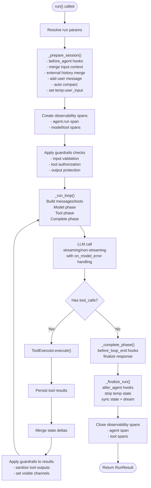

**Diagram sources**
- [runner.py:240-595](file://src/ark_agentic/core/runner.py#L240-L595)
- [callbacks.py:75-167](file://src/ark_agentic/core/callbacks.py#L75-L167)
- [types.py:420-423](file://src/ark_agentic/core/types.py#L420-L423)
- [phoenix.py:299-521](file://src/ark_agentic/core/observability/phoenix.py#L299-L521)
- [service.py:316-393](file://src/ark_agentic/core/guardrails/service.py#L316-L393)
- [executor.py:43-97](file://src/ark_agentic/core/tools/executor.py#L43-L97)
- [session.py:264-290](file://src/ark_agentic/core/session.py#L264-L290)

**Section sources**
- [runner.py:240-595](file://src/ark_agentic/core/runner.py#L240-L595)
- [callbacks.py:75-167](file://src/ark_agentic/core/callbacks.py#L75-L167)
- [types.py:420-423](file://src/ark_agentic/core/types.py#L420-L423)
- [phoenix.py:299-521](file://src/ark_agentic/core/observability/phoenix.py#L299-L521)
- [service.py:316-393](file://src/ark_agentic/core/guardrails/service.py#L316-L393)

### Tools, Tool Registry, and ToolExecutor
- AgentTool defines the execution contract and JSON schema generation for function calling.
- ToolRegistry registers tools, supports filtering by name/group, and produces JSON schemas.
- ToolExecutor executes tools with concurrency limits, timeouts, and event dispatch to the event bus.

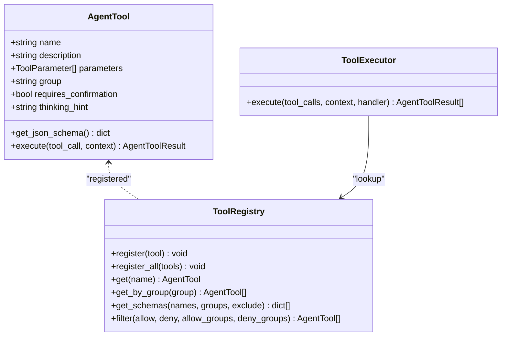

**Diagram sources**
- [base.py (tools):46-286](file://src/ark_agentic/core/tools/base.py#L46-L286)
- [registry.py:14-178](file://src/ark_agentic/core/tools/registry.py#L14-L178)
- [executor.py:29-123](file://src/ark_agentic/core/tools/executor.py#L29-L123)

**Section sources**
- [base.py (tools):46-286](file://src/ark_agentic/core/tools/base.py#L46-L286)
- [registry.py:14-178](file://src/ark_agentic/core/tools/registry.py#L14-L178)
- [executor.py:29-123](file://src/ark_agentic/core/tools/executor.py#L29-L123)

### Skills, Loader, and Matcher
- SkillLoader scans directories for SKILL.md files, parses frontmatter, and constructs SkillEntry objects with metadata.
- SkillMatcher filters skills by invocation policy, eligibility checks, and load mode, producing full-inject vs metadata-only splits.
- SystemPromptBuilder renders skills into the system prompt according to load mode and budget controls.

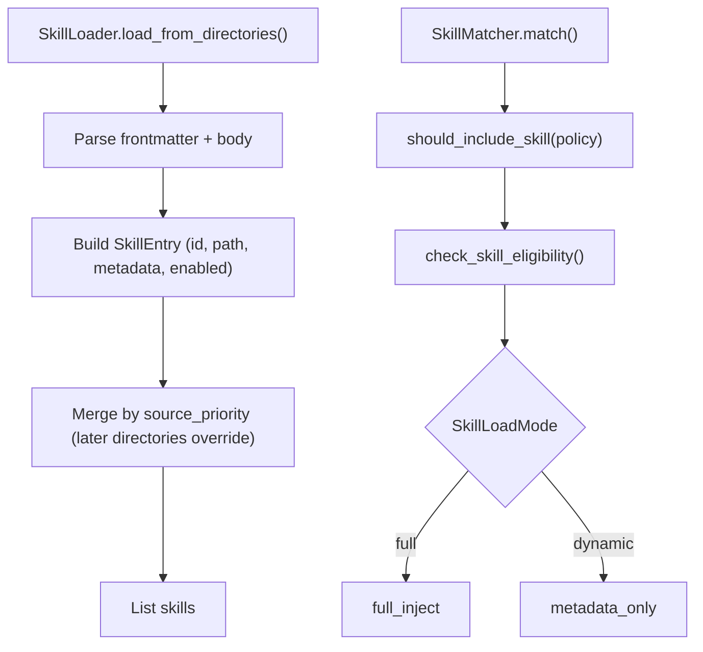

**Diagram sources**
- [loader.py:35-171](file://src/ark_agentic/core/skills/loader.py#L35-L171)
- [matcher.py:64-127](file://src/ark_agentic/core/skills/matcher.py#L64-L127)
- [base.py (skills):104-325](file://src/ark_agentic/core/skills/base.py#L104-L325)

**Section sources**
- [loader.py:35-171](file://src/ark_agentic/core/skills/loader.py#L35-L171)
- [matcher.py:64-127](file://src/ark_agentic/core/skills/matcher.py#L64-L127)
- [base.py (skills):104-325](file://src/ark_agentic/core/skills/base.py#L104-L325)

### Messages, Sessions, and Enhanced State Management
- AgentMessage standardizes roles (system, user, assistant, tool) and carries tool calls/results and metadata.
- SessionManager tracks messages, token usage, compaction stats, and active skills; supports auto-compaction and persistence.
- MemoryManager provides lightweight read/write for MEMORY.md with heading-level upsert semantics.
- **NEW** Enhanced state management with temp state handling for temporary values during execution.
- **NEW** strip_temp_state() removes temporary keys (prefixed with "temp:") to prevent state pollution.

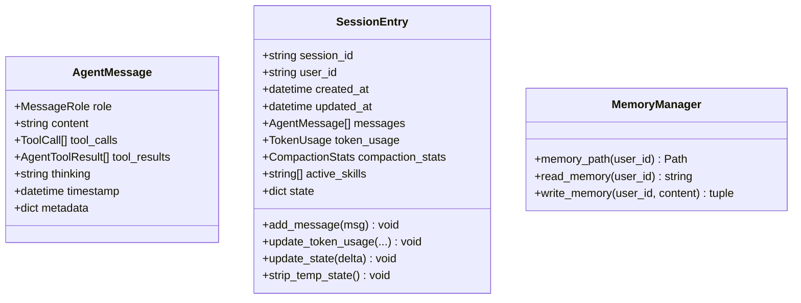

**Diagram sources**
- [types.py:190-423](file://src/ark_agentic/core/types.py#L190-L423)
- [session.py:342-482](file://src/ark_agentic/core/session.py#L342-L482)
- [manager.py (memory):24-92](file://src/ark_agentic/core/memory/manager.py#L24-L92)

**Section sources**
- [types.py:190-423](file://src/ark_agentic/core/types.py#L190-L423)
- [session.py:342-482](file://src/ark_agentic/core/session.py#L342-L482)
- [manager.py (memory):24-92](file://src/ark_agentic/core/memory/manager.py#L24-L92)

### Prompt Building and LLM Integration
- SystemPromptBuilder composes identity, runtime info, tools, skills, context, and custom instructions into a structured system prompt.
- LLMCaller wraps LLM calls, supports streaming with thinking-tag parsing, binds tool schemas, and converts outputs to AgentMessage.
- **NEW** Enhanced error handling with on_model_error hooks for graceful LLM failure recovery.

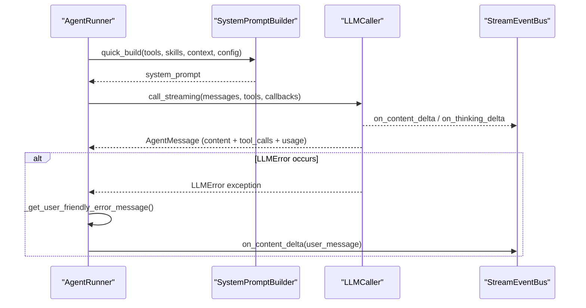

**Diagram sources**
- [builder.py (prompt):220-265](file://src/ark_agentic/core/prompt/builder.py#L220-L265)
- [caller.py (llm):73-177](file://src/ark_agentic/core/llm/caller.py#L73-L177)
- [event_bus.py:146-172](file://src/ark_agentic/core/stream/event_bus.py#L146-L172)
- [runner.py:875-899](file://src/ark_agentic/core/runner.py#L875-L899)

**Section sources**
- [builder.py (prompt):220-265](file://src/ark_agentic/core/prompt/builder.py#L220-L265)
- [caller.py (llm):73-177](file://src/ark_agentic/core/llm/caller.py#L73-L177)
- [runner.py:875-899](file://src/ark_agentic/core/runner.py#L875-L899)

### Agent Integration Example: Insurance Agent
The insurance agent demonstrates assembling tools, skills, memory, and configuration into a runnable AgentRunner with enhanced observability, safety, and robust error handling.

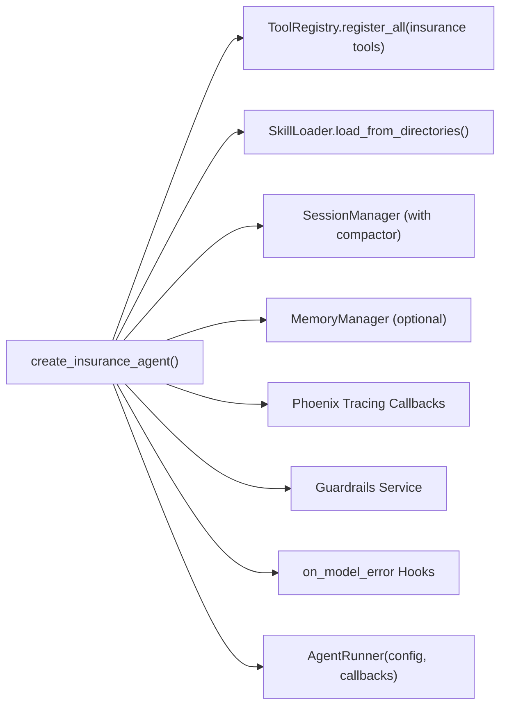

**Diagram sources**
- [agent.py (insurance):45-123](file://src/ark_agentic/agents/insurance/agent.py#L45-L123)
- [__init__.py (insurance tools):86-110](file://src/ark_agentic/agents/insurance/tools/__init__.py#L86-L110)
- [phoenix.py:299-521](file://src/ark_agentic/core/observability/phoenix.py#L299-L521)
- [service.py:316-393](file://src/ark_agentic/core/guardrails/service.py#L316-L393)
- [callbacks.py:155-167](file://src/ark_agentic/core/callbacks.py#L155-L167)

**Section sources**
- [agent.py (insurance):45-123](file://src/ark_agentic/agents/insurance/agent.py#L45-L123)
- [__init__.py (insurance tools):86-110](file://src/ark_agentic/agents/insurance/tools/__init__.py#L86-L110)
- [phoenix.py:299-521](file://src/ark_agentic/core/observability/phoenix.py#L299-L521)
- [service.py:316-393](file://src/ark_agentic/core/guardrails/service.py#L316-L393)
- [callbacks.py:155-167](file://src/ark_agentic/core/callbacks.py#L155-L167)

## Enhanced Callback System
The enhanced callback system provides comprehensive lifecycle management with improved traceability and error handling:

### CallbackContext Enhancement
- **Restored run_id field**: Unique identifier for each run that aligns with OTel span's ark.run_id for perfect correlation.
- **Enhanced metadata field**: Open dictionary for storing run-level metadata (user_id, model, agent_id, correlation_id) with zero structural changes.
- **Improved state management**: Better temp state handling with automatic cleanup via strip_temp_state().

### on_model_error Hook Support
- **Dedicated error handling**: Independent hook for LLM call failures, mutually exclusive with after_model for the same turn.
- **Comprehensive context**: Provides turn number and LLMError instance for detailed error analysis.
- **Graceful recovery**: Enables custom error handling strategies while maintaining system stability.

### Enhanced State Management
- **Temp state cleanup**: Automatic removal of temporary keys (prefixed with "temp:") after run completion.
- **Clean session handling**: Prevents state pollution from temporary execution variables.
- **Better debugging**: Enhanced traceability with preserved run_id and metadata throughout execution.

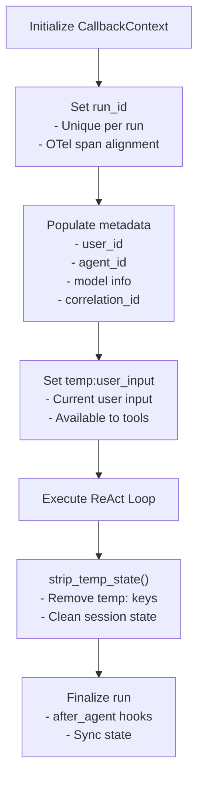

**Diagram sources**
- [callbacks.py:75-93](file://src/ark_agentic/core/callbacks.py#L75-L93)
- [runner.py:429-435](file://src/ark_agentic/core/runner.py#L429-L435)
- [types.py:420-423](file://src/ark_agentic/core/types.py#L420-L423)

**Section sources**
- [callbacks.py:75-93](file://src/ark_agentic/core/callbacks.py#L75-L93)
- [callbacks.py:155-167](file://src/ark_agentic/core/callbacks.py#L155-L167)
- [runner.py:429-435](file://src/ark_agentic/core/runner.py#L429-L435)
- [runner.py:875-899](file://src/ark_agentic/core/runner.py#L875-L899)
- [types.py:420-423](file://src/ark_agentic/core/types.py#L420-L423)

## Observability Integration
The framework now includes comprehensive observability through Phoenix/OpenTelemetry integration:

### Phoenix Tracing Architecture
- **Distributed Tracing**: Automatic span creation for agent lifecycle phases including agent.run, model_phase, and tool_phase.
- **Span Attributes**: Rich metadata including session_id, user_id, agent_name, model information, and payload details.
- **Error Tracking**: Automatic error recording with detailed exception attributes and status codes.
- **Lifecycle Integration**: Spans are created before callbacks and closed after completion with proper error handling.

### Tracing Callbacks Implementation
The observability system provides comprehensive tracing through these callback phases:
- **before_agent**: Creates main agent span with input context and session metadata
- **before_model**: Records model phase with message count and tool schema information  
- **before_tool/after_tool**: Creates individual tool spans with parameter details
- **after_agent**: Closes agent span with response metadata and performance metrics

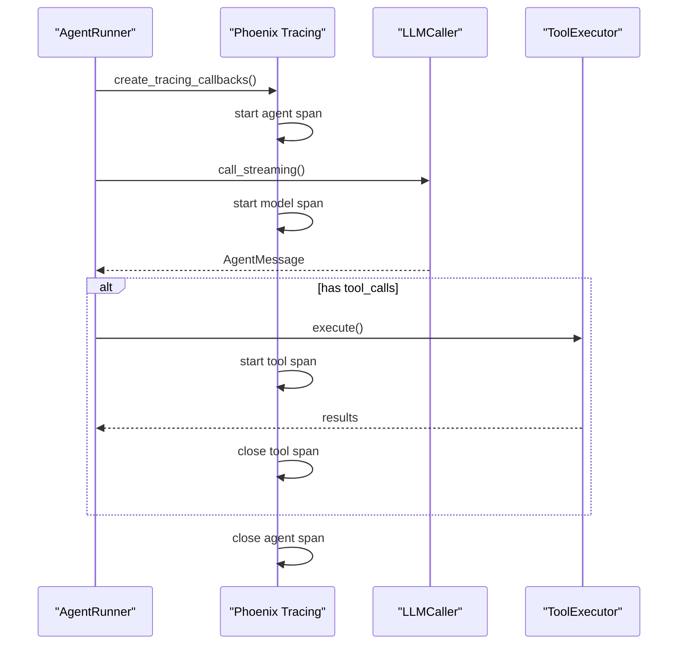

**Diagram sources**
- [phoenix.py:299-521](file://src/ark_agentic/core/observability/phoenix.py#L299-L521)
- [runner.py:240-595](file://src/ark_agentic/core/runner.py#L240-L595)

**Section sources**
- [phoenix.py:299-521](file://src/ark_agentic/core/observability/phoenix.py#L299-L521)
- [phoenix.py:85-141](file://src/ark_agentic/core/observability/phoenix.py#L85-L141)

## Runtime Guardrails System
The guardrails system provides comprehensive runtime safety enforcement:

### Guardrails Service Architecture
- **Input Validation**: Regex-based detection of prompt injection attempts, secret disclosure requests, and protected prompt access
- **Tool Authorization**: Policy-based tool execution control with state-dependent validation
- **Output Protection**: Detection and handling of internal prompt exposure and reasoning leakage
- **Dual Channel Strategy**: Separate visible channels for LLM and UI with automatic sanitization

### Guardrails Flow
The system operates across five key lifecycle phases:
- **before_agent**: Input validation with hard blocking for critical violations
- **before_tool**: Tool authorization with state validation and policy enforcement  
- **after_tool**: Tool result sanitization with dual channel visibility
- **before_loop_end**: Final output validation with retry capability
- **after_agent**: Additional output protection and user messaging

### Security Features
- **PII Redaction**: Automatic masking of bank cards, ID numbers, API keys, and bearer tokens
- **State Validation**: Required state keys verification for sensitive operations
- **Read-Only Mode**: Security discussion mode that restricts tool execution
- **Findings Tracking**: Comprehensive audit trail of all guardrails decisions

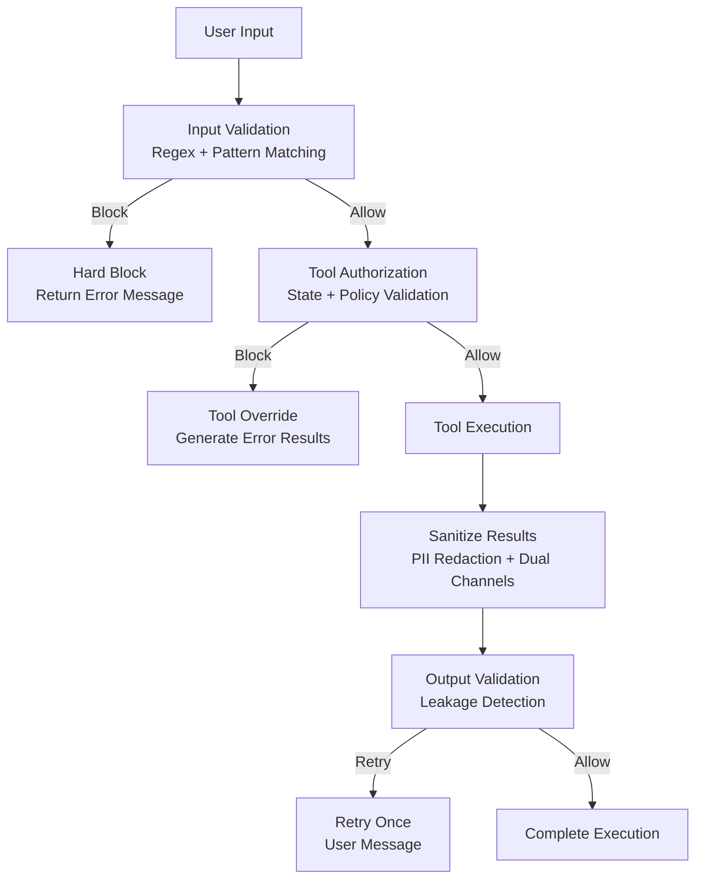

**Diagram sources**
- [service.py:167-297](file://src/ark_agentic/core/guardrails/service.py#L167-L297)
- [channels.py:28-55](file://src/ark_agentic/core/guardrails/channels.py#L28-L55)
- [pii.py:41-55](file://src/ark_agentic/core/guardrails/sanitizers/pii.py#L41-L55)

**Section sources**
- [service.py:119-430](file://src/ark_agentic/core/guardrails/service.py#L119-L430)
- [channels.py:1-55](file://src/ark_agentic/core/guardrails/channels.py#L1-L55)
- [pii.py:1-55](file://src/ark_agentic/core/guardrails/sanitizers/pii.py#L1-L55)

## Proactive Job Management
The proactive job system enables automated service delivery:

### Job Architecture
- **BaseJob Framework**: Abstract base class defining the common execution pattern
- **ProactiveServiceJob**: Specialized base for automated user services with intent extraction
- **JobManager**: Central scheduler using APScheduler for cron-based execution
- **UserShardScanner**: Efficient user data scanning with configurable concurrency

### Execution Flow
Jobs follow a standardized three-phase process:
1. **User Filtering**: Keyword-based pre-filtering for efficient processing
2. **Intent Processing**: LLM-driven intent extraction followed by data retrieval
3. **Notification Generation**: Automated notification creation and delivery

### Configuration Options
- **Cron Scheduling**: Flexible scheduling via cron expressions
- **Concurrency Control**: Configurable max concurrent users and batch sizes
- **Timeout Management**: User-level timeouts to prevent long-running operations
- **Agent Isolation**: Automatic agent-specific notification storage directories

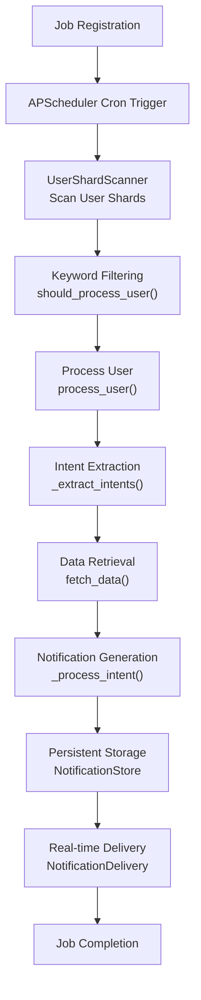

**Diagram sources**
- [manager.py (jobs):41-123](file://src/ark_agentic/core/jobs/manager.py#L41-L123)
- [proactive_service.py:138-221](file://src/ark_agentic/core/jobs/proactive_service.py#L138-L221)
- [store.py (notifications):25-126](file://src/ark_agentic/core/notifications/store.py#L25-L126)
- [delivery.py (notifications):22-88](file://src/ark_agentic/core/notifications/delivery.py#L22-L88)

**Section sources**
- [manager.py (jobs):41-123](file://src/ark_agentic/core/jobs/manager.py#L41-L123)
- [proactive_service.py:49-221](file://src/ark_agentic/core/jobs/proactive_service.py#L49-L221)
- [store.py (notifications):25-126](file://src/ark_agentic/core/notifications/store.py#L25-L126)
- [delivery.py (notifications):22-88](file://src/ark_agentic/core/notifications/delivery.py#L22-L88)

## Notification System
The notification system provides persistent storage and real-time streaming:

### Storage Architecture
- **JSONL Persistence**: Append-only JSON Lines format for reliable storage
- **Agent Isolation**: Separate directories per agent for clean separation
- **Read Tracking**: Separate file for tracking read notification IDs
- **Efficient Reading**: Reverse reading optimization for recent notifications

### Delivery Mechanism
- **SSE Streaming**: Server-Sent Events for real-time notification delivery
- **Queue Management**: AsyncIO queues with capacity limits for backpressure handling
- **Offline Support**: Automatic fallback to persistent storage when users are offline
- **Heartbeat Protocol**: Regular keepalive messages to maintain connections

### API Endpoints
- **REST Endpoints**: History retrieval, read marking, and job management
- **SSE Streams**: Real-time notification streams with connection lifecycle management
- **Agent Isolation**: Automatic agent-specific routing and storage

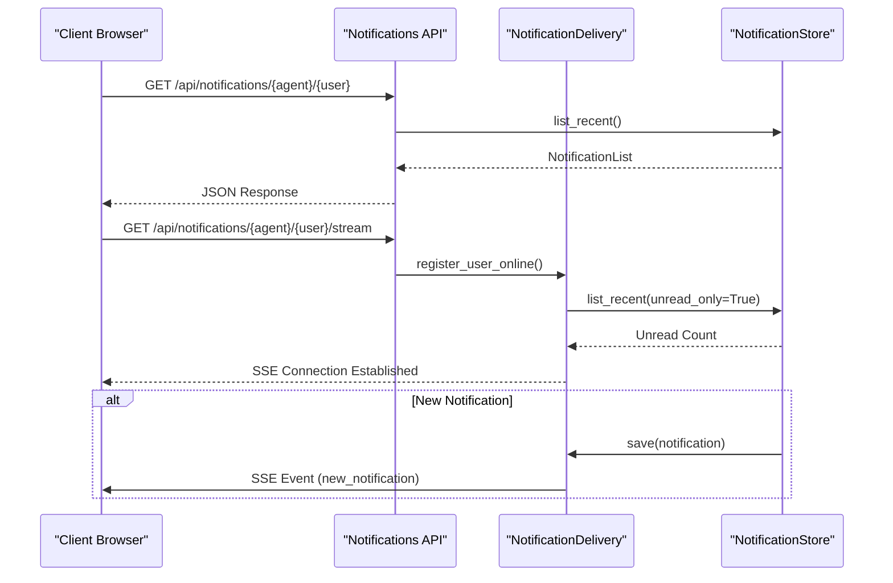

**Diagram sources**
- [notifications.py:39-167](file://src/ark_agentic/api/notifications.py#L39-L167)
- [delivery.py (notifications):46-88](file://src/ark_agentic/core/notifications/delivery.py#L46-L88)
- [store.py (notifications):56-126](file://src/ark_agentic/core/notifications/store.py#L56-L126)

**Section sources**
- [notifications.py:1-167](file://src/ark_agentic/api/notifications.py#L1-L167)
- [delivery.py (notifications):1-88](file://src/ark_agentic/core/notifications/delivery.py#L1-L88)
- [store.py (notifications):1-126](file://src/ark_agentic/core/notifications/store.py#L1-L126)

## Dependency Analysis
The following diagram highlights key dependencies among core components, including the new observability, safety, job management, and enhanced callback layers:

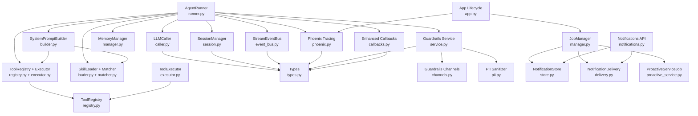

**Diagram sources**
- [runner.py:153-595](file://src/ark_agentic/core/runner.py#L153-L595)
- [callbacks.py:75-167](file://src/ark_agentic/core/callbacks.py#L75-L167)
- [caller.py (llm):21-204](file://src/ark_agentic/core/llm/caller.py#L21-L204)
- [builder.py (prompt):55-265](file://src/ark_agentic/core/prompt/builder.py#L55-L265)
- [registry.py:14-178](file://src/ark_agentic/core/tools/registry.py#L14-L178)
- [executor.py:29-123](file://src/ark_agentic/core/tools/executor.py#L29-L123)
- [loader.py:25-177](file://src/ark_agentic/core/skills/loader.py#L25-L177)
- [matcher.py:55-152](file://src/ark_agentic/core/skills/matcher.py#L55-L152)
- [session.py:24-482](file://src/ark_agentic/core/session.py#L24-L482)
- [manager.py (memory):24-92](file://src/ark_agentic/core/memory/manager.py#L24-L92)
- [event_bus.py:67-248](file://src/ark_agentic/core/stream/event_bus.py#L67-L248)
- [phoenix.py:299-521](file://src/ark_agentic/core/observability/phoenix.py#L299-L521)
- [service.py:316-393](file://src/ark_agentic/core/guardrails/service.py#L316-L393)
- [channels.py:1-55](file://src/ark_agentic/core/guardrails/channels.py#L1-L55)
- [pii.py:1-55](file://src/ark_agentic/core/guardrails/sanitizers/pii.py#L1-L55)
- [manager.py (jobs):41-123](file://src/ark_agentic/core/jobs/manager.py#L41-L123)
- [store.py (notifications):25-126](file://src/ark_agentic/core/notifications/store.py#L25-L126)
- [delivery.py (notifications):22-88](file://src/ark_agentic/core/notifications/delivery.py#L22-L88)
- [notifications.py:39-167](file://src/ark_agentic/api/notifications.py#L39-L167)
- [app.py:64-135](file://src/ark_agentic/app.py#L64-L135)

**Section sources**
- [runner.py:153-595](file://src/ark_agentic/core/runner.py#L153-L595)
- [callbacks.py:75-167](file://src/ark_agentic/core/callbacks.py#L75-L167)
- [phoenix.py:299-521](file://src/ark_agentic/core/observability/phoenix.py#L299-L521)
- [service.py:316-393](file://src/ark_agentic/core/guardrails/service.py#L316-L393)
- [manager.py (jobs):41-123](file://src/ark_agentic/core/jobs/manager.py#L41-L123)
- [notifications.py:39-167](file://src/ark_agentic/api/notifications.py#L39-L167)
- [app.py:64-135](file://src/ark_agentic/app.py#L64-L135)
- [types.py:18-423](file://src/ark_agentic/core/types.py#L18-L423)

## Performance Considerations
- Concurrency and limits:
  - ToolExecutor enforces per-turn tool-call limits and per-tool timeouts to prevent runaway resource usage.
  - JobManager implements configurable concurrency limits and batch processing for proactive services.
- Auto-compaction:
  - SessionManager automatically compacts long histories to keep token budgets manageable.
- Budget-aware skill rendering:
  - Skill metadata rendering caps counts and character length to fit within prompt budgets.
- Streaming:
  - LLMCaller supports streaming with optional thinking-tag parsing to improve perceived responsiveness.
  - SSE streaming with heartbeat mechanism ensures reliable real-time notification delivery.
- **Enhanced Error Handling**: on_model_error hooks provide efficient error recovery without impacting overall system performance.
- **Improved State Management**: Enhanced temp state handling reduces memory footprint and prevents state pollution.
- **Observability overhead**: Phoenix tracing adds minimal overhead with async span management and lazy initialization.
- **Guardrails performance**: Regex-based checks are optimized for speed while maintaining comprehensive coverage.

## Troubleshooting Guide
Common issues and mitigations:
- LLM errors:
  - AgentRunner translates LLMError reasons into user-friendly messages and persists assistant responses for visibility.
  - **NEW** Enhanced on_model_error hooks provide detailed error context and enable custom error handling strategies.
  - **NEW** User-friendly error messages cover authentication, quota, rate limit, timeout, context overflow, content filter, server error, and network issues.
- Tool failures:
  - ToolExecutor records errors as AgentToolResult with is_error=true and logs details; handlers receive on_step notifications.
  - Guardrails service provides detailed findings and context updates for troubleshooting blocked operations.
- Context overflow:
  - On "length" finish_reason or context overflow, AgentRunner returns a RunResult indicating truncation and suggests restarting the session.
- Memory writes:
  - MemoryManager.write_memory returns current and dropped headings to track changes; verify heading-level semantics.
  - Enhanced state management automatically cleans up temporary keys to prevent state corruption.
- **Phoenix tracing issues**:
  - Check ENABLE_PHOENIX environment variable and Phoenix dependencies installation.
  - Verify collector endpoint configuration and network connectivity.
- **Guardrails false positives**:
  - Review guardrails findings in context updates and adjust regex patterns or policy rules as needed.
- **Job scheduling problems**:
  - Verify cron expressions and job registration in JobManager.
  - Check user shard configuration and concurrency limits.
- **Callback system issues**:
  - Verify CallbackContext.run_id and metadata fields are properly populated.
  - Check on_model_error hook registration and error handling logic.

**Section sources**
- [runner.py:457-476](file://src/ark_agentic/core/runner.py#L457-L476)
- [runner.py:875-899](file://src/ark_agentic/core/runner.py#L875-L899)
- [executor.py:63-97](file://src/ark_agentic/core/tools/executor.py#L63-L97)
- [session.py:362-380](file://src/ark_agentic/core/session.py#L362-L380)
- [types.py:420-423](file://src/ark_agentic/core/types.py#L420-L423)
- [manager.py (memory):45-70](file://src/ark_agentic/core/memory/manager.py#L45-L70)
- [callbacks.py:155-167](file://src/ark_agentic/core/callbacks.py#L155-L167)
- [phoenix.py:85-141](file://src/ark_agentic/core/observability/phoenix.py#L85-L141)
- [service.py:167-297](file://src/ark_agentic/core/guardrails/service.py#L167-L297)
- [store.py (notifications):43-53](file://src/ark_agentic/core/notifications/store.py#L43-L53)

## Conclusion
The ark-agentic framework now provides a comprehensive, production-ready foundation with enhanced observability, safety, automation capabilities, and robust error handling:
- **Enhanced Observability**: Phoenix/OpenTelemetry integration provides complete end-to-end tracing with detailed metrics and error tracking.
- **Runtime Safety**: Guardrails system offers comprehensive input validation, tool authorization, and output protection with dual-channel visibility.
- **Robust Error Handling**: on_model_error hooks provide dedicated error handling for LLM failures with comprehensive context and graceful recovery.
- **Enhanced State Management**: Improved temp state handling with automatic cleanup prevents state pollution and improves debugging.
- **Automated Services**: Proactive job management enables intelligent, scheduled user services with efficient processing and delivery.
- **Real-time Communication**: Notification system provides reliable persistent storage and real-time streaming with agent isolation.
- **Clean Separation of Concerns**: AgentRunner orchestrates all components while maintaining modularity and extensibility.
- **Production Ready**: All new features include proper error handling, configuration management, and operational considerations.

This expanded architecture enables safe, observable, automated, and resilient agent deployment while maintaining the flexibility and composability that makes the framework powerful for diverse use cases.

## Appendices

### Core Data Types Reference
- Message roles and result types define the canonical message and tool-result contracts.
- ToolCall and AgentToolResult standardize tool invocation and response handling.
- SessionEntry centralizes session state, token usage, and compaction statistics.
- SkillEntry and SkillMetadata capture skill metadata and rendering policies.
- **NEW** Enhanced CallbackContext provides run_id, user_input, input_context, session, and metadata fields for comprehensive traceability.
- **NEW** OnModelErrorCallback enables dedicated error handling for LLM call failures.
- **NEW** GuardrailFinding and GuardrailResult provide comprehensive safety decision tracking.
- **NEW** Notification models support persistent storage and real-time streaming with agent isolation.
- **NEW** User-friendly error messages translate LLMError reasons into context-appropriate responses.

**Section sources**
- [types.py:18-423](file://src/ark_agentic/core/types.py#L18-L423)
- [callbacks.py:75-167](file://src/ark_agentic/core/callbacks.py#L75-L167)
- [service.py:49-100](file://src/ark_agentic/core/guardrails/service.py#L49-L100)
- [store.py (notifications):25-126](file://src/ark_agentic/core/notifications/store.py#L25-L126)
- [runner.py:875-899](file://src/ark_agentic/core/runner.py#L875-L899)