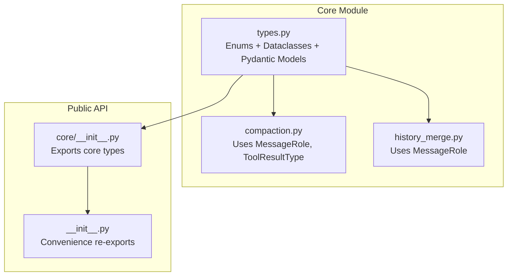
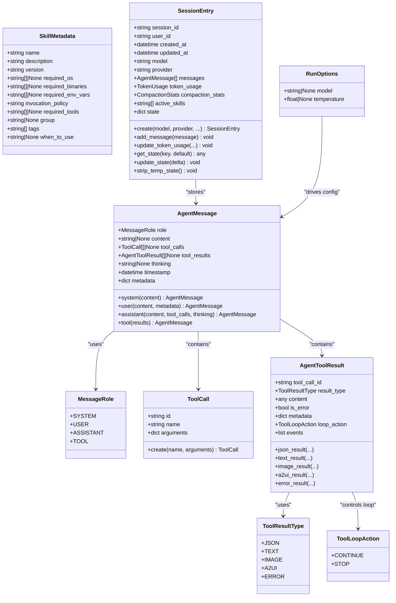
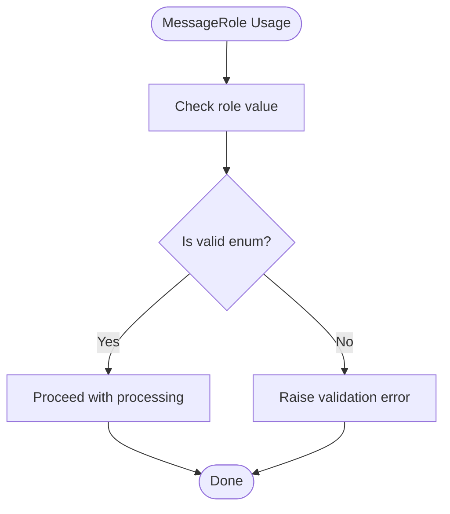
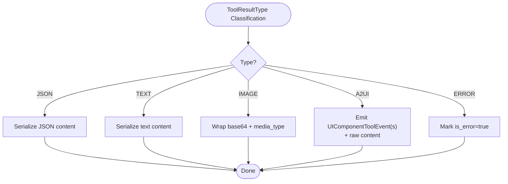
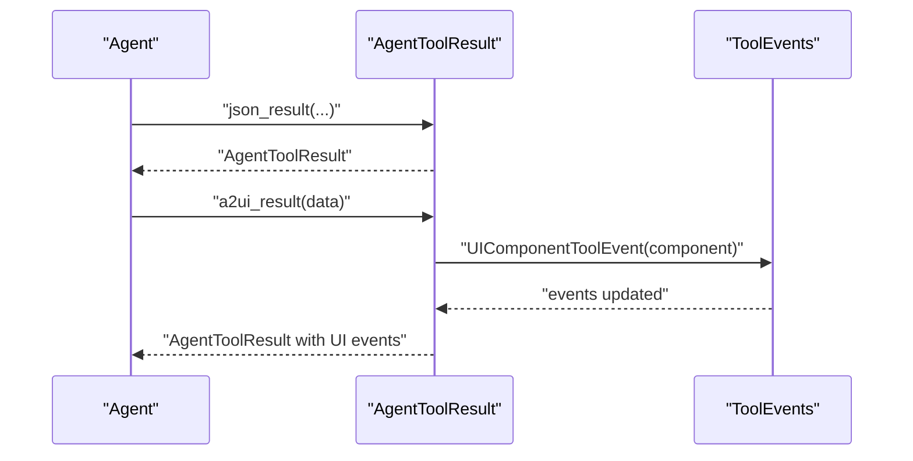
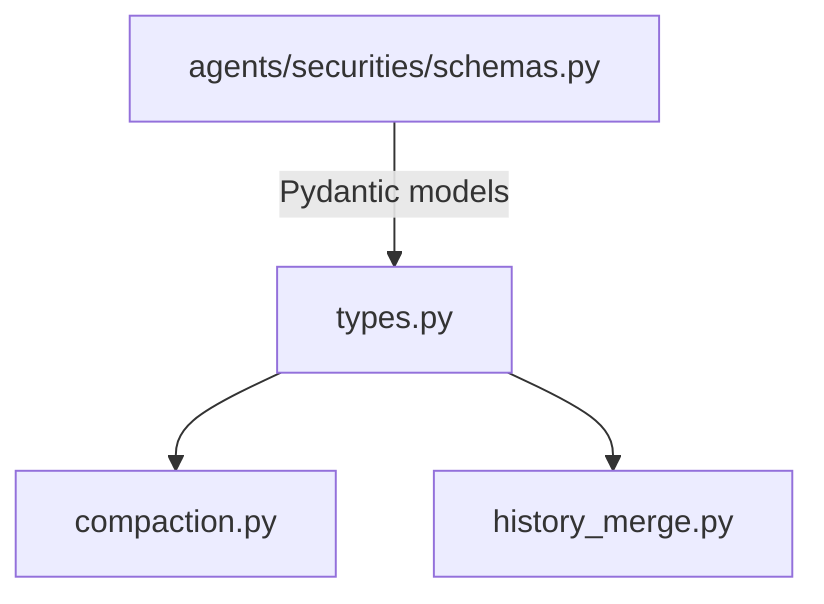

# Core Data Types

<cite>
**Referenced Files in This Document**
- [types.py](file://src/ark_agentic/core/types.py)
- [__init__.py](file://src/ark_agentic/core/__init__.py)
- [__init__.py](file://src/ark_agentic/__init__.py)
- [test_types.py](file://tests/unit/core/test_types.py)
- [compaction.py](file://src/ark_agentic/core/compaction.py)
- [history_merge.py](file://src/ark_agentic/core/history_merge.py)
- [schemas.py](file://src/ark_agentic/agents/securities/schemas.py)
- [test_schema_str_coercion.py](file://tests/unit/test_schema_str_coercion.py)
</cite>

## Table of Contents
1. [Introduction](#introduction)
2. [Project Structure](#project-structure)
3. [Core Components](#core-components)
4. [Architecture Overview](#architecture-overview)
5. [Detailed Component Analysis](#detailed-component-analysis)
6. [Dependency Analysis](#dependency-analysis)
7. [Performance Considerations](#performance-considerations)
8. [Troubleshooting Guide](#troubleshooting-guide)
9. [Conclusion](#conclusion)

## Introduction
This document provides a comprehensive guide to the core data type definitions that underpin the ark-agentic framework. It focuses on:
- Enums: MessageRole, ToolResultType, ToolLoopAction
- Dataclasses: ToolCall, AgentToolResult, AgentMessage, SkillMetadata, SessionEntry
- Pydantic models: RunOptions
It explains relationships between types, validation rules, serialization patterns, practical usage examples, conversion utilities, and best practices for working with these foundational types.

## Project Structure
The core types are defined centrally and exported through the public API surface:
- Core types are defined in the core module
- Public exports are managed via module-level __init__.py files
- Tests validate behavior and usage patterns

**Diagram sources**
- [types.py:18-413](file://src/ark_agentic/core/types.py#L18-L413)
- [__init__.py:14-32](file://src/ark_agentic/core/__init__.py#L14-L32)
- [__init__.py:33-49](file://src/ark_agentic/__init__.py#L33-L49)
- [compaction.py:8](file://src/ark_agentic/core/compaction.py#L8-L8)
- [history_merge.py:18](file://src/ark_agentic/core/history_merge.py#L18-L18)

**Section sources**
- [types.py:18-413](file://src/ark_agentic/core/types.py#L18-L413)
- [__init__.py:14-32](file://src/ark_agentic/core/__init__.py#L14-L32)
- [__init__.py:33-49](file://src/ark_agentic/__init__.py#L33-L49)

## Core Components
This section documents the foundational types and their roles in the system.

### Enums

#### MessageRole
- Purpose: Defines canonical roles for conversation participants
- Values: system, user, assistant, tool
- Usage: Used pervasively in AgentMessage and history processing

Validation and usage references:
- Filtering and comparison in compaction and history merge logic
- Guard logic in agents that validates specific role transitions

**Section sources**
- [types.py:18-25](file://src/ark_agentic/core/types.py#L18-L25)
- [compaction.py:464](file://src/ark_agentic/core/compaction.py#L464-L465)
- [history_merge.py:91](file://src/ark_agentic/core/history_merge.py#L91-L92)
- [history_merge.py:110](file://src/ark_agentic/core/history_merge.py#L110-L117)

#### ToolResultType
- Purpose: Classifies the content type of tool execution results
- Values: json, text, image, a2ui, error
- Usage: AgentToolResult.result_type drives downstream serialization and UI rendering

Validation and usage references:
- Conditional logic in compaction for A2UI results
- UI component event generation for A2UI results

**Section sources**
- [types.py:27-35](file://src/ark_agentic/core/types.py#L27-L35)
- [compaction.py:611](file://src/ark_agentic/core/compaction.py#L611-L611)
- [types.py:164-174](file://src/ark_agentic/core/types.py#L164-L174)

#### ToolLoopAction
- Purpose: Controls ReAct loop continuation after tool execution
- Values: continue, stop
- Usage: AgentToolResult.loop_action determines whether the agent continues reasoning or stops

Validation and usage references:
- Default behavior in AgentToolResult factories
- Guarded usage in agent tools and runners

**Section sources**
- [types.py:37-42](file://src/ark_agentic/core/types.py#L37-L42)
- [types.py:97](file://src/ark_agentic/core/types.py#L97-L97)
- [types.py:116](file://src/ark_agentic/core/types.py#L116-L116)

### Dataclasses

#### ToolCall
- Fields: id, name, arguments
- Factory: create(name, arguments) generates deterministic ids
- Serialization: Arguments are arbitrary dicts suitable for tool invocation

Practical usage:
- Constructed by agent reasoning to describe planned tool invocations
- Serialized to protocol-compatible structures for tool executors

**Section sources**
- [types.py:69-83](file://src/ark_agentic/core/types.py#L69-L83)

#### AgentToolResult
- Fields: tool_call_id, result_type, content, is_error, metadata, loop_action, events
- Factories:
  - json_result, text_result, image_result, a2ui_result, error_result
- A2UI specialization: Automatically emits UIComponentToolEvent for UI rendering
- Validation: Enforces result_type and content shape per factory

Serialization patterns:
- JSON/text/image content serialized as-is
- A2UI content emitted as UI events plus raw content
- Error results marked is_error for downstream handling

**Section sources**
- [types.py:85-187](file://src/ark_agentic/core/types.py#L85-L187)
- [types.py:100-187](file://src/ark_agentic/core/types.py#L100-L187)

#### AgentMessage
- Fields: role, content, tool_calls, tool_results, thinking, timestamp, metadata
- Factories: system, user, assistant, tool
- Validation: Ensures presence of required fields per role
- Serialization: Supports mixed content including tool calls/results

Usage patterns:
- Assistant messages may include tool_calls and thinking
- Tool messages carry AgentToolResult lists
- Metadata enables cross-cutting concerns (e.g., provenance)

**Section sources**
- [types.py:189-229](file://src/ark_agentic/core/types.py#L189-L229)

#### SkillMetadata
- Fields: name, description, version, required_os, required_binaries, required_env_vars, invocation_policy, required_tools, group, tags, when_to_use
- Defaults: version defaults to "1.0.0", invocation_policy defaults to "auto", tags defaults to empty list
- Validation: Invocation policy constrained to literal values
- Serialization: Used to drive skill loading decisions and UI presentation

**Section sources**
- [types.py:234-263](file://src/ark_agentic/core/types.py#L234-L263)

#### SessionEntry
- Fields: session_id, user_id, created_at, updated_at, model, provider, messages, token_usage, compaction_stats, active_skills, state
- Factories: create(model, provider, ...) initializes new sessions
- Utilities: add_message, update_token_usage, get_state, update_state, strip_temp_state
- Validation: Timestamps and numeric counts maintained consistently
- Serialization: Captures conversation history and runtime statistics

**Section sources**
- [types.py:341-413](file://src/ark_agentic/core/types.py#L341-L413)

### Pydantic Models

#### RunOptions
- Fields: model (optional), temperature (optional, constrained to [0.0, 2.0])
- Purpose: Per-request overrides for model and sampling temperature
- Validation: Range constraints enforced by Pydantic

**Section sources**
- [types.py:301-311](file://src/ark_agentic/core/types.py#L301-L311)

## Architecture Overview
The core types form a cohesive data model for agent conversations, tool execution, and session management. Enums define canonical semantics; dataclasses encapsulate structured payloads; Pydantic models provide validated configuration.

**Diagram sources**
- [types.py:18-42](file://src/ark_agentic/core/types.py#L18-L42)
- [types.py:69-83](file://src/ark_agentic/core/types.py#L69-L83)
- [types.py:85-187](file://src/ark_agentic/core/types.py#L85-L187)
- [types.py:189-229](file://src/ark_agentic/core/types.py#L189-L229)
- [types.py:234-263](file://src/ark_agentic/core/types.py#L234-L263)
- [types.py:341-413](file://src/ark_agentic/core/types.py#L341-L413)
- [types.py:301-311](file://src/ark_agentic/core/types.py#L301-L311)

## Detailed Component Analysis

### MessageRole
- Semantics: Canonical conversation roles
- Validation: Enum-based enforcement ensures consistent role values
- Usage: Applied across AgentMessage, history processing, and guards

**Diagram sources**
- [types.py:18-25](file://src/ark_agentic/core/types.py#L18-L25)

**Section sources**
- [types.py:18-25](file://src/ark_agentic/core/types.py#L18-L25)
- [compaction.py:464](file://src/ark_agentic/core/compaction.py#L464-L465)
- [history_merge.py:91](file://src/ark_agentic/core/history_merge.py#L91-L92)

### ToolResultType
- Semantics: Classifies tool result content
- Specialization: A2UI results automatically emit UI events
- Validation: Enum-based enforcement prevents invalid types

**Diagram sources**
- [types.py:27-35](file://src/ark_agentic/core/types.py#L27-L35)
- [types.py:164-174](file://src/ark_agentic/core/types.py#L164-L174)

**Section sources**
- [types.py:27-35](file://src/ark_agentic/core/types.py#L27-L35)
- [types.py:164-174](file://src/ark_agentic/core/types.py#L164-L174)
- [compaction.py:611](file://src/ark_agentic/core/compaction.py#L611-L611)

### ToolLoopAction
- Semantics: Loop control signal after tool execution
- Defaults: Continue unless explicitly set otherwise
- Validation: Enum-based enforcement

**Section sources**
- [types.py:37-42](file://src/ark_agentic/core/types.py#L37-L42)
- [types.py:97](file://src/ark_agentic/core/types.py#L97-L97)

### ToolCall
- Construction: Deterministic id generation via factory
- Serialization: Arguments dict passed as-is to tool executors

**Section sources**
- [types.py:69-83](file://src/ark_agentic/core/types.py#L69-L83)

### AgentToolResult
- Factories: Encapsulate common result shapes
- A2UI: Automatic UI event emission simplifies frontend integration
- Error handling: Clear error flag and content for robust downstream handling

**Diagram sources**
- [types.py:100-187](file://src/ark_agentic/core/types.py#L100-L187)

**Section sources**
- [types.py:85-187](file://src/ark_agentic/core/types.py#L85-L187)

### AgentMessage
- Role-specific construction: Dedicated factories for system/user/assistant/tool
- Mixed content: Supports tool_calls and tool_results alongside text
- Timestamping: Automatic timestamps for auditability

**Section sources**
- [types.py:189-229](file://src/ark_agentic/core/types.py#L189-L229)

### SkillMetadata
- Configuration: Environment, invocation policy, grouping, and tags
- Decision-making: when_to_use field supports skill load decisions

**Section sources**
- [types.py:234-263](file://src/ark_agentic/core/types.py#L234-L263)

### SessionEntry
- Lifecycle: Creation, message addition, token accounting, state updates
- Utilities: Convenience methods for state management and cleanup

**Section sources**
- [types.py:341-413](file://src/ark_agentic/core/types.py#L341-L413)

### RunOptions
- Overrides: Model and temperature overrides for single runs
- Validation: Range-checked temperature

**Section sources**
- [types.py:301-311](file://src/ark_agentic/core/types.py#L301-L311)

## Dependency Analysis
Core types are widely consumed across modules for message routing, tool execution, and session management.

**Diagram sources**
- [types.py:18-413](file://src/ark_agentic/core/types.py#L18-L413)
- [compaction.py:8](file://src/ark_agentic/core/compaction.py#L8-L8)
- [history_merge.py:18](file://src/ark_agentic/core/history_merge.py#L18-L18)
- [schemas.py:19](file://src/ark_agentic/agents/securities/schemas.py#L19-L42)

**Section sources**
- [compaction.py:464](file://src/ark_agentic/core/compaction.py#L464-L465)
- [history_merge.py:91](file://src/ark_agentic/core/history_merge.py#L91-L92)
- [schemas.py:19](file://src/ark_agentic/agents/securities/schemas.py#L19-L42)

## Performance Considerations
- Prefer factories for constructing ToolCall and AgentToolResult to ensure consistent shapes and reduce overhead
- Use SessionEntry utilities for batch updates to minimize repeated writes
- Keep tool arguments minimal and typed to reduce serialization costs
- Leverage A2UI results for UI-heavy workflows to avoid heavy text payloads

## Troubleshooting Guide
Common issues and resolutions:
- Invalid MessageRole values: Ensure enum values are used consistently across AgentMessage and guards
- A2UI result not rendering: Verify A2UI content is a dict or list of dicts; factories automatically emit UI events
- Temperature out of range: RunOptions temperature must be within [0.0, 2.0]
- Token usage discrepancies: Use SessionEntry.update_token_usage for cumulative updates

Validation references:
- MessageRole and ToolResultType usage in compaction and history merge
- RunOptions temperature constraints

**Section sources**
- [compaction.py:464](file://src/ark_agentic/core/compaction.py#L464-L465)
- [history_merge.py:91](file://src/ark_agentic/core/history_merge.py#L91-L92)
- [types.py:301-311](file://src/ark_agentic/core/types.py#L301-L311)

## Conclusion
The core data types in ark-agentic provide a strongly-typed foundation for agent conversations, tool execution, and session lifecycle management. Enums enforce semantic correctness, dataclasses encapsulate structured payloads, and Pydantic models add validated configuration. Together, they enable reliable, maintainable integrations across the framework.