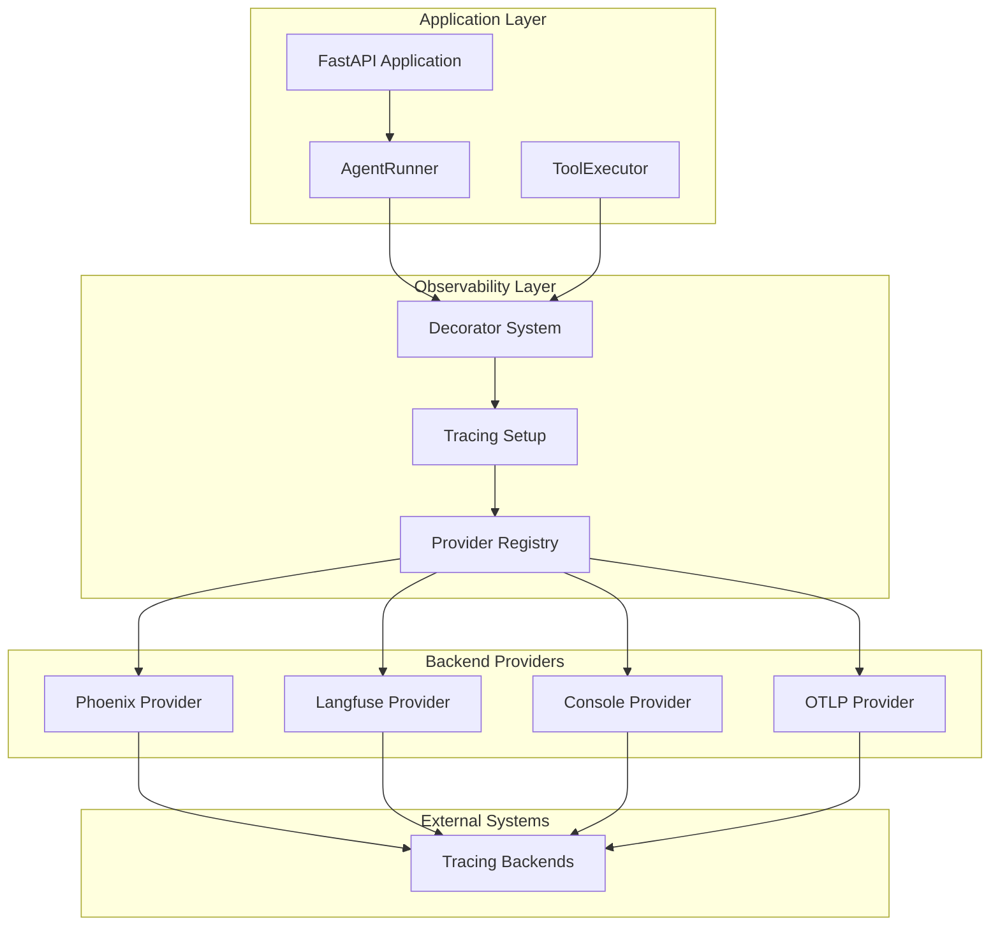
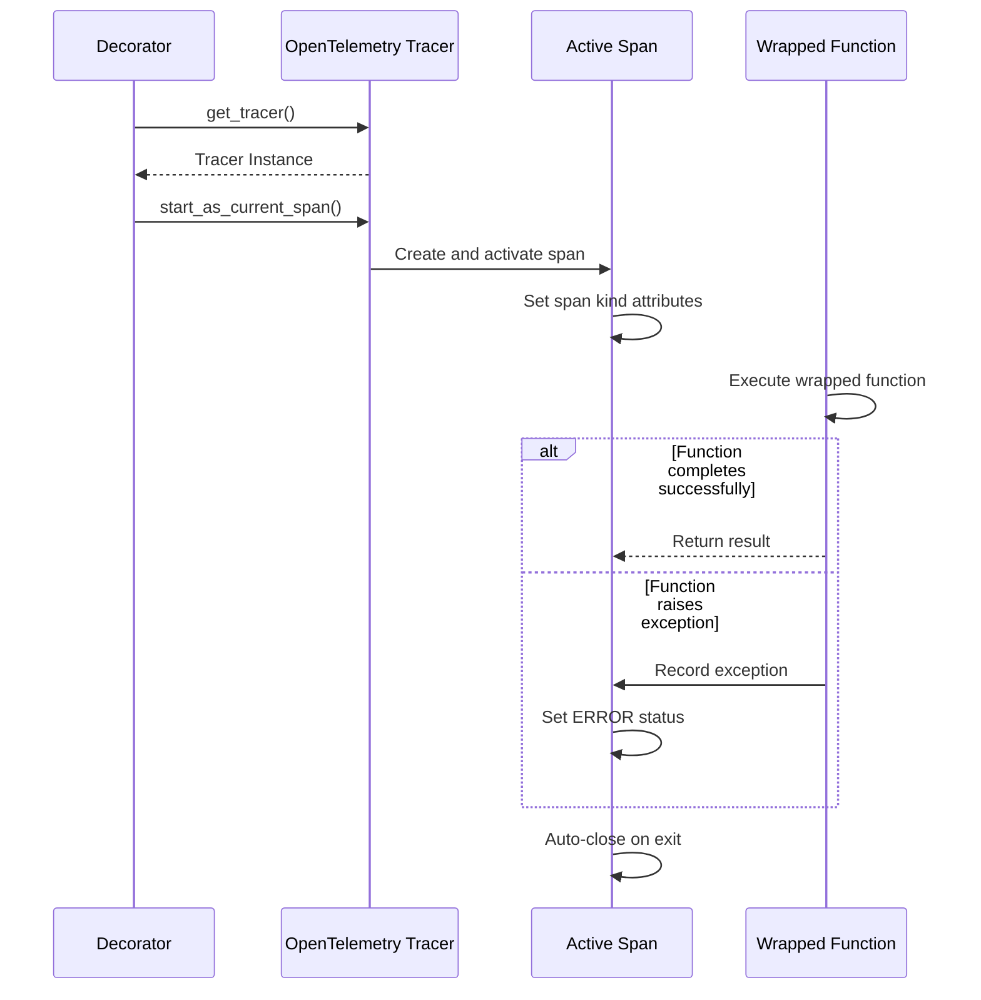
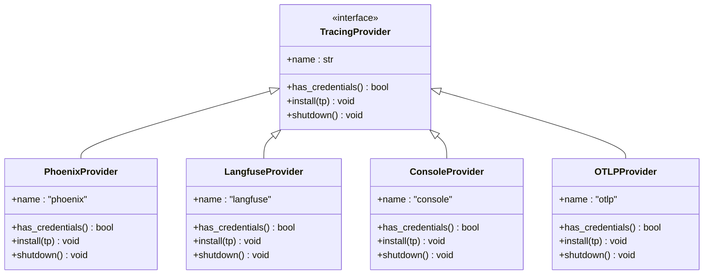
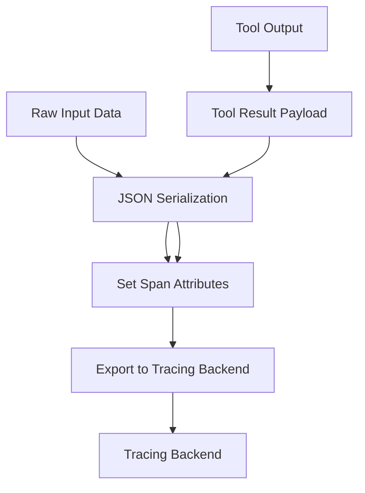
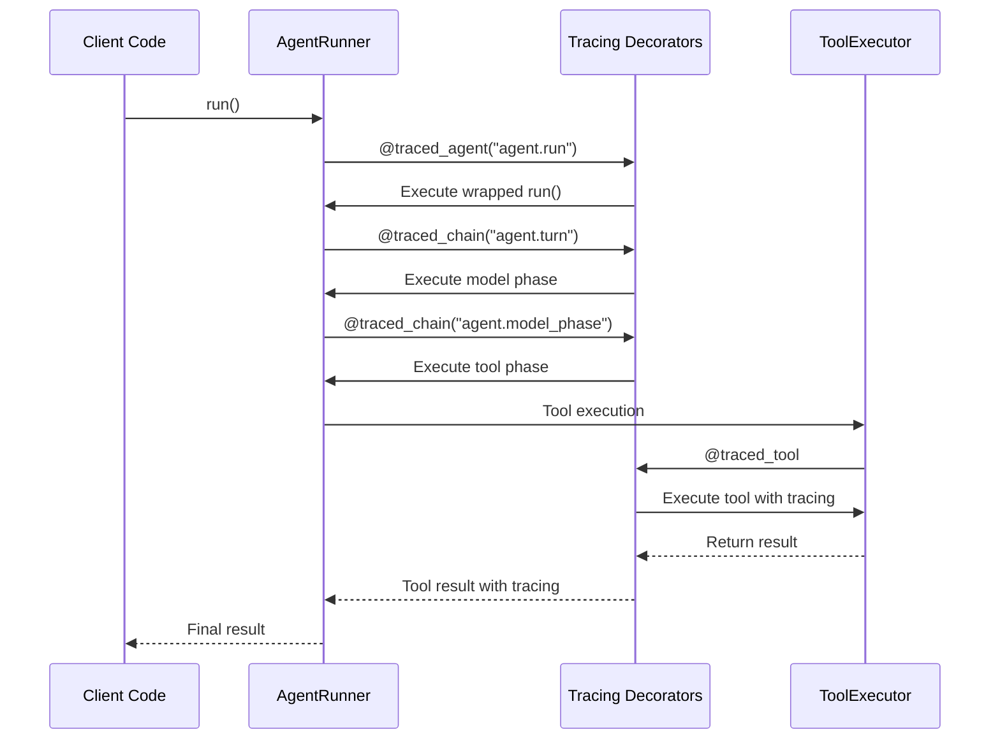

# Core Observability System

<cite>
**Referenced Files in This Document**
- [__init__.py](file://src/ark_agentic/core/observability/__init__.py)
- [decorators.py](file://src/ark_agentic/core/observability/decorators.py)
- [tracing.py](file://src/ark_agentic/core/observability/tracing.py)
- [providers/__init__.py](file://src/ark_agentic/core/observability/providers/__init__.py)
- [providers/phoenix.py](file://src/ark_agentic/core/observability/providers/phoenix.py)
- [providers/console.py](file://src/ark_agentic/core/observability/providers/console.py)
- [providers/langfuse.py](file://src/ark_agentic/core/observability/providers/langfuse.py)
- [providers/otlp.py](file://src/ark_agentic/core/observability/providers/otlp.py)
- [runner.py](file://src/ark_agentic/core/runner.py)
- [tools/executor.py](file://src/ark_agentic/core/tools/executor.py)
- [test_tracing.py](file://tests/unit/core/test_tracing.py)
</cite>

## Update Summary
**Changes Made**
- Replaced Phoenix-based observability system with new decorator-driven tracing system
- Removed old Phoenix implementation and callback-based approach
- Introduced three core decorators: @traced_agent, @traced_chain, and @traced_tool
- Added multi-provider tracing backend support (Phoenix, Langfuse, Console, OTLP)
- Implemented OpenTelemetry-based observability with OpenInference semantic conventions

## Table of Contents
1. [Introduction](#introduction)
2. [System Architecture](#system-architecture)
3. [Core Components](#core-components)
4. [Decorator-Based Tracing System](#decorator-based-tracing-system)
5. [Multi-Provider Tracing Backends](#multi-provider-tracing-backends)
6. [Runtime Tracing and Span Management](#runtime-tracing-and-span-management)
7. [Integration with Agent Execution](#integration-with-agent-execution)
8. [Configuration and Environment Variables](#configuration-and-environment-variables)
9. [Testing and Validation](#testing-and-validation)
10. [Migration from Phoenix System](#migration-from-phoenix-system)
11. [Best Practices](#best-practices)

## Introduction

The Core Observability System has been completely redesigned to use a modern, decorator-driven approach based on OpenTelemetry and OpenInference standards. This new system replaces the previous Phoenix-based implementation with a more flexible, extensible architecture that supports multiple tracing backends and provides fine-grained control over observability instrumentation.

The new observability system focuses on three core decorators that wrap agent execution phases, providing comprehensive tracing with minimal code changes and maximum flexibility for different deployment scenarios.

## System Architecture

The new observability system is built around a clean, layered architecture that separates concerns between tracing decorators, provider management, and span instrumentation:

**Diagram sources**
- [runner.py:287-287](file://src/ark_agentic/core/runner.py#L287)
- [tools/executor.py:63-63](file://src/ark_agentic/core/tools/executor.py#L63)
- [decorators.py:101-116](file://src/ark_agentic/core/observability/decorators.py#L101-L116)
- [tracing.py:56-99](file://src/ark_agentic/core/observability/tracing.py#L56-L99)

The architecture emphasizes modularity and extensibility, allowing teams to choose the most appropriate tracing backend for their environment while maintaining consistent observability across all agent execution phases.

## Core Components

### Decorator-Based Tracing Framework

The heart of the new observability system is a simple yet powerful decorator framework that provides automatic span creation and management for different execution phases:

- **@traced_agent**: Wraps the main agent execution method, creating AGENT-level spans
- **@traced_chain**: Wraps individual execution phases (model, tool phases), creating CHAIN-level spans  
- **@traced_tool**: Wraps tool execution methods, creating TOOL-level spans with automatic tool metadata

### Active Span Helper Functions

The system provides three helper functions for writing dynamic content to the active span:

- **add_span_attributes()**: Adds custom attributes to the current span
- **add_span_input()**: Records input data as JSON-serialized attributes
- **add_span_output()**: Records output data as JSON-serialized attributes

### Provider Registry System

A flexible provider registry manages multiple tracing backends through a common interface, supporting:

- **Phoenix**: Phoenix collector integration
- **Langfuse**: Cloud-based Langfuse analytics
- **Console**: Local development output to stdout
- **OTLP**: Generic OpenTelemetry Protocol exporters

**Section sources**
- [decorators.py:101-143](file://src/ark_agentic/core/observability/decorators.py#L101-L143)
- [decorators.py:149-169](file://src/ark_agentic/core/observability/decorators.py#L149-L169)
- [providers/__init__.py:30-45](file://src/ark_agentic/core/observability/providers/__init__.py#L30-L45)

## Decorator-Based Tracing System

### Decorator Implementation Pattern

The new system uses a consistent pattern for all decorators, leveraging OpenTelemetry's context management for automatic span lifecycle handling:

**Diagram sources**
- [decorators.py:78-95](file://src/ark_agentic/core/observability/decorators.py#L78-L95)
- [decorators.py:118-143](file://src/ark_agentic/core/observability/decorators.py#L118-L143)

### Span Kind and Semantic Attributes

Each decorator automatically sets appropriate OpenInference semantic attributes:

- **AGENT spans**: `openinference.span.kind = "AGENT"` for complete agent runs
- **CHAIN spans**: `openinference.span.kind = "CHAIN"` for execution phases
- **TOOL spans**: `openinference.span.kind = "TOOL"` with tool-specific metadata

### Automatic Error Handling

All decorators implement robust error handling that ensures spans are properly closed even when exceptions occur, with automatic exception recording and status setting.

**Section sources**
- [decorators.py:30-57](file://src/ark_agentic/core/observability/decorators.py#L30-L57)
- [decorators.py:78-95](file://src/ark_agentic/core/observability/decorators.py#L78-L95)
- [decorators.py:118-143](file://src/ark_agentic/core/observability/decorators.py#L118-L143)

## Multi-Provider Tracing Backends

### Provider Interface and Registration

The system uses a common interface for all tracing providers, enabling easy addition of new backends:

**Diagram sources**
- [providers/__init__.py:20-27](file://src/ark_agentic/core/observability/providers/__init__.py#L20-L27)
- [providers/phoenix.py:12-40](file://src/ark_agentic/core/observability/providers/phoenix.py#L12-L40)
- [providers/langfuse.py:13-48](file://src/ark_agentic/core/observability/providers/langfuse.py#L13-L48)
- [providers/console.py:11-35](file://src/ark_agentic/core/observability/providers/console.py#L11-L35)
- [providers/otlp.py:12-40](file://src/ark_agentic/core/observability/providers/otlp.py#L12-L40)

### Provider Credential Management

Each provider implements intelligent credential detection to prevent accidental activation:

- **Phoenix**: Requires explicit endpoint configuration
- **Langfuse**: Requires both public and secret keys
- **Console**: Never auto-enables (requires explicit configuration)
- **OTLP**: Requires standard OpenTelemetry endpoint configuration

**Section sources**
- [providers/phoenix.py:18-21](file://src/ark_agentic/core/observability/providers/phoenix.py#L18-L21)
- [providers/langfuse.py:19-22](file://src/ark_agentic/core/observability/providers/langfuse.py#L19-L22)
- [providers/console.py:17-19](file://src/ark_agentic/core/observability/providers/console.py#L17-L19)
- [providers/otlp.py:18-19](file://src/ark_agentic/core/observability/providers/otlp.py#L18-L19)

## Runtime Tracing and Span Management

### Span Attribute Management

The system provides structured attribute management for different execution contexts:

#### Agent-Level Attributes
- Session identifiers and user context
- Agent configuration and runtime parameters
- Request correlation and trace identification
- Performance metrics and execution statistics

#### Chain-Level Attributes  
- Phase-specific metadata and context
- Turn counts and conversation state
- Model configuration and response characteristics

#### Tool-Level Attributes
- Tool call identification and parameters
- Execution results and error conditions
- Performance metrics and timing information

### JSON Serialization for Observability Data

The system uses structured JSON serialization for input and output capture, ensuring consistent data representation across all tracing backends:

**Diagram sources**
- [decorators.py:158-169](file://src/ark_agentic/core/observability/decorators.py#L158-L169)
- [decorators.py:175-189](file://src/ark_agentic/core/observability/decorators.py#L175-L189)

**Section sources**
- [decorators.py:65-73](file://src/ark_agentic/core/observability/decorators.py#L65-L73)
- [decorators.py:149-169](file://src/ark_agentic/core/observability/decorators.py#L149-L169)

## Integration with Agent Execution

### Decorator Placement Strategy

The new system integrates seamlessly with the existing agent execution flow through strategic decorator placement:

**Diagram sources**
- [runner.py:287-287](file://src/ark_agentic/core/runner.py#L287)
- [runner.py:718-718](file://src/ark_agentic/core/runner.py#L718)
- [runner.py:809-809](file://src/ark_agentic/core/runner.py#L809)
- [runner.py:956-956](file://src/ark_agentic/core/runner.py#L956)
- [tools/executor.py:63-63](file://src/ark_agentic/core/tools/executor.py#L63)

### Automatic Context Propagation

The decorator system automatically propagates context between nested spans, creating a clear parent-child relationship that mirrors the actual execution flow:

- **Agent spans** serve as root spans for complete agent runs
- **Turn spans** contain model interaction phases
- **Tool spans** encapsulate individual tool executions

**Section sources**
- [runner.py:287-374](file://src/ark_agentic/core/runner.py#L287-L374)
- [runner.py:718-720](file://src/ark_agentic/core/runner.py#L718-L720)
- [runner.py:809-811](file://src/ark_agentic/core/runner.py#L809-L811)
- [runner.py:956-958](file://src/ark_agentic/core/runner.py#L956-L958)

## Configuration and Environment Variables

### Tracing Configuration System

The system uses a single environment variable (`TRACING`) to configure multiple tracing backends simultaneously:

| Configuration Value | Effect | Provider Selection |
|-------------------|--------|-------------------|
| `TRACING=console` | Local development tracing | Console provider only |
| `TRACING=phoenix` | Phoenix collector tracing | Phoenix provider only |
| `TRACING=langfuse` | Cloud Langfuse tracing | Langfuse provider only |
| `TRACING=otlp` | Generic OTLP exporter | OTLP provider only |
| `TRACING=phoenix,langfuse` | Dual backend export | Phoenix + Langfuse |
| `TRACING=auto` | Auto-detect providers | Enabled providers only |

### Provider Credential Requirements

Each provider has specific credential requirements that must be met for activation:

- **Console**: No credentials required (explicit activation only)
- **Phoenix**: `PHOENIX_COLLECTOR_ENDPOINT` environment variable
- **Langfuse**: Both `LANGFUSE_PUBLIC_KEY` and `LANGFUSE_SECRET_KEY`
- **OTLP**: `OTEL_EXPORTER_OTLP_ENDPOINT` environment variable

**Section sources**
- [tracing.py:35-53](file://src/ark_agentic/core/observability/tracing.py#L35-L53)
- [providers/phoenix.py:18-21](file://src/ark_agentic/core/observability/providers/phoenix.py#L18-L21)
- [providers/langfuse.py:19-22](file://src/ark_agentic/core/observability/providers/langfuse.py#L19-L22)
- [providers/otlp.py:18-19](file://src/ark_agentic/core/observability/providers/otlp.py#L18-L19)

## Testing and Validation

### Comprehensive Test Coverage

The new observability system includes extensive testing to ensure reliability and correctness across all components:

#### Decorator Behavior Testing
- **Span lifecycle validation**: Ensures proper span creation and closure
- **Error handling verification**: Confirms exception recording and status setting
- **Nested decorator validation**: Verifies parent-child span relationships
- **Helper function safety**: Tests NoOp behavior when no provider is configured

#### Provider Integration Testing
- **Environment variable handling**: Validates different configuration scenarios
- **Credential detection**: Tests provider activation based on credentials
- **Multi-provider coordination**: Ensures simultaneous backend operation
- **Shutdown procedures**: Verifies proper resource cleanup

#### Test Scenarios Covered
- Decorator application to agent execution methods
- Tool execution tracing with automatic metadata extraction
- Error propagation and status reporting
- Memory cleanup and resource deallocation
- Performance impact assessment under different configurations

**Section sources**
- [test_tracing.py:56-94](file://tests/unit/core/test_tracing.py#L56-L94)
- [test_tracing.py:97-125](file://tests/unit/core/test_tracing.py#L97-L125)
- [test_tracing.py:148-174](file://tests/unit/core/test_tracing.py#L148-L174)
- [test_tracing.py:186-201](file://tests/unit/core/test_tracing.py#L186-L201)

## Migration from Phoenix System

### Key Differences from Previous Implementation

The new decorator-based system provides several advantages over the previous Phoenix implementation:

#### Simplified Architecture
- **Removed callback complexity**: Eliminated complex callback-based instrumentation
- **Simplified configuration**: Single environment variable controls all aspects
- **Reduced dependencies**: Minimal external dependencies for core functionality

#### Enhanced Flexibility
- **Multiple backend support**: Support for Phoenix, Langfuse, Console, and OTLP
- **Dynamic provider selection**: Automatic backend detection based on credentials
- **Zero-cost operation**: No tracing overhead when disabled

#### Improved Developer Experience
- **Intuitive decorator syntax**: Familiar Python decorator pattern
- **Automatic metadata extraction**: Tool names and parameters captured automatically
- **Consistent error handling**: Standardized exception recording and status reporting

### Migration Benefits

Organizations migrating to the new system will benefit from:

- **Reduced maintenance overhead**: Fewer moving parts in the observability stack
- **Better performance**: Zero-cost operation when tracing is disabled
- **Enhanced flexibility**: Easy switching between different tracing backends
- **Improved developer productivity**: Simpler configuration and debugging

## Best Practices

### Performance Considerations

When implementing observability in production environments, consider these best practices:

1. **Selective Instrumentation**: Enable tracing only for critical paths or during debugging
2. **Provider Selection**: Choose appropriate backends based on deployment environment
3. **Attribute Optimization**: Limit the number and size of attributes to minimize overhead
4. **Resource Cleanup**: Ensure proper provider shutdown to prevent memory leaks

### Security and Privacy

- **Data Minimization**: Avoid capturing sensitive personal information in traces
- **PII Sanitization**: Implement data masking for personally identifiable information
- **Access Control**: Restrict access to observability data to authorized personnel only

### Monitoring and Alerting

- **Key Metrics**: Monitor span duration, error rates, and throughput
- **Threshold Alerts**: Set up alerts for unusual patterns or performance degradation
- **Correlation**: Use trace IDs to correlate logs, metrics, and distributed traces

### Troubleshooting Guide

Common issues and their solutions:

**Tracing Not Working**
- Verify `TRACING` environment variable contains valid provider names
- Check provider-specific credential environment variables
- Ensure required dependencies are installed for selected providers

**Provider Configuration Issues**
- Verify all required environment variables are set for the chosen provider
- Check network connectivity to the selected tracing backend
- Review provider-specific configuration requirements

**Performance Impact**
- Disable tracing in production environments
- Reduce span attribute cardinality
- Implement sampling for high-volume scenarios