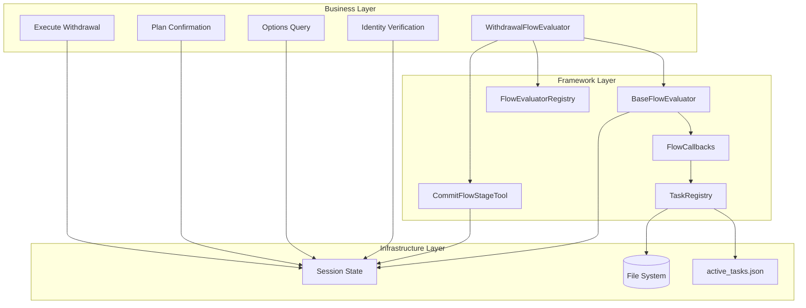
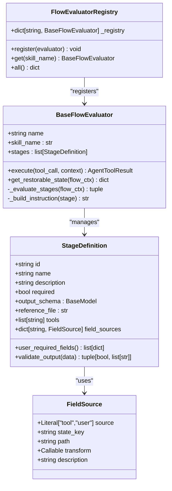
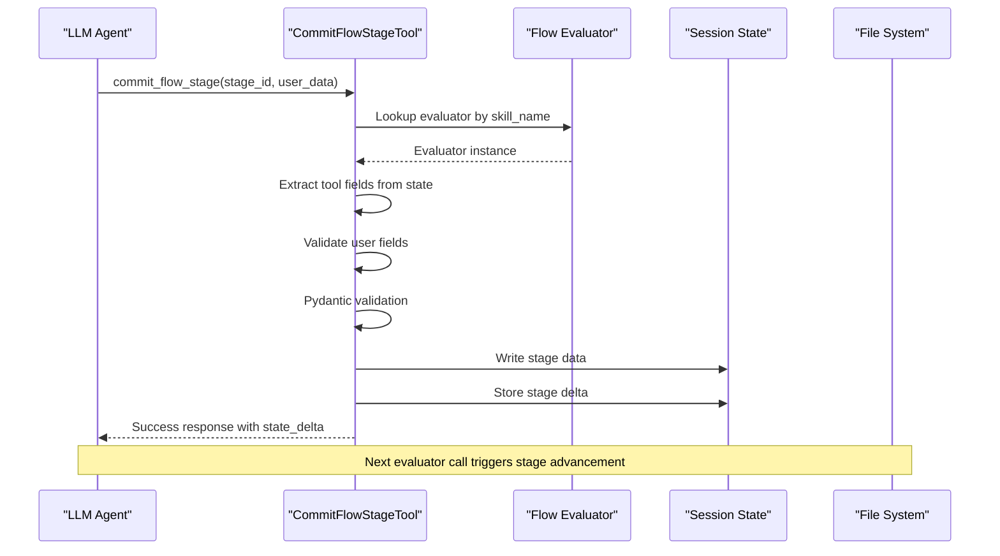
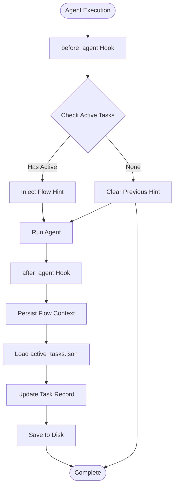
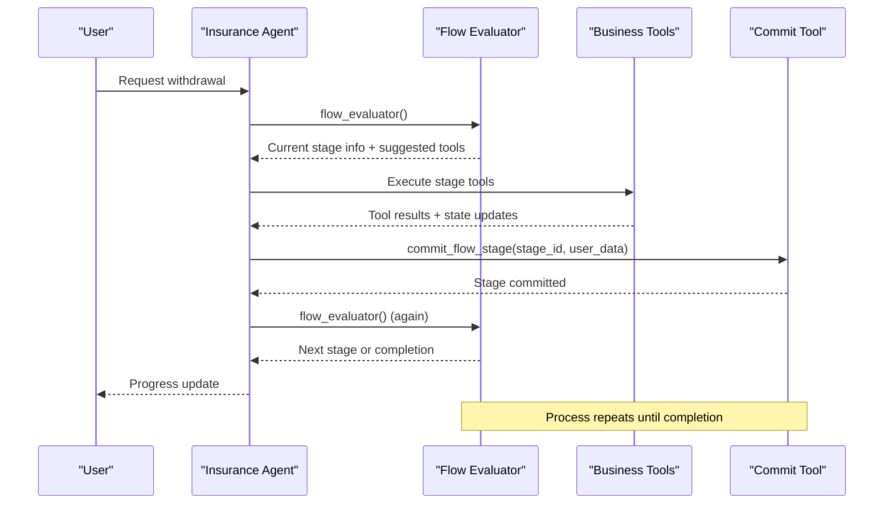
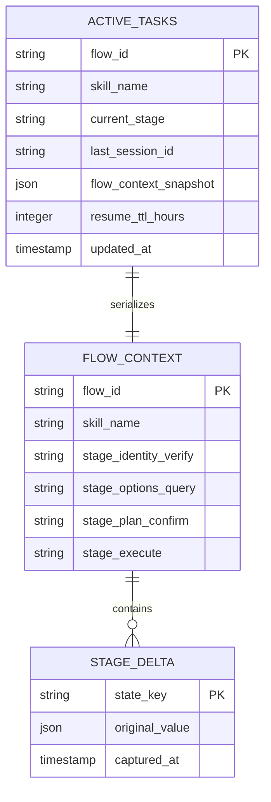
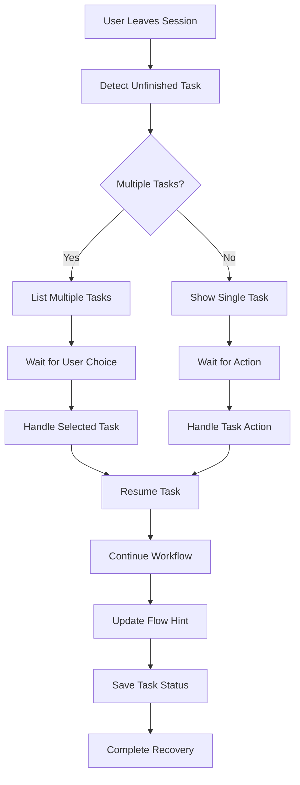
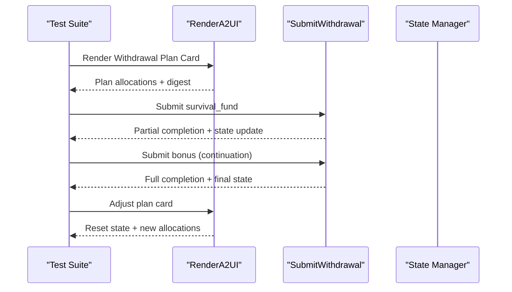

# Flow Evaluation System

<cite>
**Referenced Files in This Document**
- [base_evaluator.py](file://src/ark_agentic/core/flow/base_evaluator.py)
- [commit_flow_stage.py](file://src/ark_agentic/core/flow/commit_flow_stage.py)
- [callbacks.py](file://src/ark_agentic/core/flow/callbacks.py)
- [task_registry.py](file://src/ark_agentic/core/flow/task_registry.py)
- [flow_evaluator.py](file://src/ark_agentic/agents/insurance/tools/flow_evaluator.py)
- [SKILL.md](file://src/ark_agentic/agents/insurance/skills/withdraw_money_flow/SKILL.md)
- [execute.md](file://src/ark_agentic/agents/insurance/skills/withdraw_money_flow/references/execute.md)
- [options_query.md](file://src/ark_agentic/agents/insurance/skills/withdraw_money_flow/references/options_query.md)
- [agent.py](file://src/ark_agentic/agents/insurance/agent.py)
- [__init__.py](file://src/ark_agentic/core/flow/__init__.py)
- [base.py](file://src/ark_agentic/core/tools/base.py)
- [types.py](file://src/ark_agentic/core/types.py)
- [test_withdrawal_multiturn.py](file://tests/unit/agents/insurance/test_withdrawal_multiturn.py)
</cite>

## Table of Contents
1. [Introduction](#introduction)
2. [System Architecture](#system-architecture)
3. [Core Components](#core-components)
4. [Flow Evaluation Workflow](#flow-evaluation-workflow)
5. [Insurance Withdrawal Flow Implementation](#insurance-withdrawal-flow-implementation)
6. [State Management and Persistence](#state-management-and-persistence)
7. [Cross-Session Recovery](#cross-session-recovery)
8. [Testing and Validation](#testing-and-validation)
9. [Best Practices](#best-practices)
10. [Troubleshooting Guide](#troubleshooting-guide)

## Introduction

The Flow Evaluation System is a sophisticated framework designed to orchestrate complex business processes through structured, deterministic workflows. Built specifically for the Ark Agentic Space platform, this system enables AI agents to guide users through multi-step financial operations while maintaining state continuity across conversations and sessions.

The system operates on a principle of "Agentic Native TaskFlow" where each business process is broken down into clearly defined stages, each with specific completion criteria and validation mechanisms. The framework ensures that complex financial operations like insurance withdrawals can be reliably executed while providing users with transparent progress tracking and the ability to resume interrupted workflows.

## System Architecture

The Flow Evaluation System follows a layered architecture that separates concerns between framework-level orchestration and business-specific implementations:

**Diagram sources**
- [base_evaluator.py:134-183](file://src/ark_agentic/core/flow/base_evaluator.py#L134-L183)
- [commit_flow_stage.py:34-176](file://src/ark_agentic/core/flow/commit_flow_stage.py#L34-L176)
- [callbacks.py:36-143](file://src/ark_agentic/core/flow/callbacks.py#L36-L143)
- [task_registry.py:32-124](file://src/ark_agentic/core/flow/task_registry.py#L32-L124)

The architecture consists of four primary layers:

1. **Business Layer**: Contains domain-specific flow implementations like the insurance withdrawal process
2. **Framework Layer**: Provides the core evaluation engine, state management, and persistence mechanisms
3. **Infrastructure Layer**: Handles file system operations and long-term storage
4. **Integration Layer**: Manages external tool integrations and API communications

## Core Components

### BaseFlowEvaluator

The `BaseFlowEvaluator` serves as the foundation for all flow implementations, providing a standardized approach to managing multi-stage business processes:

**Diagram sources**
- [base_evaluator.py:134-317](file://src/ark_agentic/core/flow/base_evaluator.py#L134-L317)

The evaluator provides several key capabilities:
- **Stage Management**: Automatic traversal and validation of workflow stages
- **State Restoration**: Serialization of workflow state for cross-session recovery
- **Dynamic Tool Integration**: Flexible association of tools with each stage
- **Validation Framework**: Pydantic-based schema validation for stage completion

### CommitFlowStageTool

The `CommitFlowStageTool` acts as the gateway for marking workflow stages as complete:

**Diagram sources**
- [commit_flow_stage.py:68-176](file://src/ark_agentic/core/flow/commit_flow_stage.py#L68-L176)

The tool ensures data integrity through:
- **Automatic Field Extraction**: Tool-generated data extraction from session state
- **User Input Validation**: Required field verification from user interactions
- **Schema Compliance**: Pydantic validation against stage-specific schemas
- **State Synchronization**: Atomic updates to workflow state

### FlowCallbacks

The `FlowCallbacks` system manages the integration between workflow execution and persistent storage:

**Diagram sources**
- [callbacks.py:50-143](file://src/ark_agentic/core/flow/callbacks.py#L50-L143)

**Section sources**
- [base_evaluator.py:1-317](file://src/ark_agentic/core/flow/base_evaluator.py#L1-L317)
- [commit_flow_stage.py:1-177](file://src/ark_agentic/core/flow/commit_flow_stage.py#L1-L177)
- [callbacks.py:1-143](file://src/ark_agentic/core/flow/callbacks.py#L1-L143)
- [task_registry.py:1-124](file://src/ark_agentic/core/flow/task_registry.py#L1-L124)

## Flow Evaluation Workflow

The flow evaluation process follows a deterministic pattern that ensures reliable workflow progression:

**Diagram sources**
- [flow_evaluator.py:65-183](file://src/ark_agentic/agents/insurance/tools/flow_evaluator.py#L65-L183)
- [SKILL.md:29-34](file://src/ark_agentic/agents/insurance/skills/withdraw_money_flow/SKILL.md#L29-L34)

The workflow ensures:
- **Deterministic Progression**: Stages advance only when validation passes
- **User-Centric Design**: Users decide when to collect required information
- **Error Resilience**: Failed validations halt progression without losing data
- **Transparency**: Clear indication of current stage and next steps

**Section sources**
- [flow_evaluator.py:1-183](file://src/ark_agentic/agents/insurance/tools/flow_evaluator.py#L1-L183)
- [SKILL.md:1-60](file://src/ark_agentic/agents/insurance/skills/withdraw_money_flow/SKILL.md#L1-L60)

## Insurance Withdrawal Flow Implementation

The insurance withdrawal flow demonstrates the framework's capabilities through a four-stage process:

### Stage 1: Identity Verification

The identity verification stage validates customer credentials and policy information:

| Field | Source | Purpose |
|-------|--------|---------|
| `user_id` | `_customer_info_result.user_id` | Unique customer identifier |
| `id_card_verified` | `_customer_info_result.identity.verified` | Identity authentication status |
| `policy_ids` | Transform from `_policy_query_result.policyAssertList[*].policy_id` | List of valid policies |

### Stage 2: Options Query

This stage queries available withdrawal options and calculates eligible amounts:

| Field | Source | Purpose |
|-------|--------|---------|
| `available_options` | `_rule_engine_result.options` | List of withdrawal channels |
| `total_cash_value` | `_rule_engine_result.total_available_excl_loan` | Available funds without loans |
| `max_withdrawal` | `_rule_engine_result.total_available_incl_loan` | Maximum possible withdrawal |

### Stage 3: Plan Confirmation

The third stage requires explicit user confirmation of the chosen withdrawal plan:

| Field | Source | Requirement |
|-------|--------|-------------|
| `confirmed` | User Input | Boolean confirmation |
| `selected_option` | User Input | Channel selection and target |
| `amount` | User Input | Final withdrawal amount |

### Stage 4: Execute Withdrawal

The final stage submits the withdrawal request to external systems:

| Field | Source | Purpose |
|-------|--------|---------|
| `submitted` | Transform from `_submitted_channels` | Submission status |
| `channels` | `_submitted_channels` | Submitted channels list |

**Section sources**
- [flow_evaluator.py:31-177](file://src/ark_agentic/agents/insurance/tools/flow_evaluator.py#L31-L177)
- [execute.md:1-52](file://src/ark_agentic/agents/insurance/skills/withdraw_money_flow/references/execute.md#L1-L52)
- [options_query.md:1-54](file://src/ark_agentic/agents/insurance/skills/withdraw_money_flow/references/options_query.md#L1-L54)

## State Management and Persistence

The system maintains comprehensive state management through a sophisticated delta-based approach:

**Diagram sources**
- [commit_flow_stage.py:151-160](file://src/ark_agentic/core/flow/commit_flow_stage.py#L151-L160)
- [task_registry.py:5-18](file://src/ark_agentic/core/flow/task_registry.py#L5-L18)

The state management system provides:

### Delta Capture Mechanism

The framework captures original tool output values to enable accurate recovery:

- **State Key Deduplication**: Prevents redundant storage of identical state keys
- **Original Value Preservation**: Maintains raw tool outputs for downstream compatibility
- **Selective Storage**: Only stores necessary state for recovery scenarios

### Persistence Strategy

The `TaskRegistry` manages long-term storage with:

- **JSON Serialization**: Complete workflow snapshots for recovery
- **TTL Management**: Automatic cleanup of completed or expired tasks
- **Atomic Updates**: Safe concurrent access to task records
- **Error Resilience**: Graceful handling of file system failures

**Section sources**
- [commit_flow_stage.py:148-160](file://src/ark_agentic/core/flow/commit_flow_stage.py#L148-L160)
- [task_registry.py:42-96](file://src/ark_agentic/core/flow/task_registry.py#L42-L96)

## Cross-Session Recovery

The framework supports seamless recovery from interrupted workflows through intelligent state restoration:

**Diagram sources**
- [callbacks.py:50-96](file://src/ark_agentic/core/flow/callbacks.py#L50-L96)

The recovery mechanism ensures:

- **User Control**: Explicit user choice when multiple tasks exist
- **Safe Operations**: Prevention of automatic task resumption without user consent
- **Context Preservation**: Complete restoration of workflow state and progress
- **Graceful Degradation**: Fallback handling for corrupted or incomplete task data

**Section sources**
- [callbacks.py:50-96](file://src/ark_agentic/core/flow/callbacks.py#L50-L96)
- [agent.py:136-145](file://src/ark_agentic/agents/insurance/agent.py#L136-L145)

## Testing and Validation

The system includes comprehensive testing infrastructure to validate workflow correctness:

### Multi-Turn Integration Tests

The testing suite validates complex multi-turn workflows through realistic scenarios:

**Diagram sources**
- [test_withdrawal_multiturn.py:95-179](file://tests/unit/agents/insurance/test_withdrawal_multiturn.py#L95-L179)

### Validation Criteria

Tests verify critical system properties:

- **State Invariants**: Allocation totals never exceed available amounts
- **Digest Format**: Consistent llm_digest format for downstream parsing
- **Error Handling**: Proper blocking of duplicate submissions
- **Workflow Continuity**: Seamless progression through multi-stage processes

**Section sources**
- [test_withdrawal_multiturn.py:1-315](file://tests/unit/agents/insurance/test_withdrawal_multiturn.py#L1-L315)

## Best Practices

### Stage Definition Guidelines

When implementing new workflow stages, follow these guidelines:

1. **Clear Completion Criteria**: Define precise Pydantic schemas for stage validation
2. **Explicit Field Sources**: Document whether fields come from tools or user input
3. **Required vs Optional**: Use the `required` flag appropriately for stage behavior
4. **Reference Documentation**: Provide comprehensive reference files for each stage

### Tool Integration Patterns

Effective tool integration requires:

- **State Key Consistency**: Use predictable state key naming conventions
- **Delta Capture**: Ensure all tool outputs are captured for recovery
- **Error Propagation**: Handle tool failures gracefully without corrupting state
- **Validation Integration**: Leverage Pydantic schemas for automatic validation

### User Experience Considerations

The framework supports several user experience patterns:

- **Progress Transparency**: Clear indication of current stage and next steps
- **Flexible Timing**: Users decide when to provide required information
- **Recovery Assurance**: Easy resumption of interrupted workflows
- **Consistent Communication**: Standardized messaging patterns across stages

## Troubleshooting Guide

### Common Issues and Solutions

**Issue**: Stage fails to advance despite valid input
- **Cause**: Pydantic validation errors in stage schema
- **Solution**: Review stage definition and ensure data matches schema requirements

**Issue**: Workflow state lost during interruption
- **Cause**: Missing or corrupted task persistence
- **Solution**: Verify file system permissions and check `active_tasks.json` integrity

**Issue**: User cannot resume interrupted workflow
- **Cause**: Expired task TTL or corrupted task data
- **Solution**: Check task expiration settings and validate task registry format

**Issue**: Tool results not available in subsequent stages
- **Cause**: Missing state key capture or incorrect field source declaration
- **Solution**: Verify state key naming and ensure proper delta capture

### Debugging Strategies

1. **Enable Logging**: Monitor framework logs for detailed execution traces
2. **State Inspection**: Examine `_flow_context` contents for debugging
3. **Schema Validation**: Use Pydantic error messages to identify data issues
4. **Callback Monitoring**: Verify flow callback execution timing and success

**Section sources**
- [base_evaluator.py:233-265](file://src/ark_agentic/core/flow/base_evaluator.py#L233-L265)
- [commit_flow_stage.py:139-146](file://src/ark_agentic/core/flow/commit_flow_stage.py#L139-L146)
- [callbacks.py:100-141](file://src/ark_agentic/core/flow/callbacks.py#L100-L141)