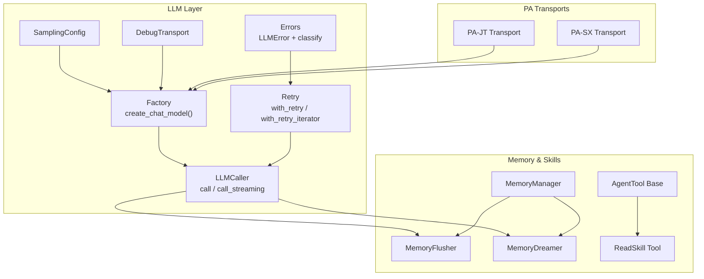
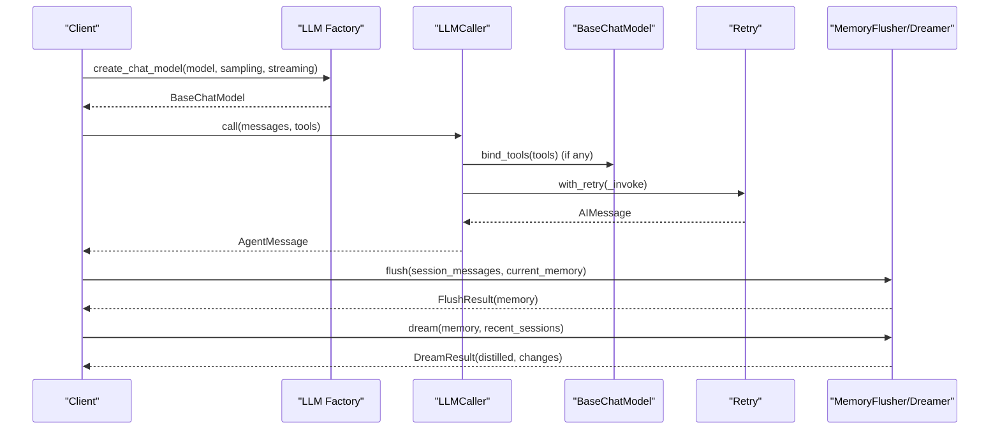
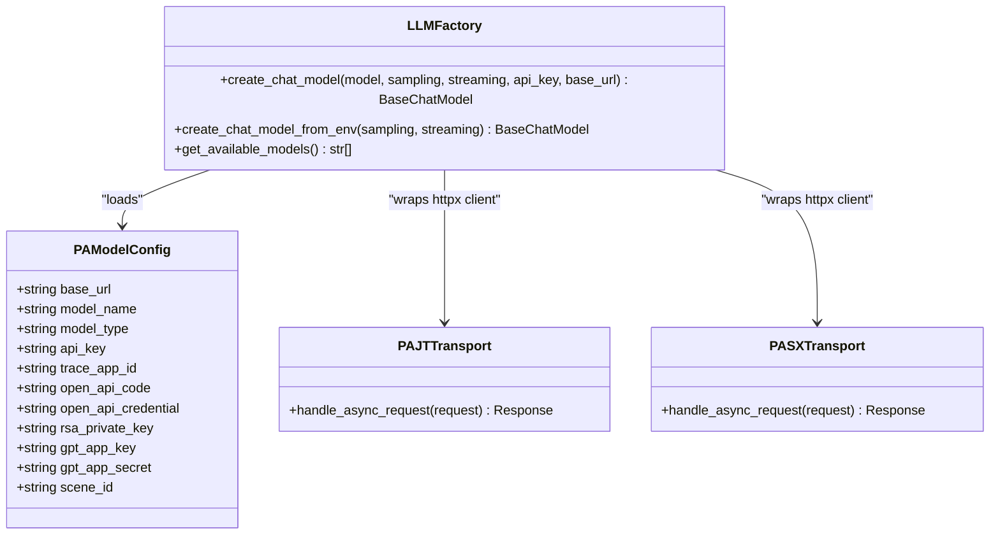
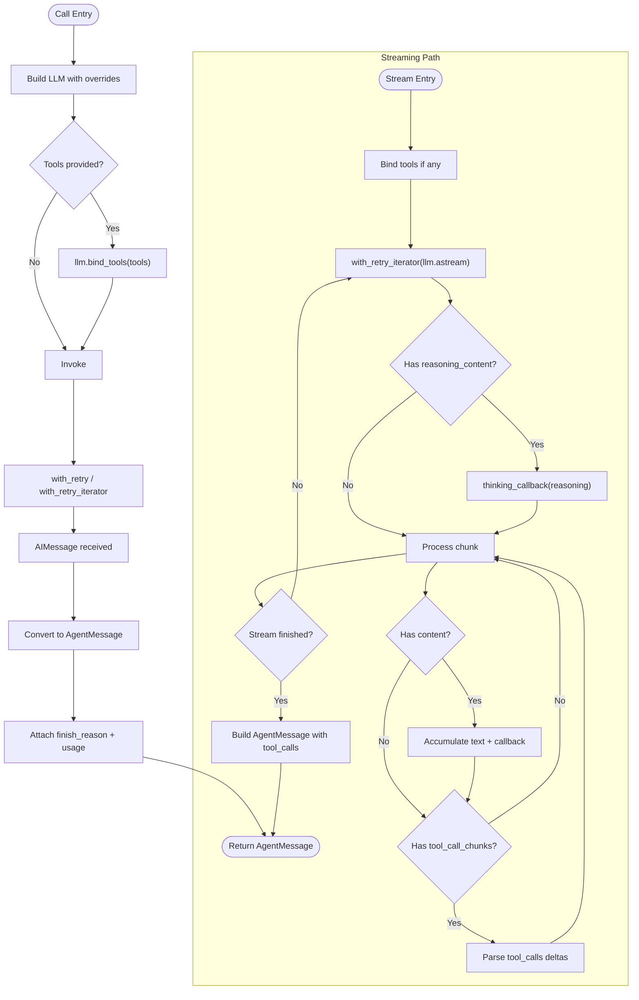
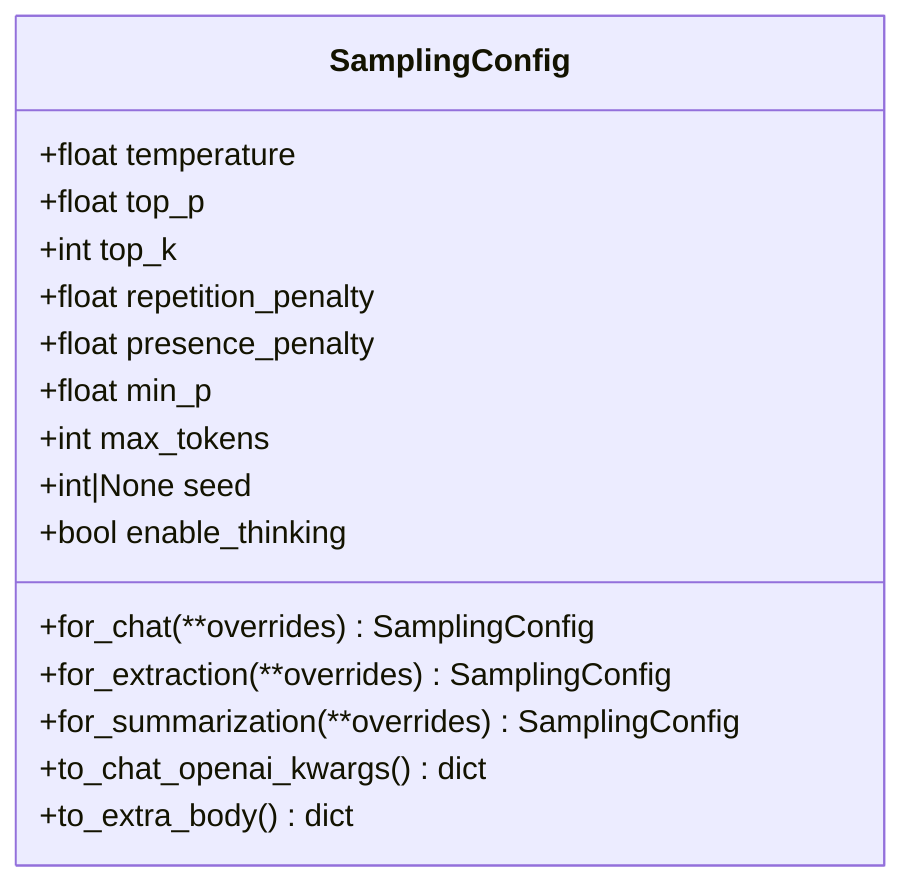
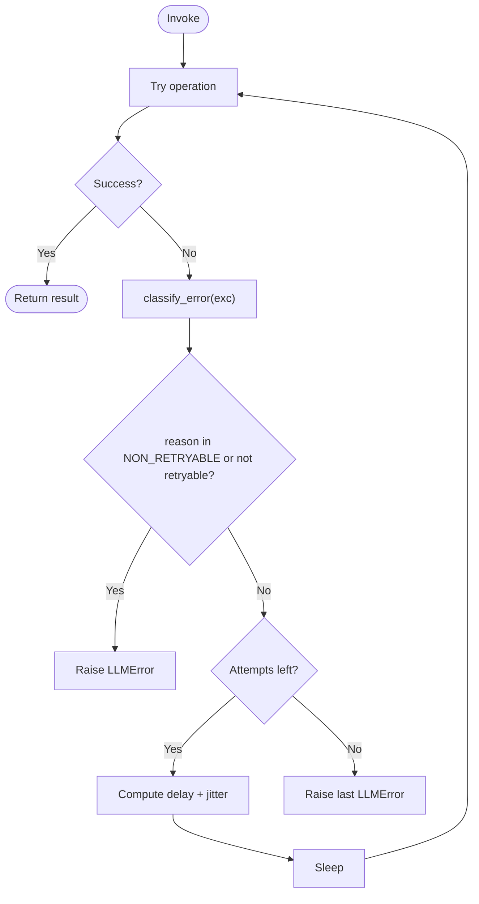
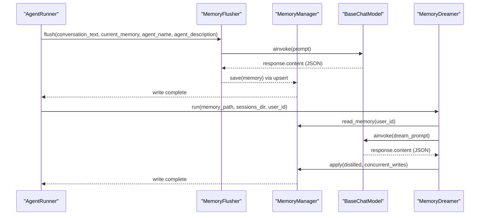
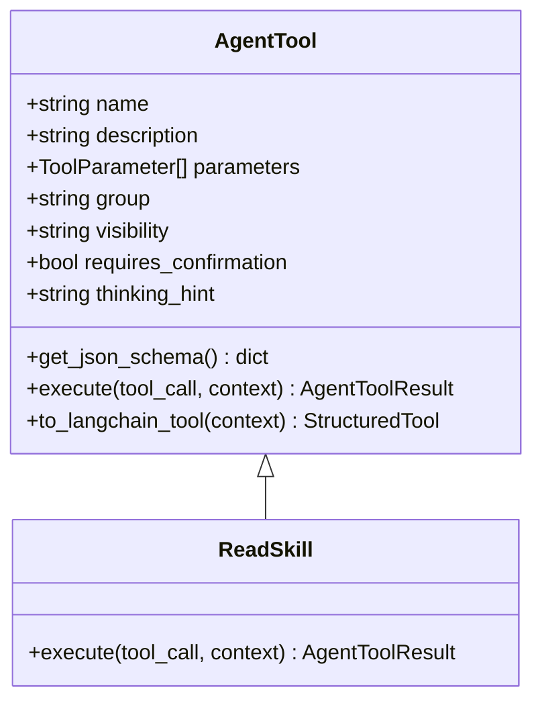
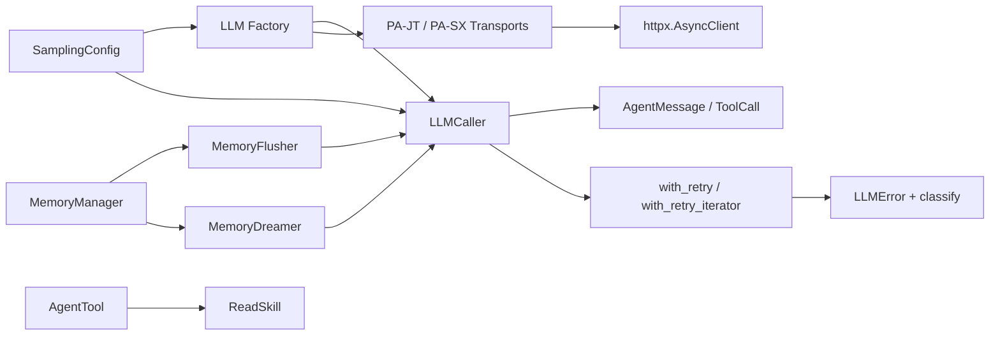

# LLM Enhanced Capabilities

<cite>
**Referenced Files in This Document**
- [caller.py](file://src/ark_agentic/core/llm/caller.py)
- [factory.py](file://src/ark_agentic/core/llm/factory.py)
- [pa_jt_llm.py](file://src/ark_agentic/core/llm/pa_jt_llm.py)
- [pa_sx_llm.py](file://src/ark_agentic/core/llm/pa_sx_llm.py)
- [sampling.py](file://src/ark_agentic/core/llm/sampling.py)
- [retry.py](file://src/ark_agentic/core/llm/retry.py)
- [errors.py](file://src/ark_agentic/core/llm/errors.py)
- [debug_transport.py](file://src/ark_agentic/core/llm/debug_transport.py)
- [dream.py](file://src/ark_agentic/core/memory/dream.py)
- [manager.py](file://src/ark_agentic/core/memory/manager.py)
- [extractor.py](file://src/ark_agentic/core/memory/extractor.py)
- [base.py](file://src/ark_agentic/core/tools/base.py)
- [read_skill.py](file://src/ark_agentic/core/tools/read_skill.py)
</cite>

## Table of Contents
1. [Introduction](#introduction)
2. [Project Structure](#project-structure)
3. [Core Components](#core-components)
4. [Architecture Overview](#architecture-overview)
5. [Detailed Component Analysis](#detailed-component-analysis)
6. [Dependency Analysis](#dependency-analysis)
7. [Performance Considerations](#performance-considerations)
8. [Troubleshooting Guide](#troubleshooting-guide)
9. [Conclusion](#conclusion)

## Introduction
This document explains the LLM enhanced capabilities implemented in the system, focusing on how the LLM client is constructed, how calls are executed (including streaming and tool-calling), how retries and error handling work, and how memory and skills leverage LLMs to provide persistent user context and dynamic behavior. It also covers the PA internal model transports and sampling configuration that ensures deterministic and efficient inference across different backends.

## Project Structure
The LLM enhanced capabilities span several modules:
- LLM client construction and transport: factory, PA-JT, PA-SX
- LLM invocation: caller, sampling, retry, error classification, debug transport
- Memory system: memory manager, pre-compaction flush, periodic dream distillation
- Tools and skills: base tool abstraction and skill activation

**Diagram sources**
- [factory.py:104-266](file://src/ark_agentic/core/llm/factory.py#L104-L266)
- [caller.py:26-218](file://src/ark_agentic/core/llm/caller.py#L26-L218)
- [sampling.py:14-97](file://src/ark_agentic/core/llm/sampling.py#L14-L97)
- [retry.py:45-162](file://src/ark_agentic/core/llm/retry.py#L45-L162)
- [errors.py:31-160](file://src/ark_agentic/core/llm/errors.py#L31-L160)
- [debug_transport.py:58-105](file://src/ark_agentic/core/llm/debug_transport.py#L58-L105)
- [pa_jt_llm.py:74-166](file://src/ark_agentic/core/llm/pa_jt_llm.py#L74-L166)
- [pa_sx_llm.py:25-86](file://src/ark_agentic/core/llm/pa_sx_llm.py#L25-L86)
- [manager.py:24-92](file://src/ark_agentic/core/memory/manager.py#L24-L92)
- [extractor.py:98-187](file://src/ark_agentic/core/memory/extractor.py#L98-L187)
- [dream.py:190-323](file://src/ark_agentic/core/memory/dream.py#L190-L323)
- [base.py:46-289](file://src/ark_agentic/core/tools/base.py#L46-L289)
- [read_skill.py:44-75](file://src/ark_agentic/core/tools/read_skill.py#L44-L75)

**Section sources**
- [factory.py:104-266](file://src/ark_agentic/core/llm/factory.py#L104-L266)
- [caller.py:26-218](file://src/ark_agentic/core/llm/caller.py#L26-L218)
- [sampling.py:14-97](file://src/ark_agentic/core/llm/sampling.py#L14-L97)
- [retry.py:45-162](file://src/ark_agentic/core/llm/retry.py#L45-L162)
- [errors.py:31-160](file://src/ark_agentic/core/llm/errors.py#L31-L160)
- [debug_transport.py:58-105](file://src/ark_agentic/core/llm/debug_transport.py#L58-L105)
- [pa_jt_llm.py:74-166](file://src/ark_agentic/core/llm/pa_jt_llm.py#L74-L166)
- [pa_sx_llm.py:25-86](file://src/ark_agentic/core/llm/pa_sx_llm.py#L25-L86)
- [manager.py:24-92](file://src/ark_agentic/core/memory/manager.py#L24-L92)
- [extractor.py:98-187](file://src/ark_agentic/core/memory/extractor.py#L98-L187)
- [dream.py:190-323](file://src/ark_agentic/core/memory/dream.py#L190-L323)
- [base.py:46-289](file://src/ark_agentic/core/tools/base.py#L46-L289)
- [read_skill.py:44-75](file://src/ark_agentic/core/tools/read_skill.py#L44-L75)

## Core Components
- LLM Factory: Creates ChatOpenAI instances for OpenAI-compatible models and PA internal models (PA-JT and PA-SX), injecting transport and sampling parameters.
- LLM Caller: Wraps LLM invocation, supports both non-streaming and streaming modes, converts outputs to AgentMessage, and routes Thinking model reasoning to a dedicated callback.
- Sampling Config: Centralized generation parameters (temperature, top-p, top-k, repetition penalty, min-p, seed, max-tokens, enable_thinking) with scene-specific presets.
- Retry and Error Classification: Robust retry with exponential backoff and jitter, plus structured error classification to distinguish retryable vs non-retryable failures.
- Memory System: Pre-compaction memory flush extracts relevant context into MEMORY.md; periodic dream distillation consolidates and prunes long-term memory.
- Tools and Skills: Standardized tool interface and skill activation mechanism to dynamically surface capabilities to the agent.

**Section sources**
- [factory.py:104-266](file://src/ark_agentic/core/llm/factory.py#L104-L266)
- [caller.py:26-218](file://src/ark_agentic/core/llm/caller.py#L26-L218)
- [sampling.py:14-97](file://src/ark_agentic/core/llm/sampling.py#L14-L97)
- [retry.py:45-162](file://src/ark_agentic/core/llm/retry.py#L45-L162)
- [errors.py:31-160](file://src/ark_agentic/core/llm/errors.py#L31-L160)
- [extractor.py:98-187](file://src/ark_agentic/core/memory/extractor.py#L98-L187)
- [dream.py:190-323](file://src/ark_agentic/core/memory/dream.py#L190-L323)
- [base.py:46-289](file://src/ark_agentic/core/tools/base.py#L46-L289)
- [read_skill.py:44-75](file://src/ark_agentic/core/tools/read_skill.py#L44-L75)

## Architecture Overview
The LLM enhanced capabilities form a cohesive pipeline:
- Construction: Factory builds a BaseChatModel with appropriate transport and sampling.
- Invocation: Caller executes non-streaming or streaming calls, handles tool binding, and parses outputs.
- Reliability: Retry and error classification ensure resilient operation under network and backend variability.
- Memory: Flush captures relevant context before context compression; Dream periodically distills long-term memory.
- Skills: Tools and skill activation provide dynamic capability surfaces.

**Diagram sources**
- [factory.py:104-266](file://src/ark_agentic/core/llm/factory.py#L104-L266)
- [caller.py:70-192](file://src/ark_agentic/core/llm/caller.py#L70-L192)
- [retry.py:45-97](file://src/ark_agentic/core/llm/retry.py#L45-L97)
- [extractor.py:108-187](file://src/ark_agentic/core/memory/extractor.py#L108-L187)
- [dream.py:196-323](file://src/ark_agentic/core/memory/dream.py#L196-L323)

## Detailed Component Analysis

### LLM Factory and Transports
The factory creates BaseChatModel instances:
- OpenAI-compatible models: injects API key and base URL, merges sampling parameters into ChatOpenAI kwargs and extra_body.
- PA-JT models: injects authentication headers via an async transport and adds scene_id and sampling to extra_body.
- PA-SX models: injects trace headers via an async transport and passes sampling via extra_body.

**Diagram sources**
- [factory.py:104-266](file://src/ark_agentic/core/llm/factory.py#L104-L266)
- [pa_jt_llm.py:74-166](file://src/ark_agentic/core/llm/pa_jt_llm.py#L74-L166)
- [pa_sx_llm.py:25-86](file://src/ark_agentic/core/llm/pa_sx_llm.py#L25-L86)

**Section sources**
- [factory.py:104-266](file://src/ark_agentic/core/llm/factory.py#L104-L266)
- [pa_jt_llm.py:74-166](file://src/ark_agentic/core/llm/pa_jt_llm.py#L74-L166)
- [pa_sx_llm.py:25-86](file://src/ark_agentic/core/llm/pa_sx_llm.py#L25-L86)

### LLM Caller and Streaming
The caller encapsulates:
- Non-streaming calls: binds tools, invokes, converts AIMessage to AgentMessage, attaches finish_reason and usage metadata.
- Streaming calls: iterates chunks, detects Thinking model reasoning_content, routes to thinking_callback, aggregates content and tool_calls, and returns AgentMessage with metadata.

**Diagram sources**
- [caller.py:70-192](file://src/ark_agentic/core/llm/caller.py#L70-L192)

**Section sources**
- [caller.py:26-218](file://src/ark_agentic/core/llm/caller.py#L26-L218)

### Sampling Configuration
SamplingConfig centralizes generation parameters:
- Scene presets: for_chat (default), for_extraction (deterministic), for_summarization (balanced).
- Parameter mapping: to_chat_openai_kwargs for OpenAI-compatible parameters; to_extra_body for vLLM/SGLang extensions including enable_thinking.

**Diagram sources**
- [sampling.py:14-97](file://src/ark_agentic/core/llm/sampling.py#L14-L97)

**Section sources**
- [sampling.py:14-97](file://src/ark_agentic/core/llm/sampling.py#L14-L97)

### Retry and Error Classification
Retry implements exponential backoff with jitter and distinguishes retryable vs non-retryable reasons. Error classification maps exceptions to structured LLMError with reason and retryable flag.

**Diagram sources**
- [retry.py:45-162](file://src/ark_agentic/core/llm/retry.py#L45-L162)
- [errors.py:55-160](file://src/ark_agentic/core/llm/errors.py#L55-L160)

**Section sources**
- [retry.py:45-162](file://src/ark_agentic/core/llm/retry.py#L45-L162)
- [errors.py:31-160](file://src/ark_agentic/core/llm/errors.py#L31-L160)

### Memory System: Flush and Dream
- MemoryFlusher: Extracts relevant information from conversation text into heading-based markdown and writes to MEMORY.md via MemoryManager.
- MemoryDreamer: Periodically distills memory with recent sessions, merges and prunes sections conservatively, and optimistically merges concurrent writes.

**Diagram sources**
- [extractor.py:98-187](file://src/ark_agentic/core/memory/extractor.py#L98-L187)
- [manager.py:24-92](file://src/ark_agentic/core/memory/manager.py#L24-L92)
- [dream.py:190-323](file://src/ark_agentic/core/memory/dream.py#L190-L323)

**Section sources**
- [extractor.py:98-187](file://src/ark_agentic/core/memory/extractor.py#L98-L187)
- [manager.py:24-92](file://src/ark_agentic/core/memory/manager.py#L24-L92)
- [dream.py:190-323](file://src/ark_agentic/core/memory/dream.py#L190-L323)

### Tools and Skills
- AgentTool: Base class defining tool schema, parameters, and execution contract; provides JSON schema for function calling and optional LangChain adapter.
- ReadSkill: Dynamically activates a skill by ID and returns a digest with state delta indicating the active skill.

**Diagram sources**
- [base.py:46-289](file://src/ark_agentic/core/tools/base.py#L46-L289)
- [read_skill.py:44-75](file://src/ark_agentic/core/tools/read_skill.py#L44-L75)

**Section sources**
- [base.py:46-289](file://src/ark_agentic/core/tools/base.py#L46-L289)
- [read_skill.py:44-75](file://src/ark_agentic/core/tools/read_skill.py#L44-L75)

## Dependency Analysis
The LLM layer depends on LangChain’s BaseChatModel and integrates with httpx for transport customization. Memory and tools depend on the LLM caller for extraction and summarization tasks. There is low coupling between modules, with clear separation of concerns.

**Diagram sources**
- [caller.py:26-218](file://src/ark_agentic/core/llm/caller.py#L26-L218)
- [factory.py:104-266](file://src/ark_agentic/core/llm/factory.py#L104-L266)
- [pa_jt_llm.py:74-166](file://src/ark_agentic/core/llm/pa_jt_llm.py#L74-L166)
- [pa_sx_llm.py:25-86](file://src/ark_agentic/core/llm/pa_sx_llm.py#L25-L86)
- [sampling.py:14-97](file://src/ark_agentic/core/llm/sampling.py#L14-L97)
- [retry.py:45-162](file://src/ark_agentic/core/llm/retry.py#L45-L162)
- [errors.py:31-160](file://src/ark_agentic/core/llm/errors.py#L31-L160)
- [extractor.py:98-187](file://src/ark_agentic/core/memory/extractor.py#L98-L187)
- [dream.py:190-323](file://src/ark_agentic/core/memory/dream.py#L190-L323)
- [manager.py:24-92](file://src/ark_agentic/core/memory/manager.py#L24-L92)
- [base.py:46-289](file://src/ark_agentic/core/tools/base.py#L46-L289)
- [read_skill.py:44-75](file://src/ark_agentic/core/tools/read_skill.py#L44-L75)

**Section sources**
- [caller.py:26-218](file://src/ark_agentic/core/llm/caller.py#L26-L218)
- [factory.py:104-266](file://src/ark_agentic/core/llm/factory.py#L104-L266)
- [pa_jt_llm.py:74-166](file://src/ark_agentic/core/llm/pa_jt_llm.py#L74-L166)
- [pa_sx_llm.py:25-86](file://src/ark_agentic/core/llm/pa_sx_llm.py#L25-L86)
- [sampling.py:14-97](file://src/ark_agentic/core/llm/sampling.py#L14-L97)
- [retry.py:45-162](file://src/ark_agentic/core/llm/retry.py#L45-L162)
- [errors.py:31-160](file://src/ark_agentic/core/llm/errors.py#L31-L160)
- [extractor.py:98-187](file://src/ark_agentic/core/memory/extractor.py#L98-L187)
- [dream.py:190-323](file://src/ark_agentic/core/memory/dream.py#L190-L323)
- [manager.py:24-92](file://src/ark_agentic/core/memory/manager.py#L24-L92)
- [base.py:46-289](file://src/ark_agentic/core/tools/base.py#L46-L289)
- [read_skill.py:44-75](file://src/ark_agentic/core/tools/read_skill.py#L44-L75)

## Performance Considerations
- Deterministic sampling: Extraction and summarization presets reduce variance and improve reproducibility.
- Streaming Thinking models: Separate reasoning_content routing enables responsive UI while preserving reasoning visibility.
- Retry strategy: Exponential backoff with jitter reduces thundering herd and improves resilience.
- Token budgeting: Memory flush caps conversation size and Dream applies conservative pruning to stay within limits.
- Transport efficiency: PA transports inject headers only, avoiding body mutations and ensuring correct Content-Length.

[No sources needed since this section provides general guidance]

## Troubleshooting Guide
Common issues and resolutions:
- Authentication or quota errors: Detected by error classification; do not retry automatically. Verify API keys and quotas.
- Rate limit or server errors: Retryable; inspect logs for retry attempts and delays.
- Context overflow: Requires reducing input tokens or enabling compaction.
- Network errors: Retryable; check connectivity and proxy settings.
- Streaming interruptions: First-chunk failures are retried; later interruptions are treated as fatal to avoid duplication.
- Debugging HTTP traffic: Enable DEBUG_HTTP to capture request/response and streaming chunks.

**Section sources**
- [errors.py:55-160](file://src/ark_agentic/core/llm/errors.py#L55-L160)
- [retry.py:45-162](file://src/ark_agentic/core/llm/retry.py#L45-L162)
- [debug_transport.py:58-105](file://src/ark_agentic/core/llm/debug_transport.py#L58-L105)

## Conclusion
The LLM enhanced capabilities integrate a robust, extensible LLM client stack with reliable invocation, deterministic sampling, and resilient retries. The memory system leverages LLMs for context extraction and periodic distillation, while tools and skills provide dynamic, capability-driven agent behavior. Together, these components deliver a production-ready foundation for agentics with strong reliability and maintainability.