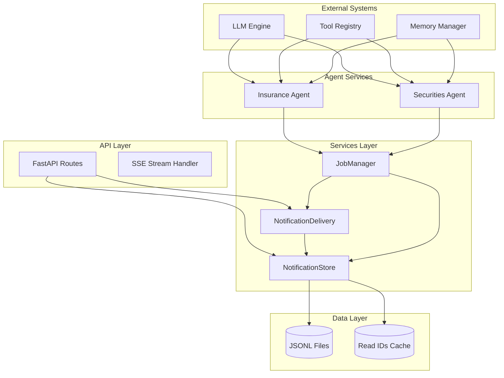
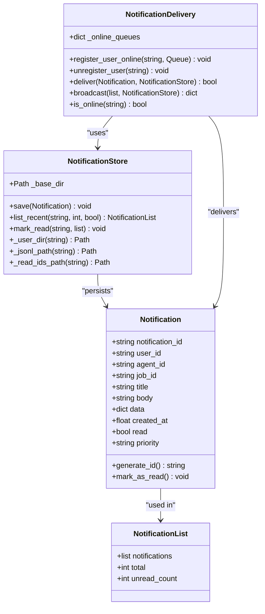
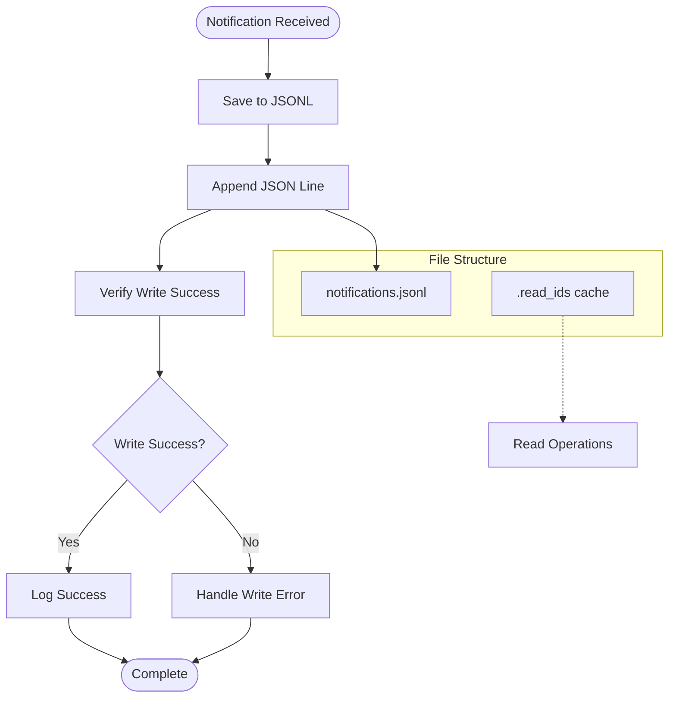
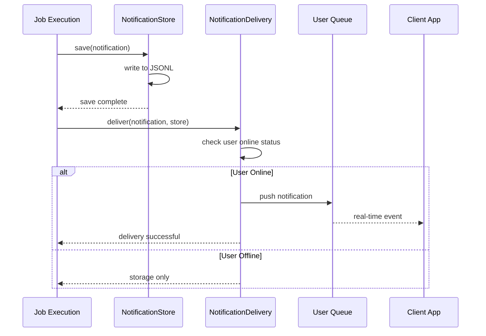
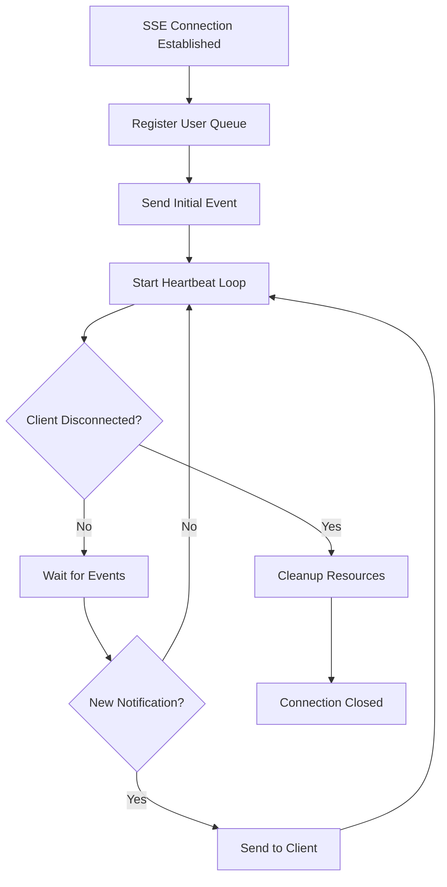
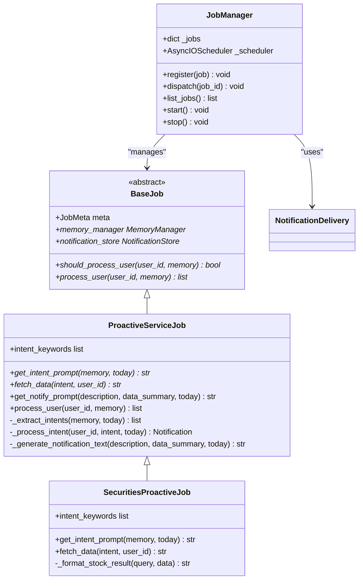

# Notification System

<cite>
**Referenced Files in This Document**
- [__init__.py](file://src/ark_agentic/services/notifications/__init__.py)
- [models.py](file://src/ark_agentic/services/notifications/models.py)
- [store.py](file://src/ark_agentic/services/notifications/store.py)
- [delivery.py](file://src/ark_agentic/services/notifications/delivery.py)
- [paths.py](file://src/ark_agentic/services/notifications/paths.py)
- [notifications.py](file://src/ark_agentic/api/notifications.py)
- [proactive_service.py](file://src/ark_agentic/services/jobs/proactive_service.py)
- [manager.py](file://src/ark_agentic/services/jobs/manager.py)
- [base.py](file://src/ark_agentic/services/jobs/base.py)
- [app.py](file://src/ark_agentic/app.py)
</cite>

## Update Summary
**Changes Made**
- Updated all file paths to reflect the move from `core/notifications/` to `services/notifications/` module
- Updated architecture diagrams to show the new module location
- Revised API integration examples to use the new import paths
- Updated job integration examples to reflect the new services/jobs module structure
- Enhanced documentation to emphasize the improved separation of concerns and independent testing capabilities

## Table of Contents
1. [Introduction](#introduction)
2. [System Architecture](#system-architecture)
3. [Core Components](#core-components)
4. [Data Model](#data-model)
5. [Storage Implementation](#storage-implementation)
6. [Delivery System](#delivery-system)
7. [API Endpoints](#api-endpoints)
8. [Job Integration](#job-integration)
9. [Security and Privacy](#security-and-privacy)
10. [Performance Considerations](#performance-considerations)
11. [Troubleshooting Guide](#troubleshooting-guide)
12. [Conclusion](#conclusion)

## Introduction

The Notification System is a comprehensive real-time messaging infrastructure designed for the Ark-Agentic platform. It provides proactive service notifications to users across different agent domains (insurance, securities) with both persistent storage and live streaming capabilities. The system supports real-time SSE (Server-Sent Events) streaming for online users and persistent JSONL file storage for offline retrieval.

**Updated** The notification services have been moved from the core layer to the services layer, improving separation of concerns and enabling independent testing of notification functionality.

Key features include:
- Real-time notification delivery via SSE streams
- Persistent storage using JSONL files for reliability
- Multi-agent support with agent-specific isolation
- Priority-based notification handling
- Unread count tracking and read management
- Configurable job scheduling for proactive notifications

## System Architecture

The notification system follows a layered architecture with clear separation of concerns, now organized within the services module:



**Diagram sources**
- [app.py:52-120](file://src/ark_agentic/app.py#L52-L120)
- [delivery.py:22-88](file://src/ark_agentic/services/notifications/delivery.py#L22-L88)
- [store.py:25-126](file://src/ark_agentic/services/notifications/store.py#L25-L126)

## Core Components

### Notification Models

The system defines two primary data models for notification handling within the services module:



**Diagram sources**
- [models.py:12-29](file://src/ark_agentic/services/notifications/models.py#L12-L29)
- [store.py:25-126](file://src/ark_agentic/services/notifications/store.py#L25-L126)
- [delivery.py:22-88](file://src/ark_agentic/services/notifications/delivery.py#L22-L88)

**Section sources**
- [models.py:12-29](file://src/ark_agentic/services/notifications/models.py#L12-L29)
- [store.py:25-126](file://src/ark_agentic/services/notifications/store.py#L25-L126)
- [delivery.py:22-88](file://src/ark_agentic/services/notifications/delivery.py#L22-L88)

## Data Model

### Notification Structure

The Notification model encapsulates all essential information for user communication:

| Field | Type | Description | Default |
|-------|------|-------------|---------|
| notification_id | string | Unique identifier for the notification | Generated UUID |
| user_id | string | Target user identifier | Required |
| agent_id | string | Originating agent (insurance/securities) | Empty |
| job_id | string | Source job identifier | Required |
| title | string | Notification headline | Required |
| body | string | Main content (Markdown supported) | Required |
| data | dict | Structured metadata | Empty dict |
| created_at | float | Unix timestamp | Current time |
| read | bool | Read status flag | False |
| priority | string | Priority level (low/normal/high) | "normal" |

### Storage Organization

Notifications are organized in a hierarchical directory structure within the services module:
```
data/
└── ark_notifications/
    ├── {agent_id}/
    │   └── {user_id}/
    │       ├── notifications.jsonl
    │       └── .read_ids
```

**Section sources**
- [models.py:12-29](file://src/ark_agentic/services/notifications/models.py#L12-L29)
- [store.py:5-8](file://src/ark_agentic/services/notifications/store.py#L5-L8)

## Storage Implementation

### File-Based Persistence

The system uses JSONL (JSON Lines) format for efficient append-only operations:



**Diagram sources**
- [store.py:43-52](file://src/ark_agentic/services/notifications/store.py#L43-L52)

### Read Management

The system maintains a separate cache file for read notification IDs to optimize lookup performance:

- **Format**: Plain text file with one notification ID per line
- **Location**: `{user_dir}/.read_ids`
- **Operations**: Set-based union for efficient merging
- **Memory**: Loaded into memory as a Python set for O(1) lookup

**Section sources**
- [store.py:107-126](file://src/ark_agentic/services/notifications/store.py#L107-L126)

## Delivery System

### Real-Time Streaming

The delivery system implements a hybrid approach combining persistent storage with real-time streaming:



**Diagram sources**
- [delivery.py:46-77](file://src/ark_agentic/services/notifications/delivery.py#L46-L77)

### Queue Management

The system uses bounded queues to prevent memory exhaustion:

- **Maximum Queue Size**: 100 notifications
- **Stream Key Format**: `{agent_id}:{user_id}` for agent isolation
- **Automatic Cleanup**: Queues removed on client disconnect
- **Heartbeat Support**: 30-second keepalive intervals

**Section sources**
- [delivery.py:18-43](file://src/ark_agentic/services/notifications/delivery.py#L18-L43)
- [delivery.py:64-76](file://src/ark_agentic/services/notifications/delivery.py#L64-L76)

## API Endpoints

### REST API Endpoints

The system exposes three main REST endpoints for notification management:

| Endpoint | Method | Description | Parameters |
|----------|--------|-------------|------------|
| `/api/notifications/{agent_id}/{user_id}` | GET | Fetch notification history | `limit` (default: 50), `unread` (boolean) |
| `/api/notifications/{agent_id}/{user_id}/read` | POST | Mark notifications as read | `ids`: array of notification IDs |
| `/api/notifications/{agent_id}/{user_id}/stream` | GET | SSE real-time stream | None |

### SSE Implementation Details

The SSE endpoint provides real-time bidirectional communication:



**Diagram sources**
- [notifications.py:66-112](file://src/ark_agentic/api/notifications.py#L66-L112)

**Section sources**
- [notifications.py:39-112](file://src/ark_agentic/api/notifications.py#L39-L112)

## Job Integration

### Proactive Service Architecture

The notification system integrates with the job scheduling framework for automated proactive notifications:



**Diagram sources**
- [base.py:56-103](file://src/ark_agentic/services/jobs/base.py#L56-L103)
- [proactive_service.py:49-221](file://src/ark_agentic/services/jobs/proactive_service.py#L49-L221)
- [manager.py:41-123](file://src/ark_agentic/services/jobs/manager.py#L41-L123)

### Job Configuration

Each proactive job is configured with specific parameters:

| Parameter | Type | Default | Description |
|-----------|------|---------|-------------|
| job_id | string | "proactive_service" | Unique job identifier |
| cron | string | "0 9 * * *" | Daily execution schedule |
| max_concurrent_users | int | 50 | Concurrency limit |
| batch_size | int | 500 | Users per batch |
| user_timeout_secs | float | 45.0 | Per-user processing timeout |

**Section sources**
- [proactive_service.py:98-135](file://src/ark_agentic/services/jobs/proactive_service.py#L98-L135)
- [manager.py:44-74](file://src/ark_agentic/services/jobs/manager.py#L44-L74)

## Security and Privacy

### Data Isolation

The system implements strict data isolation between different agents and users:

- **Agent Isolation**: Each agent maintains separate notification directories
- **User Isolation**: Individual user directories prevent cross-user data leakage
- **File Permissions**: Proper directory creation with appropriate permissions

### Privacy Considerations

- **Minimal Data Collection**: Notifications only contain necessary information
- **Structured Metadata**: Sensitive data is kept in structured `data` field
- **Access Control**: API endpoints require proper authentication context

**Section sources**
- [store.py:32-39](file://src/ark_agentic/services/notifications/store.py#L32-L39)
- [notifications.py:10-12](file://src/ark_agentic/api/notifications.py#L10-L12)

## Performance Considerations

### Storage Optimization

The system employs several strategies for optimal performance:

- **JSONL Format**: Efficient append-only writes without file locking
- **Tail Reading**: Reads only recent lines (default 200) to avoid full file scans
- **Memory Caching**: Read IDs cached in memory for O(1) lookup
- **Asynchronous Operations**: All I/O operations use thread pools to prevent blocking

### Concurrency Management

- **Queue Boundedness**: Prevents memory leaks during high-load scenarios
- **Job Concurrency Limits**: Configurable limits prevent resource exhaustion
- **Timeout Handling**: Graceful degradation when operations exceed time limits

### Scalability Features

- **Sharding Support**: Built-in support for horizontal scaling
- **Agent Isolation**: Independent processing per agent domain
- **Batch Processing**: Efficient handling of large user bases

**Section sources**
- [store.py:21-22](file://src/ark_agentic/services/notifications/store.py#L21-L22)
- [delivery.py:18-19](file://src/ark_agentic/services/notifications/delivery.py#L18-L19)
- [manager.py:81-89](file://src/ark_agentic/services/jobs/manager.py#L81-L89)

## Troubleshooting Guide

### Common Issues and Solutions

#### Notification Not Delivered
1. **Check User Online Status**: Verify client has active SSE connection
2. **Queue Capacity**: Monitor queue size (maximum 100 messages)
3. **Network Connectivity**: Ensure client can maintain persistent connection

#### Storage Issues
1. **File Permissions**: Verify write access to notification directories
2. **Disk Space**: Monitor available storage for JSONL files
3. **File Corruption**: Check for malformed JSON lines in notifications.jsonl

#### Performance Problems
1. **Queue Backlog**: Monitor unread_count growth
2. **Memory Usage**: Check read IDs cache size
3. **I/O Bottlenecks**: Profile JSONL write/read operations

### Monitoring and Logging

The system provides comprehensive logging at multiple levels:

- **Debug Level**: Detailed operation traces
- **Info Level**: Normal operational information
- **Warning Level**: Potential issues and recoverable errors
- **Error Level**: Critical failures requiring attention

**Section sources**
- [store.py:19](file://src/ark_agentic/services/notifications/store.py#L19)
- [delivery.py:16](file://src/ark_agentic/services/notifications/delivery.py#L16)

## Conclusion

The Notification System provides a robust, scalable foundation for real-time user communication within the Ark-Agentic platform. Its hybrid approach combining persistent storage with live streaming ensures reliable message delivery while maintaining excellent performance characteristics.

**Updated** The recent refactoring to move notification services from the core layer to the services layer has significantly improved the system's architecture by:

- **Enhanced Separation of Concerns**: Clear distinction between core platform logic and notification-specific functionality
- **Independent Testing Capabilities**: Notification services can now be tested in isolation without loading the entire core system
- **Improved Modularity**: Better organization of related functionality within the services namespace
- **Maintained API Compatibility**: All external interfaces remain unchanged while internal structure is cleaner

Key strengths include:
- **Reliability**: JSONL-based persistence prevents data loss
- **Real-time Capabilities**: SSE streaming provides instant user feedback
- **Scalability**: Built-in support for concurrent processing and horizontal scaling
- **Isolation**: Strict separation between agents and users
- **Flexibility**: Configurable job scheduling and notification priorities
- **Testability**: Improved modularity enables comprehensive unit testing

The system successfully balances performance requirements with reliability needs, making it suitable for production deployment in enterprise environments. Future enhancements could include message deduplication, advanced filtering capabilities, and enhanced monitoring dashboards.