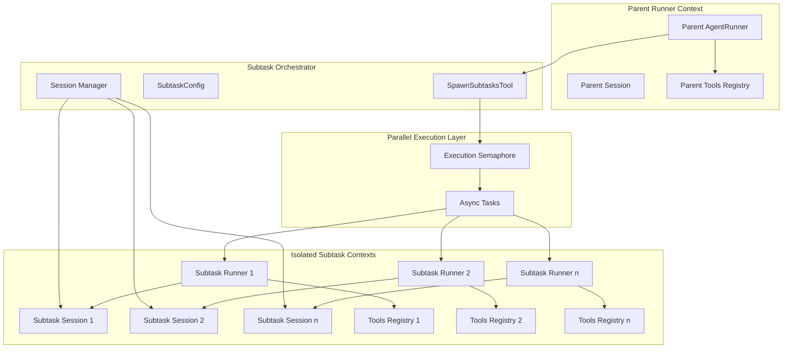
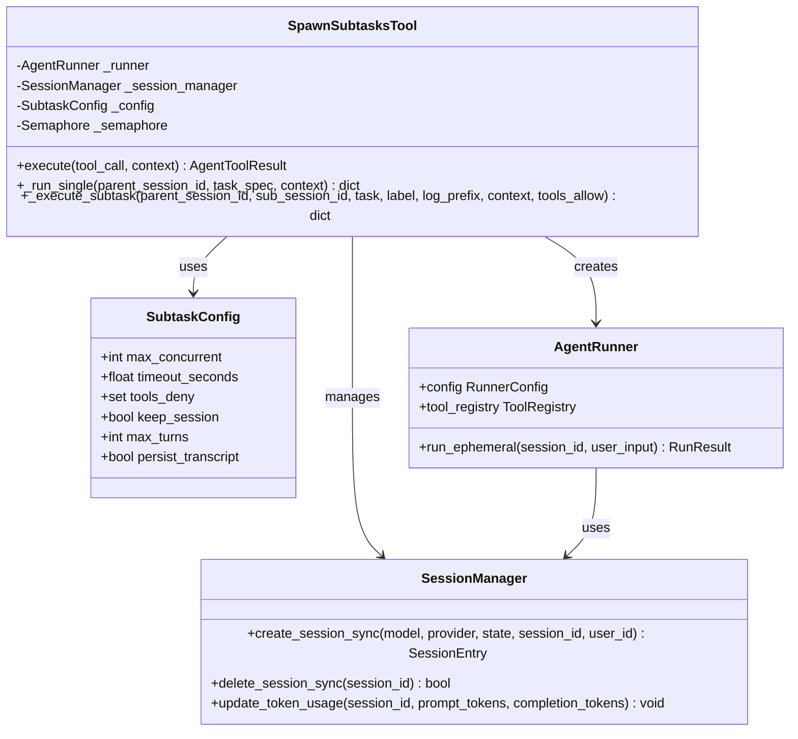
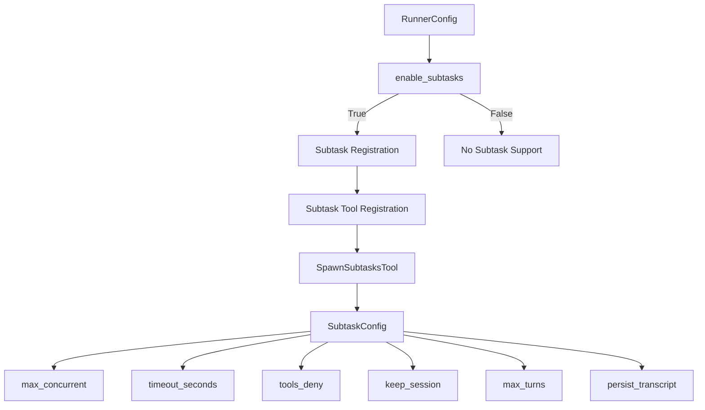
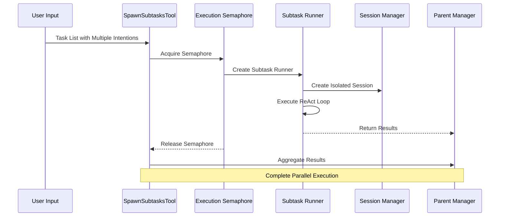
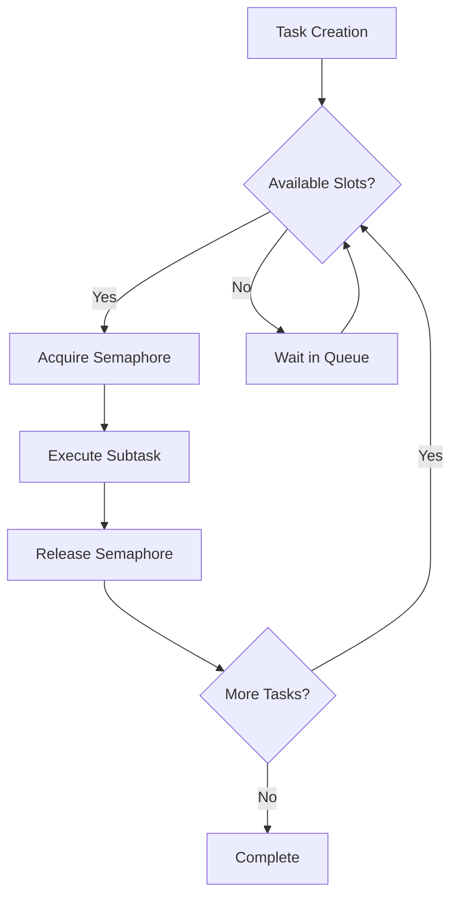
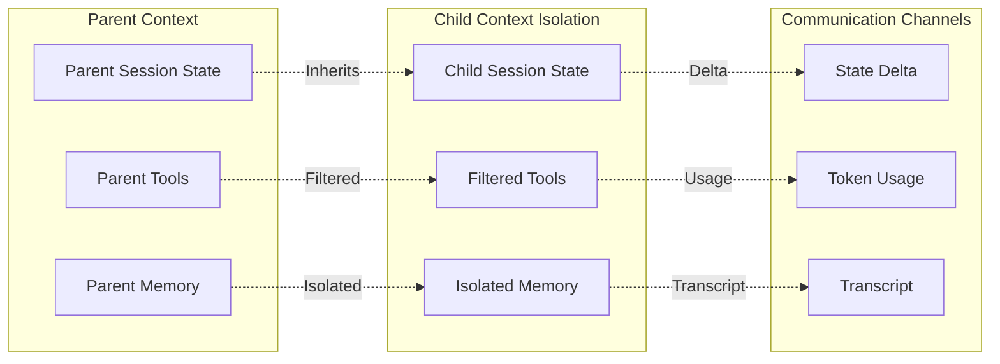
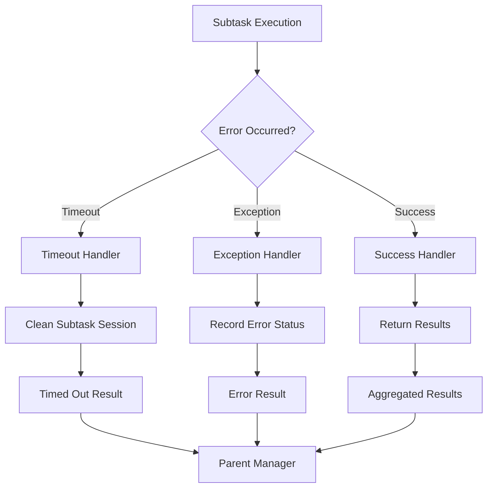

# Parallel Subtask System

<cite>
**Referenced Files in This Document**
- [tool.py](file://src/ark_agentic/core/subtask/tool.py)
- [test_subtask_tool.py](file://tests/unit/core/test_subtask_tool.py)
- [runner.py](file://src/ark_agentic/core/runner.py)
- [executor.py](file://src/ark_agentic/core/tools/executor.py)
- [types.py](file://src/ark_agentic/core/types.py)
- [session.py](file://src/ark_agentic/core/session.py)
- [registry.py](file://src/ark_agentic/core/tools/registry.py)
- [base.py](file://src/ark_agentic/core/tools/base.py)
</cite>

## Table of Contents
1. [Introduction](#introduction)
2. [System Architecture](#system-architecture)
3. [Core Components](#core-components)
4. [Configuration Management](#configuration-management)
5. [Execution Flow](#execution-flow)
6. [Concurrency Control](#concurrency-control)
7. [Context Isolation](#context-isolation)
8. [Error Handling](#error-handling)
9. [Performance Considerations](#performance-considerations)
10. [Integration Patterns](#integration-patterns)
11. [Testing Strategy](#testing-strategy)
12. [Conclusion](#conclusion)

## Introduction

The Parallel Subtask System is a sophisticated concurrency mechanism designed to handle multiple independent tasks within a single user interaction. This system enables intelligent agents to process complex user requests that contain multiple distinct intents simultaneously, providing true parallel execution with complete context isolation between tasks.

The system operates on the principle that modern AI agents often receive user inputs containing multiple independent requests (e.g., "I want to check my policy details and also inquire about withdrawal amounts"). Instead of processing these sequentially, the Parallel Subtask System creates separate execution contexts for each task, allowing them to run concurrently while maintaining complete isolation.

## System Architecture

The Parallel Subtask System is built around several key architectural principles:



**Diagram sources**
- [tool.py:61-102](file://src/ark_agentic/core/subtask/tool.py#L61-L102)
- [runner.py:220-225](file://src/ark_agentic/core/runner.py#L220-L225)

The architecture ensures complete isolation between parent and child contexts while maintaining efficient resource utilization through controlled concurrency.

## Core Components

### SpawnSubtasksTool

The `SpawnSubtasksTool` serves as the primary orchestrator for parallel task execution. It implements the core logic for creating, managing, and coordinating multiple subtasks.



**Diagram sources**
- [tool.py:61-318](file://src/ark_agentic/core/subtask/tool.py#L61-L318)
- [runner.py:153-304](file://src/ark_agentic/core/runner.py#L153-L304)

**Section sources**
- [tool.py:61-102](file://src/ark_agentic/core/subtask/tool.py#L61-L102)
- [tool.py:104-163](file://src/ark_agentic/core/subtask/tool.py#L104-L163)

### SubtaskConfig

The `SubtaskConfig` class encapsulates all configuration parameters for subtask execution, providing fine-grained control over concurrency, timeouts, and resource management.

Key configuration parameters include:
- `max_concurrent`: Maximum number of parallel subtasks (default: 4)
- `timeout_seconds`: Individual subtask timeout (default: 300.0 seconds)
- `tools_deny`: Tools prohibited in subtask contexts (default: {"memory_write"})
- `keep_session`: Whether to retain subtask sessions after completion
- `max_turns`: Maximum ReAct turns per subtask
- `persist_transcript`: Whether to include conversation transcripts in results

**Section sources**
- [tool.py:32-42](file://src/ark_agentic/core/subtask/tool.py#L32-L42)

## Configuration Management

The system provides flexible configuration management through the `RunnerConfig` class, which integrates seamlessly with the subtask system:



**Diagram sources**
- [runner.py:58-84](file://src/ark_agentic/core/runner.py#L58-L84)
- [runner.py:220-225](file://src/ark_agentic/core/runner.py#L220-L225)

**Section sources**
- [runner.py:58-84](file://src/ark_agentic/core/runner.py#L58-L84)
- [runner.py:220-225](file://src/ark_agentic/core/runner.py#L220-L225)

## Execution Flow

The execution flow follows a well-defined pattern that ensures reliability and performance:



**Diagram sources**
- [tool.py:121-163](file://src/ark_agentic/core/subtask/tool.py#L121-L163)
- [tool.py:198-309](file://src/ark_agentic/core/subtask/tool.py#L198-L309)

The execution flow ensures that:
1. Tasks are processed in parallel using asyncio.gather
2. Each subtask maintains complete context isolation
3. Resource limits are enforced through semaphores
4. Results are aggregated and returned to the parent context

**Section sources**
- [tool.py:121-163](file://src/ark_agentic/core/subtask/tool.py#L121-L163)
- [tool.py:198-309](file://src/ark_agentic/core/subtask/tool.py#L198-L309)

## Concurrency Control

The system implements sophisticated concurrency control mechanisms to prevent resource exhaustion and ensure system stability:



**Diagram sources**
- [tool.py:102](file://src/ark_agentic/core/subtask/tool.py#L102)
- [tool.py:181-196](file://src/ark_agentic/core/subtask/tool.py#L181-L196)

Concurrency control features include:
- **Semaphore-based throttling**: Prevents unlimited concurrent subtasks
- **Individual task timeouts**: Ensures no single task can monopolize resources
- **Queue management**: Handles overflow scenarios gracefully
- **Resource cleanup**: Automatic cleanup of completed subtasks

**Section sources**
- [tool.py:102](file://src/ark_agentic/core/subtask/tool.py#L102)
- [tool.py:181-196](file://src/ark_agentic/core/subtask/tool.py#L181-L196)

## Context Isolation

The system provides complete context isolation between parent and child execution contexts:



**Diagram sources**
- [tool.py:217-232](file://src/ark_agentic/core/subtask/tool.py#L217-L232)
- [tool.py:261-266](file://src/ark_agentic/core/subtask/tool.py#L261-L266)

Context isolation mechanisms include:
- **State inheritance**: Child sessions inherit user-related state from parents
- **Tool filtering**: Subtasks operate with filtered tool sets
- **Memory isolation**: Each subtask has isolated memory context
- **Session markers**: Prevents nested subtask creation

**Section sources**
- [tool.py:217-232](file://src/ark_agentic/core/subtask/tool.py#L217-L232)
- [tool.py:261-266](file://src/ark_agentic/core/subtask/tool.py#L261-L266)

## Error Handling

The system implements comprehensive error handling strategies:



**Diagram sources**
- [tool.py:190-196](file://src/ark_agentic/core/subtask/tool.py#L190-L196)
- [tool.py:299-305](file://src/ark_agentic/core/subtask/tool.py#L299-L305)

Error handling capabilities include:
- **Timeout detection**: Automatic cleanup of hanging subtasks
- **Exception propagation**: Graceful handling of runtime errors
- **State cleanup**: Proper cleanup of resources on failure
- **Result aggregation**: Consistent result format regardless of individual task outcomes

**Section sources**
- [tool.py:190-196](file://src/ark_agentic/core/subtask/tool.py#L190-L196)
- [tool.py:299-305](file://src/ark_agentic/core/subtask/tool.py#L299-L305)

## Performance Considerations

The system is designed for optimal performance through several key strategies:

### Resource Management
- **Connection pooling**: Efficient reuse of LLM connections
- **Memory optimization**: Minimal memory footprint per subtask
- **CPU utilization**: Balanced parallelism vs. system capacity

### Execution Optimization
- **Batch processing**: Multiple subtasks processed simultaneously
- **Lazy initialization**: Subtasks created only when needed
- **Efficient serialization**: Optimized data transfer between contexts

### Monitoring and Metrics
- **Token usage tracking**: Real-time monitoring of resource consumption
- **Performance metrics**: Built-in timing and throughput measurements
- **Resource utilization**: System resource monitoring and alerting

**Section sources**
- [tool.py:144-149](file://src/ark_agentic/core/subtask/tool.py#L144-L149)
- [tool.py:270-276](file://src/ark_agentic/core/subtask/tool.py#L270-L276)

## Integration Patterns

The Parallel Subtask System integrates seamlessly with existing agent infrastructure:

### Tool Integration
The system registers automatically when enabled in the runner configuration:

```python
# Enable subtasks in runner configuration
runner_config = RunnerConfig(enable_subtasks=True)
```

### Session Management
Automatic session lifecycle management:
- **Creation**: Subtask sessions created with unique identifiers
- **Cleanup**: Automatic deletion of completed subtask sessions
- **Persistence**: Optional persistence of conversation transcripts

### Event Propagation
Results propagated back to parent context with:
- **State deltas**: Changes in session state
- **Token usage**: Aggregated resource consumption
- **Execution metrics**: Performance statistics

**Section sources**
- [runner.py:220-225](file://src/ark_agentic/core/runner.py#L220-L225)
- [tool.py:307-309](file://src/ark_agentic/core/subtask/tool.py#L307-L309)

## Testing Strategy

The system includes comprehensive testing coverage:

### Unit Tests
- **Concurrency validation**: Ensures parallel execution correctness
- **Isolation verification**: Confirms context separation
- **Error handling**: Validates timeout and exception scenarios
- **Configuration testing**: Tests various configuration combinations

### Integration Tests
- **End-to-end workflows**: Complete subtask execution chains
- **Performance benchmarks**: Throughput and latency measurements
- **Resource leak detection**: Memory and connection cleanup verification

### Test Scenarios
Common test scenarios include:
- Parallel execution of multiple independent tasks
- Nested subtask prevention
- Timeout handling and cleanup
- State inheritance and delta calculation
- Tool registry filtering

**Section sources**
- [test_subtask_tool.py:142-180](file://tests/unit/core/test_subtask_tool.py#L142-L180)
- [test_subtask_tool.py:218-245](file://tests/unit/core/test_subtask_tool.py#L218-L245)
- [test_subtask_tool.py:310-332](file://tests/unit/core/test_subtask_tool.py#L310-L332)

## Conclusion

The Parallel Subtask System represents a significant advancement in AI agent capability, enabling sophisticated handling of complex user requests through true parallel execution with complete context isolation. The system's design balances performance, reliability, and flexibility while maintaining clean architectural boundaries.

Key benefits include:
- **Enhanced user experience**: Faster response times for complex queries
- **Scalable architecture**: Efficient resource utilization under load
- **Robust error handling**: Graceful degradation and recovery
- **Flexible configuration**: Tunable parameters for different use cases
- **Comprehensive monitoring**: Built-in observability and metrics

The system's modular design ensures easy integration with existing agent infrastructure while providing the foundation for future enhancements and extensions.