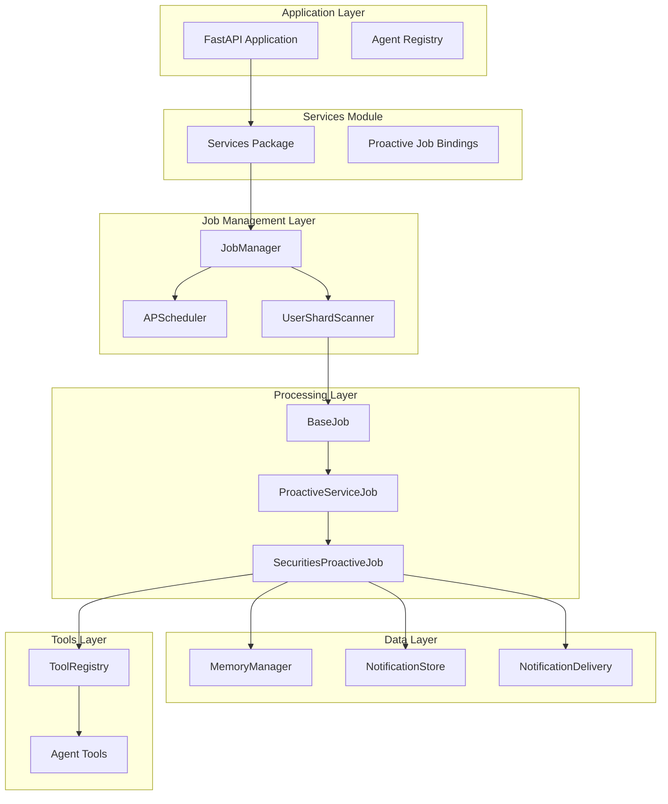
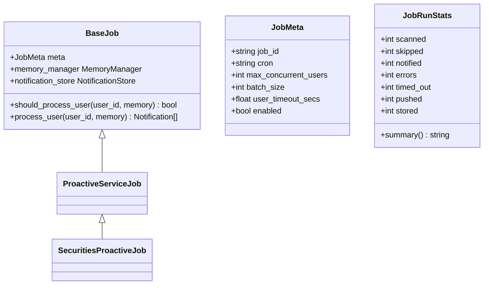
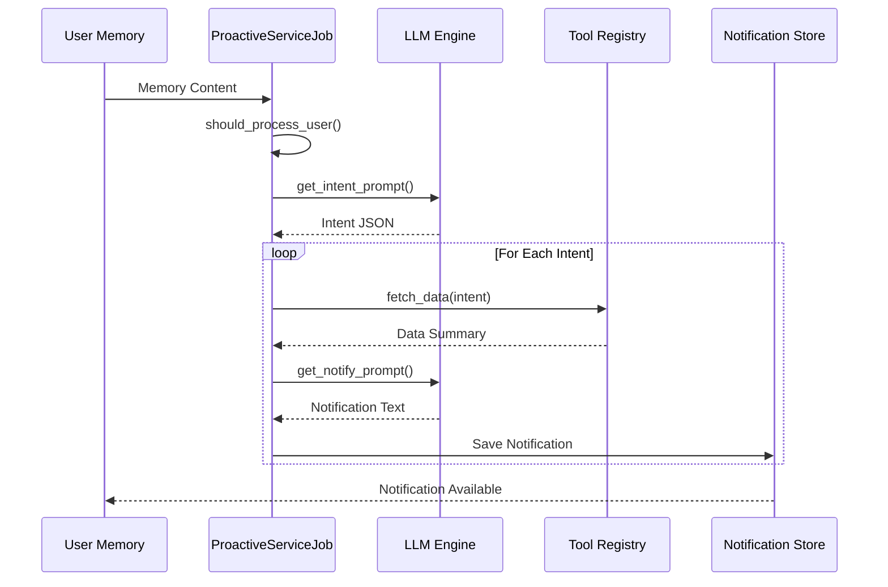
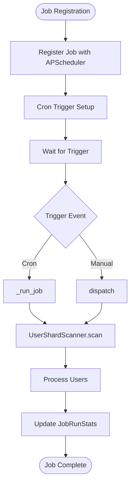
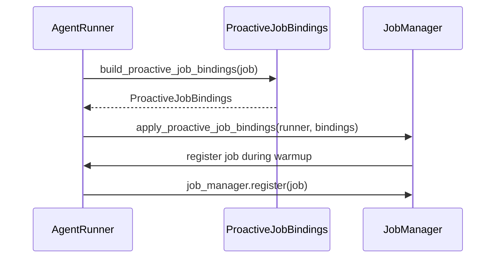
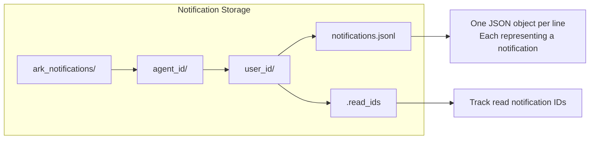
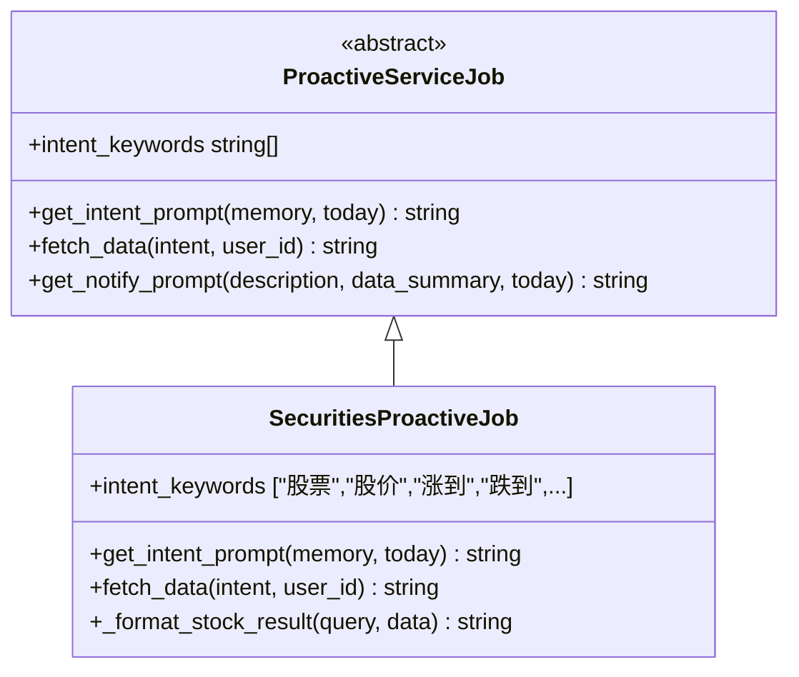

# Proactive Job Management System

<cite>
**Referenced Files in This Document**
- [__init__.py](file://src/ark_agentic/services/jobs/__init__.py)
- [manager.py](file://src/ark_agentic/services/jobs/manager.py)
- [base.py](file://src/ark_agentic/services/jobs/base.py)
- [scanner.py](file://src/ark_agentic/services/jobs/scanner.py)
- [bindings.py](file://src/ark_agentic/services/jobs/bindings.py)
- [proactive_service.py](file://src/ark_agentic/services/jobs/proactive_service.py)
- [proactive_job.py](file://src/ark_agentic/agents/securities/proactive_job.py)
- [agent.py](file://src/ark_agentic/agents/securities/agent.py)
- [store.py](file://src/ark_agentic/services/notifications/store.py)
- [delivery.py](file://src/ark_agentic/services/notifications/delivery.py)
- [models.py](file://src/ark_agentic/services/notifications/models.py)
- [app.py](file://src/ark_agentic/app.py)
- [notifications.py](file://src/ark_agentic/api/notifications.py)
</cite>

## Update Summary
**Changes Made**
- Updated job management module location from core/jobs/ to services/jobs/
- Added new proactive job binding system for better modularity and testing
- Integrated separate services module for better separation of concerns
- Updated architecture to use new job binding system with AgentRunner integration
- Enhanced notification system with agent-specific isolation

## Table of Contents
1. [Introduction](#introduction)
2. [System Architecture](#system-architecture)
3. [Core Components](#core-components)
4. [Job Execution Flow](#job-execution-flow)
5. [Notification System](#notification-system)
6. [Agent Integration](#agent-integration)
7. [Configuration and Scheduling](#configuration-and-scheduling)
8. [Performance Considerations](#performance-considerations)
9. [Monitoring and Operations](#monitoring-and-operations)
10. [Troubleshooting Guide](#troubleshooting-guide)
11. [Conclusion](#conclusion)

## Introduction

The Proactive Job Management System is a sophisticated automated notification framework designed to deliver timely, personalized information to users based on their interests and preferences. Built as part of the Ark-Agentic platform, this system enables agents to automatically scan user memories, identify relevant intents, fetch real-time data, and generate proactive notifications.

The system operates on a three-tier architecture: a scheduling layer that triggers jobs at specified intervals, a processing layer that analyzes user intent and data retrieval, and a notification delivery layer that handles both real-time streaming and persistent storage. This design ensures scalability, reliability, and user-centric information delivery across multiple agent domains.

**Updated** The system has been restructured to use a new module organization with better separation of concerns and improved modularity through the services/jobs/ module and proactive job binding system.

## System Architecture

The Proactive Job Management System follows a modular, event-driven architecture with clear separation of concerns:

**Diagram sources**
- [app.py:52-125](file://src/ark_agentic/app.py#L52-L125)
- [manager.py:41-123](file://src/ark_agentic/services/jobs/manager.py#L41-L123)
- [scanner.py:34-194](file://src/ark_agentic/services/jobs/scanner.py#L34-L194)
- [bindings.py:24-78](file://src/ark_agentic/services/jobs/bindings.py#L24-L78)

**Updated** The architecture now uses the services/jobs/ module instead of core/jobs/, with a new proactive job binding system that decouples agents from the job management infrastructure.

## Core Components

### Base Job Framework

The foundation of the system is built around the `BaseJob` abstract class, which defines the contract for all proactive jobs:

**Diagram sources**
- [base.py:20-103](file://src/ark_agentic/services/jobs/base.py#L20-L103)

The `BaseJob` class establishes the fundamental interface that all job implementations must follow, ensuring consistency across different agent domains while allowing for domain-specific customization.

**Section sources**
- [base.py:20-103](file://src/ark_agentic/services/jobs/base.py#L20-L103)

### Proactive Service Job Implementation

The `ProactiveServiceJob` serves as the primary implementation for most agent types, providing a standardized workflow for intent extraction, data retrieval, and notification generation:

**Diagram sources**
- [proactive_service.py:142-155](file://src/ark_agentic/services/jobs/proactive_service.py#L142-L155)
- [proactive_service.py:173-189](file://src/ark_agentic/services/jobs/proactive_service.py#L173-L189)

**Section sources**
- [proactive_service.py:49-221](file://src/ark_agentic/services/jobs/proactive_service.py#L49-L221)

### Job Manager and Scheduling

The `JobManager` coordinates the execution of multiple jobs using APScheduler for cron-based triggering and manual dispatch capabilities:

**Diagram sources**
- [manager.py:56-123](file://src/ark_agentic/services/jobs/manager.py#L56-L123)
- [scanner.py:57-92](file://src/ark_agentic/services/jobs/scanner.py#L57-L92)

**Section sources**
- [manager.py:41-123](file://src/ark_agentic/services/jobs/manager.py#L41-L123)

### Proactive Job Binding System

**New** The proactive job binding system provides a decoupled approach to job registration and management:

**Diagram sources**
- [bindings.py:31-78](file://src/ark_agentic/services/jobs/bindings.py#L31-L78)

The binding system allows agents to define their jobs independently of the job management infrastructure, enabling better modularity and testing capabilities.

**Section sources**
- [bindings.py:1-78](file://src/ark_agentic/services/jobs/bindings.py#L1-L78)

## Job Execution Flow

The system implements a sophisticated multi-stage processing pipeline designed for scalability and reliability:

### Stage 1: User Discovery and Filtering

The `UserShardScanner` performs efficient user discovery using several optimization strategies:

1. **Directory Listing in Thread Pool**: Prevents blocking the asyncio event loop during filesystem operations
2. **Active User Priority**: Sorts users by MEMORY.md modification time (most recent first)
3. **Concurrent Processing**: Uses asyncio.Semaphore to limit concurrent user processing
4. **Batch Processing**: Processes users in configurable batches for memory efficiency
5. **Idempotence Protection**: Prevents duplicate processing using timestamp files

### Stage 2: Intent Analysis

Each user's memory undergoes a two-phase filtering process:

1. **Keyword-Based Pre-filtering**: Sub-second filtering using predefined keywords
2. **LLM-Powered Intent Extraction**: Structured intent parsing with JSON output validation

### Stage 3: Data Retrieval and Notification Generation

For each identified intent, the system:
1. Calls appropriate tools to fetch real-time data
2. Formats data into human-readable summaries
3. Generates notification text using domain-specific prompts
4. Persists notifications and attempts real-time delivery

**Section sources**
- [scanner.py:34-194](file://src/ark_agentic/services/jobs/scanner.py#L34-L194)
- [proactive_service.py:138-221](file://src/ark_agentic/services/jobs/proactive_service.py#L138-L221)

## Notification System

The notification system provides a robust dual-path delivery mechanism supporting both real-time streaming and persistent storage:

### Storage Architecture

Notifications are stored using a simple but effective JSONL (JSON Lines) format:

**Diagram sources**
- [store.py:25-126](file://src/ark_agentic/services/notifications/store.py#L25-L126)

### Delivery Strategy

The `NotificationDelivery` system implements a fail-safe delivery pattern:

1. **Always Persist First**: Notifications are written to disk before attempting delivery
2. **Real-time Delivery**: Online users receive immediate SSE notifications
3. **Offline Persistence**: Users who are offline receive notifications on next login
4. **Queue Management**: Prevents memory accumulation with bounded queues

**Section sources**
- [store.py:25-126](file://src/ark_agentic/services/notifications/store.py#L25-L126)
- [delivery.py:22-88](file://src/ark_agentic/services/notifications/delivery.py#L22-L88)

## Agent Integration

The system integrates seamlessly with different agent types through a plugin architecture:

### Securities Agent Implementation

The `SecuritiesProactiveJob` demonstrates the system's flexibility for domain-specific implementations:

**Diagram sources**
- [proactive_job.py:54-145](file://src/ark_agentic/agents/securities/proactive_job.py#L54-L145)

The securities implementation showcases:
- Domain-specific keyword filtering for financial instruments
- Structured intent extraction for stock and fund monitoring
- Real-time market data integration
- Financial-specific notification formatting

**Updated** The agent integration now uses the new proactive job binding system, where agents create their jobs and apply them to the AgentRunner separately from the job management infrastructure.

**Section sources**
- [proactive_job.py:1-145](file://src/ark_agentic/agents/securities/proactive_job.py#L1-L145)
- [agent.py:49-189](file://src/ark_agentic/agents/securities/agent.py#L49-L189)

## Configuration and Scheduling

The system provides extensive configuration options for production deployment:

### Environment-Based Configuration

Key configuration parameters controlled through environment variables:

| Parameter | Default | Description |
|-----------|---------|-------------|
| ENABLE_JOB_MANAGER | false | Enable/disable job management system |
| JOB_MAX_CONCURRENT | 50 | Maximum concurrent user processing |
| JOB_BATCH_SIZE | 500 | Users processed per batch |
| JOB_SHARD_INDEX | 0 | Current shard index for horizontal scaling |
| JOB_TOTAL_SHARDS | 1 | Total number of shards |

### Cron Scheduling

Jobs support flexible scheduling through cron expressions:
- **Workdays**: `"0 9 * * 1-5"` (9 AM, Monday-Friday)
- **Multiple Times**: `"0 8,12 * * *"` (8 AM and 12 PM daily)
- **Intraday**: `"*/30 9-15 * * 1-5"` (Every 30 minutes, 9 AM-3 PM)

**Section sources**
- [app.py:48-92](file://src/ark_agentic/app.py#L48-L92)
- [manager.py:110-123](file://src/ark_agentic/services/jobs/manager.py#L110-L123)

## Performance Considerations

The system incorporates multiple optimization strategies for high-performance operation:

### Concurrency Control
- **Semaphore-based**: Limits concurrent user processing to prevent resource exhaustion
- **Batch Processing**: Reduces overhead by processing users in chunks
- **Thread Pool Usage**: Offloads blocking filesystem operations

### Memory Management
- **Streaming Reads**: Processes JSONL files without loading entire contents
- **Bounded Queues**: Prevents memory accumulation in real-time delivery
- **Efficient Data Structures**: Uses sets and dictionaries for O(1) lookups

### Scalability Features
- **Horizontal Sharding**: Supports multi-instance deployment
- **Idempotent Processing**: Prevents duplicate work across restarts
- **Timeout Protection**: Ensures system stability under heavy loads

## Monitoring and Operations

The system provides comprehensive monitoring and operational capabilities:

### Runtime Statistics
The `JobRunStats` class tracks key metrics for each job execution:
- **Processed Counters**: Total users scanned, skipped, notified
- **Delivery Metrics**: Real-time pushes vs. offline storage
- **Error Tracking**: Exceptions and timeouts for troubleshooting

### API Endpoints
The notification system exposes REST endpoints for management:
- **History Retrieval**: Fetch user notifications with pagination
- **Read Status Management**: Mark notifications as read
- **Real-time Streaming**: SSE endpoint for live updates
- **Job Control**: Manual job triggering and status monitoring

**Section sources**
- [base.py:33-54](file://src/ark_agentic/services/jobs/base.py#L33-L54)
- [notifications.py:39-169](file://src/ark_agentic/api/notifications.py#L39-L169)

## Troubleshooting Guide

### Common Issues and Solutions

**Job Not Running**
- Verify `ENABLE_JOB_MANAGER` environment variable is set to true
- Check cron expression validity in job configuration
- Confirm job registration in JobManager

**Notifications Not Delivered**
- Verify NotificationDelivery initialization in app startup
- Check SSE connection establishment for online users
- Review notification storage permissions

**Performance Degradation**
- Adjust `JOB_MAX_CONCURRENT` and `JOB_BATCH_SIZE` parameters
- Monitor semaphore usage and adjust based on system capacity
- Consider horizontal sharding for high-volume deployments

**Memory Issues**
- Monitor JSONL file sizes and implement cleanup policies
- Verify thread pool usage is not blocking the event loop
- Check for memory leaks in long-running processes

### Debugging Tools

The system provides several debugging mechanisms:
- **Logging Configuration**: Comprehensive logging at INFO level with DEBUG override
- **Statistics Collection**: Real-time metrics for performance monitoring
- **Health Checks**: Endpoint for system status verification

**Section sources**
- [app.py:16-33](file://src/ark_agentic/app.py#L16-L33)
- [scanner.py:162-168](file://src/ark_agentic/services/jobs/scanner.py#L162-L168)

## Conclusion

The Proactive Job Management System represents a mature, production-ready solution for automated, user-centric notification delivery. Its modular architecture, comprehensive monitoring, and robust error handling make it suitable for enterprise-scale deployments.

Key strengths include:
- **Scalable Design**: Horizontal sharding and concurrent processing for high-volume scenarios
- **Reliable Delivery**: Dual-path notification system ensuring no missed communications
- **Domain Flexibility**: Plugin architecture supporting multiple agent types
- **Operational Excellence**: Comprehensive monitoring and management capabilities
- **Enhanced Modularity**: New services module organization and proactive job binding system for better separation of concerns

The system successfully balances performance, reliability, and maintainability while providing a solid foundation for future enhancements and extensions.

**Updated** The migration to the services/jobs/ module and introduction of the proactive job binding system significantly improve the system's modularity, testability, and maintainability while preserving all existing functionality.