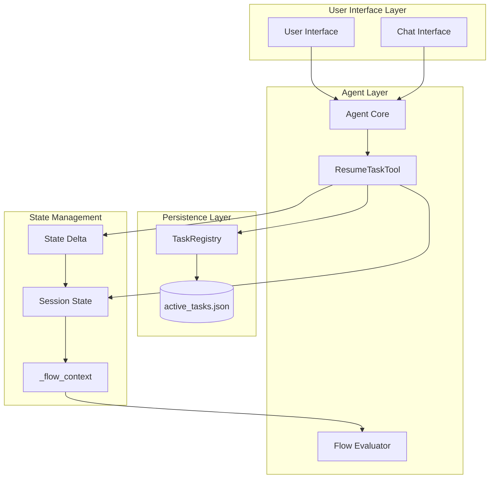
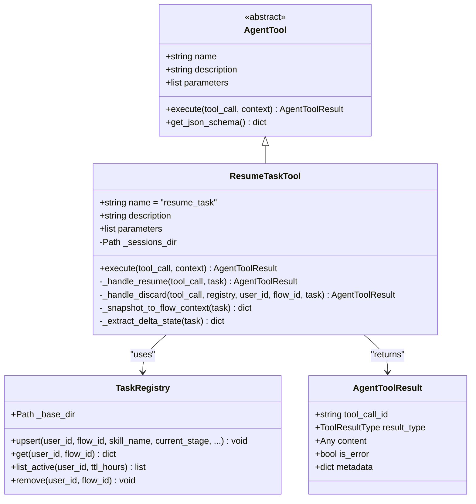
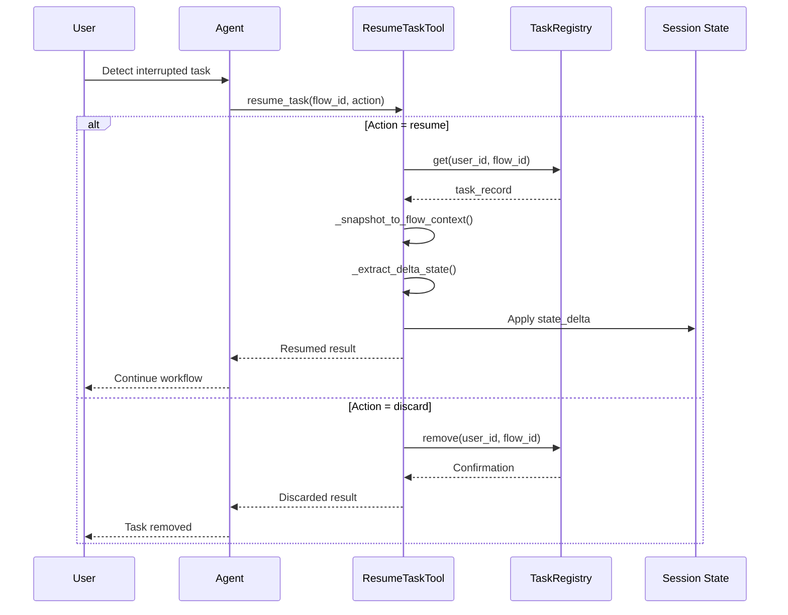
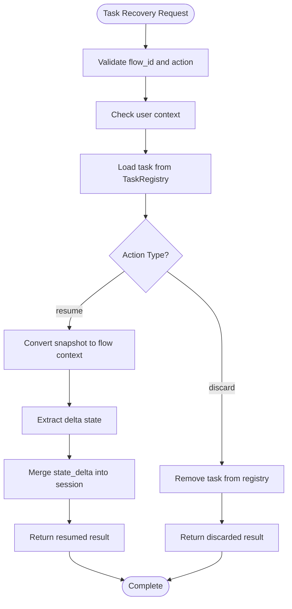
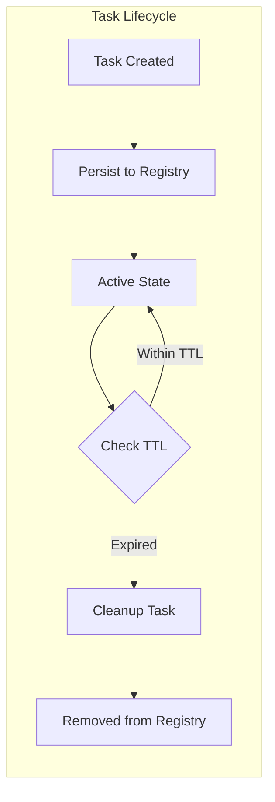
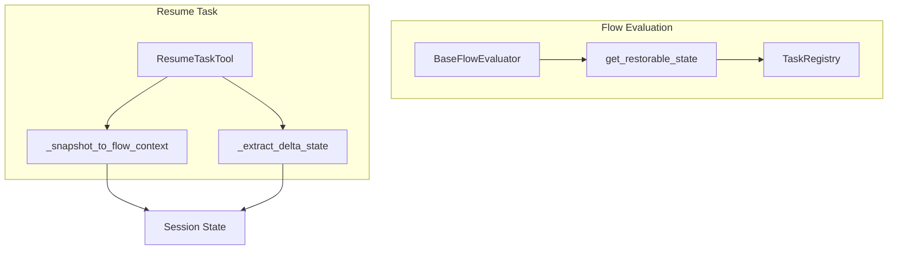
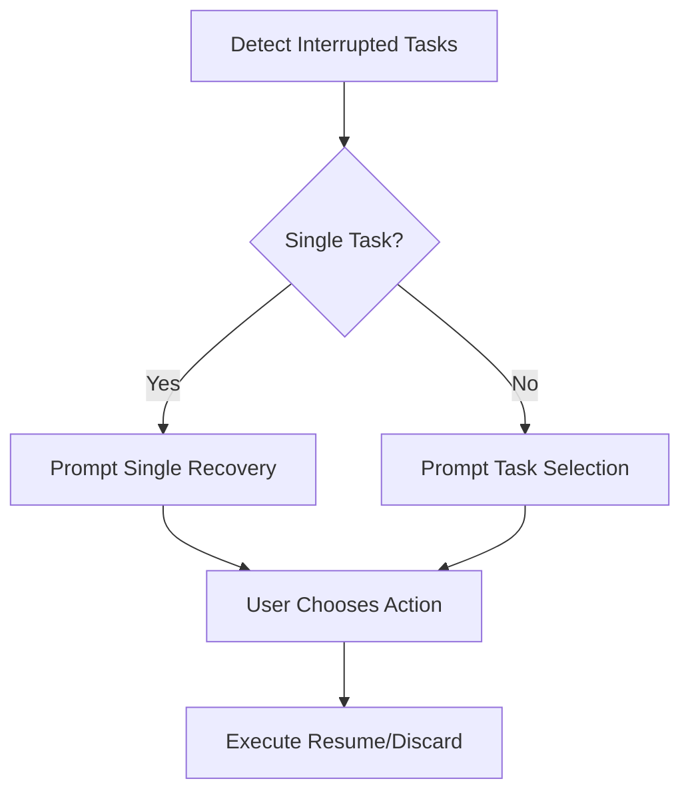

# Resume Task Functionality

<cite>
**Referenced Files in This Document**
- [resume_task.py](file://src/ark_agentic/core/tools/resume_task.py)
- [task_registry.py](file://src/ark_agentic/core/flow/task_registry.py)
- [callbacks.py](file://src/ark_agentic/core/flow/callbacks.py)
- [base.py](file://src/ark_agentic/core/tools/base.py)
- [base_evaluator.py](file://src/ark_agentic/core/flow/base_evaluator.py)
- [types.py](file://src/ark_agentic/core/types.py)
</cite>

## Table of Contents
1. [Introduction](#introduction)
2. [System Architecture](#system-architecture)
3. [Core Components](#core-components)
4. [Resume Task Workflow](#resume-task-workflow)
5. [Data Persistence Layer](#data-persistence-layer)
6. [Integration Points](#integration-points)
7. [Error Handling](#error-handling)
8. [Usage Examples](#usage-examples)
9. [Performance Considerations](#performance-considerations)
10. [Troubleshooting Guide](#troubleshooting-guide)
11. [Conclusion](#conclusion)

## Introduction

The Resume Task functionality is a critical component of the Ark Agentic Space platform that enables users to continue interrupted business processes seamlessly. This system allows agents to recover from previous conversation sessions, maintain state continuity, and provide a seamless user experience even when interactions are paused or interrupted.

The functionality centers around the `ResumeTaskTool`, which serves as the primary interface for managing interrupted workflow tasks. It integrates deeply with the flow evaluation framework, task persistence mechanisms, and session management to provide robust state recovery capabilities.

## System Architecture

The Resume Task system follows a layered architecture pattern with clear separation of concerns:



**Diagram sources**
- [resume_task.py:22-84](file://src/ark_agentic/core/tools/resume_task.py#L22-L84)
- [task_registry.py:32-96](file://src/ark_agentic/core/flow/task_registry.py#L32-L96)
- [callbacks.py:36-96](file://src/ark_agentic/core/flow/callbacks.py#L36-L96)

## Core Components

### ResumeTaskTool Class

The `ResumeTaskTool` is the central component responsible for managing task recovery operations. It inherits from the `AgentTool` base class and implements sophisticated state restoration mechanisms.



**Diagram sources**
- [resume_task.py:22-193](file://src/ark_agentic/core/tools/resume_task.py#L22-L193)
- [base.py:46-116](file://src/ark_agentic/core/tools/base.py#L46-L116)
- [task_registry.py:32-96](file://src/ark_agentic/core/flow/task_registry.py#L32-L96)

**Section sources**
- [resume_task.py:22-193](file://src/ark_agentic/core/tools/resume_task.py#L22-L193)
- [base.py:46-116](file://src/ark_agentic/core/tools/base.py#L46-L116)

### TaskRegistry Component

The `TaskRegistry` manages the persistent storage of active task information using JSON files. It provides CRUD operations for task records with built-in TTL (Time To Live) management.

**Section sources**
- [task_registry.py:32-124](file://src/ark_agentic/core/flow/task_registry.py#L32-L124)

### Flow Callback System

The flow callback system automatically detects and manages interrupted tasks through hooks that trigger before and after agent processing.

**Section sources**
- [callbacks.py:36-143](file://src/ark_agentic/core/flow/callbacks.py#L36-L143)

## Resume Task Workflow

The resume task process follows a structured workflow that ensures reliable state recovery:



**Diagram sources**
- [resume_task.py:54-141](file://src/ark_agentic/core/tools/resume_task.py#L54-L141)
- [task_registry.py:77-96](file://src/ark_agentic/core/flow/task_registry.py#L77-L96)

### State Restoration Process

The state restoration process involves converting stored snapshots back to runtime format:



**Diagram sources**
- [resume_task.py:86-193](file://src/ark_agentic/core/tools/resume_task.py#L86-L193)
- [base_evaluator.py:294-309](file://src/ark_agentic/core/flow/base_evaluator.py#L294-L309)

**Section sources**
- [resume_task.py:86-193](file://src/ark_agentic/core/tools/resume_task.py#L86-L193)

## Data Persistence Layer

The persistence layer uses a structured JSON format to store task information with TTL management:

### Active Tasks Storage Format

The system stores task information in `active_tasks.json` files organized by user ID:

| Field | Type | Description |
|-------|------|-------------|
| `flow_id` | string | Unique identifier for the workflow instance |
| `skill_name` | string | Name of the skill being executed |
| `current_stage` | string | Current stage of the workflow |
| `last_session_id` | string | Identifier of the last session |
| `updated_at` | integer | Timestamp of last update (milliseconds) |
| `resume_ttl_hours` | integer | Time-to-live for task recovery |
| `flow_context_snapshot` | object | Complete workflow state snapshot |

### TTL Management

The system implements automatic cleanup of expired tasks:



**Diagram sources**
- [task_registry.py:82-91](file://src/ark_agentic/core/flow/task_registry.py#L82-L91)

**Section sources**
- [task_registry.py:1-124](file://src/ark_agentic/core/flow/task_registry.py#L1-L124)

## Integration Points

### Flow Evaluator Integration

The resume task functionality integrates with the flow evaluation system through the `get_restorable_state` method:



**Diagram sources**
- [base_evaluator.py:294-309](file://src/ark_agentic/core/flow/base_evaluator.py#L294-L309)
- [resume_task.py:143-193](file://src/ark_agentic/core/tools/resume_task.py#L143-L193)

### Callback System Integration

The flow callback system automatically manages task persistence and recovery hints:

**Section sources**
- [callbacks.py:50-96](file://src/ark_agentic/core/flow/callbacks.py#L50-L96)
- [base_evaluator.py:294-309](file://src/ark_agentic/core/flow/base_evaluator.py#L294-L309)

## Error Handling

The system implements comprehensive error handling at multiple levels:

### Validation Errors
- Empty or invalid `flow_id` parameters
- Missing user context (`user:id`)
- Invalid action values (only `resume` or `discard` allowed)

### Persistence Errors
- File system access failures
- JSON serialization/deserialization errors
- Registry corruption handling

### Recovery Errors
- Missing task records in registry
- Incompatible snapshot formats
- State restoration conflicts

**Section sources**
- [resume_task.py:61-79](file://src/ark_agentic/core/tools/resume_task.py#L61-L79)
- [task_registry.py:103-124](file://src/ark_agentic/core/flow/task_registry.py#L103-L124)

## Usage Examples

### Basic Resume Operation

To resume an interrupted workflow:

```python
# Example tool call structure
tool_call = {
    "name": "resume_task",
    "arguments": {
        "flow_id": "unique-flow-id",
        "action": "resume"
    }
}
```

### Discard Operation

To abandon an interrupted workflow:

```python
# Example tool call structure
tool_call = {
    "name": "resume_task",
    "arguments": {
        "flow_id": "unique-flow-id",
        "action": "discard"
    }
}
```

### Automatic Detection

The system automatically detects and presents recovery options:



**Diagram sources**
- [callbacks.py:64-96](file://src/ark_agentic/core/flow/callbacks.py#L64-L96)

## Performance Considerations

### Memory Management
- State snapshots are processed incrementally to minimize memory footprint
- Delta state extraction optimizes data transfer between stages
- TTL-based cleanup prevents unbounded growth of task records

### I/O Optimization
- JSON file operations are batched to reduce disk access frequency
- Registry operations use efficient filtering and indexing
- State merging avoids unnecessary data copying

### Concurrency Handling
- Thread-safe operations for concurrent task access
- Atomic file operations for data consistency
- Graceful degradation on storage failures

## Troubleshooting Guide

### Common Issues and Solutions

**Issue**: Task not found error
- **Cause**: Invalid `flow_id` or task expired
- **Solution**: Verify task ID and check TTL settings

**Issue**: State restoration fails
- **Cause**: Corrupted snapshot data or incompatible format
- **Solution**: Remove corrupted task and restart workflow

**Issue**: User context missing
- **Cause**: Authentication failure or session timeout
- **Solution**: Re-authenticate user and retry operation

**Issue**: Registry access denied
- **Cause**: File permission issues or disk space problems
- **Solution**: Check file permissions and available disk space

### Debug Information

Enable debug logging to capture detailed information about resume operations:

```python
import logging
logging.getLogger('ark_agentic.core.tools.resume_task').setLevel(logging.DEBUG)
logging.getLogger('ark_agentic.core.flow.task_registry').setLevel(logging.DEBUG)
```

**Section sources**
- [resume_task.py:12-19](file://src/ark_agentic/core/tools/resume_task.py#L12-L19)
- [task_registry.py:23-29](file://src/ark_agentic/core/flow/task_registry.py#L23-L29)

## Conclusion

The Resume Task functionality provides a robust foundation for maintaining state continuity in complex conversational AI applications. Through its integration with the flow evaluation framework, persistent storage mechanisms, and automated callback systems, it ensures that users can seamlessly continue interrupted workflows without losing progress or context.

The system's design emphasizes reliability, performance, and user experience while maintaining flexibility for various business process scenarios. Its modular architecture allows for easy extension and customization while preserving backward compatibility and data integrity.

Key benefits include:
- Seamless state recovery across sessions
- Automatic task detection and management
- Flexible action options (resume, discard, restart)
- Comprehensive error handling and recovery
- Efficient resource utilization and performance optimization

This functionality serves as a cornerstone for building sophisticated conversational AI applications that require persistent state management and robust user experience guarantees.