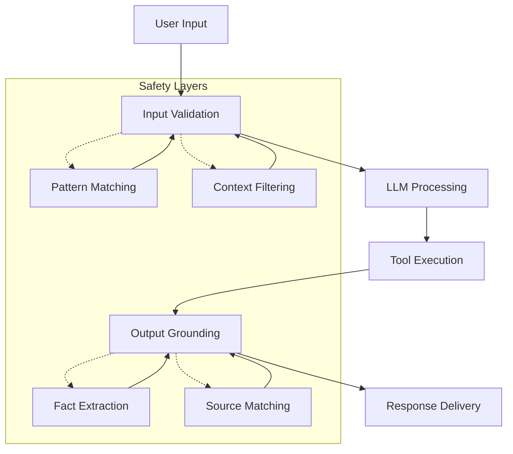
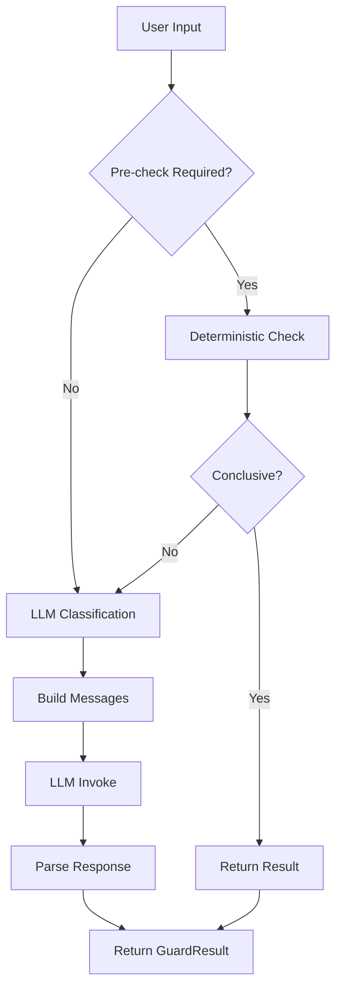
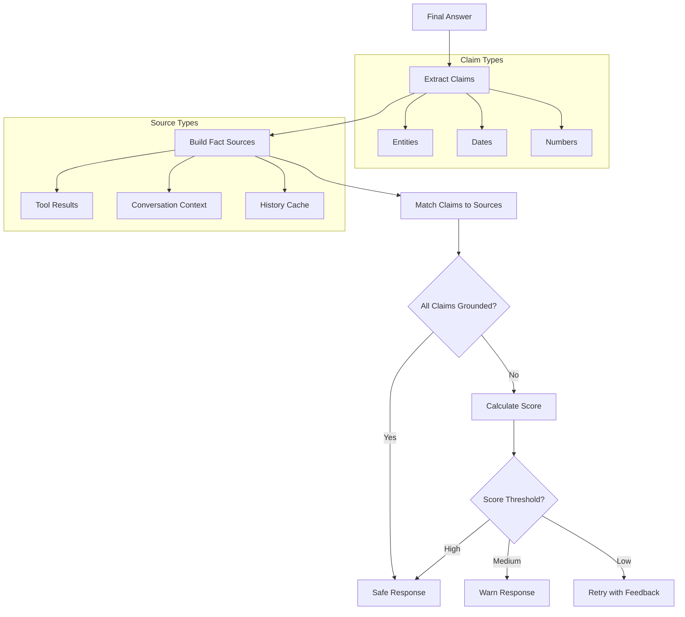
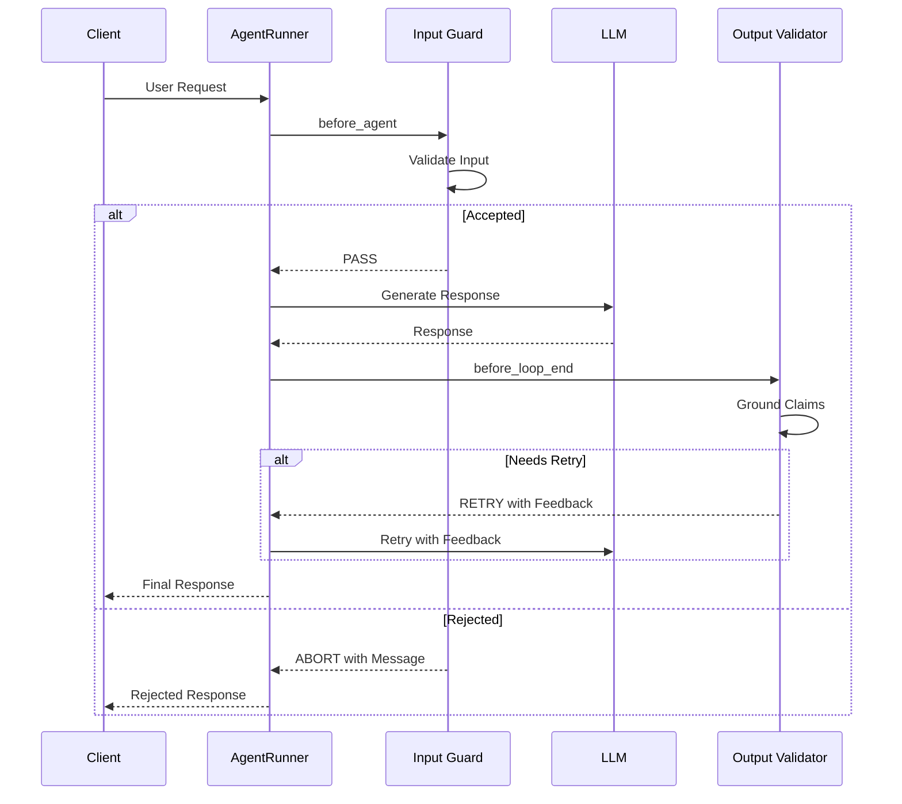

# Runtime Guardrails System

<cite>
**Referenced Files in This Document**
- [guard.py](file://src/ark_agentic/core/guard.py)
- [a2ui/guard.py](file://src/ark_agentic/core/a2ui/guard.py)
- [validation.py](file://src/ark_agentic/core/validation.py)
- [callbacks.py](file://src/ark_agentic/core/callbacks.py)
- [runner.py](file://src/ark_agentic/core/runner.py)
- [insurance/guard.py](file://src/ark_agentic/agents/insurance/guard.py)
- [test_guard.py](file://tests/unit/agents/insurance/test_guard.py)
</cite>

## Update Summary
**Changes Made**
- Removed comprehensive guardrails system documentation reflecting complete removal of core/guardrails infrastructure
- Updated all sections to reflect simplified safety approach using basic input validation and channel-level protections
- Removed detailed architecture diagrams and implementation details for the deleted guardrails system
- Retained documentation for remaining safety mechanisms (input guards, A2UI validation, output grounding)

## Table of Contents
1. [Introduction](#introduction)
2. [Current Safety Framework](#current-safety-framework)
3. [Input Validation and Guards](#input-validation-and-guards)
4. [Output Grounding and Validation](#output-grounding-and-validation)
5. [A2UI Payload Validation](#a2ui-payload-validation)
6. [Integration Points](#integration-points)
7. [Testing and Validation](#testing-and-validation)
8. [Migration from Legacy Guardrails](#migration-from-legacy-guardrails)
9. [Troubleshooting Guide](#troubleshooting-guide)

## Introduction

The Runtime Guardrails System has been significantly simplified to focus on essential safety mechanisms. The comprehensive guardrails infrastructure (core/guardrails/, insurance/guard.py guard logic, and related tests) has been completely removed from the codebase. The new simplified approach uses basic input validation and channel-level protections rather than the previous comprehensive runtime enforcement system.

The current safety framework maintains three core safety pillars:
- **Input Validation**: Pre-processing and filtering of user inputs
- **Output Grounding**: Post-generation fact-checking and validation
- **Payload Validation**: Structural integrity checking for UI components

## Current Safety Framework

The simplified safety system operates through a streamlined approach that maintains essential protections while reducing complexity.

**Diagram sources**
- [validation.py:213-292](file://src/ark_agentic/core/validation.py#L213-L292)

## Input Validation and Guards

### Insurance Intake Guard

The insurance domain implements a focused intake guard that performs deterministic pre-checks followed by LLM classification when necessary.

**Diagram sources**
- [insurance/guard.py:101-130](file://src/ark_agentic/agents/insurance/guard.py#L101-L130)

**Section sources**
- [insurance/guard.py:70-130](file://src/ark_agentic/agents/insurance/guard.py#L70-L130)

### Generic Guard Protocol

A simple protocol defines the interface for all intake guards across different domains.

**Section sources**
- [guard.py:25-34](file://src/ark_agentic/core/guard.py#L25-L34)

## Output Grounding and Validation

### Citation Validation System

The system implements a sophisticated output grounding mechanism that validates claims against factual sources extracted from tool responses and conversation history.

**Diagram sources**
- [validation.py:213-292](file://src/ark_agentic/core/validation.py#L213-L292)

**Section sources**
- [validation.py:197-292](file://src/ark_agentic/core/validation.py#L197-L292)

### Grounding Cache System

The system maintains a cache of recent facts to support historical context matching during validation.

**Section sources**
- [validation.py:496-605](file://src/ark_agentic/core/validation.py#L496-L605)

## A2UI Payload Validation

### Unified Validation Entry Point

The A2UI validation system provides comprehensive validation for UI payloads through multiple layers of checks.

```mermaid
flowchart TD
A[Complete A2UI Payload] --> B[Event Contract Validation]
A --> C[Component Validation]
A --> D[Data Coverage Check]
B --> E{Contract Valid?}
C --> F{Components Valid?}
D --> G{Data Coverage OK?}
E --> |Yes| H[Proceed]
E --> |No| I[Error]
F --> |Yes| H
F --> |No| I
G --> |OK| H
G --> |Warnings| J[Warning]
H --> K[Combined Result]
I --> K
J --> K
```

**Diagram sources**
- [a2ui/guard.py:83-125](file://src/ark_agentic/core/a2ui/guard.py#L83-L125)

**Section sources**
- [a2ui/guard.py:83-125](file://src/ark_agentic/core/a2ui/guard.py#L83-L125)

### Data Coverage Validation

The system includes specific validation for ensuring all data bindings in UI components reference existing data keys.

**Section sources**
- [a2ui/guard.py:39-81](file://src/ark_agentic/core/a2ui/guard.py#L39-L81)

## Integration Points

### Callback System Integration

The simplified safety system integrates with the existing callback infrastructure through specific hook points.

**Diagram sources**
- [callbacks.py:86-144](file://src/ark_agentic/core/callbacks.py#L86-L144)

**Section sources**
- [callbacks.py:86-144](file://src/ark_agentic/core/callbacks.py#L86-L144)

## Testing and Validation

### Insurance Guard Testing

The insurance intake guard includes comprehensive tests covering temperature overrides, LLM classification, history handling, and business keyword detection.

**Section sources**
- [test_guard.py:29-297](file://tests/unit/agents/insurance/test_guard.py#L29-L297)

### Output Validation Testing

The validation system includes extensive tests for claim extraction, source matching, and scoring algorithms.

## Migration from Legacy Guardrails

### Key Changes

The removal of the comprehensive guardrails system represents a fundamental shift in safety approach:

1. **Simplified Architecture**: Removed complex callback-based enforcement system
2. **Reduced Complexity**: Eliminated multi-layered policy enforcement
3. **Maintained Core Safety**: Preserved essential input validation and output grounding
4. **Streamlined Integration**: Reduced integration points to essential callbacks

### Migration Impact

Organizations previously relying on comprehensive guardrails should now focus on:
- Implementing domain-specific input guards (like InsuranceIntakeGuard)
- Leveraging output grounding validation for factual accuracy
- Using A2UI validation for UI payload integrity
- Maintaining basic pattern matching and filtering approaches

## Troubleshooting Guide

### Common Issues and Solutions

| Issue | Symptoms | Solution |
|-------|----------|----------|
| Input Guard Not Working | Requests not being filtered as expected | Check guard implementation and callback registration |
| Output Validation Failing | Claims not being properly grounded | Verify tool sources and grounding cache configuration |
| A2UI Validation Errors | UI rendering issues | Check payload structure and data coverage |
| Performance Degradation | Slow response times | Review grounding cache usage and claim extraction |

### Debugging Techniques

1. **Enable Debug Logging**: Monitor callback execution and validation processes
2. **Check Guard Results**: Verify input validation outcomes and guard decisions
3. **Review Grounding Scores**: Analyze claim-to-source matching effectiveness
4. **Validate Payload Structure**: Ensure A2UI payloads meet validation requirements
5. **Monitor Cache Performance**: Check grounding cache hit rates and memory usage

**Section sources**
- [callbacks.py:67-81](file://src/ark_agentic/core/callbacks.py#L67-L81)
- [validation.py:522-595](file://src/ark_agentic/core/validation.py#L522-L595)