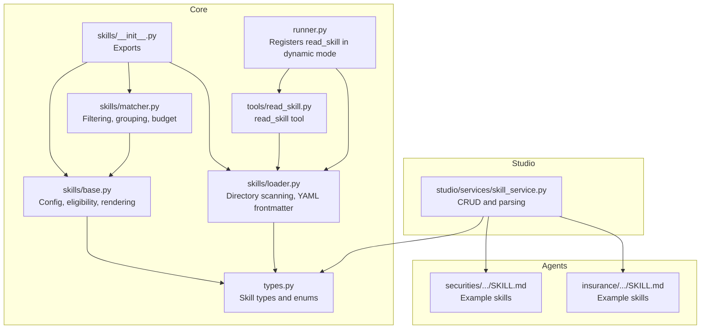
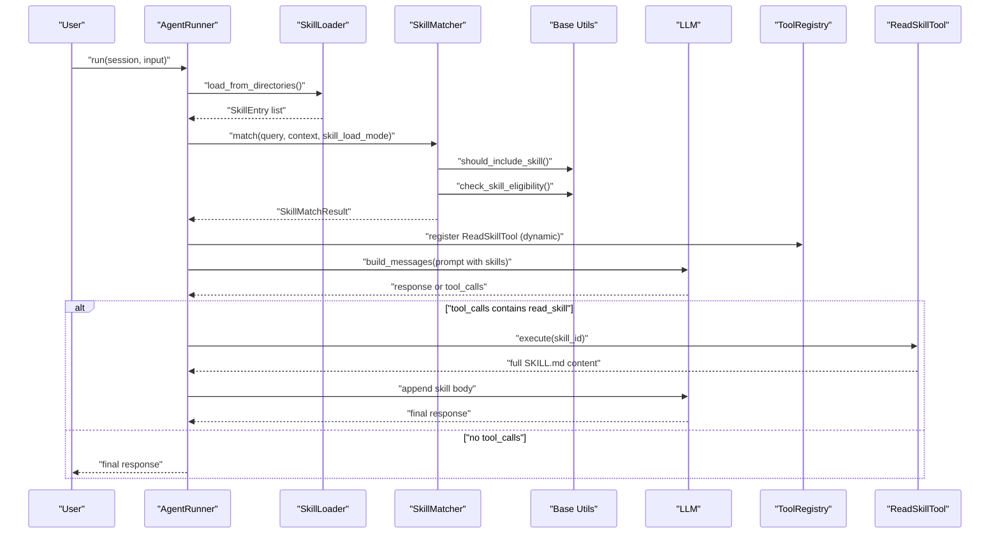
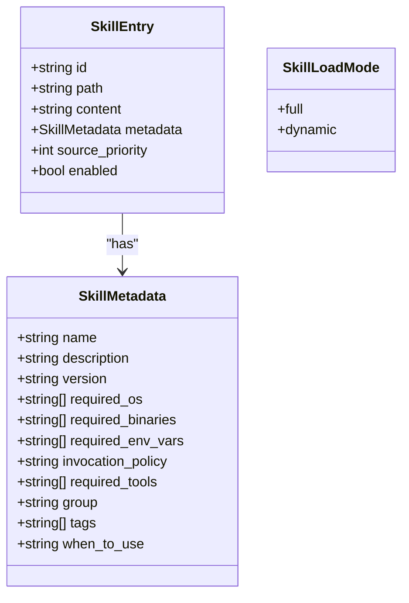
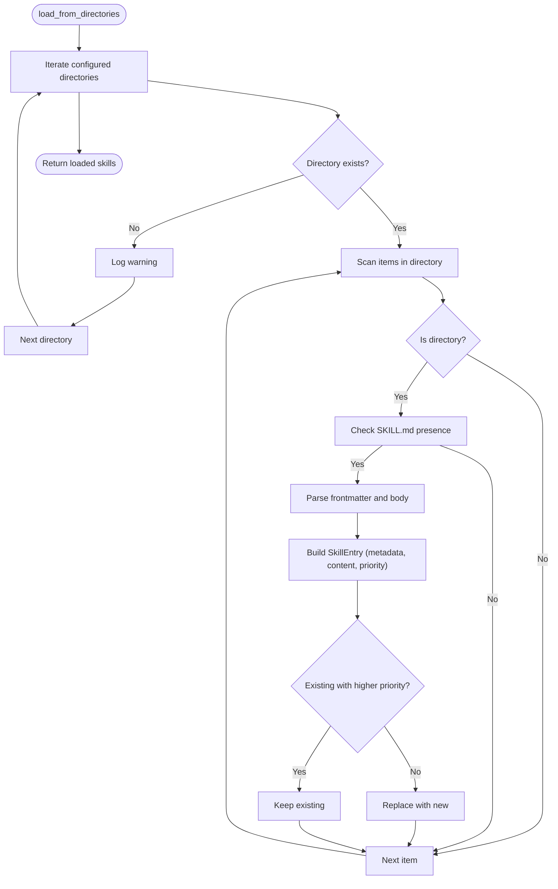
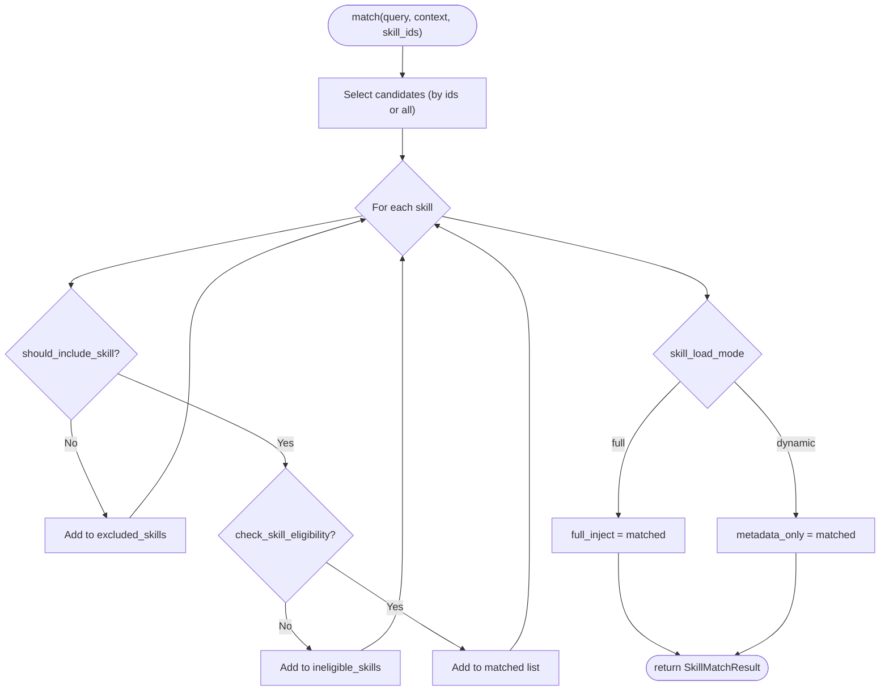
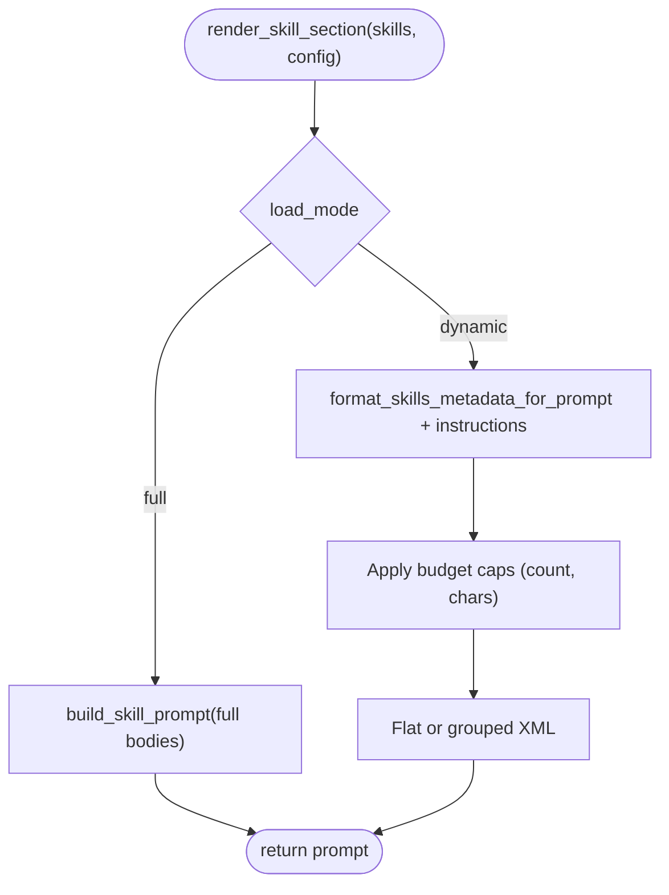
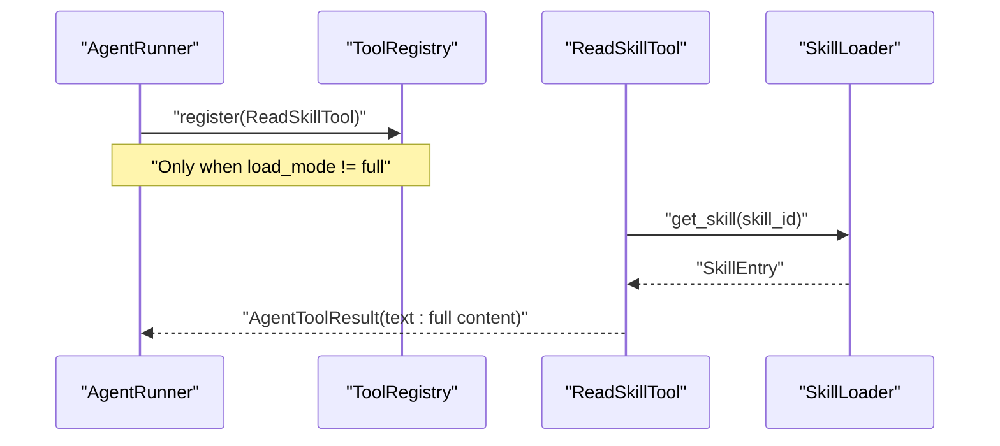
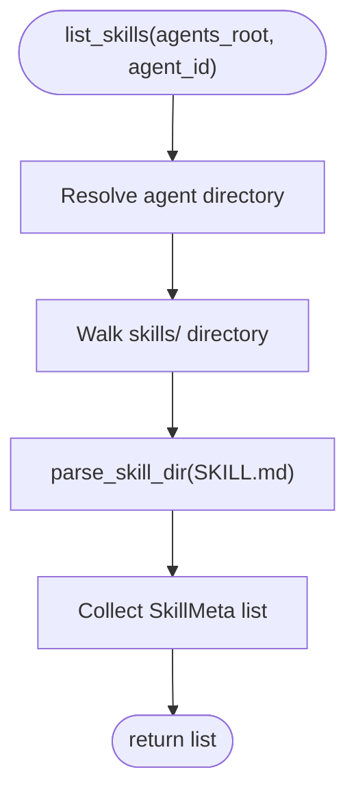
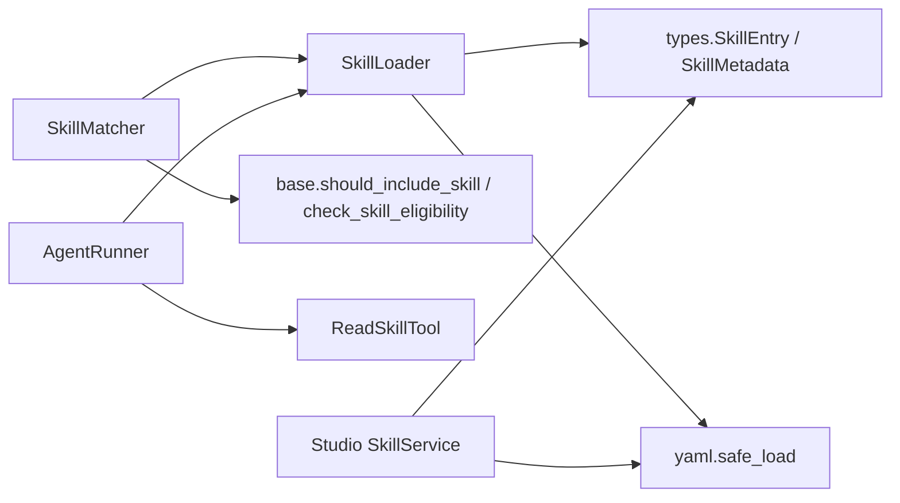

# Skill System

<cite>
**Referenced Files in This Document**
- [src/ark_agentic/core/skills/__init__.py](file://src/ark_agentic/core/skills/__init__.py)
- [src/ark_agentic/core/skills/base.py](file://src/ark_agentic/core/skills/base.py)
- [src/ark_agentic/core/skills/loader.py](file://src/ark_agentic/core/skills/loader.py)
- [src/ark_agentic/core/skills/matcher.py](file://src/ark_agentic/core/skills/matcher.py)
- [src/ark_agentic/core/tools/read_skill.py](file://src/ark_agentic/core/tools/read_skill.py)
- [src/ark_agentic/core/types.py](file://src/ark_agentic/core/types.py)
- [src/ark_agentic/core/runner.py](file://src/ark_agentic/core/runner.py)
- [src/ark_agentic/studio/services/skill_service.py](file://src/ark_agentic/studio/services/skill_service.py)
- [src/ark_agentic/agents/securities/skills/asset_overview/SKILL.md](file://src/ark_agentic/agents/securities/skills/asset_overview/SKILL.md)
- [src/ark_agentic/agents/securities/skills/holdings_analysis/SKILL.md](file://src/ark_agentic/agents/securities/skills/holdings_analysis/SKILL.md)
- [src/ark_agentic/agents/securities/skills/profit_analysis/SKILL.md](file://src/ark_agentic/agents/securities/skills/profit_analysis/SKILL.md)
- [src/ark_agentic/agents/securities/skills/profit_inquiry/SKILL.md](file://src/ark_agentic/agents/securities/skills/profit_inquiry/SKILL.md)
- [src/ark_agentic/agents/insurance/skills/execute_withdrawal/SKILL.md](file://src/ark_agentic/agents/insurance/skills/execute_withdrawal/SKILL.md)
- [tests/unit/core/test_skills.py](file://tests/unit/core/test_skills.py)
- [tests/unit/core/test_runner_skill_load_mode.py](file://tests/unit/core/test_runner_skill_load_mode.py)
</cite>

## Table of Contents
1. [Introduction](#introduction)
2. [Project Structure](#project-structure)
3. [Core Components](#core-components)
4. [Architecture Overview](#architecture-overview)
5. [Detailed Component Analysis](#detailed-component-analysis)
6. [Dependency Analysis](#dependency-analysis)
7. [Performance Considerations](#performance-considerations)
8. [Troubleshooting Guide](#troubleshooting-guide)
9. [Conclusion](#conclusion)
10. [Appendices](#appendices)

## Introduction
This document explains the skill system architecture used by agents to discover, filter, load, and execute domain-specific capabilities. It covers:
- Skill loading mechanisms and metadata-based discovery
- Automatic vs manual invocation policies
- Skill matching, qualification checks, and grouping
- Dependency resolution via required tools and environment
- Conflict handling and budget controls
- Packaging, distribution, and version management
- Examples of skill implementation and metadata configuration
- Integration patterns and performance optimization strategies

## Project Structure
The skill system is implemented under the core module and integrated with the agent runner and tooling framework. Studio services provide CRUD and parsing utilities for skills.

**Diagram sources**
- [src/ark_agentic/core/skills/__init__.py:1-17](file://src/ark_agentic/core/skills/__init__.py#L1-L17)
- [src/ark_agentic/core/skills/base.py:1-325](file://src/ark_agentic/core/skills/base.py#L1-L325)
- [src/ark_agentic/core/skills/loader.py:1-177](file://src/ark_agentic/core/skills/loader.py#L1-L177)
- [src/ark_agentic/core/skills/matcher.py:1-152](file://src/ark_agentic/core/skills/matcher.py#L1-L152)
- [src/ark_agentic/core/tools/read_skill.py:1-70](file://src/ark_agentic/core/tools/read_skill.py#L1-L70)
- [src/ark_agentic/core/runner.py:1-800](file://src/ark_agentic/core/runner.py#L1-L800)
- [src/ark_agentic/studio/services/skill_service.py:1-289](file://src/ark_agentic/studio/services/skill_service.py#L1-L289)
- [src/ark_agentic/agents/securities/skills/asset_overview/SKILL.md:1-186](file://src/ark_agentic/agents/securities/skills/asset_overview/SKILL.md#L1-L186)
- [src/ark_agentic/agents/insurance/skills/execute_withdrawal/SKILL.md:1-180](file://src/ark_agentic/agents/insurance/skills/execute_withdrawal/SKILL.md#L1-L180)

**Section sources**
- [src/ark_agentic/core/skills/__init__.py:1-17](file://src/ark_agentic/core/skills/__init__.py#L1-L17)
- [src/ark_agentic/core/skills/base.py:1-325](file://src/ark_agentic/core/skills/base.py#L1-L325)
- [src/ark_agentic/core/skills/loader.py:1-177](file://src/ark_agentic/core/skills/loader.py#L1-L177)
- [src/ark_agentic/core/skills/matcher.py:1-152](file://src/ark_agentic/core/skills/matcher.py#L1-L152)
- [src/ark_agentic/core/tools/read_skill.py:1-70](file://src/ark_agentic/core/tools/read_skill.py#L1-L70)
- [src/ark_agentic/core/runner.py:1-800](file://src/ark_agentic/core/runner.py#L1-L800)
- [src/ark_agentic/studio/services/skill_service.py:1-289](file://src/ark_agentic/studio/services/skill_service.py#L1-L289)

## Core Components
- Skill types and enums define the metadata schema and load modes.
- Loader scans directories for SKILL.md files, parses YAML frontmatter, and resolves global skill IDs.
- Matcher filters skills by invocation policy and eligibility, then groups by load mode.
- Base utilities provide eligibility checks, inclusion decisions, and prompt rendering helpers.
- Runner conditionally registers the read_skill tool when using dynamic load mode.
- Studio service offers CRUD and parsing for skills.

Key responsibilities:
- Discovery: Directory traversal and frontmatter parsing
- Filtering: Invocation policy and environment/tool eligibility
- Rendering: Full-body injection or metadata-only prompts with budget controls
- Dynamic loading: read_skill tool to fetch full content on demand

**Section sources**
- [src/ark_agentic/core/types.py:234-299](file://src/ark_agentic/core/types.py#L234-L299)
- [src/ark_agentic/core/skills/loader.py:25-177](file://src/ark_agentic/core/skills/loader.py#L25-L177)
- [src/ark_agentic/core/skills/matcher.py:55-152](file://src/ark_agentic/core/skills/matcher.py#L55-L152)
- [src/ark_agentic/core/skills/base.py:19-325](file://src/ark_agentic/core/skills/base.py#L19-L325)
- [src/ark_agentic/core/tools/read_skill.py:16-70](file://src/ark_agentic/core/tools/read_skill.py#L16-L70)
- [src/ark_agentic/core/runner.py:209-218](file://src/ark_agentic/core/runner.py#L209-L218)

## Architecture Overview
The skill system integrates with the agent runtime to build system prompts and route tool calls. In dynamic mode, the LLM receives only metadata and can request full content via read_skill.

**Diagram sources**
- [src/ark_agentic/core/runner.py:209-218](file://src/ark_agentic/core/runner.py#L209-L218)
- [src/ark_agentic/core/skills/loader.py:35-61](file://src/ark_agentic/core/skills/loader.py#L35-L61)
- [src/ark_agentic/core/skills/matcher.py:64-126](file://src/ark_agentic/core/skills/matcher.py#L64-L126)
- [src/ark_agentic/core/skills/base.py:51-138](file://src/ark_agentic/core/skills/base.py#L51-L138)
- [src/ark_agentic/core/tools/read_skill.py:39-69](file://src/ark_agentic/core/tools/read_skill.py#L39-L69)

## Detailed Component Analysis

### Skill Types and Load Modes
- SkillMetadata defines fields such as name, description, version, required OS/binaries/env, invocation policy, required tools, group, tags, and optional “when to use” notes merged into description.
- SkillEntry stores the parsed metadata, content, source path, and priority.
- SkillLoadMode supports full and dynamic modes.

**Diagram sources**
- [src/ark_agentic/core/types.py:234-299](file://src/ark_agentic/core/types.py#L234-L299)

**Section sources**
- [src/ark_agentic/core/types.py:234-299](file://src/ark_agentic/core/types.py#L234-L299)

### Skill Loader
- Scans configured directories for SKILL.md files.
- Parses YAML frontmatter and merges “when to use” into description.
- Builds SkillEntry with metadata, content, and source priority.
- Resolves global skill IDs using agent_id prefix when configured.
- Supports listing and retrieval by ID.

**Diagram sources**
- [src/ark_agentic/core/skills/loader.py:35-107](file://src/ark_agentic/core/skills/loader.py#L35-L107)

**Section sources**
- [src/ark_agentic/core/skills/loader.py:25-177](file://src/ark_agentic/core/skills/loader.py#L25-L177)

### Skill Matcher and Eligibility
- Filters skills by invocation policy (auto/manual/always) and context.
- Checks eligibility against OS, binaries, environment variables, and required tools.
- Groups matches by load mode: full_inject or metadata_only.
- Provides convenience queries by tag and group.

**Diagram sources**
- [src/ark_agentic/core/skills/matcher.py:64-126](file://src/ark_agentic/core/skills/matcher.py#L64-L126)
- [src/ark_agentic/core/skills/base.py:51-138](file://src/ark_agentic/core/skills/base.py#L51-L138)

**Section sources**
- [src/ark_agentic/core/skills/matcher.py:55-152](file://src/ark_agentic/core/skills/matcher.py#L55-L152)
- [src/ark_agentic/core/skills/base.py:51-138](file://src/ark_agentic/core/skills/base.py#L51-L138)

### Rendering and Budget Controls
- Two rendering modes:
  - full: Injects full skill bodies into system prompt.
  - dynamic: Injects metadata-only list and instructs LLM to call read_skill to load full content.
- Budget controls:
  - Cap by max number of skills and max characters.
  - Binary search to truncate content within character limits.
- Grouping: Renders flat XML for small sets, grouped XML for larger sets.

**Diagram sources**
- [src/ark_agentic/core/skills/base.py:245-325](file://src/ark_agentic/core/skills/base.py#L245-L325)

**Section sources**
- [src/ark_agentic/core/skills/base.py:245-325](file://src/ark_agentic/core/skills/base.py#L245-L325)

### Dynamic Loading with read_skill
- In dynamic mode, the runner registers the read_skill tool.
- The tool loads a skill’s full content by ID and returns it to the LLM.
- This enables on-demand loading of skill bodies to reduce initial prompt size.

**Diagram sources**
- [src/ark_agentic/core/runner.py:209-218](file://src/ark_agentic/core/runner.py#L209-L218)
- [src/ark_agentic/core/tools/read_skill.py:39-69](file://src/ark_agentic/core/tools/read_skill.py#L39-L69)
- [src/ark_agentic/core/skills/loader.py:156-158](file://src/ark_agentic/core/skills/loader.py#L156-L158)

**Section sources**
- [src/ark_agentic/core/tools/read_skill.py:16-70](file://src/ark_agentic/core/tools/read_skill.py#L16-L70)
- [src/ark_agentic/core/runner.py:209-218](file://src/ark_agentic/core/runner.py#L209-L218)

### Studio Skill Service
- Lists, creates, updates, and deletes skills under an agent’s skills directory.
- Parses SKILL.md frontmatter and extracts metadata (including version, policy, group, tags).
- Generates SKILL.md content with YAML frontmatter and placeholder body.

**Diagram sources**
- [src/ark_agentic/studio/services/skill_service.py:42-57](file://src/ark_agentic/studio/services/skill_service.py#L42-L57)
- [src/ark_agentic/studio/services/skill_service.py:225-278](file://src/ark_agentic/studio/services/skill_service.py#L225-L278)

**Section sources**
- [src/ark_agentic/studio/services/skill_service.py:1-289](file://src/ark_agentic/studio/services/skill_service.py#L1-L289)

### Example Skills and Metadata Configuration
- Securities domain includes asset_overview, holdings_analysis, profit_analysis, profit_inquiry, and security_detail.
- Insurance domain includes execute_withdrawal.
- Each SKILL.md uses YAML frontmatter to declare name, description, version, invocation_policy, group, tags, required_tools, and optional required_os/required_env_vars.

Examples:
- Asset overview: describes macro responsibilities, trigger keywords, intent-to-tool mapping, execution flow, and constraints.
- Holdings analysis: intent schema, mode selection (card/text), tool contracts, and error handling.
- Profit analysis: responsibilities, trigger keywords, tool mapping, and strict constraints.
- Profit inquiry: intent schema, mode selection, tool contracts, and output strategies.
- Execute withdrawal: decision tree, channel mapping, and strict constraints.

**Section sources**
- [src/ark_agentic/agents/securities/skills/asset_overview/SKILL.md:1-186](file://src/ark_agentic/agents/securities/skills/asset_overview/SKILL.md#L1-L186)
- [src/ark_agentic/agents/securities/skills/holdings_analysis/SKILL.md:1-243](file://src/ark_agentic/agents/securities/skills/holdings_analysis/SKILL.md#L1-L243)
- [src/ark_agentic/agents/securities/skills/profit_analysis/SKILL.md:1-58](file://src/ark_agentic/agents/securities/skills/profit_analysis/SKILL.md#L1-L58)
- [src/ark_agentic/agents/securities/skills/profit_inquiry/SKILL.md:1-245](file://src/ark_agentic/agents/securities/skills/profit_inquiry/SKILL.md#L1-L245)
- [src/ark_agentic/agents/insurance/skills/execute_withdrawal/SKILL.md:1-180](file://src/ark_agentic/agents/insurance/skills/execute_withdrawal/SKILL.md#L1-L180)

## Dependency Analysis
- Loader depends on types for SkillEntry and SkillMetadata, and uses YAML parsing.
- Matcher depends on Loader and base utilities for filtering and eligibility.
- Runner conditionally depends on Loader and registers ReadSkillTool when not in full mode.
- Studio service depends on types and YAML parsing to manage SKILL.md files.

**Diagram sources**
- [src/ark_agentic/core/skills/loader.py:16-17](file://src/ark_agentic/core/skills/loader.py#L16-L17)
- [src/ark_agentic/core/skills/matcher.py:16-22](file://src/ark_agentic/core/skills/matcher.py#L16-L22)
- [src/ark_agentic/core/runner.py:209-218](file://src/ark_agentic/core/runner.py#L209-L218)
- [src/ark_agentic/studio/services/skill_service.py:13-17](file://src/ark_agentic/studio/services/skill_service.py#L13-L17)

**Section sources**
- [src/ark_agentic/core/skills/loader.py:1-177](file://src/ark_agentic/core/skills/loader.py#L1-L177)
- [src/ark_agentic/core/skills/matcher.py:1-152](file://src/ark_agentic/core/skills/matcher.py#L1-L152)
- [src/ark_agentic/core/runner.py:1-800](file://src/ark_agentic/core/runner.py#L1-L800)
- [src/ark_agentic/studio/services/skill_service.py:1-289](file://src/ark_agentic/studio/services/skill_service.py#L1-L289)

## Performance Considerations
- Dynamic mode reduces initial prompt size by injecting metadata-only lists and loading full bodies on demand.
- Budget controls cap the number of skills and total characters; binary search truncates content to fit limits.
- Flat vs grouped rendering minimizes nesting overhead for large catalogs.
- Environment and tool eligibility checks prevent unnecessary LLM routing attempts.
- Prefer explicit tags and groups to narrow candidate sets during matching.

[No sources needed since this section provides general guidance]

## Troubleshooting Guide
Common issues and resolutions:
- Unknown skill ID when calling read_skill: ensure the skill exists and ID matches the available list.
- Skill not eligible: verify required OS/binaries/env and required tools are present in context.
- Frontmatter parse errors: ensure valid YAML frontmatter and consistent formatting.
- Dynamic mode not registering read_skill: confirm load_mode is not full; the runner conditionally registers the tool.

**Section sources**
- [src/ark_agentic/core/tools/read_skill.py:46-59](file://src/ark_agentic/core/tools/read_skill.py#L46-L59)
- [src/ark_agentic/core/skills/base.py:51-101](file://src/ark_agentic/core/skills/base.py#L51-L101)
- [src/ark_agentic/core/skills/loader.py:118-129](file://src/ark_agentic/core/skills/loader.py#L118-L129)
- [src/ark_agentic/core/runner.py:209-218](file://src/ark_agentic/core/runner.py#L209-L218)

## Conclusion
The skill system provides a robust, metadata-driven mechanism for discovering, filtering, and loading domain capabilities. It supports both full and dynamic loading modes, enforces eligibility and invocation policies, and offers budget-aware rendering. Studio services streamline skill authoring and management. By leveraging tags, groups, and required tools, teams can compose agents that are modular, maintainable, and performant.

[No sources needed since this section summarizes without analyzing specific files]

## Appendices

### Skill Matching Algorithm Summary
- Policy-first filtering: auto/manual/always determine inclusion.
- Eligibility checks: OS, binaries, env vars, and required tools.
- Load mode assignment: full_inject vs metadata_only.
- Budget-aware rendering: count and character caps with binary search truncation.

**Section sources**
- [src/ark_agentic/core/skills/matcher.py:64-126](file://src/ark_agentic/core/skills/matcher.py#L64-L126)
- [src/ark_agentic/core/skills/base.py:51-138](file://src/ark_agentic/core/skills/base.py#L51-L138)
- [src/ark_agentic/core/skills/base.py:210-242](file://src/ark_agentic/core/skills/base.py#L210-L242)

### Integration Patterns
- Use dynamic mode for large catalogs to keep prompts concise.
- Tag and group skills to support targeted matching and UI organization.
- Define required_tools in frontmatter to ensure runtime readiness.
- Implement “when to use” notes to guide policy decisions.

**Section sources**
- [src/ark_agentic/core/skills/base.py:140-154](file://src/ark_agentic/core/skills/base.py#L140-L154)
- [src/ark_agentic/core/skills/loader.py:131-154](file://src/ark_agentic/core/skills/loader.py#L131-L154)
- [src/ark_agentic/studio/services/skill_service.py:187-207](file://src/ark_agentic/studio/services/skill_service.py#L187-L207)

### Version Management and Distribution
- Version is declared in frontmatter; Studio service reads and exposes it.
- Skills are distributed as SKILL.md files under agent skills directories.
- Global skill IDs combine agent_id with local skill name to avoid conflicts.

**Section sources**
- [src/ark_agentic/core/skills/loader.py:97-98](file://src/ark_agentic/core/skills/loader.py#L97-L98)
- [src/ark_agentic/studio/services/skill_service.py:242-257](file://src/ark_agentic/studio/services/skill_service.py#L242-L257)

### Tests and Validation References
- Unit tests validate loader behavior, rendering modes, and dynamic mode registration.

**Section sources**
- [tests/unit/core/test_skills.py:258-640](file://tests/unit/core/test_skills.py#L258-L640)
- [tests/unit/core/test_runner_skill_load_mode.py:107-146](file://tests/unit/core/test_runner_skill_load_mode.py#L107-L146)