# Tool System

<cite>
**Referenced Files in This Document**
- [base.py](file://src/ark_agentic/core/tools/base.py)
- [registry.py](file://src/ark_agentic/core/tools/registry.py)
- [executor.py](file://src/ark_agentic/core/tools/executor.py)
- [memory.py](file://src/ark_agentic/core/tools/memory.py)
- [__init__.py](file://src/ark_agentic/core/tools/__init__.py)
- [types.py](file://src/ark_agentic/core/types.py)
- [tool.py](file://src/ark_agentic/core/subtask/tool.py)
- [tool_service.py](file://src/ark_agentic/studio/services/tool_service.py)
- [demo_state.py](file://src/ark_agentic/core/tools/demo_state.py)
- [render_a2ui.py](file://src/ark_agentic/core/tools/render_a2ui.py)
- [runner.py](file://src/ark_agentic/core/runner.py)
- [manager.py](file://src/ark_agentic/core/memory/manager.py)
</cite>

## Table of Contents
1. [Introduction](#introduction)
2. [Project Structure](#project-structure)
3. [Core Components](#core-components)
4. [Architecture Overview](#architecture-overview)
5. [Detailed Component Analysis](#detailed-component-analysis)
6. [Dependency Analysis](#dependency-analysis)
7. [Performance Considerations](#performance-considerations)
8. [Troubleshooting Guide](#troubleshooting-guide)
9. [Conclusion](#conclusion)
10. [Appendices](#appendices)

## Introduction
This document explains the tool system architecture used by the agent runtime. It covers the AgentTool base class, tool registration, execution patterns, lifecycle from discovery to execution, parameter validation, result handling, error management, and specialized tools such as memory tools and state management. It also documents composition patterns, parallel execution capabilities, and integration with the broader agent ecosystem.

## Project Structure
The tool system is centered under the core tools module and integrates with the agent runner, session management, memory, and streaming event bus. Specialized tools include memory write, state read/write demos, A2UI rendering, and subtask spawning.

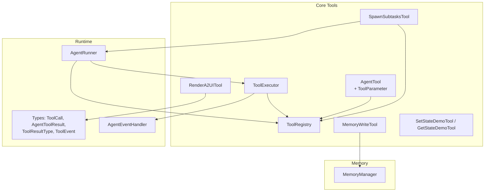

**Diagram sources**
- [base.py:46-160](file://src/ark_agentic/core/tools/base.py#L46-L160)
- [registry.py:14-178](file://src/ark_agentic/core/tools/registry.py#L14-L178)
- [executor.py:29-123](file://src/ark_agentic/core/tools/executor.py#L29-L123)
- [memory.py:39-113](file://src/ark_agentic/core/tools/memory.py#L39-L113)
- [demo_state.py:16-113](file://src/ark_agentic/core/tools/demo_state.py#L16-L113)
- [render_a2ui.py:105-200](file://src/ark_agentic/core/tools/render_a2ui.py#L105-L200)
- [tool.py:61-318](file://src/ark_agentic/core/subtask/tool.py#L61-L318)
- [runner.py:153-200](file://src/ark_agentic/core/runner.py#L153-L200)
- [types.py:70-187](file://src/ark_agentic/core/types.py#L70-L187)
- [manager.py:24-92](file://src/ark_agentic/core/memory/manager.py#L24-L92)

**Section sources**
- [__init__.py:7-53](file://src/ark_agentic/core/tools/__init__.py#L7-L53)
- [runner.py:153-200](file://src/ark_agentic/core/runner.py#L153-L200)

## Core Components
- AgentTool: Abstract base class defining the tool contract, JSON schema generation, and optional LangChain adapter.
- ToolParameter: Declarative parameter schema with JSON Schema conversion.
- ToolRegistry: Central registry for tools with grouping, filtering, and schema generation.
- ToolExecutor: Executes tool calls in parallel with timeouts, error handling, and event dispatch.
- MemoryWriteTool: Writes user memory via MemoryManager with heading-based upsert semantics.
- State tools: Demo tools to read/write session state via result metadata.
- A2UI rendering tool: Unified tool supporting blocks, card templates, and presets.
- Subtask tool: Spawns parallel subtasks with isolated sessions and aggregated results.

**Section sources**
- [base.py:46-160](file://src/ark_agentic/core/tools/base.py#L46-L160)
- [registry.py:14-178](file://src/ark_agentic/core/tools/registry.py#L14-L178)
- [executor.py:29-123](file://src/ark_agentic/core/tools/executor.py#L29-L123)
- [memory.py:39-113](file://src/ark_agentic/core/tools/memory.py#L39-L113)
- [demo_state.py:16-113](file://src/ark_agentic/core/tools/demo_state.py#L16-L113)
- [render_a2ui.py:105-200](file://src/ark_agentic/core/tools/render_a2ui.py#L105-L200)
- [tool.py:61-318](file://src/ark_agentic/core/subtask/tool.py#L61-L318)

## Architecture Overview
The tool system follows a layered design:
- Abstraction: AgentTool defines the interface and parameter schema.
- Registry: ToolRegistry manages tool lifecycles and exposes filtered views.
- Execution: ToolExecutor resolves tools, enforces concurrency/timeouts, and dispatches events.
- Integration: Tools integrate with MemoryManager, SessionManager, and the event bus.
- Composition: Subtask tool composes multiple independent tasks with isolation and aggregation.

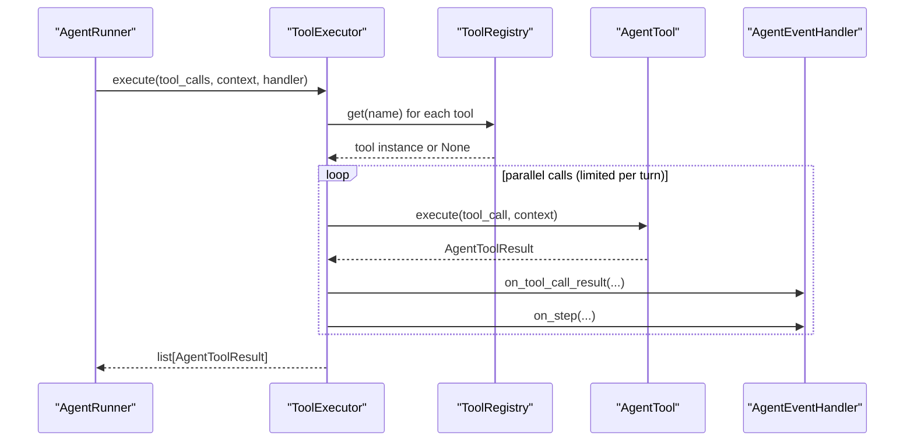

**Diagram sources**
- [runner.py:153-200](file://src/ark_agentic/core/runner.py#L153-L200)
- [executor.py:43-97](file://src/ark_agentic/core/tools/executor.py#L43-L97)
- [registry.py:41-50](file://src/ark_agentic/core/tools/registry.py#L41-L50)
- [types.py:70-187](file://src/ark_agentic/core/types.py#L70-L187)

## Detailed Component Analysis

### AgentTool Base Class and Parameter Helpers
AgentTool defines:
- Required attributes: name, description, parameters.
- Optional attributes: group, requires_confirmation, thinking_hint.
- Methods: get_json_schema(), execute(), to_langchain_tool().
- Parameter helpers: typed readers for strings, integers, floats, booleans, lists, and dicts.

Key behaviors:
- Enforces subclass presence of name and description via __init_subclass__.
- Generates OpenAI-style function schemas from declared parameters.
- Provides a bridge to LangChain’s StructuredTool via to_langchain_tool.

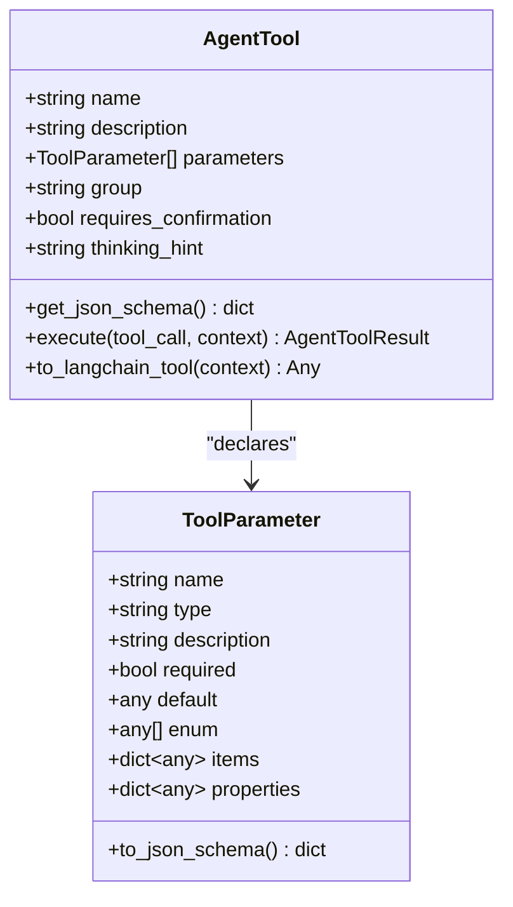

**Diagram sources**
- [base.py:46-160](file://src/ark_agentic/core/tools/base.py#L46-L160)

**Section sources**
- [base.py:46-160](file://src/ark_agentic/core/tools/base.py#L46-L160)

### ToolRegistry: Discovery and Filtering
Responsibilities:
- Register individual or bulk tools.
- Retrieve tools by name or group.
- List names, groups, and schemas.
- Filter tools by allow/deny lists or groups.
- Manage tool groups and enforce uniqueness.

Filtering logic supports:
- Allow-list or deny-list by tool names.
- Allow-list or deny-list by groups.
- Combined filters with exclusion sets.

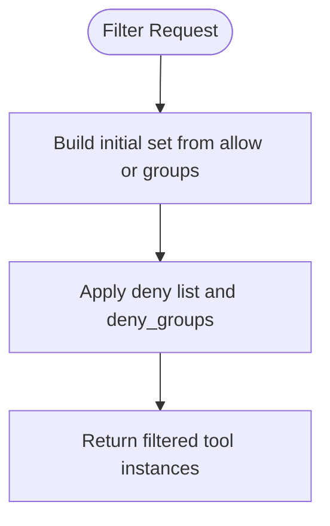

**Diagram sources**
- [registry.py:130-169](file://src/ark_agentic/core/tools/registry.py#L130-L169)

**Section sources**
- [registry.py:14-178](file://src/ark_agentic/core/tools/registry.py#L14-L178)

### ToolExecutor: Execution Patterns and Event Dispatch
Execution characteristics:
- Parallel execution with per-turn limit and global timeout.
- Per-call logging and status updates via thinking_hint and on_step.
- Robust error handling: missing tool, timeout, and exception catching.
- Event dispatch for UI components, custom events, and step updates.

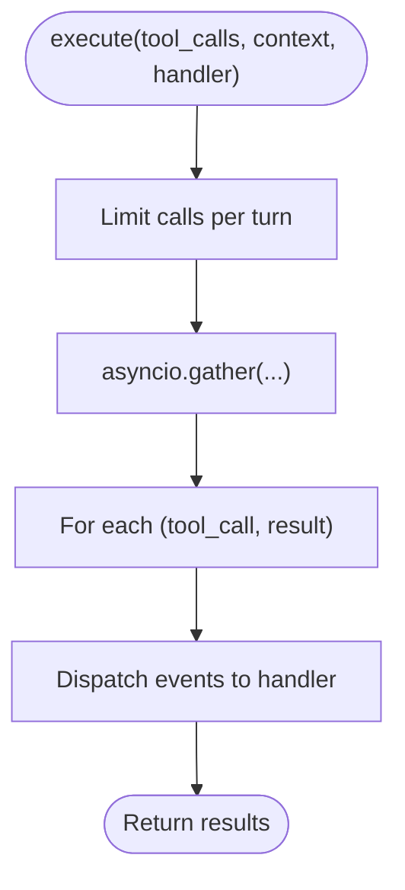

**Diagram sources**
- [executor.py:43-97](file://src/ark_agentic/core/tools/executor.py#L43-L97)

**Section sources**
- [executor.py:29-123](file://src/ark_agentic/core/tools/executor.py#L29-L123)

### Memory Tools: Writing Long-Term User Memory
MemoryWriteTool:
- Validates context for user ID.
- Resolves MemoryManager via provider.
- Performs heading-based upsert with deletion semantics.
- Returns structured JSON results with saved status and metadata.

Integration:
- Requires MemoryManager to be available in the agent runtime.
- Uses heading-based markdown to merge changes.

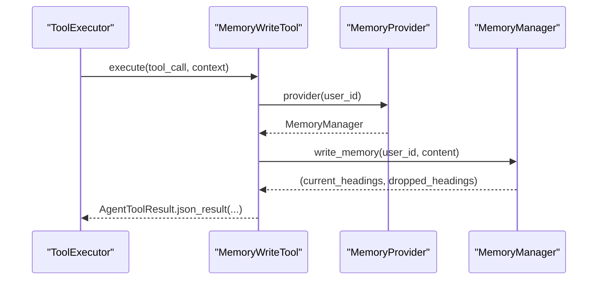

**Diagram sources**
- [memory.py:66-107](file://src/ark_agentic/core/tools/memory.py#L66-L107)
- [manager.py:45-69](file://src/ark_agentic/core/memory/manager.py#L45-L69)

**Section sources**
- [memory.py:39-113](file://src/ark_agentic/core/tools/memory.py#L39-L113)
- [manager.py:24-92](file://src/ark_agentic/core/memory/manager.py#L24-L92)

### State Management Tools: Demo Read/Write
SetStateDemoTool:
- Accepts key/value pairs and returns metadata.state_delta.
- Runner merges delta into session.state after execution.

GetStateDemoTool:
- Reads values from context (session.state injected by Runner).
- Returns found/not-found results.

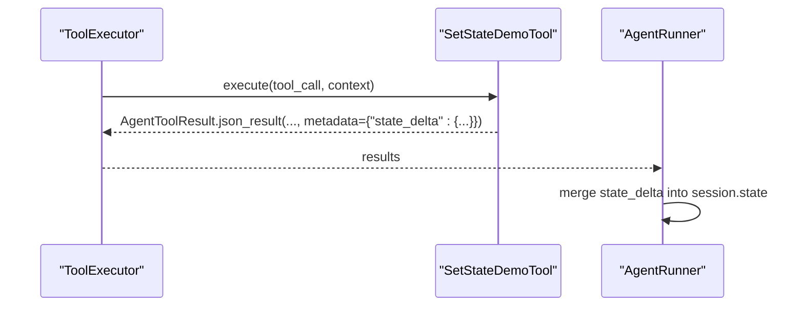

**Diagram sources**
- [demo_state.py:45-64](file://src/ark_agentic/core/tools/demo_state.py#L45-L64)
- [types.py:85-116](file://src/ark_agentic/core/types.py#L85-L116)

**Section sources**
- [demo_state.py:16-113](file://src/ark_agentic/core/tools/demo_state.py#L16-L113)
- [types.py:85-116](file://src/ark_agentic/core/types.py#L85-L116)

### A2UI Rendering Tool: Unified Rendering Paths
RenderA2UITool supports three mutually exclusive modes:
- Blocks: Dynamic composition via block descriptors.
- Card type: Template-driven rendering with extractors.
- Preset type: Lean preset payloads via a registry.

Features:
- Dynamically builds parameters based on enabled configs.
- Routes llm_digest and state_delta into result metadata.
- Emits UIComponentToolEvent automatically for A2UI results.

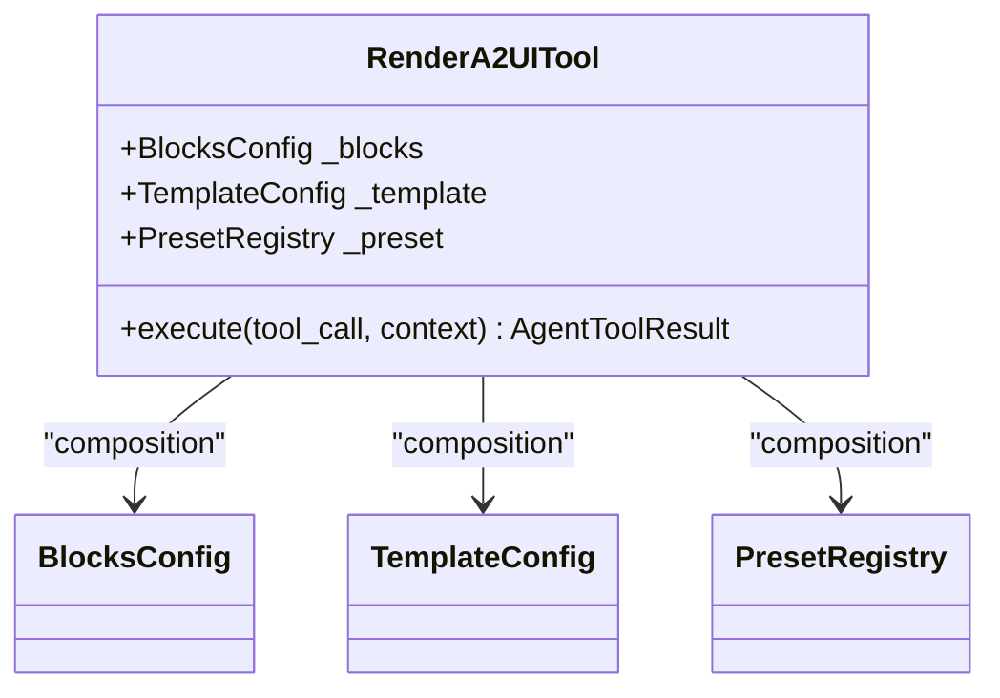

**Diagram sources**
- [render_a2ui.py:105-200](file://src/ark_agentic/core/tools/render_a2ui.py#L105-L200)

**Section sources**
- [render_a2ui.py:105-200](file://src/ark_agentic/core/tools/render_a2ui.py#L105-L200)

### Subtask Tool: Parallel Composition with Isolation
SpawnSubtasksTool:
- Accepts a list of tasks with optional per-task tool allowlists.
- Creates ephemeral sub-sessions with isolation markers.
- Runs subtasks concurrently with semaphores and per-task timeouts.
- Aggregates results, token usage, state deltas, and transcripts.

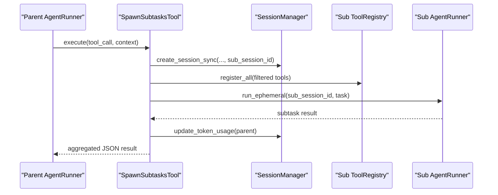

**Diagram sources**
- [tool.py:104-318](file://src/ark_agentic/core/subtask/tool.py#L104-L318)

**Section sources**
- [tool.py:61-318](file://src/ark_agentic/core/subtask/tool.py#L61-L318)

### Tool Lifecycle: Discovery to Execution
End-to-end lifecycle:
- Discovery: ToolRegistry holds all registered tools and generates schemas.
- Selection: Runner selects tools via ToolRegistry.get()/filter() and ToolCall creation.
- Validation: ToolExecutor validates tool existence and applies timeouts.
- Execution: AgentTool.execute() runs with context injection.
- Results: AgentToolResult carries content, type, metadata, and optional events.
- Events: ToolExecutor dispatches UIComponentToolEvent, CustomToolEvent, and StepToolEvent.
- State: Session state updates via metadata.state_delta.

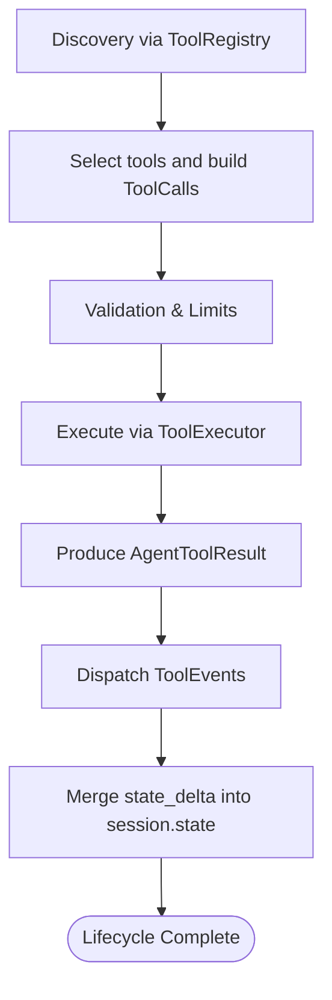

**Diagram sources**
- [registry.py:94-128](file://src/ark_agentic/core/tools/registry.py#L94-L128)
- [executor.py:43-97](file://src/ark_agentic/core/tools/executor.py#L43-L97)
- [types.py:85-187](file://src/ark_agentic/core/types.py#L85-L187)

**Section sources**
- [registry.py:94-128](file://src/ark_agentic/core/tools/registry.py#L94-L128)
- [executor.py:43-97](file://src/ark_agentic/core/tools/executor.py#L43-L97)
- [types.py:85-187](file://src/ark_agentic/core/types.py#L85-L187)

### Practical Examples

- Implementing a custom tool:
  - Define a class inheriting from AgentTool with name, description, parameters, and execute().
  - Use read_*_param helpers for robust argument parsing.
  - Return AgentToolResult variants (json_result, text_result, a2ui_result, error_result).

- Registering tools:
  - Instantiate ToolRegistry and register tools individually or via register_all().
  - Optionally group tools and filter by group during selection.

- Invoking tools:
  - Build ToolCall with id, name, and arguments.
  - Call ToolExecutor.execute() with context and optional handler.

- Using memory tools:
  - Provide a MemoryProvider to MemoryWriteTool constructor.
  - Ensure MemoryManager is available in the runtime.

- Using state tools:
  - Set state via SetStateDemoTool; read via GetStateDemoTool.
  - Verify state_delta is merged into session.state by the Runner.

- A2UI rendering:
  - Configure BlocksConfig, TemplateConfig, or PresetRegistry.
  - Invoke RenderA2UITool to emit UI components or lean presets.

- Subtasks:
  - Provide AgentRunner and SessionManager to SpawnSubtasksTool.
  - Configure concurrency, timeouts, and tool allowlists.

**Section sources**
- [base.py:166-286](file://src/ark_agentic/core/tools/base.py#L166-L286)
- [registry.py:24-40](file://src/ark_agentic/core/tools/registry.py#L24-L40)
- [executor.py:43-97](file://src/ark_agentic/core/tools/executor.py#L43-L97)
- [memory.py:66-107](file://src/ark_agentic/core/tools/memory.py#L66-L107)
- [demo_state.py:45-112](file://src/ark_agentic/core/tools/demo_state.py#L45-L112)
- [render_a2ui.py:105-200](file://src/ark_agentic/core/tools/render_a2ui.py#L105-L200)
- [tool.py:104-318](file://src/ark_agentic/core/subtask/tool.py#L104-L318)

## Dependency Analysis
- Cohesion: Tools encapsulate domain logic; ToolExecutor focuses on execution and event dispatch; ToolRegistry centralizes discovery and filtering.
- Coupling: ToolExecutor depends on ToolRegistry and AgentEventHandler; tools depend on AgentTool and types; specialized tools depend on MemoryManager or SessionManager.
- External integrations: LangChain adapter via to_langchain_tool; A2UI rendering integrates with block composer and preset registry.

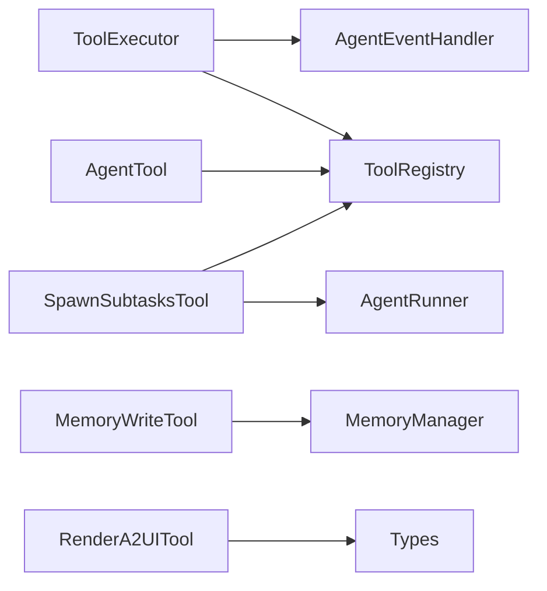

**Diagram sources**
- [base.py:46-160](file://src/ark_agentic/core/tools/base.py#L46-L160)
- [registry.py:14-178](file://src/ark_agentic/core/tools/registry.py#L14-L178)
- [executor.py:29-123](file://src/ark_agentic/core/tools/executor.py#L29-L123)
- [memory.py:39-113](file://src/ark_agentic/core/tools/memory.py#L39-L113)
- [render_a2ui.py:105-200](file://src/ark_agentic/core/tools/render_a2ui.py#L105-L200)
- [tool.py:61-318](file://src/ark_agentic/core/subtask/tool.py#L61-L318)
- [types.py:70-187](file://src/ark_agentic/core/types.py#L70-L187)

**Section sources**
- [base.py:46-160](file://src/ark_agentic/core/tools/base.py#L46-L160)
- [registry.py:14-178](file://src/ark_agentic/core/tools/registry.py#L14-L178)
- [executor.py:29-123](file://src/ark_agentic/core/tools/executor.py#L29-L123)
- [memory.py:39-113](file://src/ark_agentic/core/tools/memory.py#L39-L113)
- [render_a2ui.py:105-200](file://src/ark_agentic/core/tools/render_a2ui.py#L105-L200)
- [tool.py:61-318](file://src/ark_agentic/core/subtask/tool.py#L61-L318)
- [types.py:70-187](file://src/ark_agentic/core/types.py#L70-L187)

## Performance Considerations
- Concurrency limits: ToolExecutor limits concurrent calls per turn to prevent resource exhaustion.
- Timeouts: Per-tool timeout prevents long-running tools from blocking the loop.
- Parallelism: asyncio.gather enables parallel execution; use sparingly and tune max_calls_per_turn.
- Memory writes: Heading-based upsert minimizes I/O; ensure content includes proper headings.
- Subtasks: Semaphore controls concurrency; timeouts protect against runaway subtasks.

[No sources needed since this section provides general guidance]

## Troubleshooting Guide
Common issues and resolutions:
- Tool not found: Ensure tool is registered and name matches ToolCall.name.
- Missing user ID for memory tools: Provide context with "user:id".
- Duplicate registration: ToolRegistry raises on duplicate names.
- Timeout errors: Increase tool_timeout or optimize tool logic.
- State not updating: Verify metadata.state_delta is returned and Runner merges it.
- A2UI rendering failures: Confirm correct mode configuration and valid block/card/preset parameters.

**Section sources**
- [executor.py:77-96](file://src/ark_agentic/core/tools/executor.py#L77-L96)
- [registry.py:26-28](file://src/ark_agentic/core/tools/registry.py#L26-L28)
- [memory.py:24-36](file://src/ark_agentic/core/tools/memory.py#L24-L36)
- [demo_state.py:52-58](file://src/ark_agentic/core/tools/demo_state.py#L52-L58)
- [render_a2ui.py:171-200](file://src/ark_agentic/core/tools/render_a2ui.py#L171-L200)

## Conclusion
The tool system provides a robust, extensible foundation for agent capabilities. Its design emphasizes clear contracts (AgentTool), centralized discovery (ToolRegistry), safe execution (ToolExecutor), and seamless integration with memory, state, and UI rendering. Specialized tools like memory write, state demos, A2UI rendering, and subtasks demonstrate composition patterns and isolation strategies essential for real-world agent applications.

## Appendices

### Tool Registration and Discovery Utilities
- ToolRegistry.get_schemas(): Generate JSON schemas for LLM function calling.
- ToolService (Studio): Lists tools and scaffolds new ones via AST parsing.

**Section sources**
- [registry.py:94-128](file://src/ark_agentic/core/tools/registry.py#L94-L128)
- [tool_service.py:40-177](file://src/ark_agentic/studio/services/tool_service.py#L40-L177)