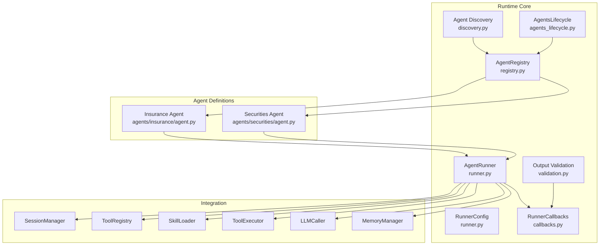
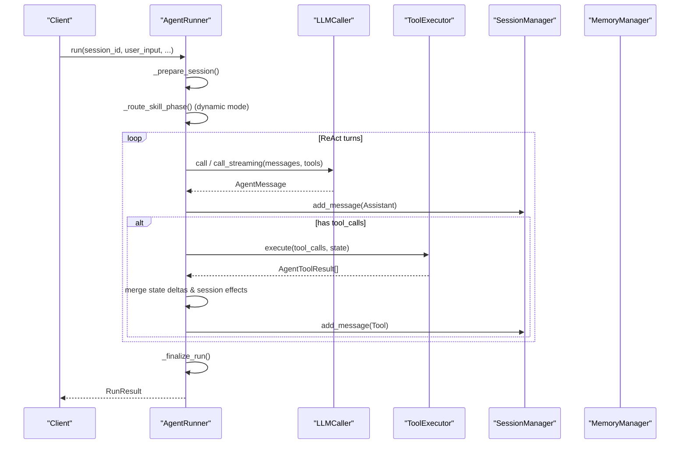
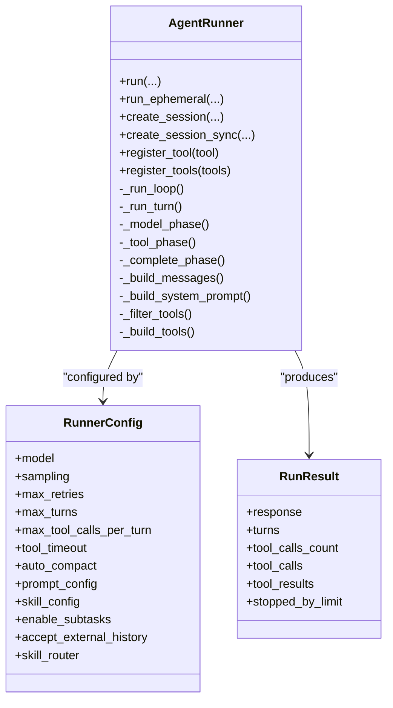
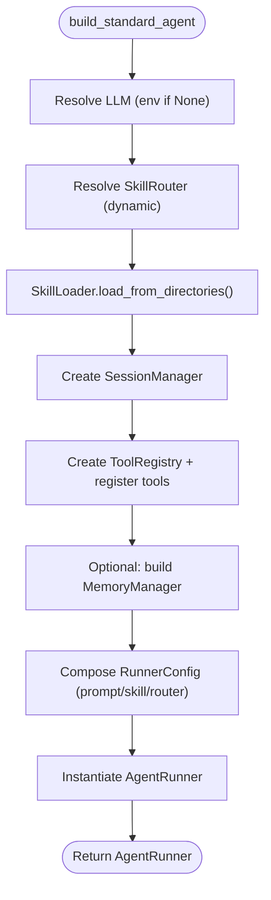
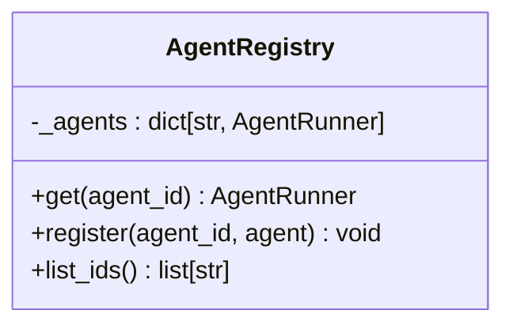
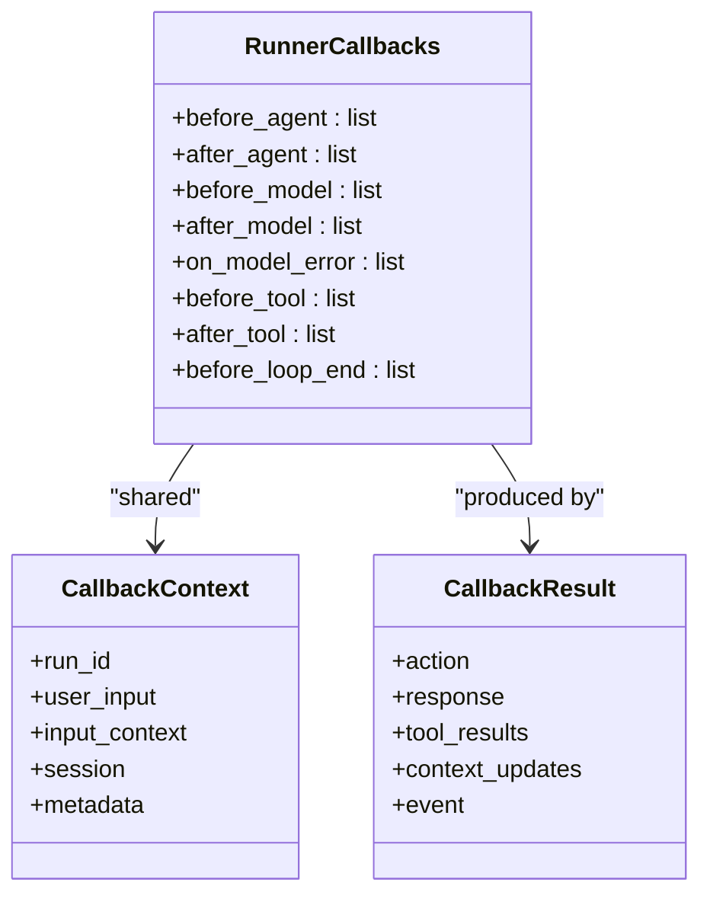
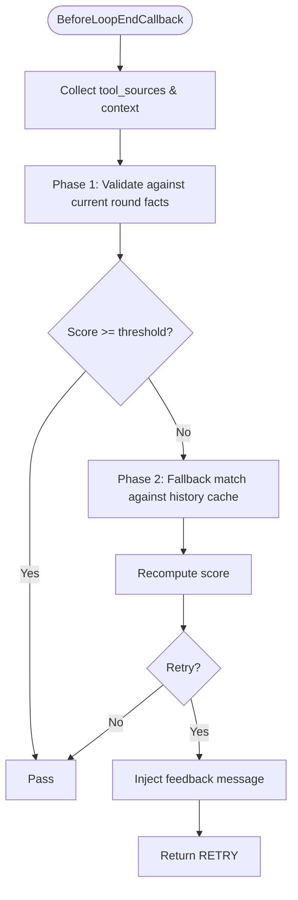
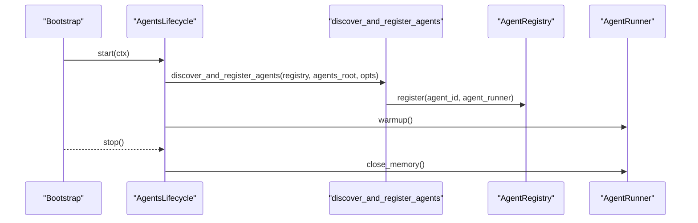
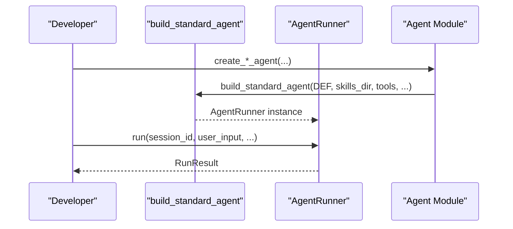
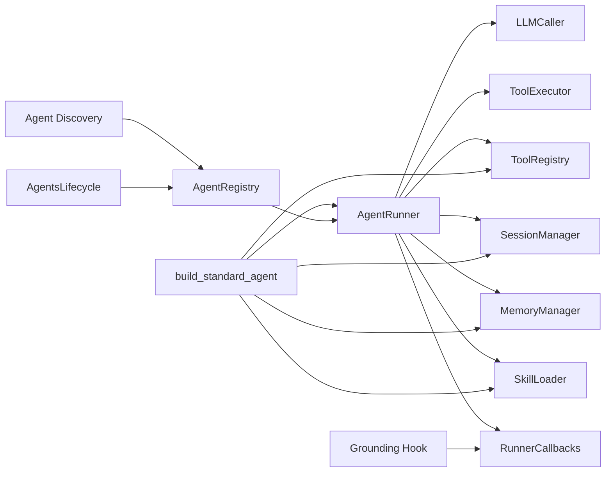

# Agent Runtime Engine

<cite>
**Referenced Files in This Document**
- [runner.py](file://src/ark_agentic/core/runtime/runner.py)
- [factory.py](file://src/ark_agentic/core/runtime/factory.py)
- [registry.py](file://src/ark_agentic/core/runtime/registry.py)
- [callbacks.py](file://src/ark_agentic/core/runtime/callbacks.py)
- [guard.py](file://src/ark_agentic/core/runtime/guard.py)
- [discovery.py](file://src/ark_agentic/core/runtime/discovery.py)
- [validation.py](file://src/ark_agentic/core/runtime/validation.py)
- [agents_lifecycle.py](file://src/ark_agentic/core/runtime/agents_lifecycle.py)
- [agent.py (Insurance)](file://src/ark_agentic/agents/insurance/agent.py)
- [agent.py (Securities)](file://src/ark_agentic/agents/securities/agent.py)
</cite>

## Table of Contents
1. [Introduction](#introduction)
2. [Project Structure](#project-structure)
3. [Core Components](#core-components)
4. [Architecture Overview](#architecture-overview)
5. [Detailed Component Analysis](#detailed-component-analysis)
6. [Dependency Analysis](#dependency-analysis)
7. [Performance Considerations](#performance-considerations)
8. [Troubleshooting Guide](#troubleshooting-guide)
9. [Conclusion](#conclusion)
10. [Appendices](#appendices)

## Introduction
This document explains the agent runtime engine that powers the ReAct decision loop and agent execution framework. It focuses on the AgentRunner orchestrator, the factory pattern for building agents, the registry system for managing multiple agents, and the callback mechanism for event handling. It also covers integration points with storage, observability, and plugin systems, along with practical examples from the codebase, common pitfalls, and performance optimization techniques.

## Project Structure
The runtime engine resides under core/runtime and integrates with session management, tool execution, memory, skills, and observability. Agents are defined under src/ark_agentic/agents and wired via the factory and lifecycle components.

**Diagram sources**
- [runner.py:171-290](file://src/ark_agentic/core/runtime/runner.py#L171-L290)
- [factory.py:59-182](file://src/ark_agentic/core/runtime/factory.py#L59-L182)
- [registry.py:13-29](file://src/ark_agentic/core/runtime/registry.py#L13-L29)
- [discovery.py:50-107](file://src/ark_agentic/core/runtime/discovery.py#L50-L107)
- [agents_lifecycle.py:43-80](file://src/ark_agentic/core/runtime/agents_lifecycle.py#L43-L80)
- [validation.py:495-604](file://src/ark_agentic/core/runtime/validation.py#L495-L604)
- [agent.py (Insurance):47-75](file://src/ark_agentic/agents/insurance/agent.py#L47-L75)
- [agent.py (Securities):72-100](file://src/ark_agentic/agents/securities/agent.py#L72-L100)

**Section sources**
- [runner.py:171-290](file://src/ark_agentic/core/runtime/runner.py#L171-L290)
- [factory.py:59-182](file://src/ark_agentic/core/runtime/factory.py#L59-L182)
- [registry.py:13-29](file://src/ark_agentic/core/runtime/registry.py#L13-L29)
- [discovery.py:50-107](file://src/ark_agentic/core/runtime/discovery.py#L50-L107)
- [agents_lifecycle.py:43-80](file://src/ark_agentic/core/runtime/agents_lifecycle.py#L43-L80)
- [validation.py:495-604](file://src/ark_agentic/core/runtime/validation.py#L495-L604)
- [agent.py (Insurance):47-75](file://src/ark_agentic/agents/insurance/agent.py#L47-L75)
- [agent.py (Securities):72-100](file://src/ark_agentic/agents/securities/agent.py#L72-L100)

## Core Components
- AgentRunner: Implements the ReAct loop, orchestrating LLM calls, tool execution, message processing, and state/session management. It supports streaming, hooks, and observability spans.
- Factory: Provides a convention-over-configuration builder to assemble AgentRunner instances from AgentDef, tools, and runtime options.
- Registry: Manages agent instances keyed by agent_id for lookup and lifecycle orchestration.
- Callbacks: Defines lifecycle hooks and typed events for cross-cutting concerns like auth, validation, and UI updates.
- Validation: Adds post-hoc grounding validation to ensure model answers are grounded in tool outputs and context.
- Discovery and Lifecycle: Dynamically discovers agents from filesystem roots and manages warmup/shutdown.

**Section sources**
- [runner.py:171-290](file://src/ark_agentic/core/runtime/runner.py#L171-L290)
- [factory.py:59-182](file://src/ark_agentic/core/runtime/factory.py#L59-L182)
- [registry.py:13-29](file://src/ark_agentic/core/runtime/registry.py#L13-L29)
- [callbacks.py:98-246](file://src/ark_agentic/core/runtime/callbacks.py#L98-L246)
- [validation.py:196-292](file://src/ark_agentic/core/runtime/validation.py#L196-L292)
- [discovery.py:50-107](file://src/ark_agentic/core/runtime/discovery.py#L50-L107)
- [agents_lifecycle.py:43-80](file://src/ark_agentic/core/runtime/agents_lifecycle.py#L43-L80)

## Architecture Overview
The runtime engine composes several subsystems:
- LLM integration via LLMCaller
- Tool execution via ToolExecutor backed by ToolRegistry
- Session persistence and compaction via SessionManager
- Optional memory and dreaming via MemoryManager
- Skills via SkillLoader and SkillMatcher, optionally routed by SkillRouter
- Observability via tracing decorators and span attributes
- Validation via grounding hooks injected into callbacks

**Diagram sources**
- [runner.py:290-380](file://src/ark_agentic/core/runtime/runner.py#L290-L380)
- [runner.py:684-809](file://src/ark_agentic/core/runtime/runner.py#L684-L809)
- [runner.py:840-977](file://src/ark_agentic/core/runtime/runner.py#L840-L977)
- [runner.py:979-1098](file://src/ark_agentic/core/runtime/runner.py#L979-L1098)
- [runner.py:1100-1116](file://src/ark_agentic/core/runtime/runner.py#L1100-L1116)

## Detailed Component Analysis

### AgentRunner: ReAct Decision Loop Orchestrator
AgentRunner encapsulates the ReAct loop and lifecycle:
- Initialization wires LLMCaller, ToolExecutor, ToolRegistry, SessionManager, optional MemoryManager, and SkillLoader/SkillMatcher.
- run() resolves parameters, prepares session, optionally routes skills, executes the loop, and finalizes.
- _run_loop() enforces max_turns and delegates each turn to _run_turn().
- _run_turn() builds messages and tools, invokes _model_phase(), conditionally _tool_phase(), and _complete_phase().
- _model_phase() triggers before_model/on_model_error/after_model hooks, persists assistant messages, and tracks finish reasons.
- _tool_phase() executes tools, merges state deltas and session effects, persists tool results, and handles STOP actions.
- State/session management includes merging input context, applying dot-path state deltas, and typed session effects.

Key configuration and limits:
- RunnerConfig controls model, sampling, retries, max turns, tool calls per turn, tool timeout, auto-compaction, prompt/skill configs, subtasks, and external history acceptance.
- LoopState accumulates turns, tool counts, and results for the final RunResult.

**Diagram sources**
- [runner.py:78-135](file://src/ark_agentic/core/runtime/runner.py#L78-L135)
- [runner.py:171-290](file://src/ark_agentic/core/runtime/runner.py#L171-L290)
- [runner.py:148-166](file://src/ark_agentic/core/runtime/runner.py#L148-L166)

**Section sources**
- [runner.py:78-135](file://src/ark_agentic/core/runtime/runner.py#L78-L135)
- [runner.py:171-290](file://src/ark_agentic/core/runtime/runner.py#L171-L290)
- [runner.py:684-809](file://src/ark_agentic/core/runtime/runner.py#L684-L809)
- [runner.py:840-977](file://src/ark_agentic/core/runtime/runner.py#L840-L977)
- [runner.py:979-1098](file://src/ark_agentic/core/runtime/runner.py#L979-L1098)
- [runner.py:1100-1116](file://src/ark_agentic/core/runtime/runner.py#L1100-L1116)

### Factory Pattern: build_standard_agent
The factory constructs AgentRunner instances from an AgentDef and runtime parameters:
- Resolves skill router (LLMSkillRouter by default in dynamic mode) and validates compatibility with load mode.
- Loads skills via SkillLoader and logs loaded counts.
- Creates SessionManager with compaction and summarizer.
- Registers tools into ToolRegistry.
- Optionally builds MemoryManager when enabled.
- Composes RunnerConfig with prompt/skill configs and registers subtask tool if enabled.

**Diagram sources**
- [factory.py:59-182](file://src/ark_agentic/core/runtime/factory.py#L59-L182)

**Section sources**
- [factory.py:59-182](file://src/ark_agentic/core/runtime/factory.py#L59-L182)

### Registry System: AgentRegistry
AgentRegistry stores AgentRunner instances keyed by agent_id, enabling lookup and lifecycle management.

**Diagram sources**
- [registry.py:13-29](file://src/ark_agentic/core/runtime/registry.py#L13-L29)

**Section sources**
- [registry.py:13-29](file://src/ark_agentic/core/runtime/registry.py#L13-L29)

### Callback Mechanisms: Lifecycle Hooks and Events
RunnerCallbacks define typed hooks covering:
- Agent-level: before_agent, after_agent
- Loop-level: before_model, after_model, on_model_error, before_tool, after_tool, before_loop_end
- Event dispatching via AgentEventHandler

Callbacks support actions:
- PASS: continue default behavior
- ABORT: reject request early
- OVERRIDE: replace model/tool output/results
- RETRY: inject feedback and continue loop

**Diagram sources**
- [callbacks.py:220-246](file://src/ark_agentic/core/runtime/callbacks.py#L220-L246)
- [callbacks.py:75-93](file://src/ark_agentic/core/runtime/callbacks.py#L75-L93)
- [callbacks.py:58-70](file://src/ark_agentic/core/runtime/callbacks.py#L58-L70)

**Section sources**
- [callbacks.py:98-246](file://src/ark_agentic/core/runtime/callbacks.py#L98-L246)

### Output Validation: Grounding Hook
The validation layer performs post-hoc grounding of the final answer against tool outputs and user context:
- Extracts claims (entities, dates, numbers) from the answer.
- Normalizes facts from tool sources and context.
- Scores groundedness and routes to safe/warn/retry.
- Provides a BeforeLoopEndCallback factory to integrate grounding into the loop.

**Diagram sources**
- [validation.py:495-604](file://src/ark_agentic/core/runtime/validation.py#L495-L604)
- [validation.py:212-292](file://src/ark_agentic/core/runtime/validation.py#L212-L292)

**Section sources**
- [validation.py:196-292](file://src/ark_agentic/core/runtime/validation.py#L196-L292)
- [validation.py:495-604](file://src/ark_agentic/core/runtime/validation.py#L495-L604)

### Agent Discovery and Lifecycle
Agents are discovered from a filesystem root and registered into the AgentRegistry. The lifecycle component:
- Discovers agents under AGENTS_ROOT (or auto-detected fallback)
- Registers each agent package exposing a register(registry, ...) function
- Warms up each agent runner and closes memory on shutdown

**Diagram sources**
- [agents_lifecycle.py:56-80](file://src/ark_agentic/core/runtime/agents_lifecycle.py#L56-L80)
- [discovery.py:50-107](file://src/ark_agentic/core/runtime/discovery.py#L50-L107)

**Section sources**
- [agents_lifecycle.py:43-80](file://src/ark_agentic/core/runtime/agents_lifecycle.py#L43-L80)
- [discovery.py:50-107](file://src/ark_agentic/core/runtime/discovery.py#L50-L107)

### Practical Examples: Agent Configuration and Execution
- Insurance agent: Demonstrates AgentDef with protocol instructions, enables subtasks, and builds a standard agent with tools from the insurance domain.
- Securities agent: Shows context enrichment, authentication checks, and grounding validation hook injection.

**Diagram sources**
- [agent.py (Insurance):47-75](file://src/ark_agentic/agents/insurance/agent.py#L47-L75)
- [agent.py (Securities):72-100](file://src/ark_agentic/agents/securities/agent.py#L72-L100)
- [factory.py:59-182](file://src/ark_agentic/core/runtime/factory.py#L59-L182)

**Section sources**
- [agent.py (Insurance):47-75](file://src/ark_agentic/agents/insurance/agent.py#L47-L75)
- [agent.py (Securities):72-100](file://src/ark_agentic/agents/securities/agent.py#L72-L100)
- [factory.py:59-182](file://src/ark_agentic/core/runtime/factory.py#L59-L182)

## Dependency Analysis
- AgentRunner depends on LLMCaller, ToolExecutor, ToolRegistry, SessionManager, optional MemoryManager, SkillLoader/SkillMatcher, and observability decorators.
- Factory composes these dependencies and ensures conventions for paths and configurations.
- Registry and lifecycle decouple agent instantiation from application bootstrap.
- Validation hooks depend on session state and grounding cache.

**Diagram sources**
- [runner.py:181-254](file://src/ark_agentic/core/runtime/runner.py#L181-L254)
- [factory.py:160-182](file://src/ark_agentic/core/runtime/factory.py#L160-L182)
- [registry.py:13-29](file://src/ark_agentic/core/runtime/registry.py#L13-L29)
- [discovery.py:50-107](file://src/ark_agentic/core/runtime/discovery.py#L50-L107)
- [agents_lifecycle.py:56-80](file://src/ark_agentic/core/runtime/agents_lifecycle.py#L56-L80)
- [validation.py:495-604](file://src/ark_agentic/core/runtime/validation.py#L495-L604)

**Section sources**
- [runner.py:181-254](file://src/ark_agentic/core/runtime/runner.py#L181-L254)
- [factory.py:160-182](file://src/ark_agentic/core/runtime/factory.py#L160-L182)
- [registry.py:13-29](file://src/ark_agentic/core/runtime/registry.py#L13-L29)
- [discovery.py:50-107](file://src/ark_agentic/core/runtime/discovery.py#L50-L107)
- [agents_lifecycle.py:56-80](file://src/ark_agentic/core/runtime/agents_lifecycle.py#L56-L80)
- [validation.py:495-604](file://src/ark_agentic/core/runtime/validation.py#L495-L604)

## Performance Considerations
- Streaming vs non-streaming: Streaming reduces latency for long responses; disable for ephemeral or non-realtime paths.
- Auto-compaction: Enabling auto_compact helps keep context sizes manageable; tune compaction window and preserve_recent.
- Tool timeouts and per-turn limits: Configure tool_timeout and max_tool_calls_per_turn to prevent runaway tool execution.
- Model overrides per run: Use run_options to adjust temperature or model per invocation.
- Memory and dreaming: Enable only when needed; memory operations add overhead and require careful resource management.
- Observation spans: Tracing adds overhead; use selectively in production profiling.

[No sources needed since this section provides general guidance]

## Troubleshooting Guide
Common issues and mitigations:
- Infinite loops: Controlled by max_turns; ensure the loop terminates on final responses or STOP actions.
- Tool failures: All-failed tool batches log warnings; inspect tool results and loop actions; consider RETRY via validation hook.
- Context overflow: LLM errors with CONTEXT_OVERFLOW trigger user-friendly messages; auto-compaction reduces history length.
- Authentication gating: Use before_agent hooks to abort early with UI events for login prompts.
- State corruption: Dot-path state deltas avoid overwriting sibling keys; verify session_effects correctness.

**Section sources**
- [runner.py:714-722](file://src/ark_agentic/core/runtime/runner.py#L714-L722)
- [runner.py:1092-1098](file://src/ark_agentic/core/runtime/runner.py#L1092-L1098)
- [runner.py:900-927](file://src/ark_agentic/core/runtime/runner.py#L900-L927)
- [callbacks.py:98-121](file://src/ark_agentic/core/runtime/callbacks.py#L98-L121)
- [validation.py:586-601](file://src/ark_agentic/core/runtime/validation.py#L586-L601)

## Conclusion
The agent runtime engine provides a robust, extensible foundation for ReAct-style agents. AgentRunner centralizes the decision loop, while the factory and registry streamline agent creation and lifecycle management. Callbacks and validation hooks enable cross-cutting capabilities such as authentication, grounding, and UI integration. With careful configuration of limits, compaction, and memory, the system balances responsiveness with reliability.

[No sources needed since this section summarizes without analyzing specific files]

## Appendices

### Configuration Options and Execution Modes
- RunnerConfig fields: model, sampling, max_retries, max_turns, max_tool_calls_per_turn, tool_timeout, auto_compact, prompt_config, skill_config, enable_subtasks, accept_external_history, skill_router.
- Skill load modes: full (load all skills) and dynamic (route skills deterministically before the loop).
- Run options: per-invocation overrides for model and temperature.

**Section sources**
- [runner.py:78-114](file://src/ark_agentic/core/runtime/runner.py#L78-L114)
- [runner.py:402-415](file://src/ark_agentic/core/runtime/runner.py#L402-L415)
- [factory.py:99-111](file://src/ark_agentic/core/runtime/factory.py#L99-L111)